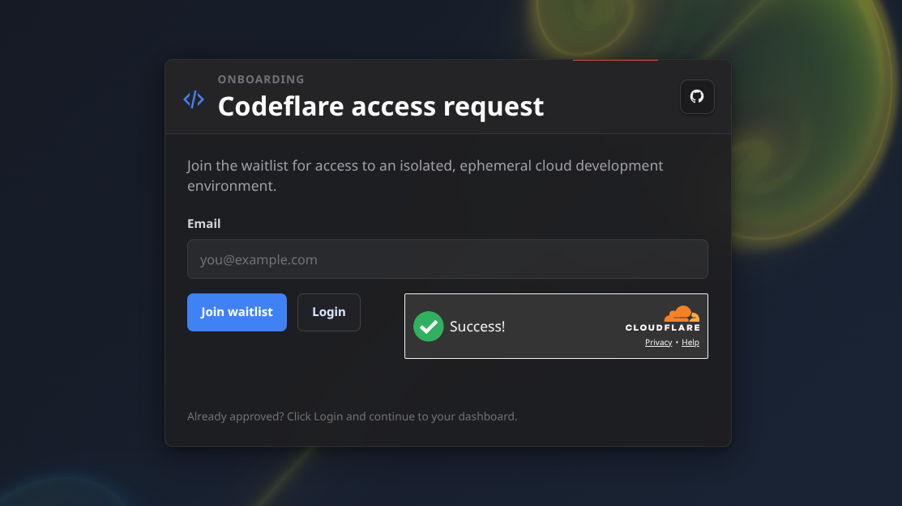
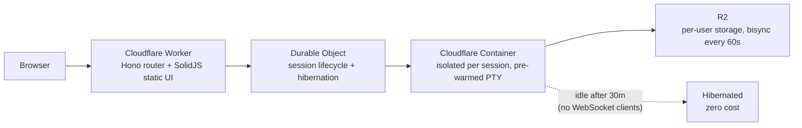

#  Codeflare

You're not sure which AI coding agent is the best. Neither is anyone else. So Codeflare gives you all of them - at the same time. Five agents, six tabs, one browser. No guardrails, no permission prompts, no risk. Every session runs in an isolated container that deletes itself when you're done. Your files persist. Your bad decisions don't.

It runs wherever you happen to find yourself - on the Cloudflare edge that spans the planet, accessible from anything with a browser. Your phone, your tablet, your partner's laptop while they're not looking. Because the best commits in history were made from places without desks.


*Ideas don't care where you are. Five coding agents, any screen with a browser, zero setup. No installs, no configuration, no asking for permission. Open the link and start building.*

Every session comes pre-loaded with your choice of AI coding agent:

| Agent | Description |
|---|---|
| [Claude Code](https://docs.anthropic.com/en/docs/claude-code) | Anthropic's agentic CLI (uses [claude-unleashed](https://github.com/nikolanovoselec/claude-unleashed) behind the scenes for root permission bypass and controlled updates) |
| [Codex](https://github.com/openai/codex) | OpenAI's coding agent |
| [Gemini CLI](https://github.com/google-gemini/gemini-cli) | Google's terminal agent |
| [GitHub Copilot](https://docs.github.com/en/copilot) | GitHub's AI coding agent |
| [OpenCode](https://github.com/opencode-ai/opencode) | Open-source coding agent |
| Bash | For the purists |

<details>
<summary><strong>Why Claude Unleashed under the hood?</strong></summary>
<a id="why-claude-unleashed"></a>

Cloudflare Containers run as root. Claude Code refuses to run with `--dangerously-skip-permissions` as root - even inside an ephemeral container where the root check is protecting a filesystem that won't exist in 30 seconds. Heroic. [Claude Unleashed](https://github.com/nikolanovoselec/claude-unleashed) is a wrapper that politely disagrees with this decision, patching around the restriction at source level. Handles root detection, auto-updates, and mode switching. Pre-installed in every Codeflare container because arguing with your tools is not a productive use of compute. In the UI, it shows up as "Claude Code" - because that's what it is, just without the unnecessary guardrails.

</details>

Codeflare is an ephemeral cloud IDE that runs entirely in your browser. Every session spins up an isolated container on Cloudflare, pre-loads your AI agent of choice, and tears itself down when you're done. Your files persist in R2 storage. The containers don't. Nothing touches your local machine.


*Swipe up/down with the keyboard open to navigate like arrow keys. Swipe left/right to scroll terminal text horizontally.*

It's strongly optimized for mobile - because the best ideas hit while rewatching your favorite show for the 15th time, and your PC is just too far away.

**Try it:** [codeflare.graymatter.ch](https://codeflare.graymatter.ch) (gated behind a waitlist - I'm not an animal)


*Join the waitlist, get approved, log in. No account creation, no password - Cloudflare Access handles it.*

## What you get


*Manage sessions, browse persistent storage, and monitor live resource usage - all from one view.*

- Browser-native terminal with 6 tabs per session and tiling mode - view 2-4 terminals side by side. Once you tile, you don't go back.
- One isolated container per session - agents can't escape their sandbox (I checked)
- Persistent R2 storage with bisync every 60s - even if a session dies before you `git push`, R2 has got your back. Sync conflicts? Cleaned up automatically next cycle.
- Pre-warmed terminals - the agent is already loaded when you open the tab, not staring at a blank screen wondering if something broke
- Fast Start - auto-updates disabled by default across all 5 tools for instant agent startup. Toggle it in Settings if you prefer bleeding edge over fast boot.
- Set your API key once. It syncs across sessions forever. (It's rclone, but magic sounds better.)
- Dashboard for managing sessions, browsing files, and inviting users (or revoking them when they get too creative). Live CPU/memory/disk metrics per session. Three-color status: green (active), yellow (idle but alive), gray (stopped).
- Scales to zero when idle. You pay for what you use. Nothing when you don't.

## Architecture


*Six terminal tabs, split tiling, and your favorite dev tools - running in a disposable container you didn't have to configure.*



Containers scale to zero when idle (no sessions = no bill). Storage persists. Auth is handled by Cloudflare Access - no custom login pages, no token management, no OAuth dance.

## Setup

Four steps. Shorter than most cookie consent forms.

### 1. Fork this repo

You know how.

### 2. Set secrets

In your fork: `Settings` > `Secrets and variables` > `Actions` > `New repository secret`

**Secrets** (required):
- `CLOUDFLARE_API_TOKEN` - see [token scopes](#api-token-scopes) below
- `CLOUDFLARE_ACCOUNT_ID` - find it on any zone's overview page in the Cloudflare dashboard

Add each as a separate secret. Name goes in the **Name** field, value in **Secret**. Click **Add secret** after each one.

**Secrets** (optional - for E2E testing):
- `CF_ACCESS_CLIENT_ID` - CF Access service token client ID
- `CF_ACCESS_CLIENT_SECRET` - CF Access service token client secret

### 3. Deploy

Go to your fork: `Actions` > `Deploy` > `Run workflow` > Branch: `main` > **Run workflow**. GitHub Actions builds, tests, and deploys to Cloudflare Workers. Takes about 2 minutes - go grab a coffee.

Future deploys are automatic on every push to `main`.

### 4. Run the setup wizard

Find your worker URL: [dash.cloudflare.com](https://dash.cloudflare.com/) > `Compute` > `Workers & Pages` > your worker name (default: `codeflare`). If you didn't set `CLOUDFLARE_WORKER_NAME`, your URL is `codeflare.<your-user>.workers.dev`. Open it - the onboarding wizard takes over and walks you through:
- Verifying your token and account access
- Configuring a custom domain and allowed users
- Creating Cloudflare Access policies (handles auth so you don't have to)

That's it. You're live. No Kubernetes. No Terraform. No existential crisis. You'll need an active subscription to at least one of the supported coding agents - log in directly from the terminal.

<details>
<summary><strong>API token scopes</strong></summary>
<a id="api-token-scopes"></a>

Go to [dash.cloudflare.com/profile/api-tokens](https://dash.cloudflare.com/profile/api-tokens) and create a custom token. Yes, it's a lot of scopes. No, I'm not mining crypto with them (or am I?).

### Required

The minimum permissions for Codeflare to deploy and run. Every scope earns its keep:

| Scope | Permission | Access | Why |
|---|---|---|---|
| Account | Account Settings | Read | Setup wizard reads account metadata |
| Account | Workers Scripts | Edit | Deploys the Worker |
| Account | Workers KV Storage | Edit | Session metadata and configuration |
| Account | Workers R2 Storage | Edit | Per-user persistent file storage |
| Account | Containers | Edit | Manages ephemeral session containers |
| Account | Access: Apps and Policies | Edit | Creates the Access application that gates `/app` and `/api` |
| Account | Access: Organizations, Identity Providers, and Groups | Edit | Creates admin and user groups for access control |
| Zone | Zone | Read | Discovers your domain for custom domain setup |
| Zone | DNS | Edit | Adds DNS records for the custom domain |
| Zone | Workers Routes | Edit | Routes your domain to the Worker |
| Account | API Tokens | Edit | Creates per-user scoped R2 tokens for bucket access |

### Optional

| Scope | Permission | Access | Why |
|---|---|---|---|
| Account | Turnstile | Edit | Only needed when `ONBOARDING_LANDING_PAGE=active` - adds bot protection to the public waitlist page |

</details>

<details>
<summary><strong>Configuration</strong></summary>

All optional. The defaults work out of the box. I respect your time.

| Variable | Default | What it does |
|---|---|---|
| `CLOUDFLARE_WORKER_NAME` | `codeflare` | Worker name and Access group prefix |
| `RESSOURCE_TIER` | unset (1 vCPU, 3 GiB RAM) | Container size: `low` (0.25 vCPU, 1 GiB) or `high` (2 vCPU, 6 GiB). Spelling is intentional - matches the Cloudflare API naming. |
| `ONBOARDING_LANDING_PAGE` | `inactive` | Set to `active` for a public waitlist at `/` (requires Turnstile + `RESEND_API_KEY` secret) |
| `RUNNER` | `ubuntu-latest` | GitHub Actions runner |
| `CLAUDE_UNLEASHED_CACHE_BUSTER` | `inactive` | Set to `active` to force-reinstall the AI agent layer on every deploy |
| `MAX_SESSIONS_USER` | `3` | Max concurrent running sessions per regular user |
| `MAX_SESSIONS_ADMIN` | `10` | Max concurrent running sessions per admin user |
| `E2E_BASE_URL` | unset | Custom domain URL for E2E tests (e.g., `https://codeflare.example.com`) |

</details>

## Security

- Every session runs in its own container. No shared shells, no cross-session access. Your agent can `rm -rf /` and the only victim is itself.
- AI agents run with full terminal access *inside* the container - and can't get out. I gave them root and a sandbox. They got root in a sandbox.
- Cloudflare Access gates all authenticated surfaces (`/app`, `/api`, `/setup`) with JWT verification.
- API tokens never enter the container. Secrets stay in GitHub and Cloudflare. The agent doesn't know your passwords, and frankly, it doesn't want to.
- Security headers: HSTS, CSP, X-Frame-Options, Referrer-Policy on every response.
- Rate limiting: KV-backed, per-user limits on session creation, container starts, and WebSocket connections. Returns 429 with `Retry-After` header when exceeded.
- Input validation: Zod schemas, 64 KiB body limit.
- Supply chain: CodeQL (with Copilot Autofix), OSSF Scorecard, `npm audit`, dependency review, Dependabot, Trivy container scanning.
- Automated penetration testing: weekly CI workflow validates auth gate, security headers, TLS configuration, injection resistance, and information disclosure. See [PENTEST.md](PENTEST.md) for the latest report.
- GitHub security: secret scanning, push protection, private vulnerability reporting, dependency graph.
- For vulnerability reporting, see [SECURITY.md](SECURITY.md).

## Testing

See `TECHNICAL.md` Section 16 for test suite details, counts, and configuration.

```bash
npm test                           # Backend tests
cd web-ui && npm test              # Frontend tests
cd host && npm test                # Host tests (prewarm, activity tracker)
npm run test:e2e:api               # E2E API (requires deployed worker)
npm run test:e2e:ui                # E2E UI desktop (requires deployed worker)
npm run test:e2e:ui-desktop        # E2E UI desktop (alias)
npm run test:e2e:ui-mobile         # E2E UI mobile
```

E2E tests require a deployed worker and CF Access service tokens. See `TECHNICAL.md` Section 16 for setup details.

## CI/CD

Seven GitHub Actions workflows:

| Workflow | Trigger | Purpose |
|----------|---------|---------|
| `deploy.yml` | Push to `main` / manual | Tests + Docker build + Trivy scan + deploy |
| `test.yml` | Pull requests | Lint, tests, typecheck, security audit, dependency review |
| `e2e.yml` | Manual | E2E matrix: API, UI desktop, UI mobile |
| `codeql.yml` | Push, PRs, weekly | CodeQL static analysis |
| `scorecard.yml` | Push to `main`, weekly, manual | OSSF Scorecard |
| `fuzz.yml` | PRs, weekly, manual | Property-based fuzzing (fast-check) |
| `pentest.yml` | Weekly (Monday 5am UTC), manual | Automated external penetration testing |

See `TECHNICAL.md` Section 15 for full CI/CD documentation.

## Docs

- `TECHNICAL.md` - deep dive into architecture, container lifecycle, and sync model
- `tutorials/Getting Started.md` - what you can do and why you should want to. Tabs, tiling, file persistence, and three paths forward depending on how much hand-holding you need.
- `tutorials/Examples/` - spec-driven project examples from Hello World to full blog platform. Hand one to your agent and go do something more interesting.

<details>
<summary><strong>Local development</strong></summary>

```bash
npm install
cd web-ui && npm install && cd ..
npm run dev
```

</details>

## License

PolyForm Noncommercial 1.0.0 - free for personal use, tinkering, and showing off.

Commercial use, resale, or paid hosted offerings require a separate written license. You know who you are.

<details>
<summary><strong>Common gotchas</strong></summary>

### Cloudflare WAF blocking API requests

If you're on a Cloudflare Pro plan (or higher) with Managed Rulesets enabled on your zone, Cloudflare's WAF may decide your perfectly legitimate API calls look like an attack. Congratulations - your own security product is protecting you from yourself.

Symptoms: a wall of HTML appearing in your terminal where a simple "session deleted" confirmation should be. The HTML helpfully informs you that you have been blocked, as if you didn't notice.

Fix: go to **Security** > **Analytics** > **Events** in your Domain configuration, find the blocked request (you will see "Action taken: Block"), click the rule that triggered it, disable it. Three clicks. Fewer clicks than it took Cloudflare to block you.

</details>
