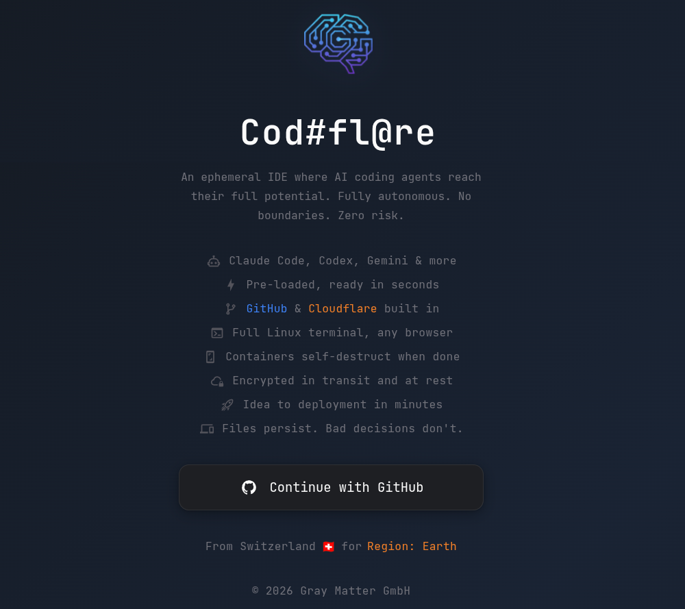
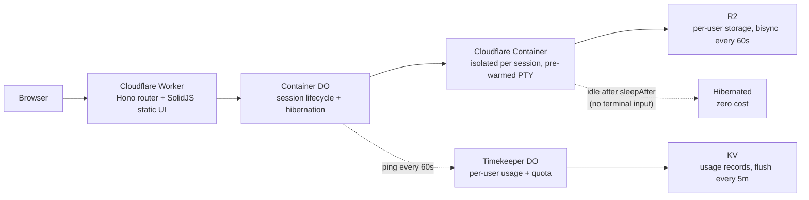

#  Codeflare



An ephemeral IDE where AI coding agents reach their full potential. Fully autonomous, no boundaries, zero risk. Every session runs in an isolated container on Cloudflare's edge. Your files persist. Your bad decisions don't.

It runs wherever you happen to find yourself - on the Cloudflare edge that spans the planet, accessible from anything with a browser. Your phone, your tablet, your partner's laptop while they're not looking. Because the best commits in history were made from places without desks.


*Ideas don't care where you are. Any screen with a browser, zero setup. No installs, no configuration, no asking for permission. Open the link and start building.*

Every session comes pre-loaded with your choice of AI coding agent:

| Agent | Description |
|---|---|
| [Claude Code](https://docs.anthropic.com/en/docs/claude-code) | Anthropic's agentic CLI (runs with `IS_SANDBOX=1` + `--dangerously-skip-permissions` for root container support) |
| [Codex](https://github.com/openai/codex) | OpenAI's coding agent |
| [Gemini CLI](https://github.com/google-gemini/gemini-cli) | Google's terminal agent |
| [GitHub Copilot](https://docs.github.com/en/copilot) | GitHub's AI coding agent |
| [OpenCode](https://github.com/opencode-ai/opencode) | Open-source coding agent |
| Bash | For the purists |

*Pro mode features (knowledge graph, curated skills, advanced workflows) are primarily designed for Claude Code. Other agents receive rules and agent definitions but may not support all Pro capabilities.*

<details>
<summary><strong>How does Claude Code run as root?</strong></summary>

Cloudflare Containers run as root. Claude Code normally refuses `--dangerously-skip-permissions` as root. The official workaround is setting `IS_SANDBOX=1`, which tells the CLI it's running in a sandboxed environment. Combined with `--dangerously-skip-permissions`, this gives fully autonomous operation without permission prompts. No wrapper, no patcher, no hacks -- just an environment variable that Anthropic's own engineers documented for this exact use case.

</details>

Codeflare is an ephemeral cloud IDE that runs entirely in your browser. Every session spins up an isolated container on Cloudflare, pre-loads your AI agent of choice, and tears itself down when you're done. Your files persist in R2 storage. The containers don't. Nothing touches your local machine.


*Swipe up/down with the keyboard open to navigate like arrow keys. Swipe left/right to scroll terminal text horizontally.*

It's strongly optimized for mobile - because the best ideas hit while rewatching your favorite show for the 15th time, and your PC is just too far away.

**Try it:** [codeflare.ch](https://codeflare.ch)

## From idea to live in minutes

Codeflare is built for Cloudflare. Not adapted, not ported - built on it, for it.

- **Native GitHub integration** - connect your GitHub account once. Every session gets automatic `git push`, `gh` CLI, and CI/CD access. No SSH keys, no token juggling, no manual auth per session.
- **Native Cloudflare integration** - connect your Cloudflare account once. Deploy Workers, manage D1 databases, R2 storage, KV namespaces, and DNS - all from the terminal, already authenticated.
- **Specialized skills for build, push, and deploy** - pre-loaded agent skills know how to create Cloudflare Workers projects, configure `wrangler.toml`, push to GitHub, set up CI workflows, and deploy to production. Tell the agent what you want. It builds, pushes, and deploys.
- **Guided onboarding** - new users get walked through connecting GitHub, Cloudflare, and choosing a coding agent. No prior Cloudflare knowledge required.


*Connect your accounts and pick a coding agent. No prior Cloudflare or GitHub knowledge required.*

- **Go from idea to live on Cloudflare in minutes** - describe what you want, the agent builds it, pushes to GitHub, deploys to Cloudflare Workers. You get a live URL. The whole loop happens in one terminal session on your phone or anywhere else.

## What you get


*Manage sessions, browse persistent storage, and monitor live resource usage - all from one view.*

- Browser-native terminal with 6 tabs per session and tiling mode - view 2-4 terminals side by side. Once you tile, you don't go back.
- One isolated container per session - agents can't escape their sandbox (I checked)
- Persistent R2 storage with bisync every 60s - even if a session dies before you `git push`, R2 has got your back. Sync conflicts? Cleaned up automatically next cycle.
- Pre-warmed terminals - the agent is already loaded when you open the tab, not staring at a blank screen wondering if something broke
- Fast Start - auto-updates disabled by default across all 6 tools for instant agent startup. Toggle it in Settings if you prefer bleeding edge over fast boot.
- Set your API key once. It syncs across sessions forever. (It's rclone, but magic sounds better.)
- Push & Deploy - connect your GitHub and Cloudflare accounts once in Settings. Every session gets automatic auth. No more pasting tokens into terminals like it's 2019.
- Dashboard for managing sessions, browsing files, and inviting users (or revoking them when they get too creative). Live CPU/memory/disk metrics per session. Three-color status: green (active), yellow (idle but alive), gray (stopped).
- Usage dashboard - track daily and monthly compute hours, see quota remaining, per-user Timekeeper Durable Object accumulates seconds and flushes to KV every 5 minutes.
- Configurable auto-sleep - containers stop after a period of inactivity (no terminal input). Choose 5m, 15m, 30m, 1h, or 2h in Settings. Free tier is locked to 15m. Sleep is input-aware: the timer only resets when you actually type something, not on WebSocket reconnects or background polls.
- CPU cost scales to zero when idle. You pay for what you use. Nothing when you don't.

## Architecture


*Six terminal tabs, split tiling, and your favorite dev tools - running in a disposable container you didn't have to configure.*



Containers scale to zero when idle (no sessions = no bill). Storage persists. A per-user Timekeeper Durable Object tracks compute usage and enforces monthly quotas. Auth is handled by Cloudflare Access or GitHub OIDC (SaaS mode) — one-click login, automatic user provisioning, and admin approval workflow.

## Setup

Four steps. Shorter than most cookie consent forms.

### 1. Fork this repo

You know how.

### 2. Set secrets

In your fork: `Settings` > `Secrets and variables` > `Actions` > `New repository secret`

**Secrets** (required):
- `CLOUDFLARE_API_TOKEN` - see [token scopes](#api-token-scopes) below
- `CLOUDFLARE_ACCOUNT_ID` - find it on any zone's overview page in the Cloudflare dashboard

Add each as a separate secret. Name goes in the **Name** field, value in **Secret**. Click **Add secret** after each one.

### 3. Deploy

Go to your fork: `Actions` > `Deploy` > `Run workflow` > Branch: `main` > **Run workflow**. GitHub Actions builds, tests, and deploys to Cloudflare Workers. Takes about 2 minutes - go grab a coffee.

Future deploys are automatic on every push to `main`.

### 4. Run the setup wizard

Find your worker URL: [dash.cloudflare.com](https://dash.cloudflare.com/) > `Compute` > `Workers & Pages` > your worker name (default: `codeflare`). If you didn't set `CLOUDFLARE_WORKER_NAME`, your URL is `codeflare.<your-user>.workers.dev`. Open it - the onboarding wizard takes over and walks you through:
- Verifying your token and account access
- Configuring a custom domain and allowed users
- Setting up authentication (Cloudflare Access for all modes; SaaS mode can use GitHub OAuth instead)

That's it. You're live. No Kubernetes. No Terraform. No existential crisis. You'll need an active subscription to at least one of the supported coding agents - log in directly from the terminal.

<details>
<summary><strong>API token scopes</strong></summary>
<a id="api-token-scopes"></a>

Go to [dash.cloudflare.com/profile/api-tokens](https://dash.cloudflare.com/profile/api-tokens) and create a custom token. Yes, it's a lot of scopes. No, I'm not mining crypto with them (or am I?).

### Required

The minimum permissions for Codeflare to deploy and run. Every scope earns its keep:

| Scope | Permission | Access | Why |
|---|---|---|---|
| Account | Account Settings | Read | Setup wizard reads account metadata |
| Account | Workers Scripts | Edit | Deploys the Worker |
| Account | Workers KV Storage | Edit | Session metadata and configuration |
| Account | Workers R2 Storage | Edit | Per-user persistent file storage |
| Account | Containers | Edit | Manages ephemeral session containers |
| Account | Access: Apps and Policies | Edit | Creates the Access application that gates `/app` and `/api` |
| Account | Access: Organizations, Identity Providers, and Groups | Edit | Creates admin and user groups for access control |
| Zone | Zone | Read | Discovers your domain for custom domain setup |
| Zone | DNS | Edit | Adds DNS records for the custom domain |
| Zone | Workers Routes | Edit | Routes your domain to the Worker |
| Account | API Tokens | Edit | Creates per-user scoped R2 tokens for bucket access |

### Optional

| Scope | Permission | Access | Why |
|---|---|---|---|
| Account | Turnstile | Edit | Needed when `ONBOARDING_LANDING_PAGE=active` or `SAAS_MODE=active` - adds bot protection to the public waitlist page, subscribe form, and access request form |

</details>

<details>
<summary><strong>Configuration</strong></summary>

**Default mode needs zero configuration** beyond the two secrets in step 2 above. Everything below is optional.

Variables and secrets are set in your fork under `Settings` → `Secrets and variables` → `Actions`. **Vars** go under the Variables tab, **secrets** under Secrets. **Env secrets** are per-environment: `Settings` → `Environments` → select environment → `Environment secrets`.

---

#### General (all modes, all optional)

| Variable | Where | Default | What it does |
|---|---|---|---|
| `CLOUDFLARE_WORKER_NAME` | var | `codeflare` | Worker name, R2 bucket prefix, and CF Access group prefix. Set to a unique name when running multiple instances on the same account |
| `RESSOURCE_TIER` | var | unset | Container instance **size** only. `low`: 0.25 vCPU, 1 GiB, 4 GB. `default`/`saas`: 1 vCPU, 3 GiB, 8 GB. `high`: 2 vCPU, 6 GiB, 8 GB. Independent of `SAAS_MODE` and `MAX_INSTANCES` — combine freely (e.g., `RESSOURCE_TIER=high` + `SAAS_MODE=active` + `MAX_INSTANCES=500`) |
| `MAX_INSTANCES` | var | unset | Max concurrent container instances (default: 10). Set per environment (e.g., 10 for staging, 1400 for production). Must be a positive integer. Independent of `RESSOURCE_TIER` |
| `MAX_SESSIONS_USER` | var | `3` | Max concurrent running sessions per regular user. Set to any number (e.g., `5`). Ignored in SaaS mode — tier config controls session limits instead |
| `MAX_SESSIONS_ADMIN` | var | `10` | Max concurrent running sessions per admin. Set to any number. Ignored in SaaS mode — tier config controls session limits instead |
| `ENCRYPTION_KEY` | secret | unset | AES-256 key for encrypting API keys in KV and files in R2 (SSE-C). Must be exactly 32 bytes of random data, base64-encoded. Generate: `openssl rand -base64 32`. When unset, credentials are stored as plaintext |
| `RUNNER` | var | `ubuntu-latest` | GitHub Actions runner for CI/CD workflows. Set to a custom runner label if you use self-hosted runners |
| `CLAUDE_CODE_CACHE_BUSTER` | var | unset | Set to `active` to force Docker to reinstall the AI agent layer (@anthropic-ai/claude-code) on every deploy, bypassing the Docker cache. Useful after agent updates. When unset or any other value, the cached layer is reused for faster builds |
| `STRESS_TEST_MODE` | var | unset | Set to `active` to bypass ALL rate limits (HTTP, WebSocket, container start). For integration/stress testing only. **Never set to `active` in production** — it disables all rate limiting |

#### Onboarding mode

Set `ONBOARDING_LANDING_PAGE` to `active` to show a public waitlist landing page at `/`. The setup wizard auto-creates Turnstile CAPTCHA keys using your Cloudflare API token — you do not need to configure Turnstile manually.

| Variable | Where | When needed | What it does |
|---|---|---|---|
| `ONBOARDING_LANDING_PAGE` | var | set to `active` to enable | Shows a public waitlist page at `/` with Turnstile CAPTCHA. When unset or `inactive`, the root URL redirects to `/app/` |
| `RESEND_API_KEY` | secret | recommended | [Resend](https://resend.com) API key for sending welcome emails when users sign up via the waitlist. When unset, signups still work but no confirmation email is sent. Get your key at `resend.com/api-keys` |
| `RESEND_EMAIL` | secret | optional | Sender email address for outgoing emails (e.g., `Codeflare <hello@yourdomain.com>`). When unset, defaults to `Codeflare <onboarding@resend.dev>`. Must be a verified sender in your Resend account |

#### SaaS mode

Set `SAAS_MODE` to `active` for the full SaaS experience: custom GitHub login page, guided onboarding, subscription tiers, Stripe billing, and per-user usage tracking. Set `MAX_INSTANCES` to your desired concurrency (e.g., 1400). Turnstile keys are auto-created by the setup wizard.

| Variable | Where | When needed | What it does |
|---|---|---|---|
| `SAAS_MODE` | var | set to `active` to enable | Activates custom login page, JIT user provisioning, 8-tier subscription system, usage tracking via Timekeeper DO, and admin management at `/admin/users`. When unset or `inactive`, all users get unlimited access via CF Access |
| `RESEND_API_KEY` | secret | recommended | Same Resend API key as onboarding. In SaaS mode, also sends: subscription confirmations, plan change notifications, and tier change alerts to admins. Renewal/payment emails are handled by Stripe native customer emails. When unset, all email notifications are silently skipped |
| `OAUTH_CLIENT_ID` | env var | **recommended** | GitHub OAuth App client ID (public value). Enables direct GitHub login — free for unlimited users. Create an OAuth App at `github.com/settings/developers` with callback URL `https://{your-domain}/auth/github/callback`. When unset, the setup wizard configures Cloudflare Access instead (free for 50 users, $3/user/month after that) |
| `OAUTH_CLIENT_SECRET` | env secret | **required** when `OAUTH_CLIENT_ID` is set | GitHub OAuth App client secret. Copied from the OAuth App page after clicking "Generate a new client secret". Server-side only — never exposed to the browser |
| `OAUTH_JWT_SECRET` | env secret | **required** when `OAUTH_CLIENT_ID` is set | HMAC-SHA256 signing key for the `codeflare_session` cookie. Must be at least 32 bytes of random data, base64-encoded. Generate: `openssl rand -base64 32`. When this secret is rotated, all active sessions expire and users must re-login |
| `STRIPE_SECRET_KEY` | secret | optional | Stripe API key for paid subscriptions. Use `sk_test_...` for sandbox or `sk_live_...` for production. When unset, all subscription tiers are free (no billing). Get your key at `dashboard.stripe.com/apikeys` |
| `STRIPE_WEBHOOK_SECRET` | secret | **required** when `STRIPE_SECRET_KEY` is set | Stripe webhook signing secret (`whsec_...`). Created when you add a webhook endpoint in the Stripe Dashboard at `dashboard.stripe.com/webhooks` pointing to `https://{your-domain}/public/stripe/webhook`. Events: `checkout.session.completed`, `customer.subscription.updated`, `customer.subscription.deleted`. Stripe Price metadata (`tier`, `mode`) must be set on all prices |
| `SAAS_EXTRA_IDPS` | var | optional | Comma-separated Cloudflare Access Identity Provider UUIDs to show on the login page alongside GitHub (e.g., custom OIDC/SAML providers). Only applies when using CF Access authentication (not GitHub OIDC). When unset, only GitHub is shown |

#### E2E testing

E2E tests authenticate via the `X-Service-Auth` header. Set **one** of the two secrets below depending on your auth mode. The deploy workflow injects it as `SERVICE_AUTH_SECRET` on the Worker. When neither is set, the service auth path is disabled and no one can authenticate via `X-Service-Auth` (safe by design).

| Variable | Where | When needed | What it does |
|---|---|---|---|
| `CF_ACCESS_CLIENT_ID` | env secret | CF Access mode only | CF Access service token client ID. Create a service token at `Zero Trust → Access → Service Auth → Service Tokens`. The E2E tests send this as the `CF-Access-Client-Id` header to pass the CF Access gateway |
| `CF_ACCESS_CLIENT_SECRET` | env secret | CF Access mode only | CF Access service token client secret. Also deployed as the Worker's `SERVICE_AUTH_SECRET`. E2E tests send it as both `CF-Access-Client-Secret` (CF Access gateway) and `X-Service-Auth` (Worker auth) headers |
| `OAUTH_E2E_TEST_SECRET` | env secret | GitHub OIDC mode only | Random secret for E2E auth when CF Access is not configured. Generate: `openssl rand -base64 32`. Deployed as the Worker's `SERVICE_AUTH_SECRET`. E2E tests send it as the `X-Service-Auth` header only (no CF Access headers needed) |
| `E2E_BASE_URL` | var | optional | Full URL of your integration environment for E2E tests (e.g., `https://codeflare.novoselec.ch`). When unset, E2E tests derive the URL from the worker name |

> **Note:** Turnstile CAPTCHA keys (`TURNSTILE_SITE_KEY` / `TURNSTILE_SECRET_KEY`) are **auto-created** by the setup wizard using your Cloudflare API token. You do not need to set them manually. The wizard creates and configures Turnstile when `ONBOARDING_LANDING_PAGE` or `SAAS_MODE` is `active`.

---

#### Quick reference: what to set per mode

| Mode | What to set | Auto-configured by setup wizard |
|---|---|---|
| **Default** | Nothing beyond step 2 | CF Access app, groups, policies |
| **Onboarding** | `ONBOARDING_LANDING_PAGE=active`, optionally `RESEND_API_KEY` | CF Access, Turnstile keys |
| **SaaS + GitHub OIDC** | `SAAS_MODE=active`, `OAUTH_CLIENT_ID` + `OAUTH_CLIENT_SECRET` + `OAUTH_JWT_SECRET`, E2E: `OAUTH_E2E_TEST_SECRET`, optionally `RESEND_API_KEY` + `STRIPE_*` + `MAX_INSTANCES` | Turnstile keys (no CF Access — GitHub OAuth handles auth) |
| **SaaS + CF Access** | `SAAS_MODE=active`, optionally `RESEND_API_KEY` + `STRIPE_*` + `MAX_INSTANCES` | CF Access, Turnstile keys |

---

#### GitHub OAuth Setup (SaaS mode)
<a id="github-oauth-setup-saas-mode"></a>

When `OAUTH_CLIENT_ID` is set in SaaS mode, the Worker handles authentication directly via GitHub OAuth — Cloudflare Access is bypassed. Free for unlimited users.

**1. Create a GitHub OAuth App** at [github.com/settings/developers](https://github.com/settings/developers) → OAuth Apps → New OAuth App:
- **Application name:** Your app name (e.g., "Codeflare")
- **Homepage URL:** `https://{your-domain}`
- **Authorization callback URL:** `https://{your-domain}/auth/github/callback`
- Copy the **Client ID** and generate + copy the **Client Secret**

**2. Generate a JWT signing secret:**
```bash
openssl rand -base64 32
```

**3. Add as GitHub Actions environment secrets** (`Settings` → `Environments` → your environment → `Environment secrets`):

| Secret | Value |
|---|---|
| `OAUTH_CLIENT_ID` | Client ID from step 1 |
| `OAUTH_CLIENT_SECRET` | Client secret from step 1 |
| `OAUTH_JWT_SECRET` | Output from step 2 |

Create one OAuth App per environment (integration vs production) with the matching callback URL. Deploy — the workflow injects everything automatically.

</details>

## Security

- Every session runs in its own container. No shared shells, no cross-session access. Your agent can `rm -rf /` and the only victim is itself.
- AI agents run with full terminal access *inside* the container - and can't get out. I gave them root and a sandbox. They got root in a sandbox.
- All authenticated surfaces (`/app`, `/api`, `/setup`) are protected by JWT verification — via Cloudflare Access (default mode) or GitHub OIDC session cookies (SaaS mode).
- API tokens stay in GitHub and Cloudflare by default. If you connect GitHub and Cloudflare in Push & Deploy (optional), those tokens are injected into your container so the agent can push code and deploy for you. They're stored encrypted in KV, scoped per user, and never shared across sessions.
- Security headers: HSTS, CSP, X-Frame-Options, Referrer-Policy on every response.
- Rate limiting: KV-backed, per-user limits on session creation, container starts, and WebSocket connections. Returns 429 with `Retry-After` header when exceeded.
- Input validation: Zod schemas, 64 KiB body limit.
- Supply chain: CodeQL (with Copilot Autofix), OSSF Scorecard, `npm audit`, dependency review, Dependabot, Trivy container scanning.
- Automated penetration testing: weekly CI workflow validates auth gate, security headers, TLS configuration, injection resistance, and information disclosure. See [PENTEST.md](documentation/PENTEST.md) for the latest report.
- GitHub security: secret scanning, push protection, private vulnerability reporting, dependency graph.
- Optional encryption at rest (set `ENCRYPTION_KEY`): KV credentials (API keys, deploy tokens, scoped R2 tokens) are encrypted with AES-256-GCM before storage using per-value random IVs, authenticated with AAD binding to the KV key name, decrypted on read, and masked in all API responses. R2 workspace files are encrypted via SSE-C (S3 Server-Side Encryption with Customer-Provided Keys) on all upload, download, copy, and seed operations. Rclone bisync inside containers uses the same key for transparent encrypt/decrypt. Existing plaintext KV entries are transparently migrated to encrypted format on first read (fire-and-forget write-back, no downtime). See [Security — Credential Encryption at Rest](documentation/security.md#credential-encryption-at-rest) for implementation details, migration guide, and key pipeline.
- For vulnerability reporting, see [SECURITY.md](SECURITY.md).

## Testing

See [CI/CD & Testing](documentation/ci-cd.md#testing) for test suite details, counts, and configuration.

```bash
npm test                           # Backend tests
cd web-ui && npm test              # Frontend tests
cd host && npm test                # Host tests (prewarm, activity tracker)
npm run test:e2e:api               # E2E API (requires deployed worker)
npm run test:e2e:ui                # E2E UI desktop (requires deployed worker)
npm run test:e2e:ui-desktop        # E2E UI desktop (alias)
npm run test:e2e:ui-mobile         # E2E UI mobile
```

E2E tests require a deployed worker and service credentials (CF Access service tokens, or `OAUTH_E2E_TEST_SECRET` when SaaS mode uses GitHub OAuth). See [CI/CD & Testing](documentation/ci-cd.md#e2e-service-token-setup) for setup details.

## CI/CD

Eight GitHub Actions workflows:

| Workflow | Trigger | Purpose |
|----------|---------|---------|
| `deploy.yml` | Push to `main` / manual | Tests + Docker build + Trivy scan + deploy |
| `test.yml` | Pull requests | Lint, tests, typecheck, security audit, dependency review |
| `e2e.yml` | Manual | E2E matrix: API, UI desktop, UI mobile |
| `codeql.yml` | Push, PRs, weekly | CodeQL static analysis |
| `scorecard.yml` | Push to `main`, weekly, manual | OSSF Scorecard |
| `fuzz.yml` | PRs, weekly, manual | Property-based fuzzing (fast-check) |
| `pentest.yml` | Weekly (Monday 5am UTC), manual | Automated external penetration testing |
| `stress-test.yml` | Manual | k6 load testing against integration worker |

See [CI/CD & Testing](documentation/ci-cd.md) for full CI/CD documentation.

## Docs

- `documentation/` - [architecture](documentation/architecture.md), [API reference](documentation/api-reference.md), [security](documentation/security.md), [configuration](documentation/configuration.md), and [more](documentation/README.md)
- `preseed/tutorials/Getting Started.md` - what you can do and why you should want to. Tabs, tiling, file persistence, and three paths forward depending on how much hand-holding you need.
- `preseed/tutorials/Examples/` - spec-driven project examples from Hello World to full blog platform. Hand one to your agent and go do something more interesting.

<details>
<summary><strong>Local development</strong></summary>

```bash
npm install
cd web-ui && npm install && cd ..
npm run dev
```

</details>

## License

PolyForm Noncommercial 1.0.0 - free for personal use, tinkering, and showing off.

Commercial use, resale, or paid hosted offerings require a separate written license. You know who you are.

<details>
<summary><strong>Common gotchas</strong></summary>

### Cloudflare WAF blocking API requests

If you're on a Cloudflare Pro plan (or higher) with Managed Rulesets enabled on your zone, Cloudflare's WAF may decide your perfectly legitimate API calls look like an attack. Congratulations - your own security product is protecting you from yourself.

Symptoms: a wall of HTML appearing in your terminal where a simple "session deleted" confirmation should be. The HTML helpfully informs you that you have been blocked, as if you didn't notice.

Fix: go to **Security** > **Analytics** > **Events** in your Domain configuration, find the blocked request (you will see "Action taken: Block"), click the rule that triggered it, disable it. Three clicks. Fewer clicks than it took Cloudflare to block you.

</details>
