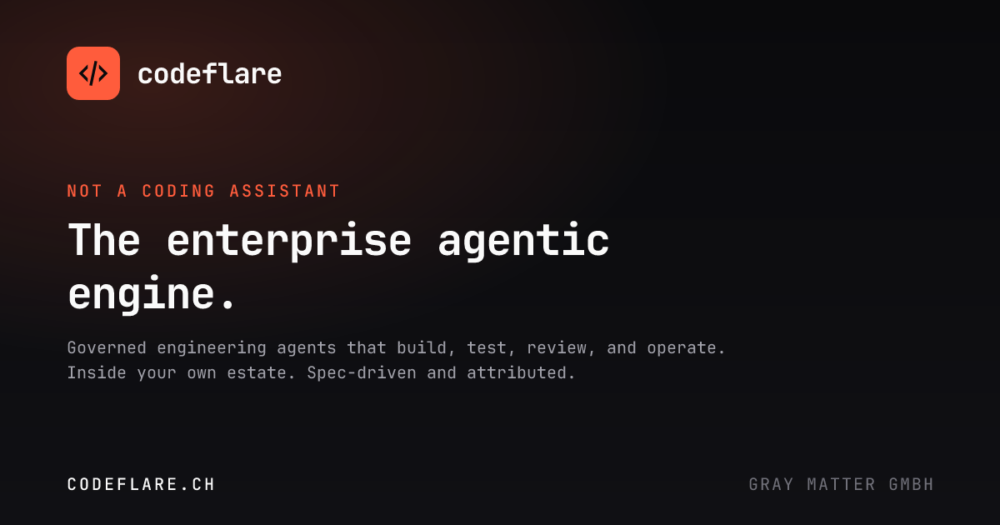
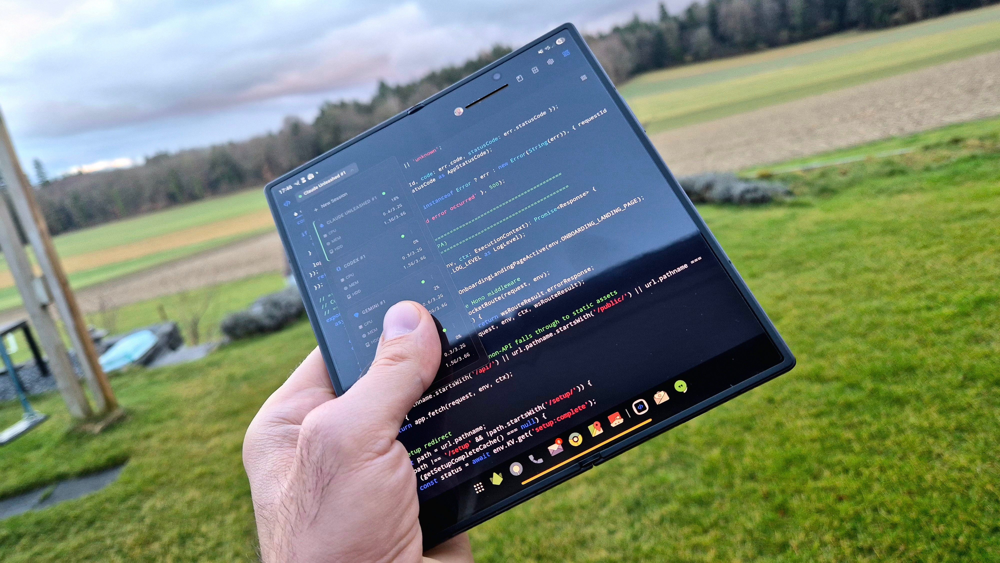
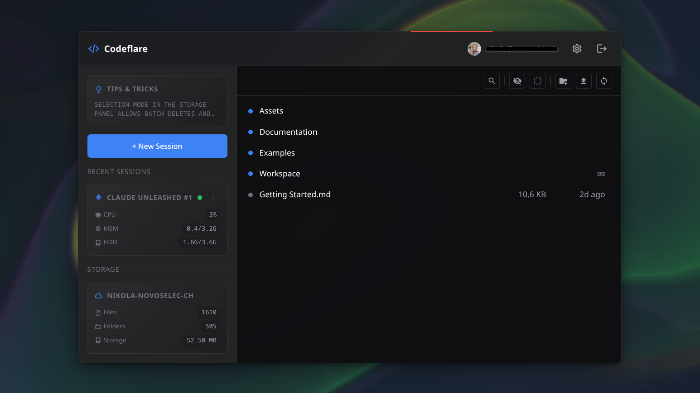
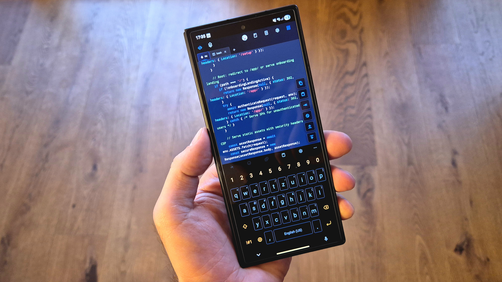
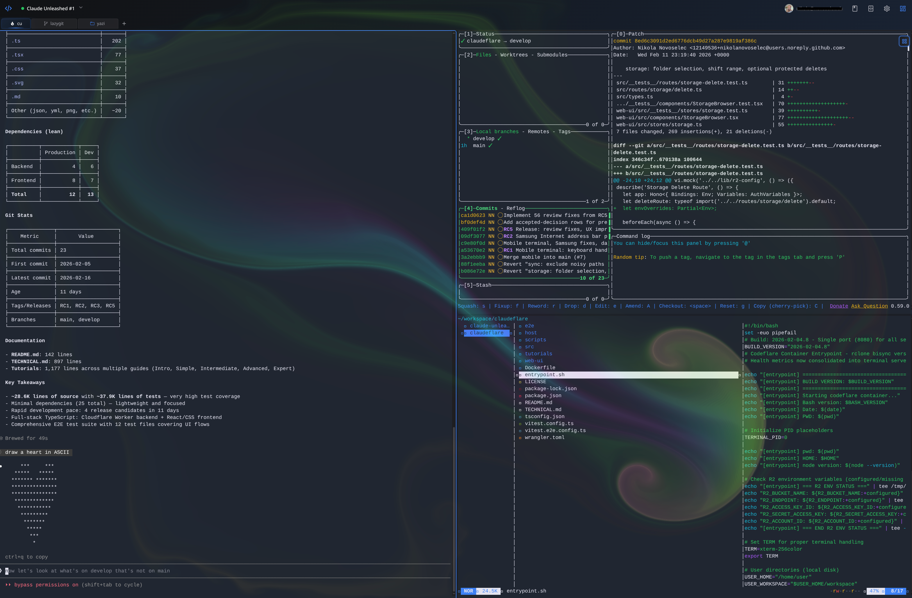
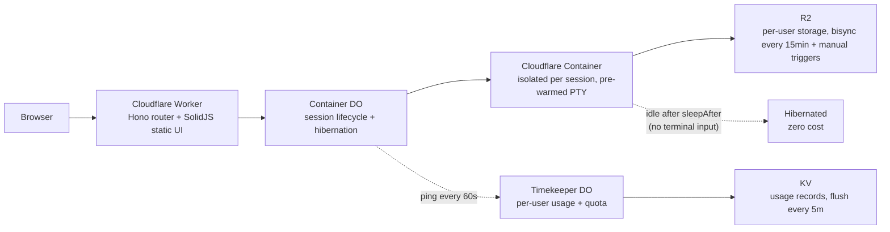
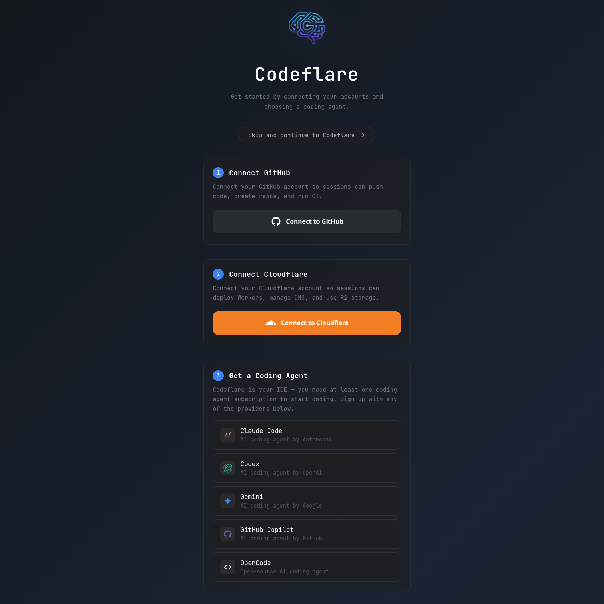

#  Codeflare



**Not a coding assistant. The enterprise agentic engine.**

Codeflare runs governed engineering agents inside your own estate. They build, test, review, and operate. The engineer specifies, steers, and judges; the agents do the rest, under your git, your CI, and your zero-trust boundary.

The governance is the product. Spec-driven and test-driven development run as enforced, self-healing loops: every change is checked against its specification at the pull-request boundary, and drift is a blocking finding instead of something that ships. Each session runs in its own isolated, ephemeral container with no standing infrastructure to persist on. Model traffic never goes direct. It is intercepted at the platform layer and routed through your AI Gateway, where guardrails and DLP apply, every call is inspected, and every token of spend is attributed to a user, team, and route.


*One governed run, from intent to merge. Reachable from any screen with a browser, zero setup.*

**Try it:** [codeflare.ch](https://codeflare.ch)

Every session comes pre-loaded with your choice of agent:

| Agent | Description |
|---|---|
| [Antigravity](https://antigravity.google/docs/cli-overview) | Google's terminal coding agent (beta) |
| [Claude Code](https://docs.anthropic.com/en/docs/claude-code) | Anthropic's agentic CLI |
| [Codex](https://github.com/openai/codex) | OpenAI's coding agent |
| [GitHub Copilot](https://docs.github.com/en/copilot) | GitHub's AI coding agent |
| [OpenCode](https://github.com/opencode-ai/opencode) | Open-source coding agent (beta) |
| [Pi](https://www.npmjs.com/package/@earendil-works/pi-coding-agent) | Extensible coding agent |
| Bash | For the purists |

*Pro mode — cross-session memory, a queryable knowledge graph, curated skills, and spec-driven workflows — runs full-strength on Claude Code and Pi. Other agents receive the rules and agent definitions; the deepest Pro capabilities are Claude/Pi-native.*

<details>
<summary><strong>How do the agents run as root?</strong></summary>

Cloudflare Containers run as root, and both Claude Code and Antigravity launch with `--dangerously-skip-permissions` for fully autonomous operation — no permission prompts. Claude Code normally refuses that flag as root; the official workaround is the container-wide `IS_SANDBOX=1` environment variable, which tells the CLI it's running in a sandboxed environment. It's documented by Anthropic for exactly this sandboxed-root case. Antigravity takes the same flag for prompt-free operation. Codex isolates its execution differently, via a bubblewrap sandbox.

</details>

---

## Contents

- [What you get](#what-you-get)
- [Architecture](#architecture)
- [Quick start](#quick-start)
- [Configuration](#configuration)
  - [Required (every deployment)](#required-every-deployment)
  - [Default mode](#default-mode-what-you-get-with-zero-extra-config)
  - [Advanced configuration](#advanced-configuration-optional)
- [Security](#security)
- [Testing](#testing)
- [CI/CD](#cicd)
- [Documentation](#documentation)
- [License](#license)

---

## What you get


*Manage sessions, browse persistent storage, and monitor live resource usage — all from one view.*

**Native integrations, wired in, not bolted on.**

- **Native GitHub integration** — connect once. Every session gets automatic `git push`, `gh` CLI, and CI/CD access. No SSH keys, no per-session auth.
- **Native Cloudflare integration** — connect once. Deploy Workers and manage D1, R2, KV, and DNS from the terminal, already authenticated.
- **Build, push, and deploy skills** — pre-loaded agent skills scaffold Workers projects, configure `wrangler.toml`, push to GitHub, set up CI, and deploy. Describe what you want; the agent builds, pushes, and deploys it to a live URL.
- **Guided onboarding** — new users are walked through connecting GitHub and Cloudflare and choosing an agent. No prior Cloudflare knowledge required.

**The IDE.**

- Browser-native terminal with 6 tabs per session and tiling mode (2–4 terminals side by side).
- One isolated container per session — agents can't escape their sandbox.
- Persistent R2 storage with bisync every 15 minutes, a manual Sync-now button, and a final sync on stop. Sync conflicts are reconciled automatically on the next cycle.
- Pre-warmed terminals — the agent is loaded before you open the tab.
- Fast Start — agent auto-updates are disabled by default for instant startup; toggle in Settings.
- Set your API key once; it syncs across sessions.
- Live per-session CPU/memory/disk metrics and a three-color status (active / idle / stopped).
- Usage dashboard — daily and monthly compute hours and quota remaining, tracked by a per-user Timekeeper Durable Object.
- Configurable auto-sleep — containers stop after inactivity (5m / 15m / 30m / 1h / 2h; free tier locked to 15m). The timer is input-aware: it resets only on real terminal input, not reconnects or background polls.
- CPU cost scales to zero when idle — you pay for what you use.

**For your agent (Pro mode).**

- **SilverBullet vault** — every Pro session ships a browser-native note editor at `~/Vault/`. Notes, decisions, and transcripts bisync to R2 (covered by `ENCRYPTION_KEY` when set) and are IndexedDB-encrypted at rest with a zero-UI per-session key.
- **Cross-session memory** — conversation context is auto-captured every 15 prompts into the vault, so the next session opens with full recall of prior decisions — even on a different device.
- **Knowledge graph** — a queryable semantic graph (Graphify) over project source and vault content, reachable in Claude via `mcp__graphify__*` and in Pi via native `graphify_query`, `graphify_path`, and `graphify_explain` tools.


*Strongly optimized for mobile. Swipe up/down with the keyboard open to navigate like arrow keys; swipe left/right to scroll terminal text.*

---

## Architecture


*Six terminal tabs, split tiling, and your dev tools — in a disposable container you didn't have to configure.*



Containers scale to zero when idle (no sessions, no bill); storage persists. A per-user Timekeeper Durable Object tracks compute usage and enforces monthly quotas. Auth is handled by Cloudflare Access or, in SaaS mode, GitHub OIDC — one-click login, automatic user provisioning, and an admin approval workflow.

---

## Quick start

Four simple steps.

### 1. Fork this repo

### 2. Add the two required secrets

In your fork: **Settings → Secrets and variables → Actions → New repository secret**. Add each as a separate secret.

| Secret | Where to find it |
|---|---|
| `CLOUDFLARE_API_TOKEN` | Create a custom token — see [API token scopes](#api-token-scopes) |
| `CLOUDFLARE_ACCOUNT_ID` | Any zone's overview page in the [Cloudflare dashboard](https://dash.cloudflare.com/) |

These two are the **only** required configuration. Everything in [Configuration](#configuration) is optional.

### 3. Deploy

**Actions → Deploy → Run workflow → Branch: `main` → Run workflow.** GitHub Actions builds, tests, and deploys to Cloudflare Workers (~2 minutes). Future pushes to `main` deploy automatically.

### 4. Run the setup wizard

Find your worker URL at [dash.cloudflare.com](https://dash.cloudflare.com/) → **Compute → Workers & Pages →** your worker (default name: `codeflare`, so `codeflare.<your-subdomain>.workers.dev`). Open it; the wizard verifies your token, configures a custom domain and allowed users, and sets up authentication (Cloudflare Access for all modes; SaaS mode can use GitHub OAuth instead).


*Connect your accounts and pick an agent. No prior Cloudflare or GitHub knowledge required.*

That's it, you're live. You'll need an active subscription to at least one supported agent; log in directly from the terminal.

<details>
<summary><strong id="api-token-scopes">API token scopes</strong></summary>

Create a custom token at [dash.cloudflare.com/profile/api-tokens](https://dash.cloudflare.com/profile/api-tokens).

**Required** — the minimum to deploy and run:

| Scope | Permission | Access | Why |
|---|---|---|---|
| Account | Account Settings | Read | Setup wizard reads account metadata |
| Account | Workers Scripts | Edit | Deploys the Worker |
| Account | Workers KV Storage | Edit | Session metadata and configuration |
| Account | Workers R2 Storage | Edit | Per-user persistent file storage |
| Account | Containers | Edit | Manages ephemeral session containers |
| Account | Access: Apps and Policies | Edit | Creates the Access application gating `/app` and `/api` |
| Account | Access: Organizations, Identity Providers, and Groups | Edit | Creates admin and user groups |
| Account | API Tokens | Edit | Creates per-user scoped R2 tokens |
| Zone | Zone | Read | Discovers your domain for custom-domain setup |
| Zone | DNS | Edit | Adds DNS records for the custom domain |
| Zone | Workers Routes | Edit | Routes your domain to the Worker |

**Optional:**

| Scope | Permission | Access | Why |
|---|---|---|---|
| Account | Turnstile | Edit | Needed for `ONBOARDING_LANDING_PAGE` or `SAAS_MODE` — bot protection on public waitlist / subscribe / access-request pages |

</details>

---

## Configuration

> **The only mandatory configuration is the two secrets from [step 2](#2-add-the-two-required-secrets).** Set them, deploy, run the wizard, and you have a working instance in **Default mode**. Everything else lives in the [Advanced configuration](#advanced-configuration-optional) dropdowns and is optional.

### Required (every deployment)

| Secret | Type | What it's for |
|---|---|---|
| `CLOUDFLARE_API_TOKEN` | Secret | Deploys the Worker and manages KV, R2, Containers, and Access (see [scopes](#api-token-scopes)) |
| `CLOUDFLARE_ACCOUNT_ID` | Secret | Identifies the Cloudflare account to deploy into |

Both go in **Settings → Secrets and variables → Actions → Secrets**.

### Default mode: what you get with zero extra config

With **only** the two required secrets, your instance runs in Default mode:

- **Single-tenant**, authenticated by **Cloudflare Access** (the wizard creates the Access app, groups, and policies).
- **Every user is unlimited** — no subscription tiers, no billing, no quota enforcement; Pro mode is available.
- **All seven agents** selectable (six AI agents plus Bash).
- **Persistent R2 storage** per user, bisync every 15 minutes.
- Limits: **3 sessions/user**, **10/admin**; up to **10 concurrent containers**; **1 vCPU / 3 GiB / 6 GB** each.
- Root (`/`) redirects to the app — no public landing page.

Most self-hosters never need anything below this line.

### Advanced configuration (optional)

Default mode needs none of this. Each dropdown below switches on an optional deployment mode or tunes the defaults. Settings live in your fork under **Settings → Secrets and variables → Actions** — the **Variables** tab for non-sensitive values, the **Secrets** tab for sensitive ones, and **Settings → Environments → Environment secrets** for per-environment overrides. The deploy workflow applies each one automatically; you never run `wrangler` by hand. (`ALLOWED_ORIGINS` and `LOG_LEVEL` are the exception — edit them directly in `wrangler.toml`.)

<details>
<summary><strong>Deployment modes at a glance</strong></summary>

Modes are additive flags; pick the one that matches your deployment. A flag left unset means that mode is fully off.

| Mode | Turn on with | What it adds | Authentication |
|---|---|---|---|
| **Default** | *(nothing)* | The baseline above | Cloudflare Access |
| **Onboarding** | `ONBOARDING_LANDING_PAGE=active` | Public marketing landing at `/`, a landing-styled `/login` with GitHub sign-in, and a post-sign-in access-request flow; Turnstile CAPTCHA on public forms | Cloudflare Access (`/login` GitHub OAuth needs the `OAUTH_*` secrets, same three as SaaS mode) |
| **SaaS** | `SAAS_MODE=active` | Custom login page, JIT user provisioning, 8-tier subscriptions, Stripe billing, usage tracking, `/admin/users` | GitHub OAuth *or* Cloudflare Access |
| **Enterprise** | `ENTERPRISE_MODE=active` | Single-tenant in **your** Cloudflare account; all users unlimited + Pro; LLM traffic routed through **your** AI Gateway | Cloudflare Access |

**What to set per mode**

| Mode | What to set | Auto-configured by the wizard |
|---|---|---|
| **Default** | Nothing beyond the two required secrets | CF Access app, groups, policies |
| **Onboarding** | `ONBOARDING_LANDING_PAGE=active`; optionally `RESEND_API_KEY` and the `OAUTH_*` secrets (to enable `/login` GitHub sign-in) | CF Access, Turnstile keys |
| **SaaS + GitHub OAuth** | `SAAS_MODE=active`; `OAUTH_CLIENT_ID` + `OAUTH_CLIENT_SECRET` + `OAUTH_JWT_SECRET`; optionally `STRIPE_*`, `RESEND_API_KEY`, `MAX_INSTANCES` | Turnstile keys (GitHub OAuth handles auth) |
| **SaaS + CF Access** | `SAAS_MODE=active`; optionally `STRIPE_*`, `RESEND_API_KEY`, `MAX_INSTANCES` | CF Access, Turnstile keys |
| **Enterprise** | `ENTERPRISE_MODE=active`; `AIG_GATEWAY_URL` + `AIG_TOKEN`; optionally `AIG_LANGUAGE_MODEL` | CF Access; AI Gateway config in the Cloudflare dashboard |

</details>

<details>
<summary><strong>Core settings and limits (all modes)</strong></summary>

All optional. **Type** is where the value goes in GitHub.

| Setting | Type | Default | Effect |
|---|---|---|---|
| `CLOUDFLARE_WORKER_NAME` | Variable | `codeflare` | Worker name + R2 bucket prefix + Access group prefix. Set a unique name to run multiple instances on one account |
| `RESSOURCE_TIER` | Variable | *unset* (= `default`) | Container size. `low`: Cloudflare `basic` preset (≈0.25 vCPU / 1 GiB / 4 GB) · *default*: 1 vCPU / 3 GiB / 6 GB · `high`: 2 vCPU / 6 GiB / 8 GB · `saas`: alias of *default*. (Spelling intentional — do not "fix".) |
| `MAX_INSTANCES` | Variable | `10` | Max concurrent containers. Positive integer; set per environment (e.g. `1400` for production) |
| `MAX_SESSIONS_USER` | Variable | `3` | Max concurrent sessions per user. Ignored in SaaS mode (tier config controls limits) |
| `MAX_SESSIONS_ADMIN` | Variable | `10` | Max concurrent sessions per admin. Ignored in SaaS mode |
| `ENCRYPTION_KEY` | Secret | *unset* | Enables encryption at rest. 32 random bytes, base64 (`openssl rand -base64 32`). When unset, credentials are stored as plaintext |
| `RUNNER` | Variable | `ubuntu-latest` | GitHub Actions runner label for CI/CD (set for self-hosted runners) |
| `CLAUDE_CODE_CACHE_BUSTER` | Variable | *unset* | `active` forces a rebuild of the agent Docker layer, bypassing the cache. Useful after agent updates |
| `STRESS_TEST_MODE` | Variable | *unset* | `active` bypasses **all** rate limits. Integration/stress testing only — **never in production** |

</details>

<details>
<summary><strong>Onboarding mode — public landing, login, and access requests</strong></summary>

Set `ONBOARDING_LANDING_PAGE=active`. Turnstile CAPTCHA keys are auto-created by the wizard — no manual setup.

Unauthenticated `/` serves the public marketing landing (the same page SaaS mode serves), and `/login` is served from the landing's design system with a GitHub sign-in plus enterprise-SSO request affordances. When a GitHub sign-in resolves to a user who isn't yet approved, the Worker records an access request (idempotent), emails the operators and the visitor, and shows a "request submitted" confirmation — instead of dropping them at a subscribe page. The `/login` GitHub sign-in requires the `OAUTH_*` secrets (see SaaS mode); without them, authentication stays on Cloudflare Access. A `POST /public/waitlist` signup endpoint remains available in onboarding mode.

| Setting | Type | Required? | Effect |
|---|---|---|---|
| `ONBOARDING_LANDING_PAGE` | Variable | to enable | `active` serves the public marketing landing at `/` and the landing-styled `/login`. Unset/`inactive` → `/` redirects to the app |
| `RESEND_API_KEY` | Secret | recommended | [Resend](https://resend.com) API key ([resend.com/api-keys](https://resend.com/api-keys)) for waitlist welcome and access-request emails. When unset, signups and access requests still work; no email is sent |
| `RESEND_EMAIL` | Secret | optional | Sender identity (e.g. `Codeflare <hello@yourdomain.com>`). Must be a verified Resend sender. Defaults to `Codeflare <onboarding@resend.dev>` |

</details>

<details>
<summary><strong>SaaS mode — subscriptions, billing and login</strong></summary>

Set `SAAS_MODE=active`. Pair with `MAX_INSTANCES` for your target concurrency. Turnstile keys are auto-created by the wizard. With GitHub OAuth configured, Cloudflare Access is bypassed (free for unlimited users).

| Setting | Type | Required? | Effect |
|---|---|---|---|
| `SAAS_MODE` | Variable | to enable | Activates custom login, JIT provisioning, 8 tiers, usage tracking, and `/admin/users`. Unset → all users unlimited via CF Access |
| `OAUTH_CLIENT_ID` | Env secret | recommended | GitHub OAuth App client ID. Public value — deployed as a Worker *variable* (unlike the other `OAUTH_*`, which are Worker secrets). Enables free GitHub login for unlimited users. Unset → wizard configures CF Access instead (free ≤ 50 users, then $3/user/month) |
| `OAUTH_CLIENT_SECRET` | Env secret | if `OAUTH_CLIENT_ID` set | GitHub OAuth App client secret. Server-side only |
| `OAUTH_JWT_SECRET` | Env secret | if `OAUTH_CLIENT_ID` set | HMAC-SHA256 key for the session cookie. ≥ 32 bytes base64 (`openssl rand -base64 32`). Rotating it expires all sessions |
| `STRIPE_SECRET_KEY` | Secret | optional | Stripe API key (`sk_test_…` / `sk_live_…`) from [dashboard.stripe.com/apikeys](https://dashboard.stripe.com/apikeys) for paid tiers. When unset, all tiers are free |
| `STRIPE_WEBHOOK_SECRET` | Secret | if `STRIPE_SECRET_KEY` set | Webhook signing secret (`whsec_…`) from [dashboard.stripe.com/webhooks](https://dashboard.stripe.com/webhooks), for an endpoint at `https://{domain}/public/stripe/webhook` subscribed to `checkout.session.completed`, `customer.subscription.updated`, `customer.subscription.deleted`. Price metadata (`tier`, `mode`) must be set on all prices |
| `SAAS_EXTRA_IDPS` | Variable | optional | Comma-separated CF Access IdP UUIDs to show alongside GitHub (CF Access auth only) |
| `RESEND_API_KEY` | Secret | recommended | Also sends subscription, plan-change, and tier-change emails. Renewal/payment emails come from Stripe |

**GitHub OAuth setup.** When `OAUTH_CLIENT_ID` is set, the Worker handles auth via GitHub OAuth and Cloudflare Access is bypassed.

1. **Create a GitHub OAuth App** at [github.com/settings/developers](https://github.com/settings/developers) → OAuth Apps → New OAuth App. Homepage URL `https://{your-domain}`, callback URL `https://{your-domain}/auth/github/callback`. Copy the **Client ID**; generate and copy the **Client Secret**.
2. **Generate a JWT signing secret:** `openssl rand -base64 32`
3. **Add as environment secrets** (**Settings → Environments →** your environment **→ Environment secrets**): `OAUTH_CLIENT_ID`, `OAUTH_CLIENT_SECRET`, `OAUTH_JWT_SECRET`.

Create one OAuth App per environment (integration vs production) with the matching callback URL, then deploy.

</details>

<details>
<summary><strong>Enterprise mode — single-tenant on your own AI Gateway</strong></summary>

Enterprise mode deploys Codeflare inside **your own Cloudflare account** as a single-tenant instance. Every user becomes a Custom (unlimited) user in Pro mode with no time limit, the billing UI is hidden, and the agent roster is limited to **GitHub Copilot, Pi, and Bash**. All agent LLM traffic is routed through **your** [Cloudflare AI Gateway](https://developers.cloudflare.com/ai-gateway/) over its REST API — intercepted at the platform level, so no API key, gateway URL, or token is ever placed inside the container and the traffic never touches the public internet. Run it behind Cloudflare Access. When `ENTERPRISE_MODE` is unset, behavior is identical to the other modes.

| Setting | Type | Required? | Effect |
|---|---|---|---|
| `ENTERPRISE_MODE` | Variable | to enable | `active` makes every user Custom/unlimited in Pro mode, hides billing, restricts the agent set, and routes LLM traffic to your AI Gateway |
| `AIG_GATEWAY_URL` | Secret | when `ENTERPRISE_MODE=active` | Your AI Gateway base URL, e.g. `https://gateway.ai.cloudflare.com/v1/{account_id}/{gateway_name}`. The Worker parses the account and gateway ids from it to call the AI Gateway REST API. Held only in the Worker. Find it under **AI → AI Gateway →** your gateway **→ API** |
| `AIG_TOKEN` | Secret | when your gateway is authenticated | AI Gateway token, sent as a standard `Authorization: Bearer` header on the REST API. Held only in the Worker. Create it under the gateway's **Settings → Authenticated Gateway**. Omit only if your gateway allows unauthenticated access |
| `AIG_LANGUAGE_MODEL` | Variable | optional | The gateway model id every agent sends — your dynamic route (`dynamic/<route>`) or a direct id (`openai/gpt-4.1`, `anthropic/claude-…`, `aws-bedrock/…`). One value, applied to both Copilot and Pi. Unset → each agent uses its built-in default model id |

**Configuring your Cloudflare AI Gateway.** The gateway is yours to set up in the Cloudflare dashboard; Codeflare only needs `AIG_GATEWAY_URL` + `AIG_TOKEN` (and optionally the model ids).

1. **Create a gateway** — dashboard → **AI → AI Gateway → Create Gateway**. Name it (e.g. `codeflare-enterprise`).
2. **Set `AIG_GATEWAY_URL`** — from the gateway's **API** tab copy the base URL `https://gateway.ai.cloudflare.com/v1/{account_id}/{gateway_name}` and store it as the `AIG_GATEWAY_URL` secret.
3. **Set `AIG_TOKEN`** — under the gateway's **Settings**, enable **Authenticated Gateway**, create a token, and store it as the `AIG_TOKEN` secret.
4. **Give the gateway model access** — either **bring your own keys** (add your OpenAI / Anthropic / Amazon Bedrock / … provider keys under the gateway's provider keys; BYOK keys are consumed through a dynamic route) **or** enable **Unified Billing** to pay providers through Cloudflare.
5. **Create a dynamic route (recommended)** — add a **Dynamic Route** (e.g. `codeflare-enterprise`) with a primary model and, optionally, a fallback model plus rate-limit and budget nodes. The route name becomes a model id: `dynamic/codeflare-enterprise`.
6. **Point the agents at it** — set the GitHub **variable** `AIG_LANGUAGE_MODEL` to the model id agents should send: your dynamic route (`dynamic/codeflare-enterprise`) or a direct id (`openai/gpt-4.1`, `anthropic/claude-…`, `aws-bedrock/…`). One value covers both Copilot and Pi. Without it, each agent falls back to its built-in default model id.
7. **Redeploy.** Every request is attributed per-user via `cf-aig-metadata` (an opaque id, never an email) in your gateway analytics.
8. **Cap per-user spend (optional).** Because every request carries that per-user id, you can set dollar budgets per user under the gateway's **[Spend Limits](https://developers.cloudflare.com/ai-gateway/features/spend-limits/)** — e.g. `$200`/user/day — scoped on the `user` metadata dimension, with a daily/weekly/monthly window (fixed or rolling). When a user hits their budget the gateway blocks further requests by default, or you can fall back to a cheaper model via the dynamic route. Works with both BYOK and Unified Billing. No redeploy needed — Codeflare already stamps the id.

> **Gotchas.** A bare `provider/model` id on the REST API uses **Unified Billing** — without Cloudflare credits it returns `402`. To consume **BYOK** keys, route through a **dynamic route**. And when a primary model errors the route falls back to the next node, so pick a non-reasoning fallback (or set a sensible `max_tokens`) — some reasoning models return empty content at low token limits.

**Deploying an enterprise instance.** Keep enterprise settings in a dedicated `enterprise` GitHub Environment (**Settings → Environments → New environment**): the `ENTERPRISE_MODE` / `AIG_LANGUAGE_MODEL` variables, the `AIG_GATEWAY_URL` + `AIG_TOKEN` secrets, a `CLOUDFLARE_WORKER_NAME` (e.g. `codeflare-enterprise`), and — when the target is a **separate** Cloudflare account — that account's own `CLOUDFLARE_ACCOUNT_ID` + `CLOUDFLARE_API_TOKEN` env secrets (env secrets override repo-level ones). Deploy from **Actions → Deploy → Run workflow**, Branch `main`, target `enterprise`. The worker comes up on its own `<worker>.<account>.workers.dev` URL and the wizard runs there on first boot — no custom domain needed up front. For another tenant, create another environment pointed at that tenant's account.

</details>

<details>
<summary><strong>E2E testing credentials</strong></summary>

E2E tests authenticate via the `X-Service-Auth` header; the deploy workflow injects it as the Worker's `SERVICE_AUTH_SECRET`. Set **one** secret depending on your auth mode. When none is set, service auth is disabled (safe by default).

| Setting | Type | Required? | Effect |
|---|---|---|---|
| `CF_ACCESS_CLIENT_SECRET` | Env secret | CF Access mode | CF Access service-token secret; also deployed as `SERVICE_AUTH_SECRET`. Sent as `CF-Access-Client-Secret` + `X-Service-Auth` |
| `CF_ACCESS_CLIENT_ID` | Env secret | CF Access mode | CF Access service-token client ID, sent as `CF-Access-Client-Id`. Create both under **Zero Trust → Access → Service Auth** |
| `OAUTH_E2E_TEST_SECRET` | Env secret | GitHub OIDC mode | Random secret (`openssl rand -base64 32`) deployed as `SERVICE_AUTH_SECRET` when CF Access is not used. Sent as `X-Service-Auth` only |
| `E2E_BASE_URL` | Variable | to run E2E | Full URL of the deployed worker under test (custom domain or `<worker>.<account>.workers.dev`). Required by `e2e.yml` / `stress-test.yml` — the run fails fast when it is unset |

> Turnstile keys (`TURNSTILE_SITE_KEY` / `TURNSTILE_SECRET_KEY`) are **auto-created** by the setup wizard when `ONBOARDING_LANDING_PAGE` or `SAAS_MODE` is active. You never set them manually.

</details>

---

## Security

Defense-in-depth throughout; full detail in [security.md](documentation/lanes/security.md).

- **Isolation** — one container per session, each running as root inside a locked sandbox it cannot escape. No shared shells, no cross-session access.
- **Authentication** — every authenticated surface (`/app`, `/api`, `/setup`) is gated by JWT verification, via Cloudflare Access (default) or GitHub OIDC session cookies (SaaS).
- **Credential handling** — deploy tokens stay in GitHub and Cloudflare by default. When you connect Push & Deploy, they're injected into your container, stored AES-256-GCM-encrypted in KV, scoped per user, and never shared across sessions.
- **Encryption at rest** *(optional, set `ENCRYPTION_KEY`)* — KV credentials (AES-256-GCM, per-value IVs, AAD-bound) and R2 files (SSE-C) are encrypted; the vault gets its own zero-UI per-session key. Existing plaintext entries migrate transparently on first read. See [Credential Encryption at Rest](documentation/lanes/security.md#credential-encryption-at-rest).
- **Hardening** — HSTS, CSP, X-Frame-Options, and Referrer-Policy on every response; KV-backed per-user rate limits (429 + `Retry-After`); Zod input validation with a 64 KiB body limit.
- **Supply chain** — CodeQL (with Copilot Autofix), OSSF Scorecard, `npm audit`, dependency review, Dependabot, and Trivy container scanning.
- **Continuous testing** — a weekly CI workflow runs automated penetration tests against the auth gate, security headers, TLS, injection, and information disclosure. See [Penetration Testing](documentation/lanes/pentest.md).

Report a vulnerability via [SECURITY.md](SECURITY.md).

---

## Testing

```bash
npm test                     # Backend tests
cd web-ui && npm test        # Frontend tests
cd host && npm test          # Host tests (prewarm, activity tracker)
npm run test:e2e:api         # E2E API (requires a deployed worker)
npm run test:e2e:ui          # E2E UI desktop (requires a deployed worker)
npm run test:e2e:ui-mobile   # E2E UI mobile
```

E2E tests require a deployed worker and service credentials (CF Access service tokens, or `OAUTH_E2E_TEST_SECRET` when SaaS mode uses GitHub OAuth). See [CI/CD & Testing](documentation/lanes/ci-cd.md#testing) for the full suite and [E2E setup](documentation/lanes/ci-cd.md#e2e-service-token-setup).

---

## CI/CD

| Workflow | Trigger | Purpose |
|---|---|---|
| `deploy.yml` | Push to `main` / manual | Tests + Docker build + Trivy scan + deploy |
| `test.yml` | Pull requests | Lint, tests, typecheck, security audit, dependency review |
| `e2e.yml` | Manual | E2E matrix: API, UI desktop, UI mobile |
| `codeql.yml` | Push, PRs, weekly | CodeQL static analysis |
| `scorecard.yml` | Push to `main`, weekly, manual | OSSF Scorecard |
| `fuzz.yml` | PRs, weekly, manual | Property-based fuzzing (fast-check) |
| `pentest.yml` | Weekly (Mon 05:00 UTC), manual | Automated external penetration testing |
| `stress-test.yml` | Manual | k6 load testing against the integration worker |

See [CI/CD & Testing](documentation/lanes/ci-cd.md) for full documentation.

---

## Documentation

- **`documentation/`** — [architecture](documentation/lanes/architecture.md), [API reference](documentation/lanes/api-reference.md), [security](documentation/lanes/security.md), [configuration](documentation/lanes/configuration.md), [billing](documentation/lanes/billing.md), and [more](documentation/README.md).
- **`preseed/tutorials/Getting Started.md`** — tabs, tiling, file persistence, and three paths forward depending on how much hand-holding you want.
- **`preseed/tutorials/Examples/`** — spec-driven project examples from Hello World to a full blog platform. Hand one to your agent and go.

<details>
<summary><strong>Local development</strong></summary>

```bash
npm install
cd web-ui && npm install && cd ..
npm run dev
```

</details>

<details>
<summary><strong>Troubleshooting: Cloudflare WAF blocking API requests</strong></summary>

On a Cloudflare Pro plan (or higher) with Managed Rulesets enabled, the WAF may block legitimate API calls.

**Symptom:** a wall of HTML in your terminal where a simple confirmation (e.g. "session deleted") should be, informing you that you've been blocked.

**Fix:** in your domain's **Security → Analytics → Events**, find the blocked request (Action taken: *Block*), open the rule that triggered it, and disable it.

</details>

---

## License

PolyForm Noncommercial 1.0.0 — free for personal use, tinkering, and showing off.

Commercial use, resale, or paid hosted offerings require a separate written license.
