# Codeflare Technical Reference

Browser-based cloud IDE on Cloudflare Workers with per-session containers and R2 persistence.

## Table of Contents

1. [Architecture Overview](#1-architecture-overview)
2. [System Components](#2-system-components)
   - [Worker (Hono Router)](#21-worker-hono-router)
   - [Container DO (CodeflareContainer)](#22-container-do-codeflarecontainer)
   - [Terminal Server (node-pty)](#23-terminal-server-node-pty)
   - [Frontend (SolidJS + xterm.js)](#24-frontend-solidjs--xtermjs)
3. [Backend Libraries](#3-backend-libraries)
4. [Data Flow](#4-data-flow)
5. [Storage and Sync](#5-storage-and-sync)
6. [Authentication](#6-authentication)
7. [Security Model](#7-security-model)
8. [API Reference](#8-api-reference)
9. [Container Image](#9-container-image)
10. [Container Startup](#10-container-startup)
    - [Fast Start](#fast-start)
11. [Claude Code Integration](#11-claude-code-integration)
12. [File Structure](#12-file-structure)
13. [Environment Variables](#13-environment-variables)
14. [Configuration](#14-configuration)
15. [CI/CD (GitHub Actions)](#15-cicd-github-actions)
16. [Testing](#16-testing)
17. [Development](#17-development)
18. [Cost](#18-cost)
19. [Troubleshooting](#19-troubleshooting)
20. [Debugging Guide](#20-debugging-guide)
21. [Architecture Decisions](#21-architecture-decisions)
22. [Lessons Learned](#22-lessons-learned)
23. [Mobile Terminal Design](#23-mobile-terminal-design)
24. [Automatic Memory Capture](#24-automatic-memory-capture)

**Workers.dev URL:** `https://<CLOUDFLARE_WORKER_NAME>.<ACCOUNT_SUBDOMAIN>.workers.dev` - used only for initial setup. After the setup wizard configures a custom domain, all traffic should go through the custom domain (protected by CF Access). The workers.dev URL should then be gated behind one-click Access in the Cloudflare dashboard.

---

## 1. Architecture Overview

Codeflare runs AI coding agents in isolated containers, one per browser session (tab). All sessions for a user share a single R2 bucket for persistent storage, with periodic bidirectional sync (every 60 seconds).

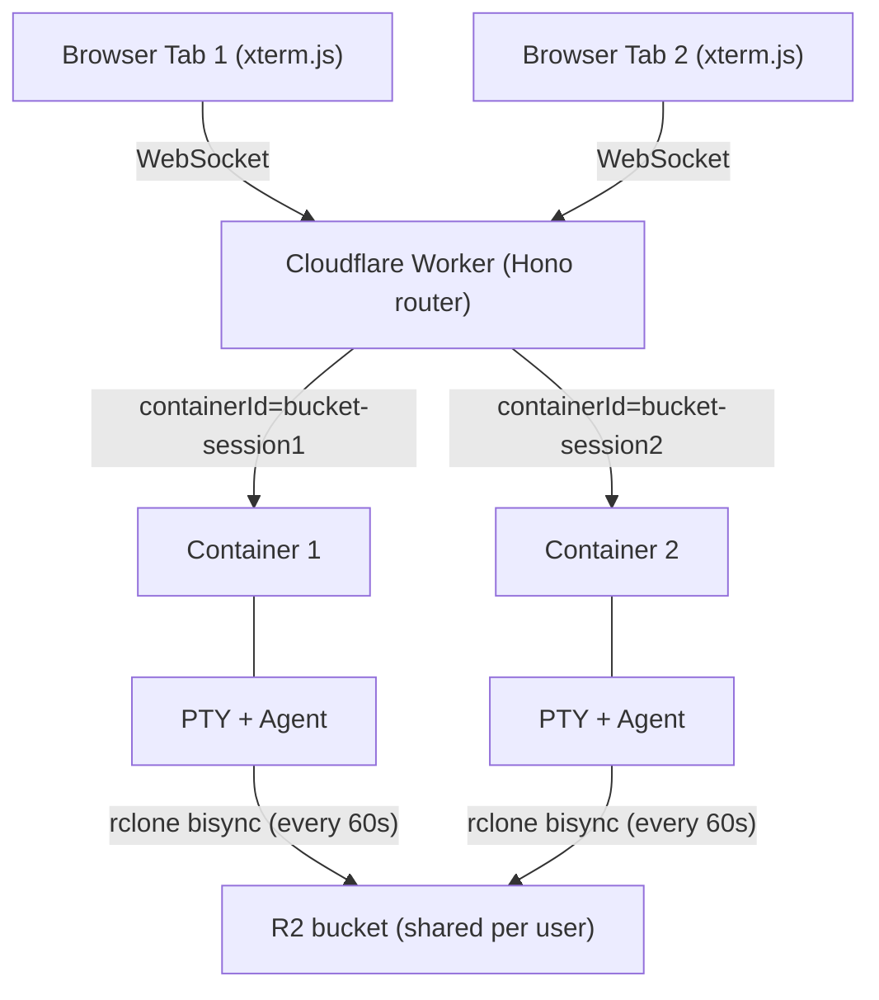

---

## 2. System Components

### 2.1 Worker (Hono Router)

**File:** `src/index.ts`

Entry point and API gateway. Handles routing, WebSocket upgrade interception, authentication via Cloudflare Access, container lifecycle through Durable Objects, and CORS with configurable allowed origins.

**WebSocket must be intercepted BEFORE Hono routing** (required workaround for CF Workers):
```typescript
// See: https://github.com/cloudflare/workerd/issues/2319
const wsRouteResult = validateWebSocketRoute(request, env);
if (wsRouteResult.isWebSocketRoute) {
  return handleWebSocketUpgrade(request, env, ctx, wsRouteResult);
}
```

**CORS:** Checks static patterns from `env.ALLOWED_ORIGINS` + dynamic origins from KV (cached in memory). Uses `matchesPattern()` with domain-boundary enforcement (dot-prefixed = suffix match, bare domains = exact or subdomain with dot boundary).

**Route Registration:** `/health`, `/api/user`, `/api/users`, `/api/container`, `/api/sessions`, `/api/terminal`, `/api/setup`, `/api/storage`, `/api/presets`, `/api/preferences`, `/public`

**Workers Assets Routing Guardrails (`wrangler.toml`):**

With SPA fallback (`not_found_handling = "single-page-application"`), control-plane paths must execute Worker logic first via `run_worker_first = ["/", "/api/*", "/public/*", "/health"]`. Missing `/api/*` causes setup/auth flows to break (API endpoints return HTML instead of JSON).

### 2.2 Container DO (CodeflareContainer)

**File:** `src/container/index.ts` - Extends `Container` from `@cloudflare/containers`. `defaultPort = 8080`, `sleepAfter = '30m'` (SDK-managed lifecycle, confirmed stable with keepalive heartbeat).

**SDK-Managed Hibernation:** `sleepAfter` lets the SDK handle container process lifecycle via its own alarm loop. `onStart()` updates KV with `lastStartedAt` timestamp, clears stale `collectMetrics` schedules, and arms a fresh 5-second `collectMetrics` schedule. `onStop()` sets KV status to `'stopped'` and updates `lastActiveAt` timestamp, ensuring other devices see correct status for hibernated containers.

**`collectMetrics()` Heartbeat (every 5s):**
1. Checks `this.ctx.container?.running` - returns early (no re-arm) if container is dead
2. Fetches `/activity` via `getTcpPort()` - if active WS clients, calls `renewActivityTimeout()` (keepalive). If `/activity` fails, renews as safety net (don't kill container on transient errors). Activity/keepalive logs are at `debug` level to reduce noise (was `info` - downgraded once keepalive was confirmed stable).
3. Fetches `/health` via `getTcpPort()` - reads cpu/mem/hdd/syncStatus
4. Writes metrics to KV session record (`session.metrics`)
5. Re-arms schedule if container still running
6. **Zombie DO detection**: When identifiers are missing (post-`destroy()`), returns early WITHOUT re-arming - kills both metrics push and schedule re-arm via if/else pattern

**Zombie DO Detection:** When `collectMetrics` reaches the health-fetch stage but `sessionId` or `bucketName` are missing from DO storage (happens after `destroy()` clears them), it logs `"missing identifiers, not re-arming (zombie DO)"` and returns without scheduling the next cycle. This is the kill switch for orphaned DOs.

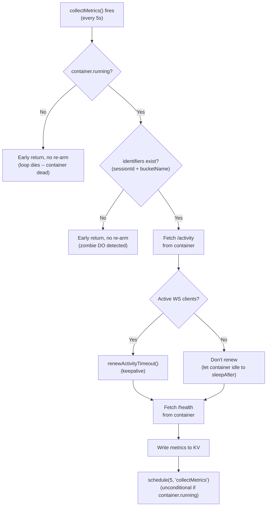

**`onActivityExpired()` Override:** Checks `/activity` for active WS clients. If clients connected -> `renewActivityTimeout()`. If no clients -> `this.stop('SIGTERM')`. Safety net: renews timeout on any error (network failures, non-OK responses) rather than killing the container.

**`destroy()` Override:** Clears `SESSION_ID_KEY`, `bucketName`, `workspaceSyncEnabled`, `tabConfig`, `fastStartEnabled` from DO storage and nulls `_bucketName` in memory BEFORE calling `super.destroy()`. This prevents `onStop()` (triggered asynchronously by `super.destroy()` killing the container) from resurrecting deleted sessions in KV.

**Environment Variables Injection:** R2 credentials flow via two paths: (1) `_internal/setBucketName` request body (primary, from Worker), (2) `this.env` fallback (DO restart). Fallback chain: Worker-provided > `this.env` > empty string.

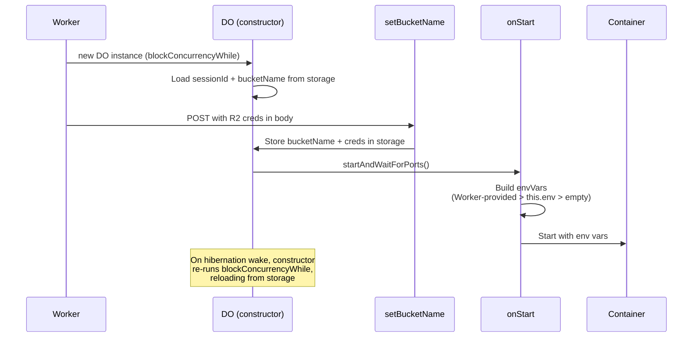

**Critical: `envVars` must be set as a property assignment**, not as a getter. Cloudflare Containers reads `this.envVars` as a plain property at `start()` time.

**`setBucketName` Idempotency (409 Path):** Once `_bucketName` is set, subsequent `setBucketName` calls return 409. BUT the 409 handler still stores `sessionId`, `workspaceSyncEnabled`, `tabConfig`, and `fastStartEnabled` in DO storage -- this ensures `collectMetrics`/`onStop` can find the KV entry even on session restarts (where the DO already has a bucket set but needs the sessionId for the new lifecycle), and that user preference changes take effect without container recreation.

**Lifecycle Route Re-calls `setBucketName` After `destroy()`:** In the `needsBucketUpdate` path (restart with different bucket), `destroy()` wipes DO storage. The lifecycle route must call `setBucketName` again after `destroy()` to re-populate sessionId, bucketName, and R2 credentials. See `src/routes/container/lifecycle.ts`.

**Internal Endpoints:** `/_internal/setBucketName`, `/_internal/setSessionId`, `/_internal/getBucketName`

### 2.3 Terminal Server (node-pty)

**File:** `host/server.js` - Node.js server inside the container. Single port 8080 for WebSocket + REST + health/metrics.

Sync handled entirely by `entrypoint.sh` (60s daemon). Terminal server reads sync status from `/tmp/sync-status.json` and exposes via `/health`. Activity tracking (WebSocket connection state: `hasActiveConnections`, `connectedClients`, `activeSessions`, `disconnectedForMs`) for hibernation decisions via `GET /activity`.

**Auth-Exempt Paths:** The terminal server validates `Authorization: Bearer <token>` on all HTTP requests. Paths called via `getTcpPort().fetch()` (which bypasses the DO's `fetch()` override that injects the auth header) must be in the `authExemptPaths` Set at `host/server.js`: `['/health', '/activity']`. The `/activity` endpoint is also exempted from auth in the DO-level `fetch()` override so internal health checks don't require token injection.

**`GET /activity` Endpoint:** Returns `{ hasActiveConnections: boolean, connectedClients: number, activeSessions: number, disconnectedForMs: number | null }`. Used by both `collectMetrics()` (keepalive heartbeat) and `onActivityExpired()` (idle detection). Active connections = WebSocket clients that are currently connected. `disconnectedForMs` tracks time since all clients disconnected (null if clients are currently connected).

**WebSocket Protocol:** Raw terminal data (NOT JSON-wrapped). Control messages (resize, process-name) as JSON. No application-level ping/pong -- Cloudflare handles protocol-level WebSocket keepalive for DO/Container connections. Headless terminal (xterm SerializeAddon) captures full state for reconnection.

**PTY:** Spawns `bash -l` (login shell for .bashrc) with `xterm-256color`, truecolor support.

### 2.4 Frontend (SolidJS + xterm.js)

**Directory:** `web-ui/`

Key files: `App.tsx` (root), `Terminal.tsx` (xterm.js), `TerminalTabs.tsx`, `Layout.tsx` (orchestrates dashboard/terminal views, manages WS disconnect/reconnect lifecycle), `SessionStatCard.tsx` (dashboard card with three-color status dot and metrics), `StorageBrowser.tsx` (R2 browser with toolbar), `StoragePanel.tsx` (slide-in drawer), `SettingsPanel.tsx`, `Dashboard.tsx`, `OnboardingLanding.tsx`, `KittScanner.tsx`.

Stores: `terminal.ts` (WebSocket state, compound key `sessionId:terminalId`, scheduled disconnect/reconnect), `terminal-url-detection.ts` (URL detection signals for floating buttons), `terminal-layout.ts` (terminal layout state), `session.ts` (CRUD, `terminalsPerSession`, `stopSession()` sets `'stopping'` and polls, `refreshSessionStatuses()` for lightweight dashboard polling — also updates storage stats from batch-status via `updateStatsFromBatch()`), `storage.ts` (R2 operations), `setup.ts`, `tiling.ts` (tiled terminal layout), `session-presets.ts` (preset/bookmark management), `session-tabs.ts` (tab configuration).

#### Dashboard WS Disconnect Flow

When user navigates to dashboard, `Layout.tsx` calls `scheduleDisconnect(DASHBOARD_WS_DISCONNECT_DELAY_MS)` (60s grace period). After the grace period, `disconnectAll()` closes all WS connections with reason `'dashboard-disconnect'`. Container can then idle to `sleepAfter` (30m). When user returns to terminal view, `cancelScheduledDisconnect()` cancels any pending timer, then `reconnectDisconnectedTerminals(activeSessionId)` reconnects only the active session's terminals. The `untrack()` fix in `Layout.tsx`'s `createEffect` wraps `activeSessionId` to prevent the reactive dependency from triggering reconnects on unrelated session changes.

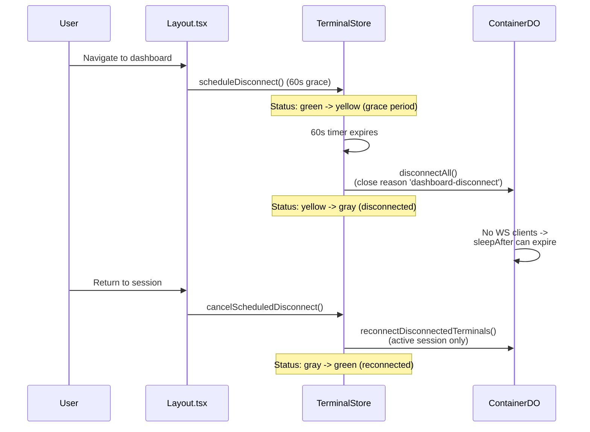

#### Three-Color Session Status

`SessionStatCard` displays green (running + WS connected), yellow (running + WS disconnected -- container alive but dashboard-disconnected), gray (stopped). Driven by `dotVariant()` which checks both `session.status` and `terminalStore.getConnectionState()`. The yellow indicator was added to make the dashboard-disconnect flow visible to the user -- without it, status jumped from green directly to gray.

#### Polling and Consistency

**Polling Interval:** `SESSION_LIST_POLL_INTERVAL_MS = 5000` -- matches the DO's `collectMetrics` 5s push cycle. Polling faster wastes requests since KV data doesn't change between pushes. `CONTEXT_EXPIRY_MS = 30 * 60 * 1000` (30m) matches backend `sleepAfter` for accurate context-expired detection.

**KV Eventual Consistency:** ~60s propagation delay for new sessions. Metrics may not appear at edge immediately after first `collectMetrics` write. The frontend handles this gracefully -- `SessionStatCard` shows last-known metrics for recently-stopped sessions.

**Auto-Reconnect:** 10 attempts (`MAX_WS_RETRIES`) with 2-second delay. Reconnection triggers session buffer replay via SerializeAddon state restore. AbortController-based cancellation prevents parallel retry loops.

**No Application-Level WS Pings:** Removed. Cloudflare's runtime handles protocol-level WebSocket keepalive for DO/Container connections automatically.

**Character Doubling Fix:** The `inputDisposable` must be stored outside `connect()` and disposed before creating a new handler on reconnect:
```typescript
let inputDisposable: IDisposable | null = null;
function connect() {
  inputDisposable?.dispose();
  inputDisposable = terminal.onData((data) => ws.send(data));
}
```

#### UI Features

**Nested Terminals (Multiple PTYs per Session):** Up to 6 terminal tabs per session. Compound key strategy: frontend `sessionId:terminalId`, WebSocket URL `/api/terminal/{sessionId}-{terminalId}/ws`. Backend parses compound ID, validates base session, forwards full ID to container. Container's SessionManager handles each compound ID as a separate PTY.

**StoragePanel (R2 File Browser):** Files: `StoragePanel.tsx`, `StorageBrowser.tsx`, `stores/storage.ts`. Desktop: 400px slide-in drawer. Mobile: bottom-sheet. Mutual exclusion with SettingsPanel. Reads directly from R2 via Worker API (no container-side sync trigger). Container sync handled by 60s bisync daemon.

**R2 Storage Stats Caching:** `GET /api/storage/stats` paginates all R2 objects and caches results in KV (`storage-stats:{bucketName}`, 60s TTL). `batch-status` piggybacks cached stats (no TTL check — relies on cache being fresh). Mutation endpoints (upload, delete, move, seed) invalidate the KV cache after successful operations. Dashboard calls `storageStore.fetchStats()` on mount, which hits `/api/storage/stats` and refreshes from R2 if the cache is stale or missing.

**Conditional Logout:** Depends on `onboardingActive` flag: active -> redirect to `/` (landing page), inactive -> redirect to `/cdn-cgi/access/logout`.

**Frontend Zod Validation:** `web-ui/src/lib/schemas.ts` -- Zod schemas validate API responses at runtime. Types derived from schemas via `z.infer`.

**Terminal Tab Configuration:** `web-ui/src/lib/terminal-config.ts` -- Generic "Terminal 1-6" defaults with live process detection via `PROCESS_ICON_MAP` (maps running process names like cu, codex, gemini, opencode, copilot, htop, yazi, lazygit, bash, sh, zsh to MDI icons). `PROCESS_DISPLAY_NAME` maps binary names to display names (e.g. `cu` → `claude`) so tabs show the product name instead of the binary name. Separate `AGENT_ICON_MAP` maps the 6 agent types (claude-code, codex, gemini, opencode, copilot, bash) to session card icons.

#### Frontend Constants

**File:** `web-ui/src/lib/constants.ts` -- 18 constants for polling intervals, timeouts, WebSocket close codes, max terminals, display lengths, URL detection patterns, view transitions, context expiry, dashboard WS disconnect delay.

---

## 3. Backend Libraries

| File | Purpose |
|------|---------|
| `src/middleware/auth.ts` | Shared authentication middleware. Delegates to `authenticateRequest()` which throws `AuthError`/`ForbiddenError` on failure. Sets `c.get('user')` and `c.get('bucketName')` for downstream handlers. |
| `src/lib/container-helpers.ts` | Consolidated container initialization: `getSessionIdFromQuery()` (from query param), `getContainerId()` (with validation, never fallbacks), `getContainerContext()` (full context for route handlers). |
| `src/lib/error-types.ts` | `AppError` base class with `code`, `statusCode`, `message`, `userMessage`. Specialized: `NotFoundError` (404), `ValidationError` (400), `ContainerError` (500), `AuthError` (401), `ForbiddenError` (403), `SetupError` (400), `RateLimitError` (429), `CircuitBreakerOpenError` (503). Utilities: `toError(unknown)`, `toErrorMessage(unknown)`. |
| `src/lib/type-guards.ts` | Runtime type validation replacing unsafe type casts (e.g., `isBucketNameResponse()`). |
| `src/lib/constants.ts` | Single source of truth for 20 configuration constants: ports (`TERMINAL_SERVER_PORT = 8080`), session ID validation, CORS defaults, rate limit keys/windows, container fetch timeouts, max presets/tabs, protected paths, request ID config, session limits. |
| `src/lib/circuit-breaker.ts` | Prevents cascading failures. States: CLOSED (normal), OPEN (fail fast), HALF_OPEN (testing recovery). Wraps `container.fetch()` calls. |
| `src/middleware/rate-limit.ts` | Per-user rate limiting (bucketName from auth, IP fallback). Stores counts in KV. Adds `X-RateLimit-*` headers. |
| `src/lib/logger.ts` | JSON logging with `createLogger(module)`, child loggers with request context. |
| `src/lib/jwt.ts` | RS256 verification against CF Access JWKS (`https://{authDomain}/cdn-cgi/access/certs`). Per-isolate JWKS cache with `resetJWKSCache()`. |
| `src/lib/cache-reset.ts` | Centralized invalidation of CORS + auth config + JWKS caches. Called by setup wizard after configuration changes. |
| `src/lib/cf-api.ts` | Cloudflare API client. `parseCfResponse` checks `Content-Type` header before JSON parsing. When content-type is not `application/json`, attempts `JSON.parse` on the text body as a lenient fallback (Cloudflare sometimes omits content-type on valid JSON). Only throws a structured `AppError` with the first 200 chars of the response body if the parse actually fails -- this gives clear diagnostics for HTML error pages or plain text from expired tokens, instead of opaque JSON parse errors. |

### Setup Wizard Resilience

**Directory:** `src/routes/setup/`

All Cloudflare API calls in the setup wizard are wrapped in `withSetupRetry()` (defined in `shared.ts`) for transient failure resilience. The wrapper retries up to 2 times (3 total attempts) with exponential backoff (1s, 2s), skipping retry for `CircuitBreakerOpenError`.

**Cross-environment safety:** `resolveManagedAccessApp()` in `access.ts` uses a 4-tier fallback to find existing Access apps: (1) exact domain match, (2) stored app ID from KV, (3) name match + domain validation, (4) `/app/*` suffix + domain validation. Tiers 3 and 4 validate domain to prevent cross-environment collision when multiple environments share a CF account.

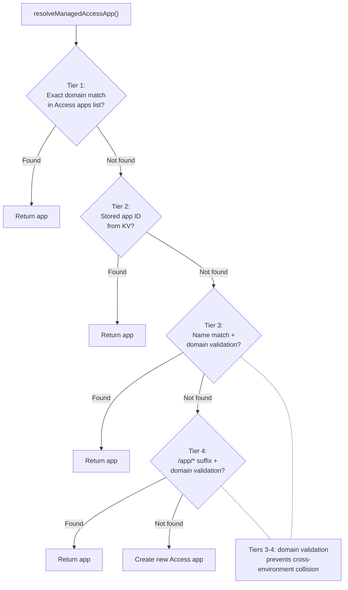

**Error propagation:** `listAccessApps()` and `listAccessGroups()` propagate errors through `withSetupRetry` rather than silently returning `[]`. Errors surface as `SetupError` with step details. The frontend `ApiError` carries a `steps` array from `SetupError` JSON responses.

**Stale user removal during reconfiguration:** When `POST /configure` is re-run with a new `allowedUsers` list, users no longer in the list are removed via `cleanupUserData()` (`src/lib/user-cleanup.ts`), wrapped in `runStep('cleanup_stale_users')` for progress visibility. This performs full cleanup identical to `DELETE /api/users/:email`: destroys all active sessions/containers, deletes bucket-keyed KV entries (`storage-stats:`, `presets:`, `user-prefs:`), deletes the R2 scoped token, empties the R2 bucket (paginated `ListObjectsV2` + `DeleteObjects` via `emptyR2Bucket`), and deletes the bucket via CF API with retry logic (up to 3 attempts with exponential backoff for R2 eventual consistency).

### Session Route Architecture

**Directory:** `src/routes/session/` - Split into `index.ts` (aggregator), `crud.ts` (CRUD), `lifecycle.ts` (start/stop/status/batch-status).

**Session Stop Flow (user-initiated):** Sets KV status to `'stopped'`, calls `container.destroy()` (sends SIGINT per Dockerfile STOPSIGNAL, then SIGKILL), entrypoint.sh shutdown handler runs final `rclone bisync`. `destroy()` override clears `SESSION_ID_KEY`/`bucketName` from DO storage before `super.destroy()` -- prevents `onStop()` from resurrecting the deleted session. Both `batch-status` and `GET /:id/status` trust the `'stopped'` KV status to avoid waking the DO (exception: stale >5 minutes triggers probe).

**Session Stop Flow (idle):** `onActivityExpired()` detects no active WS clients -> `this.stop('SIGTERM')` -> `onStop()` fires with identifiers intact -> writes `status: 'stopped'` to KV.

---

## 4. Data Flow

### Session Creation to Terminal Connection

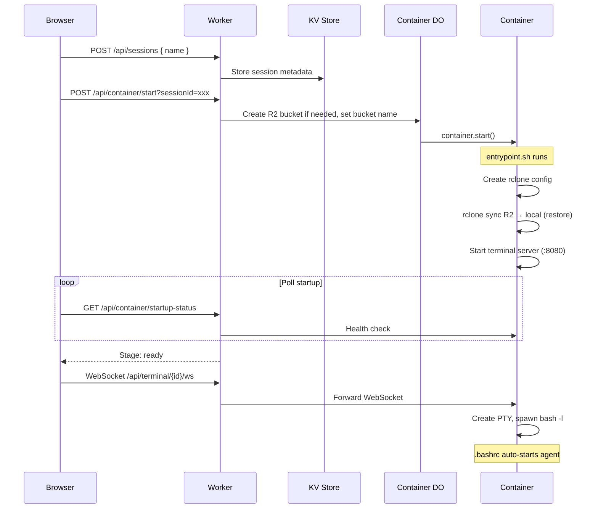

### Startup Status Stages

| Stage | Progress | Condition |
|-------|----------|-----------|
| stopped | 0% | Container not running |
| starting | 10-20% | Container running but health server not responding |
| syncing | 30-45% | Health server up, syncStatus = pending/syncing |
| verifying | 85% | Sync complete, terminal server not yet responding |
| mounting | 90% | Terminal server up, PTY pre-warming in progress. WebSocket connects, terminal canvas hidden (`visibility: hidden`) |
| ready | 100% | All checks passed. "Open" button appears. Click reveals terminal canvas with pre-buffered content |
| error | 0% | Sync failed or other error |

### Session Lifecycle State Machine

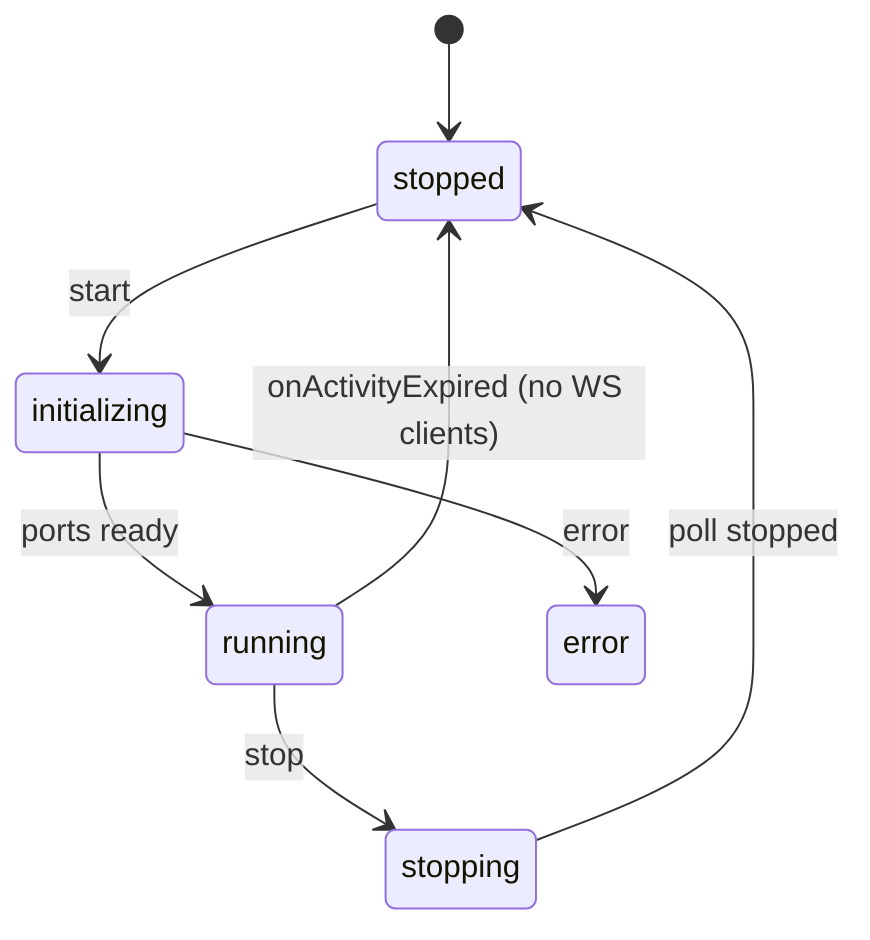

**Stop (idle):** `sleepAfter` expires -> SDK calls `onActivityExpired()` -> checks `/activity` -> no WS clients -> `this.stop('SIGTERM')` -> `onStop()` -> KV status = `'stopped'`

**Stop (user-initiated):** Worker sets KV status to `'stopped'` -> calls `container.destroy()` -> `destroy()` clears `SESSION_ID_KEY` + `bucketName` from DO storage to prevent deleted session resurrection -> `super.destroy()` -> `onStop()` bails (no identifiers, so no KV write)

**Delete:** Worker `KV.delete()` -> `container.destroy()` -> `destroy()` clears `SESSION_ID_KEY` + `bucketName` -> `super.destroy()` -> `onStop()` bails (no identifiers, so deleted session cannot be resurrected in KV)

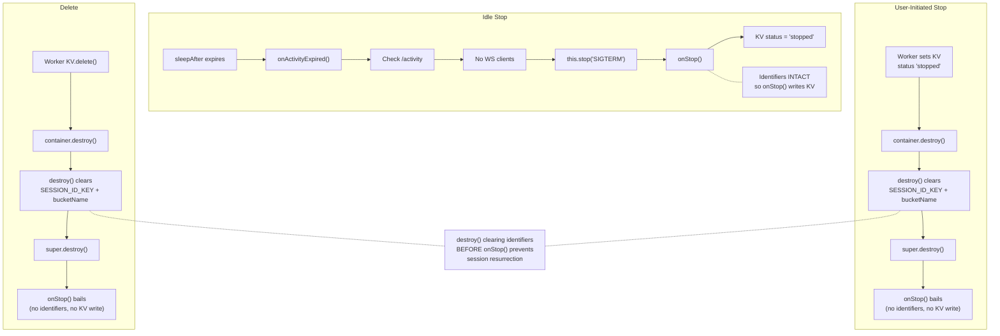

**Restart (same bucket):** `setBucketName` -> 409 (bucket already set, but stores `sessionId`, `workspaceSyncEnabled`, `tabConfig`, and `fastStartEnabled` in DO storage for KV reconciliation and preference updates) -> `startAndWaitForPorts()` -> `onStart()` re-arms metrics

**Restart (different bucket):** `setBucketName` succeeds -> `destroy()` (wipes DO storage) -> lifecycle route re-calls `setBucketName` (re-populates sessionId + bucketName + R2 creds) -> `startAndWaitForPorts()`

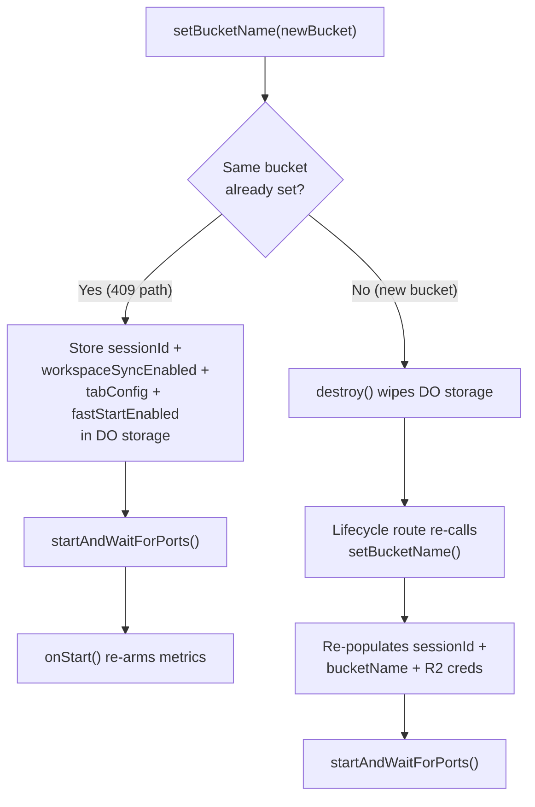

### Metrics Data Flow

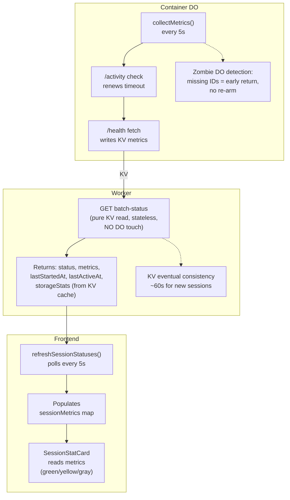

---

## 5. Storage and Sync

### Why rclone bisync (Not s3fs)

s3fs FUSE: every file op = network call (~340ms PUT, ~50ms HEAD), fragile on network hiccups, "Socket not connected" errors.

rclone bisync: all file ops on local disk (<1ms), background daemon every 60s, final bisync on shutdown (SIGINT/SIGTERM), stable.

### Initial Sync on Startup

1. One-way `rclone sync` from R2 to local (restore data) — blocking, container waits for completion (120s timeout)
2. All file modifications run (`.claude.json`, `.gemini/settings.json`, `.codex/version.json`, tab autostart) — these complete before bisync starts to avoid hash mismatches
3. `rclone bisync --resync --ignore-checksum --max-delete 100 --check-sync=false --retries 3 --retries-sleep 10s` to establish baseline (non-blocking — runs in background), then start 60-second daemon

All bisync commands use `--ignore-checksum` to skip post-transfer MD5 verification. rclone v1.73+ treats hash mismatches as fatal ("corrupted on transfer"), which aborts bisync when files change during transfer (e.g., coding agents modifying workspace files). Change detection still uses modtime + size; files that change mid-transfer are caught in the next 60s cycle.

`--max-delete 100` allows bisync to propagate bulk deletions (e.g., deleting entire workspace folders). The rclone default of 50% aborts bisync when more than half the files are deleted in one cycle — in a config-heavy sync with few files, even a single folder deletion can exceed this threshold.

### What's Synced vs Excluded

| Path | Synced | Reason |
|------|--------|--------|
| `~/.claude/` | Yes | Claude credentials, config, projects |
| `~/.config/` | Yes | App configs (gh CLI, etc.) |
| `~/.gitconfig` | Yes | Git configuration |
| `~/workspace/` | Depends on `SYNC_MODE` | Excluded by default (`none`). Synced when `full` or partially with `metadata`. |
| `~/.npm/`, `~/.bun/`, `~/.cache/**`, `~/.config/rclone/**` | **NO** | Package manager and rclone caches, regenerated |
| `~/.local/share/claude/**` | **NO** | Native installer version binaries (leftover data, removed from build) |
| `~/.copilot/logs/**`, `~/.copilot/pkg/**` | **NO** | Copilot session logs and auto-update binary |
| `~/.codex/sessions/**`, `~/.codex/log/**`, `~/.codex/tmp/**`, etc. | **NO** | Codex ephemeral session data and caches |
| `~/.claude/cache/**`, `~/.claude/debug/**`, `~/.claude/file-history/**`, etc. | **NO** | Claude Code session-specific ephemeral data |
| `~/.cpan/**` | **NO** | Perl CPAN package manager cache, regenerated |
| `~/.gemini/tmp/**` | **NO** | Gemini CLI temp files (ripgrep binary, chat logs) |
| `~/.local/share/opencode/log/**`, `opencode.db-shm`, `opencode.db-wal` | **NO** | OpenCode session logs and SQLite temp files |

### rclone Sync Modes

| Mode | Workspace Sync | Use Case |
|------|---------------|----------|
| `none` | Excluded entirely | Default. Settings and config only. |
| `full` | Entire `workspace/` (minus `node_modules/`) | Persistent storage across stop/resume |
| `metadata` | Only agent config files (`.claude/` and `CLAUDE.md`) per repo | Lightweight project context sync |

All modes always exclude: `.bashrc`, `.bash_profile`, `.npm/**`, `.bun/**`, `.cache/**`, `.config/rclone/**`, `**/node_modules/**`, `.local/share/claude/**`, `.copilot/logs/**`, `.copilot/pkg/**`, `.copilot/session-state/**`, `.codex/sessions/**`, `.codex/state*.sqlite-shm`, `.codex/state*.sqlite-wal`, `.claude/cache/**`, `.claude/debug/**`, `.claude/file-history/**`, `.claude/plugins/cache/**`, `.claude/plugins/marketplaces/**/.git/**`, `.claude/session-env/**`, `.claude/shell-snapshots/**`, `.claude/stats-cache.json`, `.claude.json.backup.*`, `.codex/log/**`, `.codex/models_cache.json`, `.codex/.personality_migration`, `.codex/shell_snapshots/**`, `.codex/tmp/**`, `.codex/version.json`, `.cpan/**`, `.gemini/tmp/**`, `.local/share/opencode/log/**`, `.local/share/opencode/opencode.db-shm`, `.local/share/opencode/opencode.db-wal`. All rclone commands use `--filter` flags (NOT `--include`/`--exclude`).

**Note:** The `metadata` mode is defined in `entrypoint.sh` but the Container DO currently only maps `workspaceSyncEnabled` to `full` or `none`. The `metadata` mode can be used by setting `SYNC_MODE` directly in the container environment.

### Conflict Resolution

Newest file wins (`--conflict-resolve newer`). `--resilient` + `--recover` handle transient bisync failures (e.g., interrupted transfers, listing mismatches) without losing deletion tracking. The sync daemon retries in 60s on failure. `--max-delete 100` on ALL bisync commands (`establish_bisync_baseline` and `bisync_with_r2`) allows bulk workspace deletions to propagate. Shutdown handler runs final bisync. All bisync commands use `--ignore-checksum` to prevent false hash-mismatch aborts — rclone v1.73 introduced stricter post-transfer MD5 verification that fails when files change during sync.

`--check-sync=false` disables rclone's post-sync listing validation on both `establish_bisync_baseline` and `bisync_with_r2`. The validation compares local/remote file listings after sync — if files change on R2 during the sync (e.g., another active session writing), the listings diverge and rclone exits with code 7 (critical abort). This was the most common trigger. With `--check-sync=false`, drift is caught by the next 60s cycle instead.

`--retries 3 --retries-sleep 10s` (rclone v1.66+) on both functions adds bisync-level retries for transient R2 API failures. Each bisync invocation retries up to 3 times with 10s sleep between attempts, before the daemon-level retry logic even kicks in.

**Consecutive failure recovery:** The daemon tracks consecutive bisync failures. After 3 consecutive failures (each with 3 internal retries = 9 total attempts), falls back to `establish_bisync_baseline` (which uses `--resync`) to re-establish clean bisync state. `--resync` merges both sides (files present on only one side get copied to the other), so this is a last resort. The counter resets to 0 on any success or after the resync fallback.

**Bisync exit code handling:** `bisync_with_r2()` uses a temp file approach instead of `| tee` to capture both output and exit code. Piping through `tee` swallows the rclone exit code (the pipe's exit code is `tee`'s, not rclone's), masking bisync failures and breaking error detection in the daemon loop. Both functions redirect with `> "$FILE" 2>&1` (not `2>&1 > "$FILE"`). The old order sent stderr to the parent process's stdout (lost) and only captured stdout in the file. rclone outputs errors and verbose info to stderr, so all diagnostic output was invisible in `/tmp/sync.log`.

**Bisync-initialized flag on timeout:** The bisync-initialized flag (`/tmp/.bisync-initialized`) is now touched on the sync timeout path as well. Previously, if initial sync timed out, the flag was never set, causing the shutdown trap to skip the final bisync — losing any files created during the session.

### Memory Persistence

Agent memory (knowledge graph via `@modelcontextprotocol/server-memory`) persists across sessions using per-session JSONL files synced to R2.

**Lifecycle:**
1. Container boots, rclone pulls `~/.memory/session-*.jsonl` files from R2
2. `entrypoint.sh` runs `merge_memory_files()`: consolidates all session files into `session-{SESSION_ID}.jsonl`, deduplicating entities (by name) and relations (by JSON equality)
3. `server-memory` MCP server reads/writes `session-{SESSION_ID}.jsonl` during the session
4. rclone bisync syncs changes back to R2 every 60s and on shutdown
5. `cleanup_old_memory_files()` removes old session files after bisync baseline is established

**Why per-session JSONL:** Multiple concurrent sessions from the same user write to the same R2 bucket. A shared file would cause last-write-wins data loss. Per-session JSONL files eliminate write conflicts — each session owns its own file, and merge-on-boot consolidates them.

**Two-phase merge/cleanup:** The merge runs after R2 sync but before bisync baseline establishment. Old files are kept so `--resync` doesn't resurrect them. Cleanup (local-only deletion) runs after bisync baseline succeeds, so periodic bisync propagates the deletions to R2. Direct R2 deletion is unsafe for concurrent sessions — another session's bisync would propagate the deletion locally, destroying the active memory file. The rclone config uses `disable_checksum = true` to prevent `BadDigest` errors from files modified during upload (pre-warm PTY race condition).

---

## 6. Authentication

### Cloudflare Access Integration

**Browser/JWT:** `cf-access-authenticated-user-email` + `cf-access-jwt-assertion` headers.

**Service Token:** `CF-Access-Client-Id` + `CF-Access-Client-Secret` headers. Mapped to email via `SERVICE_TOKEN_EMAIL`.

**Email Normalization:** Trimmed + lowercased before KV lookup, role resolution, and bucket name derivation.

### Access Application Destination Strategy

One Access application with five destinations: `/app`, `/app/*`, `/api/*`, `/setup`, `/setup/*`. Including exact + wildcard variants removes ambiguity. Uses all 5 allowed entries.

### Access Group Model

Per-worker groups: `<worker-name>-admins`, `<worker-name>-users`. Setup upserts both, stores IDs in KV. `/api/users` syncs group membership via `syncAccessPolicy()`. `GET /api/setup/prefill` reads existing membership for redeploy prefill. Admin-only deployments (0 regular users) are supported: the users group is skipped entirely and the Access policy references only the admin group.

### Root Redirect

- Setup incomplete -> redirect to `/setup`
- Setup complete, default mode -> `/` redirects to `/app/`
- Setup complete, onboarding mode -> authenticated users to `/app/`, unauthenticated to public landing

### Auth Flow

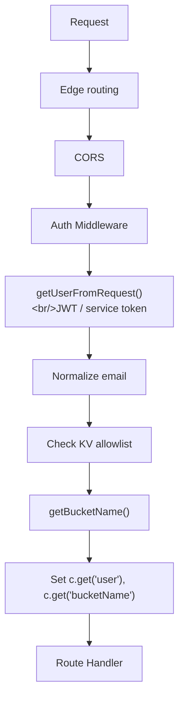

### Per-User Bucket Naming

`user@example.com` -> `codeflare-user-example-com` (sanitized, max 63 chars).

### Bucket Auto-Creation

**File:** `src/lib/r2-admin.ts` - `createBucketIfNotExists()` via Cloudflare API on first container start.

---

## 7. Security Model

### CF Access Gate

Cloudflare Access protects all authenticated surfaces (see Section 6 for Access application destination strategy).

### API Token Containment

The `CLOUDFLARE_API_TOKEN` never enters the container. It stays in the Worker/DO environment (GitHub Secrets -> Worker secrets). Containers only receive R2 credentials (scoped key pair), never the master API token.

**Per-user scoped R2 tokens:** Each container receives a scoped R2 API token restricted to its owner's bucket. Tokens are created on first login via `getOrCreateScopedR2Token()` in `r2-admin.ts` (called from `lifecycle.ts`), which calls `POST /accounts/{accountId}/tokens` with a bucket-specific Object Read + Write policy. Tokens are cached in KV as `r2token:{email}` and revoked on user deletion via `deleteScopedR2Token()`. This requires the `API Tokens: Edit` permission on the deploy token.

### Container Auth Token

A random UUID is generated per DO lifecycle and passed to the container as `CONTAINER_AUTH_TOKEN` env var. All proxied HTTP requests from the DO to the container include this token in the `Authorization: Bearer` header. The terminal server (`host/server.js`) validates this token on all non-exempt paths. `getTcpPort().fetch()` bypasses the DO's `fetch()` override (which injects the header), so internal paths (`/health`, `/activity`) must be in `authExemptPaths`.

### Dual R2 Credential Architecture

Two types of R2 credentials serve different purposes:

**Worker-level R2 credentials** (setup wizard):
- Created during `POST /configure` step 2 (`handleDeriveR2Credentials`)
- `R2_ACCESS_KEY_ID` = API token ID (from `/user/tokens/verify`)
- `R2_SECRET_ACCESS_KEY` = SHA-256(API token value)
- Stored as worker secrets — used for bucket admin operations (create, empty, delete)
- If API token rotated, must re-run setup to regenerate

**Per-user scoped R2 tokens** (first login):
- Created via `getOrCreateScopedR2Token()` in `src/routes/container/lifecycle.ts`
- Calls `POST /accounts/{accountId}/tokens` with bucket-specific Object Read + Write policy
- Token ID = S3 Access Key ID, SHA-256(token value) = S3 Secret Access Key
- Cached in KV as `r2token:{email}` — survives container restarts
- Passed to container via `setBucketName` → container env vars → rclone config
- Revoked via `deleteScopedR2Token()` on user deletion
- Requires `API Tokens: Edit` permission on the deploy token

### Graceful Shutdown

`STOPSIGNAL SIGINT` in the Dockerfile. The `entrypoint.sh` trap handler catches SIGINT/SIGTERM, kills the sync daemon via PID file at `/tmp/sync-daemon.pid` (PID file is the sole mechanism — no in-memory PID variable fallback), runs a final `rclone bisync` (with `--ignore-checksum --max-delete 100`) to R2, and kills the terminal server. The bisync-initialized flag is touched on the timeout path as well (was previously missing, which caused shutdown to skip final bisync when initial sync timed out). This ensures no data loss on container stop.

### Security Headers

Applied to every response in `src/index.ts`:
- `Strict-Transport-Security` (HSTS)
- `Content-Security-Policy`
- `X-Content-Type-Options: nosniff`
- `X-Frame-Options: DENY`
- `Referrer-Policy: strict-origin-when-cross-origin`
- `Permissions-Policy`

HSTS is also applied to all redirect responses via `secureRedirect()` helper, including root redirect and CORS preflight redirects, ensuring browsers upgrade to HTTPS even on redirect hops.

### Session ID Validation

`SESSION_ID_PATTERN` (`/^[a-z0-9]{8,24}$/`) is enforced on terminal WebSocket upgrade and container lifecycle endpoints (`terminal.ts`, `container/lifecycle.ts`). Invalid session IDs are rejected with 400 before any DO interaction, preventing malformed IDs from creating orphaned Durable Objects.

### Body Limit

64 KiB on all `/api/*` routes (storage routes exempt for file uploads).

### Rate Limiting

Per-user rate limiting via `createRateLimiter()` factory in `src/middleware/rate-limit.ts`. Keyed by `bucketName` (user identifier set by auth middleware), falls back to `CF-Connecting-IP` for unauthenticated requests.

**Storage:** Primary storage is Cloudflare KV with automatic TTL expiry (window duration + 60s buffer). When KV operations fail, falls back to an in-memory `Map` with periodic cleanup every 100 requests to prevent unbounded growth.

**Response Headers:** All rate-limited responses include:
- `X-RateLimit-Limit`: Maximum requests per window
- `X-RateLimit-Remaining`: Remaining requests in current window

When the limit is exceeded: HTTP 429 with `{ code: "RATE_LIMIT_ERROR", message: "Rate limit exceeded. Try again in N seconds." }`

**KV Key Pattern:** `{keyPrefix}:{userId}` — e.g., `storage-upload:codeflare-user-john-example-com`. Use `rl-` prefix when the key prefix would collide with application cache keys (e.g., `storage-stats` collides with the stats cache key `storage-stats:{bucketName}`, so the rate limiter uses `rl-storage-stats`).

**Rate limits per endpoint:**

| Endpoint | Method | Limit | Key Prefix |
|----------|--------|-------|-----------|
| `/api/storage/upload/*` | POST | 60/min | `storage-upload` |
| `/api/storage/delete` | POST | 20/min | `storage-delete` |
| `/api/storage/move` | POST | 20/min | `storage-move` |
| `/api/storage/seed/*` | POST | 3/min | `storage-seed` |
| `/api/storage/download` | GET | 120/min | `storage-download` |
| `/api/storage/preview` | GET | 120/min | `storage-preview` |
| `/api/storage/browse` | GET | 30/min | `storage-browse` |
| `/api/storage/stats` | GET | 10/min | `rl-storage-stats` |
| `/api/sessions/:id` | DELETE | 10/min | `session-delete` |
| `/api/sessions/:id/stop` | POST | 10/min | `session-stop` |
| `/api/user/ensure-r2-token` | POST | 5/min | `ensure-r2-token` |
| `/api/sessions` | POST | 10/min | `session-create` |
| `/api/container/start` | POST | 10/min | `container-start` |
| `/api/users/:email` | DELETE | 20/min | `user-mutation` |
| `/api/setup/detect-token` | POST | 5/min | `setup` |
| `/api/setup/prefill` | POST | 5/min | `setup` |
| `/api/setup/configure` | POST | 5/min | `setup` |

**Adding a new rate limiter:**

```typescript
import { createRateLimiter } from '../../middleware/rate-limit';

const myRateLimiter = createRateLimiter({
  windowMs: 60_000,    // 1 minute window
  maxRequests: 10,     // max 10 requests per window
  keyPrefix: 'my-route', // KV key prefix (must not collide with app cache keys)
});

// Apply to all routes in a sub-app:
app.use('*', myRateLimiter);

// Or apply to a specific route inline:
app.post('/endpoint', myRateLimiter, async (c) => { ... });
```

**Stress Test Bypass:** When `STRESS_TEST_MODE` is set to `"active"`, all HTTP and WebSocket rate limits are bypassed. This is intended for integration environments only, to allow k6 stress tests with high virtual user counts (1000+) through a single service token identity. The bypass skips all KV rate-limit reads/writes for zero overhead. A one-time warning is logged per isolate when the bypass activates.

### Content-Disposition Hardening

File download responses use `Content-Disposition: attachment` with sanitized filenames. Special characters are stripped and filenames are truncated to prevent header injection.

### Input Validation (atob)

Base64-encoded inputs are validated with try/catch around `atob()`. Invalid base64 returns 400 immediately rather than propagating decode errors.

### WebSocket Rate Limit

30 connections per 60-second window per user (`WS_RATE_LIMIT_WINDOW_MS = 60000`, `WS_RATE_LIMIT_MAX_CONNECTIONS = 30`). Defined in `src/lib/constants.ts`.

### Session Limits

Per-user cap on concurrent running sessions, configurable by role via `MAX_SESSIONS_USER` (default: 3) and `MAX_SESSIONS_ADMIN` (default: 10) in `wrangler.toml`.

**Frontend-first enforcement:** The dashboard disables the start button when `isAtSessionLimit()` returns true (running + initializing sessions >= maxSessions). A popup explains the limit and which sessions to stop.

**Backend loose check:** `POST /api/container/start` counts KV sessions with `status === 'running'` under the user's prefix (excluding the current session to allow restarts). Returns 429 `RateLimitError` if at or over the limit. This is a secondary guard -- the frontend prevents most limit violations before they reach the backend.

**`GET /api/sessions/batch-status`** returns `maxSessions` alongside `statuses` so the frontend stays in sync with the server-side limit without hardcoding defaults.

### Path Traversal Prevention

Browse endpoint validates prefix parameter against directory traversal (`..` rejection) and protected path access via `validateKey()` in `src/routes/storage/validation.ts`.

### Container Image Scanning

Trivy scans Docker images for HIGH/CRITICAL vulnerabilities before deployment (in `deploy.yml`).

### Protected R2 Paths

Cannot be accessed via the web storage API (browse, upload, delete, move). These paths ARE synced to R2 via rclone for session persistence (credentials, config, plugins). Defined in `PROTECTED_PATHS` in `src/lib/constants.ts`: `.claude/`, `.anthropic/`, `.ssh/`, `.config/`, `.claude.json`.

---

## 8. API Reference

### Common Response Headers

| Header | Description |
|--------|-------------|
| `X-Request-ID` | Unique request identifier (UUID) |
| `X-RateLimit-Limit` | Max requests per window (rate-limited endpoints) |
| `X-RateLimit-Remaining` | Requests remaining (rate-limited endpoints) |

### Error Response Format

```json
{ "error": "User-friendly message", "code": "ERROR_CODE" }
```

Codes: `NOT_FOUND` (404), `VALIDATION_ERROR` (400), `CONTAINER_ERROR` (500), `AUTH_ERROR` (401), `FORBIDDEN` (403), `SETUP_ERROR` (400), `RATE_LIMIT_ERROR` (429), `CIRCUIT_BREAKER_OPEN` (503).

Note: `SETUP_ERROR` uses a different response shape: `{ success: false, steps, error, code }` instead of the standard `{ error, code }`.

### Session Management

| Method | Endpoint | Description |
|--------|----------|-------------|
| GET | `/api/sessions` | List sessions |
| POST | `/api/sessions` | Create session (rate limited) |
| GET | `/api/sessions/:id` | Get session |
| PATCH | `/api/sessions/:id` | Update session |
| DELETE | `/api/sessions/:id` | Delete session and destroy container |
| POST | `/api/sessions/:id/touch` | Update lastAccessedAt |
| POST | `/api/sessions/:id/stop` | Stop session (KV 'stopped' + container.destroy()) |
| GET | `/api/sessions/:id/status` | Get session and container status |
| GET | `/api/sessions/batch-status` | Batch status for all sessions (status, ptyActive, lastActiveAt, lastStartedAt, metrics, maxSessions, storageStats from KV cache) |

### Container Lifecycle

| Method | Endpoint | Description |
|--------|----------|-------------|
| POST | `/api/container/start` | Start container (non-blocking) |
| POST | `/api/container/destroy` | Destroy container (SIGKILL) |
| GET | `/api/container/startup-status` | Poll startup progress |
| GET | `/api/container/health` | Health check |

### Terminal

| Method | Endpoint | Description |
|--------|----------|-------------|
| WS | `/api/terminal/:compoundId/ws` | Terminal WebSocket (compoundId format: `sessionId-terminalId`) |
| GET | `/api/terminal/:sessionId/status` | Connection status |

### User Management

| Method | Endpoint | Description |
|--------|----------|-------------|
| GET | `/api/user` | Authenticated user info (includes `onboardingActive`) |
| GET | `/api/users` | List allowed users (admin only) |
| DELETE | `/api/users/:email` | Remove allowed user (admin only) |

### Setup

| Method | Endpoint | Description |
|--------|----------|-------------|
| GET | `/api/setup/status` | Check setup status |
| GET | `/api/setup/detect-token` | Auto-detect token from env |
| GET | `/api/setup/prefill` | Prefill emails from existing Access groups |
| POST | `/api/setup/configure` | Run configuration (NDJSON stream response) |

**`POST /configure` streams NDJSON:** Returns `Content-Type: application/x-ndjson` with per-step progress lines as each CF API step executes. Each line is a JSON object:
- **Step progress:** `{"step":"create_r2","status":"running"}` then `{"step":"create_r2","status":"success"}` (or `"error"` with optional `error` field)
- **Final summary:** `{"done":true,"success":true,"steps":[...],"workersDevUrl":"...","customDomainUrl":"..."}` or `{"done":true,"success":false,"error":"...","steps":[...]}`
- Always returns HTTP 200 -- errors are conveyed within the stream. Validation errors (missing fields) still return HTTP 400 before streaming begins.
- Frontend reads via `response.body.getReader()` with buffer-based line parsing, updating `configureSteps` progressively so the UI shows real-time step status.

Public before setup; admin-only after. All `adminUsers` must also be in `allowedUsers`. Regular users (`allowedUsers` beyond admins) are optional -- admin-only deployments with 0 regular users are fully supported.

### Storage (R2 File Browser)

| Method | Endpoint | Description |
|--------|----------|-------------|
| GET | `/api/storage/browse` | List objects in R2 prefix |
| POST | `/api/storage/upload` | Upload file |
| GET | `/api/storage/download` | Download file |
| POST | `/api/storage/delete` | Delete object |
| POST | `/api/storage/move` | Move/rename object |
| GET | `/api/storage/preview` | Preview file content |
| GET | `/api/storage/stats` | File/folder counts (60s KV cache, refreshes from R2 on miss/stale) |
| POST | `/api/storage/seed/getting-started` | Seed tutorial docs |
| POST | `/api/storage/upload/initiate` | Initiate multipart upload |
| POST | `/api/storage/upload/part` | Upload a single part (base64 body) |
| POST | `/api/storage/upload/complete` | Complete multipart upload |
| POST | `/api/storage/upload/abort` | Abort multipart upload |

### Presets

GET `/api/presets`, POST `/api/presets`, PATCH `/api/presets/:id` (rename), DELETE `/api/presets/:id`

### Preferences

GET `/api/preferences`, PATCH `/api/preferences`

`UserPreferences` fields: `lastAgentType` (AgentType, optional — last selected agent), `lastPresetId` (string, optional — last used preset), `workspaceSyncEnabled` (boolean, optional — workspace sync toggle), `fastStartEnabled` (boolean, default: `true` — fast CLI start toggle). The `fastStartEnabled` preference maps to `FAST_CLI_START` env var in the container DO -- see [Fast Start](#fast-start).

### Public (Onboarding)

GET `/public/onboarding-config`, POST `/public/waitlist` (rate limited)

### Health

GET `/health`, GET `/api/health`

---

## 9. Container Image

**File:** `Dockerfile` - Base: `node:24-bookworm-slim`, multi-stage build (builder compiles native addons, runtime has no build tools).

### Installed Tools

| Category | Packages |
|----------|----------|
| Sync | rclone |
| Version Control | git, github-cli (gh), lazygit (v0.59.0) |
| Editors | vim (symlinked to neovim), neovim, nano |
| Network | curl, openssh-client |
| Process | procps (ps, pgrep) |
| Utilities | jq, ripgrep, fd, tree, htop, tmux, yazi (v26.1.22), fzf, zoxide, bat |

### Global NPM Packages

Versions are pinned in the Dockerfile and updated periodically (`.cache-bust` layer invalidation triggers fresh installs on each deploy). The Dockerfile is the source of truth for version pins - versions listed below are approximate and may drift between documentation updates.

| Package | Version | Provides |
|---------|---------|----------|
| `claude-unleashed` | Git commit pin | `cu` / `claude-unleashed` commands (wraps `@anthropic-ai/claude-code`). Used as the "Claude Code" agent in the UI -- provides root permission bypass and controlled update mechanism. |
| `@openai/codex` | 0.105.0 | `codex` command |
| `@google/gemini-cli` | 0.30.0 | `gemini` command |
| `opencode-ai` | 1.2.15 | `opencode` command |
| `@github/copilot` | 0.0.418 | `copilot` command |

### V8 Compile Cache Warm-Up

Node.js CLIs (codex, gemini, copilot) are warmed at Docker build time by running `--version`, which triggers V8 to compile and cache bytecode via `NODE_COMPILE_CACHE`. This pre-populates the compile cache so that first-launch inside containers skips the JavaScript compilation overhead, resulting in faster startup times. Go binaries (like `opencode`) are already natively compiled and do not need V8 cache warm-up. Claude Code is pre-updated and pre-patched at build time via `claude-unleashed --silent --no-consent --help`, which seeds the V8 compile cache.

### OpenCode Database Pre-Initialization

OpenCode uses SQLite with Goose migrations that run on first startup ("Performing one time database migration"). The DB is stored at `~/.local/share/opencode/opencode.db` (XDG data directory). To avoid this overhead at container start, the Dockerfile runs `opencode run "hello"` at build time which triggers the migration, creating the sessions/files/messages schema so the first interactive launch is fast.

### Browser Shims

CLI tools (Claude Code, OpenCode, Gemini) try to open a browser for OAuth. The Dockerfile installs shims (`open-url` for `BROWSER` env var, `xdg-open-shim` for `xdg-open`) that exit 1, forcing CLIs to print auth URLs as plain text in the PTY. The xterm.js link provider then detects and makes these URLs clickable.

Port: 8080 (single port architecture).

---

## 10. Container Startup

**File:** `entrypoint.sh`

Uses polling with safety timeouts: poll until success OR background process exits OR safety timeout expires. Exit immediately on success. Safety timeout `SYNC_TIMEOUT=120` (2 min) prevents infinite blocking.

### Parallel Startup

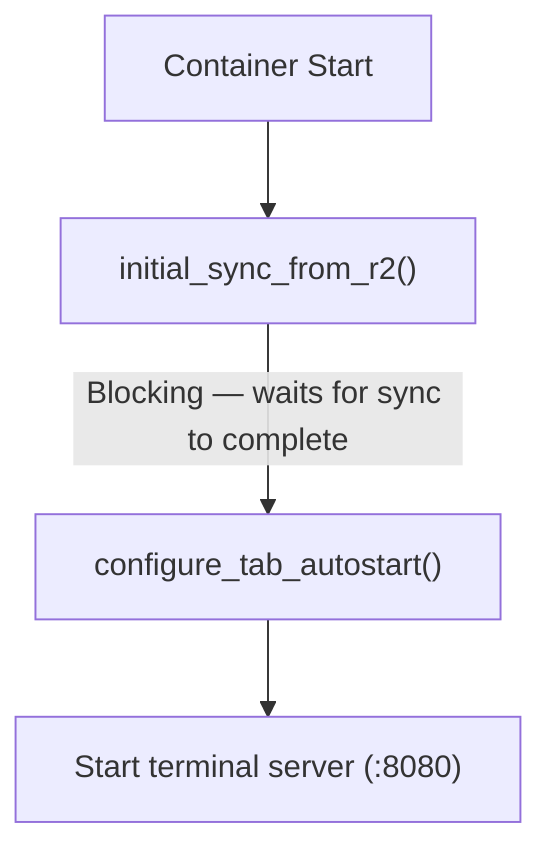

Auto-start uses `cu --silent --no-consent` for fast boot. Auto-updates are disabled by default via `FAST_CLI_START=true` (see [Fast Start](#fast-start) below). Users can enable auto-updates via Settings, or update manually via `cu` in any tab.

**PTY PATH:** The `.bashrc` tab autostart block sets `PATH="/usr/local/bin:/usr/bin:/bin:$PATH"` so that PTY sessions can find globally installed CLI tools.

### Fast Start

**User preference:** `fastStartEnabled` (default: `true`) in `UserPreferences`.
**Container env var:** `FAST_CLI_START` (default: `'true'`).

When enabled, `entrypoint.sh` disables auto-update checks for all 5 AI tools, eliminating 5-30s of startup delay per tool. Each tool has a different disable mechanism:

| Tool | Disable Mechanism | Type |
|------|------------------|------|
| Claude Code (claude-unleashed) | `CLAUDE_UNLEASHED_NO_UPDATE=1`, `CLAUDE_UNLEASHED_CHANNEL=stable` | Env var |
| OpenCode | `OPENCODE_DISABLE_AUTOUPDATE=1` | Env var |
| Copilot | `COPILOT_AUTO_UPDATE=false` | Env var |
| Gemini | `~/.gemini/settings.json` -> `general.enableAutoUpdate: false` | Config file (jq merge) |
| Codex | `~/.codex/version.json` -> `dismissed_version: "999.0.0"` | Config file (overwrite) |

**Gemini settings.json merge pattern:** Uses `jq '. * {"general":{"enableAutoUpdate":false,"enableAutoUpdateNotification":false}}'` to deep-merge into existing settings. This preserves user customizations since the file is synced via rclone from R2. If the file doesn't exist, creates it with only the auto-update keys.

**Codex dismissed_version hack:** Writes `{"dismissed_version":"999.0.0"}` to trick the Codex version checker into thinking a future version was already dismissed. The `~/.codex/` directory is excluded from rclone sync, so this file is safe to recreate on every container start.

When Fast Start is disabled (`FAST_CLI_START=false`), `entrypoint.sh` unsets the Dockerfile-level env vars (`CLAUDE_UNLEASHED_NO_UPDATE`, `CLAUDE_UNLEASHED_CHANNEL`, `DISABLE_INSTALLATION_CHECKS`) and the entrypoint-level `OPENCODE_DISABLE_AUTOUPDATE`, and skips writing config files and setting `COPILOT_AUTO_UPDATE`, allowing all tools to check for updates normally.

---

## 11. Claude Code Integration

The "Claude Code" agent in Codeflare uses [claude-unleashed](https://github.com/nikolanovoselec/claude-unleashed) (`cu` command) behind the scenes. claude-unleashed enables `--dangerously-skip-permissions` when running as root inside containers (standard CLI prevents this via `process.getuid() === 0` check), and provides a controlled update mechanism.

**Updater:** claude-unleashed's updater checks npm for latest `@anthropic-ai/claude-code` - disabled at runtime via `CLAUDE_UNLEASHED_NO_UPDATE=1` to avoid ~25-30s startup delay from `npm view` + `npm install` on every container start. Updates happen at Docker build time instead (via `.cache-bust` layer invalidation). Upstream CLI's internal auto-updater is disabled via `DISABLE_INSTALLATION_CHECKS=1`.

### Environment Variables

**Global (Dockerfile ENV):** `NPM_CONFIG_UPDATE_NOTIFIER=false`, `CLAUDE_UNLEASHED_SKIP_CONSENT=1`, `CLAUDE_UNLEASHED_CHANNEL=stable`, `CLAUDE_UNLEASHED_NO_UPDATE=1`, `IS_SANDBOX=1`, `DISABLE_INSTALLATION_CHECKS=1`, `NODE_COMPILE_CACHE=/root/.cache/node-compile-cache`, `BROWSER=/usr/local/bin/open-url`

**Prewarm readiness:** Detected by first PTY output — as soon as the agent produces any terminal output, pre-warm is considered ready. This replaced the previous approach of agent-specific regex patterns and quiescence-based detection, which failed when agents weren't logged in (startup output was completely different, patterns didn't match, causing 20s timeout delays). The 20s hard timeout in `server.js` remains as a safety net for the rare case where a PTY produces no output at all. `host/prewarm-config.js` now only extracts the command name from `tabConfig` for logging.

**Auto-start flags (.bashrc):** `--silent`, `--no-consent`

---

## 12. File Structure

```
codeflare/
├── src/
│   ├── index.ts              # Hono router, WebSocket intercept, CORS
│   ├── types.ts              # TypeScript types
│   ├── routes/
│   │   ├── container/        # Container lifecycle API
│   │   │   ├── index.ts      # Route aggregator
│   │   │   ├── lifecycle.ts  # Start/destroy
│   │   │   ├── status.ts     # Health, startup-status
│   │   │   └── shared.ts     # Shared helpers
│   │   ├── session/          # Session API
│   │   │   ├── index.ts      # Route aggregator
│   │   │   ├── crud.ts       # CRUD operations
│   │   │   └── lifecycle.ts  # Start/stop/status/batch-status
│   │   ├── setup/            # Setup wizard
│   │   │   ├── index.ts      # Route aggregator
│   │   │   ├── handlers.ts   # Main configure handler
│   │   │   ├── secrets.ts    # Secret management
│   │   │   ├── custom-domain.ts # Domain configuration
│   │   │   ├── access.ts     # CF Access setup
│   │   │   ├── account.ts    # Account discovery
│   │   │   ├── credentials.ts # R2 credential setup
│   │   │   ├── turnstile.ts  # Turnstile widget setup
│   │   │   └── shared.ts     # Shared helpers
│   │   ├── storage/          # R2 file browser API
│   │   │   ├── index.ts      # Route aggregator
│   │   │   ├── browse.ts     # List objects
│   │   │   ├── delete.ts     # Delete objects
│   │   │   ├── download.ts   # Download files
│   │   │   ├── move.ts       # Move/rename
│   │   │   ├── preview.ts    # Preview content
│   │   │   ├── seed.ts       # Seed tutorial docs
│   │   │   ├── stats.ts      # File/folder counts
│   │   │   ├── upload.ts     # Upload (single + multipart)
│   │   │   └── validation.ts # Path validation
│   │   ├── public/
│   │   │   └── index.ts      # Onboarding endpoints
│   │   ├── presets.ts        # Preset CRUD
│   │   ├── preferences.ts    # User preferences
│   │   ├── terminal.ts       # Terminal WebSocket proxy
│   │   ├── user-profile.ts   # User info
│   │   └── users.ts          # User management
│   ├── middleware/            # auth.ts, rate-limit.ts
│   ├── lib/                  # access, access-policy, agent-config, cache-reset, cf-api,
│   │                         # circuit-breaker, circuit-breakers (per-container CB via
│   │                         #   getContainerXxxCB(containerId) — no more global singletons),
│   │                         # constants, container-helpers,
│   │                         # cors-cache, error-types, jwt, kv-keys, logger, onboarding,
│   │                         # r2-admin, r2-client, r2-config, r2-seed, schemas,
│   │                         # session-helpers, tutorial-seed.generated, type-guards,
│   │                         # user-cleanup, xml-utils
│   │                         #   escapeXml() — sanitizes user input for XML/HTML interpolation
│   │                         #   decodeXmlEntities() — decodes &amp; &lt; etc. from R2 S3 API responses
│   │                         #   FIX-39 audit trail in file header tracks all interpolation sites
│   ├── container/index.ts    # Container DO class
│   └── __tests__/            # Backend unit tests (68 files, ~996 tests)
├── e2e/                      # E2E tests: 12 API files (~55 tests) + 10 UI files (~75 tests, Puppeteer)
├── host/
│   ├── server.js             # HTTP/WS server, auth, routing, prewarm, signal handlers (~496 lines)
│   ├── session.js            # Session class — PTY management, tab lifecycle (~312 lines)
│   ├── session-manager.js    # SessionManager class, PREWARM_SESSION_ID constant (~177 lines)
│   ├── metrics.js            # System metrics collection (disk usage, sync status) (~74 lines)
│   ├── activity-tracker.js   # WebSocket disconnect tracking for idle detection
│   ├── prewarm-config.js     # PTY pre-warm configuration (first-output readiness)
│   ├── __tests__/            # Host unit tests (9 files: prewarm, activity tracker, WS input, server prewarm integration, entrypoint sync filter, server security, host fixes, fuzz, memory merge/cleanup)
│   ├── knip.json             # Dead code detection config for host package
│   └── package.json
├── web-ui/
│   └── src/
│       ├── components/       # SolidJS components (Terminal, Layout, SessionCard, StorageBrowser, etc.)
│       ├── stores/           # terminal.ts, terminal-layout.ts, terminal-url-detection.ts, session.ts, storage.ts, setup.ts, tiling.ts, session-presets.ts, session-tabs.ts, preferences.ts, r2-readiness.ts
│       ├── api/              # client.ts, fetch-helper.ts, storage.ts
│       ├── hooks/            # useTerminal.ts, useStageTimings.ts
│       ├── lib/              # constants, schemas, terminal-config, terminal-link-provider, xterm-internals, settings, format, mobile, + others
│       ├── styles/           # CSS (design tokens, animations, component styles)
│       └── __tests__/        # Frontend unit tests (68 files)
├── .oxlintrc.json            # oxlint configuration (root + web-ui)
├── scripts/                  # generate-tutorial-seed.mjs, fix-broken-sourcemaps.js
├── tutorials/                # Tutorial content (Getting Started, Examples, etc.)
├── Dockerfile                # Multi-stage container image
├── entrypoint.sh             # Container startup script
├── wrangler.toml             # Cloudflare configuration
├── vitest.config.ts          # Backend test config
└── vitest.e2e.config.ts      # E2E test config
```

### Intentional Schema Duplication (Bundle Boundary)

`src/lib/schemas.ts` (backend) and `web-ui/src/lib/schemas.ts` (frontend) contain similar Zod schemas for API response validation. This is intentional, not a DRY violation. The frontend (`web-ui/`) has its own Vite build pipeline and produces a separate bundle — it cannot import from the backend Workers module. Both schemas validate the same API contract but live in independent build targets.

### Critical Paths Inside Container

| Path | Purpose |
|------|---------|
| `/home/user` | User home directory |
| `/home/user/workspace` | Working directory (synced to R2) |
| `/home/user/.claude/` | Claude config and credentials |
| `/home/user/.config/rclone/rclone.conf` | rclone configuration |
| `/tmp/sync-status.json` | Sync status (read by health server) |
| `/tmp/sync.log` | Sync log for debugging |

---

## 13. Environment Variables

### Worker Environment

| Variable | Purpose | Source |
|----------|---------|--------|
| `SERVICE_TOKEN_EMAIL` | Email for service token auth | Optional |
| `CLOUDFLARE_API_TOKEN` | R2 bucket creation | Wrangler secret |
| `R2_ACCESS_KEY_ID` | R2 auth for containers | Wrangler secret |
| `R2_SECRET_ACCESS_KEY` | R2 auth for containers | Wrangler secret |
| `R2_ACCOUNT_ID` | R2 endpoint construction | Dynamic (env with KV fallback) |
| `R2_ENDPOINT` | S3-compatible endpoint | Dynamic (env with KV fallback) |
| `ALLOWED_ORIGINS` | CORS patterns (comma-separated) | wrangler.toml |
| `LOG_LEVEL` | Min log level (default: "info") | wrangler.toml |
| `ONBOARDING_LANDING_PAGE` | `"active"` enables public waitlist landing | wrangler.toml |
| `TURNSTILE_SECRET_KEY` | Optional direct Turnstile secret override | Optional |
| `RESEND_API_KEY` | Waitlist notification emails | Optional |
| `WAITLIST_FROM_EMAIL` | Sender identity for waitlist | Optional |
| `CLOUDFLARE_WORKER_NAME` | Worker name override for forks (set at deploy time via `--var`, also used at runtime by worker code) | GitHub Actions variable / Worker runtime env |
| `MAX_SESSIONS_USER` | Per-user session cap (default: 3) | wrangler.toml |
| `MAX_SESSIONS_ADMIN` | Per-admin session cap (default: 10) | wrangler.toml |
| `SERVICE_AUTH_SECRET` | Worker secret for E2E/CLI service auth (`X-Service-Auth` header) | Worker secret (optional) |
| `STRESS_TEST_MODE` | `"active"` disables all rate limits (integration only) | Worker env var |

### Container Environment

| Variable | Purpose | Source |
|----------|---------|--------|
| `R2_BUCKET_NAME` | User's personal bucket | Worker -> DO via `setBucketName` |
| `R2_ACCESS_KEY_ID` / `R2_SECRET_ACCESS_KEY` | rclone auth | Worker -> DO (preferred) or DO `this.env` fallback |
| `R2_ACCOUNT_ID` / `R2_ENDPOINT` | rclone endpoint | Worker -> DO or `getR2Config()` fallback |
| `AWS_ACCESS_KEY_ID` / `AWS_SECRET_ACCESS_KEY` | S3 compatibility | Mirrors R2 keys |
| `TERMINAL_PORT` | Always 8080 | Hardcoded |
| `SYNC_MODE` | Sync strategy (`none`, `full`, or `metadata`) -- see Section 5 | Worker -> DO |
| `WORKSPACE_SYNC_ENABLED` | Whether workspace sync is enabled (`'true'`/`'false'`). Drives `SYNC_MODE` value. | Worker via `setBucketName` |
| `TAB_CONFIG` | JSON array of terminal tab configurations | Worker -> DO |
| `TERMINAL_ID` | Unique ID for this terminal instance | Host terminal server (`session.js`) |
| `CONTAINER_AUTH_TOKEN` | Auth token for container API calls | Worker -> DO |
| `MANUAL_TAB` | Set to `1` for user-created tabs to skip autostart | Worker -> DO |
| `FAST_CLI_START` | Disables auto-update for all 5 AI tools when `'true'` (default). Set `'false'` to allow auto-updates. See [Fast Start](#fast-start). | Worker -> DO (from `fastStartEnabled` preference) |
| `NODE_COMPILE_CACHE` | V8 compile cache dir for faster Node.js CLI startup | Dockerfile ENV (`/root/.cache/node-compile-cache`) |
| `BROWSER` | Points to `open-url` shim that exits 1, forcing CLIs to print OAuth URLs as text | Dockerfile ENV (`/usr/local/bin/open-url`) |

---

## 14. Configuration

### Secrets

Repository: `CLOUDFLARE_API_TOKEN`, `CLOUDFLARE_ACCOUNT_ID`, optional `RESEND_API_KEY`

Worker secrets lifecycle: deploy sets `CLOUDFLARE_API_TOKEN`, setup writes `R2_ACCESS_KEY_ID`/`R2_SECRET_ACCESS_KEY`, Turnstile keys stored in KV. **Worker-level R2 credentials are derived from the API token** (used for bucket admin operations like create/empty/delete). Per-user scoped R2 tokens are separate — created on first login, independent of the master token but revoked when the API token changes. If the token is rotated, setup must be re-run.

### CORS

Dynamic: setup wizard adds custom domain + `.workers.dev` to KV. `ALLOWED_ORIGINS` env var is static fallback.

`R2_ACCOUNT_ID` and `R2_ENDPOINT` resolved dynamically (env vars with KV fallback).

### Container Specs

| Tier | Config | Max Instances | Notes |
|------|--------|---------------|-------|
| `low` | `basic` (0.25 vCPU, 1 GiB, 4 GB) | 10 | Sub-1-vCPU workloads |
| default | 1 vCPU, 3 GiB, 6 GB | 10 | Baseline for node-pty + agent CLIs |
| `high` | 2 vCPU, 6 GiB, 8 GB | 10 | Higher parallelism |

Base image: Node.js 24 Debian (bookworm-slim).

### API Token Permissions

#### Account Permissions

| Permission | Access | Required | Why |
|-----------|--------|----------|-----|
| Account Settings | Read | Yes | Account ID discovery |
| Workers Scripts | Edit | Yes | Deploy worker + secrets |
| Workers KV Storage | Edit | Yes | KV namespace management |
| Workers R2 Storage | Edit | Yes | Per-user R2 buckets |
| Containers | Edit | Yes | Container lifecycle |
| Access: Apps and Policies | Edit | Yes | Managed Access app |
| Access: Organizations, Identity Providers, and Groups | Edit | Yes | Access groups + auth_domain |
| Turnstile | Edit | Only if onboarding active | Turnstile widget |
| API Tokens | Edit | Yes | Create/revoke per-user scoped R2 tokens |

#### Zone Permissions

| Permission | Access | Required | Why |
|-----------|--------|----------|-----|
| Zone | Read | Yes | Zone ID resolution |
| DNS | Edit | Yes | Proxied CNAME |
| Workers Routes | Edit | Yes | Worker route upsert |

---

## 15. CI/CD (GitHub Actions)

Eight workflows covering deploy, testing, fuzzing, penetration testing, stress testing, and supply chain security. Additionally, GitHub's built-in **secret scanning** (with push protection) and **Dependabot security updates** are enabled at the repository level.

| Workflow | Trigger | What it does |
|----------|---------|-------------|
| `deploy.yml` | Push to `main` + `workflow_dispatch` (production/integration) | Full pipeline: tests, typecheck, Docker build, Trivy vulnerability scan, wrangler deploy, worker secrets |
| `test.yml` | PRs to `main` + `workflow_dispatch` | PR checks: lint (oxlint), tests, typecheck, build verification, dead code check (knip), `npm audit`, dependency review |
| `e2e.yml` | `workflow_dispatch` (integration/production) | E2E tests against deployed worker - sequential jobs with dependency chains: `setup` -> `e2e-api` -> `e2e-ui-desktop` -> `e2e-ui-mobile` |
| `codeql.yml` | Push to `main`, PRs to `main`, weekly (Monday 06:00 UTC) | CodeQL static analysis for JavaScript/TypeScript vulnerabilities, uploads SARIF to GitHub Security |
| `fuzz.yml` | PRs to `main`, weekly (Sunday 04:00 UTC) + `workflow_dispatch` | Property-based fuzzing with fast-check (50,000 iterations) |
| `scorecard.yml` | Push to `main`, weekly (Monday 06:00 UTC) + `workflow_dispatch` | OSSF Scorecard security posture assessment, publishes results and uploads SARIF |
| `pentest.yml` | Weekly (Monday 05:00 UTC) + `workflow_dispatch` | External black-box penetration testing: security headers, TLS, auth gate, info disclosure, injection attacks, HTTP methods |
| `stress-test.yml` | `workflow_dispatch` | k6 stress tests (API throughput, session lifecycle, storage operations, WebSocket concurrency) against integration worker. Configurable concurrency via `STRESS_TEST_CONCURRENCY` variable. |

### GitHub Environments

| Environment | Used by | Trigger |
|-------------|---------|---------|
| `production` | `deploy.yml`, `pentest.yml` | Auto on push to `main`, or manual dispatch with `production` selected |
| `integration` | `deploy.yml`, `e2e.yml`, `stress-test.yml` | Manual dispatch with `integration` selected |

### GitHub Secrets and Variables

**Secrets (repository-level):**

| Secret | Required | Used by | Purpose |
|--------|----------|---------|---------|
| `CLOUDFLARE_API_TOKEN` | Yes | `deploy.yml`, `e2e.yml` | Wrangler CLI auth, KV operations, container push, worker deploy, secret management |
| `CLOUDFLARE_ACCOUNT_ID` | Yes | `deploy.yml`, `e2e.yml` | Identifies the Cloudflare account for all API operations |
| `RESEND_API_KEY` | Only if `ONBOARDING_LANDING_PAGE=active` | `deploy.yml` | Waitlist notification emails via Resend |
| `CF_ACCESS_CLIENT_ID` | For E2E | `deploy.yml`, `e2e.yml` | CF Access service token ID for E2E auth |
| `CF_ACCESS_CLIENT_SECRET` | For E2E | `deploy.yml`, `e2e.yml` | CF Access service token secret; also used as `SERVICE_AUTH_SECRET` worker secret and KV seeding |

**Variables:**

| Variable | Default | Used by | Purpose | Default source |
|----------|---------|---------|---------|----------------|
| `CLOUDFLARE_WORKER_NAME` | `codeflare` | `deploy.yml`, `e2e.yml` | Worker name for deploy and E2E target resolution | Hardcoded fallback in workflow |
| `RUNNER` | `ubuntu-latest` | All workflows | GitHub Actions runner label (self-hosted support) | Hardcoded fallback in workflow |
| `E2E_BASE_URL` | - | `e2e.yml` | Base URL of deployed worker for E2E tests | Set per environment |
| `ONBOARDING_LANDING_PAGE` | `inactive` | `deploy.yml` | Enables public waitlist landing page via `--var` | Hardcoded fallback in workflow |
| `RESSOURCE_TIER` | unset (1 vCPU, 3 GiB, 6 GB) | `deploy.yml` | Container resource tier (low/default/high) | Defaults to `default` in deploy step |
| `CLAUDE_UNLEASHED_CACHE_BUSTER` | `inactive` | `deploy.yml` | When `active`, writes `.cache-bust` to invalidate CU Docker layer | Not set by default |
| `MAX_SESSIONS_USER` | `3` | `deploy.yml` | Per-user session cap passed via `--var` | Omitted if unset (backend default applies) |
| `MAX_SESSIONS_ADMIN` | `10` | `deploy.yml` | Per-admin session cap passed via `--var` | Omitted if unset (backend default applies) |
| `PENTEST_TARGET` | - | `pentest.yml` | Base URL for penetration tests (e.g., `https://codeflare.graymatter.ch`) | Set per `production` environment |
| `STRESS_TEST_CONCURRENCY` | `0` (disabled) | `stress-test.yml` | k6 virtual user scaling factor. When >0, scales VU targets proportionally and loosens latency thresholds. | Set per `integration` environment |

### Deploy Workflow Detail

1. Install dependencies (cached via `actions/cache`)
2. Build frontend, run backend + frontend tests, typecheck both
3. Resolve/create KV namespace, patch `wrangler.toml` with KV ID
4. Apply worker name and container tier from `RESSOURCE_TIER` (low=basic 0.25vCPU/1GiB/4GB, default=1vCPU/3GiB/6GB, high=2vCPU/6GiB/8GB)
5. Optionally generate `.cache-bust` for Claude Unleashed layer
6. Build Docker image locally
7. Scan with Trivy (HIGH/CRITICAL severity, `.trivyignore` for exceptions)
8. Push image to Cloudflare registry via `wrangler containers push`, extract registry URI
9. Patch `wrangler.toml` `image` field to registry URI (skips Docker rebuild on deploy)
10. Deploy with `npx wrangler deploy` passing `--var` for runtime config
11. Set worker secrets: `CLOUDFLARE_API_TOKEN`, optional `SERVICE_AUTH_SECRET` (E2E), optional `RESEND_API_KEY`
12. Seed E2E service user in KV allowlist when `CF_ACCESS_CLIENT_SECRET` is present

### Test Workflow Detail

Two parallel jobs:
- **test**: Lint (oxlint), build frontend, run backend + frontend tests, typecheck both, dead code check (knip), `npm audit --audit-level=high` for backend and frontend
- **dependency-review**: Runs `actions/dependency-review-action` on PRs - blocks merging if new dependencies introduce known vulnerabilities

### E2E Workflow Detail

Sequential jobs with dependency chains: `setup` -> `e2e-api` -> `e2e-ui-desktop` -> `e2e-ui-mobile`:
1. **setup** job: Sets `SERVICE_AUTH_SECRET` on target worker, seeds E2E service user in KV, smoke-tests auth with retry loop (handles KV eventual consistency ~60s)
2. **e2e-api** job (depends on `setup`): Runs API test suite
3. **e2e-ui-desktop** job (depends on `setup` + `e2e-api`): Runs UI desktop tests. Installs Chrome via `npx puppeteer browsers install chrome` + system shared libraries
4. **e2e-ui-mobile** job (depends on `setup` + `e2e-ui-desktop`): Runs UI mobile tests with `E2E_MOBILE=1`. Failed runs upload screenshots/HTML as artifacts (5-day retention)

### Pentest Workflow Detail

Six parallel jobs, each running lightweight external probes against the production deployment using only `curl` and `openssl` (no heavy scanning tools). All jobs use the `production` GitHub environment and read `PENTEST_TARGET` from environment variables.

1. **security-headers**: Verifies presence of HSTS, CSP, X-Frame-Options, X-Content-Type-Options, Referrer-Policy, Permissions-Policy. Confirms `X-Powered-By` is absent.
2. **tls**: Confirms TLS 1.3 works, TLS 1.0/1.1 are rejected, HSTS preload is enabled, and the certificate has at least 14 days before expiry.
3. **auth-gate**: Sends unauthenticated requests to seven API endpoints and confirms they all require CF Access (302/401/403). Tests that injecting `cf-access-authenticated-user-email` headers does not bypass authentication.
4. **info-disclosure**: Probes for sensitive files (`/.env`, `/.git/config`, `/api/debug`), checks that responses contain no secrets or stack traces.
5. **injection**: Tests host header injection (spoofed `Host` returns 403), `X-Forwarded-Host` has no effect on content, CL/TE request smuggling is rejected, and path traversal payloads (`%2e%2e`, double-encoded, backslash, unicode) are blocked at the auth layer.
6. **http-methods**: Verifies TRACE returns 405 and WebSocket upgrade without authentication returns 302.

**Requires:** `PENTEST_TARGET` variable set in the `production` GitHub environment (e.g., `https://codeflare.graymatter.ch`). See the full manual test report in `PENTEST.md`.

---

## 16. Testing

### 16.1 Backend Tests

**Config:** `vitest.config.ts` with `@cloudflare/vitest-pool-workers` - tests run in real Workers runtime (not Node.js).
**Count:** 68 test files, ~996 tests.
**Run:** `npm test`
**Coverage:** v8 provider, thresholds: 50% statement/function/line, 40% branch.
**Key patterns:** `vi.mock()` must be at module level BEFORE imports. Use `vi.hoisted()` for shared mutable state referenced by mock factories. `LOG_LEVEL: 'silent'` in miniflare bindings suppresses log noise.

### 16.2 Frontend Tests

**Config:** `web-ui/vitest.config.ts` with jsdom + `@solidjs/testing-library`.
**Count:** 68 test files, ~1,324 tests.
**Run:** `cd web-ui && npm test`
**Key patterns:** SolidJS stores use getter-based exports. Test by re-importing module after `vi.resetModules()`. Use `render()` from `@solidjs/testing-library` for component tests.

### 16.3 Host Tests

**Config:** `host/package.json` with Node.js built-in test runner (`node --test`).
**Count:** 9 test files, ~86 tests.
**Run:** `cd host && npm test`
**Scope:** PTY pre-warm readiness (first-output detection), activity tracker disconnect tracking, WebSocket input classification, server prewarm integration, entrypoint sync filter validation, server security, host module extraction, host fuzz tests, memory merge/cleanup.

### 16.4 Property-Based Fuzz Tests

**Library:** [fast-check](https://github.com/dubzzz/fast-check). **CI:** `fuzz.yml` runs 50,000 iterations on PRs to main, weekly, and manual dispatch.
**Local:** Default 1,000 iterations. Override with `FAST_CHECK_NUM_RUNS=50000`.

| Suite | File | Tests | What it covers |
|-------|------|-------|----------------|
| Backend | `src/__tests__/fuzz/input-validation.fuzz.test.ts` | 120 | XML injection/parsing, getBucketName, validateKey (path traversal, null bytes, encoding tricks), KV namespacing, ReDoS, circuit breaker state machine, error types, logger, content-type helpers |
| Frontend | `web-ui/src/__tests__/fuzz/frontend-fuzz.test.ts` | 13 | md5 (custom impl), isActionableUrl (ReDoS resistance), cleanupMapByPrefix (Map iteration+deletion) |
| Host | `host/__tests__/fuzz-host.test.js` | 9 | getPrewarmConfig (untrusted tab config), createActivityTracker (idle shutdown state machine) |

**Test selection criteria:** Every test must exercise real production code (no replicas) on an untrusted input boundary (user input, API responses, WebSocket data, env vars). Tests that verify framework guarantees (Zod safeParse), language features (class inheritance), or trivial formatters are excluded.

**Bugs found by fuzzing:**
- `getBucketName` trailing hyphen for long worker names (`src/lib/access.ts`)
- Null byte bypass in `validateKey` (`src/routes/storage/validation.ts`)
- `prewarm-config.js` crash on non-string tab command (`host/prewarm-config.js`)
- `toError`/`toErrorMessage` crash on objects with throwing `toString()` (`src/lib/error-types.ts`)

### 16.5 Vitest Version Split

Root uses Vitest v3.x (required by `@cloudflare/vitest-pool-workers`). `web-ui/` uses Vitest v4.x (SolidJS testing library compatibility). Each has independent `node_modules` and separate configs. Do not attempt to unify - the version constraint is real.

### 16.6 E2E API Tests

**Dir:** `e2e/api/` - 12 test files, ~55 tests.
**Run:** `E2E_BASE_URL=https://your-app.example.com npm run test:e2e:api`
**Pattern:** Plain `fetch` via `apiRequest()` helper from `e2e/setup.ts`. No Puppeteer. Authenticates via `X-Service-Auth` header matching `SERVICE_AUTH_SECRET` worker secret.

Test files: `sessions`, `storage`, `storage-operations`, `user`, `preferences`, `presets`, `setup-status`, `health`, `container`, `error-responses`, `rate-limiting`.

### 16.7 E2E UI Tests

**Dir:** `e2e/ui/` - 10 test files, ~75 tests (run as desktop + mobile).
**Run:** `E2E_BASE_URL=https://your-app.example.com npm run test:e2e:ui`
**Mobile:** `E2E_MOBILE=1 E2E_BASE_URL=... npm run test:e2e:ui`
**Pattern:** Puppeteer + Vitest. Each suite creates a fresh page. Desktop viewport: 1280x720. Mobile viewport: 390x844 (iPhone-like).

Test files: `dashboard`, `session-lifecycle`, `header-navigation`, `settings-panel`, `storage`, `terminal-tabs`, `tiling`, `bookmarks`, `error-states`, `mobile-specific`.

### 16.8 E2E Infrastructure

- **CF Access auth:** E2E API tests use `X-Service-Auth` header. UI tests use `CF-Access-Client-Id`/`CF-Access-Client-Secret` headers via `setExtraHTTPHeaders`. CF Access intercepts browser navigation with login page - UI tests work around this by intercepting requests.
- **KV eventual consistency:** New KV entries take ~60s to propagate. E2E setup job includes retry loops with 15s waits. Test helpers use `waitForFunction` with generous timeouts.
- **CSS disable:** UI tests inject a `<style>` element via `evaluateOnNewDocument` that sets `transition: none !important; animation: none !important; scroll-behavior: auto !important` on all elements (`*, *::before, *::after`), disabling CSS transitions and animations for reliable element positioning in headless Chrome.
- **Screenshot artifacts:** Failed UI tests capture screenshots and HTML dumps to `e2e-artifacts/`. CI uploads these as artifacts with 5-day retention.
- **Suite prefix isolation:** Each E2E suite prefixes its test sessions/presets with a unique identifier driven by the `E2E_SUITE` env var (default: `'default'`) to avoid cross-suite interference when running in parallel.

### 16.9 E2E Service Token Setup

Step-by-step for running E2E tests against a deployed worker:

1. Create a CF Access service token in Cloudflare dashboard (Access > Service Tokens)
2. Set `CF_ACCESS_CLIENT_ID` and `CF_ACCESS_CLIENT_SECRET` as GitHub repository secrets (under `integration` environment for E2E)
3. Deploy the worker (sets `SERVICE_AUTH_SECRET` automatically from `CF_ACCESS_CLIENT_SECRET`)
4. The deploy workflow seeds `e2e-service@codeflare.local` as admin in KV allowlist
5. Run E2E via `Actions > E2E Tests > Run workflow`

For local E2E development:
```bash
export CF_ACCESS_CLIENT_ID="<your-service-token-id>"
export CF_ACCESS_CLIENT_SECRET="<your-service-token-secret>"
export E2E_BASE_URL="https://your-app.example.com"
npm run test:e2e        # All E2E tests
npm run test:e2e:api    # API tests only
npm run test:e2e:ui     # UI desktop tests only
E2E_MOBILE=1 npm run test:e2e:ui  # UI mobile tests only
```

### 16.10 E2E Test Maintenance

**Rule:** When modifying UI components or API routes, review and update corresponding E2E tests.

- **Source -> test mapping:** Each source module has a corresponding E2E test file. Key mappings: `src/routes/session/` -> `e2e/api/sessions.test.ts`, `src/routes/storage/` -> `e2e/api/storage.test.ts`, `src/routes/setup/` -> `e2e/api/setup-status.test.ts`, `web-ui/.../Dashboard.tsx` -> `e2e/ui/dashboard.test.ts`. Run `grep -r 'data-testid' e2e/` to find all referenced test IDs.
- **`data-testid` verification:** Every `data-testid` referenced in E2E tests must exist in the web-ui source. Grep to verify before committing.
- **Cleanup:** `afterAll` hooks handle test cleanup. If tests fail mid-run, manually restore: `npx wrangler kv key put "setup:complete" "true" --namespace-id <id> --remote`

---

## 17. Development

```bash
npm install && cd web-ui && npm install && cd ..
npm run dev          # Run locally (requires Docker)
npm run lint         # Lint backend (oxlint)
npm run lint:fix     # Lint backend with auto-fix
npm run typecheck    # Type check backend
npm test             # Backend unit tests
npm run test:e2e     # E2E API tests
npm run test:e2e:ui  # E2E UI tests (Puppeteer)
npm run deploy       # DO NOT run locally -- deploys go through GitHub Actions (see Section 15)
cd web-ui && npm run dev   # Frontend dev server
cd web-ui && npm run build # Frontend production build
```

---

## 18. Cost

### Per-Container Pricing

Parameters: 8h/day, 20 days/month = 160h = 576,000s active. Default tier (1 vCPU, 3 GiB, 6 GB). CPU usage: 20% average.

| Resource | Calculation | Free Tier | Billable | Rate | Cost |
|----------|-------------|-----------|----------|------|------|
| CPU (active usage) | 0.2 vCPU x 576,000s = 115,200 vCPU-s | 22,500 vCPU-s | 92,700 vCPU-s | $0.000020/vCPU-s | $1.85 |
| Memory (provisioned) | 3 GiB x 576,000s = 1,728,000 GiB-s | 90,000 GiB-s | 1,638,000 GiB-s | $0.0000025/GiB-s | $4.10 |
| Disk (provisioned) | 6 GB x 576,000s = 3,456,000 GB-s | 720,000 GB-s | 2,736,000 GB-s | $0.00000007/GB-s | $0.19 |
| Workers Paid plan | | | | | $5.00 |
| **Total** | | | | | **~$11.14/user/month** |

Notes:
- CPU billed on active usage only. Memory + disk billed on provisioned resources.
- Hibernated containers (after 30m idle) = zero cost
- R2: First 10 GB free, $0.015/GB/month after
- Pricing: [Cloudflare Containers Pricing](https://developers.cloudflare.com/containers/pricing/)

Cost scales per ACTIVE SESSION (each session = one container; a session has up to 6 terminal tabs sharing a single container). Idle containers hibernate after `sleepAfter` (30m) of no SDK-proxied requests. Hibernated containers = zero cost.

---

## 19. Troubleshooting

### `/api/*` Returns HTML (SPA Swallow)

API endpoints return HTML instead of JSON. Fix: ensure `run_worker_first = ["/", "/api/*", "/public/*", "/health"]` in `[assets]` section of `wrangler.toml`.

### `/setup` Shows "Access Denied"

Check `GET /api/setup/status` returns JSON. Verify `setup:complete` in KV is absent/false for first-time setup.

### Auth Error After Successful Access Login

Stale `setup:auth_domain` (JWT mismatch), stale `setup:access_aud`, or email casing mismatch. Re-run setup configure. Confirm user keys are lowercase.

### "Unable to find your Access application!"

Browser retained stale Access session. Test in incognito. Clear CF Access cookies. Confirm one managed app with correct destinations.

### Container Stuck at "Waiting for Services"

Terminal server not starting (sync blocking). Check: `GET /api/container/startup-status?sessionId=xxx` (inspect `details.syncError` field). Common causes: missing R2 credentials, bucket doesn't exist, network timeout.

### R2 Sync Issues

- **Bisync empty listing**: Initial `establish_bisync_baseline()` uses `--resync` to create the baseline, handles this case. The periodic daemon never uses `--resync` (see AD14).
- **Transfers 0 files**: Filter order indeterminacy from mixed `--include`/`--exclude`. Use `--filter` flags instead.
- **Slow sync**: Switch to `SYNC_MODE=metadata` or manually clean large repos from R2.
- **Missing secrets**: Check `startup-status` response `details.syncError` for the missing variable.

### Zombie Container

DO alarm loops from `collectMetrics` can persist after `destroy()` since `destroy()` doesn't cancel alarms. However, zombie DOs self-terminate via three mechanisms: (1) `collectMetrics` checks `container.running` and returns early if false, (2) the missing-identifiers guard returns early without re-arming, (3) the re-arm guard checks `container.running` before scheduling the next alarm. Zombie DOs are harmless (no container process) but may briefly log INFO-level log messages.

### Secrets Lost After Worker Deletion

`wrangler delete` nukes all secrets. Re-set with `wrangler secret put`.

### R2 Bucket Cleanup on User Deletion

`DELETE /api/users/:email` and `POST /configure` (stale user removal during reconfiguration) both call `cleanupUserData()` in `src/lib/user-cleanup.ts`, which: destroys all active containers, deletes the user KV entry and bucket-keyed KV entries (`storage-stats:`, `presets:`, `user-prefs:`), deletes the scoped R2 token, empties the R2 bucket via S3 `ListObjectsV2` + `DeleteObjects` loop (using worker-level R2 credentials via `createR2Client` + `emptyR2Bucket`), and deletes the empty bucket via Cloudflare API with retry logic (up to 3 attempts with exponential backoff for R2 eventual consistency when objects were deleted).

If worker-level R2 credentials are not configured (e.g., setup was interrupted), the emptying step is skipped and bucket deletion may fail with `BucketNotEmpty`. This logs `logger.warn` server-side but does not block the overall cleanup. During reconfiguration, stale user cleanup is wrapped in a `runStep('cleanup_stale_users')` call for NDJSON progress visibility in the setup wizard frontend.

### Chrome in CI (Ubuntu 22.04)

`apt install chromium-browser` on Ubuntu 22.04 installs a snap wrapper, NOT real Chromium. Without snapd (which GitHub Actions runners don't have), it installs with exit 0 but provides nothing usable.

**Solution:** Install Chrome via Puppeteer, then install shared libraries individually:
```bash
npx puppeteer browsers install chrome
sudo apt-get install -yqq --no-install-recommends \
  libnss3 libnspr4 libatk1.0-0 libatk-bridge2.0-0 libcups2 \
  libdrm2 libxkbcommon0 libxcomposite1 libxdamage1 libxrandr2 \
  libgbm1 libpango-1.0-0 libcairo2 libasound2 libxshmfence1 \
  libxfixes3 libx11-xcb1 libxext6 libxi6 libxtst6 libxcursor1 \
  fonts-liberation
```

**Note:** Package names differ between Ubuntu versions - 22.04 uses `libatk1.0-0`, 24.04 uses `libatk1.0-0t64`.

### Common Failure Modes

| Symptom | Cause | Fix |
|---------|-------|-----|
| Container won't start | Missing R2 credentials | `wrangler secret list` then `wrangler secret put` |
| `403 Forbidden` on R2 | Expired credentials | Regenerate in CF dashboard |
| Container stuck "starting" | Port 8080 not responding | Check sync log |
| WebSocket fails | Container not running | Verify startup-status |
| Zombie restarts | Stale DO state | Self-terminates via missing-identifiers guard |
| Deleted session reappears | `onStop()` resurrects KV entry | Verify `destroy()` clears `SESSION_ID_KEY` before `super.destroy()` |
| Container dies during active use | Auth issue on internal paths | Verify `/activity` in `authExemptPaths` in `host/server.js` |
| Phantom container on session switch | Reconnect scope issue | Ensure `activeSessionId` filter passed to `reconnectDisconnectedTerminals()` |
| Character doubling in terminal | Handler not disposed on reconnect | Dispose `inputDisposable` before creating new handler in `connect()` |
| Container returns 503 on all authenticated endpoints | `CONTAINER_AUTH_TOKEN` not set | Security default-deny. Token is set automatically by the DO via `crypto.randomUUID()` on lifecycle start. If missing, verify DO `updateEnvVars()` runs before `startAndWaitForPorts()` |

---

## 20. Debugging Guide

### Container Status

```bash
curl -H "CF-Access-Client-Id: <id>" -H "CF-Access-Client-Secret: <secret>" \
  https://codeflare.example.com/api/container/startup-status?sessionId=abc12345
```

### Verify Secrets

```bash
wrangler secret list
# Expected: CLOUDFLARE_API_TOKEN, R2_ACCESS_KEY_ID, R2_SECRET_ACCESS_KEY
```

### Monitor Logs

```bash
wrangler tail codeflare
wrangler tail codeflare --status error
```

---

## 21. Architecture Decisions

| ID | Decision | Details |
|----|----------|---------|
| AD1 | One container per session | <details><summary>CPU isolation - each tab gets full 1 vCPU instead of sharing</summary><br>Alternative was one container per user with multiplexed PTYs. Per-session containers avoid noisy-neighbor CPU contention between tabs running different agents, and simplify cleanup (destroy container = clean slate).</details> |
| AD2 | Container ID format | <details><summary><code>{bucketName}-{sessionId}</code></summary><br>Example: `codeflare-user-example-com-abc12345`. Deterministic from user email + session ID. Enables DO lookup without KV round-trip. `getContainerId()` must NEVER fallback on invalid sessionId - that was root cause of orphaned containers.</details> |
| AD3 | Per-user R2 buckets | <details><summary>Bucket name derived from email, auto-created on first login</summary><br>Isolation boundary: each user's files live in their own bucket. Simplifies deletion (empty + delete bucket). Bucket name sanitized from email (max 63 chars, S3-compatible). Per-user scoped R2 tokens (AD13) further restrict access.</details> |
| AD4 | Periodic rclone bisync | <details><summary>Background daemon every 60s + final sync on shutdown</summary><br>Local disk for all file operations (fast I/O). Bisync daemon runs in background, syncing changes bidirectionally. SIGINT/SIGTERM trap runs final bisync before exit. Alternative (s3fs FUSE) was fragile and slow - see Lessons Learned #1.</details> |
| AD5 | Login shell autostart | <details><summary><code>.bashrc</code> auto-starts the configured agent in workspace</summary><br>PTY spawns `bash -l` (login shell). `.bashrc` reads `TAB_CONFIG` env var and launches the configured agent. `MANUAL_TAB=1` env var skips autostart for user-created tabs.</details> |
| AD6 | KV read-modify-write races | <details><summary>Last-writer-wins is acceptable; collectMetrics race mitigated</summary><br>Session PATCH/stop overlap is rare, rate limit off-by-one is minor, `lastAccessedAt` is best-effort. KV doesn't support atomic read-modify-write. Durable Objects would add latency for negligible consistency gain in this use case.<br><br>`collectMetrics` KV read-modify-write can revert session status. Mitigated: session status changes are only observed from the Dashboard, not during active terminal use. Sessions are never interrupted while in Terminal view.</details> |
| AD7 | Pre-setup public endpoints | <details><summary>Short exposure window is acceptable risk</summary><br>Setup runs once during initial deploy. Pre-setup auth trusts spoofable email header - bootstrap problem (can't require CF Access auth when CF Access isn't configured yet). Mitigated by rate limiting and short exposure window. See AD10 for full trade-off analysis.</details> |
| AD8 | Root container, no internal auth | <details><summary>Network isolation via DO proxy is sufficient</summary><br>Root needed for rclone mount. Container auth token (random UUID per DO lifecycle) validates all proxied requests. Network boundary: only the DO can reach the container's port 8080. Wildcard CORS inside container is safe - it's internal-only.</details> |
| AD9 | RESSOURCE_TIER spelling | <details><summary>French/German "ressource" is intentional</summary><br>Consistent across all config (wrangler.toml, GitHub variables, TypeScript types). Changing would be a breaking API change affecting deployed instances. The spelling is a deliberate nod to the developer's language background.</details> |
| AD10 | Open setup endpoint before first configure | <details><summary>Bootstrap problem - no auth before auth is configured</summary><br>`/api/setup/configure` is public before `setup:complete` is written to KV. This allows the deployer to configure their instance without pre-existing auth infrastructure (Cloudflare Access isn't set up yet - that's what setup configures).<br><br>**Trade-off**: A narrow window (seconds to minutes) exists where any actor could claim the deployment. Accepted because the target audience is self-hosted single-user/small-team deployments where the deployer is watching the process.<br><br>**Mitigation**: `setup:complete` KV flag prevents re-configuration. Rate limiting applies to setup routes.<br><br>**Future**: A one-time bootstrap secret injected at deploy time would close this window entirely.</details> |
| AD11 | Suffix-pattern CORS with credentials | <details><summary><code>matchesPattern()</code> with domain-boundary enforcement</summary><br>Default `ALLOWED_ORIGINS` includes `.workers.dev` as a suffix pattern, with `Access-Control-Allow-Credentials: true` on matching responses.<br><br>**Trade-off**: Any `*.workers.dev` subdomain passes the CORS check. Accepted because: `matchesPattern()` enforces domain boundaries (`evil-workers.dev` does NOT match), custom domains replace the wildcard, `ALLOWED_ORIGINS` is configurable, and CF Access JWT is the primary auth gate.<br><br>**Mitigation**: Setup adds `.workers.dev` suffix and `.{customDomain}` suffix to `setup:allowed_origins` in KV.<br><br>**Future**: Restricting credentialed CORS to exact known hosts would tighten the trust surface.</details> |
| AD12 | KV-based setup lock (non-atomic) | <details><summary>Read-then-write pattern, acceptable for one-time setup</summary><br>Read `setup:complete`, check if false, perform setup, write true. Not atomic - two simultaneous requests could both proceed.<br><br>**Trade-off**: Accepted because setup is a one-time operation by a single admin. Each sub-step (CF API calls) is individually idempotent - duplicate execution produces the same result. Worst case is redundant API calls, not corrupted state.<br><br>**Future**: Moving to a Durable Object would provide strict serialization, deferred until there's evidence of the race occurring.</details> |
| AD13 | Per-user scoped R2 tokens | <details><summary>Each container gets an R2 token scoped to its user's bucket only</summary><br>Replaces previous shared credential model. Token lifecycle:<br>1. **Creation**: `getOrCreateScopedR2Token()` creates token with Object Read+Write policy restricted to user's bucket<br>2. **Caching**: Token data cached in KV as `r2token:{email}` - survives container restarts<br>3. **Delivery**: Passed via `setBucketName` body -> container env vars -> rclone config<br>4. **Revocation**: `deleteScopedR2Token()` on user deletion<br><br>**Trade-off**: Requires `API Tokens: Edit` permission on deploy token (broader than ideal). Accepted because manual R2 credential management per user is operationally impractical.</details> |
| AD14 | Never auto-resync on bisync failure | <details><summary><code>--resilient</code> + <code>--recover</code> for self-healing instead</summary><br>`--resync` makes both sides identical by copying the newer version of every file, then creates a fresh baseline. This permanently loses pending deletions - if side A deleted a file and bisync fails before propagating, `--resync` resurrects it from side B.<br><br>**Instead**: `--resilient` (continue past non-critical errors) + `--recover` (reconstruct corrupted listings) + `--max-delete 100` (allow bulk deletions). Daemon retries in 60s on any failure.<br><br>**Manual `--resync`** is safe in `establish_bisync_baseline()` on container startup because one-way restore runs first.</details> |
| AD15 | TabConfigSchema allows arbitrary command strings | <details><summary><code>z.string().max(200)</code> — no additional security risk</summary><br>Users already have full root shell access inside their own ephemeral container. Restricting tab commands provides no additional security benefit since the container is their sandbox.</details> |
| AD16 | entrypoint.sh ~680 lines complexity | <details><summary>Battle-tested, rewrite risk > benefit</summary><br>Handles Alpine→Debian migration, PTY pre-warm, rclone sync orchestration, tab autostart, and graceful shutdown. Accumulated complexity reflects real-world edge cases discovered over months of production use. A rewrite risks reintroducing solved bugs for marginal readability gains.</details> |
| AD17 | collectMetrics density | <details><summary>Extends AD6 scope — alarm() context needs atomicity</summary><br>`collectMetrics` performs activity checking, health probing, and KV status updates in a single alarm callback. Splitting into separate alarms would require coordination logic more complex than the current monolithic approach. The alarm() context provides natural atomicity across these tightly coupled operations.</details> |
| AD18 | WebGL `any` types in webgl-utils.ts | <details><summary>No standard TS definitions for WebGL extensions</summary><br>Extensions like `OES_texture_half_float`, `WEBGL_lose_context`, etc. have no official TypeScript definitions. The `any` casts are isolated to this single utility file and the WebGL API surface is stable. Adding custom type definitions would be maintenance burden with no runtime benefit.</details> |
| AD19 | splash-cursor-logic.ts `as any` casts | <details><summary>Creative-coding adapted code with no upstream TS types</summary><br>Pointer tracking objects and WebGL shader uniforms in this creative-coding module have no typed definitions upstream. The code is adapted from a visual effect library. Type assertions are confined to this isolated module.</details> |
| AD20 | TOCTOU in container/lifecycle.ts | <details><summary>Durable Objects are single-threaded per ID — false positive</summary><br>Static analysis flags time-of-check-time-of-use patterns between KV reads and subsequent writes. However, Durable Objects guarantee that `alarm()` and `fetch()` handlers are serialized by the runtime — no concurrent execution within a single DO instance. The TOCTOU pattern is architecturally impossible here.</details> |
| AD21 | Inconsistent function signatures | <details><summary>Old helpers use positional args, new ones use options objects</summary><br>Legacy helper functions accept positional parameters while newer ones use destructured options objects. Normalizing all signatures risks caller regressions across the codebase. The inconsistency is cosmetic — both styles are well-typed and documented.</details> |
| AD22 | JWKS 30s cache staleness | <details><summary>Industry-standard tradeoff for key rotation</summary><br>The 30-second JWKS cache in `jwt.ts` means a rotated key might not be recognized for up to 30s. This is an industry-standard tradeoff — Cloudflare Access uses key overlap periods during rotation, and shorter cache durations add latency to every JWT verification without meaningful security improvement.</details> |
| AD23 | CORS origin pattern validation | <details><summary>Admin is trusted — has full worker access</summary><br>Admin-configured CORS origin patterns stored in KV are not re-validated on every request read. The admin already has full worker access (can deploy code, modify secrets). Validating every KV-sourced pattern adds request overhead for zero additional security.</details> |
| AD24 | Predictable session IDs ([a-z0-9]{8,24}) | <details><summary>Session IDs are namespace keys, not secrets</summary><br>Session IDs are user-provided identifiers for KV namespacing, not authentication tokens. Security is JWT-based — knowing a session ID without a valid JWT grants zero access. The `SESSION_ID_PATTERN` validates format, not entropy. Randomizing IDs would break user-friendly naming.</details> |
| AD25 | E2E service email hardcoded | <details><summary><code>e2e-service@codeflare.local</code> is a test identifier</summary><br>The `.local` TLD is RFC 6762 reserved and obviously non-production. The email is a test fixture seeded into KV for E2E authentication, not a secret. Extracting it to an environment variable adds configuration complexity for zero security benefit.</details> |
| AD26 | Stress test rate-limit bypass | <details><summary>`STRESS_TEST_MODE=active` skips all rate limiting</summary><br>k6 stress tests share a single CF Access service token (single identity), so per-user rate limits (10/min sessions, 5/min containers, 30/min WebSocket) block meaningful load testing above ~5 VUs. Setting `STRESS_TEST_MODE=active` on the integration worker disables all rate-limit KV reads/writes at the top of the middleware, before any I/O. The value must be exactly `"active"` — any other value (including `"true"`) keeps limits enforced. Only set on integration; production must never have this variable.</details> |

---

## 22. Lessons Learned

Architectural principles and design rationale.

1. **rclone bisync > s3fs FUSE** - FUSE mounts are fragile and slow. Periodic bisync with local disk is faster and more reliable.
2. **Newest file wins** - Simple conflict resolution for single-user scenarios.
3. **Resilient bisync over auto-resync** - `--resilient` + `--recover` handle transient failures without losing deletion tracking. `--resync` is only used for initial baseline establishment (see AD14).
4. **SDK-managed lifecycle with heartbeat** - `sleepAfter` with `collectMetrics` heartbeat keeps containers alive during active WS use. The heartbeat compensates for WS frames bypassing `renewActivityTimeout()`.
5. **`onStop()` must set KV status** - SDK hibernation fires `onStop()` which must write `status: 'stopped'` to KV, otherwise other devices see stale 'running' status.
6. **`destroy()` must clear identifiers before `super.destroy()`** - `onStop()` fires asynchronously after `super.destroy()`. Without clearing identifiers first, `onStop()` resuscitates deleted sessions in KV via read-modify-write.
7. **Secrets persist with worker state** - `wrangler delete` destroys all secrets.
8. **Single port architecture** - All services on port 8080 eliminates port conflict bugs.
9. **CPU metrics show load average, not utilization** - `os.loadavg()[0] / cpus * 100` measures run queue depth. Values >100% are normal.
10. **Downgrade verbose heartbeat logs to debug** - Per-cycle keepalive logs at `info` level generate enormous log volume (every 5s per container). Once keepalive is confirmed stable, downgrade to `debug`.
11. **Stateless dashboard polling preserves hibernation** - Dashboard status endpoints must be pure KV reads with zero DO contact. Touching DOs resets `sleepAfter` on every poll, preventing containers from ever hibernating.
12. **Polling interval should match push cadence** - Frontend poll frequency should equal the backend push cycle. Polling faster wastes requests since data doesn't change between pushes.
13. **rclone version upgrades can break bisync** - The Alpine → Debian migration changed rclone v1.68 → v1.73, introducing stricter MD5 post-transfer verification that aborts on files modified during sync ("corrupted on transfer"). Fix: `--ignore-checksum` on all bisync commands. Pin rclone version in Dockerfile to prevent future surprise breakage. Additionally, `--max-delete 100` is required on all bisync commands — the default 50% threshold aborts syncs when bulk deletions (e.g., deleting a workspace folder) remove more than half the tracked files. **Warning**: `--resync` should never be used as an automatic recovery mechanism — it destroys bisync's deletion tracking (see AD14).
14. **Never auto-`--resync` on bisync failure** - `--resync` makes both sides identical by copying the newer version of every file, then creates a fresh baseline. This permanently loses any pending deletions — if side A deleted a file and bisync fails before propagating, `--resync` resurrects the file from side B. Use `--resilient` + `--recover` for self-healing: `--resilient` allows bisync to continue past non-critical errors, and `--recover` automatically reconstructs corrupted listing files without losing state. Manual `--resync` is still available via `establish_bisync_baseline()` on container startup (one-way restore runs first, so no data loss).
15. **Never `docker system prune` in CI deploy workflows** - `docker system prune -af` in the deploy workflow nukes the Docker layer cache on self-hosted runners, causing every subsequent build to pull all layers from scratch. This triggers Docker Hub 429 rate limit errors when base images need re-downloading. Let Docker manage its own cache; only prune manually if disk space is critical.

---

## 23. Mobile Terminal Design

### Challenge 1: Cursor Duplication ("Orange Square")

xterm.js renders its own DOM cursor AND the server-side CLI renders a cursor via ANSI escape sequences. On mobile, this produces two visible cursors at different positions.

**Solution:** Disable xterm's cursor entirely (`cursor: 'transparent'` in theme + CSS hide on `.xterm-cursor-*` classes). The CLI's ANSI cursor is the only one needed.

**Lesson learned:** 10+ attempts tried to hide what was assumed to be an Android native IME caret. A simple "Inspect Element" revealed it was xterm's own DOM element. Always inspect before assuming the problem source.

**Note:** The iframe compositor jail code remains as a precaution for the genuine Android IME native caret problem (separate from xterm's DOM cursor).

### Challenge 2: Samsung Internet Keyboard Gap

Samsung Internet's bottom navigation bar inflates viewport height, causing the VirtualKeyboard API to report incorrect dimensions.

**Solution:** VirtualKeyboard API with `overlaysContent = true` for accurate keyboard dimensions. Samsung-specific compensation via user settings toggle (`samsungAddressBarTop`) since Samsung exposes NO API to detect address bar position (exhaustively tested 6+ approaches -- all return identical values regardless of position).

### Mobile Input Architecture

The mobile terminal input system uses several techniques to work around browser/OS limitations:

1. **Iframe compositor jail** -- Separate compositor context for Android IME caret containment
2. **`_syncTextArea` freeze** -- Prevents xterm from interfering with custom input handling
3. **`createElement` monkey-patch** -- Uses `input[type=password]` instead of textarea (scoped to `terminal.open()`)
4. **`isFocused` getter override** -- Live reference via `iframe.contentDocument?.hasFocus()` avoids stale state
5. **VK API toggle** -- `overlaysContent` must be enabled BEFORE focus to beat the keyboard/layout race
6. **Four-part scroll fix** -- Disables xterm's touch handlers, sets `touch-action: pan-y`, enables momentum scrolling, and manages pointer-events based on keyboard state

### Samsung Internet Keyboard Quirks

Samsung Internet on Android has several quirks with the VirtualKeyboard API. The fixes below are minimal, event-driven patches applied on top of the stable `df1dcfc` baseline (no polling, no timers for state verification, no delayed rechecks).

#### `overlaysContent` Lifecycle

The `overlaysContent` flag must be managed carefully:
- **Enable** when the terminal textarea is focused (`enableVirtualKeyboardOverlay`)
- **Disable** on terminal exit (`disableVirtualKeyboardOverlay`) so other inputs get normal browser resizing

#### Stale `geometrychange` Ignore Window (Fix 2)

Samsung fires a cached stale `geometrychange` event immediately when `overlaysContent` is toggled. The stale event carries whatever `boundingRect` was last cached, which can leave the terminal at half height on re-entry.

**Solution:** `mobile.ts` tracks `overlaysContentChangedAt = Date.now()` in both `enableVirtualKeyboardOverlay()` and `disableVirtualKeyboardOverlay()`. The `handleGeometryChange` handler ignores events within 50ms of the toggle. Real user-initiated keyboard events arrive well after this window.

**CRITICAL: Guard on actual toggle only.** The timestamp must ONLY be stamped when `overlaysContent` actually changes value (e.g., `false→true`). If `enableVirtualKeyboardOverlay()` is called when `overlaysContent` is already `true` (a no-op), it must NOT restamp `overlaysContentChangedAt`. Restamping on no-ops restarts the 50ms ignore window, which eats the REAL `geometrychange` event that follows the stale one — leaving `keyboardHeight` at 0 with the keyboard visually open (the "gap" bug).

This was the root cause of a persistent Samsung bug where the dashboard→terminal path worked but visibility return didn't: on dashboard entry, the keyboard lifecycle effect sets `overlaysContent=true` well before the user taps, so `enableVirtualKeyboardOverlay()` is a no-op (no stamp, no window). On visibility return, `overlaysContent` was `false` (from blur), so the enable call was a real toggle — stamping the window and eating both stale and real events.

#### Samsung Focusout Handler (Fix 1)

Samsung doesn't fire `geometrychange` when the back button dismisses the keyboard. Without detection, keyboard state signals stay stale.

**Solution:** `useTerminal.ts` registers a `focusout` listener on the terminal input element (only on Samsung). When `focusout` fires while `isVirtualKeyboardOpen()` is true, it calls `forceResetKeyboardState()` to zero all signals. The listener is cleaned up on terminal deactivation.

#### `baselineInnerHeight` / `viewportGrowth` Compensation

Samsung's bottom navigation bar creates a "locked layout viewport" bug:
- When the keyboard opens, the bottom bar hides, growing `window.innerHeight`
- The CSS layout viewport does NOT update, creating a gap between terminal content and keyboard
- `baselineInnerHeight` captures the pre-keyboard `innerHeight` for comparison
- `viewportGrowth` = `innerHeight - baselineInnerHeight` represents the nav bar space
- `getKeyboardHeight()` subtracts `viewportGrowth` from `boundingRect.height` (only with bottom address bar, narrow screens)

#### `baselineInnerHeight` Immutability (Fix 4, revised)

`baselineInnerHeight` captures `window.innerHeight` at module initialization (page load). It must NEVER be updated during keyboard close, force resets, or stale-state checks. The only exception is the Galaxy Fold screen-switch resize handler (delta > 200px).

**Why:** Samsung fires `geometrychange` with `height=0` (keyboard closed) BEFORE the bottom navigation bar returns to the screen. At this point, `window.innerHeight` is still inflated by ~47px (the space the bottom bar occupied). Any code that updates `baselineInnerHeight` during keyboard close grabs this inflated value, which poisons `viewportGrowth` to 0 on all subsequent keyboard opens — producing a persistent ~47px gap between the terminal and keyboard.

**Diagnosed via debug overlay:**
```
First keyboard open (correct):   baselineInnerH=1009, vpGrowth=47, getKbHeight=436
Second keyboard open (broken):   baselineInnerH=1105, vpGrowth=0,  getKbHeight=483
```
The 47px gap (483 - 436) is exactly the missing `viewportGrowth` compensation.

**Previous attempts that failed:**
1. `Math.min(baselineInnerHeight, window.innerHeight)` — prevents upward poisoning but doesn't handle all cases
2. `Math.abs(...) < 100` threshold — still corrupts because the 47px bar change is under 100px
3. Updating baseline in `forceResetKeyboardState()` — same corruption risk on visibility return
4. Updating baseline in `resetKeyboardStateIfStale()` — same corruption risk

**Final solution:** Removed ALL `baselineInnerHeight` updates from:
- `handleGeometryChange` keyboard-close branch (was the primary corruption source)
- `forceResetKeyboardState()` (called on visibility return, terminal exit)
- `resetKeyboardStateIfStale()` (called on terminal re-entry)

Baseline now only changes at:
1. Module initialization: `let baselineInnerHeight = window.innerHeight`
2. Galaxy Fold screen-switch resize handler: `if (!vkOpen() && delta > 200)` — this handles genuine physical screen changes (folded ↔ unfolded, ~800px delta) that cannot be confused with keyboard/bar transitions

#### `kbDebounceTimer` Guard Pattern (Fix 3)

Two effects can trigger `fitAddon.fit()` simultaneously:
1. **Keyboard refit** (debounced 150ms)
2. **Active-state effect** (immediate `requestAnimationFrame`)
3. **ResizeObserver** (immediate `requestAnimationFrame`)

A `kbDebounceTimer` variable (timer ID, not boolean) gates the ResizeObserver. When the keyboard refit starts its debounce timer, `kbDebounceTimer` is set to the timer ID. The ResizeObserver checks `kbDebounceTimer !== null` and skips `fit()` when active. The timer callback sets it back to `null`. Using the timer ID (vs. a boolean flag) prevents a race condition where cleanup of the debounce timer doesn't properly clear the gate.

The keyboard refit effect also tracks the `closed→open` keyboard transition via a `wasKeyboardOpen` flag. `scrollToBottom()` is called only when the keyboard opens (so the user sees the prompt), not on close or mid-animation height adjustments. This preserves scroll position when users are reading scrollback and the keyboard closes or the height adjusts (e.g. Samsung address bar animation).

#### Visibility Return Keyboard Reset (Fix 6)

When the browser is backgrounded and returned to, keyboard state signals (`keyboardHeight`, `vkOpen`, `viewportGrowth`) can be stale because:
- `disableVirtualKeyboardOverlay()` fires on blur (backgrounding) but does NOT reset signals
- `geometrychange` events are frozen or fall within the 50ms stale-ignore window
- On Samsung, `forceResetKeyboardState()` zeros signals on `focusout`, but `overlaysContent` stays `false`

**Chrome symptom:** Ghost padding at bottom — `keyboardHeight()` stuck non-zero with keyboard closed.
**Samsung symptom:** No floating buttons + scrollable page — `overlaysContent=false` means `geometrychange` never sets `vkOpen=true` when keyboard reopens.

**Why `forceResetKeyboardState()` instead of `resetKeyboardStateIfStale()`:** `boundingRect.height` returns stale cached values when the browser resumes — the `visibilitychange` event fires before the compositor updates layout metrics. A conditional check (is keyboard closed?) always passes because the stale cache says height=0, but the signals may already be wrong in other ways. Unconditional zeroing is the only reliable approach.

**Solution (Chrome):** Two complementary fixes:
1. `terminal-mobile-input.ts` `restoreFocusIfNeeded()` calls `forceResetKeyboardState()` + `enableVirtualKeyboardOverlay()` BEFORE refocusing the input. This ensures signals are zeroed and `overlaysContent` is `true` when the keyboard opens.
2. `Layout.tsx` visibility handler calls `forceResetKeyboardState()` as fallback for when focus restore doesn't fire (input was not focused when backgrounded, or readOnly guard is active). Then delays `enableVirtualKeyboardOverlay()` by 300ms so Samsung's stale events settle before the toggle.

**Solution (Samsung — Dashboard Bounce):** Samsung's VirtualKeyboard compositor state is fundamentally unreliable on browser resume. No combination of signal resets, delayed toggles, or stale-event windows reliably fixes it. The only path that consistently works is deactivating and reactivating the session — this triggers the full Terminal keyboard lifecycle cleanup (onCleanup effects, `disableVirtualKeyboardOverlay`) and re-initialization (onMount effects, `enableVirtualKeyboardOverlay`).

`Layout.tsx` visibility handler detects Samsung via `isSamsungBrowser` and performs an automatic "dashboard bounce":
1. `forceResetKeyboardState()` — zero all signals immediately
2. `sessionStore.setActiveSession(null)` + `setViewState('dashboard')` — deactivate session (triggers Terminal cleanup)
3. After 50ms: `sessionStore.setActiveSession(sessionId)` + `setViewState('terminal')` — reactivate (triggers Terminal re-init)
4. `reconnectOnVisibilityReturn()` — reconnect any dropped WebSockets

The 50ms delay gives SolidJS time to process the null state and run cleanup effects before re-initialization begins. The user doesn't see the dashboard (50ms is below perception threshold).

**Samsung-specific input resume:** `terminal-mobile-input.ts` `restoreFocusIfNeeded()` does NOT auto-focus on Samsung (which would open the keyboard and trigger stale `geometrychange` events). Instead, it delays `enableVirtualKeyboardOverlay()` by 300ms so the compositor settles, then leaves the keyboard closed for the user to tap when ready. The 300ms delay ensures Samsung's delayed stale `geometrychange` events (which can arrive up to ~200ms after toggle) are caught by Fix 2's 50ms ignore window from the delayed toggle.

**Historical context:** These bugs were masked before infinite WS retries and `hasConnected` latch because the old retry limit (10 attempts → error state) would show an error overlay, forcing the user to navigate away and back — which triggered full keyboard cleanup.

#### Swipe Gesture Stuck Repeat (Fix 7)

Horizontal swipe gestures (left/right arrow key simulation) use a `setInterval` repeat timer that fires every 80ms while the finger is held. `touchstart`/`touchmove` were registered in capture phase, but `touchend`/`touchcancel` were in bubble phase. When xterm.js's internal Gesture handler (on `.xterm-screen`) called `stopPropagation()` on `touchend` during its own gesture processing, the bubble-phase listener on the container never fired, leaving the repeat timer running indefinitely.

**Solution:** Register `touchend`/`touchcancel` in capture phase (`{ capture: true }`) matching `touchstart`/`touchmove`. Our handler now fires before xterm's, guaranteeing the repeat timer is always cleared.

#### WS Retryable Close Codes (Fix 5)

The WebSocket reconnection logic retries on a set of close codes (`WS_RETRYABLE_CLOSE_CODES`) rather than only on `1006` (Abnormal Closure). This covers server shutdown (1001), unexpected conditions (1011), service restart (1012), and try-again-later (1013). Normal closure (1000) does NOT trigger retry.

---

## 24. Automatic Memory Capture

Conversation context (decisions, debugging insights, solutions) is automatically summarized into MCP memory every 30 user messages. Zero manual intervention required.

### Architecture

```
UserPromptSubmit hook (~150ms)           Main agent                    Background Task agent (haiku)
    |                                        |                              |
    +-- read stdin JSON                      |                              |
    +-- jq: count user messages              |                              |
    +-- check counter (delta < 30?) → exit   |                              |
    +-- check lock → exit                    |                              |
    +-- write .vars JSON file                |                              |
    +-- output JSON + exit 0 ─────────> receive additionalContext           |
                                        create lock                         |
                                        spawn Task agent ───────────> read prompt .md + .vars JSON
                                             |                         read transcript from line offset
                                        (continues normally)           summarize into MCP memory
                                                                       compaction check (>1000 → ~300)
                                                                       write counter file
                                                                       rm lock file
```

### Hook Mechanics

The `memory-capture.sh` script runs as a **UserPromptSubmit hook** that uses the `{"hookSpecificOutput":{"hookEventName":"UserPromptSubmit","additionalContext":"..."}}` + `exit 0` protocol to inject a short instruction into the main agent's context on each user message.

1. **Tilde expansion**: Expands `~` in `transcript_path` to `$HOME` (Claude Code may send tilde-prefixed paths).
2. **Message counting**: `jq -r '.type' "$TRANSCRIPT" | grep -c '^user$'` counts user messages in the JSONL transcript.
3. **Counter check**: Reads `~/.memory/counter/{session_id}` (line 1: last summarized count, line 2: last line offset). If the delta is < 30, exits silently.
4. **Lock guard**: Checks for `~/.memory/counter/{session_id}.lock`. If a summary agent is already running, exits. Stale locks (>2 minutes) are removed automatically.
5. **Vars file**: Writes all variables (transcript path, line offset, date, counts, file paths) to `~/.memory/counter/{session_id}.vars` as JSON — keeps the context string short.
6. **JSON output + exit 0**: Outputs `{"hookSpecificOutput":{"hookEventName":"UserPromptSubmit","additionalContext":"..."}}` with a short instruction pointing to the prompt file and vars file. Exits with code 0 — no blocking, no loop guard needed.

### Prompt File

The background agent's full instructions live in `~/.claude/hooks/memory-agent-prompt.md` (preseeded alongside the hook script). This keeps the hook's reason string short (~200 chars) while providing detailed instructions for:

- Observation quality (merge related facts, skip trivial events, max 5-8 per window)
- MCP memory entity naming (`chat-YYYY-MM-DD`)
- **Automatic compaction**: When total observations exceed 1000, compact to ~300 by archiving old chat entities (>3 days) into `chat-archive-YYYY-MM`, merging redundant observations, and deleting stale data.

### Counter Storage

```
~/.memory/counter/
├── {session_id}        # Two lines: last_count, last_line_offset (synced to R2)
├── {session_id}.lock   # Exists only while background agent is running (excluded from sync)
└── {session_id}.vars   # Variables JSON for current hook invocation (excluded from sync)
```

- Counter files are **persisted to R2** — survives container restarts, needed for `--resume` to avoid re-summarizing the entire transcript.
- Lock and vars files are **excluded from sync** via `--filter "- .memory/counter/*.lock"` and `--filter "- .memory/counter/*.vars"` — they are ephemeral per-invocation state.
- The `.memory/` directory itself IS synced (it contains the MCP memory JSONL files used across sessions).

### Preseed Deployment

Hook scripts and prompt are deployed via the preseed pipeline:

1. Source files in `preseed/agents/claude/hooks/` (includes `memory-capture.sh` and `memory-agent-prompt.md`)
2. `scripts/generate-agent-seed.mjs` bakes them into `src/lib/agent-seed.generated.ts`
3. On first bucket creation: `seedAgentConfigs(overwrite: false)` writes to R2
4. On "Recreate skills & rules" button: `seedAgentConfigs(overwrite: true)` overwrites in R2
5. Bisync pulls from R2 to container `~/.claude/hooks/`

### Settings.json Merge

`entrypoint.sh` merges hook configuration into `~/.claude/settings.json` using the same `jq '. * $cfg'` recursive merge pattern as the MCP config. The UserPromptSubmit hook is non-blocking (exit 0) so no special timeout or async configuration is needed. Handles three cases:

- **File doesn't exist**: Creates with hook config
- **File exists**: Recursive merge preserving user's existing settings (statusLine, permissions, etc.)
- **File malformed**: Skips with warning, does not overwrite

### Troubleshooting

- **Counter reset**: Delete `~/.memory/counter/{session_id}` to force re-summarization from the beginning of the transcript.
- **Stuck lock**: Delete `~/.memory/counter/{session_id}.lock` if the background agent crashed without cleanup. Stale locks older than 2 minutes are auto-removed by the hook.
- **Agent not firing**: Check `~/.claude/settings.json` has the `UserPromptSubmit` hook configured for `memory-capture.sh`. Verify the transcript has 30+ user messages since last capture. Verify the hook outputs `hookSpecificOutput` JSON and exits with code 0.
