# Codeflare Technical Reference

Browser-based cloud IDE on Cloudflare Workers with per-session containers and R2 persistence.

## Table of Contents

1. [Architecture Overview](#1-architecture-overview)
2. [System Components](#2-system-components)
   - [Worker (Hono Router)](#21-worker-hono-router)
   - [Container DO (CodeflareContainer)](#22-container-do-codeflarecontainer)
   - [Terminal Server (node-pty)](#23-terminal-server-node-pty)
   - [Frontend (SolidJS + xterm.js)](#24-frontend-solidjs--xtermjs)
3. [Backend Libraries](#3-backend-libraries)
4. [Data Flow](#4-data-flow)
5. [Storage and Sync](#5-storage-and-sync)
6. [Authentication](#6-authentication)
7. [Security Model](#7-security-model)
8. [API Reference](#8-api-reference)
9. [Container Image](#9-container-image)
10. [Container Startup](#10-container-startup)
11. [Claude-Unleashed Integration](#11-claude-unleashed-integration)
12. [File Structure](#12-file-structure)
13. [Environment Variables](#13-environment-variables)
14. [Configuration](#14-configuration)
15. [CI/CD (GitHub Actions)](#15-cicd-github-actions)
16. [Testing](#16-testing)
17. [Development](#17-development)
18. [Cost](#18-cost)
19. [Troubleshooting](#19-troubleshooting)
20. [Debugging Guide](#20-debugging-guide)
21. [Architecture Decisions](#21-architecture-decisions)
22. [Lessons Learned](#22-lessons-learned)
23. [Mobile Terminal Bug Fixes](#23-mobile-terminal-bug-fixes)

**Workers.dev URL:** `https://<CLOUDFLARE_WORKER_NAME>.<ACCOUNT_SUBDOMAIN>.workers.dev` - used only for initial setup. After the setup wizard configures a custom domain, all traffic should go through the custom domain (protected by CF Access). The workers.dev URL should then be gated behind one-click Access in the Cloudflare dashboard.

---

## 1. Architecture Overview

Codeflare runs AI coding agents in isolated containers, one per browser session (tab). All sessions for a user share a single R2 bucket for persistent storage, with periodic bidirectional sync (every 60 seconds).

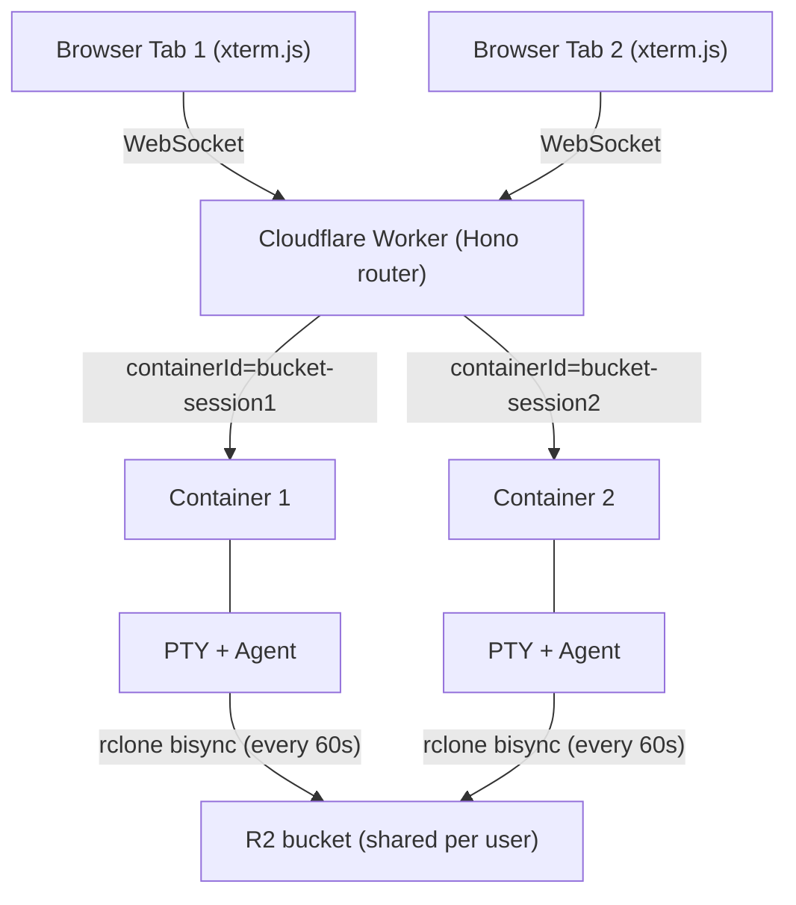

---

## 2. System Components

### 2.1 Worker (Hono Router)

**File:** `src/index.ts`

Entry point and API gateway. Handles routing, WebSocket upgrade interception, authentication via Cloudflare Access, container lifecycle through Durable Objects, and CORS with configurable allowed origins.

**WebSocket must be intercepted BEFORE Hono routing** (required workaround for CF Workers):
```typescript
// See: https://github.com/cloudflare/workerd/issues/2319
const wsRouteResult = validateWebSocketRoute(request, env);
if (wsRouteResult.isWebSocketRoute) {
  return handleWebSocketUpgrade(request, env, ctx, wsRouteResult);
}
```

**CORS:** Checks static patterns from `env.ALLOWED_ORIGINS` + dynamic origins from KV (cached in memory). Uses `matchesPattern()` with domain-boundary enforcement (dot-prefixed = suffix match, bare domains = exact or subdomain with dot boundary).

**Route Registration:** `/api/user`, `/api/users`, `/api/container`, `/api/sessions`, `/api/terminal`, `/api/setup`, `/api/storage`, `/api/presets`, `/api/preferences`, `/public`

**Workers Assets Routing Guardrails (`wrangler.toml`):**

With SPA fallback (`not_found_handling = "single-page-application"`), control-plane paths must execute Worker logic first via `run_worker_first = ["/", "/api/*", "/public/*", "/health"]`. Missing `/api/*` causes setup/auth flows to break (API endpoints return HTML instead of JSON).

### 2.2 Container DO (CodeflareContainer)

**File:** `src/container/index.ts` - Extends `Container` from `@cloudflare/containers`. `defaultPort = 8080`, `sleepAfter = '30m'` (SDK-managed lifecycle, confirmed stable with keepalive heartbeat).

**SDK-Managed Hibernation:** `sleepAfter` lets the SDK handle container process lifecycle via its own alarm loop. `onStart()` updates KV with `lastStartedAt` timestamp, clears stale `collectMetrics` schedules, and arms a fresh 5-second `collectMetrics` schedule. `onStop()` sets KV status to `'stopped'` and updates `lastActiveAt` timestamp, ensuring other devices see correct status for hibernated containers.

**`collectMetrics()` Heartbeat (every 5s):**
1. Checks `this.ctx.container?.running` — returns early (no re-arm) if container is dead
2. Fetches `/activity` via `getTcpPort()` — if active WS clients, calls `renewActivityTimeout()` (keepalive). If `/activity` fails, renews as safety net (don't kill container on transient errors). Activity/keepalive logs are at `debug` level to reduce noise (was `info` — downgraded once keepalive was confirmed stable).
3. Fetches `/health` via `getTcpPort()` — reads cpu/mem/hdd/syncStatus
4. Writes metrics to KV session record (`session.metrics`)
5. Re-arms schedule if container still running
6. **Zombie DO detection**: When identifiers are missing (post-`destroy()`), returns early WITHOUT re-arming — kills both metrics push and schedule re-arm via if/else pattern

**Zombie DO Detection:** When `collectMetrics` reaches the health-fetch stage but `sessionId` or `bucketName` are missing from DO storage (happens after `destroy()` clears them), it logs `"missing identifiers, not re-arming (zombie DO)"` and returns without scheduling the next cycle. This is the kill switch for orphaned DOs.

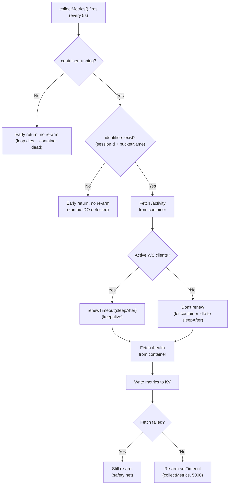

**`onActivityExpired()` Override:** Checks `/activity` for active WS clients. If clients connected -> `renewActivityTimeout()`. If no clients -> `this.stop('SIGTERM')`. Safety net: renews timeout on any error (network failures, non-OK responses) rather than killing the container.

**`destroy()` Override:** Clears `SESSION_ID_KEY`, `bucketName`, `workspaceSyncEnabled`, `tabConfig` from DO storage and nulls `_bucketName` in memory BEFORE calling `super.destroy()`. This prevents `onStop()` (triggered asynchronously by `super.destroy()` killing the container) from resurrecting deleted sessions in KV.

**Environment Variables Injection:** R2 credentials flow via two paths: (1) `_internal/setBucketName` request body (primary, from Worker), (2) `this.env` fallback (DO restart). Fallback chain: Worker-provided > `this.env` > empty string.

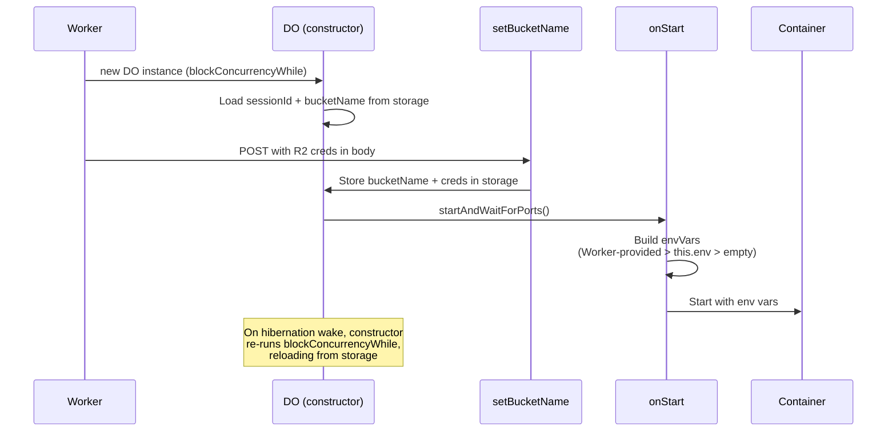

**Critical: `envVars` must be set as a property assignment**, not as a getter. Cloudflare Containers reads `this.envVars` as a plain property at `start()` time.

**`setBucketName` Idempotency (409 Path):** Once `_bucketName` is set, subsequent `setBucketName` calls return 409. BUT the 409 handler still stores `sessionId`, `workspaceSyncEnabled`, and `tabConfig` in DO storage -- this ensures `collectMetrics`/`onStop` can find the KV entry even on session restarts (where the DO already has a bucket set but needs the sessionId for the new lifecycle), and that user preference changes take effect without container recreation.

**Lifecycle Route Re-calls `setBucketName` After `destroy()`:** In the `needsBucketUpdate` path (restart with different bucket), `destroy()` wipes DO storage. The lifecycle route must call `setBucketName` again after `destroy()` to re-populate sessionId, bucketName, and R2 credentials. See `src/routes/container/lifecycle.ts`.

**Internal Endpoints:** `/_internal/setBucketName`, `/_internal/setSessionId`, `/_internal/getBucketName`, `/_internal/debugEnvVars`

### 2.3 Terminal Server (node-pty)

**File:** `host/server.js` - Node.js server inside the container. Single port 8080 for WebSocket + REST + health/metrics.

Sync handled entirely by `entrypoint.sh` (60s daemon). Terminal server reads sync status from `/tmp/sync-status.json` and exposes via `/health`. Activity tracking (`lastUserInputMs`, `lastAgentFileActivityMs`) for hibernation decisions via `GET /activity`.

**Auth-Exempt Paths:** The terminal server validates `Authorization: Bearer <token>` on all HTTP requests. Paths called via `getTcpPort().fetch()` (which bypasses the DO's `fetch()` override that injects the auth header) must be in the `authExemptPaths` Set at `host/server.js`: `['/health', '/activity']`. The `/activity` endpoint is also exempted from auth in the DO-level `fetch()` override so internal health checks don't require token injection.

**`GET /activity` Endpoint:** Returns `{ hasActiveConnections: boolean, connectedClients: number, activeSessions: number, disconnectedForMs: number | null }`. Used by both `collectMetrics()` (keepalive heartbeat) and `onActivityExpired()` (idle detection). Active connections = WebSocket clients that are currently connected. `disconnectedForMs` tracks time since all clients disconnected (null if clients are currently connected).

**WebSocket Protocol:** Raw terminal data (NOT JSON-wrapped). Control messages (resize, process-name) as JSON. No application-level ping/pong -- Cloudflare handles protocol-level WebSocket keepalive for DO/Container connections. Headless terminal (xterm SerializeAddon) captures full state for reconnection.

**PTY:** Spawns `bash -l` (login shell for .bashrc) with `xterm-256color`, truecolor support.

### 2.4 Frontend (SolidJS + xterm.js)

**Directory:** `web-ui/`

Key files: `App.tsx` (root), `Terminal.tsx` (xterm.js), `TerminalTabs.tsx`, `Layout.tsx` (orchestrates dashboard/terminal views, manages WS disconnect/reconnect lifecycle), `SessionStatCard.tsx` (dashboard card with three-color status dot and metrics), `StorageBrowser.tsx` (R2 browser with toolbar), `StoragePanel.tsx` (slide-in drawer), `SettingsPanel.tsx`, `Dashboard.tsx`, `OnboardingLanding.tsx`, `KittScanner.tsx`.

Stores: `terminal.ts` (WebSocket state, compound key `sessionId:terminalId`, scheduled disconnect/reconnect), `session.ts` (CRUD, `terminalsPerSession`, `stopSession()` sets `'stopping'` and polls, `refreshSessionStatuses()` for lightweight dashboard polling), `storage.ts` (R2 operations), `setup.ts`.

#### Dashboard WS Disconnect Flow

When user navigates to dashboard, `Layout.tsx` calls `scheduleDisconnect(DASHBOARD_WS_DISCONNECT_DELAY_MS)` (60s grace period). After the grace period, `disconnectAll()` closes all WS connections with reason `'dashboard-disconnect'`. Container can then idle to `sleepAfter` (30m). When user returns to terminal view, `cancelScheduledDisconnect()` cancels any pending timer, then `reconnectDisconnectedTerminals(activeSessionId)` reconnects only the active session's terminals. The `untrack()` fix in `Layout.tsx`'s `createEffect` wraps `activeSessionId` to prevent the reactive dependency from triggering reconnects on unrelated session changes.

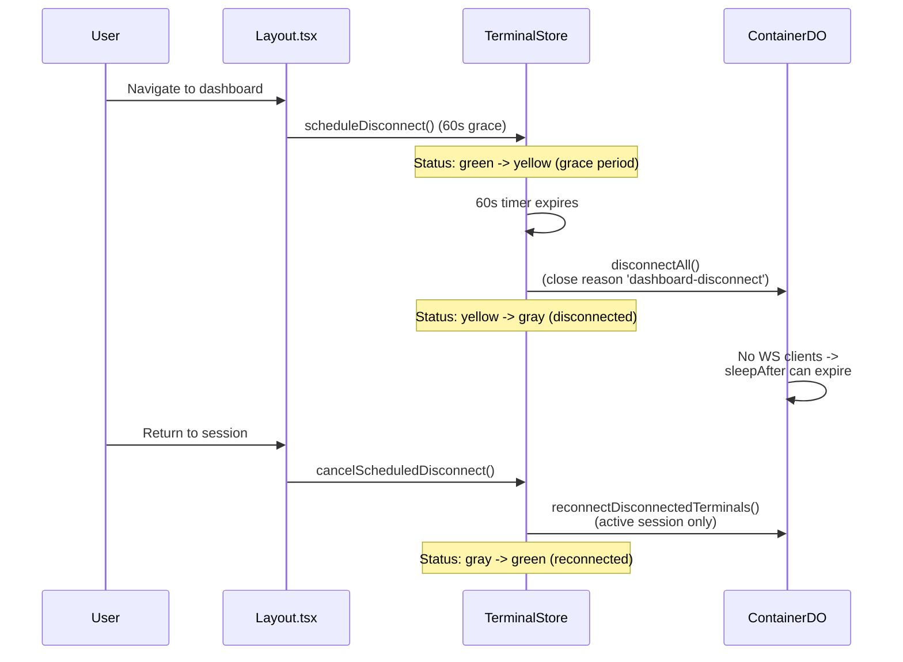

#### Three-Color Session Status

`SessionStatCard` displays green (running + WS connected), yellow (running + WS disconnected -- container alive but dashboard-disconnected), gray (stopped). Driven by `dotVariant()` which checks both `session.status` and `terminalStore.getConnectionState()`. The yellow indicator was added to make the dashboard-disconnect flow visible to the user -- without it, status jumped from green directly to gray.

#### Polling and Consistency

**Polling Interval:** `SESSION_LIST_POLL_INTERVAL_MS = 5000` -- matches the DO's `collectMetrics` 5s push cycle. Polling faster wastes requests since KV data doesn't change between pushes. `CONTEXT_EXPIRY_MS = 30 * 60 * 1000` (30m) matches backend `sleepAfter` for accurate context-expired detection.

**KV Eventual Consistency:** ~60s propagation delay for new sessions. Metrics may not appear at edge immediately after first `collectMetrics` write. The frontend handles this gracefully -- `SessionStatCard` shows last-known metrics for recently-stopped sessions.

**Auto-Reconnect:** 10 attempts (`MAX_WS_RETRIES`) with 2-second delay. Reconnection triggers session buffer replay via SerializeAddon state restore. AbortController-based cancellation prevents parallel retry loops.

**No Application-Level WS Pings:** Removed. Cloudflare's runtime handles protocol-level WebSocket keepalive for DO/Container connections automatically.

**Character Doubling Fix:** The `inputDisposable` must be stored outside `connect()` and disposed before creating a new handler on reconnect:
```typescript
let inputDisposable: IDisposable | null = null;
function connect() {
  inputDisposable?.dispose();
  inputDisposable = terminal.onData((data) => ws.send(data));
}
```

#### UI Features

**Nested Terminals (Multiple PTYs per Session):** Up to 6 terminal tabs per session. Compound key strategy: frontend `sessionId:terminalId`, WebSocket URL `/api/terminal/{sessionId}-{terminalId}/ws`. Backend parses compound ID, validates base session, forwards full ID to container. Container's SessionManager handles each compound ID as a separate PTY.

**StoragePanel (R2 File Browser):** Files: `StoragePanel.tsx`, `StorageBrowser.tsx`, `stores/storage.ts`. Desktop: 400px slide-in drawer. Mobile: bottom-sheet. Mutual exclusion with SettingsPanel. Reads directly from R2 via Worker API (no container-side sync trigger). Container sync handled by 60s bisync daemon.

**Conditional Logout:** Depends on `onboardingActive` flag: active -> redirect to `/` (landing page), inactive -> redirect to `/cdn-cgi/access/logout`.

**Frontend Zod Validation:** `web-ui/src/lib/schemas.ts` -- Zod schemas validate API responses at runtime. Types derived from schemas via `z.infer`.

**Terminal Tab Configuration:** `web-ui/src/lib/terminal-config.ts` -- Generic "Terminal 1-6" defaults with live process detection via `PROCESS_ICON_MAP` (maps process names like claude, cu, claude-code, codex, gemini, opencode, htop, yazi, lazygit, bash, sh, zsh to MDI icons).

---

## 3. Backend Libraries

| File | Purpose |
|------|---------|
| `src/middleware/auth.ts` | Shared authentication middleware. Delegates to `authenticateRequest()` which throws `AuthError`/`ForbiddenError` on failure. Sets `c.get('user')` and `c.get('bucketName')` for downstream handlers. |
| `src/lib/container-helpers.ts` | Consolidated container initialization: `getSessionIdFromQuery()` (from query param), `getContainerId()` (with validation, never fallbacks), `getContainerContext()` (full context for route handlers). |
| `src/lib/error-types.ts` | `AppError` base class with `code`, `statusCode`, `message`, `userMessage`. Specialized: `NotFoundError` (404), `ValidationError` (400), `ContainerError` (500), `AuthError` (401), `ForbiddenError` (403), `SetupError` (400), `RateLimitError` (429), `CircuitBreakerOpenError` (503). Utilities: `toError(unknown)`, `toErrorMessage(unknown)`. |
| `src/lib/type-guards.ts` | Runtime type validation replacing unsafe type casts (e.g., `isBucketNameResponse()`). |
| `src/lib/constants.ts` | Single source of truth for 20 configuration constants: ports (`TERMINAL_SERVER_PORT = 8080`), session ID validation, CORS defaults, rate limit keys/windows, container fetch timeouts, max presets/tabs, protected paths, request ID config, session limits. |
| `src/lib/circuit-breaker.ts` | Prevents cascading failures. States: CLOSED (normal), OPEN (fail fast), HALF_OPEN (testing recovery). Wraps `container.fetch()` calls. |
| `src/middleware/rate-limit.ts` | Per-user rate limiting (bucketName from auth, IP fallback). Stores counts in KV. Adds `X-RateLimit-*` headers. |
| `src/lib/logger.ts` | JSON logging with `createLogger(module)`, child loggers with request context. |
| `src/lib/jwt.ts` | RS256 verification against CF Access JWKS (`https://{authDomain}/cdn-cgi/access/certs`). Per-isolate JWKS cache with `resetJWKSCache()`. |
| `src/lib/cache-reset.ts` | Centralized invalidation of CORS + auth config + JWKS caches. Called by setup wizard after configuration changes. |
| `src/lib/cf-api.ts` | Cloudflare API client. `parseCfResponse` checks `Content-Type` header before JSON parsing. When content-type is not `application/json`, attempts `JSON.parse` on the text body as a lenient fallback (Cloudflare sometimes omits content-type on valid JSON). Only throws a structured `AppError` with the first 200 chars of the response body if the parse actually fails -- this gives clear diagnostics for HTML error pages or plain text from expired tokens, instead of opaque JSON parse errors. |

**DEV_MODE Gating:** `/api/container/debug/*` restricted to `DEV_MODE = "true"`.

### Setup Wizard Resilience

**Directory:** `src/routes/setup/`

All Cloudflare API calls in the setup wizard are wrapped in `withSetupRetry()` (defined in `shared.ts`) for transient failure resilience. The wrapper retries up to 2 times (3 total attempts) with exponential backoff (1s, 2s), skipping retry for `CircuitBreakerOpenError`.

**Cross-environment safety:** `resolveManagedAccessApp()` in `access.ts` uses a 4-tier fallback to find existing Access apps: (1) exact domain match, (2) stored app ID from KV, (3) name match + domain validation, (4) `/app/*` suffix + domain validation. Tiers 3 and 4 validate domain to prevent cross-environment collision when multiple environments share a CF account.

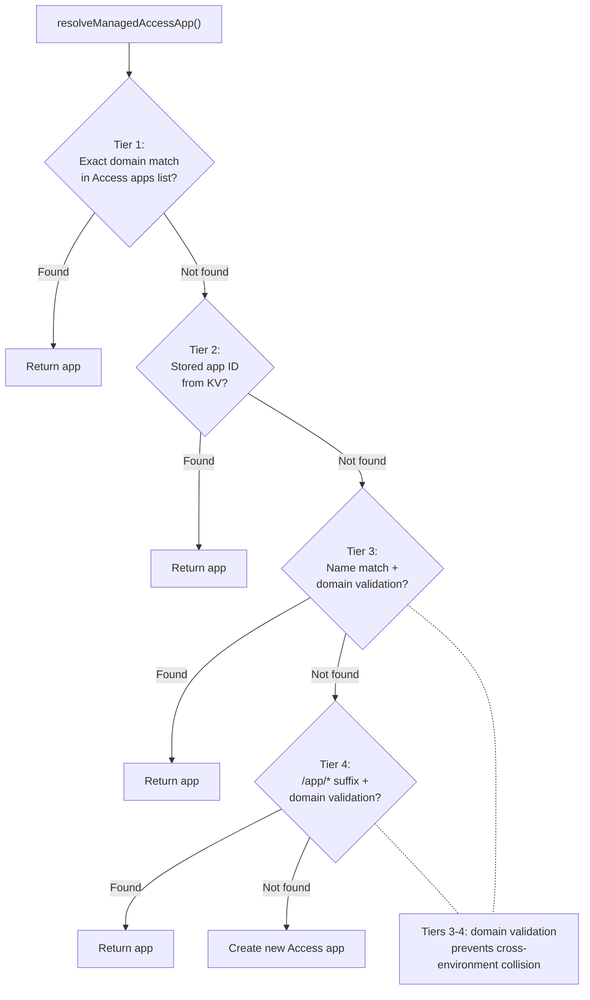

**Error propagation:** `listAccessApps()` and `listAccessGroups()` propagate errors through `withSetupRetry` rather than silently returning `[]`. Errors surface as `SetupError` with step details. The frontend `ApiError` carries a `steps` array from `SetupError` JSON responses.

### Session Route Architecture

**Directory:** `src/routes/session/` - Split into `index.ts` (aggregator), `crud.ts` (CRUD), `lifecycle.ts` (start/stop/status/batch-status).

**Session Stop Flow (user-initiated):** Sets KV status to `'stopped'`, calls `container.destroy()` (sends SIGINT per Dockerfile STOPSIGNAL, then SIGKILL), entrypoint.sh shutdown handler runs final `rclone bisync`. `destroy()` override clears `SESSION_ID_KEY`/`bucketName` from DO storage before `super.destroy()` -- prevents `onStop()` from resurrecting the deleted session. Both `batch-status` and `GET /:id/status` trust the `'stopped'` KV status to avoid waking the DO (exception: stale >5 minutes triggers probe).

**Session Stop Flow (idle):** `onActivityExpired()` detects no active WS clients -> `this.stop('SIGTERM')` -> `onStop()` fires with identifiers intact -> writes `status: 'stopped'` to KV.

### Frontend Constants

**File:** `web-ui/src/lib/constants.ts` -- 20 constants for polling intervals, timeouts, retry limits, WebSocket close codes, max terminals, display lengths, URL detection patterns, view transitions, context expiry, dashboard WS disconnect delay.

---

## 4. Data Flow

### Session Creation to Terminal Connection

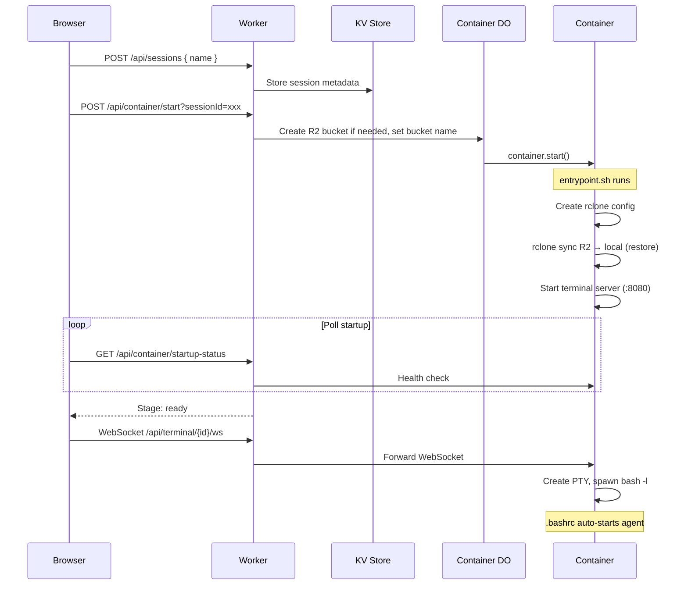

### Startup Status Stages

| Stage | Progress | Condition |
|-------|----------|-----------|
| stopped | 0% | Container not running |
| starting | 10-20% | Container running but health server not responding |
| syncing | 30-45% | Health server up, syncStatus = pending/syncing |
| verifying | 85% | Sync complete, terminal server not yet responding |
| mounting | 90% | Terminal server up, PTY pre-warming in progress |
| ready | 100% | All checks passed |
| error | 0% | Sync failed or other error |

### Session Lifecycle State Machine

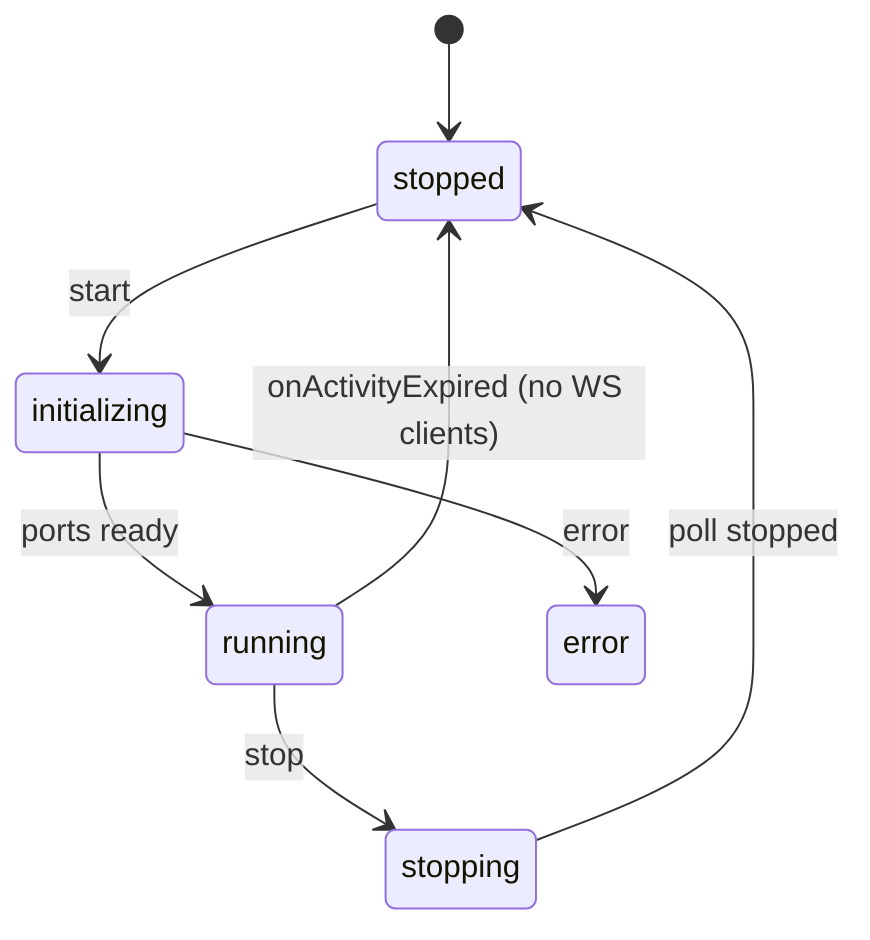

**Stop (idle):** `sleepAfter` expires -> SDK calls `onActivityExpired()` -> checks `/activity` -> no WS clients -> `this.stop('SIGTERM')` -> `onStop()` -> KV status = `'stopped'`

**Stop (user-initiated):** Worker sets KV status to `'stopped'` -> calls `container.destroy()` -> `destroy()` clears `SESSION_ID_KEY` + `bucketName` from DO storage to prevent deleted session resurrection -> `super.destroy()` -> `onStop()` bails (no identifiers, so no KV write)

**Delete:** Worker `KV.delete()` -> `container.destroy()` -> `destroy()` clears `SESSION_ID_KEY` + `bucketName` -> `super.destroy()` -> `onStop()` bails (no identifiers, so deleted session cannot be resurrected in KV)

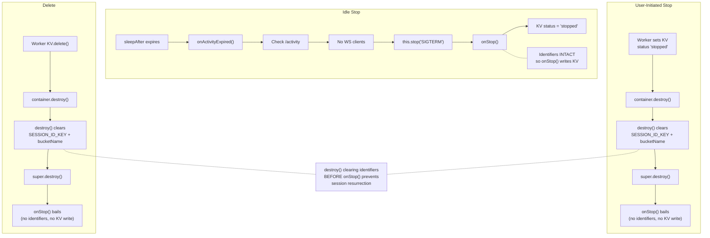

**Restart (same bucket):** `setBucketName` -> 409 (bucket already set, but stores `sessionId`, `workspaceSyncEnabled`, and `tabConfig` in DO storage for KV reconciliation and preference updates) -> `startAndWaitForPorts()` -> `onStart()` re-arms metrics

**Restart (different bucket):** `setBucketName` succeeds -> `destroy()` (wipes DO storage) -> lifecycle route re-calls `setBucketName` (re-populates sessionId + bucketName + R2 creds) -> `startAndWaitForPorts()`

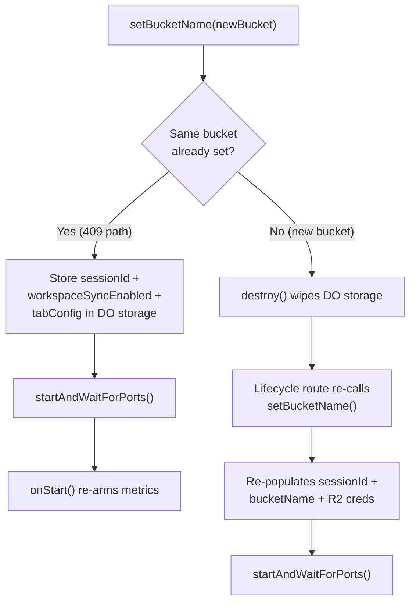

### Metrics Data Flow

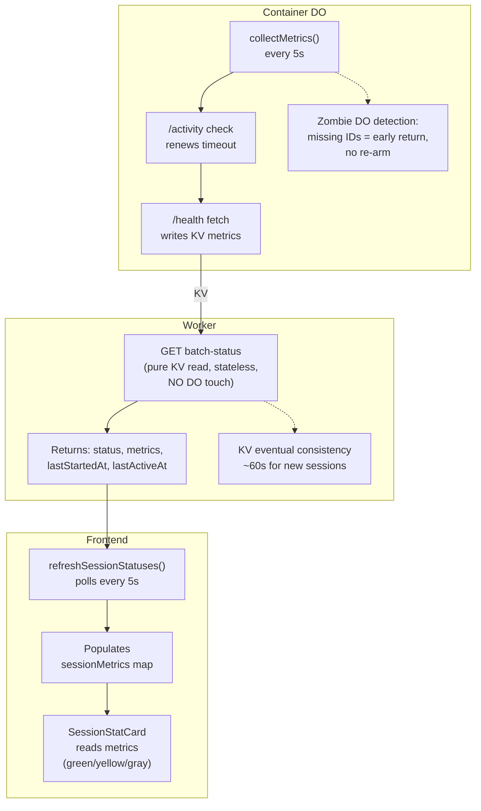

---

## 5. Storage and Sync

### Why rclone bisync (Not s3fs)

s3fs FUSE: every file op = network call (~340ms PUT, ~50ms HEAD), fragile on network hiccups, "Socket not connected" errors.

rclone bisync: all file ops on local disk (<1ms), background daemon every 60s, final bisync on shutdown (SIGINT/SIGTERM), stable.

### Initial Sync on Startup

1. One-way `rclone sync` from R2 to local (restore data)
2. `rclone bisync --resync` to establish baseline, then start 60-second daemon

### What's Synced vs Excluded

| Path | Synced | Reason |
|------|--------|--------|
| `~/.claude/` | Yes | Claude credentials, config, projects |
| `~/.config/` | Yes | App configs (gh CLI, etc.) |
| `~/.gitconfig` | Yes | Git configuration |
| `~/workspace/` | Depends on `SYNC_MODE` | Excluded by default (`none`). Synced when `full` or partially with `metadata`. |
| `~/.npm/`, `~/.bun/`, `.config/rclone/**`, `.cache/rclone/**`, `.claude/debug/**`, `.claude/plugins/cache/**` | **NO** | Cache/debug, regenerated |

### rclone Sync Modes

| Mode | Workspace Sync | Use Case |
|------|---------------|----------|
| `none` | Excluded entirely | Default. Settings and config only. |
| `full` | Entire `workspace/` (minus `node_modules/`) | Persistent storage across stop/resume |
| `metadata` | Only `CLAUDE.md` and `.claude/` per repo | Lightweight project context sync |

All modes always exclude: `.bashrc`, `.bash_profile`, `.config/rclone/`, `.cache/rclone/`, `.npm/`, `.bun/`, `.claude/debug/`, `.claude/plugins/cache/`, `**/node_modules/`. All rclone commands use `--filter` flags (NOT `--include`/`--exclude`).

**Note:** The `metadata` mode is defined in `entrypoint.sh` but the Container DO currently only maps `workspaceSyncEnabled` to `full` or `none`. The `metadata` mode can be used by setting `SYNC_MODE` directly in the container environment.

### Conflict Resolution

Newest file wins (`--conflict-resolve newer`). Auto `--resync` on bisync failure. Shutdown handler runs final bisync.

---

## 6. Authentication

### Cloudflare Access Integration

**Browser/JWT:** `cf-access-authenticated-user-email` + `cf-access-jwt-assertion` headers.

**Service Token:** `CF-Access-Client-Id` + `CF-Access-Client-Secret` headers. Mapped to email via `SERVICE_TOKEN_EMAIL`.

**Email Normalization:** Trimmed + lowercased before KV lookup, role resolution, and bucket name derivation.

### Access Application Destination Strategy

One Access application with five destinations: `/app`, `/app/*`, `/api/*`, `/setup`, `/setup/*`. Including exact + wildcard variants removes ambiguity. Uses all 5 allowed entries.

### Access Group Model

Per-worker groups: `<worker-name>-admins`, `<worker-name>-users`. Setup upserts both, stores IDs in KV. `/api/users` syncs group membership via `syncAccessPolicy()`. `GET /api/setup/prefill` reads existing membership for redeploy prefill.

### Root Redirect

- Setup incomplete -> redirect to `/setup`
- Setup complete, default mode -> `/` redirects to `/app/`
- Setup complete, onboarding mode -> authenticated users to `/app/`, unauthenticated to public landing

### Auth Flow

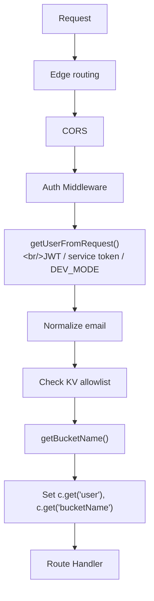

### Per-User Bucket Naming

`user@example.com` -> `codeflare-user-example-com` (sanitized, max 63 chars).

### Bucket Auto-Creation

**File:** `src/lib/r2-admin.ts` - `createBucketIfNotExists()` via Cloudflare API on first container start.

---

## 7. Security Model

### CF Access Gate

Cloudflare Access protects all authenticated surfaces. One Access application with five destinations: `/app`, `/app/*`, `/api/*`, `/setup`, `/setup/*`. Including exact + wildcard variants removes ambiguity. Uses all 5 allowed entries.

### API Token Containment

The `CLOUDFLARE_API_TOKEN` never enters the container. It stays in the Worker/DO environment (GitHub Secrets -> Worker secrets). Containers only receive R2 credentials (scoped key pair), never the master API token.

### Container Auth Token

A random UUID is generated per DO lifecycle and passed to the container as `CONTAINER_AUTH_TOKEN` env var. All proxied HTTP requests from the DO to the container include this token in the `Authorization: Bearer` header. The terminal server (`host/server.js`) validates this token on all non-exempt paths. `getTcpPort().fetch()` bypasses the DO's `fetch()` override (which injects the header), so internal paths (`/health`, `/activity`) must be in `authExemptPaths`.

### Graceful Shutdown

`STOPSIGNAL SIGINT` in the Dockerfile. The `entrypoint.sh` trap handler catches SIGINT/SIGTERM, kills the sync daemon, runs a final `rclone bisync` to R2, and kills the terminal server. This ensures no data loss on container stop.

### Security Headers

Applied to every response in `src/index.ts`:
- `Strict-Transport-Security` (HSTS)
- `Content-Security-Policy`
- `X-Content-Type-Options: nosniff`
- `X-Frame-Options: DENY`
- `Referrer-Policy: strict-origin-when-cross-origin`
- `Permissions-Policy`

### Body Limit

64 KiB on all `/api/*` routes (storage routes exempt for file uploads).

### Rate Limiting

Per-user rate limiting via KV (`src/middleware/rate-limit.ts`). Uses `bucketName` from auth as the rate limit key, with IP fallback for unauthenticated requests. Configurable window and max per route. Adds `X-RateLimit-Limit`, `X-RateLimit-Remaining` response headers.

### WebSocket Rate Limit

30 connections per 60-second window per user (`WS_RATE_LIMIT_WINDOW_MS = 60000`, `WS_RATE_LIMIT_MAX_CONNECTIONS = 30`). Defined in `src/lib/constants.ts`.

### Session Limits

Per-user cap on concurrent running sessions, configurable by role via `MAX_SESSIONS_USER` (default: 3) and `MAX_SESSIONS_ADMIN` (default: 10) in `wrangler.toml`.

**Frontend-first enforcement:** The dashboard disables the start button when `isAtSessionLimit()` returns true (running + initializing sessions >= maxSessions). A popup explains the limit and which sessions to stop.

**Backend loose check:** `POST /api/container/start` counts KV sessions with `status === 'running'` under the user's prefix (excluding the current session to allow restarts). Returns 429 `RateLimitError` if at or over the limit. This is a secondary guard -- the frontend prevents most limit violations before they reach the backend.

**`GET /api/sessions/batch-status`** returns `maxSessions` alongside `statuses` so the frontend stays in sync with the server-side limit without hardcoding defaults.

### Protected R2 Paths

The following paths are excluded from R2 sync and cannot be uploaded/deleted/moved via the storage API: `.claude/`, `.anthropic/`, `.ssh/`, `.config/`, `.claude.json`. Defined in `PROTECTED_PATHS` in `src/lib/constants.ts`.

---

## 8. API Reference

### Common Response Headers

| Header | Description |
|--------|-------------|
| `X-Request-ID` | Unique request identifier (UUID) |
| `X-RateLimit-Limit` | Max requests per window (rate-limited endpoints) |
| `X-RateLimit-Remaining` | Requests remaining (rate-limited endpoints) |

### Error Response Format

```json
{ "error": "User-friendly message", "code": "ERROR_CODE" }
```

Codes: `NOT_FOUND` (404), `VALIDATION_ERROR` (400), `CONTAINER_ERROR` (500), `AUTH_ERROR` (401), `FORBIDDEN` (403), `SETUP_ERROR` (400), `RATE_LIMIT_ERROR` (429), `CIRCUIT_BREAKER_OPEN` (503).

Note: `SETUP_ERROR` uses a different response shape: `{ success: false, steps, error, code }` instead of the standard `{ error, code }`.

### Session Management

| Method | Endpoint | Description |
|--------|----------|-------------|
| GET | `/api/sessions` | List sessions |
| POST | `/api/sessions` | Create session (rate limited) |
| GET | `/api/sessions/:id` | Get session |
| PATCH | `/api/sessions/:id` | Update session |
| DELETE | `/api/sessions/:id` | Delete session and destroy container |
| POST | `/api/sessions/:id/touch` | Update lastAccessedAt |
| POST | `/api/sessions/:id/stop` | Stop session (KV 'stopped' + container.destroy()) |
| GET | `/api/sessions/:id/status` | Get session and container status |
| GET | `/api/sessions/batch-status` | Batch status for all sessions (status, ptyActive, lastActiveAt, lastStartedAt, metrics, maxSessions) |

### Container Lifecycle

| Method | Endpoint | Description |
|--------|----------|-------------|
| POST | `/api/container/start` | Start container (non-blocking) |
| POST | `/api/container/destroy` | Destroy container (SIGKILL) |
| GET | `/api/container/startup-status` | Poll startup progress |
| GET | `/api/container/health` | Health check |
| GET | `/api/container/state` | Container state (DEV_MODE) |
| GET | `/api/container/debug` | Debug info (DEV_MODE) |
| GET | `/api/container/sync-log` | Sync log (DEV_MODE) |
| GET | `/api/container/mount-test` | Mount verification (DEV_MODE) |

### Terminal

| Method | Endpoint | Description |
|--------|----------|-------------|
| WS | `/api/terminal/:sessionId-:terminalId/ws` | Terminal WebSocket |
| GET | `/api/terminal/:sessionId/status` | Connection status |

### User Management

| Method | Endpoint | Description |
|--------|----------|-------------|
| GET | `/api/user` | Authenticated user info (includes `onboardingActive`) |
| GET | `/api/users` | List allowed users (admin only) |
| DELETE | `/api/users/:email` | Remove allowed user (admin only) |

### Setup

| Method | Endpoint | Description |
|--------|----------|-------------|
| GET | `/api/setup/status` | Check setup status |
| GET | `/api/setup/detect-token` | Auto-detect token from env |
| GET | `/api/setup/prefill` | Prefill emails from existing Access groups |
| POST | `/api/setup/configure` | Run configuration (NDJSON stream response) |

**`POST /configure` streams NDJSON:** Returns `Content-Type: application/x-ndjson` with per-step progress lines as each CF API step executes. Each line is a JSON object:
- **Step progress:** `{"step":"create_r2","status":"running"}` then `{"step":"create_r2","status":"success"}` (or `"error"` with optional `error` field)
- **Final summary:** `{"done":true,"success":true,"steps":[...],"workersDevUrl":"...","customDomainUrl":"..."}` or `{"done":true,"success":false,"error":"...","steps":[...]}`
- Always returns HTTP 200 -- errors are conveyed within the stream. Validation errors (missing fields) still return HTTP 400 before streaming begins.
- Frontend reads via `response.body.getReader()` with buffer-based line parsing, updating `configureSteps` progressively so the UI shows real-time step status.

Public before setup; admin-only after. All `adminUsers` must also be in `allowedUsers`.

### Storage (R2 File Browser)

| Method | Endpoint | Description |
|--------|----------|-------------|
| GET | `/api/storage/browse` | List objects in R2 prefix |
| POST | `/api/storage/upload` | Upload file |
| GET | `/api/storage/download` | Download file |
| POST | `/api/storage/delete` | Delete object |
| POST | `/api/storage/move` | Move/rename object |
| GET | `/api/storage/preview` | Preview file content |
| GET | `/api/storage/stats` | File/folder counts |
| POST | `/api/storage/seed/getting-started` | Seed tutorial docs |
| POST | `/api/storage/upload/initiate` | Initiate multipart upload |
| POST | `/api/storage/upload/part` | Upload a single part (base64 body) |
| POST | `/api/storage/upload/complete` | Complete multipart upload |
| POST | `/api/storage/upload/abort` | Abort multipart upload |

### Presets

GET `/api/presets`, POST `/api/presets`, PATCH `/api/presets/:id` (rename), DELETE `/api/presets/:id`

### Preferences

GET `/api/preferences`, PATCH `/api/preferences`

### Public (Onboarding)

GET `/public/onboarding-config`, POST `/public/waitlist` (rate limited)

### Health

GET `/health`, GET `/api/health`

---

## 9. Container Image

**File:** `Dockerfile` - Base: `node:22.13-alpine3.21`, multi-stage build (builder compiles native addons, runtime has no build tools).

### Installed Tools

| Category | Packages |
|----------|----------|
| Sync | rclone |
| Version Control | git, github-cli (gh), lazygit |
| Editors | vim (symlinked to neovim), neovim, nano |
| Network | curl, openssh-client |
| Utilities | jq, ripgrep, fd, tree, htop, tmux, yazi, fzf, zoxide, bat |

### Global NPM Packages

`claude-unleashed` (wraps `@anthropic-ai/claude-code`), `@anthropic-ai/claude-code` (symlinked from claude-unleashed), `@openai/codex`, `@google/gemini-cli`, `opencode-ai`

### V8 Compile Cache Warm-Up

Node.js CLIs (claude, codex, gemini) are warmed at Docker build time by running `--version`, which triggers V8 to compile and cache bytecode via `NODE_COMPILE_CACHE`. This pre-populates the compile cache so that first-launch inside containers skips the JavaScript compilation overhead, resulting in faster startup times. Go binaries (like `opencode`) are already natively compiled and do not need this optimization.

### OpenCode Database Pre-Initialization

OpenCode uses SQLite with Goose migrations that run on first startup ("Performing one time database migration"). The DB is stored at `~/.local/share/opencode/opencode.db` (XDG data directory). To avoid this overhead at container start, the Dockerfile runs `opencode run "hello"` at build time which triggers the migration, creating the sessions/files/messages schema so the first interactive launch is fast.

### Browser Shims

CLI tools (Claude Code, OpenCode, Gemini) try to open a browser for OAuth. The Dockerfile installs shims (`open-url` for `BROWSER` env var, `xdg-open-shim` for `xdg-open`) that exit 1, forcing CLIs to print auth URLs as plain text in the PTY. The xterm.js link provider then detects and makes these URLs clickable.

Port: 8080 (single port architecture).

---

## 10. Container Startup

**File:** `entrypoint.sh`

Uses polling with safety timeouts: poll until success OR background process exits OR safety timeout expires. Exit immediately on success. Safety timeout `SYNC_TIMEOUT=120` (2 min) prevents infinite blocking.

### Parallel Startup

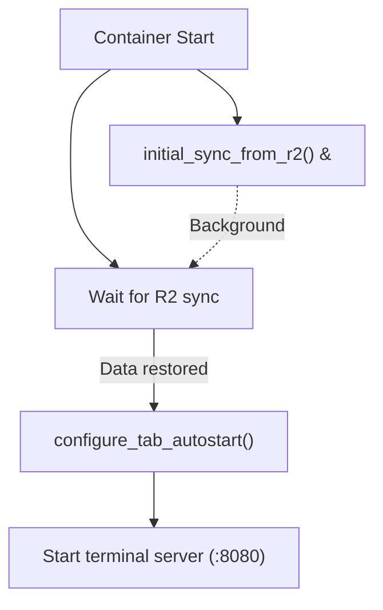

Auto-start uses `cu --silent --no-consent` for fast boot. Updates are enabled - pre-patched at build time, so the update check is fast (~2s). Users can also update manually via `cu` in any tab.

---

## 11. Claude-Unleashed Integration

[claude-unleashed](https://github.com/nikolanovoselec/claude-unleashed) enables `--dangerously-skip-permissions` when running as root inside containers (standard CLI prevents this via `process.getuid() === 0` check).

**Two separate updaters:** (1) claude-unleashed's updater checks npm for latest `@anthropic-ai/claude-code` - runs on every `cu` invocation (including auto-start), pre-patched at build time so the check is fast. (2) Upstream CLI's internal auto-updater - disabled via `DISABLE_INSTALLATION_CHECKS=1`.

`claude` = vanilla CLI, `cu` = claude-unleashed.

### Environment Variables

**Global (Dockerfile ENV):** `CLAUDE_UNLEASHED_SKIP_CONSENT=1`, `IS_SANDBOX=1`, `DISABLE_INSTALLATION_CHECKS=1`

**Auto-start flags (.bashrc):** `--silent`, `--no-consent`

---

## 12. File Structure

```
codeflare/
├── src/
│   ├── index.ts              # Hono router, WebSocket intercept, CORS
│   ├── types.ts              # TypeScript types
│   ├── routes/
│   │   ├── container/        # Container lifecycle API
│   │   │   ├── index.ts      # Route aggregator
│   │   │   ├── lifecycle.ts  # Start/destroy
│   │   │   ├── status.ts     # Health, startup-status
│   │   │   ├── debug.ts      # Debug endpoints (DEV_MODE)
│   │   │   └── shared.ts     # Shared helpers
│   │   ├── session/          # Session API
│   │   │   ├── index.ts      # Route aggregator
│   │   │   ├── crud.ts       # CRUD operations
│   │   │   └── lifecycle.ts  # Start/stop/status/batch-status
│   │   ├── setup/            # Setup wizard
│   │   │   ├── index.ts      # Route aggregator
│   │   │   ├── handlers.ts   # Main configure handler
│   │   │   ├── secrets.ts    # Secret management
│   │   │   ├── custom-domain.ts # Domain configuration
│   │   │   ├── access.ts     # CF Access setup
│   │   │   ├── account.ts    # Account discovery
│   │   │   ├── credentials.ts # R2 credential setup
│   │   │   ├── turnstile.ts  # Turnstile widget setup
│   │   │   └── shared.ts     # Shared helpers
│   │   ├── storage/          # R2 file browser API
│   │   │   ├── index.ts      # Route aggregator
│   │   │   ├── browse.ts     # List objects
│   │   │   ├── delete.ts     # Delete objects
│   │   │   ├── download.ts   # Download files
│   │   │   ├── move.ts       # Move/rename
│   │   │   ├── preview.ts    # Preview content
│   │   │   ├── seed.ts       # Seed tutorial docs
│   │   │   ├── stats.ts      # File/folder counts
│   │   │   ├── upload.ts     # Upload (single + multipart)
│   │   │   └── validation.ts # Path validation
│   │   ├── public/
│   │   │   └── index.ts      # Onboarding endpoints
│   │   ├── presets.ts        # Preset CRUD
│   │   ├── preferences.ts    # User preferences
│   │   ├── terminal.ts       # Terminal WebSocket proxy
│   │   ├── user-profile.ts   # User info
│   │   └── users.ts          # User management
│   ├── middleware/            # auth.ts, rate-limit.ts
│   ├── lib/                  # access, access-policy, agent-config, cache-reset, cf-api,
│   │                         # circuit-breaker, circuit-breakers, constants, container-helpers,
│   │                         # cors-cache, error-types, jwt, kv-keys, logger, onboarding,
│   │                         # r2-admin, r2-client, r2-config, r2-seed, schemas,
│   │                         # session-helpers, tutorial-seed.generated, type-guards,
│   │                         # xml-utils
│   ├── container/index.ts    # Container DO class
│   └── __tests__/            # Backend unit tests (63 files)
├── e2e/                      # E2E tests (API + Puppeteer UI)
├── host/
│   ├── server.js             # Terminal server (node-pty + WebSocket)
│   ├── activity-tracker.js   # WebSocket disconnect tracking for idle detection
│   ├── prewarm-config.js     # Agent-aware PTY pre-warm configuration
│   └── package.json
├── web-ui/
│   └── src/
│       ├── components/       # SolidJS components (Terminal, Layout, SessionCard, StorageBrowser, etc.)
│       ├── stores/           # terminal.ts, session.ts, storage.ts, setup.ts, tiling.ts, session-presets.ts, session-tabs.ts
│       ├── api/              # client.ts, fetch-helper.ts, storage.ts
│       ├── hooks/            # useTerminal.ts, useStageTimings.ts
│       ├── lib/              # constants, schemas, terminal-config, terminal-link-provider, settings, format, mobile, + others
│       ├── styles/           # CSS (design tokens, animations, component styles)
│       └── __tests__/        # Frontend unit tests (63 files)
├── scripts/                  # generate-tutorial-seed.mjs, fix-broken-sourcemaps.js
├── tutorials/                # Tutorial content (Getting Started, Examples, etc.)
├── Dockerfile                # Multi-stage container image
├── entrypoint.sh             # Container startup script
├── wrangler.toml             # Cloudflare configuration
├── vitest.config.ts          # Backend test config
└── vitest.e2e.config.ts      # E2E test config
```

### Critical Paths Inside Container

| Path | Purpose |
|------|---------|
| `/home/user` | User home directory |
| `/home/user/workspace` | Working directory (synced to R2) |
| `/home/user/.claude/` | Claude config and credentials |
| `/home/user/.config/rclone/rclone.conf` | rclone configuration |
| `/tmp/sync-status.json` | Sync status (read by health server) |
| `/tmp/sync.log` | Sync log for debugging |

---

## 13. Environment Variables

### Worker Environment

| Variable | Purpose | Source |
|----------|---------|--------|
| `DEV_MODE` | Bypasses CF Access auth | wrangler.toml |
| `SERVICE_TOKEN_EMAIL` | Email for service token auth | Optional |
| `CLOUDFLARE_API_TOKEN` | R2 bucket creation | Wrangler secret |
| `R2_ACCESS_KEY_ID` | R2 auth for containers | Wrangler secret |
| `R2_SECRET_ACCESS_KEY` | R2 auth for containers | Wrangler secret |
| `R2_ACCOUNT_ID` | R2 endpoint construction | Dynamic (env with KV fallback) |
| `R2_ENDPOINT` | S3-compatible endpoint | Dynamic (env with KV fallback) |
| `ALLOWED_ORIGINS` | CORS patterns (comma-separated) | wrangler.toml |
| `LOG_LEVEL` | Min log level (default: "info") | wrangler.toml |
| `ONBOARDING_LANDING_PAGE` | `"active"` enables public waitlist landing | wrangler.toml |
| `TURNSTILE_SECRET_KEY` | Optional direct Turnstile secret override | Optional |
| `RESEND_API_KEY` | Waitlist notification emails | Optional |
| `WAITLIST_FROM_EMAIL` | Sender identity for waitlist | Optional |
| `CLOUDFLARE_WORKER_NAME` | Worker name override for forks | GitHub Actions variable |
| `MAX_SESSIONS_USER` | Per-user session cap (default: 3) | wrangler.toml |
| `MAX_SESSIONS_ADMIN` | Per-admin session cap (default: 10) | wrangler.toml |

### Container Environment

| Variable | Purpose | Source |
|----------|---------|--------|
| `R2_BUCKET_NAME` | User's personal bucket | Worker -> DO via `setBucketName` |
| `R2_ACCESS_KEY_ID` / `R2_SECRET_ACCESS_KEY` | rclone auth | Worker -> DO (preferred) or DO `this.env` fallback |
| `R2_ACCOUNT_ID` / `R2_ENDPOINT` | rclone endpoint | Worker -> DO or `getR2Config()` fallback |
| `AWS_ACCESS_KEY_ID` / `AWS_SECRET_ACCESS_KEY` | S3 compatibility | Mirrors R2 keys |
| `TERMINAL_PORT` | Always 8080 | Hardcoded |
| `SYNC_MODE` | Sync strategy (`none` or `full`) -- see Section 5 | Worker -> DO |
| `WORKSPACE_SYNC_ENABLED` | Whether workspace sync is enabled (`'true'`/`'false'`). Drives `SYNC_MODE` value. | Worker via `setBucketName` |
| `TAB_CONFIG` | JSON array of terminal tab configurations | Worker -> DO |
| `TERMINAL_ID` | Unique ID for this terminal instance | Worker -> DO |
| `CONTAINER_AUTH_TOKEN` | Auth token for container API calls | Worker -> DO |
| `MANUAL_TAB` | Set to `1` for user-created tabs to skip autostart | Worker -> DO |

---

## 14. Configuration

### Secrets

Repository: `CLOUDFLARE_API_TOKEN`, `CLOUDFLARE_ACCOUNT_ID`, optional `RESEND_API_KEY`

Worker secrets lifecycle: deploy sets `CLOUDFLARE_API_TOKEN`, setup writes `R2_ACCESS_KEY_ID`/`R2_SECRET_ACCESS_KEY`, Turnstile keys stored in KV. **R2 credentials are derived from the API token** -- if the token is rotated, setup must be re-run to regenerate R2 credentials.

### CORS

Dynamic: setup wizard adds custom domain + `.workers.dev` to KV. `ALLOWED_ORIGINS` env var is static fallback.

`R2_ACCOUNT_ID` and `R2_ENDPOINT` resolved dynamically (env vars with KV fallback).

### Container Specs

| Tier | Config | Max Instances | Notes |
|------|--------|---------------|-------|
| `low` | `basic` (0.25 vCPU, 1 GiB, 4 GB) | 3 | Sub-1-vCPU workloads |
| default | 1 vCPU, 3 GiB, 4 GB | 4 | Baseline for node-pty + agent CLIs |
| `high` | 2 vCPU, 6 GiB, 8 GB | 5 | Higher parallelism |

Base image: Node.js 22 Alpine.

### API Token Permissions

#### Account Permissions

| Permission | Access | Required | Why |
|-----------|--------|----------|-----|
| Account Settings | Read | Yes | Account ID discovery |
| Workers Scripts | Edit | Yes | Deploy worker + secrets |
| Workers KV Storage | Edit | Yes | KV namespace management |
| Workers R2 Storage | Edit | Yes | Per-user R2 buckets |
| Containers | Edit | Yes | Container lifecycle |
| Access: Apps and Policies | Edit | Yes | Managed Access app |
| Access: Organizations, Identity Providers, and Groups | Edit | Yes | Access groups + auth_domain |
| Turnstile | Edit | Only if onboarding active | Turnstile widget |

#### Zone Permissions

| Permission | Access | Required | Why |
|-----------|--------|----------|-----|
| Zone | Read | Yes | Zone ID resolution |
| DNS | Edit | Yes | Proxied CNAME |
| Workers Routes | Edit | Yes | Worker route upsert |

---

## 15. CI/CD (GitHub Actions)

| Workflow | Trigger | What it does |
|----------|---------|-------------|
| `deploy.yml` | Push to main + manual | Full deploy: tests + typecheck + Docker build + wrangler deploy + secrets |
| `test.yml` | Pull requests + manual | Frontend/backend tests, typecheck, build verification, and security audit |
| `e2e.yml` | Manual | E2E tests against deployed worker |

### GitHub Secrets and Variables

**Secrets:** `CLOUDFLARE_API_TOKEN`, `CLOUDFLARE_ACCOUNT_ID`, `RESEND_API_KEY` (onboarding only)

**Variables:** `CLOUDFLARE_WORKER_NAME`, `RUNNER`, `ACCOUNT_SUBDOMAIN` (E2E), `ONBOARDING_LANDING_PAGE`, `RESSOURCE_TIER` (`low`/`high`/unset), `CLAUDE_UNLEASHED_CACHE_BUSTER`

### Deploy Workflow

1. Resolve/create KV namespace, patch `wrangler.toml`
2. Apply container tier from `RESSOURCE_TIER` (low=basic 0.25vCPU, default=1vCPU/3GiB, high=2vCPU/6GiB)
3. Optionally generate `.cache-bust`
4. Deploy with `--var ONBOARDING_LANDING_PAGE:<value>`
5. Set `CLOUDFLARE_API_TOKEN` + optional `RESEND_API_KEY` as worker secrets

---

## 16. Testing

**Backend:** `vitest.config.ts` with `@cloudflare/vitest-pool-workers` (real Workers runtime). 63 test files. Run: `npm test`

**Frontend:** `web-ui/vitest.config.ts` with jsdom + SolidJS Testing Library. 63 test files. Run: `cd web-ui && npm test`

**E2E API:** `e2e/` - tests against deployed worker. Run: `ACCOUNT_SUBDOMAIN=your-subdomain npm run test:e2e`

**E2E UI:** `e2e/ui/` - Puppeteer tests (11 test files). Run: `ACCOUNT_SUBDOMAIN=your-subdomain npm run test:e2e:ui`

**E2E Requirements:** `DEV_MODE = "true"` deployed, no CF Access on workers.dev domain. Re-deploy with `DEV_MODE = "false"` after testing. Cleanup via `afterAll` hooks; if tests fail, manually restore: `npx wrangler kv key put "setup:complete" "true" --namespace-id <id> --remote`

---

## 17. Development

```bash
npm install && cd web-ui && npm install && cd ..
npm run dev          # Run locally (requires Docker)
npm run typecheck    # Type check backend
npm test             # Backend unit tests
npm run test:e2e     # E2E API tests
npm run test:e2e:ui  # E2E UI tests (Puppeteer)
npm run deploy       # DO NOT run locally -- deploys go through GitHub Actions (see Section 15)
cd web-ui && npm run dev   # Frontend dev server
cd web-ui && npm run build # Frontend production build
```

---

## 18. Cost

### Per-Container Pricing

| Tier | Specs | Monthly Cost (active) |
|------|-------|-----------------------|
| `low` | 0.25 vCPU, 1 GiB, 4 GB | Lower; check CF pricing |
| `default` | 1 vCPU, 3 GiB, 4 GB | ~$56 (reference) |
| `high` | 2 vCPU, 6 GiB, 8 GB | Higher; check CF pricing |

Cost scales per ACTIVE SESSION (each tab = container). Idle containers hibernate after `sleepAfter` (30m) of no SDK-proxied requests. Hibernated containers = zero cost.

**R2:** First 10GB free, $0.015/GB/month after. User config typically <100MB.

---

## 19. Troubleshooting

### `/api/*` Returns HTML (SPA Swallow)

API endpoints return HTML instead of JSON. Fix: ensure `run_worker_first = ["/", "/api/*", "/public/*", "/health"]` in `[assets]`.

### `/setup` Shows "Access Denied"

Check `GET /api/setup/status` returns JSON. Verify `setup:complete` in KV is absent/false for first-time setup.

### Auth Error After Successful Access Login

Stale `setup:auth_domain` (JWT mismatch), stale `setup:access_aud`, or email casing mismatch. Re-run setup configure. Confirm user keys are lowercase.

### "Unable to find your Access application!"

Browser retained stale Access session. Test in incognito. Clear CF Access cookies. Confirm one managed app with correct destinations.

### Bisync Empty Listing Error

On-demand sync uses `--resync` by default, handles this case.

### envVars Getter Not Working

Container starts without R2 credentials. Fix: set `envVars` as property assignment in constructor, not as a getter.

### R2 Sync Skipped - DO Missing Secrets

Worker now passes R2 credentials via `_internal/setBucketName` body. Check `startup-status` response `details.syncError` for the missing variable.

### Container Stuck at "Waiting for Services"

Terminal server not starting (sync blocking). Check: `GET /api/container/sync-log?sessionId=xxx`. Common: missing R2 credentials, bucket doesn't exist, network timeout.

### R2 Sync Transfers 0 Files

Mixing `--include`/`--exclude` makes filter order indeterminate. Fix: use `--filter` flags (`- pattern` for exclude, `+ pattern` for include).

### Slow Sync With Full Workspace

Switch to `SYNC_MODE=metadata` or manually clean large repos from R2.

### Zombie Container

DO alarm loops from `collectMetrics` can persist after `destroy()` since `destroy()` doesn't cancel alarms. However, zombie DOs self-terminate via two mechanisms: (1) `collectMetrics` checks `this.ctx.container?.running` and returns early if false (no re-arm), (2) the missing-identifiers guard returns early without re-arming when `destroy()` has cleared `SESSION_ID_KEY`/`bucketName` -- this uses an if/else pattern that kills both the metrics push AND the schedule re-arm simultaneously. The SDK alarm handler eventually sees no schedules + no running container and calls `storage.deleteAlarm()`. Zombie DOs are harmless (no container process) but may briefly log debug-level warnings.

### Character Doubling in Terminal

Multiple `terminal.onData()` handlers from reconnection. Store disposable outside `connect()`, dispose before creating new handler.

### Secrets Lost After Worker Deletion

`wrangler delete` nukes all secrets. Re-set with `wrangler secret put`.

### Orphan Container Root Cause

`getContainerId()` must NEVER fallback to just `bucketName`. Always throw on invalid sessionId. Container ID format is ALWAYS `${bucketName}-${sessionId}`.

### R2 Bucket Cleanup on User Deletion

Non-empty buckets fail to delete silently. Manual R2 cleanup may be needed.

### Common Failure Modes

| Symptom | Cause | Fix |
|---------|-------|-----|
| Container won't start | Missing R2 credentials | `wrangler secret list` then `wrangler secret put` |
| `403 Forbidden` on R2 | Expired credentials | Regenerate in CF dashboard |
| Container stuck "starting" | Port 8080 not responding | Check sync log |
| WebSocket fails | Container not running | Verify startup-status |
| Zombie restarts | Stale DO state | DO self-terminates via missing-identifiers guard |
| Deleted session reappears | `onStop()` resurrects KV entry after `destroy()` | Verify `destroy()` clears `SESSION_ID_KEY` before `super.destroy()` |
| Container dies during active use | `/activity` 401 (auth not exempted) | Verify `/activity` in `authExemptPaths` in `host/server.js` |
| Phantom container on session switch | `reconnectDisconnectedTerminals` reconnects wrong session | Ensure `activeSessionId` filter is passed |
| Character doubling | inputDisposable not disposed | Check Terminal.tsx |

---

## 20. Debugging Guide

### Container Status

```bash
curl -H "CF-Access-Client-Id: <id>" -H "CF-Access-Client-Secret: <secret>" \
  https://codeflare.example.com/api/container/state?sessionId=abc12345
```

### Verify Secrets

```bash
wrangler secret list
# Expected: CLOUDFLARE_API_TOKEN, R2_ACCESS_KEY_ID, R2_SECRET_ACCESS_KEY
```

### Monitor Logs

```bash
wrangler tail --service codeflare
wrangler tail --service codeflare --level error
```

### Debug Environment Variables (DEV_MODE)

```bash
curl .../api/container/debug?sessionId=abc12345  # Returns masked env vars
```

---

## 21. Architecture Decisions

| ID | Decision | Rationale |
|----|----------|-----------|
| AD1 | One container per SESSION | CPU isolation - each tab gets full 1 vCPU instead of sharing |
| AD2 | Container ID format | `{bucketName}-{sessionId}` (e.g., `codeflare-user-example-com-abc12345`) |
| AD3 | Per-user R2 buckets | Bucket name derived from email, auto-created on first login |
| AD4 | Periodic rclone bisync | Background daemon runs bisync every 60 seconds, plus final sync on shutdown (SIGINT/SIGTERM). Local disk for all file operations. |
| AD5 | Login shell | `.bashrc` auto-starts the configured agent in workspace |
| AD6 | KV read-modify-write races | Last-writer-wins is acceptable - session PATCH/stop overlap is rare, rate limit off-by-one is minor, lastAccessedAt is best-effort |
| AD7 | Pre-setup public endpoints | Setup runs once during initial deploy; short exposure window is acceptable risk. Pre-setup auth trusts spoofable email header - bootstrap problem, mitigated by rate limiting and short exposure window. |
| AD8 | Container runs as root with no internal auth | Network isolation via DO proxy is sufficient; root needed for rclone mount; wildcard CORS is internal-only |
| AD9 | RESSOURCE_TIER spelling | French/German "ressource" is intentional - consistent across all config, changing would be a breaking API change |

#### AD10: Open setup endpoint before first configure

The `/api/setup/configure` endpoint is intentionally public before `setup:complete` is written to KV. This allows the deployer to configure their instance without pre-existing auth infrastructure (Cloudflare Access isn't set up yet -- that's what setup configures).

**Trade-off**: A narrow window exists between deploy and first configure where any actor could claim the deployment. This is accepted because:
- The window is typically seconds to minutes (deploy -> owner configures)
- Adding a bootstrap secret would require an extra deploy-time step, increasing setup friction
- The target audience is self-hosted single-user/small-team deployments where the deployer is watching the process

**Mitigation**: `setup:complete` KV flag prevents re-configuration after initial setup. Rate limiting applies to setup routes.

**Future consideration**: A one-time bootstrap secret injected at deploy time would close this window entirely with minimal friction. Tracked as a potential hardening improvement.

#### AD11: Suffix-pattern CORS with credentialed requests

CORS origin matching uses `matchesPattern()` with domain-boundary enforcement (not naive substring). The default `ALLOWED_ORIGINS` includes `.workers.dev` as a suffix pattern, and `Access-Control-Allow-Credentials: true` is set on matching responses.

**Trade-off**: Any `*.workers.dev` subdomain could pass the CORS check for credentialed requests. This is accepted because:
- `matchesPattern()` enforces domain boundaries (e.g., `evil-workers.dev` does NOT match `.workers.dev`, only `x.workers.dev` does)
- Custom domain deployments replace the workers.dev origin with the exact production domain
- `ALLOWED_ORIGINS` is configurable per deployment -- operators can restrict to exact origins
- Cloudflare Access JWT validation is the primary auth gate, not CORS

**Mitigation**: Setup adds the specific worker subdomain to KV-based dynamic origins. Operators deploying to custom domains should set `ALLOWED_ORIGINS` to their exact domain.

**Future consideration**: Restricting credentialed CORS to exact known hosts (rather than suffix patterns) would tighten the trust surface. This is a low-risk hardening improvement.

#### AD12: KV-based setup lock (non-atomic)

The setup completion lock uses a KV read-then-write pattern: read `setup:complete`, check if false, perform setup, write `setup:complete = true`. This is not atomic -- two simultaneous `/api/setup/configure` requests could both read `false` and proceed.

**Trade-off**: This is accepted because:
- Setup is a one-time operation performed by a single admin
- The probability of concurrent configure requests is near zero in practice
- KV is the existing state store -- no additional infrastructure needed
- `withSetupRetry` handles transient failures in individual setup steps, and each step is idempotent (creating Access apps, DNS records, etc. checks for existing resources first)

**Mitigation**: Each setup sub-step (CF API calls) is individually idempotent -- duplicate execution produces the same result. The worst case of a race is redundant CF API calls, not corrupted state.

**Future consideration**: Moving the setup lock to a Durable Object would provide strict serialization. The blast radius of changing setup plumbing is non-trivial, so this is deferred until there's evidence of the race occurring in practice.

---

## 22. Lessons Learned

Architectural principles and design rationale. For code-level implementation traps (specific files, functions, what breaks), see CLAUDE.md "Gotchas and Important Notes".

1. **rclone bisync > s3fs FUSE** - FUSE mounts are fragile and slow. Periodic bisync with local disk is faster and more reliable.
2. **Newest file wins** - Simple conflict resolution for single-user scenarios.
3. **Auto-resync on failure** - Automatic `--resync` recovery handles most bisync failures.
4. **SDK-managed lifecycle with heartbeat** - `sleepAfter` with `collectMetrics` heartbeat keeps containers alive during active WS use. The heartbeat compensates for WS frames bypassing `renewActivityTimeout()`.
5. **`onStop()` must set KV status** - SDK hibernation fires `onStop()` which must write `status: 'stopped'` to KV, otherwise other devices see stale 'running' status.
6. **`destroy()` must clear identifiers before `super.destroy()`** - `onStop()` fires asynchronously after `super.destroy()`. Without clearing identifiers first, `onStop()` resuscitates deleted sessions in KV via read-modify-write.
7. **Secrets persist with worker state** - `wrangler delete` destroys all secrets.
8. **Single port architecture** - All services on port 8080 eliminates port conflict bugs.
9. **CPU metrics show load average, not utilization** - `os.loadavg()[0] / cpus * 100` measures run queue depth. Values >100% are normal.
10. **Downgrade verbose heartbeat logs to debug** - Per-cycle keepalive logs at `info` level generate enormous log volume (every 5s per container). Once keepalive is confirmed stable, downgrade to `debug`.
11. **Stateless dashboard polling preserves hibernation** - Dashboard status endpoints must be pure KV reads with zero DO contact. Touching DOs resets `sleepAfter` on every poll, preventing containers from ever hibernating.
12. **Polling interval should match push cadence** - Frontend poll frequency should equal the backend push cycle. Polling faster wastes requests since data doesn't change between pushes.

---

## 23. Mobile Terminal Bug Fixes

### Bug 1: "Orange Square" Cursor Duplication

**Root cause:** xterm.js renders its own DOM cursor (`<span class="xterm-cursor-block">` with `outline: 1px solid #d97706`) AND the server-side CLI renders its cursor via ANSI escape sequences. Two cursors at different positions because xterm tracks cursor state independently from the server-side CLI.

**The fix (attempt 11):** Set `cursor: 'transparent'` in xterm theme + CSS `display: none !important` on all `.xterm-cursor-*` classes. The CLI's ANSI cursor is the only one needed.

**Key lesson:** 10+ attempts tried to hide what was assumed to be an Android native IME caret. A simple "Inspect Element" revealed it was xterm's own DOM element using the theme's orange color (`#d97706`). The orange color matched what one might expect from a native browser caret, leading to elaborate attempts to fight an OS-level compositor issue that didn't exist.

**Note:** The iframe compositor jail code (attempts 10-10h) remains in the codebase as a precaution for the genuine Android IME native caret problem, which is a separate issue from xterm's DOM cursor. Future work should verify via Chrome remote debugging on Android.

### Bug 2: Samsung Internet Keyboard Gap

**Root cause:** Samsung Internet's bottom navigation bar (~48px) inflates viewport height. VirtualKeyboard API reports keyboard height including this invisible area.

**The fix:** VirtualKeyboard API with `overlaysContent = true` for exact keyboard dimensions (`navigator.virtualKeyboard`, Chrome 94+, Samsung Internet 17+). Fallback: `clientHeight - visualViewport.height` for iOS. `boundingRect.height` returns 0 when `overlaysContent = false` - must enable before reading.

**Samsung-specific compensation** via user-facing settings toggle (`samsungAddressBarTop` in Settings). Samsung exposes NO API to detect address bar position - tested `clientHeight`, `fixedVpHeight`, sentinel elements, `env(keyboard-inset-bottom)`, `vk.boundingRect.top` - all return identical values regardless. When address bar is at top, no subtraction needed. When at bottom, subtract viewport growth. Wide-screen devices (>600px) bypass compensation entirely. All Samsung code gated behind `isSamsungBrowser` UA detection.

### Architecture Notes (Mobile)

**Iframe Compositor Jail:** Creates `<iframe>` with `srcdoc` containing `input[type=password]` for a separate compositor context. Android's IME caret is drawn inside iframe's 1x1px bounds (invisible). Keyboard input forwarded via `keydown` (functional keys -> ANSI) + `input` event (characters). `sentViaKeydown` flag prevents double-send.

**_syncTextArea Freeze:** `Object.defineProperty` getter returning `() => {}`, immune to xterm's internal reassignment.

**createElement Monkey-Patch:** Scoped to `terminal.open()` only. Returns `input[type=password]` instead of textarea. `.focus()` overridden to no-op at creation time.

**isFocused Getter Override:** `Object.defineProperty` returning `iframe.contentDocument?.hasFocus()`. Live reference avoids stale state across app backgrounding/tab switching.

**VK API Toggle:** `overlaysContent` is global per document. Enable BEFORE focus to beat the keyboard/layout race.
