# Codeflare Technical Reference

Browser-based cloud IDE on Cloudflare Workers with per-session containers and R2 persistence.

**Last Updated:** 2026-03-30

---

## Table of Contents

### Reference
- [CF-NNN Code Index](#cf-nnn-code-index)

### Core Architecture
1. [Architecture Overview](#architecture-overview)
2. [System Components](#system-components)
3. [Backend Libraries](#backend-libraries)
4. [Data Flow](#data-flow)

### Backend
5. [Storage and Sync](#storage-and-sync)
6. [Memory Persistence](#memory-persistence)

### Security, Auth & Billing
7. [Authentication](#authentication)
8. [SaaS Mode Authentication](#saas-mode-authentication)
9. [Stripe Payment Integration](#stripe-payment-integration)
10. [Security Model](#security-model)
11. [Rate Limiting](#rate-limiting)

### APIs & Configuration
12. [API Reference](#api-reference)
    - [Setup Wizard](#setup)
13. [Environment Variables](#environment-variables)
14. [Configuration](#configuration)

### Deployment & Infrastructure
15. [Container Image](#container-image)
16. [Container Startup](#container-startup)
17. [Claude Code Integration](#claude-code-integration)
18. [CI/CD (GitHub Actions)](#cicd-github-actions)

### Development & Testing
19. [Testing](#testing)
20. [Development](#development)
21. [File Structure](#file-structure)

### Operations
22. [Troubleshooting](#troubleshooting)
23. [Cost Analysis](#cost-analysis)

### Design Documentation
24. [Architecture Decisions](#architecture-decisions)
25. [Module-Level Caches](#module-level-caches-cf-014)
26. [Technical Debt](#technical-debt)
27. [Lessons Learned](#lessons-learned)
28. [Mobile Terminal Design](#mobile-terminal-design)
29. [Automatic Memory Capture](#automatic-memory-capture)

**Related Documentation:**
- [README.md](README.md) - Product overview and setup
- [CONTRIBUTING.md](CONTRIBUTING.md) - Development workflow and guidelines
- [SECURITY.md](SECURITY.md) - Security policy and headers
- [PENTEST.md](PENTEST.md) - Security scan results
- [STRESS_TEST.md](STRESS_TEST.md) - Load testing guide

## CF-NNN Code Index

| Code | Description | Source Location |
|------|-------------|-----------------|
| CF-001 | Turnstile token enforcement; rate-limit bypass prevention | src/routes/auth.ts, src/routes/stripe-webhook.ts, src/index.ts |
| CF-002 | Promise dedup for concurrent cold-start KV reads | src/lib/access.ts |
| CF-003 | Deny requests when KV unavailable (security-critical) | src/middleware/rate-limit.ts, src/lib/rate-limit-core.ts |
| CF-004 | Reset tiers to free on subscription.deleted | src/routes/stripe-webhook.ts, src/routes/usage.ts |
| CF-005 | Default undefined tiers to pending (block access) | src/lib/access.ts, src/lib/subscription.ts |
| CF-006 | Explicit null check; use getEffectiveTier | src/routes/billing.ts, src/routes/terminal.ts |
| CF-007 | Fetch tiers before priceId lookup; staleness window | src/routes/billing.ts, src/lib/subscription.ts, src/timekeeper/index.ts |
| CF-008 | Atomic read-merge-write for user KV records | src/lib/user-record.ts |
| CF-009 | Default both undefined tiers to pending | src/lib/subscription.ts |
| CF-010 | Rate-limit webhook; parseUserRecord validation | src/routes/stripe-webhook.ts, src/lib/access.ts |
| CF-011 | Prefer metadata.email over customer_email; typed user records | src/routes/stripe-webhook.ts, src/lib/user-record.ts |
| CF-012 | Decode URI-encoded sequences before path-traversal check | src/routes/storage/validation.ts |
| CF-013 | Session store extraction (facade pattern) | web-ui/src/stores/session.ts, session-polling.ts, session-usage.ts |
| CF-014 | Module-level cache inventory | See [Module-Level Caches](#module-level-caches-cf-014) section |
| CF-015 | Catch missed subscription.deleted via billing period expiry | src/lib/subscription.ts |
| CF-016 | ScrambleText consolidation to hook-based pattern | web-ui/src/lib/use-scramble-text.ts, web-ui/src/components/ScrambleText.tsx |
| CF-017 | Warn on plaintext credential storage when ENCRYPTION_KEY absent | src/index.ts, src/lib/kv-crypto.ts, src/lib/access.ts |
| CF-018 | billingPeriodEnd enforcement; unlimited tier exemption | src/lib/subscription.ts |
| CF-020 | Timekeeper delta clamping / alarm retry; admin inquiry email; mobile input dispatch | src/lib/email.ts, web-ui/src/lib/terminal-mobile-input.ts |
| CF-021 | Trial always in usage hours (trialDays fallback removed) | web-ui/src/components/SubscribePage.tsx |
| CF-022 | KV rollback on container start failure; separate try/catch for KV reads | src/lib/cors-cache.ts |
| CF-023 | Check existing subscription before overwriting | src/routes/stripe-webhook.ts |
| CF-024 | Missing webhook handler coverage | src/routes/billing.ts |
| CF-027 | Prices from Stripe via admin-configured stripePriceId | src/lib/subscription.ts |
| CF-029 | Cache invalidation for storage deletes | src/routes/storage/ |
| CF-030 | Idempotency key to prevent duplicate checkout sessions | src/lib/stripe.ts |
| CF-032 | Log warning on unresolved customer (was silently dropped) | src/routes/stripe-webhook.ts |

---

## Architecture Overview

Codeflare runs AI coding agents in isolated containers, one per browser session (tab). All sessions for a user share a single R2 bucket for persistent storage, with periodic bidirectional sync (every 60 seconds).

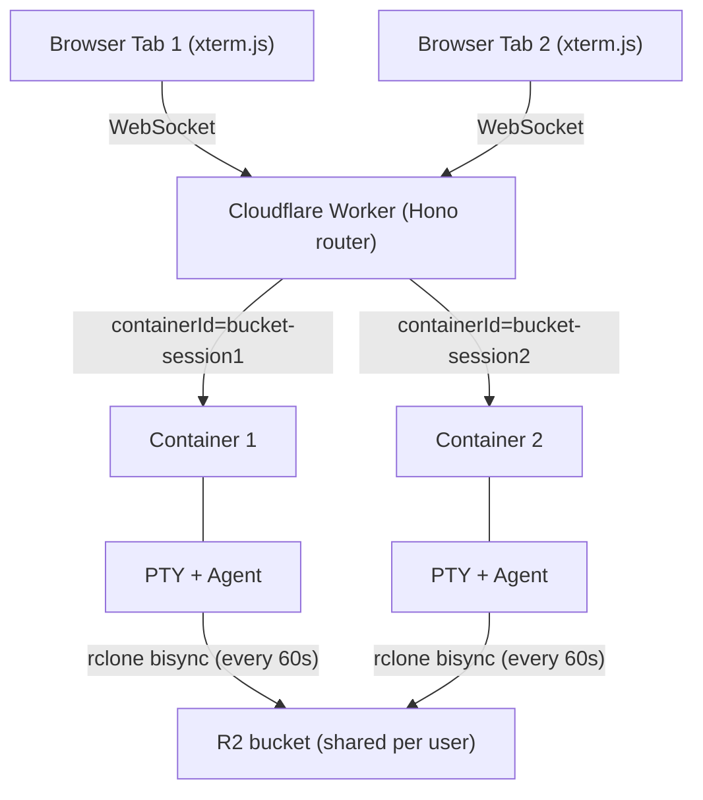

**Workers.dev URL:** `https://<CLOUDFLARE_WORKER_NAME>.<ACCOUNT_SUBDOMAIN>.workers.dev` - used only for initial setup. After the setup wizard configures a custom domain, all traffic should go through the custom domain (protected by CF Access). The workers.dev URL should then be gated behind one-click Access in the Cloudflare dashboard.

---

## System Components

### Worker (Hono Router)

**File:** `src/index.ts`

Entry point and API gateway. Handles routing, WebSocket upgrade interception, authentication via Cloudflare Access, container lifecycle through Durable Objects, and CORS with configurable allowed origins.

**WebSocket must be intercepted BEFORE Hono routing** (required workaround for CF Workers):
```typescript
// See: https://github.com/cloudflare/workerd/issues/2319
const wsRouteResult = validateWebSocketRoute(request);
if (wsRouteResult.isWebSocketRoute) {
  return handleWebSocketUpgrade(request, env, ctx, wsRouteResult);
}
```

**CORS:** Checks static patterns from `env.ALLOWED_ORIGINS` + dynamic origins from KV (cached in memory). Uses `matchesPattern()` with domain-boundary enforcement (dot-prefixed = suffix match, bare domains = exact or subdomain with dot boundary).

**Route Registration:** `/health`, `/api/health`, `/api/auth`, `/auth`, `/public/auth/providers`, `/api/setup`, `/public`, `/api/user`, `/api/container`, `/api/sessions`, `/api/terminal`, `/api/users`, `/api/storage`, `/api/presets`, `/api/preferences`, `/api/llm-keys`, `/api/deploy-keys`, `/api/usage`, `/api/admin/tiers`

**Workers Assets Routing Guardrails (`wrangler.toml`):**

With SPA fallback (`not_found_handling = "single-page-application"`), control-plane paths must execute Worker logic first via `run_worker_first = ["/", "/auth/*", "/api/*", "/public/*", "/health"]`. Missing `/api/*` causes setup/auth flows to break (API endpoints return HTML instead of JSON).

### Container DO (container)

**File:** `src/container/index.ts` - Extends `Container` from `@cloudflare/containers`. Exported from `src/index.ts` as lowercase `container` (matching `wrangler.toml` class_name). `defaultPort = 8080`, `sleepAfter = '5m'` class default (overridden per user from preferences on session start — see [Auto-sleep](#auto-sleep-configurable-sleepafter)). SDK-managed lifecycle, renewed only on new user input via input-change detection. A second DO, `Timekeeper`, is exported from `src/timekeeper/index.ts` as lowercase `timekeeper` for per-user usage tracking (see [Timekeeper DO](#timekeeper-do-usage-tracking)).

**SDK-Managed Hibernation:** `sleepAfter` lets the SDK handle container process lifecycle via its own alarm loop. `onStart()` records `containerStartedAt`, refreshes `envVars` via `updateEnvVars()`, updates KV with `lastStartedAt` timestamp AND `lastActiveAt` (set to start time so the frontend sleep timer icon has a reference timestamp even before any user input), clears stale `collectMetrics` schedules, and arms a fresh 60-second `collectMetrics` schedule. `onStop()` clears the `collectMetrics` schedule via `deleteSchedules('collectMetrics')` to kill the alarm loop immediately (preventing zombie alarms on dead containers), then sets KV status to `'stopped'` and updates `lastActiveAt` timestamp, ensuring other devices see correct status for hibernated containers.

**Fetch proxy bypass:** The `fetch()` override proxies requests via `getTcpPort().fetch()` instead of `super.fetch()` (which calls the SDK's `containerFetch()`). This is critical because `containerFetch()` calls `renewActivityTimeout()` internally, resetting the idle timer on every WebSocket reconnection — defeating the input-change-based renewal in `collectMetrics()`. By using `getTcpPort().fetch()`, only explicit `renewActivityTimeout()` calls (triggered by new user input) reset the timer.

**`collectMetrics()` Input-Change Detection (every 60s):**
1. Checks `this.ctx.container?.running` - returns early (no re-arm) if container is dead
2. Fetches `/activity` via `getTcpPort()` - uses input-change detection to decide whether to renew `sleepAfter`:
   - Reads `lastInputAt` from the activity response (Unix timestamp of last real user input)
   - Compares to `this.lastSeenInputAt` (the value from the previous poll)
   - **New input detected** (`lastInputAt !== null && lastInputAt !== lastSeenInputAt`): calls `renewActivityTimeout()` to reset the `sleepAfter` timer
   - **No new input**: does not renew — the `sleepAfter` timer continues counting down from the last renewal
   - Non-OK `/activity` response: does not renew (broken activity endpoint should not keep containers alive)
   - Activity logs are at info level for all renewal decisions
3. Fetches `/health` via `getTcpPort()` - reads cpu/mem/hdd/syncStatus
4. **Zombie DO detection**: When identifiers are missing (post-`destroy()`), returns early WITHOUT re-arming
5. Writes metrics to KV session record (`session.metrics`) if container still running
6. **Timekeeper usage ping** (SaaS mode only, when `SAAS_MODE=active` + `bucketName` + `userEmail` + `TIMEKEEPER` binding): increments `_usageSeconds` by 60, persists to DO storage, pings Timekeeper DO with `{ bucketName, sessionId, totalSeconds, email }`. If Timekeeper returns `quotaExceeded: true`, calls `stop('SIGTERM')` and returns without re-arming
7. Re-arms schedule if container still running

**Zombie DO Detection:** When `collectMetrics` reaches the health-fetch stage but `sessionId` or `bucketName` are missing from DO storage (happens after `destroy()` clears them), it logs `"missing identifiers, not re-arming (zombie DO)"` and returns without scheduling the next cycle. This is the kill switch for orphaned DOs.

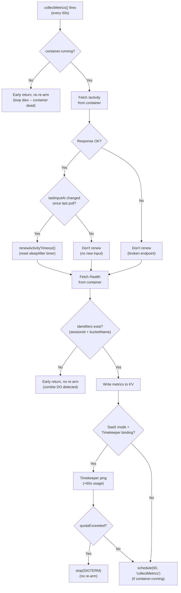

**`onActivityExpired()` Override:** Performs a final input-change check before stopping. Fetches `/activity` and compares `lastInputAt` to `lastSeenInputAt`. If new input was received since the last `collectMetrics` poll (i.e., user typed between the last poll and expiry), renews `sleepAfter` and returns. Otherwise calls `this.stop('SIGTERM')`. Container not running, non-OK `/activity` response, or fetch error all result in `this.stop('SIGTERM')`. By the time `onActivityExpired` fires, the user-configured `sleepAfter` duration of zero `renewActivityTimeout()` calls has elapsed.

**`destroy()` Override:** Clears `SESSION_ID_KEY`, `bucketName`, `workspaceSyncEnabled`, `tabConfig`, `fastStartEnabled` from DO storage and nulls `_bucketName`, `_sessionId`, `_r2AccessKeyId`, `_r2SecretAccessKey`, `_containerAuthToken`, `_openaiApiKey`, `_geminiApiKey`, `_githubToken`, `_cloudflareApiToken`, `_cloudflareAccountId`, `_encryptionKey` in memory, and resets `_sessionMode` to `'default'` BEFORE calling `super.destroy()`. This prevents `onStop()` (triggered asynchronously by `super.destroy()` killing the container) from resurrecting deleted sessions in KV.

**Environment Variables Injection:** R2 credentials flow via two paths: (1) `_internal/setBucketName` request body (primary, from Worker), (2) `this.env` fallback (DO restart). Fallback chain: Worker-provided > `this.env` > empty string.

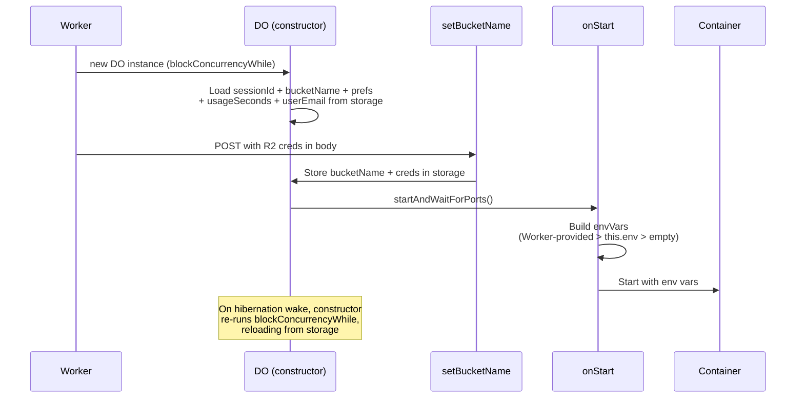

**Critical: `envVars` must be set as a property assignment**, not as a getter. Cloudflare Containers reads `this.envVars` as a plain property at `start()` time.

**`setBucketName` Idempotency (409 Path):** Once `_bucketName` is set, subsequent `setBucketName` calls return 409. BUT the 409 handler still stores `sessionId`, `workspaceSyncEnabled`, `tabConfig`, `fastStartEnabled`, and `userEmail` in DO storage, updates in-memory LLM keys, deploy keys, encryption key, and session mode, and applies `sleepAfter` preference -- this ensures `collectMetrics`/`onStop` can find the KV entry even on session restarts (where the DO already has a bucket set but needs the sessionId for the new lifecycle), that user preference changes take effect without container recreation, and that the Timekeeper gets the correct user identity.

**Lifecycle Route Re-calls `setBucketName` After `destroy()`:** In the `needsBucketUpdate` path (restart with different bucket), `destroy()` wipes DO storage. The lifecycle route must call `setBucketName` again after `destroy()` to re-populate sessionId, bucketName, and R2 credentials. See `src/routes/container/lifecycle.ts`.

**Internal Endpoints:** `/_internal/setBucketName`, `/_internal/setSessionId`, `/_internal/getBucketName`

### Terminal Server (node-pty)

**File:** `host/src/server.ts` - Node.js/TypeScript server inside the container. Single port 8080 for WebSocket + REST + health/metrics.

Sync handled entirely by `entrypoint.sh` (60s daemon). Terminal server reads sync status from `/tmp/sync-status.json` and exposes via `/health`. Activity tracking (WebSocket connection state + user input timestamps: `hasActiveConnections`, `connectedClients`, `activeSessions`, `disconnectedForMs`, `lastInputAt`) for hibernation decisions via `GET /activity`. Unknown JSON `type` strings are silently ignored (guard against future message types leaking to PTY).

**Auth-Exempt Paths:** The terminal server validates `Authorization: Bearer <token>` on all HTTP requests. Paths called via `getTcpPort().fetch()` (which bypasses the DO's `fetch()` override that injects the auth header) must be in the `authExemptPaths` Set at `host/src/server.ts`: `['/health', '/activity']`. The `/activity` endpoint is also exempted from auth in the DO-level `fetch()` override so internal health checks don't require token injection.

**`GET /activity` Endpoint:** Returns `{ hasActiveConnections: boolean, connectedClients: number, activeSessions: number, disconnectedForMs: number | null, lastInputAt: number | null }`. Used by both `collectMetrics()` (input-change detection) and `onActivityExpired()` (final input check). Active connections = WebSocket clients that are currently connected. `disconnectedForMs` tracks time since all clients disconnected (null if clients are currently connected). `lastInputAt` is the Unix timestamp (ms) of the last real user input — determined by `containsUserInput()` after `stripTerminalResponses()` removes terminal protocol chatter (CPR, OSC, DA). The DO compares `lastInputAt` to its `lastSeenInputAt` field to detect new input between polls.

**Idle Detection (Two-Layer):** The Container DO enforces idle timeout through two complementary mechanisms:

1. **SDK timer (`onActivityExpired`):** The SDK's built-in `sleepAfter` timer fires when no HTTP requests pass through `super.fetch()` for the configured duration. Works well for longer timeouts (30m+) where WebSocket reconnects are infrequent. `onActivityExpired()` checks `/activity` one last time and calls `this.stop('SIGTERM')`. The KV status write happens in `onStop()`, not in `onActivityExpired()` itself.

2. **Explicit idle-stop (`collectMetrics`):** `collectMetrics()` polls `/activity` every 60s and independently checks idle time: `Date.now() - (lastInputAt ?? containerStartedAt)`. If this exceeds `parseSleepAfterMs()`, it writes KV status `'stopped'` and calls `this.stop('SIGTERM')`. This is the **primary** enforcement for short timeouts (5m) because `super.fetch()` resets the SDK timer on every HTTP request (including periodic WebSocket reconnects), preventing `onActivityExpired()` from firing.

The `containerStartedAt` fallback is critical: if a user opens a terminal but never types, `lastInputAt` stays `null`. Without the fallback, the idle check would be skipped and the container would run forever. With the fallback, idle time is measured from container start.

`containsUserInput()` in `host/src/session.ts` uses a whitelist approach — only actual keypresses count (printable characters, control keys, arrow keys, function keys, Alt+key, mouse clicks). Terminal protocol responses (CSI, OSC, DCS, APC, focus reports, mouse movement) do not count. `stripTerminalResponses()` removes terminal emulator response sequences (CPR, OSC 10/11/12, DA1) before writing to the PTY. Scenarios: user stops typing → container stops after `sleepAfter` + up to 60s (poll granularity); browser closed → same; user opens terminal but never types → container stops after `sleepAfter` from start time.

**WebSocket Wake-Loop Prevention:** Three layers prevent browser auto-reconnect from waking a hibernated container in an infinite stop/start cycle:
1. **DO fetch gate** (`container/index.ts`): The `fetch()` override returns 503 when `!this.ctx.container?.running` for all non-internal routes. This is authoritative (the DO knows container state directly, no KV read needed) and prevents `super.fetch()` from triggering the SDK's `startIfNotRunning`.
2. **Terminal route guard** (`routes/terminal.ts`): Rejects WebSocket upgrade requests with 503 when `session.status === 'stopped'` in KV. This is defense-in-depth — catches requests before they reach the DO.
3. **Frontend disposal** (`stores/session.ts`): The session poller detects running→stopped transitions and calls `terminalStore.disposeSession(sessionId)`, which kills all WebSocket retry loops for that session. Fresh `connect()` calls are only made when the user explicitly starts the session again.

**WebSocket Protocol:** Raw terminal data (NOT JSON-wrapped). Control messages (resize, process-name) as JSON. No application-level ping/pong -- Cloudflare handles protocol-level WebSocket keepalive for DO/Container connections. Headless terminal (xterm SerializeAddon) captures full state for reconnection.

**PTY:** Spawns `bash -l` (login shell for .bashrc) with `xterm-256color`, truecolor support.

**Terminal emulator response stripping:** `stripTerminalResponses()` in `host/src/session.ts` strips terminal emulator responses (CPR, OSC 10/11/12, DA1) from WebSocket input before writing to the PTY. These responses are generated by xterm.js in reply to terminal queries issued by CLI tools (e.g., `gh secret set` reads an OSC 11 response as the secret value). `containsUserInput()` then classifies the original data using a whitelist approach: printable characters, control keys (Enter, Backspace, Tab, Ctrl+key), arrow keys, function keys, Alt+key, and mouse clicks count as user input for idle detection. Terminal protocol chatter (CSI/OSC/DCS/APC sequences, focus reports, mouse movement/release) does not count. The `Session.write()` method calls both: PTY receives the filtered data, and `activityTracker.recordInput()` is called only when `containsUserInput()` returns true.

### Frontend (SolidJS + xterm.js)

**Directory:** `web-ui/`

Key files: `App.tsx` (root), `Terminal.tsx` (xterm.js), `TerminalTabs.tsx`, `Layout.tsx` (orchestrates dashboard/terminal views, manages WS disconnect/reconnect lifecycle), `SessionStatCard.tsx` (dashboard card with three-color status dot and metrics), `StorageBrowser.tsx` (R2 browser with toolbar), `StoragePanel.tsx` (slide-in drawer), `SettingsPanel.tsx`, `Dashboard.tsx`, `OnboardingLanding.tsx`, `OnboardingPage.tsx` (guided setup), `SubscribePage.tsx` (subscription flow), `UsagePage.tsx` (usage dashboard), `LoginPage.tsx` (SaaS login), `Header.tsx` (nav + user dropdown + inline usage), `KittScanner.tsx`.

Stores: `terminal.ts` (WebSocket state, compound key `sessionId:terminalId`, scheduled disconnect/reconnect), `terminal-url-detection.ts` (URL detection signals for floating buttons), `terminal-layout.ts` (terminal layout state), `session.ts` (CRUD, `terminalsPerSession`, `stopSession()` sets `'stopping'` and polls, `refreshSessionStatuses()` for lightweight dashboard polling — also updates storage stats from batch-status via `updateStatsFromBatch()`), `storage.ts` (R2 operations), `setup.ts`, `tiling.ts` (tiled terminal layout), `session-presets.ts` (preset/bookmark management), `session-tabs.ts` (tab configuration).

#### Dashboard WS Disconnect Flow

When user navigates to dashboard, `Layout.tsx` calls `scheduleDisconnect(DASHBOARD_WS_DISCONNECT_DELAY_MS)` (60s grace period). After the grace period, `disconnectAll()` closes all WS connections with reason `'dashboard-disconnect'`. Container can then idle to `sleepAfter` (user-configurable, default 30m for paying users, 5m for free tier). When user returns to terminal view, `cancelScheduledDisconnect()` cancels any pending timer, then `reconnectDisconnectedTerminals(activeSessionId)` reconnects only the active session's terminals. The `untrack()` fix in `Layout.tsx`'s `createEffect` wraps `activeSessionId` to prevent the reactive dependency from triggering reconnects on unrelated session changes.

**Tab Visibility Auto-Refresh:** `Layout.tsx` listens for `visibilitychange` events. When the tab returns from background (mobile browser tab switch, screen off/on), it auto-refreshes session statuses and storage listing. This prevents stale "Failed to fetch" errors that appear when background tabs have their network requests aborted by the browser. Storage refresh is silent (no loading spinner) to avoid UI flicker.

**Session Status Architecture:** KV polling (every 5s via batch-status) is the source of truth for session status. The Container DO sends custom WS close code **4503** when `!this.ctx.container?.running`, giving the client an authoritative "container stopped" signal distinct from network errors (code 1006). On 4503, the client immediately sets the terminal to `'disconnected'` with "Session stopped" message and stops retrying. On 1006 (network error), the client retries indefinitely — KV polling will update the status when propagation completes. Guards only block KV polling during user-initiated stop (`session.status === 'stopping'`) and session initialization (`session.status === 'initializing'`). When KV polling transitions a session to 'stopped', it also disposes terminal connections and clears `activeSessionId`.

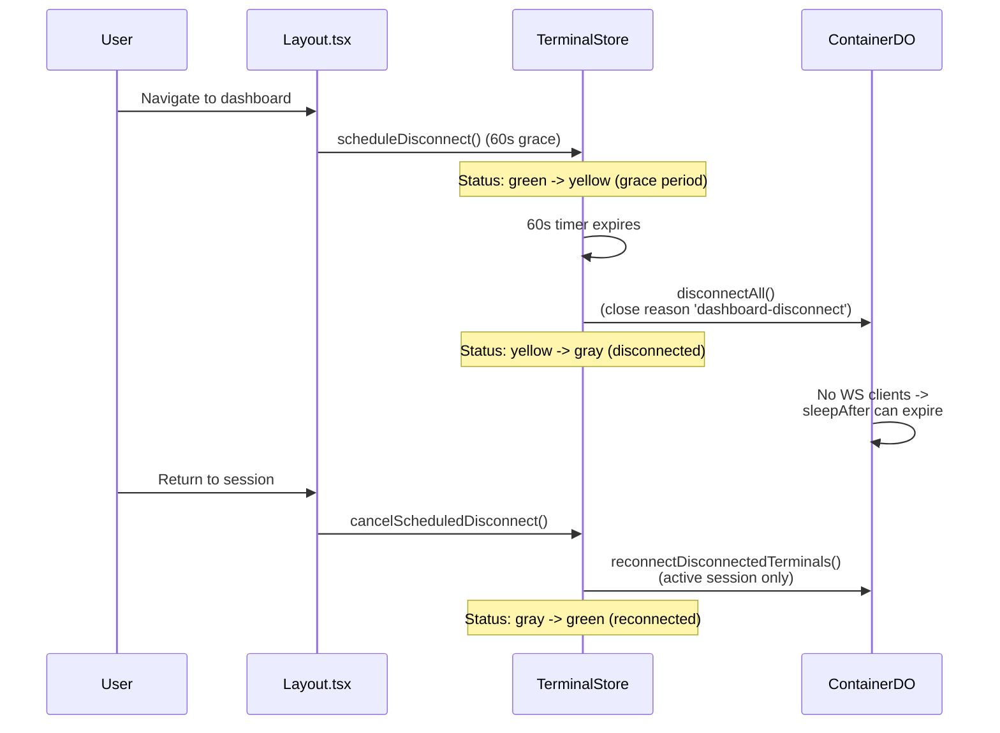

#### Three-Color Session Status

`SessionStatCard` displays green (running + WS connected), yellow (running + WS disconnected -- container alive but dashboard-disconnected), gray (stopped). Driven by `dotVariant()` which checks both `session.status` and `terminalStore.getConnectionState()`. The yellow indicator was added to make the dashboard-disconnect flow visible to the user -- without it, status jumped from green directly to gray.

#### Polling and Consistency

**Polling Interval:** `SESSION_LIST_POLL_INTERVAL_MS = 5000` -- frontend polls at 5s for responsive UI. The DO's `collectMetrics` pushes metrics to KV every 60s, so metrics may be up to ~60s stale on the dashboard. `CONTEXT_EXPIRY_MS = 30 * 60 * 1000` (30m) is the frontend context expiry threshold for detecting stale sessions. Note: backend `sleepAfter` is now user-configurable (5m–2h, default 30m), so context expiry may not exactly match all users' sleep timers.

**KV Eventual Consistency:** ~60s propagation delay for new sessions. Metrics may not appear at edge immediately after first `collectMetrics` write. The frontend handles this gracefully -- `SessionStatCard` shows last-known metrics for recently-stopped sessions.

#### KV Optimization (1500-User Scale)

Three optimizations reduce KV operations from ~910K/sec to ~350/sec at 1500 concurrent users:

**1. List Metadata for batch-status:** `putSessionWithMetadata()` in `kv-keys.ts` writes compressed `SessionListMetadata` (status, timestamps, metrics — ~195 bytes) alongside the session value via `kv.put(key, value, { metadata })`. `GET /api/sessions/batch-status` reads from `kv.list()` metadata instead of N individual `kv.get()` calls. Graceful fallback to `kv.get()` for pre-migration keys without metadata. Compressed field names: `s` (status: 'r'|'s'), `la` (lastActiveAt), `sa` (lastStartedAt), `m.c/e/h/y/u` (metrics). All 9 session write sites use `putSessionWithMetadata`. `validateSessionAndCheckLimits` also reads running count from metadata.

**2. Metrics via List Metadata:** `collectMetrics` writes metrics inline on the session record via `putSessionWithMetadata()`, which stores compressed `SessionListMetadata` (including metrics) as KV list metadata. `batch-status` reads these from `kv.list()` without individual `kv.get()` calls.

**3. User Record Cache:** Module-level `Map<string, { data, cachedAt }>` in Timekeeper with 60s TTL and 100-entry cap for `user:{email}` reads in `handlePing()`. Matches `getTierConfig()` cache pattern. Reduces 1500 uncached KV reads/min to ~25. `resetUserRecordCache()` exported for test cleanup.

| Metric | Before | After | Reduction |
|--------|--------|-------|-----------|
| batch-status KV reads/sec | ~901,500 | ~300 | 99.97% |
| Timekeeper user reads/min | 1,500 | ~25 | 98.3% |
| collectMetrics session reads/min | 1,500 | 0 | 100% |

**Auto-Reconnect:** Infinite retries with 1-second delay (`WS_RETRY_DELAY_MS = 1000`) for retryable close codes (1001, 1006, 1011, 1012, 1013). No dead-container inference from retry failure — only the server-authoritative close code 4503 stops retrying. Reconnection triggers session buffer replay via SerializeAddon state restore. AbortController-based cancellation prevents parallel retry loops.

**No Application-Level WS Pings:** Removed. Cloudflare's runtime handles protocol-level WebSocket keepalive for DO/Container connections automatically.

**Character Doubling Fix:** The `inputDisposable` must be stored outside `connect()` and disposed before creating a new handler on reconnect:
```typescript
let inputDisposable: IDisposable | null = null;
function connect() {
  inputDisposable?.dispose();
  inputDisposable = terminal.onData((data) => ws.send(data));
}
```

#### UI Features

**Nested Terminals (Multiple PTYs per Session):** Up to 6 terminal tabs per session. Compound key strategy: frontend `sessionId:terminalId`, WebSocket URL `/api/terminal/{sessionId}-{terminalId}/ws`. Backend parses compound ID, validates base session, forwards full ID to container. Container's SessionManager handles each compound ID as a separate PTY.

**StoragePanel (R2 File Browser):** Files: `StoragePanel.tsx`, `StorageBrowser.tsx`, `stores/storage.ts`. Desktop: 400px slide-in drawer. Mobile: bottom-sheet. Mutual exclusion with SettingsPanel. Reads directly from R2 via Worker API (no container-side sync trigger). Container sync handled by 60s bisync daemon.

**R2 Storage Stats Caching:** `GET /api/storage/stats` paginates all R2 objects and caches results in KV (`storage-stats:{bucketName}`, 60s TTL). `batch-status` piggybacks cached stats (no TTL check — relies on cache being fresh). Mutation endpoints (upload, delete, seed) invalidate the KV cache after successful operations. Dashboard calls `storageStore.fetchStats()` on mount, which hits `/api/storage/stats` and refreshes from R2 if the cache is stale or missing.

**Logout:** The frontend navigates directly to `/cdn-cgi/access/logout?returnTo={origin}/` via `window.location.href` (CF Access system endpoint). A backend route at `/auth/logout` (in `auth-redirects.ts`) also exists and redirects to `https://{authDomain}/cdn-cgi/access/logout?returnTo=https://{customDomain}/`, but the frontend currently uses the direct CF Access path.

**Header User Dropdown:** Clicking the avatar/username in both Header (terminal view) and Dashboard opens a dropdown with three items: Profile (`/app/subscribe`), Guided Setup (`/app/onboarding`), and Logout. Profile and Guided Setup use plain `<a href>` tags with no `onClick` handlers — SolidJS Router's top-level DOM listener intercepts clicks for client-side navigation (no full page reload, no white flash on dark backgrounds). This is critical for mobile: previous attempts using `<button>` + `window.location.href` or `onClick` handlers failed due to touch event race conditions with Portal DOM removal. Logout uses `window.location.href` to navigate to `/cdn-cgi/access/logout` (CF Access system endpoint). Dashboard dropdown uses `Portal` with the dropdown nested inside the overlay as a child (not a sibling) — `stopPropagation` on the dropdown div prevents touch events from reaching the overlay's `onClick`. Desktop: positioned below avatar via `getBoundingClientRect()`. Mobile: bottom sheet.

**Onboarding Page (`/app/onboarding`):** Guided setup page for new users. Three sections: (1) Connect GitHub — saves PAT via `updateDeployKeys`, (2) Connect Cloudflare — saves API token, (3) Coding Agents — informational cards linking to signup pages for 6 supported agents. Reuses `ProviderRow` and `BrandIcons` from settings. "Skip and Continue to Codeflare" button always visible. Uses standalone `.onboarding-page` container (`position: fixed; inset: 0; overflow-y: auto`) instead of `.login-page` — same pattern as `.setup-wizard` — because `.login-page` has `overflow: hidden` that blocks scrolling. **First-time redirect:** In SaaS mode, `AppContent` checks `onboardingComplete` from `/api/user` — if `false`, redirects to `/app/onboarding`. The Skip/Continue buttons call `POST /api/user/onboarding-complete` which sets `onboardingComplete: true` in the user's KV entry. Subsequent visits go directly to the dashboard. Users can always revisit via the header dropdown ("Guided Setup").

**Font consistency:** Login, subscribe, and onboarding pages all use `JetBrains Mono` monospace font via `font-family` on `.login-content` and `.onboarding-content` root containers. All child text inherits — no sans-serif fallback.

**Admin Protection:** Admin users always have `unlimited` subscription tier and can switch between default/advanced session modes freely. `canUseAdvanced()` in SettingsPanel returns `true` for admins regardless of stored tier — prevents admin lockout when JIT-provisioned with `pending` tier before being promoted. Backend rejects both tier changes (`PATCH /api/users/:email`) and deletions (`DELETE /api/users/:email`) for admin-role users. Frontend hides tier dropdown and delete button for admins in UserManagement.

**Live Tier Refresh:** `SettingsPanel` re-fetches `/api/user` each time it opens, updating a `liveAccessTier` signal with `subscriptionTier ?? accessTier` and `userHasSubscribed` signal from `hasSubscribed`. This ensures tier upgrades (admin promotes user to a higher tier) and subscription status changes take effect without a full page reload — the user just needs to close and reopen Settings. The `hasSubscribed` flag controls whether the auto-sleep dropdown is enabled.

**Auto-advanced session mode:** When a user is promoted to `advanced` tier via `PATCH /api/users/:email`, the backend also writes `sessionMode: 'advanced'` to their preferences (`user-prefs:{bucketName}`) if no `sessionMode` is set yet. This ensures their first bucket creation seeds advanced skills and agent rules. Existing user preferences (where `sessionMode` is already set) are not overridden. Admin users created by setup also get `sessionMode: 'advanced'` in their preferences automatically.

**Bucket creation and seeding:** R2 buckets are auto-created on first access from two paths: (1) `POST /api/container/start` via `ensureBucketAndSeed` and (2) `GET /api/storage/browse` when the dashboard loads the storage panel. Both paths read `sessionMode` from user preferences (`user-prefs:{bucketName}`) via `resolveSessionMode()` and pass it to `seedAgentConfigs()`/`reconcileAgentConfigs()` so the correct mode-specific files are seeded. The storage browser path typically runs first (dashboard loads before user starts a session).

**Frontend Zod Validation:** `web-ui/src/lib/schemas.ts` -- Zod schemas validate API responses at runtime. Types derived from schemas via `z.infer`.

**Terminal Tab Configuration:** `web-ui/src/lib/terminal-config.ts` -- Generic "Terminal 1-6" defaults with live process detection via `PROCESS_ICON_MAP` (maps running process names like cu, codex, gemini, opencode, copilot, htop, yazi, lazygit, bash, sh, zsh to MDI icons). `PROCESS_DISPLAY_NAME` maps binary names to display names (e.g. `cu` → `claude`) so tabs show the product name instead of the binary name. Separate `AGENT_ICON_MAP` maps the 6 agent types (claude-code, codex, gemini, opencode, copilot, bash) to session card icons.

#### Frontend Constants

**File:** `web-ui/src/lib/constants.ts` -- 20 exported constants for polling intervals, timeouts, WebSocket close codes, max terminals, display lengths, URL detection patterns, view transitions, context expiry, dashboard WS disconnect delay.

---

## Backend Libraries

| File | Purpose |
|------|---------|
| `src/middleware/auth.ts` | Shared authentication middleware. Delegates to `authenticateRequest()` which throws `AuthError`/`ForbiddenError` on failure. Sets `c.get('user')` and `c.get('bucketName')` for downstream handlers. |
| `src/lib/container-helpers.ts` | Consolidated container initialization: `getSessionIdFromQuery()` (from query param), `getContainerId()` (with validation, never fallbacks), `getContainerContext()` (full context for route handlers). |
| `src/lib/error-types.ts` | `AppError` base class with `code`, `statusCode`, `message`, `userMessage`. Specialized: `NotFoundError` (404), `ValidationError` (400), `ContainerError` (500), `AuthError` (401), `ForbiddenError` (403), `SetupError` (400), `RateLimitError` (429), `QuotaExceededError` (402), `CircuitBreakerOpenError` (503). Utilities: `toError(unknown)`, `toErrorMessage(unknown)`. |
| `src/lib/type-guards.ts` | Runtime type validation replacing unsafe type casts (e.g., `isBucketNameResponse()`). |
| `src/lib/constants.ts` | Single source of truth for 18 constants + 1 exported function: ports (`TERMINAL_SERVER_PORT = 8080`), session ID validation, CORS defaults, rate limit keys/windows, container fetch timeouts, max presets/tabs, protected paths, request ID config, session limits (`getMaxSessions()`). |
| `src/lib/circuit-breaker.ts` | Prevents cascading failures. States: CLOSED (normal), OPEN (fail fast), HALF_OPEN (testing recovery). Wraps `container.fetch()` calls. |
| `src/middleware/rate-limit.ts` | Per-user rate limiting (bucketName from auth, IP fallback). Stores counts in KV. Adds `X-RateLimit-*` headers. |
| `src/lib/logger.ts` | JSON logging with `createLogger(module)`, child loggers with request context. |
| `src/lib/jwt.ts` | RS256 verification against CF Access JWKS (`https://{authDomain}/cdn-cgi/access/certs`). Per-isolate JWKS cache with `resetJWKSCache()`. |
| `src/lib/cache-reset.ts` | Centralized invalidation of CORS + auth config + JWKS caches. Called by setup wizard after configuration changes. |
| `src/lib/cf-api.ts` | Cloudflare API client. `parseCfResponse` checks `Content-Type` header before JSON parsing. When content-type is not `application/json`, attempts `JSON.parse` on the text body as a lenient fallback (Cloudflare sometimes omits content-type on valid JSON). Only throws a structured `AppError` with the first 200 chars of the response body if the parse actually fails -- this gives clear diagnostics for HTML error pages or plain text from expired tokens, instead of opaque JSON parse errors. |
| `src/lib/request-helpers.ts` | Shared request handling: `parseJsonBody(c)` (JSON parse with ValidationError on malformed input), `firstZodError(error)` (first Zod issue message with fallback), `validateSessionId(id)` (throws on invalid format), `maskSecret(value)` (shows last 4 chars). |
| `src/lib/kv-keys.ts` | KV key utilities: session/user key helpers, `SETUP_KEYS` const for all 20 `setup:*` configuration keys, `getBaseUrl(kv, requestUrl)`, `listAllKvKeys()`. |
| `src/types.ts` | `BillingStatus` union type (`'active' | 'trialing' | 'past_due' | 'canceled'`) with `BILLING_STATUS` const and `isBillingStatus()` guard. `ContainerConfigPayload` groups 16 container initialization params into logical sub-objects (R2 creds, LlmKeys, DeployKeys, preferences). |

### Setup Wizard Resilience

**Directory:** `src/routes/setup/`

All Cloudflare API calls in the setup wizard are wrapped in `withSetupRetry()` (defined in `shared.ts`) for transient failure resilience. The wrapper retries up to 2 times (3 total attempts) with exponential backoff (1s, 2s), skipping retry for `CircuitBreakerOpenError`.

**Cross-environment safety:** `resolveManagedAccessApp()` in `access.ts` uses a 4-tier fallback to find existing Access apps: (1) exact domain match, (2) stored app ID from KV, (3) name match + domain validation, (4) `/app/*` suffix + domain validation. Tiers 3 and 4 validate domain to prevent cross-environment collision when multiple environments share a CF account.

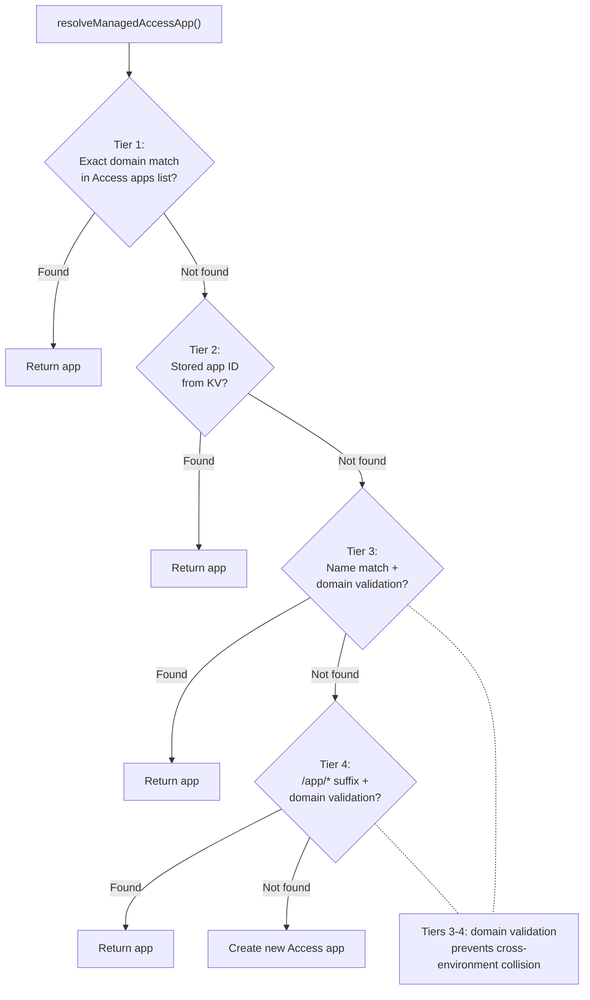

**Error propagation:** `listAccessApps()` and `listAccessGroups()` propagate errors through `withSetupRetry` rather than silently returning `[]`. Errors surface as `SetupError` with step details. The frontend `ApiError` carries a `steps` array from `SetupError` JSON responses.

**Stale user removal during reconfiguration:** When `POST /configure` is re-run with a new `allowedUsers` list, users no longer in the list are removed via `cleanupUserData()` (`src/lib/user-cleanup.ts`), wrapped in `runStep('cleanup_stale_users')` for progress visibility. This performs full cleanup identical to `DELETE /api/users/:email`: destroys all active sessions/containers, deletes bucket-keyed KV entries (`storage-stats:`, `presets:`, `user-prefs:`, `timekeeper:`), deletes the R2 scoped token, empties the R2 bucket (paginated `ListObjectsV2` + `DeleteObjects` via `emptyR2Bucket`), and deletes the bucket via CF API with retry logic (up to 3 attempts with exponential backoff for R2 eventual consistency). **SaaS mode:** only admin-role users removed from the admin list are cleaned up — JIT-provisioned regular users are preserved (managed via User Management, not setup). Each existing KV user is checked for `role: 'admin'` before deletion. Admin KV writes merge with existing entries (preserving tier fields) and always set `subscriptionTier: 'unlimited'`. **Self-removal prevention:** during reconfiguration, the backend rejects the request if the current authenticated user is not in the submitted admin list (`ValidationError: 'You cannot remove yourself from the admin list'`). The Zod schema enforces at least 1 admin user.

### Session Route Architecture

**Directory:** `src/routes/session/` - Split into `index.ts` (aggregator), `crud.ts` (CRUD), `lifecycle.ts` (start/stop/status/batch-status).

**Session Stop Flow (user-initiated):** Sets KV status to `'stopped'`, calls `container.destroy()` (sends SIGINT per Dockerfile STOPSIGNAL, then SIGKILL), entrypoint.sh shutdown handler runs final `rclone bisync`. `destroy()` override clears `SESSION_ID_KEY`/`bucketName` from DO storage before `super.destroy()` -- prevents `onStop()` from resurrecting the deleted session. Both `batch-status` and `GET /:id/status` trust the `'stopped'` KV status to avoid waking the DO (exception: stale >5 minutes triggers probe).

**Session Stop Flow (idle):** `onActivityExpired()` detects no new user input since last `collectMetrics` poll, or unreachable activity endpoint -> `this.stop('SIGTERM')` -> `onStop()` clears `collectMetrics` schedule and writes `status: 'stopped'` to KV. Note: `onActivityExpired()` itself does not write KV — the KV write happens in `onStop()`.

---

### Code Structure (Pre-Launch Refactoring)

**Container DO extraction:** `src/container/index.ts` split from 887 → 475 lines:
- `container-env.ts` (338 lines): env var construction, bucket name application, credential injection, prefs-on-restart
- `container-metrics.ts` (267 lines): collectMetrics, idle detection, Timekeeper ping, KV status updates (immutable spread, not mutation)
- `index.ts` (475 lines): thin facade owning DO lifecycle (constructor, fetch, onStart, onStop, alarm). Sub-modules receive state via explicit interface parameters, not class inheritance.

**Session store extraction (CF-013):** `web-ui/src/stores/session.ts` split from 768 → 582 lines:
- `session-polling.ts` (196 lines): refreshSessionStatuses, miss counters, start/stop polling. Uses dependency injection via `registerPollingDeps()`.
- `session-usage.ts` (73 lines): UsageState, warning levels, localStorage cache. Self-contained, no circular deps.
- `session.ts` (582 lines): facade re-exports all members. Public API unchanged.

**Type safety fixes (CF-007):** `countPaidSlots` typed (no more `any[]`). Admin PATCH user uses `updateUserRecord` (not raw `KV.put`). `maxUsers` added to frontend `GetUsersResponseSchema` (no more double cast).

**Validation consolidation (CF-009):** 4 inline `SESSION_ID_PATTERN.test()` in `crud.ts` replaced with `validateSessionId()` from `request-helpers.ts`. Errors flow through global handler with consistent JSON shape.

**Shared config schema (CF-006):** `SetBucketNameBodySchema` in `container-config-schema.ts` — Zod schema for setBucketName payload with `.passthrough()` for flexibility. Deploy credential fields use conditional spread (not explicit `null`).

**ScrambleText consolidation (CF-016):** `ScrambleText.tsx` rewritten as 15-line wrapper around `useScrambleText` hook (canonical `requestAnimationFrame` implementation). Single source of truth for scramble animation. Hook accepts `animateOnMount` option to trigger scramble on first render (used by standalone ScrambleText component on login/subscribe pages).

---

## Data Flow

### Session Creation to Terminal Connection

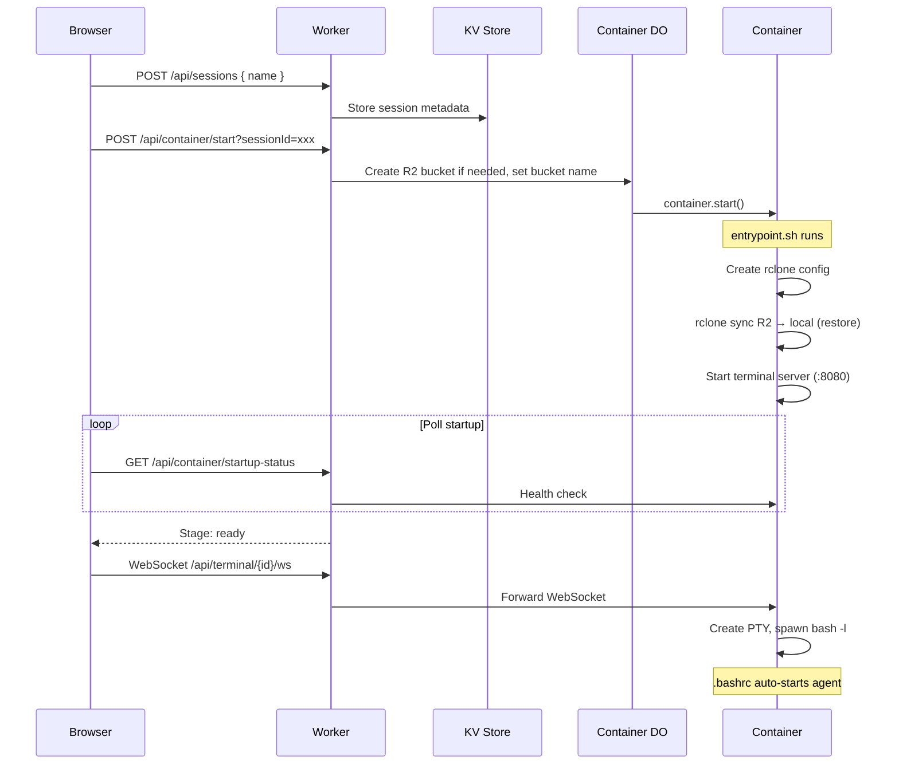

### Startup Status Stages

| Stage | Progress | Condition |
|-------|----------|-----------|
| stopped | 0% | Container not running |
| starting | 10-20% | Container running but health server not responding |
| syncing | 30-45% | Health server up, syncStatus = pending/syncing |
| verifying | 85% | Sync complete, terminal server not yet responding |
| mounting | 90% | Terminal server up, PTY pre-warming in progress. WebSocket connects, terminal canvas hidden (`visibility: hidden`) |
| ready | 100% | All checks passed. "Open" button appears. Click reveals terminal canvas with pre-buffered content |
| error | 0% | Sync failed or other error |

### Session Lifecycle State Machine

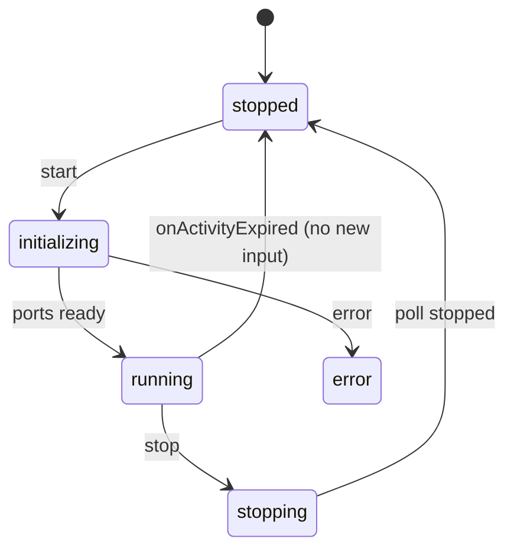

**Stop (idle):** `sleepAfter` expires -> SDK calls `onActivityExpired()` -> checks `/activity` -> `lastInputAt` unchanged since last poll (no new input) or unreachable endpoint -> `this.stop('SIGTERM')` -> `onStop()` clears `collectMetrics` schedule -> KV status = `'stopped'`

**Fast container-stopped detection (frontend):** When the Container DO's "not running" guard returns close code `4503` (`WS_CONTAINER_STOPPED_CODE`), the terminal store stops retrying and marks the connection as disconnected. This is server-authoritative — the container is definitively not running. Non-4503 close codes (1006, 1001, 1011, etc.) trigger automatic reconnection with 1s delay.

**Anti-flapping (KV stopped→running):** When KV batch-status polling detects a `stopped→running` transition for a non-active session, `refreshSessionStatuses()` updates the session status dot but does **not** auto-initialize terminals. This prevents a flapping cycle: stale KV "running" → WS connections → 503 from dead container → disconnected → stale KV "running" restarts cycle. Newly started sessions have a 3-minute startup guard (`session-polling.ts`) during which only `4503` close code can transition them to stopped. The user explicitly clicks the session card to reconnect. Terminal initialization only occurs during: (1) explicit session start by user, (2) `loadSessions()` on initial page load where KV is authoritative.

**Stop (user-initiated):** Worker sets KV status to `'stopped'` -> calls `container.destroy()` -> `destroy()` clears `SESSION_ID_KEY` + `bucketName` from DO storage to prevent deleted session resurrection -> `super.destroy()` -> `onStop()` bails (no identifiers, so no KV write)

**Delete:** Worker `KV.delete()` -> `container.destroy()` -> `destroy()` clears `SESSION_ID_KEY` + `bucketName` -> `super.destroy()` -> `onStop()` bails (no identifiers, so deleted session cannot be resurrected in KV)

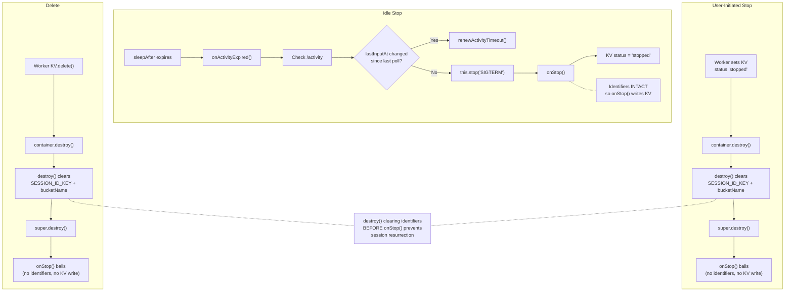

**Restart (same bucket):** `setBucketName` -> 409 (bucket already set, but stores `sessionId`, `workspaceSyncEnabled`, `tabConfig`, and `fastStartEnabled` in DO storage for KV reconciliation and preference updates) -> `startAndWaitForPorts()` -> `onStart()` re-arms metrics

**Restart (different bucket):** `setBucketName` succeeds -> `destroy()` (wipes DO storage) -> lifecycle route re-calls `setBucketName` (re-populates sessionId + bucketName + R2 creds) -> `startAndWaitForPorts()`

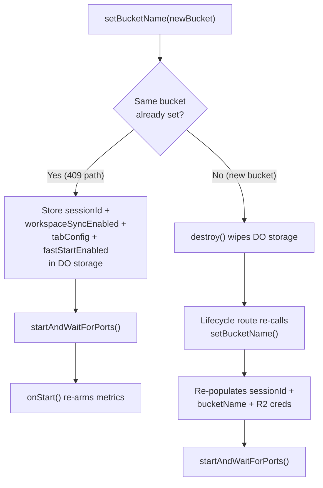

### Metrics Data Flow

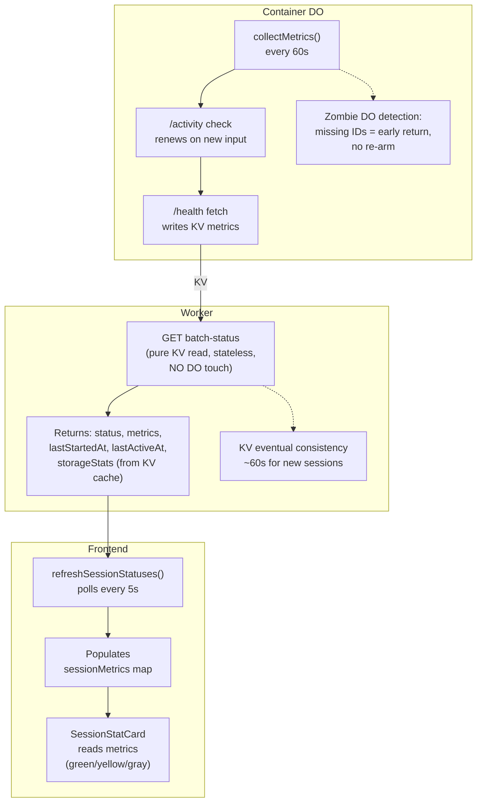

---

## Storage and Sync

### Storage Quota

Per-user R2 storage is capped by `maxStorageBytes` in `SubscriptionTierConfig`. R2 has no native per-bucket quota — enforcement is in application code.

**Tier defaults:** Configurable per tier in admin Subscription Management panel (Storage Quota field, in MB). Custom tier defaults to unlimited.

**Enforcement:** Session creation (`POST /api/sessions` in `crud.ts`) checks `storage-stats:{bucketName}` KV cache against the user's tier quota. If `totalSizeBytes > maxStorageBytes`, the request is rejected with a clear error message. Users must delete files from their storage browser to free space before starting new sessions.

**Stats endpoint:** `GET /api/storage/stats` returns `maxStorageBytes` alongside usage stats. The quota is cached in KV alongside the stats (`storage-stats:{bucketName}`) so cache hits don't need tier config resolution — tier config is only read on cache miss (every 60s). Frontend displays "X / Y" in the storage card. Subscribe page plan cards show storage quota in the specs line. Admin Subscription Management has an editable "Storage Quota (MB)" field per tier.

**What is NOT enforced:** Individual file uploads, rclone sync writes, and preseed writes are not blocked by quota. The quota is checked only at session start. Users can temporarily exceed their quota during an active session via rclone sync or file uploads. The overage is caught on the next session start attempt.

**Tier config merge:** `getTierConfig()` merges stored KV tiers with hardcoded defaults via `{ ...default, ...stored }`. New fields (like `maxStorageBytes`) backfill from defaults even when KV was saved before the field existed. Admin-saved values always take priority. The admin `PUT /api/admin/tiers` Zod schema includes `maxStorageBytes` so it persists on save.

### Why rclone bisync (Not s3fs)

s3fs FUSE: every file op = network call (~340ms PUT, ~50ms HEAD), fragile on network hiccups, "Socket not connected" errors.

rclone bisync: all file ops on local disk (<1ms), background daemon every 60s, final bisync on shutdown (SIGINT/SIGTERM), stable.

### Initial Sync on Startup

1. One-way `rclone sync` from R2 to local (restore data) — blocking, container waits for completion (120s timeout)
2. All file modifications run (`.claude.json`, `.gemini/settings.json`, `.codex/version.json`, tab autostart) — these complete before bisync starts to avoid hash mismatches
3. `rclone bisync --resync --ignore-checksum --max-delete 100 --check-sync=false --retries 3 --retries-sleep 10s` to establish baseline (non-blocking — runs in background), then start 60-second daemon

All bisync commands use `--ignore-checksum` to skip post-transfer MD5 verification. rclone v1.73+ treats hash mismatches as fatal ("corrupted on transfer"), which aborts bisync when files change during transfer (e.g., coding agents modifying workspace files). Change detection still uses modtime + size; files that change mid-transfer are caught in the next 60s cycle.

`--min-size 1B` on all rclone commands (sync, bisync baseline, bisync daemon) excludes 0-byte files from transfer. R2 SSE-C fails on empty objects — the HeadObject call returns 400 when SSE-C headers are sent for a 0-byte object, which causes rclone to abort with "encryption parameters are not applicable". Empty files (`.lock`, `__init__.py`, etc.) carry no data and are excluded entirely.

`--max-delete 100` allows bisync to propagate bulk deletions (e.g., deleting entire workspace folders). The rclone default of 50% aborts bisync when more than half the files are deleted in one cycle — in a config-heavy sync with few files, even a single folder deletion can exceed this threshold.

### What's Synced vs Excluded

| Path | Synced | Reason |
|------|--------|--------|
| `~/.claude/` | Yes | Claude credentials, config, projects |
| `~/.config/` | Yes | App configs (gh CLI, etc.) |
| `~/.gitconfig` | Yes | Git configuration |
| `~/workspace/` | Depends on `SYNC_MODE` | Excluded by default (`none`). Synced when `full` or partially with `metadata`. |
| `~/.npm/`, `~/.bun/`, `~/.cache/**`, `~/.config/rclone/**` | **NO** | Package manager and rclone caches, regenerated |
| `~/.local/share/claude/**` | **NO** | Native installer version binaries (leftover data, removed from build) |
| `~/.copilot/logs/**`, `~/.copilot/pkg/**` | **NO** | Copilot session logs and auto-update binary |
| `~/.codex/sessions/**`, `~/.codex/log/**`, `~/.codex/tmp/**`, etc. | **NO** | Codex ephemeral session data and caches |
| `~/.claude/cache/**`, `~/.claude/debug/**`, `~/.claude/file-history/**`, etc. | **NO** | Claude Code session-specific ephemeral data |
| `~/.claude/projects/**/subagents/**` | **NO** | Subagent transcripts (results captured in main transcript) |
| `~/.claude/usage-data/**`, `~/.claude/backups/**`, `~/.claude/tasks/**` | **NO** | Insights reports, settings backups, task state (all regenerated) |
| `~/.claude/sessions/**`, `~/.claude/history.jsonl` | **NO** | Session metadata, command history (ephemeral) |
| `~/.cpan/**` | **NO** | Perl CPAN package manager cache, regenerated |
| `~/.gemini/tmp/**` | **NO** | Gemini CLI temp files (ripgrep binary, chat logs) |
| `~/.local/share/opencode/log/**`, `opencode.db-shm`, `opencode.db-wal` | **NO** | OpenCode session logs and SQLite temp files |

### rclone Sync Modes

| Mode | Workspace Sync | Use Case |
|------|---------------|----------|
| `none` | Excluded entirely | Default. Settings and config only. |
| `full` | Entire `workspace/` (minus `node_modules/`) | Persistent storage across stop/resume |
| `metadata` | Only agent config files (`.claude/` and `CLAUDE.md`) per repo | Lightweight project context sync |

All modes always exclude: `.bashrc`, `.bash_profile`, `.npm/**`, `.bun/**`, `.cache/**`, `.config/rclone/**`, `.config/.wrangler/**`, `**/node_modules/**`, `.local/share/claude/**`, `.local/state/**`, `.copilot/logs/**`, `.copilot/pkg/**`, `.copilot/session-state/**`, `.codex/sessions/**`, `.codex/state*.sqlite-shm`, `.codex/state*.sqlite-wal`, `.codex/.tmp/**`, `.claude/cache/**`, `.claude/debug/**`, `.claude/file-history/**`, `.claude/plugins/marketplaces/**`, `.claude/projects/**/subagents/**`, `.claude/projects/**/tool-results/**`, `.claude/session-env/**`, `.claude/shell-snapshots/**`, `.claude/stats-cache.json`, `.claude.json.backup.*`, `.claude/usage-data/**`, `.claude/backups/**`, `.claude/tasks/**`, `.claude/sessions/**`, `.claude/history.jsonl`, `.codex/log/**`, `.codex/models_cache.json`, `.codex/.personality_migration`, `.codex/shell_snapshots/**`, `.codex/tmp/**`, `.codex/version.json`, `.cpan/**`, `.gemini/tmp/**`, `.local/share/opencode/log/**`, `.local/share/opencode/opencode.db-shm`, `.local/share/opencode/opencode.db-wal`, `.memory/counter/**`. All rclone commands use `--filter` flags (NOT `--include`/`--exclude`).

**Note:** The `metadata` mode is defined in `entrypoint.sh` but the Container DO currently only maps `workspaceSyncEnabled` to `full` or `none`. The `metadata` mode can be used by setting `SYNC_MODE` directly in the container environment.

### Session Transcript Cleanup

`cleanup_old_transcripts()` runs before each periodic bisync (sequential in the same loop iteration — no concurrent access). Keeps the 5 most recent session transcripts (`.claude/projects/**/*.jsonl` sorted by mtime), deletes older `.jsonl` files only — session directories are left intact so Claude Code can still resolve project paths. Deletions propagate to R2 via bisync automatically. Subagent transcripts are also excluded from bisync entirely (`--filter "- .claude/projects/**/subagents/**"`) since results are captured in the main transcript. Both `cleanup_old_transcripts()` and `cleanup_old_memory_files()` are wrapped in subshells with `|| true` to prevent `set -euo pipefail` from killing the bisync daemon when cleanup encounters benign non-zero exits (e.g., empty `find` results, `xargs` with no input).

### Conflict Resolution

Newest file wins (`--conflict-resolve newer`). `--resilient` + `--recover` handle transient bisync failures (e.g., interrupted transfers, listing mismatches) without losing deletion tracking. The sync daemon retries in 60s on failure. `--max-delete 100` on ALL bisync commands (`establish_bisync_baseline` and `bisync_with_r2`) allows bulk workspace deletions to propagate. Shutdown handler runs final bisync. All bisync commands use `--ignore-checksum` to prevent false hash-mismatch aborts — rclone v1.73 introduced stricter post-transfer MD5 verification that fails when files change during sync.

`--check-sync=false` disables rclone's post-sync listing validation on both `establish_bisync_baseline` and `bisync_with_r2`. The validation compares local/remote file listings after sync — if files change on R2 during the sync (e.g., another active session writing), the listings diverge and rclone exits with code 7 (critical abort). This was the most common trigger. With `--check-sync=false`, drift is caught by the next 60s cycle instead.

`--retries 3 --retries-sleep 10s` (rclone v1.66+) on both functions adds bisync-level retries for transient R2 API failures. Each bisync invocation retries up to 3 times with 10s sleep between attempts, before the daemon-level retry logic even kicks in.

**Consecutive failure recovery:** The daemon tracks consecutive bisync failures. After 3 consecutive failures (each with 3 internal retries = 9 total attempts), falls back to `establish_bisync_baseline` (which uses `--resync`) to re-establish clean bisync state. `--resync` merges both sides (files present on only one side get copied to the other), so this is a last resort. The counter resets to 0 on any success or after the resync fallback. Resync failures are logged with full command output for diagnostic visibility. The baseline establishment timeout is 600s (10 minutes) to accommodate large initial syncs.

**Self-healing (`nuke_corrupted_r2_files`):** When resync fails (even after 3 daemon retries), the entrypoint automatically detects and removes files blocking bisync. Two strategies: (1) parse sync.log for ANY file path that caused a bisync error — catches encryption mismatch, size mismatch, corrupted transfer, copy failure, hash mismatch, listing conflicts. Files are deleted from both R2 (using both encrypted and unencrypted configs) and local. (2) If no error files found in logs, full R2 scan — list all objects with an unencrypted config, HEAD each with the encrypted config, delete any returning 400 (unencrypted orphans from older sessions). After nuking, bisync state is cleared and resync retried immediately. Self-healing runs both at startup (if initial baseline fails) and in the daemon (if resync fallback fails). Principle: losing one problematic file is better than losing all sync.

**Bisync exit code handling:** `bisync_with_r2()` uses a temp file approach instead of `| tee` to capture both output and exit code. Piping through `tee` swallows the rclone exit code (the pipe's exit code is `tee`'s, not rclone's), masking bisync failures and breaking error detection in the daemon loop. Both functions redirect with `> "$FILE" 2>&1` (not `2>&1 > "$FILE"`). The old order sent stderr to the parent process's stdout (lost) and only captured stdout in the file. rclone outputs errors and verbose info to stderr, so all diagnostic output was invisible in `/tmp/sync.log`.

**Bisync-initialized flag on timeout:** The bisync-initialized flag (`/tmp/.bisync-initialized`) is now touched on the sync timeout path as well. Previously, if initial sync timed out, the flag was never set, causing the shutdown trap to skip the final bisync — losing any files created during the session.

## Memory Persistence

Agent memory (knowledge graph via `@modelcontextprotocol/server-memory`) persists across sessions using per-session JSONL files synced to R2. **Memory persistence is gated on `SESSION_MODE=advanced`** — in default mode, the entire `.memory/` directory is excluded from rclone sync and merge/cleanup are skipped (MCP memory still works in-session but doesn't survive container recreate).

**Lifecycle** (advanced mode only):
1. Container boots, rclone pulls `~/.memory/session-*.jsonl` files from R2
2. `entrypoint.sh` runs `merge_memory_files()`: consolidates all session files into `session-{SESSION_ID}.jsonl`, deduplicating entities (by name) and relations (by JSON equality)
3. `server-memory` MCP server reads/writes `session-{SESSION_ID}.jsonl` during the session
4. rclone bisync syncs changes back to R2 every 60s and on shutdown
5. `cleanup_old_memory_files()` removes old session files (keeps 5 newest) after bisync baseline is established

**Why per-session JSONL:** Multiple concurrent sessions from the same user write to the same R2 bucket. A shared file would cause last-write-wins data loss. Per-session JSONL files eliminate write conflicts — each session owns its own file, and merge-on-boot consolidates them.

**Two-phase merge/cleanup:** The merge runs after R2 sync but before bisync baseline establishment. Old files are kept so `--resync` doesn't resurrect them. Cleanup (local-only deletion, KEEP=5) runs after bisync baseline succeeds, so periodic bisync propagates the deletions to R2. Direct R2 deletion is unsafe for concurrent sessions — another session's bisync would propagate the deletion locally, destroying the active memory file. The rclone config uses `disable_checksum = true` to skip `X-Amz-Meta-Md5chksum` metadata on multipart uploads, and `--s3-upload-cutoff 0` forces all uploads through the multipart path to prevent `BadDigest` errors — single-part PutObject pre-computes `Content-MD5` in a separate read pass, so files modified between hash and upload (TOCTOU race) cause R2 to reject with HTTP 400.

### LLM Consultation (consult-llm-mcp)

When `OPENAI_API_KEY` or `GEMINI_API_KEY` env vars are present, `entrypoint.sh` configures the `consult-llm-mcp` MCP server in `~/.claude.json`. This enables Claude Code to query external LLMs via the `consult_llm` MCP tool. Keys are stored in KV as `llm-keys:{bucketName}`, managed via `PUT /api/llm-keys`, and injected as container env vars during `setBucketName()`. Keys are NOT persisted in DO storage — read fresh from KV on each container start.

**Skill trigger phrases:** "discuss with llms", "consult llms", "ask llms", "get a second opinion", "ask ChatGPT", "consult Gemini", "ask GPT", "ask another AI".

**Default model pair** (skill sends to both models in parallel):

| Provider | Model ID |
|----------|----------|
| OpenAI | `gpt-5.4` |
| Google | `gemini-3.1-pro-preview` |

If the user names a specific model, only that model is queried. All supported models: `gpt-5.4`, `gpt-5.2`, `gpt-5.3-codex`, `gpt-5.2-codex`, `gemini-3.1-pro-preview`, `gemini-3-pro-preview`, `gemini-2.5-pro`.

Skill definition: `preseed/agents/claude/skills/consult-llm/SKILL.md`.

### Push & Deploy (deploy-keys)

Optional feature that lets users connect GitHub and Cloudflare accounts once in Settings. Tokens are stored in KV (`deploy-keys:{bucketName}`), validated against provider APIs on save, and injected as environment variables into every container session.

**Environment variables injected:** `GH_TOKEN` (GitHub fine-grained PAT), `CLOUDFLARE_API_TOKEN` (Cloudflare API token), `CLOUDFLARE_ACCOUNT_ID` (auto-fetched from CF API).

**Backend:** `src/routes/deploy-keys.ts` — GET returns masked tokens, PUT validates against GitHub/Cloudflare APIs before storing, DELETE clears all. Follows the same pattern as `llm-keys.ts`.

**Container injection:** Deploy keys are read from KV in `src/routes/container/lifecycle.ts` and passed to the Container DO via `buildSetBucketNameBody()`. The DO injects them as `envVars`. Keys are sent as explicit `null` when absent (not omitted) to ensure revocation propagates on session restart.

**Git credential helper:** `entrypoint.sh` configures `git config --global credential.helper` when `GH_TOKEN` is present, enabling `git push` without `gh auth login`.

**Token scopes:** GitHub (19 permissions pre-filled via template URL), Cloudflare (13 scopes pre-filled). Both URLs use provider-specific template mechanisms to pre-select permissions.

**GitHub PAT template (Aug 2025 format):** Uses correct parameter names (`emails` for email addresses, added `user_copilot_requests=read` account permission). Copilot CLI checks env vars in order: `COPILOT_GITHUB_TOKEN`, `GH_TOKEN`, `GITHUB_TOKEN`. If `GH_TOKEN` is set but lacks Copilot scope, auth fails silently. See [GitHub docs](https://docs.github.com/en/authentication/keeping-your-account-and-data-secure/managing-your-personal-access-tokens).

**Frontend:** `web-ui/src/components/settings/DeployKeysSection.tsx` — self-contained component with connect/disconnect flows for both providers, multi-account Cloudflare dropdown, and token masking.

**Preseed rule:** `preseed/agents/claude/rules/deploy-credentials.md` — comprehensive capability reference telling agents what commands are available with each token.

**Known gotchas:**
- `printf '%s' "$SECRET" | gh secret set` can store empty values — use file redirect (`< tmpfile`) instead.
- `cloudflare/wrangler-action@v3` bundles an old wrangler. Use `npx --yes wrangler deploy` with `env:` block for secrets.

---

## Authentication

### Dual Auth Mode

`getUserFromRequest()` checks auth methods in order:

1. **Service token** (`X-Service-Auth` header) — E2E testing, all modes. Constant-time comparison against `SERVICE_AUTH_SECRET`.
2. **GitHub OIDC** (`codeflare_session` cookie) — SaaS mode when `OAUTH_CLIENT_ID` is set. HMAC-SHA256 JWT signed by `OAUTH_JWT_SECRET`. Replaces CF Access entirely.
3. **Cloudflare Access** (`cf-access-jwt-assertion` header or `CF_Authorization` cookie) — default/onboarding mode, or SaaS without `OAUTH_CLIENT_ID`. Verified via JWKS.
4. **Pre-setup fallback** (`cf-access-authenticated-user-email` header) — trusted only before setup completes.

### GitHub OIDC (SaaS Mode)

When `SAAS_MODE=active` and `OAUTH_CLIENT_ID` is configured:

```
Login button → GET /auth/github/login
  → Set oauth_state cookie (random UUID, 5-min TTL)
  → 302 to github.com/login/oauth/authorize
  → User authorizes → GitHub redirects to /auth/github/callback
  → Validate state (cookie vs query param, not KV — avoids eventual consistency)
  → Exchange code for access token → fetch verified email from GitHub API
  → Sign HMAC-SHA256 JWT → Set-Cookie: codeflare_session (HttpOnly, Secure, SameSite=Lax, 1h)
  → Redirect to /app/ or /app/subscribe based on user state
```

- GitHub access token used ephemerally during callback, then discarded
- Only `primary: true, verified: true` emails accepted from GitHub API
- OAuth error codes allowlisted (access_denied, redirect_uri_mismatch, application_suspended)
- Callback rate-limited (10/min per IP)
- Missing `OAUTH_JWT_SECRET` in SaaS mode throws `AuthError` (fail-loud, no silent fallthrough to CF Access)

**Logout:** `/auth/logout` routes to `/auth/github/logout` (clears cookie) in SaaS mode, or CF Access logout in default mode. Frontend uses `/auth/logout` — never hardcodes CF Access URLs.

### Cloudflare Access Integration (Default/Onboarding Mode)

**Browser/JWT:** `cf-access-authenticated-user-email` + `cf-access-jwt-assertion` headers.

**Service Token:** `CF-Access-Client-Id` + `CF-Access-Client-Secret` headers. Mapped to email via `SERVICE_TOKEN_EMAIL`.

**Email Normalization:** Trimmed + lowercased before KV lookup, role resolution, and bucket name derivation.

### Access Application Destination Strategy

One Access application with five destinations: `/app`, `/app/*`, `/api/*`, `/setup`, `/setup/*`. Including exact + wildcard variants removes ambiguity. Uses all 5 allowed entries. **Skipped when `OAUTH_CLIENT_ID` is set** — CF Access app is still created by the setup wizard but auth is bypassed at runtime by the OIDC branch.

### Access Group Model

Per-worker groups: `<worker-name>-admins`, `<worker-name>-users`. Setup upserts both, stores IDs in KV. `/api/users` syncs group membership via `syncAccessPolicy()` after user mutations — **skipped in SaaS mode** because the Access policy uses `login_method` includes (set by setup); syncing would overwrite them with email/group includes, breaking the policy. `GET /api/setup/prefill` reads existing membership for redeploy prefill (skipped in SaaS mode — returns empty arrays, admin enters everything manually). Admin-only deployments (0 regular users) are supported: the users group is skipped entirely and the Access policy references only the admin group.

### E2E Testing Auth

E2E tests authenticate via `X-Service-Auth` header. The secret comes from:
- **CF Access mode:** `CF_ACCESS_CLIENT_SECRET` environment secret (also sent as CF Access headers)
- **GitHub OIDC mode:** `OAUTH_E2E_TEST_SECRET` environment secret (no CF Access headers needed)

Both are deployed as `SERVICE_AUTH_SECRET` on the Worker. When neither is set, service auth is disabled (safe — `env.SERVICE_AUTH_SECRET` is undefined, the check is skipped).

### Root Redirect

- Setup incomplete -> redirect to `/setup`
- Setup complete, default mode -> `/` redirects to `/app/`
- Setup complete, onboarding mode -> authenticated users to `/app/`, unauthenticated to public landing
- Setup complete, SaaS mode -> `/` shows login page with "Sign in with GitHub" button

### Auth Flow

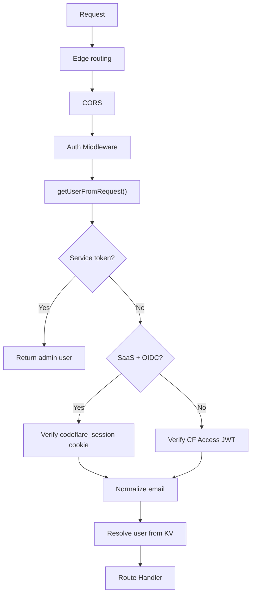

### Per-User Bucket Naming

`user@example.com` -> `codeflare-user-example-com` (sanitized, max 63 chars).

### Bucket Auto-Creation

**File:** `src/lib/r2-admin.ts` - `createBucketIfNotExists()` via Cloudflare API on first container start.

---

## SaaS Mode Authentication

When `SAAS_MODE=active`, Codeflare replaces the Cloudflare Access interstitial with a branded login page. New users are auto-provisioned with `pending` subscription tier and require admin approval. This section documents the complete SaaS auth flow from initial setup through user approval to session management.

### Deployment Modes

| Mode | Auth provider | User provisioning | Access control |
|------|--------------|-------------------|----------------|
| **Default** (no `SAAS_MODE`) | Cloudflare Access (JWT) | Manual allowlist via setup wizard | CF Access policies + KV allowlist |
| **SaaS** (`SAAS_MODE=active`) | Custom login page + CF Access IdP hints | Auto-provisioned on first login | Three-tier middleware + KV subscription tiers |

### Complete SaaS Authentication Flow

The diagram below shows the entire journey from first visitor to active user (self-service subscription flow):

```mermaid
flowchart TD
    A["Visitor arrives at domain"] --> B["CF Access intercepts request<br/>(no JWT cookie)"]
    B --> C{"Access policy<br/>login_method check"}
    C -->|not authenticated| D["Redirect to GitHub OAuth<br/>(auto_redirect_to_identity=true)"]
    D --> E["User completes GitHub login"]
    E --> F["CF Access mints JWT<br/>(CF_Authorization cookie)"]
    F --> G["Redirect to /app/<br/>with CF_Authorization cookie"]
    G --> H["Request reaches Worker<br/>with CF Access JWT"]
    H --> I["authenticateRequest verifies JWT<br/>from JWKS at auth_domain"]
    I --> J["Extract user email<br/>from JWT claims"]
    J --> K{"User in KV?<br/>user:{email} record"}
    K -->|no| L["JIT Provision:<br/>new record with pending tier"]
    K -->|yes| M["Load existing<br/>subscription tier"]
    L --> N["requireActiveUser check"]
    M --> N
    N -->|tier=pending| O["Redirect to /app/subscribe"]
    N -->|active tier| P["Allow IDE access"]
    N -->|tier=blocked| Q["Show blocked message"]
    O --> R["SubscribePage Phase 1:<br/>features + status"]
    R --> R2["User clicks<br/>See subscription plans"]
    R2 --> R3["Phase 2: lifeline rail<br/>5 tiers + detail panel"]
    R3 --> S["User selects tier +<br/>completes Turnstile CAPTCHA"]
    S --> T["POST /api/auth/subscribe<br/>{ tier, turnstileToken }"]
    T --> U["Verify Turnstile token"]
    U --> V["Write subscriptionTier +<br/>accessTier + subscribedAt +<br/>subscribedMode + trialUsed to KV"]
    V --> W{"First time?"}
    W -->|yes| X["Redirect to /app/onboarding"]
    X --> P
    W -->|no| P
    P --> AC["Session created with tier"]
    AC --> AD["Tier controls session mode +<br/>max sessions + usage quota"]
```

This flow highlights the key architectural choice: **CF Access handles authentication (identity), while the Worker handles authorization (access control)**. CF Access only knows "is this person GitHub-authenticated?" while the Worker enforces the business logic: "is this person an approved tier?"

### Three-Tier Auth Middleware

SaaS mode uses a layered middleware stack on every request to protected routes. See `src/middleware/auth.ts`:

1. **`requireIdentity`** — Resolves the user from CF Access JWT (verified via JWKS at auth_domain). If the user is not in KV, auto-provisions them with `pending` tier via `resolveOrProvisionUser()`. Sets `c.get('user')` with email, role, subscriptionTier, and accessTier. Used for endpoints like `/api/auth/status` and `/api/auth/subscribe` where pending users need access to the subscribe page flow.

2. **`requireActiveUser`** — Authenticates (same as requireIdentity) then checks `subscriptionTier ?? accessTier` is an active tier (free/trial/standard/advanced/max/unlimited) via `isActiveTier()`. When SAAS_MODE is active:
   - Pending users get 403 JSON: `{ error: 'Access denied', code: 'PENDING' }` -- frontend catches this and redirects to `/app/subscribe`
   - Blocked users get 403 JSON: `{ error: 'Access denied', code: 'BLOCKED' }`
   - Active tier users pass through

   When SAAS_MODE is NOT active, requireActiveUser behaves identically to requireIdentity (no tier checking, backward compat). Also exported as `authMiddleware` alias for backward compatibility.

3. **`requireAdmin`** — Checks `role === 'admin'`. Must be used AFTER requireIdentity or requireActiveUser. Used for `/admin/*` and user management endpoints.

### Subscription Tiers

Codeflare uses a multi-tier subscription system that controls monthly compute hours, max concurrent sessions, and session modes. Tier IDs: `blocked`, `pending`, `free`, `trial`, `standard`, `advanced`, `max`, `unlimited`. Pricing is configurable per deployment via the admin Subscription Management panel and Stripe integration.

**Tier properties (in `SubscriptionTierConfig`):**
- `id: SubscriptionTier | string` — unique tier identifier
- `displayName: string` — user-friendly name
- `monthlySeconds: number | null` — monthly compute quota in seconds (null = unlimited)
- `maxSessions: number` — max concurrent running sessions
- `sessionModes: SessionMode[]` — allowed modes (`default`, `advanced`, or both)
- `canLogin: boolean` — whether users can authenticate (pending=true, blocked=false)
- `priceMonthly: number | null` — Standard mode price in cents; null = not purchasable
- `advancedPriceMonthly?: number | null` — Pro mode price in cents (optional)
- `trialQuotaHours: number` — hours of free usage before billing; 0 = no trial
- `description: string` — short description (max 200 chars)
- `order: number` — display order in admin UI
- `isDefault: boolean` — fallback tier for undefined/missing users (currently `standard`)
- `maxStorageBytes?: number | null` — persistent storage quota (null = unlimited)

**Default tier configuration** (from `getDefaultTiers()` in `src/lib/subscription.ts`):

| ID | Display Name | Hours/Month | Sessions | Modes | Storage |
|----|-------------|-------------|----------|-------|---------|
| `blocked` | Blocked | 0 | 0 | — | 0 |
| `pending` | Pending | 0 | 0 | — | 0 |
| `free` | Free | 4h | 1 | Standard | 250 MB |
| `trial` | Trial | 5h | 2 | Standard | 500 MB |
| `standard` | Starter | 40h | 1 | Standard, Pro | 500 MB |
| `advanced` | Advanced | 80h | 2 | Standard, Pro | 1 GB |
| `max` | Max | 160h | 3 | Standard, Pro | 2 GB |
| `unlimited` | Custom | Unlimited | 5 | Standard, Pro | Unlimited |

Prices, trial hours, and other operational parameters are configurable per deployment via the admin Subscription Management panel. Prices come from Stripe via admin-configured `stripePriceId` per tier (CF-027).

**Graceful degradation:** When `STRIPE_SECRET_KEY` is not set, all tiers work via direct `POST /api/auth/subscribe` without payment. Useful for development, self-hosted, and non-SaaS deployments. Billing status fields remain null.

**Self-service subscription flow:**
1. New users (pending tier) land on `/app/subscribe` which displays 5 subscribable tiers: `free`, `standard`, `advanced`, `max`, `unlimited`
2. Each tier card shows pricing, description, monthly hours, max sessions, session modes, and trial badge
3. User selects a tier → client validates via Turnstile CAPTCHA
4. `POST /api/auth/subscribe` (rate-limited 3/min):
   - Validates Turnstile token
   - Resolves tier config via `getTierConfig(kv)`
   - Sets `subscriptionTier`, `accessTier`, `subscribedAt` timestamp, `subscribedMode`
   - Sets `trialUsed: false` for all subscriptions
   - Returns `{ success, tier, trialQuotaHours, trialUsed, onboardingComplete }`
5. Frontend redirects: first-time → `/app/onboarding`, returning → `/app/`

**Tier storage and caching:**
- Tiers are stored in the KV record at `user:{email}` in the `subscriptionTier` field
- Default tier config is hardcoded in `src/lib/subscription.ts:getDefaultTiers()`
- Admins can customize tiers via `/admin/subscriptions` page → `PUT /api/admin/tiers` → `tiers:config` KV key
- `getTierConfig()` reads from KV with **60-second module-level TTL**, falling back to defaults if unavailable
- Admin changes take effect within 60 seconds (per isolate cache refresh)
- Cache can be reset via `resetTierConfigCache()` (used in tests)

**Tier resolution logic (in `src/lib/subscription.ts`):**
- `isActiveTier(tier)` — returns true for free/trial/standard/advanced/max/unlimited (undefined → true for backward compat)
- `getUserTier(tierValue, tiers)` — resolves tier config; falls back to the tier with `isDefault: true`
- `getMaxSessionsForTier(tierValue, tiers)` — max concurrent sessions allowed
- `getAllowedSessionModes(tierValue, tiers)` — list of session modes allowed

**Backward compatibility:**
- Legacy `accessTier` field (4-tier system: pending/standard/advanced/blocked) is maintained in KV
- Code reads `subscriptionTier` first, falls back to `accessTier` for pre-migration users
- Non-SaaS users without a tier default to `unlimited` access
- Legacy bridge in `src/lib/access-tier.ts` delegates to `subscription.ts`

---

## Stripe Payment Integration

When `STRIPE_SECRET_KEY` is set as a Worker secret, paid tiers (standard, advanced, max) require Stripe Checkout before activation. Free tier remains direct (no payment). When the secret is absent, all tiers work via direct KV (dev/self-hosted mode).

**Architecture — Signal and Sync pattern:**
Webhooks are signals that trigger a fetch of the latest state from the Stripe API. KV is a read cache, not the source of truth. This eliminates race conditions from incremental KV patching and ensures KV always reflects the latest Stripe state.

- Library: `src/lib/stripe.ts` — checkout session creation, webhook signature verification, `fetchSubscription()` (Signal and Sync), Stripe API communication
- Billing routes: `src/routes/billing.ts` — `POST /api/billing/checkout` (authenticated), `GET /api/billing/status` (Stripe-verified), `POST /api/billing/switch` (portal deep-link for plan changes)
- Webhook: `src/routes/stripe-webhook.ts` — `POST /public/stripe/webhook` (unauthenticated, HMAC-verified), `syncSubscriptionState()`
- Types: billing fields defined in `parseUserRecord` Zod schema in `src/lib/user-record.ts`

**Checkout flow:**
1. User selects paid tier on subscribe page → frontend calls `POST /api/billing/checkout` with `{ tier, mode }`
2. Backend creates Stripe Checkout Session with `customer_email` and tier/mode metadata
3. Frontend redirects to Stripe-hosted checkout page
4. After payment, Stripe redirects to `/app/subscribe?checkout=success`
5. Frontend polls `GET /api/auth/status` every 2s (max 30s) waiting for webhook to activate the subscription
6. Stripe sends `checkout.session.completed` webhook → handler maps email→customer, writes checkout fields, then calls `syncSubscriptionState()`

**Webhook events handled (3 events):**
- `checkout.session.completed` — maps email→customer in KV, writes `subscribedAt`/`checkoutSessionId`, calls `syncSubscriptionState()`, then sends admin notification email (best-effort)
- `customer.subscription.updated` — delegates entirely to `syncSubscriptionState()` (handles plan changes, renewals, payment status changes via Customer Portal)
- `customer.subscription.deleted` — writes `billingStatus: 'canceled'`, resets tiers to `free` directly (subscription is gone from Stripe, can't fetch)

**`syncSubscriptionState(customerId, subscriptionId, env)`:**
1. Resolves email from customer ID (KV lookup with Stripe API fallback)
2. Calls `fetchSubscription()` — fetches latest subscription state from `GET /v1/subscriptions/{id}?expand[]=items.data.price`
3. Timestamp guard: skips write if KV's `lastSyncedAt` > now (prevents stale webhook from overwriting newer state)
4. Builds KV patch from snapshot — only sets tier/mode if price metadata is present (preserves existing values when null)
5. Writes via `updateUserRecord()` (preserves existing KV fields like `addedBy`, `onboardingComplete`)
6. **Auto-recreate on downgrade:** If `subscribedMode` changed from `advanced` to `default`, calls `reconcileAgentConfigs(overwrite: true, cleanup: true)` to remove Pro assets and seed Standard configs. Also updates `sessionMode` in user preferences. Non-fatal (try/catch) — if R2 fails, user can manually recreate via Settings.

**Admin checkout notification:** After `syncSubscriptionState` completes in `handleCheckoutCompleted`, sends `sendSubscriptionAdminNotification` to admin emails with the user's tier and mode. Best-effort (fire-and-forget).

**Welcome email dedup:** JIT-provisioned users in SaaS mode receive a welcome email on first login. A `welcome-sent:{email}` KV flag with 24h TTL prevents duplicate sends from concurrent first-login requests (HTTP + WebSocket auth race). The flag doesn't fully close the race window (KV is eventually consistent) but narrows it from guaranteed duplicates to milliseconds.

**Stripe receipts:** User-facing payment receipts are handled by Stripe's native "Email receipts" setting (Stripe Dashboard > Settings > Emails). No code needed — works for all subscription invoices.

**Price metadata:** Tier and mode are stored as metadata on Stripe Price objects (`price.metadata.tier`, `price.metadata.mode`). This eliminates reverse price-to-tier lookups and the hardcoded dev price map. Prices must have metadata set in the Stripe Dashboard before deploy.

**Security:**
- Webhook endpoint at `/public/stripe/webhook` bypasses CF Access (same pattern as `/public/auth/providers`)
- HMAC-SHA256 signature verification using `STRIPE_WEBHOOK_SECRET` via `crypto.subtle.timingSafeEqual()`
- 5-minute timestamp tolerance prevents replay attacks
- Event deduplication via KV key `stripe:event:{eventId}` with 72-hour TTL

**Customer mapping:** `stripe-customer:{customerId}` → email stored in KV on checkout completion. Subsequent webhook events use this mapping to resolve the user.

**KV fields added to user record (billing):**
- `stripeCustomerId` — Stripe customer ID
- `stripeSubscriptionId` — Stripe subscription ID
- `stripePriceId` — Active Stripe price ID
- `billingPeriodEnd` — ISO timestamp of current billing period end
- `checkoutSessionId` — Stripe checkout session ID
- `billingStatus` — `active`, `trialing`, `past_due`, or `canceled` (matches `BillingStatus` type)
- `lastSyncedAt` — ISO timestamp of last sync from Stripe API (timestamp guard for idempotency)
- `cancelAtPeriodEnd` — whether the subscription will cancel at period end

**Stripe gate:** When `STRIPE_SECRET_KEY` is set, `POST /api/auth/subscribe` rejects paid tiers with "Paid subscriptions require checkout." Only `free` tier is allowed through the direct subscribe endpoint. This ensures payment is collected before tier activation.

**Price resolution:** `getStripePriceId(tier, mode, tiers)` and `resolveTierFromPriceId(priceId, tiers)` both require tier config (KV-sourced). No dev fallback — prices must be configured in tier config or via Stripe Price metadata.

**Tier visibility:** `GET /api/auth/tiers` only returns tiers where `stripePriceId` is configured (or `priceMonthly === 0` for free, or `id === 'unlimited'` for Custom/contact tier). Paid tiers without price IDs are hidden from the subscribe page — prevents broken checkout buttons on first deploy before admin configures Stripe.

**Trial enforcement:**
- `trialUsed` set to `true` in `syncSubscriptionState` when `snapshot.status` transitions away from `'trialing'`. Prevents unlimited free trials via subscribe→cancel→resubscribe.
- `endTrialNow` in Timekeeper DO guarded by `trialEnded` flag in DO storage — called once, not every 60s ping. Prevents O(sessions) Stripe API calls per minute when quota exceeded.
- `lastSyncedAt` timestamp guard uses `>` (not `>=`) so same-second webhook events are not silently discarded.

**Atomic writes:** `subscribe` and `request-access` handlers use `updateUserRecord()` (atomic read-merge-write) instead of raw `KV.put` with manual spread. Prevents concurrent webhook writes from losing billing fields.

**Billing enforcement (`getEffectiveTier()` in `src/lib/subscription.ts`):**
Uses `BILLING_STATUS` constants from `types.ts` for type-safe comparisons (not raw strings). `BillingStatus` union type: `'active' | 'trialing' | 'past_due' | 'canceled'`. `StripeSubscriptionSnapshot.status` remains `string` since Stripe may return statuses outside this enum (e.g., `'incomplete'`). The `parseUserRecord` Zod schema uses `.catch(undefined)` to gracefully handle unexpected values from KV.

Downgrade rules for paid tiers (standard/advanced/max):
- `billingStatus === BILLING_STATUS.CANCELED` → immediate downgrade to `free` (no grace period)
- `billingStatus === BILLING_STATUS.PAST_DUE` + future `billingPeriodEnd` → keep paid tier (grace period)
- `billingStatus === BILLING_STATUS.PAST_DUE` + expired/missing `billingPeriodEnd` → downgrade to `free`
- `billingPeriodEnd` expired + `billingStatus === BILLING_STATUS.ACTIVE` → downgrade to `free` (catches missed webhooks, CF-015)

The stored `subscriptionTier` is preserved in KV so resubscription restores the correct plan. Enforcement is read-time, not write-time.

Enforcement points:
- `GET /api/auth/status` — returns effective tier (free) to frontend
- `requireActiveUser` middleware — tier gating uses effective tier
- Container start paygate — quota and session limits use effective tier
- `billingStatus` field on `AccessUser` — populated during authentication from KV
- `subscribedMode` field on `AccessUser` — populated during authentication from KV. Used by `preferences.ts` Pro gate and `usage.ts` mode display. Source of truth for Pro access (set by Stripe webhook via `syncSubscriptionState` or by admin via `PATCH /api/users`). JIT-provisioned users default to `'default'`.

Exempt tiers: `free` (no billing), `unlimited` (enterprise/admin-managed), `pending`, `blocked`.

**Emails:** Stripe does NOT send emails in test/sandbox mode — only in live mode. Subscription invoices use `collection_method=charge_automatically` with `auto_advance=false` (Checkout handles payment), so `POST /v1/invoices/{id}/send` is invalid. Custom transactional emails via Resend API: welcome email (JIT provision, deduped via KV flag), subscription confirmation (checkout.session.completed webhook), admin new-subscriber notification (same webhook). Subscription email includes plan details and portal management link. Unified tagline across login, subscribe, usage pages, emails, and README: "An ephemeral IDE where AI coding agents reach their full potential."

**Customer Portal (`POST /api/billing/portal`):**
Creates a Stripe Billing Portal session for subscription management (cancel, update payment method, view invoices). Requires authenticated user with `stripeCustomerId` in KV. Returns `{ portalUrl }` for frontend redirect. Rate-limited 5/min.

**Plan switching (`POST /api/billing/switch`):**
Creates a portal session with `flow_data[type]=subscription_update_confirm` that deep-links directly to the Stripe confirmation page with the new price pre-selected. Skips the portal's sparse plan list — users compare plans on the Codeflare subscribe page (rich features, hours, sessions) and only see Stripe for payment confirmation. Requires `subscriptionItemId` from `fetchSubscription()`. Falls back: if the subscription no longer exists on Stripe, cleans up stale KV fields and returns an error so the frontend redirects to checkout. After confirmation, redirects back to `/app/`. Plan changes trigger `customer.subscription.updated` webhook → `syncSubscriptionState()` picks up the change.

**Billing status (`GET /api/billing/status`):**
Returns live billing state verified against Stripe API (source of truth). When a `stripeSubscriptionId` exists, calls `fetchSubscription()` to verify the subscription still exists. If gone, resets billing fields (`subscriptionTier`/`accessTier` → `pending`, `billingStatus` → `canceled`) and returns null fields. Identity fields (`addedBy`, `addedAt`, `role`) are never touched during cleanup. Falls back to KV data if Stripe is unavailable or not configured. The subscribe page calls this on load to determine whether to show "Subscribe" or "Switch Plan".

**Trial model:**
Every paid tier has a configurable `trialQuotaHours` (set via admin Subscription Management panel). Trial is compute-based, not time-based.

Flow: (1) New user checks out → Stripe creates subscription with `trial_period_days: 30` (billing window). No charge yet. (2) Timekeeper enforces `trialQuotaHours` as the compute cap during trial. (3) When trial compute quota is consumed → `endTrialNow()` calls Stripe API to end trial immediately → first charge. (4) If payment succeeds → full monthly quota unlocks. If fails → `billingStatus: 'past_due'` → downgraded to free. (5) `trialUsed: true` set in KV → subsequent checkouts skip trial (immediate charge).

Key: Stripe's `trial_period_days: 30` is just a maximum billing window. The per-tier `trialQuotaHours` is the real limit. Stripe cannot enforce compute hours — we end the trial programmatically when the quota is hit.

`endTrialNow(subscriptionId, secretKey)` in `src/lib/stripe.ts` calls `POST /v1/subscriptions/{id}` with `trial_end=now`.

**Timekeeper trial enforcement:** The Timekeeper DO's ping handler checks `billingStatus === 'trialing'` and uses `trialQuotaHours` (from tier config) as the compute cap instead of `monthlySeconds`. When trial quota is consumed, Timekeeper calls `endTrialNow()` to end the Stripe trial and trigger the first charge. After the trial ends, the subscription moves to `active` and the full `monthlySeconds` quota applies.

### Timekeeper DO (Usage Tracking)

One Timekeeper Durable Object per user tracks compute usage. Container DOs ping Timekeeper with monotonic `totalSeconds` per session every 60 seconds (when `SAAS_MODE=active`, bucket name and user email are set, and TIMEKEEPER binding exists). Timekeeper computes deltas, accumulates `pendingSeconds`, and flushes to KV via alarm every 5 minutes. Note: `STRESS_TEST_MODE` only bypasses rate limits and session limits — it does NOT block Timekeeper pings (usage tracking always runs).

```
Container DO (session 1) ── ping ──→ Timekeeper DO (user X)
Container DO (session 2) ── ping ──→ Timekeeper DO (user X)
                                           │
                                  flush every 5 min (alarm)
                                           │
                                           ▼
                                KV: timekeeper:{bucketName}
```

**Ping handler** (`POST /ping`): receives `{ bucketName, sessionId, totalSeconds, email }`, computes delta per session, accumulates pendingSeconds, arms alarm, performs quota check. Returns `{ quotaExceeded, totalMonthlySeconds }`.

**Usage query** (`GET /usage`): returns real-time usage (KV flushed + pending). Used by paygate and `/api/usage` route.

**Alarm flush**: reads KV record, adds pendingSeconds to daily/weekly/monthly/yearly/allTime counters, handles rollovers, writes back. Resets pendingSeconds only after successful KV write. Retries on failure (30s backoff).

**Mid-session eviction**: when Timekeeper returns `quotaExceeded: true`, the Container DO calls `stop('SIGTERM')` for graceful shutdown.

KV value shape at `timekeeper:{bucketName}`:
```typescript
interface UsageRecord {
  today:     { date: string; seconds: number };     // "2026-03-18"
  thisWeek:  { weekStart: string; seconds: number }; // "2026-03-17" (Monday)
  thisMonth: { month: string; seconds: number };     // "2026-03"
  thisYear:  { year: string; seconds: number };      // "2026"
  allTime:   { seconds: number };
  lastUpdatedAt: string;
}
```

### Paygate Enforcement

Session start (`POST /api/container/start`) checks tier-based usage quota in `validateSessionAndCheckLimits()`:
1. Resolves user's tier from `subscriptionTier ?? accessTier`
2. Reads monthly usage from `timekeeper:{bucketName}` KV
3. Compares against `tier.monthlySeconds` (skip for `null`/unlimited)
4. Throws `QuotaExceededError` (HTTP 402, code `QUOTA_EXCEEDED`) if exceeded
5. Skips for non-SaaS mode and stress test mode, fail-open on KV errors

Frontend detects `code === 'QUOTA_EXCEEDED'` via `ApiError.code` field and shows upgrade CTA.

### Subscribe Page (Unified Layout)

All users land on `/app/subscribe` with an identical two-phase layout. The only differences are data-driven (status text, button labels, current tier highlight).

**Phase 1 — Home view** (initial landing):
- Logo, ScrambleText title, subtitle
- Feature highlights list (6 items with MDI icons: instant startup, cross-device, GitHub/Cloudflare, encryption, mobile-optimized, fast deployment)
- Status area (varies by user state — see below)
- "See subscription plans" button → transitions to Phase 2, scrolls to top

**Phase 2 — Plan view** (after clicking "See subscription plans"):
- Replaces Phase 1 content entirely (same logo/title/subtitle remain)
- **Mode card**: merged card with Standard/Pro toggle at top. Standard features always visible; Pro features animate in via CSS `grid-template-rows: 0fr → 1fr` transition with `useScrambleText` decrypt animation on all Pro text. Pro toggle disabled for tiers that only support Standard (e.g. Free). Toggling Standard/Pro does not change scroll position
- **Lifeline rail**: horizontal rail with 5 plan stops (Free → Starter → Advanced → Max → Custom — mapping to tier IDs `free`, `standard`, `advanced`, `max`, `unlimited`), each with MDI icon. Straight horizontal dashed line using `var(--color-accent)` (theme-responsive via `color-mix()` for opacity variants). Default: `advanced` for pending users, `currentTierId` for active users. Selected stop has wider horizontal padding (0.75rem) for breathing room. "This is you" marker (green, pulsing, arrow-above-text column layout) at active user's current plan. Dashed track positioned at `top: 18px` (half of 36px icon, 16px on mobile for 32px icons)
- **Detail panel**: single panel showing selected tier's name, price (large, switches between `priceMonthly` and `advancedPriceMonthly` based on Standard/Pro toggle), tagline, hours/month, sessions, feature checklist, trial badge, CTA button. Tier name, price, and specs use `useScrambleText` for decrypt animation on selection change
- **Action buttons**: "Get Started" (free) / "Start Trial" (paid with `trialQuotaHours > 0`) / "Switch Plan" (active, different tier) / "Current Plan" (active, same tier, disabled)
- Turnstile CAPTCHA (pending users only — rendered via explicit `turnstile.render()` since widget mounts after script auto-scan)
- "Back" button returns to Phase 1

**Status text by user state** (replaces SVG icons — styled as JetBrains Mono, 1.5rem, bold):
| State | Text | Color | Additional |
|-------|------|-------|-----------|
| Pending | "Not Subscribed" | Orange (`#f97316`) | Email badge |
| Active | "Subscribed" | Green (`#22c55e`) | Email badge + "Continue" link to `/app/` |
| Blocked | "Blocked" | Red (`#ef4444`) | Blocked message, no tier button |

**Per-tier feature bullets** (`TIER_FEATURES` in `SubscribePage.tsx`):
- Free (`free`): All agents, persistent cloud storage, GitHub & Cloudflare deploy
- Starter (`standard`): Everything in Free, unlocks Pro mode, configurable idle timeout, priority support
- Advanced (`advanced`): Everything in Starter, run {sessions} sessions at once, parallel branches, priority support
- Max (`max`): Everything in Advanced, run {sessions} sessions at once, 4x compute, OpenClaw Integration (COMING SOON)
- Custom (`unlimited`): Everything in Max, unlimited compute hours, run {sessions} sessions at once, OpenClaw Integration (COMING SOON), dedicated support

The `{sessions}` placeholder is replaced at render time with `selectedTier().maxSessions` from admin config. Icon lookup uses `getFeatureIcon()` which pattern-matches `Run \d+ sessions at once` for the dynamic text.

Features in the `COMING_SOON_FEATURES` set render with an inline accent-colored uppercase badge.

**Current subscription indicator:** Active subscribers see a green border on their subscribed tier's lifeline icon (`subscribe-lifeline-icon--current`) and mode toggle button (`subscribe-mode-toggle-btn--current`). No text labels.

**Content width:** Phase 1 uses narrow layout (`login-content`), Phase 2 uses wide layout (`subscribe-content`, max-width 680px). Mobile: mode card compacts, lifeline labels shrink, 44px minimum tap targets.

### Login Redirect Flow

1. New user logs in → always lands on `/app/subscribe` (Phase 1 with orange "Not Subscribed" status text)
2. User clicks "See subscription plans" → Phase 2
3. User picks a tier + verifies Turnstile → `POST /api/auth/subscribe` → sets subscription
4. First-time user → redirect to `/app/onboarding`
5. Returning user (already subscribed) → sees Phase 1 with green "Subscribed" status text + Continue link

Priority in `AppContent.onMount` (`web-ui/src/App.tsx`): pending tier → subscribe page, !onboardingComplete → onboarding, otherwise → dashboard.

### Self-Service Subscribe API

**`POST /api/auth/subscribe`** (requires identity, rate-limited 3/min):
- Request body: `{ tier: string, turnstileToken: string, mode?: 'default' | 'advanced' }`
- Validates Turnstile token (if `TURNSTILE_SECRET_KEY` is configured)
- Validates tier is in subscribable set: `free`, `standard`, `advanced`, `max`, `unlimited`
- Resolves tier config via `getTierConfig()` to extract `trialQuotaHours`
- Writes to KV record at `user:{email}`:
  - `subscriptionTier`: the selected tier
  - `accessTier`: backward-compat legacy tier value
  - `subscribedAt`: ISO timestamp of subscription
  - `subscribedMode`: `'default'` or `'advanced'` (the mode the user selected on the subscribe page)
  - `trialUsed`: `false` (boolean, tracks whether trial quota has been consumed)
- Response: `{ success: boolean, tier: string, trialQuotaHours: 0, trialUsed: boolean, onboardingComplete: boolean }` (trialQuotaHours is always 0 — reserved for future billing)
- Sends subscription confirmation email via `waitUntil` (non-blocking, non-fatal) using `sendSubscriptionEmail()` from `src/lib/email.ts`
- Idempotent: if switching to same tier and mode (`subscribedAt` exists, tier and mode both match), returns success with current tier. Switching to a different tier or mode re-writes the KV record

**`GET /api/auth/tiers`** (requires identity) and **`GET /public/tiers`** (unauthenticated, only available when `ONBOARDING_LANDING_PAGE=active`):
- Both return subscribable tier configs: `free`, `standard`, `advanced`, `max`, `unlimited` (filtered from full 8-tier config)
- The frontend SubscribePage uses `/api/auth/tiers` (identity-gated) via `getPublicTiers()` in `web-ui/src/api/client.ts`; `/public/tiers` is gated behind onboarding landing page middleware
- Response: `{ tiers: SubscriptionTierConfig[] }` — each tier object includes all properties:
  - `id`, `displayName`, `monthlySeconds`, `maxSessions`, `sessionModes`
  - `priceMonthly` (cents), `advancedPriceMonthly` (cents, optional), `trialQuotaHours`, `description`
  - `order`, `canLogin`, `isDefault`
- Used by subscribe page to render tier selection cards
- Data is cached at 60-second TTL via `getTierConfig()`

### Admin Subscription Management

Standalone admin page at `/admin/subscriptions` (routes to `web-ui/src/components/admin/SubscriptionManagement.tsx`). Accessed via Settings > Administration > "Manage Subscriptions" button.

**Features:**
- Displays 6 editable tiers in a dropdown (free, trial, standard, advanced, max, unlimited; blocked/pending are read-only and hidden)
- Dropdown uses SolidJS `<For>` component (keyed rendering) + `createEffect` ref to preserve selection when tier data changes (prevents reset-to-first-item bug)
- Edit form allows customizing tier properties:
  - Monthly compute hours (seconds or null for unlimited)
  - Max concurrent sessions
  - Allowed session modes (checkboxes for default/advanced)
  - Monthly price (cents or null if not purchasable)
  - Trial period (days; 0 = no trial)
  - User-visible description (max 200 chars)
- Submit → `PUT /api/admin/tiers` → validates array of 8 tier objects → writes `tiers:config` to KV
- Admin changes take effect within 60 seconds (module-level cache refresh)
- Tier IDs and order cannot be changed (schema enforces exact match to defaults)

### Usage Pages + Header Inline Display

**`/app/usage`** (Usage page):
- Dark glass panel (matches subscribe detail panel styling) with plan name, percentage, horizontal progress bar (blue/yellow/red by threshold), used/total labels, and Today/Month/Quota stat row
- Polls `/api/usage` endpoint every 30 seconds for real-time data
- Routes to `web-ui/src/components/UsagePage.tsx`

**Header inline display** (Layout dropdown):
- User dropdown in header shows inline spent time next to "Usage" link
- Format: "X minutes / Y hours" (under 60m) or "X.X hours / Y hours" (60m+)
- Examples: "7 minutes / 160 hours", "1.7 hours / 160 hours"
- Styled at `0.75rem` font-size with `var(--color-text-secondary)` for mobile readability (was `0.65rem` / `--color-text-dimmed`)
- Computed from `getUsageState()` — a reactive SolidJS signal (`createSignal`) in session store, updated live via batch-status piggyback. Dropdown re-renders automatically when usage data changes (no page refresh needed)

**Warning banners** (Layout.tsx):
- Displayed at usage thresholds: 80%, 95%, 100% of monthly quota
- Color-coded: yellow (80%), orange (95%), red (100%)
- Uses `getUsageWarningLevel()` from session store
- "New Session" button disabled when quota is exceeded (`isAtUsageQuota()`)

### Migration Strategy

Deploy new code first (backward compat), then run migration script:
1. New code reads `subscriptionTier` first, falls back to `accessTier`
2. `scripts/migrate-tiers.ts` adds `subscriptionTier` to all `user:*` KV records
3. Admins → `unlimited`, missing → `standard` (SaaS) / `unlimited` (non-SaaS)
4. Old `accessTier` kept for rollback safety

### Session Limit Enforcement

In SaaS mode, `validateSessionAndCheckLimits()` resolves the effective max sessions from the user's tier config (`tier.maxSessions`) rather than using the role-based `MAX_SESSIONS_USER`/`MAX_SESSIONS_ADMIN` env vars. Falls back to role-based limits on KV error. This ensures free-tier users (maxSessions=1) cannot start multiple sessions even if the env var allows it.

### Session Mode Authorization

Session mode access requires **both** tier support AND an active Pro mode subscription:

**Frontend (`canUseAdvanced()` in SettingsPanel):** Admin bypass applies to tier check only (admins always pass tier support), NOT to mode check. Regular users AND admins need: (1) tier supports advanced (`advanced`, `max`, `unlimited`, or unset), AND (2) `subscribedMode === 'advanced'` in user KV record (set by subscribe endpoint, NOT the Settings preference toggle). Settings labels: "Standard" / "Pro" (renamed from "Default" / "Advanced").

**Two distinct mode fields:**
- `subscribedMode` (user KV record `user:{email}`) — what mode the user paid for on the subscribe page. Set by `POST /api/auth/subscribe`. Read by SettingsPanel (`canUseAdvanced` gate) and subscribe page (`currentMode` display). NOT changed by Settings toggle.
- `sessionMode` (preferences KV `user-prefs:{bucket}`) — what mode the next session uses. Changed by Settings toggle. Does NOT affect subscribe page display or Pro gate.

Users can freely toggle Standard/Pro in Settings within what they subscribed to. Switching to Standard in Settings does not lock Pro — the gate checks `subscribedMode`, not `sessionMode`. To change subscription mode, users go through the subscribe page.

**Backend (`canUseSessionMode()` / `allowedSessionModes()`):** The **hardcoded fast path** in `access-tier.ts:allowedSessionModes()` allows advanced for: `advanced`, `max`, `unlimited`, `undefined`. Tiers restricted to default only: `standard`, `free`, `trial`. The **config-aware path** (`canUseSessionModeWithConfig` / `getAllowedSessionModes()` from `subscription.ts`) reads from tier config — by default, `standard` allows `['default', 'advanced']` in `getDefaultTiers()`, so the config path is more permissive. Admin users always have advanced access regardless of stored tier.

### Batch-Status Usage Piggyback

The `GET /api/sessions/batch-status` response includes an optional `usage` field (SaaS mode only) with `{ dailySeconds, monthlySeconds, monthlyQuotaSeconds, tier }`. This is consumed by `refreshSessionStatuses()` in the frontend session store, which calls `setUsageState()` to update the usage warning level. The warning banners in `Layout.tsx` read from `getUsageWarningLevel()` which returns `'none'`, `'80'`, `'95'`, or `'100'` based on the percentage of monthly quota used. The `isAtUsageQuota()` function disables the "New Session" button in the Dashboard when quota is exceeded.

### Email Notifications

Notifications are sent via Resend API (`src/lib/email.ts`, sender: `RESEND_EMAIL` secret). The `sendEmail()` helper logs errors for non-ok responses and fetch failures. All email sending is non-blocking and non-fatal.

**Subscription emails** (`sendSubscriptionEmail`): Show old/new plan+mode (e.g. "Previous: Starter (Standard) → New: Advanced (Pro)"), compute hours, sessions, price (currency from `CF-IPCountry`), trial/billing status, activation timestamp, instance URL link, and "reply for support" footer. Price uses `advancedPriceMonthly` for Pro mode, hidden for free tier. Trial row shows "Xh free compute before billing" when active, "Monthly billing active" when trial used.

**Admin notifications** (`sendSubscriptionAdminNotification`): Same format as user email — old/new plan+mode, compute, sessions, price, billing, activation date. Sent to all admin-role users. Reply-to set to subscriber's email.

**Email triggers:** User confirmation + admin notification sent from subscribe endpoint via `waitUntil()`. `previousMode` read from preferences KV before overwrite. `previousTierName` resolved to display name via tier config lookup. `subscribedAt` formatted as human-readable date.

**`waitUntil` pattern:** The subscribe endpoint (`POST /api/auth/subscribe`) uses `c.executionCtx.waitUntil(sendSubscriptionEmail(...))` to ensure the email promise survives past the response. Without `waitUntil`, the Worker isolate may terminate the promise when `return c.json(...)` completes. The JIT provision welcome email in `access.ts` uses `void` (fire-and-forget) which is safe because the isolate remains alive during the request that continues to `requireActiveUser`.

**RESEND_API_KEY:** Must be set as a Worker secret via `wrangler secret put RESEND_API_KEY` (not just a GitHub Actions secret). GitHub Actions secrets are only available during CI builds, not in the deployed Worker runtime.

### Timekeeper Crash Resilience

The Timekeeper DO persists all critical state to DO storage: `pendingSeconds`, `sessionTotals`, `bucketName`, `email`, and `lastFlushedMonthlyTotal`. On cold start, the constructor restores all fields via `blockConcurrencyWhile()`. The `lastFlushedMonthlyTotal` is updated both after alarm flush (successful KV write) and after KV re-read during ping quota checks, ensuring accurate quota enforcement after DO eviction.

### Legacy AccessTier Backward Compatibility

The original 4-tier system (`pending`/`standard`/`advanced`/`blocked`) is preserved for backward compatibility. New code uses `subscriptionTier` with fallback to `accessTier`. When writing tier changes via `PATCH /api/users/:email`, both fields are written: `subscriptionTier` gets the exact new value, while `accessTier` gets the nearest valid legacy value (new tiers like `free`, `trial`, `max`, `unlimited` map to `'advanced'` in the legacy field).

**Admin PATCH schema fix:** The `kvUserSchema` in `PATCH /api/users/:email` validates existing KV records before merging. The `accessTier` field uses `SubscriptionTierSchema` (not `AccessTierSchema`) because the subscribe endpoint writes `accessTier: 'free'` for backward compat — a value not in the 4-tier `AccessTierSchema`. Using `AccessTierSchema` would cause `z.parse()` to throw when an admin tries to promote a free-tier user.

### Real-Time Usage Data

The `/api/usage` endpoint queries the Timekeeper DO directly (`GET /usage` on the DO) for real-time data that includes both KV-flushed seconds and in-memory pending seconds. This eliminates the up-to-5-minute staleness of reading KV alone. Falls back to KV when the `TIMEKEEPER` binding is unavailable. The batch-status endpoint (`GET /api/sessions/batch-status`) still reads from KV for performance (it runs on every poll cycle), accepting the 5-minute staleness window for display purposes. Authoritative quota enforcement on session start reads KV (approximate), while mid-session enforcement via Timekeeper DO ping is real-time.

### Timekeeper DO Storage Configuration

**DO storage (crash resilience):**
- Timekeeper uses standard Durable Object key-value storage: `ctx.storage.get()`, `ctx.storage.put()`, `ctx.storage.setAlarm()`
- **NOT** SQLite (`new_sqlite_classes`) — this is a plain DO with alarm-based flushing
- Persisted state fields (restored on cold start):
  - `pendingSeconds` — unflushed usage waiting for alarm
  - `sessionTotals` — per-session monotonic totals (JSON string)
  - `bucketName` — user's R2 bucket (for identity validation)
  - `email` — user's email (for identity validation)
  - `lastFlushedMonthlyTotal` — monthly total from last successful KV flush (for quota accuracy after DO eviction)

**Alarm-based flushing:**
- Alarm fires every 5 minutes (`FLUSH_INTERVAL_MS = 300_000`) when `pendingSeconds > 0`
- On failure, retries after 30 seconds (`RETRY_INTERVAL_MS = 30_000`)
- Successful flush: reads current KV record, adds pendingSeconds, resets counter, updates `lastFlushedMonthlyTotal`
- Only decrements `pendingSeconds` after successful KV write to prevent loss of usage data

**Crash recovery:**
- Constructor runs `ctx.blockConcurrencyWhile(async () => {...})` to restore all state on cold start
- Ensures accurate quota enforcement even after DO eviction and restart

### Timekeeper Security

**Identity validation:**
- Timekeeper DO stores `bucketName` and `email` on first ping (initial state)
- Subsequent pings with mismatched `bucketName` or `email` are rejected with 403 Forbidden
- Prevents cross-user usage poisoning (one user's container sending pings to another user's Timekeeper)

**Delta clamping:**
- Per-ping delta is clamped to **300 seconds max** (`MAX_DELTA_PER_PING`)
- Prevents corrupt `sessionTotals` from causing massive usage spikes due to DO storage corruption or session ID collision
- If `totalSeconds < previousTotal` (session restarted/reused), treats new value as fresh start

**Storage management:**
- `sessionTotals` map keys are automatically evicted when exceeding 30 entries (`MAX_SESSION_ENTRIES`)
- Oldest session entries are removed first to prevent unbounded growth (multiple container crashes/restarts)

**Access control:**
- Timekeeper DO is only reachable via internal Worker-to-DO RPC (not exposed to public internet)
- Worker calls it via `c.env.TIMEKEEPER.get(idFromName).fetch()` — never directly accessible from client

### Tier Config Caching

**Module-level cache:**
- `getTierConfig()` in `src/lib/subscription.ts` maintains a module-level cache with **60-second TTL** (`TIER_CONFIG_CACHE_TTL_MS = 60_000`)
- Cache variables: `cachedTierConfig` and `tierConfigCachedAt`
- Shared across all requests within a single Worker isolate
- Avoids KV reads on every request and every Timekeeper ping

**Cache refresh behavior:**
- First call: reads `tiers:config` from KV (or uses defaults if key doesn't exist)
- Subsequent calls within 60s: returns cached value
- After 60s: reads fresh config from KV
- Admin tier changes take effect within 60 seconds (per isolate)

**Cache reset:**
- `resetTierConfigCache()` clears the cache (used in tests and after setup changes)
- Called when tier config is known to have changed (e.g., after `PUT /api/admin/tiers`)

### Config-Aware Authorization

Two authorization modes exist for session modes:
1. **Fast path** (`subscription.ts:getAllowedSessionModes`) — reads from tier config, respecting admin overrides via `tiers:config` KV.
2. **Legacy bridge** (`access-tier.ts:isActiveUser`) — minimal backward-compat wrapper delegating to `subscription.ts`.

The `canLogin` field in tier config is defined for future use (e.g., blocking authentication entirely at the CF Access level). Currently, `isActiveTier()` handles the authorization gate: pending/blocked are rejected by `requireActiveUser`, while all 6 active tiers pass through. The `sessionTotals` map in Timekeeper DO is capped at 30 entries with automatic eviction of the oldest to prevent unbounded growth.

### Default Tier Behavior

Users without a stored `subscriptionTier` fall back to `accessTier`. If neither exists:
- **Auth status** (`/api/auth/status`): returns `'advanced'` (pre-subscription backward compat)
- **Tier resolution** (`getUserTier(undefined)`): returns the `isDefault` tier from config (standard)
- **isActiveTier(undefined)**: returns `true` (backward compat — non-SaaS users have full access)
- **Service tokens**: get `role: 'admin'` which bypasses all tier checks

In practice, `resolveOrProvisionUser()` always writes both `subscriptionTier` and `accessTier` for new users, so the undefined path only occurs for pre-migration users or service tokens.

### User Data Cleanup

`cleanupUserData()` normalizes the email defensively (`trim().toLowerCase()`) before constructing KV keys. This ensures `user:{email}`, `r2token:{email}`, and `timekeeper:{bucketName}` keys are deleted correctly even if callers pass non-normalized input.

### CF Access Configuration Strategy

The setup wizard (Step 5 in `src/routes/setup/index.ts`) calls `handleCreateAccessApp()` in `src/routes/setup/access.ts` to configure Cloudflare Access. The key architectural decision is **login_method vs. groups**.

#### Why login_method in SaaS mode (not groups)

- **Groups (default mode):** `include: { group: { id: adminGroupId } }, { group: { id: userGroupId } }` — CF Access only allows users in these specific allowlisted groups. Works for closed deployments with known user emails.

- **login_method (SaaS mode):** `include: { login_method: { id: githubIdpId } }` — CF Access allows ANY GitHub-authenticated user. The Worker then enforces per-user subscription tiers (blocked/pending/free/trial/standard/advanced/max/unlimited) based on KV records. This enables open SaaS signup.

The policy is created via `upsertAccessPolicy()` in `src/routes/setup/access.ts`:
- If `saasLoginMethods` array is provided, use `login_method` includes (SaaS mode)
- Otherwise, use `group` includes (default mode)

In SaaS mode, the admin group is NOT included in the policy because admin status is enforced by the Worker (via `requireAdmin` middleware), not CF Access. This allows admins to be demoted without Cloudflare API calls.

#### Why syncAccessPolicy is skipped in SaaS mode

Later deployments should NOT call `syncAccessPolicy()` if SaaS mode is active. If called, it would overwrite the `login_method` policy with `group` includes, breaking open signup. Currently there is no sync function, but this is documented for future maintainers.

#### Access Application Configuration

The setup wizard configures the Access app (created/updated via `upsertAccessApp()`) with these SaaS-specific settings:

```typescript
appBody = {
  name: managedAppName,
  domain: appDomain,
  destinations: [...'/app/*', '/api/*', '/setup', ...],
  type: 'self_hosted',
  session_duration: '24h',
  skip_interstitial: true,
  auto_redirect_to_identity: saasIdpIds ? saasIdpIds.length === 1 : false,
  allowed_idps: saasIdpIds,  // [githubIdpId] in SaaS mode
}
```

Key points:
- `allowed_idps: [githubIdpId]` — restricts the login UI to show only GitHub (if multiple IdPs exist in the account)
- `auto_redirect_to_identity: true` (when exactly one IdP) — skips the CF Access login page and redirects directly to GitHub OAuth, creating a seamless branded experience
- `skip_interstitial: true` — skips the "you are being redirected" page after OAuth completes
- `session_duration: '24h'` — CF Access JWT is valid for 24 hours; user must re-authenticate when cookie expires

The IdP list is fetched early and stored in KV (`setup:idp_list`) for frontend use. See `src/routes/setup/access.ts`.

### JIT User Provisioning

When a GitHub-authenticated user (verified CF Access JWT) makes their first request to a protected endpoint:

1. `authenticateRequest()` in `src/lib/access.ts` extracts the user's email from the JWT
2. `resolveUserFromKV()` looks up `user:{email}` — not found (first login)
3. If SAAS_MODE is active, `resolveOrProvisionUser()` creates a new KV record:
   ```json
   {
     "addedBy": "jit",
     "addedAt": "2025-03-15T12:00:00Z",
     "role": "user",
     "accessTier": "pending",
     "subscriptionTier": "pending"
   }
   ```
4. The user is returned with `subscriptionTier: 'pending'`
5. If the route uses `requireActiveUser`, it rejects with 403 → frontend redirects to `/app/subscribe`

**Concurrency note:** KV has eventual consistency. If two requests for the same new user arrive simultaneously, both may reach the JIT provision step and write identical records. This is benign — both produce the same result. KV's per-key serialization prevents split-brain scenarios.

**Stale user cleanup:** Admins can manually delete users via the User Management UI (`web-ui/src/components/admin/UserManagement.tsx`). There is no automatic cleanup of pending users who never request access. A future enhancement could archive records after 30 days of inactivity.

### First-Time Onboarding Redirect

When an active user logs in for the first time, the frontend (`web-ui/src/App.tsx` `AppContent.onMount`) checks:
```typescript
if (user.saasMode && !user.onboardingComplete) {
  window.location.href = '/app/onboarding';
  return;
}
```

The `onboardingComplete` flag is set in KV when the user calls `POST /api/user/onboarding-complete` in `src/routes/user-profile.ts`. This allows the setup wizard or onboarding page to mark guided setup as finished, and the user won't be redirected again.

### Self-Service Subscription Flow (Current)

When a pending user lands on `/app/subscribe`:

1. **Tier selection:** Frontend fetches `/api/auth/tiers` (requires identity) to display 5 subscribable tiers: free, standard, advanced, max, unlimited. Each tier card shows pricing, monthly hours, max sessions, session modes, trial badge, and description.

2. **Turnstile CAPTCHA:** User selects a tier → Turnstile CAPTCHA widget is rendered (site key from `/api/auth/status`). User completes the challenge to obtain a token.

3. **Subscription request:** User clicks "Subscribe" (or "Get Started"/"Start Trial" depending on tier). Frontend calls `POST /api/auth/subscribe` with `{ tier: string, turnstileToken: string, mode?: 'default' | 'advanced' }`.

4. **Backend validation & storage:**
   - Verifies Turnstile token for new subscriptions (active users switching plans skip Turnstile)
   - Validates tier is subscribable: free/standard/advanced/max/unlimited
   - Resolves tier config via `getTierConfig()` to extract `trialQuotaHours`
   - Writes to KV at `user:{email}`: `subscriptionTier`, `accessTier` (backward compat), `subscribedAt`, `subscribedMode`, `trialUsed: false`
   - Returns `{ success, tier, trialQuotaHours, trialUsed, onboardingComplete }`

5. **Redirect:** Frontend redirects to `/app/onboarding` (first-time) or `/app/` (returning user).

**Key difference from old request-access flow:**
- Old flow: pending users clicked "Request Access" → admin manually approved → user's tier changed
- New flow: pending users select their own tier immediately → user is active without admin approval for free/paid tiers

The legacy `POST /api/auth/request-access` endpoint still exists for backward compatibility but is no longer used by the UI.

### Session Mode Upgrade (Auto-Advanced)

When an admin changes a user's tier to `advanced`, `max`, or `unlimited`, the backend auto-sets `sessionMode` to `advanced` in user preferences (if not already set). See `src/lib/subscription.ts:getAllowedSessionModes()` for the tier-to-modes mapping. This allows users to immediately use advanced sessions after promotion.

### Logout Flow

`GET /auth/logout` in `src/routes/auth-redirects.ts`:

1. Retrieves `setup:auth_domain` from KV (set during setup)
2. Computes `returnTo` URL (custom domain root or fallback)
3. Redirects to CF Access logout endpoint:
   ```
   https://{auth_domain}/cdn-cgi/access/logout?returnTo={encodeURIComponent(returnTo)}
   ```
4. CF Access clears the `CF_Authorization` cookie and redirects back to returnTo

The frontend calls this via `window.location.href = '/cdn-cgi/access/logout?returnTo=...'` directly (see `web-ui/src/components/Header.tsx` logout button in the user dropdown), which also works because `/cdn-cgi/access/logout` is a CF Access system endpoint.

### Frontend Components

#### LoginPage (`web-ui/src/components/LoginPage.tsx`)

Shown at `/` when `SAAS_MODE=active` and providers are configured. Features:
- Detects if the current user is already authenticated (pending, active, or blocked)
- Active tier (free/trial/standard/advanced/max/unlimited) redirects to `/app/`; pending redirects to `/app/subscribe`; blocked shows blocked message
- If unauthenticated, fetches providers from `/public/auth/providers` and renders GitHub login button
- Uses `window.location.href` to navigate (avoids SolidJS Router intercepting the navigation)
- Animated logo (float + glow), ScrambleText title animation, feature highlights with MDI icons

#### SubscribePage (`web-ui/src/components/SubscribePage.tsx`)

Shown at `/app/subscribe` for pending users and already-subscribed users. Two-phase layout with three user states in Phase 1 (home view):

**Pending (not subscribed):**
- Fetches tier options from `GET /api/auth/tiers` (requires identity)
- Displays 5 subscribable tiers (free, standard, advanced, max, unlimited) in a lifeline rail layout
- Each card shows: displayName, price, monthly hours, max sessions, session modes, description, trial badge
- Renders Turnstile CAPTCHA widget (site key from `/api/auth/status`)
- Turnstile script dynamically loaded from `https://challenges.cloudflare.com/turnstile/v0/api.js`
- Uses `MutationObserver` to detect when Turnstile token appears in DOM (avoids timer-based polling)
- "Subscribe" / "Get Started" / "Start Trial" button (disabled until Turnstile ready)
- On click: calls `POST /api/auth/subscribe` → redirects to `/app/onboarding` or `/app/`

**Active (already subscribed):**
- Shows "Subscribed" status text (green, `#22c55e`) with email badge
- "Continue" link to `/app/`
- "See subscription plans" button to view/switch plans (Phase 2)

**Blocked:**
- Shows "Blocked" status text (red, `#ef4444`)
- "Account Blocked" heading with contact admin instruction
- No tier selection or logout link shown

#### RootPage (`web-ui/src/App.tsx`)

Determines deployment mode and renders appropriate landing:
1. Calls `/public/auth/providers` (public, no auth required) — if it returns providers, show LoginPage (SaaS mode)
2. Calls `/public/onboarding-config` (public) — if active, show OnboardingLanding
3. Otherwise, redirect to `/app/` (default mode with CF Access)

This avoids needing a client-side env variable. The frontend auto-detects the mode from the backend.

### Environment Variables for SaaS Mode

Set as GitHub Actions repository variables (not secrets, since they're non-sensitive).

| Variable | Default | Purpose |
|----------|---------|---------|
| `SAAS_MODE` | unset | Set to `active` to enable custom login, JIT provisioning, and admin approval |
| `SAAS_EXTRA_IDPS` | unset | Comma-separated IdP UUIDs for custom OIDC providers on login page (filtered by `/public/auth/providers`) |
| `RESEND_API_KEY` | unset | Resend email API token for notifications (access requests, subscriptions, tier changes) |
| `RESEND_EMAIL` | `Codeflare <onboarding@resend.dev>` | From address for all notification emails |
| `ONBOARDING_LANDING_PAGE` | unset | Set to `active` to show waitlist/onboarding page at `/` instead of login |

Both `SAAS_MODE` and `ONBOARDING_LANDING_PAGE` are passed to the Worker via `--var` in `deploy.yml`.

### Common Pitfalls and Lessons Learned

These issues were discovered and fixed during SaaS mode implementation:

1. **Auto-redirect loops:** Early versions auto-redirected pending users from `/app/subscribe` to themselves when admin approved (e.g., on page load after approval, redirect back to `/app/subscribe`). Fixed by removing auto-redirect; users now click "Continue" manually. This also allows users to verify their tier was actually updated.

2. **Stale JWT cache:** The Worker cached auth config (auth_domain, access_aud) for 5 minutes. If setup changed during that window, old JWT would fail to verify. Fixed by adding auth config cache invalidation via `resetAuthConfigCache()` called after setup completes.

3. **Policy overwrite on reconfigure:** If admin re-ran setup with the same SaaS mode config, the access policy would be re-synced (if a sync function existed). This would overwrite `login_method` with `group` includes if the function didn't check the mode. Fixed by not calling sync in SaaS mode (and documenting this constraint).

4. **Concurrent first-login writes:** KV eventual consistency means two simultaneous first-logins could write the same user record twice. This is actually benign (idempotent), but the code includes a note about it for future maintainers.

5. **CSRF on state-changing requests:** Early versions didn't check for `X-Requested-With` header on POST/PUT/DELETE. Added in `authenticateRequest()` in `src/lib/access.ts`.

6. **Email header spoofing post-setup:** If auth was configured (auth_domain set), the Worker would reject requests without a valid JWT, preventing header spoofing via `cf-access-authenticated-user-email`. This is intentional -- see `authenticateRequest()` in `src/lib/access.ts`.

7. **Service token auth for e2e tests:** Added support for `X-Service-Auth` header with custom secret for CI/e2e tests that can't go through CF Access. See `authenticateRequest()` in `src/lib/access.ts`.

---

## Security Model

### CF Access Gate

Cloudflare Access protects all authenticated surfaces (see Section [Authentication](#authentication) for Access application destination strategy).

### API Token Containment

The `CLOUDFLARE_API_TOKEN` never enters the container. It stays in the Worker/DO environment (GitHub Secrets -> Worker secrets). Containers only receive R2 credentials (scoped key pair), never the master API token.

**Per-user scoped R2 tokens:** Each container receives a scoped R2 API token restricted to its owner's bucket. Tokens are created on first login via `getOrCreateScopedR2Token()` in `r2-admin.ts` (called from `lifecycle.ts`), which calls `POST /accounts/{accountId}/tokens` with a bucket-specific Object Read + Write policy. Tokens are cached in KV as `r2token:{email}` (encrypted via AES-256-GCM when `ENCRYPTION_KEY` is set) and revoked on user deletion via `deleteScopedR2Token()`. This requires the `API Tokens: Edit` permission on the deploy token.

**R2 token verification:** Cached tokens are validated before use via `verifyTokenExists()` in `r2-admin.ts`. This calls `GET /accounts/{accountId}/tokens/{tokenId}` through the circuit breaker. Only a 404 response (token definitively deleted) invalidates the cache and triggers fresh token creation. Transient errors (429, 500, 502, network errors, circuit breaker open) assume the token is still valid — this prevents a Cloudflare API blip from unnecessarily deleting a valid KV entry and causing rclone 401 errors. The verification runs on every `getOrCreateScopedR2Token()` cache hit.

### Container Auth Token

A random UUID is generated per DO lifecycle and passed to the container as `CONTAINER_AUTH_TOKEN` env var. All proxied HTTP requests from the DO to the container include this token in the `Authorization: Bearer` header. The terminal server (`host/src/server.ts`) validates this token on all non-exempt paths. `getTcpPort().fetch()` bypasses the DO's `fetch()` override (which injects the header), so internal paths (`/health`, `/activity`) must be in `authExemptPaths`.

### Dual R2 Credential Architecture

Two types of R2 credentials serve different purposes:

**Worker-level R2 credentials** (setup wizard):
- Created during `POST /configure` step 2 (`handleDeriveR2Credentials`)
- `R2_ACCESS_KEY_ID` = API token ID (from `/user/tokens/verify`)
- `R2_SECRET_ACCESS_KEY` = SHA-256(API token value)
- Stored as worker secrets — used for bucket admin operations (create, empty, delete)
- If API token rotated, must re-run setup to regenerate

**Per-user scoped R2 tokens** (first login):
- Created via `getOrCreateScopedR2Token()` in `src/routes/container/lifecycle.ts`
- Calls `POST /accounts/{accountId}/tokens` with bucket-specific Object Read + Write policy
- Token ID = S3 Access Key ID, SHA-256(token value) = S3 Secret Access Key
- Cached in KV as `r2token:{email}` — survives container restarts
- Passed to container via `setBucketName` → container env vars → rclone config
- Revoked via `deleteScopedR2Token()` on user deletion
- Requires `API Tokens: Edit` permission on the deploy token

### Graceful Shutdown

`STOPSIGNAL SIGINT` in the Dockerfile. The `entrypoint.sh` trap handler catches SIGINT/SIGTERM, kills the sync daemon via PID file at `/tmp/sync-daemon.pid` (PID file is the sole mechanism — no in-memory PID variable fallback), runs a final `rclone bisync` (with `--ignore-checksum --max-delete 100`) to R2, and kills the terminal server. The bisync-initialized flag is touched on the timeout path as well (was previously missing, which caused shutdown to skip final bisync when initial sync timed out). This ensures no data loss on container stop.

### Security Hardening (Pre-Launch Review)

Fixes from 6 rounds of automated code review before 1500-user launch:

**Auth bypass prevention (CF-005):** `authConfigFetched` boolean sentinel in `access.ts` prevents KV transient errors from permanently degrading a post-setup deployment to the pre-setup header-trust model. Once KV auth config has been successfully fetched with real data (auth domain + aud), the pre-setup fallback that trusts `cf-access-authenticated-user-email` headers is permanently disabled for the isolate's lifetime. `resetAuthConfigCache()` clears the sentinel.

**STRESS_TEST_MODE enforcement (CF-001):** Global middleware in `src/index.ts` returns 503 when both `SAAS_MODE=active` and `STRESS_TEST_MODE=active`. Previously only logged once per isolate. STRESS_TEST_MODE is only for integration/staging without SAAS_MODE.

**Rate limiter fail-closed (CF-003/011):** `checkRateLimit` in `rate-limit-core.ts` accepts a `failClosed: boolean` parameter. When `true`, KV failure denies the request (503) instead of failing open via in-memory fallback. Applied to security-critical endpoints (Turnstile CAPTCHA verification, access-request). General resource-protection endpoints retain fail-open per AD6.

**Encryption key warning (CF-017):** `warnIfNoEncryptionKey()` in `kv-crypto.ts` emits a CRITICAL structured log on first request when `ENCRYPTION_KEY` is absent. User credentials (LLM API keys, GitHub tokens, Cloudflare tokens) are stored as plaintext KV when the key is missing.

**Path traversal prevention (CF-012):** `validateKey()` in `storage/validation.ts` decodes URI-encoded sequences via `decodeURIComponent` before the `..` traversal check. Catches `%2E%2E` and double-encoded `%252E%252E` attacks. Malformed URI encoding throws `ValidationError`. Returns the decoded key so callers use the correct value for R2 operations.

**Blocked user subscribe guard:** `POST /api/auth/subscribe` checks `getEffectiveTier` at handler top and throws `ForbiddenError` for blocked users. Previously, blocked users with a valid OIDC session could self-upgrade to free tier.

**SaaS service-token guard:** `cf-access-client-id` header in `getUserFromRequest` is only trusted when `!isSaasModeActive()`. In SaaS mode there is no CF Access edge to validate this header, making it attacker-controlled.

**Session mode billing enforcement:** `resolveSessionMode` result is clamped against the billing-resolved effective tier at both container start (`lifecycle.ts`) and preferences save (`preferences.ts`). A canceled user with stale `sessionMode: 'advanced'` preference gets `'default'` because the free tier only allows `['default']`. Both paths use `getEffectiveTier` (not raw JWT `subscriptionTier`).

**Concurrent cache dedup (CF-002):** Auth config fetch in `access.ts` wrapped in `pendingAuthConfigFetch` Promise sentinel (mirrors `pendingJWKSFetch` pattern from `jwt.ts`). Two concurrent cold-start requests reuse the in-flight fetch instead of issuing redundant KV reads. Sentinel cleared on TTL expiry and `resetAuthConfigCache()`.

### Security Headers

Applied to every response in `src/index.ts`:
- `Strict-Transport-Security` (HSTS)
- `Content-Security-Policy`
- `X-Content-Type-Options: nosniff`
- `X-Frame-Options: DENY`
- `Referrer-Policy: strict-origin-when-cross-origin`
- `Permissions-Policy`

HSTS is also applied to all redirect responses via `redirectWithHeaders()` helper in `src/index.ts`, including root redirect and setup redirect, ensuring browsers upgrade to HTTPS even on redirect hops. Preflight (OPTIONS) responses receive HSTS directly in the CORS middleware.

### Session ID Validation

`SESSION_ID_PATTERN` (`/^[a-z0-9]{8,24}$/`) is enforced on terminal WebSocket upgrade and container lifecycle endpoints (`terminal.ts`, `container/lifecycle.ts`). Invalid session IDs are rejected with 400 before any DO interaction, preventing malformed IDs from creating orphaned Durable Objects.

### Body Limit

64 KiB on all `/api/*` routes (storage routes exempt for file uploads).

### Credential Encryption at Rest

Optional encryption for all user secrets and workspace files, enabled by setting `ENCRYPTION_KEY` (base64-encoded 256-bit key). Generate with `openssl rand -base64 32`. Set as a GitHub Actions repository secret named `ENCRYPTION_KEY` — the deploy workflow passes it to the Worker via `wrangler secret put`.

#### Key generation and setup

```bash
# Generate a cryptographically secure 32-byte key
openssl rand -base64 32
# Output example: oBmGaRVT1W84oLgeTGif09kBlXxJkMs9uaoiqnCTJC0=

# Add as GitHub Actions secret (Settings > Secrets and variables > Actions)
# Secret name: ENCRYPTION_KEY
# Secret value: <paste the base64 string>
```

The key must decode to exactly 32 bytes. Arbitrary strings, passwords, or non-base64 values are rejected at import time with a clear error.

#### What gets encrypted

| Storage | KV key pattern | Data | Encryption |
|---------|---------------|------|------------|
| KV | `llm-keys:{bucket}` | OpenAI, Gemini API keys | AES-256-GCM |
| KV | `deploy-keys:{bucket}` | GitHub PAT, Cloudflare API token, account ID | AES-256-GCM |
| KV | `r2token:{email}` | Scoped R2 access key, secret key, token ID | AES-256-GCM |
| R2 | All objects in user buckets | Workspace files, agent configs, credentials | SSE-C (AES-256) |

Everything else (`user-prefs:*`, `session:*`, `user:*`, `setup:*`, `storage-stats:*`) stays plaintext — no secrets in those entries.

#### KV encryption (AES-256-GCM via Web Crypto API)

Implementation: `src/lib/kv-crypto.ts`

**Ciphertext format:** `v1:` + base64(12-byte random IV + AES-256-GCM ciphertext + 16-byte auth tag). The `v1:` prefix distinguishes encrypted values from plaintext JSON, enabling format evolution without breaking existing data.

**AAD (Additional Authenticated Data):** The KV key name (e.g., `llm-keys:codeflare-user-example-com`) is bound to the ciphertext as AAD. This prevents ciphertext from being copied between KV keys — decryption fails if the key name doesn't match.

**Key caching:** The CryptoKey is imported once per Worker isolate lifetime and cached in module-level state. Subsequent requests reuse the cached key without re-importing.

**API responses** always return masked values (`****` + last 4 chars), never plaintext keys — regardless of whether encryption is enabled.

#### Transparent KV migration

When `ENCRYPTION_KEY` is enabled on an existing deployment with plaintext KV entries:

1. `getAndDecrypt()` reads the raw value as text
2. If value starts with `v1:` → decrypt with AES-256-GCM → return parsed JSON (fast path)
3. If value is valid JSON without `v1:` prefix → plaintext legacy entry → parse and return
4. Fire-and-forget: re-encrypt the plaintext value and write back to KV (`kv.put` runs asynchronously, never blocks the response)
5. Subsequent reads hit the fast decrypt path (step 2)

The write-back is fire-and-forget — if the KV write fails (transient error, rate limit), the caller still gets the correct data. Migration retries automatically on the next read. No data loss, no downtime.

**Race condition safety:** Two concurrent requests can both read the same plaintext entry and both write encrypted copies. This is safe because both workers encrypt the same plaintext — whichever write wins is equally valid. Real updates go through `encryptAndStore()` which always encrypts directly.

#### R2 SSE-C encryption

Implementation: `src/lib/r2-sse.ts`

When `ENCRYPTION_KEY` is set, all R2 object operations include SSE-C headers:

| S3 operation | Route | Headers |
|-------------|-------|---------|
| PutObject | `upload.ts` (simple + multipart part) | `getSseHeaders()` |
| InitiateMultipartUpload | `upload.ts` | `getSseHeaders()` |
| GetObject | `download.ts`, `preview.ts` | `getSseHeaders()` |
| HeadObject | `preview.ts`, `r2-seed.ts` | `getSseHeaders()` |
| PutObject (seed) | `r2-seed.ts` | `getSseHeaders()` |

SSE-C headers: `x-amz-server-side-encryption-customer-algorithm: AES256`, `x-amz-server-side-encryption-customer-key: <base64 key>`, `x-amz-server-side-encryption-customer-key-MD5: <base64 MD5 of raw key bytes>`. The MD5 is computed via `node:crypto createHash('md5')`.

**Rclone integration:** `ENCRYPTION_KEY` is passed from Worker → Durable Object → container env var. In `entrypoint.sh`, when present, `sse_customer_key_base64` and `sse_customer_algorithm = AES256` are appended to `rclone.conf`. Rclone auto-computes the MD5 from the base64 key. All bisync operations (initial restore, periodic sync, shutdown sync) transparently encrypt/decrypt.

**Cloudflare dashboard impact:** With SSE-C enabled, files are visible in the R2 dashboard (names, sizes, metadata) but contents are unreadable — the dashboard doesn't have the encryption key. Downloads through the app work normally (Worker decrypts transparently).

#### R2 bucket migration

Enabling SSE-C on an existing deployment requires re-uploading all R2 objects with SSE-C headers. Existing unencrypted objects remain readable without headers, but new objects written with SSE-C can only be read with SSE-C. For a clean encrypted state:

1. Enable `ENCRYPTION_KEY` in GitHub secrets and deploy
2. For each existing user bucket: download all objects (unencrypted GET), re-upload with SSE-C headers (PUT with `getSseHeaders()`)
3. Verify by starting a session — rclone bisync should complete without errors

New deployments that set `ENCRYPTION_KEY` from the start require no migration — all seeded files are encrypted at creation.

#### Key pipeline

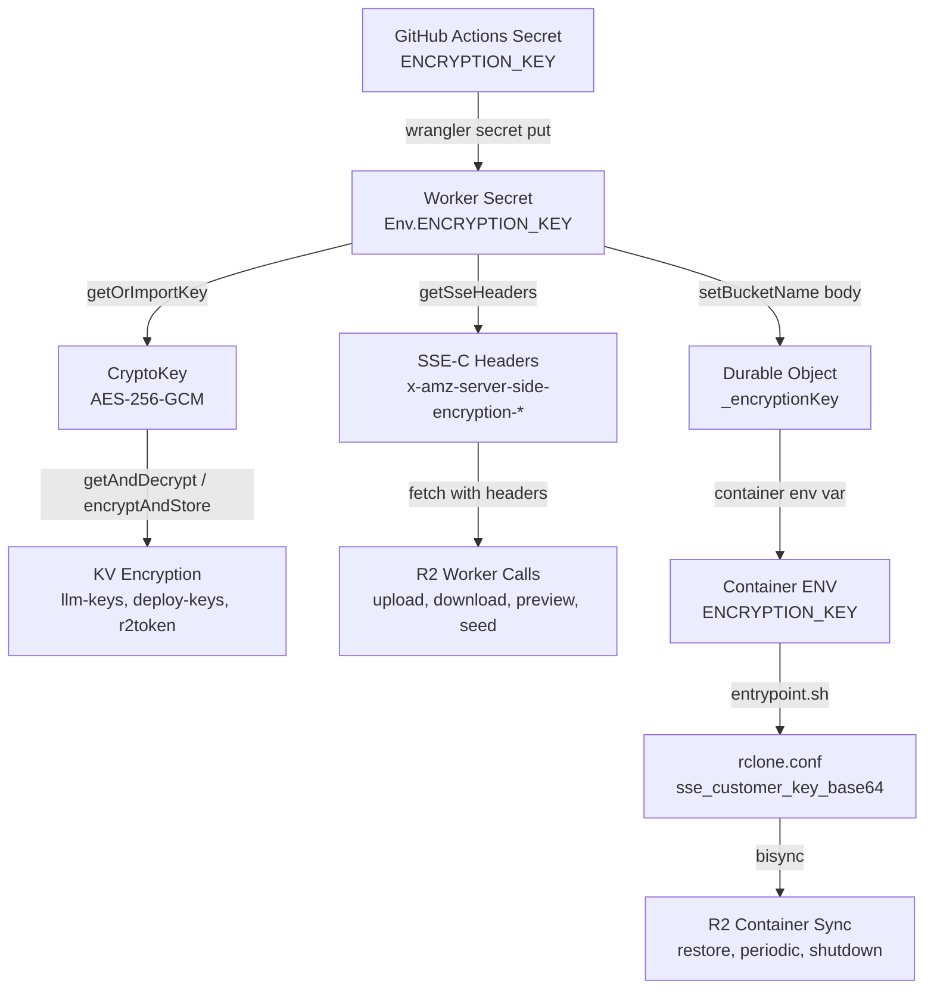

#### Backward compatibility

When `ENCRYPTION_KEY` is not set: KV values are stored and read as plaintext JSON (existing behavior). R2 operations proceed without SSE-C headers. No code paths change — `getOrImportKey()` returns `null`, `getSseHeaders()` returns `{}`, and all encryption wrappers fall through to direct KV/R2 calls.

## Rate Limiting

Per-user rate limiting via `createRateLimiter()` factory in `src/middleware/rate-limit.ts`. Keyed by `bucketName` (user identifier set by auth middleware), falls back to `CF-Connecting-IP` for unauthenticated requests.

**Storage:** Primary storage is Cloudflare KV with automatic TTL expiry (window duration + 60s buffer). When KV operations fail, falls back to an in-memory `Map` with periodic cleanup every 100 requests to prevent unbounded growth.

**Response Headers:** All rate-limited responses include:
- `X-RateLimit-Limit`: Maximum requests per window
- `X-RateLimit-Remaining`: Remaining requests in current window

When the limit is exceeded: HTTP 429 with `{ code: "RATE_LIMIT_ERROR", message: "Rate limit exceeded. Try again in N seconds." }`

**KV Key Pattern:** `{keyPrefix}:{userId}` — e.g., `storage-upload:codeflare-user-john-example-com`. Use `rl-` prefix when the key prefix would collide with application cache keys (e.g., `storage-stats` collides with the stats cache key `storage-stats:{bucketName}`, so the rate limiter uses `rl-storage-stats`).

**Rate limits per endpoint:**

| Endpoint | Method | Limit | Key Prefix |
|----------|--------|-------|-----------|
| `/api/storage/upload/*` | POST | 60/min | `storage-upload` |
| `/api/storage/delete` | POST | 20/min | `storage-delete` |
| `/api/storage/seed/*` | POST | 3/min | `storage-seed` |
| `/api/storage/download` | GET | 120/min | `storage-download` |
| `/api/storage/preview` | GET | 120/min | `storage-preview` |
| `/api/storage/browse` | GET | 30/min | `storage-browse` |
| `/api/storage/stats` | GET | 10/min | `rl-storage-stats` |
| `/api/sessions/:id` | DELETE | 10/min | `session-delete` |
| `/api/sessions/:id/stop` | POST | 10/min | `session-stop` |
| `/api/user/ensure-r2-token` | POST | 5/min | `ensure-r2-token` |
| `/api/sessions` | POST | 10/min | `session-create` |
| `/api/container/start` | POST | 5/min | `container-start` |
| `/api/users/:email` | DELETE | 20/min | `user-mutation` |
| `/api/setup/status` | GET | 30/min | `setup-status` |
| `/api/setup/detect-token` | GET | 10/min | `setup-detect-token` |
| `/api/setup/prefill` | GET | 10/min | `setup-prefill` |
| `/api/setup/configure` | POST | 5/min | `setup-configure` |
| `PATCH /api/preferences` | PATCH | 20/min | `preferences-patch` |
| `POST /api/auth/request-access` | POST | 3/hr | `request-access` |
| `POST /api/auth/subscribe` | POST | 3/min | `subscribe` |
| `POST /public/waitlist` | POST | 5/min | `waitlist-submit` |

**Adding a new rate limiter:**

```typescript
import { createRateLimiter } from '../../middleware/rate-limit';

const myRateLimiter = createRateLimiter({
  windowMs: 60_000,    // 1 minute window
  maxRequests: 10,     // max 10 requests per window
  keyPrefix: 'my-route', // KV key prefix (must not collide with app cache keys)
});

// Apply to all routes in a sub-app:
app.use('*', myRateLimiter);

// Or apply to a specific route inline:
app.post('/endpoint', myRateLimiter, async (c) => { ... });
```

**Stress Test Bypass:** When `STRESS_TEST_MODE` is set to `"active"`, all HTTP and WebSocket rate limits are bypassed. This is intended for integration environments only, to allow k6 stress tests with high virtual user counts (1000+) through a single service token identity. The bypass skips all KV rate-limit reads/writes for zero overhead. A one-time warning is logged per isolate when the bypass activates.

### Content-Disposition Hardening

File download responses use `Content-Disposition: attachment` with sanitized filenames. Special characters are stripped and filenames are truncated to prevent header injection.

### Input Validation (atob)

Base64-encoded inputs are validated with try/catch around `atob()`. Invalid base64 returns 400 immediately rather than propagating decode errors.

### WebSocket Rate Limit

30 connections per 60-second window per user (`WS_RATE_LIMIT_WINDOW_MS = 60000`, `WS_RATE_LIMIT_MAX_CONNECTIONS = 30`). Defined in `src/lib/constants.ts`.

### Session Limits

Per-user cap on concurrent running sessions, configurable by role via `MAX_SESSIONS_USER` (default: 3) and `MAX_SESSIONS_ADMIN` (default: 10) in `wrangler.toml`.

**Frontend-first enforcement:** The dashboard disables the start button when `isAtSessionLimit()` returns true (running + initializing sessions >= maxSessions). A popup explains the limit and which sessions to stop.

**Backend loose check:** `POST /api/container/start` counts KV sessions with `status === 'running'` under the user's prefix (excluding the current session to allow restarts). Returns 402 `QuotaExceededError` with the actual limit message if at or over the limit. This is a secondary guard -- the frontend prevents most limit violations before they reach the backend.

**`GET /api/sessions/batch-status`** returns `maxSessions` alongside `statuses` so the frontend stays in sync with the server-side limit without hardcoding defaults.

### Path Traversal Prevention

Browse endpoint validates prefix parameter against directory traversal (`..` rejection) and protected path access via `validateKey()` in `src/routes/storage/validation.ts`.

### Container Image Scanning

Trivy scans Docker images for HIGH/CRITICAL vulnerabilities before deployment (in `deploy.yml`).

### Protected R2 Paths

**`PROTECTED_PATHS` is now empty** (`[]` in `src/lib/constants.ts`). Previously, paths like `.claude/`, `.anthropic/`, `.ssh/`, `.config/`, `.claude.json` were blocked from the web storage API. The protection was removed — all R2 paths are now accessible via browse, upload, and delete. The `validateKey()` function in `src/routes/storage/validation.ts` still checks the array but it's a no-op with an empty list.

---

## API Reference

### Common Response Headers

| Header | Description |
|--------|-------------|
| `X-Request-ID` | Unique request identifier (UUID) |
| `X-RateLimit-Limit` | Max requests per window (rate-limited endpoints) |
| `X-RateLimit-Remaining` | Requests remaining (rate-limited endpoints) |

### Error Response Format

```json
{ "error": "User-friendly message", "code": "ERROR_CODE" }
```

Codes: `NOT_FOUND` (404), `VALIDATION_ERROR` (400), `CONTAINER_ERROR` (500), `AUTH_ERROR` (401), `FORBIDDEN` (403), `SETUP_ERROR` (400), `RATE_LIMIT_ERROR` (429), `QUOTA_EXCEEDED` (402), `CIRCUIT_BREAKER_OPEN` (503).

Note: `SETUP_ERROR` uses a different response shape: `{ success: false, steps, error, code }` instead of the standard `{ error, code }`.

### Session Management

| Method | Endpoint | Description |
|--------|----------|-------------|
| GET | `/api/sessions` | List sessions |
| POST | `/api/sessions` | Create session (rate limited) |
| GET | `/api/sessions/:id` | Get session |
| PATCH | `/api/sessions/:id` | Update session |
| DELETE | `/api/sessions/:id` | Delete session and destroy container |
| POST | `/api/sessions/:id/touch` | Update lastAccessedAt |
| POST | `/api/sessions/:id/stop` | Stop session (KV 'stopped' + container.destroy()) |
| GET | `/api/sessions/:id/status` | Get session and container status |
| GET | `/api/sessions/batch-status` | Batch status for all sessions (status, ptyActive, lastActiveAt, lastStartedAt, metrics, maxSessions, storageStats from KV cache, usage piggyback in SaaS mode) |

### Container Lifecycle

| Method | Endpoint | Description |
|--------|----------|-------------|
| POST | `/api/container/start` | Start container (non-blocking) |
| POST | `/api/container/destroy` | Destroy container (SIGKILL) |
| GET | `/api/container/startup-status` | Poll startup progress |
| GET | `/api/container/health` | Health check |

### Terminal

| Method | Endpoint | Description |
|--------|----------|-------------|
| WS | `/api/terminal/:compoundId/ws` | Terminal WebSocket (compoundId format: `sessionId-terminalId`) |
| GET | `/api/terminal/:sessionId/status` | Connection status |

### User Management

| Method | Endpoint | Description |
|--------|----------|-------------|
| GET | `/api/user` | Authenticated user info (includes `onboardingActive`, `onboardingComplete`) |
| POST | `/api/user/onboarding-complete` | Mark guided setup as visited (sets KV flag) |
| GET | `/api/user/r2-status` | R2 credential status for current user |
| POST | `/api/user/ensure-r2-token` | Create scoped R2 token if missing (rate limited) |
| GET | `/api/users` | List allowed users (admin only) |
| DELETE | `/api/users/:email` | Remove allowed user (admin only) |
| PATCH | `/api/users/:email` | Update user tier/role (admin only) |

### Auth (SaaS Mode)

| Method | Endpoint | Description |
|--------|----------|-------------|
| GET | `/api/auth/providers` | List configured IdPs (public, no auth) |
| GET | `/api/auth/status` | Auth status (tier, email, role, turnstile key, session/billing state) |
| GET | `/api/auth/tiers` | Subscribable tier configs (requires identity) |
| GET | `/api/auth/onboarding-config` | Onboarding page config (turnstile key) |
| POST | `/api/auth/subscribe` | Self-service tier selection (rate-limited 3/min) |
| POST | `/api/auth/request-access` | Request access with Turnstile (rate-limited 3/hr) |
| POST | `/api/auth/contact-team` | Enterprise tier inquiry email (rate-limited 1/hr) |

### Usage

| Method | Endpoint | Description |
|--------|----------|-------------|
| GET | `/api/usage` | Current user's real-time usage (Timekeeper DO with KV fallback) |

### Admin

| Method | Endpoint | Description |
|--------|----------|-------------|
| GET | `/api/admin/tiers` | Get current tier config (admin only) |
| PUT | `/api/admin/tiers` | Update tier config (admin only, 8-tier array) |
| PUT | `/api/users/max-users` | Set max users capacity cap (admin only) |

### Billing

| Method | Endpoint | Description |
|--------|----------|-------------|
| POST | `/api/billing/checkout` | Create Stripe Checkout Session for paid tier (rate-limited 5/min) |
| GET | `/api/billing/status` | Live billing state from Stripe (subscription, period, status) |
| POST | `/api/billing/portal` | Create Stripe Customer Portal session (rate-limited 5/min) |
| POST | `/api/billing/switch` | Deep-link portal for plan change confirmation (rate-limited 5/min) |
| POST | `/public/stripe/webhook` | Stripe webhook handler (unauthenticated, HMAC-verified, rate-limited 100/min) |

### Deploy Keys

| Method | Endpoint | Description |
|--------|----------|-------------|
| GET | `/api/deploy-keys` | Get encrypted deploy credentials (masked) |
| PUT | `/api/deploy-keys` | Save/update deploy credentials (GitHub PAT, CF API token) |
| DELETE | `/api/deploy-keys` | Erase all deploy credentials |

### Public (Unauthenticated)

| Method | Endpoint | Description |
|--------|----------|-------------|
| GET | `/public/auth/providers` | Auth providers (outside CF Access gate) |
| GET | `/public/onboarding-config` | Turnstile site key + onboarding status |
| GET | `/public/tiers` | Public tier config (no session mode info) |
| POST | `/public/waitlist` | Waitlist signup with Turnstile (rate-limited 1/day by IP) |

### Setup

The setup wizard configures a fresh Codeflare deployment. It provisions Cloudflare resources (R2 credentials, DNS records, Access applications) and stores the resulting configuration in Workers KV so the application can serve requests.

#### When Setup Runs

| Scenario | Auth requirement | Entry point |
|---|---|---|
| **First-time setup** (`setup:complete` not set in KV) | Public -- no authentication required | `POST /api/setup/configure` |
| **Reconfigure** (`setup:complete` is `"true"`) | Admin auth via Cloudflare Access | `POST /api/setup/configure` |

The conditional auth middleware in `src/routes/setup/index.ts` checks `KV.get('setup:complete')` on every request. When the value is `"true"`, the request must pass through `authMiddleware` and `requireAdmin` before reaching the configure handler.

#### Request Format

```
POST /api/setup/configure
Content-Type: application/json

{
  "customDomain":   "claude.example.com",
  "allowedUsers":   ["alice@example.com", "bob@example.com"],
  "adminUsers":     ["alice@example.com"],
  "allowedOrigins": [".example.com"]          // optional
}
```

Validation rules (enforced by Zod before streaming starts):

- `customDomain` -- non-empty string matching a valid domain pattern.
- `allowedUsers` -- non-empty array of valid email addresses.
- `adminUsers` -- non-empty array of valid emails; every admin must also appear in `allowedUsers`.
- `allowedOrigins` -- optional array of domain suffix patterns (each must start with `.`).

The Cloudflare API token is read from the `CLOUDFLARE_API_TOKEN` environment binding, not from the request body.

#### Configuration Steps

The configure endpoint runs steps sequentially, streaming progress over NDJSON.

**Step 1 -- `get_account`**

**Source:** `src/routes/setup/account.ts`

Calls `GET /accounts` on the Cloudflare API to retrieve the account ID associated with the API token. The first account in the response is used.

**Step 2 -- `derive_r2_credentials`**

**Source:** `src/routes/setup/credentials.ts`

Derives S3-compatible R2 credentials from the existing API token without needing extra permissions:

- **Access Key ID** = the token's own ID (from `GET /user/tokens/verify`).
- **Secret Access Key** = hex-encoded SHA-256 hash of the raw token value.

**Step 3 -- `set_secrets`**

**Source:** `src/routes/setup/secrets.ts`

Sets `R2_ACCESS_KEY_ID` and `R2_SECRET_ACCESS_KEY` as Worker secrets via `PUT /accounts/{id}/workers/scripts/{name}/secrets`.

If the API returns error code `10215` (latest version not deployed -- common after `wrangler versions upload`), the handler deploys the latest Worker version at 100% traffic and retries the secret write.

**Step 3a -- `cleanup_stale_users` (conditional)**

Runs only when reconfiguring and the new `allowedUsers` list has removed previously allowed users. Performs full cleanup of each stale user's KV entries and associated data.

**Step 4 -- `configure_custom_domain`**

**Source:** `src/routes/setup/custom-domain.ts`

1. **Zone resolution** -- looks up the Cloudflare zone ID by trying progressively shorter domain suffixes (supports ccTLDs like `.co.uk`).
2. **DNS upsert** -- creates or updates a proxied CNAME record pointing the custom domain to `{workerName}.{accountSubdomain}.workers.dev`.
3. **Worker route** -- creates the route pattern `{customDomain}/*` mapped to the worker script. Handles "already exists" errors by updating the existing route.

**Step 5 -- `create_access_app`**

**Source:** `src/routes/setup/access.ts`

1. Upserts two Cloudflare Access groups scoped to the worker name:
   - `{workerName}-admins` -- contains admin emails.
   - `{workerName}-users` -- contains non-admin allowed emails (created only when there are non-admin users).
2. Prunes legacy Access apps that used older domain patterns.
3. Creates or updates a self-hosted Access application protecting `/app/*` (primary), `/app`, `/api/*`, `/setup`, and `/setup/*` via the `destinations` field.
4. Upserts an "Allow users" policy referencing both groups.
5. Stores Access configuration in KV (audience tag, group IDs, auth domain).

**SaaS-specific behavior:**
- The Access app is configured with `allowed_idps` restricted to GitHub IdP only (if available).
- The policy uses `login_method` includes (any GitHub-authenticated user passes CF Access) instead of group includes.
- The user group is skipped entirely — Worker enforces per-user subscription tier authorization (8 tiers).
- Admin users created via allowedUsers have `subscriptionTier: 'unlimited'` set automatically.

**Step 6 -- `configure_turnstile` (conditional)**

**Source:** `src/routes/setup/turnstile.ts`

Runs only when the `ONBOARDING_LANDING_PAGE` env var is active OR SaaS mode is enabled. Creates or updates a Turnstile widget in `managed` mode for the custom domain (and the workers.dev hostname). Stores the site key and secret in KV.

**Step 7 -- `finalize`**

Writes final KV state and marks setup as complete.

#### NDJSON Stream Contract

The response uses content type `application/x-ndjson`. Each line is a self-contained JSON object terminated by `\n`.

**Progress messages**

```json
{"step":"get_account","status":"running"}
{"step":"get_account","status":"success"}
{"step":"derive_r2_credentials","status":"running"}
{"step":"derive_r2_credentials","status":"success"}
```

Status values for in-progress steps:

| Value | Meaning |
|---|---|
| `running` | Step has started |
| `success` | Step completed successfully |
| `error` | Step failed; includes an `error` field with the message |

**Completion message**

Every stream ends with exactly one completion object containing `done: true`.

**Success:**

```json
{
  "done": true,
  "success": true,
  "steps": [
    {"step":"get_account","status":"success"},
    {"step":"derive_r2_credentials","status":"success"},
    ...
  ],
  "workersDevUrl": "https://codeflare.account.workers.dev",
  "customDomainUrl": "https://claude.example.com"
}
```

**Failure:**

```json
{
  "done": true,
  "success": false,
  "steps": [
    {"step":"get_account","status":"success"},
    {"step":"derive_r2_credentials","status":"error","error":"Token verification failed"}
  ],
  "error": "Token verification failed"
}
```

**Detecting completion**

Read lines from the stream until you parse an object where `done === true`. Then check `success` to determine the outcome. The `steps` array provides the cumulative status of every step attempted, including which step failed and the error message.

**Detecting lock contention**

If another configure run is already in progress, the stream immediately emits:

```json
{"done":true,"success":false,"error":"Setup configuration is already in progress. Please wait and try again."}
```

No step progress messages are sent in this case.

#### Error Recovery

**Per-step retry**

Each Cloudflare API call is wrapped in `withSetupRetry` (exponential backoff, up to 3 total attempts with a 1 s base delay). `CircuitBreakerOpenError` is not retried because the circuit breaker is already open and retrying immediately would be wasteful.

**Step failure**

When any step throws, the error is caught by the top-level handler which:

1. Sends a completion message with `success: false` and the error details.
2. Releases the configure lock.
3. Closes the writable stream.

Partial progress from earlier successful steps remains in KV. Setup is **not** marked complete, so the next call to `/api/setup/configure` can retry from the beginning.

**Lock mechanism**

A KV-based lock prevents concurrent configure runs:

| Key | Value | TTL |
|---|---|---|
| `setup:configuring` | Unix timestamp (ms) as string | 300 s |

Before starting, the handler checks for an existing lock:

- If the lock exists and is less than 60 seconds old, the request is rejected immediately.
- If the lock exists but is older than 60 seconds, it is treated as stale and overridden (logged as a warning).
- The lock is deleted in the `finally` block regardless of success or failure.
- The KV TTL of 300 s acts as a safety net if the worker crashes before cleanup.

**How to retry**

The client can simply re-submit the same `POST /api/setup/configure` request. All steps are idempotent -- they create-or-update resources rather than assuming a clean slate. If a previous run partially completed, the retry will update existing resources and continue.

#### KV State Management

The following KV keys are written during setup. All keys use the `setup:` prefix.

| KV Key | Written by | Value |
|---|---|---|
| `setup:complete` | finalize | `"true"` |
| `setup:account_id` | finalize | Cloudflare account ID |
| `setup:r2_endpoint` | finalize | `https://{accountId}.r2.cloudflarestorage.com` |
| `setup:completed_at` | finalize | ISO 8601 timestamp |
| `setup:custom_domain` | post-step-5 | Lowercased custom domain |
| `setup:allowed_origins` | post-step-5 | JSON array of origin suffix patterns |
| `setup:onboarding_landing_page` | post-step-5 | `"active"` or `"inactive"` |
| `setup:configuring` | lock acquire | Unix timestamp (ms); deleted on completion |
| `setup:access_aud` | step 5 | Primary Access audience tag |
| `setup:access_aud_list` | step 5 | JSON array of audience tags |
| `setup:access_app_id` | step 5 | Access application ID |
| `setup:access_group_admin_id` | step 5 | Admin Access group ID |
| `setup:access_group_user_id` | step 5 | User Access group ID |
| `setup:access_group_admin_name` | step 5 | Admin group name (`{worker}-admins`) |
| `setup:access_group_user_name` | step 5 | User group name (`{worker}-users`) |
| `setup:auth_domain` | step 5 | Access organization auth domain |
| `setup:turnstile_site_key` | step 6 | Turnstile widget site key |
| `setup:turnstile_secret_key` | step 6 | Turnstile widget secret |
| `setup:idp_list` | step 5 | JSON array of IdP objects (id, type, name) |

User records are stored separately under the `user:{email}` key pattern with a JSON value containing `addedBy`, `addedAt`, `role` (`"admin"` or `"user"`), `subscriptionTier` (8 values), and legacy `accessTier`. Usage tracking data is stored at `timekeeper:{bucketName}`. Tier configuration is at `tiers:config`.

#### Authentication

**First-time setup**

When `setup:complete` is not set in KV, all setup endpoints are publicly accessible. This is necessary for bootstrapping -- no Access application exists yet to authenticate against.

**Subsequent reconfiguration**

Once `setup:complete` is `"true"`, the conditional auth middleware requires:

1. A valid Cloudflare Access JWT (verified by `authMiddleware`).
2. The authenticated user must have the `admin` role (enforced by `requireAdmin`).

This applies to `POST /api/setup/configure`, `GET /api/setup/detect-token`, and `GET /api/setup/prefill`. The `GET /api/setup/status` endpoint is always public.

#### Helper Endpoints

**`GET /api/setup/status`**

Always public. Returns whether setup is complete and the custom domain if configured.

```json
{"configured": true, "customDomain": "claude.example.com", "saasMode": false}
```

**`GET /api/setup/detect-token`**

Checks whether `CLOUDFLARE_API_TOKEN` is present in the environment, verifies it against the Cloudflare API, and returns account info.

```json
{"detected": true, "valid": true, "account": {"id": "abc123", "name": "My Account"}}
```

**`GET /api/setup/prefill`**

Best-effort prefill for the setup form. Reads existing admin and user lists from Cloudflare Access groups (scoped by worker name). Does not prefill the custom domain.

In SaaS mode, returns empty arrays — admin enters everything manually.

```json
{"adminUsers": ["alice@example.com"], "allowedUsers": ["bob@example.com"]}
```

#### Rate Limiting

| Endpoint | Window | Max requests | Key prefix |
|---|---|---|---|
| `/api/setup/configure` | 60 s | 5 | `setup-configure` |
| `/api/setup/status` | 60 s | 30 | `setup-status` |
| `/api/setup/detect-token` | 60 s | 10 | `setup-detect-token` |
| `/api/setup/prefill` | 60 s | 10 | `setup-prefill` |

Note: `/api/setup/detect-token` and `/api/setup/prefill` are also subject to the shared `setupRateLimiter` (5/min, key prefix `setup-configure`) applied as middleware. The effective limit is 5/min for these endpoints during the setup flow.

### Storage (R2 File Browser)

| Method | Endpoint | Description |
|--------|----------|-------------|
| GET | `/api/storage/browse` | List objects in R2 prefix |
| POST | `/api/storage/upload` | Upload file |
| GET | `/api/storage/download` | Download file |
| POST | `/api/storage/delete` | Delete objects by key and/or prefix (server-side bulk delete) |
| GET | `/api/storage/preview` | Preview file content (text files inline, others return metadata only) |
| GET | `/api/storage/stats` | File/folder counts (60s KV cache, refreshes from R2 on miss/stale) |
| POST | `/api/storage/seed/getting-started` | Seed tutorial docs |
| POST | `/api/storage/seed/agent-configs` | Recreate AI agent skills & rules (overwrites, respects session mode) |
| POST | `/api/storage/upload/initiate` | Initiate multipart upload |
| POST | `/api/storage/upload/part` | Upload a single part (base64 body) |
| POST | `/api/storage/upload/complete` | Complete multipart upload |
| POST | `/api/storage/upload/abort` | Abort multipart upload |

### Presets

GET `/api/presets`, POST `/api/presets`, PATCH `/api/presets/:id` (rename), DELETE `/api/presets/:id`

### Preferences

GET `/api/preferences`, PATCH `/api/preferences`

`UserPreferences` fields: `lastAgentType` (AgentType, optional — last selected agent), `lastPresetId` (string, optional — last used preset), `workspaceSyncEnabled` (boolean, default: `false` — workspace sync toggle, disabled by default), `fastStartEnabled` (boolean, default: `true` — fast CLI start toggle), `sessionMode` (SessionMode, optional — default/advanced), `sleepAfter` (SleepAfterOption, optional — auto-sleep duration, see [Auto-sleep](#auto-sleep-configurable-sleepafter)). The `fastStartEnabled` preference maps to `FAST_CLI_START` env var in the container DO -- see [Fast Start](#fast-start).

### LLM API Keys

GET `/api/llm-keys` — returns masked keys (`****` + last 4 chars), never full keys.
PUT `/api/llm-keys` — set or clear keys. Body: `{ openaiApiKey?: string | null, geminiApiKey?: string | null }`. `null` deletes the key, `undefined`/omitted = no change, string = set. Returns masked keys. When `ENCRYPTION_KEY` is set, values are encrypted with AES-256-GCM before KV storage.
DELETE `/api/llm-keys` — removes all LLM keys from KV.

Keys are stored in KV as `llm-keys:{bucketName}` and scoped per user (derived from auth). On container start, keys are read from KV and injected as `OPENAI_API_KEY` / `GEMINI_API_KEY` env vars. The `entrypoint.sh` detects these env vars and configures the `consult-llm-mcp` MCP server in `~/.claude.json`. The LLM Keys accordion in Settings is only visible when the user can use advanced mode (`canUseAdvanced()`) AND has selected advanced session mode (`currentSessionMode() === 'advanced'`). Admins always qualify for advanced mode but must still select it.

### Public (Onboarding)

GET `/public/onboarding-config`, POST `/public/waitlist` (rate limited)

### Health

GET `/health`, GET `/api/health`

---

## Environment Variables

### Worker Environment

| Variable | Purpose | Source |
|----------|---------|--------|
| `SERVICE_TOKEN_EMAIL` | Email for service token auth | Optional |
| `CLOUDFLARE_API_TOKEN` | R2 bucket creation | Wrangler secret |
| `R2_ACCESS_KEY_ID` | R2 auth for containers | Wrangler secret |
| `R2_SECRET_ACCESS_KEY` | R2 auth for containers | Wrangler secret |
| `R2_ACCOUNT_ID` | R2 endpoint construction | Dynamic (env with KV fallback) |
| `R2_ENDPOINT` | S3-compatible endpoint | Dynamic (env with KV fallback) |
| `ALLOWED_ORIGINS` | CORS patterns (comma-separated) | wrangler.toml |
| `LOG_LEVEL` | Min log level (default: "info") | wrangler.toml |
| `ONBOARDING_LANDING_PAGE` | `"active"` enables public waitlist landing | wrangler.toml |
| `TURNSTILE_SECRET_KEY` | Optional direct Turnstile secret override | Optional |
| `RESEND_API_KEY` | Notification emails (waitlist, access requests, subscriptions, tier changes) | Optional |
| `RESEND_EMAIL` | Sender identity for notification emails (default: `Codeflare <onboarding@resend.dev>`) | Optional |
| `CLOUDFLARE_WORKER_NAME` | Worker name override for forks (set at deploy time via `--var`, also used at runtime by worker code) | GitHub Actions variable / Worker runtime env |
| `MAX_SESSIONS_USER` | Per-user session cap (default: 3) | wrangler.toml |
| `MAX_SESSIONS_ADMIN` | Per-admin session cap (default: 10) | wrangler.toml |
| `MAX_USERS` | **Removed** — replaced by KV key `setup:max_users` (admin-configurable via User Management page). | — |
| `SERVICE_AUTH_SECRET` | Worker secret for E2E/CLI service auth (`X-Service-Auth` header) | Worker secret (optional) |
| `STRESS_TEST_MODE` | `"active"` disables all rate limits (integration only) | Worker env var |
| `SAAS_MODE` | `"active"` enables custom login page, auto-provisioning, admin approval | GitHub Actions variable → `--var` at deploy |
| `SAAS_EXTRA_IDPS` | Comma-separated IdP UUIDs for custom OIDC providers on login page | GitHub Actions variable → `--var` at deploy |
| `ENCRYPTION_KEY` | AES-256-GCM encryption key for `llm-keys:*`, `deploy-keys:*`, and `r2token:*` KV entries, also used as R2 SSE-C key | Wrangler secret (optional) |

### Container Environment

| Variable | Purpose | Source |
|----------|---------|--------|
| `R2_BUCKET_NAME` | User's personal bucket | Worker -> DO via `setBucketName` |
| `R2_ACCESS_KEY_ID` / `R2_SECRET_ACCESS_KEY` | rclone auth | Worker -> DO (preferred) or DO `this.env` fallback |
| `R2_ACCOUNT_ID` / `R2_ENDPOINT` | rclone endpoint | Worker -> DO or `getR2Config()` fallback |
| `AWS_ACCESS_KEY_ID` / `AWS_SECRET_ACCESS_KEY` | S3 compatibility | Mirrors R2 keys |
| `TERMINAL_PORT` | Always 8080 | Hardcoded |
| `SYNC_MODE` | Sync strategy (`none`, `full`, or `metadata`) | Worker -> DO |
| `WORKSPACE_SYNC_ENABLED` | Whether workspace sync is enabled (`'true'`/`'false'`) | Worker via `setBucketName` |
| `TAB_CONFIG` | JSON array of terminal tab configurations | Worker -> DO |
| `TERMINAL_ID` | Unique ID for this terminal instance | Host terminal server |
| `CONTAINER_AUTH_TOKEN` | Auth token for container API calls | Worker -> DO |
| `MANUAL_TAB` | Set to `1` for user-created tabs to skip autostart | Worker -> DO |
| `FAST_CLI_START` | Disables auto-update for all 5 AI tools when `'true'` (default) | Worker -> DO |
| `OPENAI_API_KEY` | OpenAI API key for consult-llm-mcp MCP server (optional) | Worker -> DO (from KV `llm-keys:{bucket}`) |
| `GEMINI_API_KEY` | Gemini API key for consult-llm-mcp MCP server (optional) | Worker -> DO (from KV `llm-keys:{bucket}`) |
| `ENCRYPTION_KEY` | AES-256 key (base64) for rclone SSE-C. Appended to `rclone.conf` as `sse_customer_key_base64`. | Worker -> DO (from `env.ENCRYPTION_KEY`) |
| `SESSION_MODE` | Session mode (`'default'` or `'advanced'`) — controls memory persistence and rclone filters | Worker -> DO via `setBucketName` |
| `NODE_COMPILE_CACHE` | V8 compile cache dir for faster Node.js CLI startup | Dockerfile ENV (`/root/.cache/node-compile-cache`) |
| `BROWSER` | Points to `open-url` shim that exits 1 | Dockerfile ENV (`/usr/local/bin/open-url`) |

---

## Configuration

### Secrets

Repository: `CLOUDFLARE_API_TOKEN`, `CLOUDFLARE_ACCOUNT_ID`, optional `RESEND_API_KEY`

Worker secrets lifecycle: deploy sets `CLOUDFLARE_API_TOKEN`, setup writes `R2_ACCESS_KEY_ID`/`R2_SECRET_ACCESS_KEY`, Turnstile keys stored in KV. **Worker-level R2 credentials are derived from the API token** (used for bucket admin operations like create/empty/delete). Per-user scoped R2 tokens are separate — created on first login, independent of the master token but revoked when the API token changes. If the token is rotated, setup must be re-run.

### CORS

Dynamic: setup wizard adds custom domain + `.workers.dev` to KV. `ALLOWED_ORIGINS` env var is static fallback.

`R2_ACCOUNT_ID` and `R2_ENDPOINT` resolved dynamically (env vars with KV fallback).

### Container Specs

| Tier | Config | Max Instances | Notes |
|------|--------|---------------|-------|
| `low` | `basic` (0.25 vCPU, 1 GiB, 4 GB) | 10 | Sub-1-vCPU workloads |
| default | 1 vCPU, 3 GiB, 6 GB | 10 | Baseline for node-pty + agent CLIs |
| `high` | 2 vCPU, 6 GiB, 8 GB | 10 | Higher parallelism |

Base image: Node.js 24 Debian (bookworm-slim).

### API Token Permissions

#### Account Permissions

| Permission | Access | Required | Why |
|-----------|--------|----------|-----|
| Account Settings | Read | Yes | Account ID discovery |
| Workers Scripts | Edit | Yes | Deploy worker + secrets |
| Workers KV Storage | Edit | Yes | KV namespace management |
| Workers R2 Storage | Edit | Yes | Per-user R2 buckets |
| Containers | Edit | Yes | Container lifecycle |
| Access: Apps and Policies | Edit | Yes | Managed Access app |
| Access: Organizations, Identity Providers, and Groups | Edit | Yes | Access groups + auth_domain |
| Turnstile | Edit | Only if onboarding active | Turnstile widget |
| API Tokens | Edit | Yes | Create/revoke per-user scoped R2 tokens |

#### Zone Permissions

| Permission | Access | Required | Why |
|-----------|--------|----------|-----|
| Zone | Read | Yes | Zone ID resolution |
| DNS | Edit | Yes | Proxied CNAME |
| Workers Routes | Edit | Yes | Worker route upsert |

---

## Container Image

**File:** `Dockerfile` - Base: `node:24-bookworm-slim`, multi-stage build (builder compiles native addons, runtime has no build tools).

### Installed Tools

| Category | Packages |
|----------|----------|
| Sync | rclone |
| Version Control | git, github-cli (gh), lazygit (v0.60.0) |
| Editors | vim (symlinked to neovim), neovim, nano |
| Network | curl, openssh-client |
| Process | procps (ps, pgrep) |
| Utilities | jq, ripgrep, fd, tree, htop, tmux, yazi (v26.1.22), fzf, zoxide, bat |

### Global NPM Packages

Non-CU packages install with `@latest` — each deploy pulls the newest versions (`.cache-bust` layer invalidation triggers fresh installs). CU is pinned to a git commit hash. The Dockerfile is the source of truth — versions listed below are approximate and may drift between deploys.

**Known trade-off:** Installing CLIs via `@latest` means each new container may run a different CLI version. Major version jumps (e.g., Copilot 0.0.418 → 1.0.12) between deploys have caused regressions (e.g., cursor rendering, xterm integration). Users in long-lived sessions will see the old version; new sessions after a deploy will see the new version. Monitor for unexpected behavior after deploys.

| Package | Version | Provides |
|---------|---------|----------|
| `claude-unleashed` | Git commit pin | `cu` / `claude-unleashed` commands (wraps `@anthropic-ai/claude-code`). Used as the "Claude Code" agent in the UI -- provides root permission bypass and controlled update mechanism. |
| `@openai/codex` | 0.105.0 | `codex` command |
| `@google/gemini-cli` | 0.30.0 | `gemini` command |
| `opencode-ai` | 1.2.15 | `opencode` command |
| `@github/copilot` | 0.0.418 | `copilot` command |

### V8 Compile Cache Warm-Up

Node.js CLIs (codex, gemini, copilot) are warmed at Docker build time by running `--version`, which triggers V8 to compile and cache bytecode via `NODE_COMPILE_CACHE`. This pre-populates the compile cache so that first-launch inside containers skips the JavaScript compilation overhead, resulting in faster startup times. Go binaries (like `opencode`) are already natively compiled and do not need V8 cache warm-up. Claude Code is pre-updated and pre-patched at build time via `claude-unleashed --silent --no-consent --help`, which seeds the V8 compile cache.

### OpenCode Database Pre-Initialization

OpenCode uses SQLite with Goose migrations that run on first startup ("Performing one time database migration"). The DB is stored at `~/.local/share/opencode/opencode.db` (XDG data directory). To avoid this overhead at container start, the Dockerfile runs `opencode run "hello"` at build time which triggers the migration, creating the sessions/files/messages schema so the first interactive launch is fast.

### Browser Shims

CLI tools (Claude Code, OpenCode, Gemini) try to open a browser for OAuth. The Dockerfile installs shims (`open-url` for `BROWSER` env var, `xdg-open-shim` for `xdg-open`) that exit 1, forcing CLIs to print auth URLs as plain text in the PTY. The xterm.js link provider then detects and makes these URLs clickable.

Port: 8080 (single port architecture).

---

## Container Startup

**File:** `entrypoint.sh`

Uses polling with safety timeouts: poll until success OR background process exits OR safety timeout expires. Exit immediately on success. Safety timeout `SYNC_TIMEOUT=120` (2 min) prevents infinite blocking.

### Parallel Startup

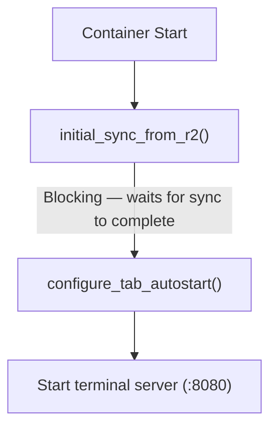

Auto-start uses `cu --silent --no-consent` for fast boot. Auto-updates are disabled by default via `FAST_CLI_START=true` (see [Fast Start](#fast-start) below). Users can enable auto-updates via Settings, or update manually via `cu` in any tab.

**PTY PATH:** The `.bashrc` tab autostart block sets `PATH="/usr/local/bin:/usr/bin:/bin:$PATH"` so that PTY sessions can find globally installed CLI tools.

### Fast Start

**User preference:** `fastStartEnabled` (default: `true`) in `UserPreferences`.
**Container env var:** `FAST_CLI_START` (default: `'true'`).

When enabled, `entrypoint.sh` disables auto-update checks for all 5 AI tools, eliminating 5-30s of startup delay per tool. Each tool has a different disable mechanism:

| Tool | Disable Mechanism | Type |
|------|------------------|------|
| Claude Code (claude-unleashed) | `CLAUDE_UNLEASHED_NO_UPDATE=1`, `CLAUDE_UNLEASHED_CHANNEL=stable` | Env var |
| OpenCode | `OPENCODE_DISABLE_AUTOUPDATE=1` | Env var |
| Copilot | `COPILOT_AUTO_UPDATE=false` | Env var |
| Gemini | `~/.gemini/settings.json` -> `general.enableAutoUpdate: false` | Config file (jq merge) |
| Codex | `~/.codex/version.json` -> `dismissed_version: "999.0.0"` | Config file (overwrite) |

**Gemini settings.json merge pattern:** Uses `jq '. * {"general":{"enableAutoUpdate":false,"enableAutoUpdateNotification":false}}'` to deep-merge into existing settings. This preserves user customizations since the file is synced via rclone from R2. If the file doesn't exist, creates it with only the auto-update keys.

**Codex dismissed_version hack:** Writes `{"dismissed_version":"999.0.0"}` to trick the Codex version checker into thinking a future version was already dismissed. The `~/.codex/` directory is excluded from rclone sync, so this file is safe to recreate on every container start.

When Fast Start is disabled (`FAST_CLI_START=false`), `entrypoint.sh` unsets the Dockerfile-level env vars (`CLAUDE_UNLEASHED_NO_UPDATE`, `CLAUDE_UNLEASHED_CHANNEL`, `DISABLE_INSTALLATION_CHECKS`) and the entrypoint-level `OPENCODE_DISABLE_AUTOUPDATE`, and skips writing config files and setting `COPILOT_AUTO_UPDATE`, allowing all tools to check for updates normally.

### Auto-sleep (Configurable sleepAfter)

**User preference:** `sleepAfter` (type: `SleepAfterOption`, optional) in `UserPreferences`. Allowed values: `5m`, `15m`, `30m`, `1h`, `2h`. Default when not set: `30m` (applied by container lifecycle route). **Free tier override:** backend forces `5m` regardless of stored preference; frontend locks dropdown and shows upgrade hint.

**Class default:** `override sleepAfter = '5m'` in `container/index.ts` — this is the SDK fallback if no preference is sent via `setBucketName`. Set to match the minimum user-configurable value. In practice, the lifecycle route always passes the user's preference (defaulting to `'30m'`).

**DO storage persistence:** `sleepAfter` is persisted to DO storage (`ctx.storage.put('sleepAfter', ...)`) on both initial set and restart paths. The constructor's `blockConcurrencyWhile` reloads it with regex validation, falling back to `'5m'` if absent or invalid. This ensures the user's configured idle timeout survives Cloudflare DO resets (infrastructure-level events that reinitialize the DO instance). Cleaned up in `destroy()` alongside other operational keys.

**Data flow:**
1. User selects auto-sleep duration in Settings > Session Defaults > Auto-sleep dropdown
2. `PATCH /api/preferences` saves `{ sleepAfter: '30m' }` to KV (`user-prefs:{bucketName}`)
3. On next session start, `POST /api/container/start` reads preferences from KV
4. `configureContainerDO()` → `buildSetBucketNameBody()` includes `sleepAfter` in the JSON body
5. Container DO receives it in `handleSetBucketName()`, validates against `/^(5m|15m|30m|1h|2h)$/`, sets `this.sleepAfter = sleepAfterPref`, and persists to DO storage
6. SDK uses the new `sleepAfter` value for its idle detection alarm
7. On restart (idempotent 409 path), `sleepAfter` is also updated from the latest preference and persisted to DO storage
8. On DO reset (cold start), constructor loads `sleepAfter` from DO storage before any `collectMetrics` alarm fires

**Access control:**
- **Admins** — always allowed to change their own `sleepAfter`
- **Paying users** (standard, advanced, max, unlimited) — allowed to change, default `30m`
- **Free users** — dropdown visible but disabled, locked to `5m`; hint text: "Fixed at 5 minutes on the Free plan. Upgrade for longer idle timeouts."
- **Non-subscribed users** — dropdown disabled; hint text: "Auto-sleep is managed by your administrator."
- Backend enforcement in `lifecycle.ts`: `effectiveTier === 'free' ? '5m' : (preferences.sleepAfter || '30m')` — free tier cannot bypass via API

**Settings UI:** Rendered in `SessionSection.tsx` as a `<select>` dropdown with 5 options. `SettingsPanel.tsx` fetches `hasSubscribed` from `/api/user` and computes `isFreeUser()` from `liveAccessTier()`. The `canChangeSleepAfter` accessor returns `(isAdmin() || userHasSubscribed()) && !isFreeUser()`. The `isFreeUser` prop is passed to `SessionSection` to show tier-specific hint text.

**`SleepAfterOption` type:** Defined in `src/types.ts` and `web-ui/src/types.ts`. The `SleepAfterOptions` array (`['5m', '15m', '30m', '1h', '2h']`) is also exported from `src/types.ts` for use in the zod validation schema.

**Sleep timer UI (`web-ui/src/lib/sleep-timer.ts`):** Frontend displays a countdown clock icon when a session's idle timeout is approaching. Computes `remainingMs = sleepAfterMs - (now - lastActiveAt)` from batch-status data. Only visible when < 10 min remaining. Orange pulse at < 10 min, red faster pulse at < 5 min. Hidden for stopped sessions or when `lastActiveAt` is null.

- **Session cards** (`SessionStatCard.tsx`): Clock icon (`mdiClockTimeEightOutline`) between status dot and menu trigger. Click shows inline tooltip with explanation text (same pattern as Workspace tooltip in `FileList.tsx`).
- **Header toolbar** (`Header.tsx`): Clock icon between avatar and bookmarks button. Click shows dropdown with countdown bucket + explanation text.
- **Data source:** `lastActiveAt` initialized to container start time by `onStart()`, then updated by `collectMetrics` every 60s when user input is detected (from `lastSeenInputAt` timestamp). This ensures the timer icon works from the moment the session starts, even before any user input. Read by `batch-status` endpoint and passed to frontend via 5s session list poll.

---

## Claude Code Integration

The "Claude Code" agent in Codeflare uses [claude-unleashed](https://github.com/nikolanovoselec/claude-unleashed) (`cu` command) behind the scenes. claude-unleashed enables `--dangerously-skip-permissions` when running as root inside containers (standard CLI prevents this via `process.getuid() === 0` check), and provides a controlled update mechanism.

**Updater:** claude-unleashed's updater checks npm for latest `@anthropic-ai/claude-code` - disabled at runtime via `CLAUDE_UNLEASHED_NO_UPDATE=1` to avoid ~25-30s startup delay from `npm view` + `npm install` on every container start. Updates happen at Docker build time instead (via `.cache-bust` layer invalidation). Upstream CLI's internal auto-updater is disabled via `DISABLE_INSTALLATION_CHECKS=1`.

### Container Environment Variables

**Global (Dockerfile ENV):** `NPM_CONFIG_UPDATE_NOTIFIER=false`, `CLAUDE_UNLEASHED_SKIP_CONSENT=1`, `CLAUDE_UNLEASHED_CHANNEL=stable`, `CLAUDE_UNLEASHED_NO_UPDATE=1`, `IS_SANDBOX=1`, `DISABLE_INSTALLATION_CHECKS=1`, `NODE_COMPILE_CACHE=/root/.cache/node-compile-cache`, `BROWSER=/usr/local/bin/open-url`

**Channel:** claude-unleashed uses `stable` dist-tag. Set via `CLAUDE_UNLEASHED_CHANNEL=stable` in the Dockerfile.

**Prewarm readiness:** Detected by first PTY output — as soon as the agent produces any terminal output, pre-warm is considered ready. This replaced the previous approach of agent-specific regex patterns and quiescence-based detection, which failed when agents weren't logged in (startup output was completely different, patterns didn't match, causing 20s timeout delays). The 20s hard timeout in `server.ts` remains as a safety net for the rare case where a PTY produces no output at all. `host/src/prewarm-config.ts` now only extracts the command name from `tabConfig` for logging.

**Auto-start flags (.bashrc):** `--silent`, `--no-consent`

---

## CI/CD (GitHub Actions)

Eight workflows covering deploy, testing, fuzzing, penetration testing, stress testing, and supply chain security. Additionally, GitHub's built-in **secret scanning** (with push protection) and **Dependabot security updates** are enabled at the repository level.

| Workflow | Trigger | What it does |
|----------|---------|-------------|
| `deploy.yml` | Push to `main` + `workflow_dispatch` (production/integration) | Full pipeline: tests, typecheck, Docker build, Trivy vulnerability scan, wrangler deploy, worker secrets |
| `test.yml` | PRs to `main` + `workflow_dispatch` | PR checks: lint (oxlint), tests, typecheck, build verification, dead code check (knip), `npm audit --omit=dev`, dependency review |
| `e2e.yml` | `workflow_dispatch` (integration/production) | E2E tests against deployed worker - sequential jobs with dependency chains: `setup` -> `e2e-api` -> `e2e-ui-desktop` -> `e2e-ui-mobile` |
| `codeql.yml` | Push to `main`, PRs to `main`, weekly (Monday 06:00 UTC) | CodeQL static analysis for JavaScript/TypeScript vulnerabilities, uploads SARIF to GitHub Security |
| `fuzz.yml` | PRs to `main`, weekly (Sunday 04:00 UTC) + `workflow_dispatch` | Property-based fuzzing with fast-check (50,000 iterations) |
| `scorecard.yml` | Push to `main`, weekly (Monday 06:00 UTC) + `workflow_dispatch` | OSSF Scorecard security posture assessment, publishes results and uploads SARIF |
| `pentest.yml` | Weekly (Monday 05:00 UTC) + `workflow_dispatch` | External black-box penetration testing: security headers, TLS, auth gate, info disclosure, injection attacks, HTTP methods |
| `stress-test.yml` | `workflow_dispatch` | k6 stress tests (API throughput, session lifecycle, storage operations, WebSocket concurrency) against integration worker. Configurable concurrency via `STRESS_TEST_CONCURRENCY` variable. |

### GitHub Environments

| Environment | Used by | Trigger |
|-------------|---------|---------|
| `production` | `deploy.yml`, `pentest.yml` | Auto on push to `main`, or manual dispatch with `production` selected |
| `integration` | `deploy.yml`, `e2e.yml`, `stress-test.yml` | Manual dispatch with `integration` selected |

### GitHub Secrets and Variables

**Secrets (repository-level):**

| Secret | Required | Used by | Purpose |
|--------|----------|---------|---------|
| `CLOUDFLARE_API_TOKEN` | Yes | `deploy.yml`, `e2e.yml` | Wrangler CLI auth, KV operations, container push, worker deploy, secret management |
| `CLOUDFLARE_ACCOUNT_ID` | Yes | `deploy.yml`, `e2e.yml` | Identifies the Cloudflare account for all API operations |
| `RESEND_API_KEY` | If onboarding or SaaS mode active | `deploy.yml` | Notification emails via Resend (waitlist submissions + access requests) |
| `CF_ACCESS_CLIENT_ID` | For E2E | `deploy.yml`, `e2e.yml` | CF Access service token ID for E2E auth |
| `CF_ACCESS_CLIENT_SECRET` | For E2E | `deploy.yml`, `e2e.yml` | CF Access service token secret; also used as `SERVICE_AUTH_SECRET` worker secret and KV seeding |

**Variables:**

| Variable | Default | Used by | Purpose | Default source |
|----------|---------|---------|---------|----------------|
| `CLOUDFLARE_WORKER_NAME` | `codeflare` | `deploy.yml`, `e2e.yml` | Worker name for deploy and E2E target resolution | Hardcoded fallback in workflow |
| `RUNNER` | `ubuntu-latest` | All workflows | GitHub Actions runner label (self-hosted support) | Hardcoded fallback in workflow |
| `E2E_BASE_URL` | - | `e2e.yml` | Base URL of deployed worker for E2E tests | Set per environment |
| `ONBOARDING_LANDING_PAGE` | `inactive` | `deploy.yml` | Enables public waitlist landing page via `--var` | Hardcoded fallback in workflow |
| `RESSOURCE_TIER` | unset (1 vCPU, 3 GiB, 6 GB) | `deploy.yml` | Container instance size (low/default/high/saas). All tiers default to 10 max instances | Defaults to `default` in deploy step |
| `MAX_INSTANCES` | unset (10) | `deploy.yml` | Override container max_instances. Must be a positive integer | Passed via env to avoid shell injection |
| `CLAUDE_UNLEASHED_CACHE_BUSTER` | `inactive` | `deploy.yml` | When `active`, writes `.cache-bust` to invalidate CU Docker layer | Not set by default |
| `MAX_SESSIONS_USER` | `3` | `deploy.yml` | Per-user session cap passed via `--var` | Omitted if unset (backend default applies) |
| `MAX_SESSIONS_ADMIN` | `10` | `deploy.yml` | Per-admin session cap passed via `--var` | Omitted if unset (backend default applies) |
| `PENTEST_TARGET` | - | `pentest.yml` | Base URL for penetration tests (e.g., `https://codeflare.graymatter.ch`) | Set per `production` environment |
| `STRESS_TEST_CONCURRENCY` | `0` (disabled) | `stress-test.yml` | k6 virtual user scaling factor. When >0, scales VU targets proportionally and loosens latency thresholds. | Set per `integration` environment |

### Deploy Workflow Detail

1. Install dependencies (cached via `actions/cache`)
2. Build frontend, run backend + frontend tests, typecheck both
3. Resolve/create KV namespace, patch `wrangler.toml` with KV ID
4. Apply worker name and container tier from `RESSOURCE_TIER` (low=basic 0.25vCPU/1GiB/4GB, default/saas=1vCPU/3GiB/6GB, high=2vCPU/6GiB/8GB). All tiers default to 10 max instances; `MAX_INSTANCES` variable overrides if set
5. Optionally generate `.cache-bust` for Claude Unleashed layer
6. Build Docker image locally
7. Scan with Trivy (HIGH/CRITICAL severity, `.trivyignore` for exceptions)
8. Push image to Cloudflare registry via `wrangler containers push`, extract registry URI
9. Patch `wrangler.toml` `image` field to registry URI (skips Docker rebuild on deploy)
10. Deploy with `npx wrangler deploy` passing `--var` for runtime config
11. Set worker secrets: `CLOUDFLARE_API_TOKEN`, optional `SERVICE_AUTH_SECRET` (E2E), optional `RESEND_API_KEY`
12. Seed E2E service user in KV allowlist when `CF_ACCESS_CLIENT_SECRET` is present

### Test Workflow Detail

Two parallel jobs:
- **test**: Lint (oxlint), build frontend, run backend + frontend tests, typecheck both, dead code check (knip), `npm audit --audit-level=high --omit=dev` for backend and frontend
- **dependency-review**: Runs `actions/dependency-review-action` on PRs - blocks merging if new dependencies introduce known vulnerabilities

### E2E Workflow Detail

Sequential jobs with dependency chains: `setup` -> `e2e-api` -> `e2e-ui-desktop` -> `e2e-ui-mobile`:
1. **setup** job: Sets `SERVICE_AUTH_SECRET` on target worker, seeds E2E service user in KV, smoke-tests auth with retry loop (handles KV eventual consistency ~60s)
2. **e2e-api** job (depends on `setup`): Runs API test suite
3. **e2e-ui-desktop** job (depends on `setup` + `e2e-api`): Runs UI desktop tests. Installs Chrome via `npx puppeteer browsers install chrome` + system shared libraries
4. **e2e-ui-mobile** job (depends on `setup` + `e2e-ui-desktop`): Runs UI mobile tests with `E2E_MOBILE=1`. Failed runs upload screenshots/HTML as artifacts (5-day retention)

### Pentest Workflow Detail

Six parallel jobs, each running lightweight external probes against the production deployment using only `curl` and `openssl` (no heavy scanning tools). All jobs use the `production` GitHub environment and read `PENTEST_TARGET` from environment variables.

1. **security-headers**: Verifies presence of HSTS, CSP, X-Frame-Options, X-Content-Type-Options, Referrer-Policy, Permissions-Policy. Confirms `X-Powered-By` is absent.
2. **tls**: Confirms TLS 1.3 works, TLS 1.0/1.1 are rejected, HSTS preload is enabled, and the certificate has at least 14 days before expiry.
3. **auth-gate**: Sends unauthenticated requests to seven API endpoints and confirms they all require CF Access (302/401/403). Tests that injecting `cf-access-authenticated-user-email` headers does not bypass authentication.
4. **info-disclosure**: Probes for sensitive files (`/.env`, `/.git/config`, `/api/debug`), checks that responses contain no secrets or stack traces.
5. **injection**: Tests host header injection (spoofed `Host` returns 403), `X-Forwarded-Host` has no effect on content, CL/TE request smuggling is rejected, and path traversal payloads (`%2e%2e`, double-encoded, backslash, unicode) are blocked at the auth layer.
6. **http-methods**: Verifies TRACE returns 405 and WebSocket upgrade without authentication returns 302.

**Requires:** `PENTEST_TARGET` variable set in the `production` GitHub environment (e.g., `https://codeflare.graymatter.ch`). See the full manual test report in [PENTEST.md](PENTEST.md).

---

## Testing

### Backend Tests

**Config:** `vitest.config.ts` with `@cloudflare/vitest-pool-workers` - tests run in real Workers runtime (not Node.js).
**Count:** 96 test files.
**Run:** `npm test`
**Coverage:** v8 provider, thresholds: 50% statement/function/line, 40% branch.
**Key patterns:** `vi.mock()` must be at module level BEFORE imports. Use `vi.hoisted()` for shared mutable state referenced by mock factories. `LOG_LEVEL: 'silent'` in miniflare bindings suppresses log noise.
**Notable test files:** `kv-crypto.test.ts` (KV AES-256-GCM encryption + migration), `r2-sse.test.ts` (R2 SSE-C encryption).

### Frontend Tests

**Config:** `web-ui/vitest.config.ts` with jsdom + `@solidjs/testing-library`.
**Count:** 78 test files.
**Run:** `cd web-ui && npm test`
**Key patterns:** SolidJS stores use getter-based exports. Test by re-importing module after `vi.resetModules()`. Use `render()` from `@solidjs/testing-library` for component tests.

### Host Tests

**Config:** `host/package.json` with Node.js built-in test runner (`node --test`).
**Count:** 15 test files, ~86 tests.
**Run:** `cd host && npm test`
**Scope:** PTY pre-warm readiness (first-output detection), activity tracker disconnect + input tracking, WebSocket input classification, server prewarm integration, entrypoint sync filter validation, server security, host module extraction, host fuzz tests, memory merge/cleanup, container memory tracking, entrypoint ECC validation, entrypoint hooks merge, metrics collection, session manager lifecycle.

### Property-Based Fuzz Tests

**Library:** [fast-check](https://github.com/dubzzz/fast-check). **CI:** `fuzz.yml` runs 50,000 iterations on PRs to main, weekly, and manual dispatch.
**Local:** Default 1,000 iterations. Override with `FAST_CHECK_NUM_RUNS=50000`.

| Suite | File | Tests | What it covers |
|-------|------|-------|----------------|
| Backend | `src/__tests__/fuzz/input-validation.fuzz.test.ts` | 123 | XML injection/parsing, getBucketName, validateKey (path traversal, null bytes, encoding tricks), KV namespacing, ReDoS, circuit breaker state machine, error types, logger, content-type helpers |
| Frontend | `web-ui/src/__tests__/fuzz/frontend-fuzz.test.ts` | 13 | md5 (custom impl), isActionableUrl (ReDoS resistance), cleanupMapByPrefix (Map iteration+deletion) |
| Host | `host/__tests__/fuzz-host.test.js` | 9 | getPrewarmConfig (untrusted tab config), createActivityTracker (idle shutdown state machine) |

**Test selection criteria:** Every test must exercise real production code (no replicas) on an untrusted input boundary (user input, API responses, WebSocket data, env vars). Tests that verify framework guarantees (Zod safeParse), language features (class inheritance), or trivial formatters are excluded.

**Bugs found by fuzzing:**
- `getBucketName` trailing hyphen for long worker names (`src/lib/access.ts`)
- Null byte bypass in `validateKey` (`src/routes/storage/validation.ts`)
- `prewarm-config.ts` crash on non-string tab command (`host/src/prewarm-config.ts`)
- `toError`/`toErrorMessage` crash on objects with throwing `toString()` (`src/lib/error-types.ts`)

### Vitest Version Split

Both root and `web-ui/` use Vitest v3.x. Vitest 4.x is incompatible with `@cloudflare/vitest-pool-workers` (the constraint comes from the Workers runtime integration). Each has independent `node_modules` and separate configs. Do not attempt to upgrade to v4 - the version constraint is real.

### E2E API Tests

**Dir:** `e2e/api/` - 12 test files, ~55 tests.
**Run:** `E2E_BASE_URL=https://your-app.example.com npm run test:e2e:api`
**Pattern:** Plain `fetch` via `apiRequest()` helper from `e2e/setup.ts`. No Puppeteer. Authenticates via `X-Service-Auth` header matching `SERVICE_AUTH_SECRET` worker secret.

Test files: `sessions`, `storage`, `storage-operations`, `user`, `preferences`, `presets`, `setup-status`, `health`, `container`, `container-lifecycle`, `error-responses`, `rate-limiting`.

### E2E UI Tests

**Dir:** `e2e/ui/` - 10 test files, ~75 tests (run as desktop + mobile).
**Run:** `E2E_BASE_URL=https://your-app.example.com npm run test:e2e:ui`
**Mobile:** `E2E_MOBILE=1 E2E_BASE_URL=... npm run test:e2e:ui`
**Pattern:** Puppeteer + Vitest. Each suite creates a fresh page. Desktop viewport: 1280x720. Mobile viewport: 390x844 (iPhone-like).

Test files: `dashboard`, `session-lifecycle`, `header-navigation`, `settings-panel`, `storage`, `terminal-tabs`, `tiling`, `bookmarks`, `error-states`, `mobile-specific`.

### E2E Infrastructure

- **CF Access auth:** E2E API tests use `X-Service-Auth` header. UI tests use `CF-Access-Client-Id`/`CF-Access-Client-Secret` headers via `setExtraHTTPHeaders`. CF Access intercepts browser navigation with login page - UI tests work around this by intercepting requests.
- **KV eventual consistency:** New KV entries take ~60s to propagate. E2E setup job includes retry loops with 15s waits. Test helpers use `waitForFunction` with generous timeouts.
- **CSS disable:** UI tests inject a `<style>` element via `evaluateOnNewDocument` that sets `transition: none !important; animation: none !important; scroll-behavior: auto !important` on all elements (`*, *::before, *::after`), disabling CSS transitions and animations for reliable element positioning in headless Chrome.
- **Screenshot artifacts:** Failed UI tests capture screenshots and HTML dumps to `e2e-artifacts/`. CI uploads these as artifacts with 5-day retention.
- **Suite prefix isolation:** Each E2E suite prefixes its test sessions/presets with a unique identifier driven by the `E2E_SUITE` env var (default: `'default'`) to avoid cross-suite interference when running in parallel.

### E2E Service Token Setup

Step-by-step for running E2E tests against a deployed worker:

1. Create a CF Access service token in Cloudflare dashboard (Access > Service Tokens)
2. Set `CF_ACCESS_CLIENT_ID` and `CF_ACCESS_CLIENT_SECRET` as GitHub repository secrets (under `integration` environment for E2E)
3. Deploy the worker (sets `SERVICE_AUTH_SECRET` automatically from `CF_ACCESS_CLIENT_SECRET`)
4. The deploy workflow seeds `e2e-service@codeflare.local` as admin in KV allowlist
5. Run E2E via `Actions > E2E Tests > Run workflow`

For local E2E development:
```bash
export CF_ACCESS_CLIENT_ID="<your-service-token-id>"
export CF_ACCESS_CLIENT_SECRET="<your-service-token-secret>"
export E2E_BASE_URL="https://your-app.example.com"
npm run test:e2e        # All E2E tests
npm run test:e2e:api    # API tests only
npm run test:e2e:ui     # UI desktop tests only
E2E_MOBILE=1 npm run test:e2e:ui  # UI mobile tests only
```

### E2E Test Maintenance

**Rule:** When modifying UI components or API routes, review and update corresponding E2E tests.

- **Source -> test mapping:** Each source module has a corresponding E2E test file. Key mappings: `src/routes/session/` -> `e2e/api/sessions.test.ts`, `src/routes/storage/` -> `e2e/api/storage.test.ts`, `src/routes/setup/` -> `e2e/api/setup-status.test.ts`, `web-ui/.../Dashboard.tsx` -> `e2e/ui/dashboard.test.ts`. Run `grep -r 'data-testid' e2e/` to find all referenced test IDs.
- **`data-testid` verification:** Every `data-testid` referenced in E2E tests must exist in the web-ui source. Grep to verify before committing.
- **Cleanup:** `afterAll` hooks handle test cleanup. If tests fail mid-run, manually restore: `npx wrangler kv key put "setup:complete" "true" --namespace-id <id> --remote`

---

## Development

```bash
npm install && cd web-ui && npm install && cd ..
npm run dev          # Run locally (requires Docker)
npm run lint         # Lint backend (oxlint)
npm run lint:fix     # Lint backend with auto-fix
npm run typecheck    # Type check backend
npm test             # Backend unit tests
npm run test:e2e     # E2E API tests
npm run test:e2e:ui  # E2E UI tests (Puppeteer)
npm run deploy       # DO NOT run locally -- deploys go through GitHub Actions (see CI/CD)
cd web-ui && npm run dev   # Frontend dev server
cd web-ui && npm run build # Frontend production build
```

---

## File Structure

```
codeflare/
├── src/
│   ├── index.ts              # Hono router, WebSocket intercept, CORS
│   ├── types.ts              # TypeScript types
│   ├── routes/
│   │   ├── container/        # Container lifecycle API
│   │   │   ├── index.ts      # Route aggregator
│   │   │   ├── lifecycle.ts  # Start/destroy
│   │   │   ├── status.ts     # Health, startup-status
│   │   │   └── shared.ts     # Shared helpers
│   │   ├── session/          # Session API
│   │   │   ├── index.ts      # Route aggregator
│   │   │   ├── crud.ts       # CRUD operations
│   │   │   └── lifecycle.ts  # Start/stop/status/batch-status
│   │   ├── setup/            # Setup wizard
│   │   │   ├── index.ts      # Route aggregator
│   │   │   ├── handlers.ts   # Main configure handler
│   │   │   ├── secrets.ts    # Secret management
│   │   │   ├── custom-domain.ts # Domain configuration
│   │   │   ├── access.ts     # CF Access setup
│   │   │   ├── account.ts    # Account discovery
│   │   │   ├── credentials.ts # R2 credential setup
│   │   │   ├── turnstile.ts  # Turnstile widget setup
│   │   │   └── shared.ts     # Shared helpers
│   │   ├── storage/          # R2 file browser API
│   │   │   ├── index.ts      # Route aggregator
│   │   │   ├── browse.ts     # List objects
│   │   │   ├── delete.ts     # Delete objects
│   │   │   ├── download.ts   # Download files
│   │   │   ├── preview.ts    # Preview content
│   │   │   ├── seed.ts       # Seed tutorial docs
│   │   │   ├── stats.ts      # File/folder counts
│   │   │   ├── upload.ts     # Upload (single + multipart)
│   │   │   └── validation.ts # Path validation
│   │   ├── admin/
│   │   │   └── tiers.ts      # Admin tier management (GET/PUT /api/admin/tiers)
│   │   ├── public/
│   │   │   └── index.ts      # Onboarding endpoints + public tiers
│   │   ├── auth.ts           # Auth routes (status, subscribe, request-access, contact-team)
│   │   ├── auth-redirects.ts # Login/logout redirects (CF Access)
│   │   ├── github-auth.ts    # GitHub OAuth flow (SaaS mode)
│   │   ├── billing.ts        # Stripe billing (checkout, portal, switch, status)
│   │   ├── stripe-webhook.ts # Stripe webhook handler (HMAC-verified)
│   │   ├── deploy-keys.ts    # Deploy credential CRUD (GitHub PAT, CF API token)
│   │   ├── llm-keys.ts       # LLM API key CRUD (OpenAI, Gemini)
│   │   ├── usage.ts          # Usage API (real-time via Timekeeper DO, KV fallback)
│   │   ├── presets.ts        # Preset CRUD
│   │   ├── preferences.ts    # User preferences
│   │   ├── terminal.ts       # Terminal WebSocket proxy
│   │   ├── user-profile.ts   # User info
│   │   └── users.ts          # User management
│   ├── timekeeper/index.ts    # Timekeeper DO class (per-user usage tracking)
│   ├── middleware/            # auth.ts, rate-limit.ts
│   ├── lib/                  # access, access-policy, access-tier, activity-policy, agent-config,
│   │                         # agent-seed.generated, cache-reset, cf-api,
│   │                         # circuit-breaker, circuit-breakers (per-container CB via
│   │                         #   getContainerXxxCB(containerId) — no more global singletons),
│   │                         # constants, container-helpers,
│   │                         # container-config-schema, cors-cache, email, error-types,
│   │                         # jwt, kv-crypto, kv-keys, logger, onboarding,
│   │                         # r2-admin, r2-client, r2-config, r2-seed, r2-sse,
│   │                         # rate-limit-core, request-helpers, schemas,
│   │                         # session-helpers, session-jwt, session-mode,
│   │                         # stripe, subscription, tutorial-seed.generated,
│   │                         # turnstile, type-guards, user-cleanup, user-record, xml-utils
│   │                         #   escapeXml() — sanitizes user input for XML/HTML interpolation
│   │                         #   decodeXmlEntities() — decodes &amp; &lt; etc. from R2 S3 API responses
│   │                         #   FIX-39 audit trail in file header tracks all interpolation sites
│   ├── container/            # index.ts (Container DO), container-env.ts (env var construction), container-metrics.ts (metrics/idle/Timekeeper)
│   └── __tests__/            # Backend unit tests (96 files)
├── e2e/                      # E2E tests: 12 API files (~55 tests) + 10 UI files (~75 tests, Puppeteer)
├── host/                        # TypeScript (migrated from JS)
│   ├── src/
│   │   ├── server.ts         # HTTP/WS server, auth, routing, prewarm, signal handlers
│   │   ├── session.ts        # Session class — PTY management, tab lifecycle
│   │   ├── session-manager.ts # SessionManager class, PREWARM_SESSION_ID constant
│   │   ├── metrics.ts        # System metrics collection (disk usage, sync status)
│   │   ├── activity-tracker.ts # WS connection + user input tracking for idle detection (input-change based)
│   │   ├── prewarm-config.ts # PTY pre-warm configuration (first-output readiness)
│   │   └── types.ts          # Shared TypeScript types
│   ├── __tests__/            # Host unit tests (15 files: prewarm, activity tracker, WS input, session manager, container memory, metrics, server prewarm, server security, host fixes, fuzz, entrypoint sync/ECC/hooks, memory capture hook)
│   ├── tsconfig.json         # TypeScript configuration
│   ├── knip.json             # Dead code detection config for host package
│   └── package.json
├── web-ui/
│   └── src/
│       ├── components/       # SolidJS components (Terminal, Layout, SessionCard, StorageBrowser,
│       │                     #   SubscribePage, UsagePage, Header, SettingsPanel, LoginPage,
│       │                     #   admin/SubscriptionManagement, settings/SessionSection, etc.)
│       ├── stores/           # terminal.ts, terminal-layout.ts, terminal-url-detection.ts, session.ts, storage.ts, setup.ts, tiling.ts, session-presets.ts, session-tabs.ts, preferences.ts, r2-readiness.ts
│       ├── api/              # client.ts, fetch-helper.ts, storage.ts
│       ├── hooks/            # useTerminal.ts, useStageTimings.ts
│       ├── lib/              # constants, schemas, terminal-config, terminal-link-provider, xterm-internals, settings, format, mobile, sleep-timer, + others
│       ├── styles/           # CSS (design tokens, animations, component styles)
│       └── __tests__/        # Frontend unit tests (78 files)
├── .oxlintrc.json            # oxlint configuration (root + web-ui)
├── scripts/                  # generate-tutorial-seed.mjs, generate-agent-seed.mjs, fix-broken-sourcemaps.js
├── tutorials/                # Tutorial content (Getting Started, Examples, etc.)
├── Dockerfile                # Multi-stage container image
├── entrypoint.sh             # Container startup script
├── wrangler.toml             # Cloudflare configuration
├── vitest.config.ts          # Backend test config
└── vitest.e2e.config.ts      # E2E test config
```

### Intentional Schema Duplication (Bundle Boundary)

`src/lib/schemas.ts` (backend) and `web-ui/src/lib/schemas.ts` (frontend) contain similar Zod schemas for API response validation. This is intentional, not a DRY violation. The frontend (`web-ui/`) has its own Vite build pipeline and produces a separate bundle — it cannot import from the backend Workers module. Both schemas validate the same API contract but live in independent build targets.

### Critical Paths Inside Container

| Path | Purpose |
|------|---------|
| `/home/user` | User home directory |
| `/home/user/workspace` | Working directory (synced to R2) |
| `/home/user/.claude/` | Claude config and credentials |
| `/home/user/.config/rclone/rclone.conf` | rclone configuration |
| `/tmp/sync-status.json` | Sync status (read by health server) |
| `/tmp/sync.log` | Sync log for debugging |

---

## Troubleshooting

### `/api/*` Returns HTML (SPA Swallow)

API endpoints return HTML instead of JSON. Fix: ensure `run_worker_first = ["/", "/auth/*", "/api/*", "/public/*", "/health"]` in `[assets]` section of `wrangler.toml`.

### `/setup` Shows "Access Denied"

Check `GET /api/setup/status` returns JSON. Verify `setup:complete` in KV is absent/false for first-time setup.

### Auth Error After Successful Access Login

Stale `setup:auth_domain` (JWT mismatch), stale `setup:access_aud`, or email casing mismatch. Re-run setup configure. Confirm user keys are lowercase.

### "Unable to find your Access application!"

Browser retained stale Access session. Test in incognito. Clear CF Access cookies. Confirm one managed app with correct destinations.

### Container Stuck at "Waiting for Services"

Terminal server not starting (sync blocking). Check: `GET /api/container/startup-status?sessionId=xxx` (inspect `details.syncError` field). Common causes: missing R2 credentials, bucket doesn't exist, network timeout.

### R2 Sync Issues

- **Bisync empty listing**: Initial `establish_bisync_baseline()` uses `--resync` to create the baseline, handles this case. The periodic daemon never uses `--resync` (see [Architecture Decisions](#architecture-decisions)).
- **Transfers 0 files**: Filter order indeterminacy from mixed `--include`/`--exclude`. Use `--filter` flags instead.
- **Slow sync**: Switch to `SYNC_MODE=metadata` or manually clean large repos from R2.
- **Missing secrets**: Check `startup-status` response `details.syncError` for the missing variable.

### Zombie Container

Zombie alarm loops are now prevented by two mechanisms: (1) `onStop()` calls `deleteSchedules('collectMetrics')` to immediately kill the alarm loop when a container stops, and (2) `onActivityExpired()` calls `this.stop('SIGTERM')` on unreachable activity endpoints instead of renewing the timeout, which triggers `onStop()` and its schedule cleanup. As a defense-in-depth fallback, `collectMetrics` itself still has three self-termination guards: container-not-running check, missing-identifiers guard, and re-arm guard. These cover edge cases where `onStop()` might not fire (e.g., after `destroy()`).

### Secrets Lost After Worker Deletion

`wrangler delete` nukes all secrets. Re-set with `wrangler secret put`.

### R2 Bucket Cleanup on User Deletion

`DELETE /api/users/:email` and `POST /configure` (stale user removal during reconfiguration) both call `cleanupUserData()` in `src/lib/user-cleanup.ts`, which: destroys all active containers, deletes the user KV entry and bucket-keyed KV entries (`storage-stats:`, `presets:`, `user-prefs:`), reads the scoped R2 token via `getAndDecrypt()` (required because `r2token:{email}` values are encrypted when `ENCRYPTION_KEY` is set — raw `KV.get('json')` throws `SyntaxError` on the `v1:...` ciphertext prefix), deletes the scoped R2 token, empties the R2 bucket via S3 `ListObjectsV2` + `DeleteObjects` loop (using worker-level R2 credentials via `createR2Client` + `emptyR2Bucket`), and deletes the empty bucket via Cloudflare API with retry logic (up to 3 attempts with exponential backoff for R2 eventual consistency when objects were deleted).

If worker-level R2 credentials are not configured (e.g., setup was interrupted), the emptying step is skipped and bucket deletion may fail with `BucketNotEmpty`. This logs `logger.warn` server-side but does not block the overall cleanup. During reconfiguration, stale user cleanup is wrapped in a `runStep('cleanup_stale_users')` call for NDJSON progress visibility in the setup wizard frontend. **SaaS mode:** only admin-role users removed from the admin list are cleaned up — JIT-provisioned regular users are preserved. Each user's KV entry is checked for `role: 'admin'` before qualifying for removal.

### Chrome in CI (Ubuntu 22.04)

`apt install chromium-browser` on Ubuntu 22.04 installs a snap wrapper, NOT real Chromium. Without snapd (which GitHub Actions runners don't have), it installs with exit 0 but provides nothing usable.

**Solution:** Install Chrome via Puppeteer, then install shared libraries individually:
```bash
npx puppeteer browsers install chrome
sudo apt-get install -yqq --no-install-recommends \
  libnss3 libnspr4 libatk1.0-0 libatk-bridge2.0-0 libcups2 \
  libdrm2 libxkbcommon0 libxcomposite1 libxdamage1 libxrandr2 \
  libgbm1 libpango-1.0-0 libcairo2 libasound2 libxshmfence1 \
  libxfixes3 libx11-xcb1 libxext6 libxi6 libxtst6 libxcursor1 \
  fonts-liberation
```

**Note:** Package names differ between Ubuntu versions - 22.04 uses `libatk1.0-0`, 24.04 uses `libatk1.0-0t64`.

### Common Failure Modes

| Symptom | Cause | Fix |
|---------|-------|-----|
| Container won't start | Missing R2 credentials | `wrangler secret list` then `wrangler secret put` |
| `403 Forbidden` on R2 | Expired credentials | Regenerate in CF dashboard |
| Container stuck "starting" | Port 8080 not responding | Check sync log |
| WebSocket fails | Container not running | Verify startup-status |
| Zombie restarts | Stale DO state | Self-terminates via missing-identifiers guard |
| Deleted session reappears | `onStop()` resurrects KV entry | Verify `destroy()` clears `SESSION_ID_KEY` before `super.destroy()` |
| Container dies during active use | Auth issue on internal paths | Verify `/activity` in `authExemptPaths` in `host/src/server.ts` |
| Phantom container on session switch | Reconnect scope issue | Ensure `activeSessionId` filter passed to `reconnectDisconnectedTerminals()` |
| Character doubling in terminal | Handler not disposed on reconnect | Dispose `inputDisposable` before creating new handler in `connect()` |
| Container returns 503 on all authenticated endpoints | `CONTAINER_AUTH_TOKEN` not set | Security default-deny. Token is set automatically by the DO via `crypto.randomUUID()` on lifecycle start. If missing, verify DO `updateEnvVars()` runs before `startAndWaitForPorts()` |

### Diagnostic Commands

**Check container status:**
```bash
curl -H "CF-Access-Client-Id: <id>" -H "CF-Access-Client-Secret: <secret>" \
  https://codeflare.example.com/api/container/startup-status?sessionId=abc12345
```

**Verify secrets:**
```bash
wrangler secret list
# Expected: CLOUDFLARE_API_TOKEN, R2_ACCESS_KEY_ID, R2_SECRET_ACCESS_KEY
```

**Monitor logs:**
```bash
wrangler tail codeflare
wrangler tail codeflare --status error
```

---

## Cost Analysis

### Per-Container Pricing

Parameters: 8h/day, 20 days/month = 160h = 576,000s active. Default tier (1 vCPU, 3 GiB, 6 GB). CPU usage: 20% average.

| Resource | Calculation | Free Tier | Billable | Rate | Cost |
|----------|-------------|-----------|----------|------|------|
| CPU (active usage) | 0.2 vCPU x 576,000s = 115,200 vCPU-s | 22,500 vCPU-s | 92,700 vCPU-s | $0.000020/vCPU-s | $1.85 |
| Memory (provisioned) | 3 GiB x 576,000s = 1,728,000 GiB-s | 90,000 GiB-s | 1,638,000 GiB-s | $0.0000025/GiB-s | $4.10 |
| Disk (provisioned) | 6 GB x 576,000s = 3,456,000 GB-s | 720,000 GB-s | 2,736,000 GB-s | $0.00000007/GB-s | $0.19 |
| Workers Paid plan | | | | | $5.00 |
| **Total** | | | | | **~$11.14/user/month** |

Notes:
- CPU billed on active usage only. Memory + disk billed on provisioned resources.
- Hibernated containers (after 30m idle) = zero cost
- R2: First 10 GB free, $0.015/GB/month after
- Pricing: [Cloudflare Containers Pricing](https://developers.cloudflare.com/containers/pricing/)

Cost scales per ACTIVE SESSION (each session = one container; a session has up to 6 terminal tabs sharing a single container). Idle containers hibernate after `sleepAfter` (default 30m, configurable 5m–2h) of no user input. Hibernated containers = zero cost.

---

## Architecture Decisions

| ID | Decision | Details |
|----|----------|---------|
| AD1 | One container per session | <details><summary>CPU isolation - each tab gets full 1 vCPU instead of sharing</summary><br>Alternative was one container per user with multiplexed PTYs. Per-session containers avoid noisy-neighbor CPU contention between tabs running different agents, and simplify cleanup (destroy container = clean slate).</details> |
| AD2 | Container ID format | <details><summary><code>{bucketName}-{sessionId}</code></summary><br>Example: `codeflare-user-example-com-abc12345`. Deterministic from user email + session ID. Enables DO lookup without KV round-trip. `getContainerId()` must NEVER fallback on invalid sessionId - that was root cause of orphaned containers.</details> |
| AD3 | Per-user R2 buckets | <details><summary>Bucket name derived from email, auto-created on first login</summary><br>Isolation boundary: each user's files live in their own bucket. Simplifies deletion (empty + delete bucket). Bucket name sanitized from email (max 63 chars, S3-compatible). Per-user scoped R2 tokens (AD13) further restrict access.</details> |
| AD4 | Periodic rclone bisync | <details><summary>Background daemon every 60s + final sync on shutdown</summary><br>Local disk for all file operations (fast I/O). Bisync daemon runs in background, syncing changes bidirectionally. SIGINT/SIGTERM trap runs final bisync before exit. Alternative (s3fs FUSE) was fragile and slow - see Lessons Learned #1.</details> |
| AD5 | Login shell autostart | <details><summary><code>.bashrc</code> auto-starts the configured agent in workspace</summary><br>PTY spawns `bash -l` (login shell). `.bashrc` reads `TAB_CONFIG` env var and launches the configured agent. `MANUAL_TAB=1` env var skips autostart for user-created tabs.</details> |
| AD6 | KV read-modify-write races | <details><summary>Last-writer-wins is acceptable; collectMetrics race mitigated</summary><br>Session PATCH/stop overlap is rare, rate limit off-by-one is minor, `lastAccessedAt` is best-effort. KV doesn't support atomic read-modify-write. Durable Objects would add latency for negligible consistency gain in this use case.<br><br>`collectMetrics` KV read-modify-write can revert session status. Mitigated: session status changes are only observed from the Dashboard, not during active terminal use. Sessions are never interrupted while in Terminal view.</details> |
| AD7 | Pre-setup public endpoints | <details><summary>Short exposure window is acceptable risk</summary><br>Setup runs once during initial deploy. Pre-setup auth trusts spoofable email header - bootstrap problem (can't require CF Access auth when CF Access isn't configured yet). Mitigated by rate limiting and short exposure window. See AD10 for full trade-off analysis.</details> |
| AD8 | Root container, no internal auth | <details><summary>Network isolation via DO proxy is sufficient</summary><br>Root needed for rclone mount. Container auth token (random UUID per DO lifecycle) validates all proxied requests. Network boundary: only the DO can reach the container's port 8080. Wildcard CORS inside container is safe - it's internal-only.</details> |
| AD9 | RESSOURCE_TIER spelling | <details><summary>French/German "ressource" is intentional</summary><br>Consistent across all config (wrangler.toml, GitHub variables, TypeScript types). Changing would be a breaking API change affecting deployed instances. The spelling is a deliberate nod to the developer's language background.</details> |
| AD10 | Open setup endpoint before first configure | <details><summary>Bootstrap problem - no auth before auth is configured</summary><br>`/api/setup/configure` is public before `setup:complete` is written to KV. This allows the deployer to configure their instance without pre-existing auth infrastructure (Cloudflare Access isn't set up yet - that's what setup configures).<br><br>**Trade-off**: A narrow window (seconds to minutes) exists where any actor could claim the deployment. Accepted because the target audience is self-hosted single-user/small-team deployments where the deployer is watching the process.<br><br>**Mitigation**: `setup:complete` KV flag prevents re-configuration. Rate limiting applies to setup routes.<br><br>**Future**: A one-time bootstrap secret injected at deploy time would close this window entirely.</details> |
| AD11 | Suffix-pattern CORS with credentials | <details><summary><code>matchesPattern()</code> with domain-boundary enforcement</summary><br>Default `ALLOWED_ORIGINS` includes `.workers.dev` as a suffix pattern, with `Access-Control-Allow-Credentials: true` on matching responses.<br><br>**Trade-off**: Any `*.workers.dev` subdomain passes the CORS check. Accepted because: `matchesPattern()` enforces domain boundaries (`evil-workers.dev` does NOT match), custom domains replace the wildcard, `ALLOWED_ORIGINS` is configurable, and CF Access JWT is the primary auth gate.<br><br>**Mitigation**: Setup adds `.workers.dev` suffix and `.{customDomain}` suffix to `setup:allowed_origins` in KV.<br><br>**Future**: Restricting credentialed CORS to exact known hosts would tighten the trust surface.</details> |
| AD12 | KV-based setup lock (non-atomic) | <details><summary>Read-then-write pattern, acceptable for one-time setup</summary><br>Read `setup:complete`, check if false, perform setup, write true. Not atomic - two simultaneous requests could both proceed.<br><br>**Trade-off**: Accepted because setup is a one-time operation by a single admin. Each sub-step (CF API calls) is individually idempotent - duplicate execution produces the same result. Worst case is redundant API calls, not corrupted state.<br><br>**Future**: Moving to a Durable Object would provide strict serialization, deferred until there's evidence of the race occurring.</details> |
| AD13 | Per-user scoped R2 tokens | <details><summary>Each container gets an R2 token scoped to its user's bucket only</summary><br>Replaces previous shared credential model. Token lifecycle:<br>1. **Creation**: `getOrCreateScopedR2Token()` creates token with Object Read+Write policy restricted to user's bucket<br>2. **Caching**: Token data cached in KV as `r2token:{email}` (encrypted via AES-256-GCM) - survives container restarts<br>3. **Verification**: `verifyTokenExists()` validates cached tokens via `GET /tokens/{id}` before use. Only 404 invalidates; transient errors assume valid (prevents API blips from causing rclone 401s)<br>4. **Delivery**: Passed via `setBucketName` body -> container env vars -> rclone config<br>5. **Revocation**: `deleteScopedR2Token()` on user deletion<br><br>**Trade-off**: Requires `API Tokens: Edit` permission on deploy token (broader than ideal). Accepted because manual R2 credential management per user is operationally impractical.</details> |
| AD14 | Never auto-`--resync` on bisync failure | <details><summary><code>--resilient</code> + <code>--recover</code> for self-healing instead</summary><br>`--resync` makes both sides identical by copying the newer version of every file, then creates a fresh baseline. This permanently loses pending deletions - if side A deleted a file and bisync fails before propagating, `--resync` resurrects it from side B.<br><br>**Instead**: `--resilient` (continue past non-critical errors) + `--recover` (reconstruct corrupted listings) + `--max-delete 100` (allow bulk deletions). Daemon retries in 60s on failure.<br><br>**Manual `--resync`** is safe in `establish_bisync_baseline()` on container startup because one-way restore runs first.</details> |
| AD15 | TabConfigSchema allows arbitrary command strings | <details><summary><code>z.string().max(200)</code> — no additional security risk</summary><br>Users already have full root shell access inside their own ephemeral container. Restricting tab commands provides no additional security benefit since the container is their sandbox.</details> |
| AD16 | entrypoint.sh ~1090 lines complexity | <details><summary>Battle-tested, rewrite risk > benefit</summary><br>Handles Alpine→Debian migration, PTY pre-warm, rclone sync orchestration, tab autostart, and graceful shutdown. Accumulated complexity reflects real-world edge cases discovered over months of production use. A rewrite risks reintroducing solved bugs for marginal readability gains.</details> |
| AD17 | collectMetrics density | <details><summary>Extends AD6 scope — alarm() context needs atomicity</summary><br>`collectMetrics` performs activity checking, health probing, and KV status updates in a single alarm callback. Splitting into separate alarms would require coordination logic more complex than the current monolithic approach. The alarm() context provides natural atomicity across these tightly coupled operations.</details> |
| AD18 | WebGL `any` types in webgl-utils.ts | <details><summary>No standard TS definitions for WebGL extensions</summary><br>Extensions like `OES_texture_half_float`, `WEBGL_lose_context`, etc. have no official TypeScript definitions. The `any` casts are isolated to this single utility file and the WebGL API surface is stable. Adding custom type definitions would be maintenance burden with no runtime benefit.</details> |
| AD19 | splash-cursor-logic.ts `as any` casts | <details><summary>Creative-coding adapted code with no upstream TS types</summary><br>Pointer tracking objects and WebGL shader uniforms in this creative-coding module have no typed definitions upstream. The code is adapted from a visual effect library. Type assertions are confined to this isolated module.</details> |
| AD20 | TOCTOU in container/lifecycle.ts | <details><summary>Durable Objects are single-threaded per ID — false positive</summary><br>Static analysis flags time-of-check-time-of-use patterns between KV reads and subsequent writes. However, Durable Objects guarantee that `alarm()` and `fetch()` handlers are serialized by the runtime — no concurrent execution within a single DO instance. The TOCTOU pattern is architecturally impossible here.</details> |
| AD21 | Inconsistent function signatures | <details><summary>Old helpers use positional args, new ones use options objects</summary><br>Legacy helper functions accept positional parameters while newer ones use destructured options objects. Normalizing all signatures risks caller regressions across the codebase. The inconsistency is cosmetic — both styles are well-typed and documented.</details> |
| AD22 | JWKS 30s cache staleness | <details><summary>Industry-standard tradeoff for key rotation</summary><br>The 30-second JWKS cache in `jwt.ts` means a rotated key might not be recognized for up to 30s. This is an industry-standard tradeoff — Cloudflare Access uses key overlap periods during rotation, and shorter cache durations add latency to every JWT verification without meaningful security improvement.</details> |
| AD23 | CORS origin pattern validation | <details><summary>Admin is trusted — has full worker access</summary><br>Admin-configured CORS origin patterns stored in KV are not re-validated on every request read. The admin already has full worker access (can deploy code, modify secrets). Validating every KV-sourced pattern adds request overhead for zero additional security.</details> |
| AD24 | Predictable session IDs ([a-z0-9]{8,24}) | <details><summary>Session IDs are namespace keys, not secrets</summary><br>Session IDs are user-provided identifiers for KV namespacing, not authentication tokens. Security is JWT-based — knowing a session ID without a valid JWT grants zero access. The `SESSION_ID_PATTERN` validates format, not entropy. Randomizing IDs would break user-friendly naming.</details> |
| AD25 | E2E service email hardcoded | <details><summary><code>e2e-service@codeflare.local</code> is a test identifier</summary><br>The `.local` TLD is RFC 6762 reserved and obviously non-production. The email is a test fixture seeded into KV for E2E authentication, not a secret. Extracting it to an environment variable adds configuration complexity for zero security benefit.</details> |
| AD26 | Stress test rate-limit bypass | <details><summary>`STRESS_TEST_MODE=active` skips all rate limiting</summary><br>k6 stress tests share a single CF Access service token (single identity), so per-user rate limits (10/min sessions, 5/min containers, 30/min WebSocket) block meaningful load testing above ~5 VUs. Setting `STRESS_TEST_MODE=active` on the integration worker disables all rate-limit KV reads/writes at the top of the middleware, before any I/O. The value must be exactly `"active"` — any other value (including `"true"`) keeps limits enforced. Only set on integration; production must never have this variable.</details> |
| AD27 | Server-side prefix delete | <details><summary>Server-side list+batch delete via R2 S3 API instead of frontend recursive browse+delete</summary><br>Frontend folder deletion was subject to API rate limits (30/min browse, 20/min delete), causing failures for large folders. R2 has no native "delete prefix" API, and lifecycle rules (Days=0) take up to 24h. Server-side ListObjectsV2 + batch DeleteObjects (1000 keys/call) using `emptyR2Bucket()` is the fastest approach. No `[[r2_buckets]]` binding needed — per-user dynamic buckets use account-level S3 credentials directly.</details> |
| AD28 | Stress test bypass is integration-only | <details><summary>No CI guard needed — GitHub Actions environment separation controls it</summary><br>`STRESS_TEST_MODE=active` disables all rate limiting. Only set via GitHub Actions workflow scoped to the `integration` environment. Production deployments use `environment: production` and never receive this variable. A repo admin could theoretically set it for production, but this requires deliberate action.</details> |
| AD29 | Container secrets as env vars | <details><summary>Plaintext env vars acceptable for single-tenant containers</summary><br>Container DO injects R2 credentials, LLM API keys, and auth tokens as plaintext environment variables. Users already have full terminal access (`env` command). Secrets are: R2 credentials (bucket-scoped), LLM keys (user's own), container auth token (internal DO-to-container). Any process can read via `/proc/self/environ` but containers are single-tenant.</details> |
| AD30 | Worker name from Host header | <details><summary>Host header parsing for `.workers.dev` domains during setup only</summary><br>Worker name derived from Host header for `.workers.dev` subdomains during first-time setup. Custom domains use `CLOUDFLARE_WORKER_NAME` env var instead. Exposure window: only during setup (minutes), requires CF Access JWT, setup is idempotent. Spoofed Host could theoretically direct to wrong worker name but requires authenticated access and extremely narrow window.</details> |
| AD31 | Root container is intentional | <details><summary>rclone mount, tool installation, and user workspace access all require root</summary><br>The Dockerfile has no USER directive; all container processes run as root. Dropping privileges post-init via gosu was evaluated and rejected because tool installation (user-initiated npm install -g, etc.) and rclone FUSE mount operations continue throughout the container lifetime, not just during init. The security boundary is network isolation via the Durable Object proxy — only the DO can reach the container's port 8080. Container auth token (random UUID per DO lifecycle) validates all proxied requests. User note: "this is by design."</details> |
| AD32 | ENCRYPTION_KEY is optional | <details><summary>Optional encryption eases onboarding; operators accept plaintext KV storage as trade-off</summary><br>When ENCRYPTION_KEY is absent, LLM API keys, GitHub tokens, and Cloudflare API tokens are stored as plaintext JSON in KV with no warning. This is an intentional deployment-complexity trade-off. New deployers can get a running instance without generating and managing an encryption key. The target audience is self-hosted single-user/small-team deployments where the operator and the user are the same person. A startup warning when ENCRYPTION_KEY is absent is a recommended future improvement. Operators who want encryption set ENCRYPTION_KEY.</details> |
| AD33 | Pre-setup CSRF risk accepted | <details><summary>Bootstrap window is seconds to minutes; AD10 trade-off applies</summary><br>createConditionalSetupAuth() calls next() directly when setup is not complete, bypassing the X-Requested-With CSRF check. AD10 accepts the open pre-setup endpoint as a bootstrap necessity. The pre-setup CSRF risk is accepted under the same rationale: the window is seconds to minutes, the self-hosted audience makes a drive-by CSRF attack from a third-party origin implausible, and the attacker would need to know the exact workers.dev URL during its unconfigured window. Adding Origin validation to the pre-setup path is a low-cost future hardening.</details> |
| AD34 | WebSocket auth bypass of Hono middleware | <details><summary>workerd constraint — WS upgrades cannot use Hono middleware; parallel auth path is manually synchronized</summary><br>WebSocket upgrades must be intercepted before the Hono middleware chain (documented workaround for cloudflare/workerd#2319). This creates a parallel auth path replicating authentication, CORS, rate limiting, and subscription-tier gating. The duplication is explicit and documented. Any change to the Hono middleware auth chain must be manually mirrored in the WebSocket handler. SaaS tier gating tests for the parallel path are tracked as a fix item.</details> |
| AD35 | splash-cursor-logic.ts old-style constructor with any types | <details><summary>Vendored creative/WebGL code — TypeScript coverage not worth the refactoring effort</summary><br>An old-style constructor function with `this: any` causes all downstream pointer/rendering functions to use `any` types. AD19 covers `as any` casts in this module. The constructor is adapted from a visual effect library. The entire module is isolated, has no production data path, and is invoked once per canvas element (not in a hot loop). Refactoring to a typed factory function would require significant rework of adapted code for marginal benefit.</details> |
| AD36 | WebSocket Origin check is optional for non-browser clients | <details><summary>JWT auth is the security gate, not Origin — CLI tools need originless connections</summary><br>The WebSocket upgrade handler in `terminal.ts` only requires the `Origin` header when `Sec-Fetch-Mode` is present (browser heuristic). CLI tools (websocat, wscat) omit `Sec-Fetch-Mode` and are intentionally allowed without Origin. The primary security gate is `authenticateRequest()` which validates JWT/session credentials — Origin check is defense-in-depth for CSRF protection on browser connections only. An attacker omitting `Sec-Fetch-Mode` still cannot connect without a valid JWT.</details> |
| AD37 | KV as billing read cache — Signal and Sync (CF-015) | <details><summary>Webhooks signal; `syncSubscriptionState()` fetches latest from Stripe API and writes complete snapshot to KV</summary><br>Previous design had 6 webhook handlers incrementally patching KV fields, causing race conditions, silent tier update failures, and wrong emails. "Signal and Sync" pattern: Stripe is source of truth, KV is read cache. `lastSyncedAt` timestamp guard prevents stale overwrites. Concurrent webhooks are idempotent (both fetch same latest state). Price metadata on Stripe Price objects carries tier/mode, eliminating reverse lookups. `getEffectiveTier()` provides read-time enforcement with safe defaults. `past_due` grace period keeps paid tier while `billingPeriodEnd` is in the future.</details> |
| AD38 | GitHub OIDC replaces CF Access in SaaS mode | <details><summary>CF Access costs $3/user/month beyond 50 users — GitHub OIDC is free</summary><br>When `OAUTH_CLIENT_ID` is configured in SaaS mode, the Worker handles authentication directly via GitHub OAuth with HMAC-SHA256 session cookies. CF Access is bypassed at runtime. OAuth state uses HttpOnly cookies (not KV) to avoid eventual consistency issues. Only verified GitHub emails are accepted. The `codeflare_session` cookie is HttpOnly, Secure, SameSite=Lax with 1-hour TTL. Middleware in `index.ts` auto-refreshes when < 15 minutes remain — active users stay logged in indefinitely. Expired cookie triggers frontend auto-redirect to `/` for re-authentication.</details> |
| AD39 | Max users capacity cap counts paid slots only | <details><summary>`countPaidSlots()` excludes free/pending/blocked users from the cap</summary><br>The `setup:max_users` KV key limits subscribing users. Free tier users (4h/month, 1 session) use minimal resources and shouldn't block paid customers. `countPaidSlots()` counts admins + users with paid tiers (standard/advanced/max/unlimited) whose billing is active or trialing. Canceled users count until `billingPeriodEnd` expires. Unlimited free users allowed without hitting cap.</details> |
| AD40 | Webhook route order (`/public/stripe` before `/public`) | <details><summary>Hono catch-all ordering is load-bearing</summary><br>Hono's `app.route('/public', publicRoutes)` catches all `/public/*` paths. The Stripe webhook at `/public/stripe/webhook` must be mounted first. Future `/public/*` sub-routes must also be mounted before the catch-all.</details> |
| AD41 | Custom tier uses contact flow (not self-service checkout) | <details><summary>Enterprise tier — "Let's talk" button sends admin email via Resend</summary><br>The Custom tier (unlimited compute, 5 sessions, custom SLA) is enterprise-grade. Renamed from "Team" to "Custom" — `getTierConfig()` auto-migrates legacy `displayName: 'Team'` to `'Custom'` on read. `POST /api/auth/contact-team` (rate-limited 1/hour) sends inquiry email. Button changes to "We'll get in touch" (disabled) after click. No Stripe checkout for Custom tier.</details> |
| AD42 | Unauthenticated first setBucketName call (CF-010) | <details><summary>Worker-only access is the effective security boundary — DO binding is not externally reachable</summary><br>The first `/_internal/setBucketName` request is unauthenticated because the container auth token (random UUID per DO lifecycle) is generated after this call. The endpoint is only reachable via the Worker's internal Durable Object binding, not from external callers. For orphaned R2 tokens from failed KV writes, token ID is logged at creation time for manual revocation via CF dashboard. A periodic sweeper is deferred as a future improvement.</details> |

---

## Module-Level Caches (CF-014)

All module-level caches in the codebase. Workers isolates do not share memory, so each cache is per-isolate.

| Module | Cache Variable | TTL | What It Caches | Reset Function |
|---|---|---|---|---|
| `src/lib/access.ts` | `cachedAuthDomain`, `cachedAccessAud`, `cachedAccessAudList` | 5 min | CF Access auth domain and audience config | `resetAuthConfigCache()` |
| `src/lib/subscription.ts` | `cachedTierConfig` | 60s | Tier configuration from `tiers:config` KV key | `resetTierConfigCache()` |
| `src/lib/cors-cache.ts` | `cachedKvOrigins` | 5 min | CORS origins from `setup:custom_domain` + `setup:allowed_origins` | `resetCorsOriginsCache()` |
| `src/lib/jwt.ts` | JWKS key cache | 30s freshness threshold | Cloudflare Access JWKS public keys (re-fetched on kid miss after 30s) | `resetJWKSCache()` |
| `src/lib/stripe.ts` | `priceCache` | 1 hour | Stripe price amount/currency per price ID | (none — TTL-only) |
| `src/lib/kv-crypto.ts` | imported CryptoKey | Isolate lifetime | AES-256 key from `ENCRYPTION_KEY` env var | (none — persists for isolate lifetime) |
| `src/lib/rate-limit-core.ts` | `failedKvOps` | Isolate lifetime | Counter for consecutive KV failures (circuit breaker) | (none) |
| `src/lib/circuit-breakers.ts` | per-container breakers | Isolate lifetime | Circuit breaker state per container ID | (none) |
| `src/lib/session-jwt.ts` | `cachedKey` | Isolate lifetime | HMAC CryptoKey imported from `OAUTH_JWT_SECRET` | (none — re-imported if secret changes) |

After admin config changes, different isolates may enforce different values for up to the cache TTL. This is an accepted trade-off for KV read performance.

---

## Technical Debt

Known issues deferred for future remediation. These are tracked here to avoid re-discovering them in future reviews.

| ID | Area | Description | Impact | Remediation |
|----|------|-------------|--------|-------------|
| TD1 | Module-level mutable caches | Six modules (`access.ts`, `cors-cache.ts`, `jwt.ts`, `circuit-breakers.ts`, `rate-limit-core.ts`, `cache-reset.ts`) maintain module-level mutable caches that are inconsistently resettable. Post-setup, isolates that cached null auth config continue to trust the spoofable email header for up to 5 minutes. | Security window post-setup; unbounded rate-limit fallback Map; circuit breakers not included in cache reset | Add centralized cache inventory in `cache-reset.ts`. Include circuit breaker Maps in `resetSetupCache()`. Reduce pre-setup null-state TTL to 30s. Add max-size cap to rate-limit fallback Map. |
| TD2 | ScrambleText duplication | Two parallel implementations (`ScrambleText.tsx` and `use-scramble-text.ts`) with overlapping animation logic. Neither has test coverage for animation phases, timer lifecycle, `prefers-reduced-motion`, or cleanup. | Bug fixes in one implementation will not be applied to the other | Consolidate into the hook-based pattern. Add tests for first-mount display, reduced-motion bypass, and timer cleanup on unmount. |
| TD3 | Circuit breaker Maps unbounded + test-only exports | Per-container circuit breaker Maps have no maximum size cap. `resetContainerBreakers` and `CONTAINER_BREAKER_TTL_MS` are exported solely for test isolation, widening the public API surface unnecessarily. | Memory exhaustion under adversarial session ID stream | Add max-size guard in `getOrCreateBreaker()`. Remove `export` from test-only symbols; use `vi.resetModules()` instead. |
| TD4 | Container DO class (475 lines after extraction) | `src/container/index.ts` was split: `container-env.ts` (338 lines) and `container-metrics.ts` (267 lines) extracted. Core class now 475 lines — under the 800-line limit. Still handles bucket lifecycle, container start/stop, internal HTTP routing, and operational storage cleanup. | Extraction completed; remaining class is within limits | Further extraction deferred — current size is manageable. |
| TD5 | Untyped internal Worker-to-DO API | The `setBucketName` internal HTTP API accepts a 16-field request body with inline type assertions (`as { bucketName: string; ... }`). No shared type definitions; no compile-time protection against shape drift between Worker and DO. | Silent breakage if DO or Worker changes expected body shape | Define shared types in `src/container/api-types.ts`. Group 16 fields into logical sub-objects (`r2Creds`, `llmKeys`, `deployKeys`, `preferences`). |
| TD6 | Unbounded parallel KV fan-out in session listing | Session listing uses `Promise.all` to fetch every session record in parallel. Session-limit checks list and fetch all sessions just to count running ones — O(n) on page load and container start. No concurrency limit. | Performance degradation under high session counts | Maintain running count in a separate KV key for limit checks. Add concurrency limiter (batches of 20) to listing fan-out. Use KV metadata for status to avoid full record fetches. |

---

## Lessons Learned

Architectural principles and design rationale.

1. **rclone bisync > s3fs FUSE** - FUSE mounts are fragile and slow. Periodic bisync with local disk is faster and more reliable.
2. **Newest file wins** - Simple conflict resolution for single-user scenarios.
3. **Resilient bisync over auto-resync** - `--resilient` + `--recover` handle transient failures without losing deletion tracking. `--resync` is only used for initial baseline establishment (see AD14).
4. **SDK-managed lifecycle with input-change detection** - `sleepAfter` with `collectMetrics` input-change detection keeps containers alive during active use. The DO polls `/activity` every 60s and compares `lastInputAt` to the previous value. Renewal only happens when new user input is detected (the value changed). This is simpler and more reliable than the previous heartbeat-based approach (which required frontend 60s heartbeat intervals, three-tier evaluation logic with heartbeat staleness, and legacy fallback paths). Input-change detection has a single signal: did the user type something new? Container stops ~30 min after the last user input.
5. **`onStop()` must set KV status and clear schedules** - SDK hibernation fires `onStop()` which must write `status: 'stopped'` to KV (otherwise other devices see stale 'running' status) and call `deleteSchedules('collectMetrics')` to kill the alarm loop (otherwise zombie alarms fire on a dead container indefinitely).
6. **`destroy()` must clear identifiers before `super.destroy()`** - `onStop()` fires asynchronously after `super.destroy()`. Without clearing identifiers first, `onStop()` resuscitates deleted sessions in KV via read-modify-write.
7. **Secrets persist with worker state** - `wrangler delete` destroys all secrets.
8. **Single port architecture** - All services on port 8080 eliminates port conflict bugs.
9. **CPU metrics show load average, not utilization** - `os.loadavg()[0] / cpus * 100` measures run queue depth. Values >100% are normal.
10. **Downgrade verbose activity logs to debug** - Per-cycle activity check logs at `info` level generate log volume (every 60s per container). Once input-change detection is confirmed stable, downgrade to `debug`.
11. **Stateless dashboard polling preserves hibernation** - Dashboard status endpoints must be pure KV reads with zero DO contact. Touching DOs resets `sleepAfter` on every poll, preventing containers from ever hibernating.
12. **Polling interval vs push cadence** - The backend pushes metrics to KV every 60s (`collectMetrics`). The frontend polls at 5s for responsive session status updates (start/stop transitions). Metrics on the dashboard may be up to ~60s stale.
13. **rclone version upgrades can break bisync** - The Alpine → Debian migration changed rclone v1.68 → v1.73, introducing stricter MD5 post-transfer verification that aborts on files modified during sync ("corrupted on transfer"). Fix: `--ignore-checksum` on all bisync commands. Pin rclone version in Dockerfile to prevent future surprise breakage. Additionally, `--max-delete 100` is required on all bisync commands — the default 50% threshold aborts syncs when bulk deletions (e.g., deleting a workspace folder) remove more than half the tracked files. **Warning**: `--resync` should never be used as an automatic recovery mechanism — it destroys bisync's deletion tracking (see AD14).
14. **Never auto-`--resync` on bisync failure** - `--resync` makes both sides identical by copying the newer version of every file, then creates a fresh baseline. This permanently loses any pending deletions — if side A deleted a file and bisync fails before propagating, `--resync` resurrects the file from side B. Use `--resilient` + `--recover` for self-healing: `--resilient` allows bisync to continue past non-critical errors, and `--recover` automatically reconstructs corrupted listing files without losing state. Manual `--resync` is still available via `establish_bisync_baseline()` on container startup (one-way restore runs first, so no data loss).
15. **Never `docker system prune` in CI deploy workflows** - `docker system prune -af` in the deploy workflow nukes the Docker layer cache on self-hosted runners, causing every subsequent build to pull all layers from scratch. This triggers Docker Hub 429 rate limit errors when base images need re-downloading. Let Docker manage its own cache; only prune manually if disk space is critical.

---

## Mobile Terminal Design

This section documents the mobile terminal implementation, covering platform-specific workarounds for keyboard handling, scroll stability, and touch input. Fixes are numbered chronologically for git traceability.

### Cursor Visibility

The xterm cursor is now visible (enabled as of Claude Code 1.0.12+ / Copilot 1.0.12+). Previously, the cursor was hidden via CSS `display: none` on `.xterm-cursor-block`, `.xterm-cursor-outline`, `.xterm-cursor-bar`, and `.xterm-cursor-underline`, and via transparent theme colors.

**Current configuration:**
- `cursorBlink: true`, `cursorStyle: 'bar'`
- Cursor color: `#e4e4f0`, cursor accent: `#1a2332`
- CSS that hid cursor elements has been removed
- `applyCursorVisibility()` no longer hides cursor in alternate buffer mode (only honors DECTCEM hide sequences)

**Rationale:** Newer CLI versions (Copilot 1.0.12+, Claude Code) rely on xterm's native cursor layer instead of rendering their own via ANSI escape sequences. This provides better cursor synchronization and eliminates the need for client-side hiding tricks.

**Historical note:** On mobile, previous versions disabled xterm's cursor to avoid "orange square" duplication where both the DOM cursor and CLI's ANSI cursor were visible. The iframe compositor jail code remains as a precaution for the genuine Android IME native caret problem (separate from xterm's DOM cursor).

### Samsung Internet Keyboard Gap

Samsung Internet's bottom navigation bar inflates viewport height, causing the VirtualKeyboard API to report incorrect dimensions.

**Solution:** VirtualKeyboard API with `overlaysContent = true` for accurate keyboard dimensions. Samsung-specific compensation via user settings toggle (`samsungAddressBarTop`) since Samsung exposes NO API to detect address bar position (exhaustively tested 6+ approaches -- all return identical values regardless of position).

### Mobile Input Architecture

The mobile terminal input system uses several techniques to work around browser/OS limitations:

1. **Iframe compositor jail** -- Separate compositor context for Android IME caret containment
2. **`_syncTextArea` (NOT frozen)** -- xterm repositions its hidden textarea to the cursor on every render. This must remain active so the browser's focus-scroll targets the cursor position (bottom of terminal) rather than `(0,0)`. Freezing it was a premature optimization (~30 style recalcs/sec on a single hidden element) that caused the scroll-to-top bug (Fix 8). Note: on mobile, CSS `!important` overrides `_syncTextArea`'s positioning (textarea stays at 0,0 for the compositor jail), so Fix 9 adds additional guards.
3. **`createElement` monkey-patch** -- Uses `input[type=password]` instead of textarea (scoped to `terminal.open()`) to suppress autocorrect at OS level. Voice input is handled separately via the Web Speech API (`SpeechRecognition` / `webkitSpeechRecognition`) in `speech-input.ts` — completely decoupled from the keyboard/iframe input system. On mobile, the floating microphone button starts recognition. On desktop, a small mic icon in the bottom-right corner and `Ctrl+Space` keyboard shortcut toggle voice input. Final transcribed text is sent directly to `terminal.input()`. `continuous=false` and `interimResults=false` for reliability — each tap/shortcut is one utterance (tap, speak, pause, text sent, auto-deactivates). Hidden on browsers that don't support the API. **Permission prompt handling:** On first use, the browser shows a microphone permission prompt. On mobile this appears behind the virtual keyboard. The mic button checks `navigator.permissions.query({name: 'microphone'})` — if state is `'prompt'`, it blurs the iframe input (dismissing the keyboard) before calling `recognition.start()` so the user sees the prompt. Same pattern for clipboard paste (`clipboard-read` permission). Composition events (`compositionstart`/`compositionend`) buffer swipe typing text until the IME commits.
4. **`isFocused` getter override** -- Live reference via `iframe.contentDocument?.hasFocus()` avoids stale state
5. **VK API toggle** -- `overlaysContent` must be enabled BEFORE focus to beat the keyboard/layout race
6. **Touch scroll via `terminal.scrollLines()`** -- When keyboard is closed, vertical swipes in `touch-gestures.ts` scroll the terminal buffer directly via `terminal.scrollLines()`. xterm 6.0.0's `SmoothScrollableElement` uses JS-based scrolling that doesn't support native touch; `.xterm-viewport` no longer has scrollable content. The gesture handler accumulates pixel deltas and converts to line-granularity scroll, with sensitivity derived from terminal font metrics (`fontSize * lineHeight`)

### Samsung Internet Keyboard Quirks

Samsung Internet on Android has several quirks with the VirtualKeyboard API. The fixes below are minimal, event-driven patches applied on top of the stable `df1dcfc` baseline (no polling, no timers for state verification, no delayed rechecks).

#### `overlaysContent` Lifecycle

The `overlaysContent` flag must be managed carefully:
- **Enable** when the terminal textarea is focused (`enableVirtualKeyboardOverlay`)
- **Disable** on terminal exit (`disableVirtualKeyboardOverlay`) so other inputs get normal browser resizing

#### Stale `geometrychange` Ignore Window (Fix 2)

Samsung fires a cached stale `geometrychange` event immediately when `overlaysContent` is toggled. The stale event carries whatever `boundingRect` was last cached, which can leave the terminal at half height on re-entry.

**Solution:** `mobile.ts` tracks `overlaysContentChangedAt = Date.now()` in both `enableVirtualKeyboardOverlay()` and `disableVirtualKeyboardOverlay()`. The `handleGeometryChange` handler ignores events within 50ms of the toggle. Real user-initiated keyboard events arrive well after this window.

**CRITICAL: Guard on actual toggle only.** The timestamp must ONLY be stamped when `overlaysContent` actually changes value (e.g., `false→true`). If `enableVirtualKeyboardOverlay()` is called when `overlaysContent` is already `true` (a no-op), it must NOT restamp `overlaysContentChangedAt`. Restamping on no-ops restarts the 50ms ignore window, which eats the REAL `geometrychange` event that follows the stale one — leaving `keyboardHeight` at 0 with the keyboard visually open (the "gap" bug).

This was the root cause of a persistent Samsung bug where the dashboard→terminal path worked but visibility return didn't: on dashboard entry, the keyboard lifecycle effect sets `overlaysContent=true` well before the user taps, so `enableVirtualKeyboardOverlay()` is a no-op (no stamp, no window). On visibility return, `overlaysContent` was `false` (from blur), so the enable call was a real toggle — stamping the window and eating both stale and real events.

#### Samsung Focusout Handler (Fix 1)

Samsung doesn't fire `geometrychange` when the back button dismisses the keyboard. Without detection, keyboard state signals stay stale.

**Solution:** `useTerminal.ts` registers a `focusout` listener on the terminal input element (only on Samsung). When `focusout` fires while `isVirtualKeyboardOpen()` is true, it calls `forceResetKeyboardState()` to zero all signals. The listener is cleaned up on terminal deactivation.

#### `baselineInnerHeight` / `viewportGrowth` Compensation

Samsung's bottom navigation bar creates a "locked layout viewport" bug:
- When the keyboard opens, the bottom bar hides, growing `window.innerHeight`
- The CSS layout viewport does NOT update, creating a gap between terminal content and keyboard
- `baselineInnerHeight` captures the pre-keyboard `innerHeight` for comparison
- `viewportGrowth` = `innerHeight - baselineInnerHeight` represents the nav bar space
- `getKeyboardHeight()` subtracts `viewportGrowth` from `boundingRect.height` (only with bottom address bar, narrow screens)

#### `baselineInnerHeight` Immutability (Fix 4, revised)

`baselineInnerHeight` captures `window.innerHeight` at module initialization (page load). It must NEVER be updated during keyboard close, force resets, or stale-state checks. The only exception is the Galaxy Fold screen-switch resize handler (delta > 200px).

**Why:** Samsung fires `geometrychange` with `height=0` (keyboard closed) BEFORE the bottom navigation bar returns to the screen. At this point, `window.innerHeight` is still inflated by ~47px (the space the bottom bar occupied). Any code that updates `baselineInnerHeight` during keyboard close grabs this inflated value, which poisons `viewportGrowth` to 0 on all subsequent keyboard opens — producing a persistent ~47px gap between the terminal and keyboard.

**Diagnosed via debug overlay:**
```
First keyboard open (correct):   baselineInnerH=1009, vpGrowth=47, getKbHeight=436
Second keyboard open (broken):   baselineInnerH=1105, vpGrowth=0,  getKbHeight=483
```
The 47px gap (483 - 436) is exactly the missing `viewportGrowth` compensation.

**Final solution:** Removed ALL `baselineInnerHeight` updates from:
- `handleGeometryChange` keyboard-close branch (was the primary corruption source)
- `forceResetKeyboardState()` (called on visibility return, terminal exit)
- `resetKeyboardStateIfStale()` (called on terminal re-entry)

Baseline now only changes at:
1. Module initialization: `let baselineInnerHeight = window.innerHeight`
2. Galaxy Fold screen-switch resize handler: `if (!vkOpen() && delta > 200)` — this handles genuine physical screen changes (folded ↔ unfolded, ~800px delta) that cannot be confused with keyboard/bar transitions

#### `kbDebounceTimer` Guard Pattern (Fix 3)

Three code paths can trigger `fitAddon.fit()`:
1. **Keyboard refit** (debounced 150ms)
2. **Active-state effect** (immediate `requestAnimationFrame`)
3. **ResizeObserver** (immediate `requestAnimationFrame`)

A `kbDebounceTimer` variable (timer ID, not boolean) gates the ResizeObserver. When the keyboard refit starts its debounce timer, `kbDebounceTimer` is set to the timer ID. The ResizeObserver checks `kbDebounceTimer !== null` and skips `fit()` when active. The timer callback sets it back to `null`. Using the timer ID (vs. a boolean flag) prevents a race condition where cleanup of the debounce timer doesn't properly clear the gate.

**Scroll preservation after `fit()`:** Every `fit()` call site must preserve or restore scroll position, because `fit()` recalculates terminal dimensions and can reset the viewport to the top. The rules are:

- **Mobile with keyboard open:** Always call `scrollToBottom()` after `fit()`. The user expects to see the prompt whenever the keyboard is open.
- **Desktop / mobile without keyboard:** Check `isAtBottom()` *before* `fit()`. If the user was following output (viewport at bottom), call `scrollToBottom()` after `fit()`. If the user had scrolled up into scrollback, preserve their position.
- **Zero-height guard:** All `fit()` call sites check `containerEl.clientHeight === 0` and bail early. Inactive terminals have `height: 0` via CSS; calling `fit()` on a zero-height container calculates `rows = 0`, which clamps `viewportY` and corrupts scroll state when the terminal re-expands.

This applies to all three `fit()` paths above, plus the init-overlay refit and keyboard lifecycle refit.

#### Visibility Return Keyboard Reset (Fix 6)

When the browser is backgrounded and returned to, keyboard state signals (`keyboardHeight`, `vkOpen`, `viewportGrowth`) can be stale because:
- `disableVirtualKeyboardOverlay()` fires on blur (backgrounding) but does NOT reset signals
- `geometrychange` events are frozen or fall within the 50ms stale-ignore window
- On Samsung, `forceResetKeyboardState()` zeros signals on `focusout`, but `overlaysContent` stays `false`

**Chrome symptom:** Ghost padding at bottom — `keyboardHeight()` stuck non-zero with keyboard closed.
**Samsung symptom:** No floating buttons + scrollable page — `overlaysContent=false` means `geometrychange` never sets `vkOpen=true` when keyboard reopens.

**Why `forceResetKeyboardState()` instead of `resetKeyboardStateIfStale()`:** `boundingRect.height` returns stale cached values when the browser resumes — the `visibilitychange` event fires before the compositor updates layout metrics. A conditional check (is keyboard closed?) always passes because the stale cache says height=0, but the signals may already be wrong in other ways. Unconditional zeroing is the only reliable approach.

**Solution (Chrome):** Two complementary fixes:
1. `terminal-mobile-input.ts` `restoreFocusIfNeeded()` calls `forceResetKeyboardState()` + `enableVirtualKeyboardOverlay()` BEFORE refocusing the input. This ensures signals are zeroed and `overlaysContent` is `true` when the keyboard opens.
2. `Layout.tsx` visibility handler calls `forceResetKeyboardState()` as fallback for when focus restore doesn't fire (input was not focused when backgrounded, or readOnly guard is active). Then delays `enableVirtualKeyboardOverlay()` by 300ms so Samsung's stale events settle before the toggle.

**Solution (Samsung — Dashboard Bounce):** Samsung's VirtualKeyboard compositor state is fundamentally unreliable on browser resume. No combination of signal resets, delayed toggles, or stale-event windows reliably fixes it. The only path that consistently works is deactivating and reactivating the session — this triggers the full Terminal keyboard lifecycle cleanup (onCleanup effects, `disableVirtualKeyboardOverlay`) and re-initialization (onMount effects, `enableVirtualKeyboardOverlay`).

`Layout.tsx` visibility handler detects Samsung via `isSamsungBrowser` and performs an automatic "dashboard bounce":
1. `forceResetKeyboardState()` — zero all signals immediately
2. `sessionStore.setActiveSession(null)` + `setViewState('dashboard')` — deactivate session (triggers Terminal cleanup)
3. After 50ms: `sessionStore.setActiveSession(sessionId)` + `setViewState('terminal')` — reactivate (triggers Terminal re-init)
4. `reconnectOnVisibilityReturn()` — reconnect any dropped WebSockets

The 50ms delay gives SolidJS time to process the null state and run cleanup effects before re-initialization begins. The user doesn't see the dashboard (50ms is below perception threshold).

**Samsung-specific input resume:** `terminal-mobile-input.ts` `restoreFocusIfNeeded()` does NOT auto-focus on Samsung (which would open the keyboard and trigger stale `geometrychange` events). Instead, it delays `enableVirtualKeyboardOverlay()` by 300ms so the compositor settles, then leaves the keyboard closed for the user to tap when ready. The 300ms delay ensures Samsung's delayed stale `geometrychange` events (which can arrive up to ~200ms after toggle) are caught by Fix 2's 50ms ignore window from the delayed toggle.

**Historical context:** These bugs were masked before infinite WS retries and `hasConnected` latch because the old retry limit (10 attempts → error state) would show an error overlay, forcing the user to navigate away and back — which triggered full keyboard cleanup.

#### Swipe Gesture Stuck Repeat (Fix 7)

Horizontal swipe gestures (left/right arrow key simulation) use a `setInterval` repeat timer that fires every 80ms while the finger is held. `touchstart`/`touchmove` were registered in capture phase, but `touchend`/`touchcancel` were in bubble phase. When xterm.js's internal Gesture handler (on `.xterm-screen`) called `stopPropagation()` on `touchend` during its own gesture processing, the bubble-phase listener on the container never fired, leaving the repeat timer running indefinitely.

**Solution:** Register `touchend`/`touchcancel` in capture phase (`{ capture: true }`) matching `touchstart`/`touchmove`. Our handler now fires before xterm's, guaranteeing the repeat timer is always cleared.

#### Scroll-to-Top Reset During Burst Output (Fix 8)

xterm 6.0.0 replaced `.xterm-viewport` (native `overflow-y: scroll` with a scroll-area div) with VS Code's `SmoothScrollableElement` (JS-based scrolling via transforms). Despite this, the terminal would jump to the top of scrollback during burst output. Root cause was a vicious cycle between two performance hacks:

**Root cause — `_syncTextArea` freeze + scroll guard vicious cycle:**

1. `_syncTextArea` was frozen (replaced with a no-op) to avoid ~30 style recalcs/sec on xterm's hidden textarea during burst output. This left the textarea stuck at `(0,0)` instead of following the cursor.

2. With the textarea at `(0,0)`, the browser's focus validation engine would force-scroll containers to reveal the focused element, causing a visual snap to the top.

3. A capture-phase "scroll guard" was added to counteract this — intercepting native scroll events on `.xterm-viewport`, `.xterm-screen`, `.xterm-scrollable-element`, and `.xterm`, forcing `scrollTop/scrollLeft` back to `0`.

4. **The scroll guard was the actual bug.** xterm 6.0.0's `SmoothScrollableElement` still uses `.xterm-viewport`'s native `scrollTop` as the synchronization mechanism between the scrollbar and `viewportY`. Forcing `scrollTop = 0` on viewport scroll events told xterm the user scrolled to the absolute top of the buffer, setting `viewportY = 0`.

**Solution:** Remove both hacks. `_syncTextArea` stays active so the textarea follows the cursor — the browser's focus-scroll then targets the cursor position (bottom of terminal), not `(0,0)`. The scroll guard is no longer needed because the focus-scroll no longer causes a snap to top. The ~30 style recalcs/sec on a single hidden element is negligible compared to the scroll corruption it was preventing.

**Additional hardening:**

- All `fitAddon.fit()` call sites are guarded with `containerEl.clientHeight === 0` checks to prevent zero-row dimension calculations during CSS visibility transitions (inactive terminals have `height: 0`).
- All `scrollToBottom()` call sites check `viewportY >= baseY` before scrolling to preserve manual scrollback position.
- The post-write scroll snap in `flushWriteBuffer()` is deferred to the next animation frame via `requestAnimationFrame`, allowing xterm's `RenderService` and `SmoothScrollableElement` to complete their internal layout pass before checking `viewportY`.
- `refitAllTerminals()` skips the resize WS message if dimensions didn't change.

#### Mobile Scroll-to-Top on Every Write (Fix 9)

Same root cause as Fix 8 but on mobile: the `.xterm-helper-textarea` is pinned to `position: fixed; top: 0; left: 0` via CSS `!important` (needed for the iframe compositor jail), which defeats `_syncTextArea()`'s cursor-following. The browser's focus-validation engine scrolls `.xterm-viewport` (which still has `overflow-y: scroll` from xterm's default CSS, even though it's empty in 6.0.0) to reveal the textarea at (0,0), resetting xterm's internal ydisp to 0.

**Symptoms:** Terminal jumps to top of scrollback buffer (showing the welcome banner) on EVERY output write when keyboard is closed, and intermittently when keyboard is open. Happens on all mobile browsers (Chrome Android, Samsung Internet, etc.).

**Three-layer fix:**

1. **CSS: Kill native scroll on viewport** — `.xterm .xterm-viewport { overflow: hidden !important; }`. Since xterm 6.0.0's viewport div is empty (SmoothScrollableElement handles scrolling), this has no side effects. Originally mobile-only (`@media (pointer: coarse)`); extended to all devices in Fix 10.

2. **Synchronous post-write scroll guard** — `flushWriteBuffer()` now checks `viewportY < baseY` both synchronously (inside the write callback) AND in `requestAnimationFrame`. The synchronous check catches resets that happen during the write/render cycle, before the browser paints the wrong frame.

3. **Scroll-drop detector** — `useTerminal` subscribes to xterm's `onScroll` event and monitors for sudden ydisp drops to 0 when ybase is high. If detected, immediately corrects via `queueMicrotask(() => scrollToBottom())`. This catches resets from ANY source (write path, resize, keyboard, browser focus-validation) regardless of the triggering mechanism. Originally mobile-only; extended to all devices in Fix 10 with an improved heuristic (see below).

#### Desktop Scroll-to-Top During Long Sessions (Fix 10)

Same root cause as Fix 9, manifesting on desktop: during long sessions where terminal content extends behind the fixed header, the browser's focus-validation engine or scroll anchoring can natively scroll the empty `.xterm-viewport` div (which still had `overflow-y: scroll` from xterm's legacy CSS on desktop), resetting ydisp to 0 and jumping the terminal to the top.

**Why Fix 9 didn't cover desktop:** Both the CSS viewport fix and the scroll-drop detector were gated behind mobile-only checks (`@media (pointer: coarse)` and `if (isTouchDevice())`), leaving desktop with zero protection against the same underlying mechanism.

**Verification:** Deep analysis of xterm 6.0.0 source confirmed that `.xterm-viewport` is genuinely empty (`CoreBrowserTerminal.ts:426-428` creates a bare `<div>` with no children), no xterm code reads/writes `_viewportElement.scrollTop`, mouse wheel is handled by `SmoothScrollableElement` JS (`scrollableElement.ts:370-389`), and the visible scrollbar is the overlay widget (`.xterm-scrollable-element > .scrollbar`). `overflow: hidden` on an empty element has zero functional impact on xterm.

**Two-part fix:**

1. **CSS: Global viewport overflow fix** — Moved `.xterm .xterm-viewport { overflow: hidden !important; }` from inside `@media (pointer: coarse)` to global scope, applying to all devices. This is the primary fix — it strips `.xterm-viewport` of scroll-container status so the browser cannot trigger native scroll events on it.

2. **JS: Universal scroll-drop detector** — Removed the `if (isTouchDevice())` gate. Detects browser focus-reset (viewport snaps to `ydisp === 0`) and corrects via `scrollToBottom()`. Uses `wasFollowingOutput` tracking, user-intent suppression (150ms grace after wheel/pointerdown/keydown + external intent API for floating buttons), `ybase > 5` threshold, and `isCorrectingScroll` re-entrancy guard. See Fix 13 below for the full overhaul.

#### Scroll Stability Overhaul (Fix 13)

Fixes 9-12 introduced three overlapping scroll-correction mechanisms that fought each other during output, causing terminal oscillation (especially on mobile with keyboard open). Fix 13 replaces them with a minimal, targeted approach.

**Root cause of oscillation:** The `wasFollowing && ydisp < ybase` check was too broad — it treated ANY scroll away from bottom as suspicious, fighting legitimate programmatic scrolls (floating buttons) and xterm's native scrollback trimming. The `drop > 3` heuristic detected xterm's own viewport adjustments during trimming as errors and reversed them, causing the very jumps it was meant to prevent. Three independent correction mechanisms (post-write sync, post-write rAF, onScroll detector) could trigger each other in a cascade.

**Fix 13 changes:**

1. **Narrowed scroll-reset detection** (`hooks/useTerminal.ts`) — changed from `ydisp < ybase` to `ydisp === 0`. The browser focus-reset bug always snaps to position 0 (scroll origin). Any other ydisp value is either a legitimate scroll or xterm's native scrollback trimming.

2. **Removed `drop > 3` heuristic** — xterm.js natively adjusts viewportY when trimming scrollback lines to maintain visual stability. The heuristic was counterproductive.

3. **Simplified post-write guard** (`stores/terminal.ts`) — kept only `wasAtBottom → scrollToBottom` sync check. Removed `drop > 3` and rAF duplicate that fought with the onScroll detector.

4. **Added re-entrancy guard** — `isCorrectingScroll` boolean prevents `scrollToBottom()` inside corrections from re-triggering the detector via synchronous `onScroll`.

5. **External scroll intent API** (`lib/terminal-scroll-intent.ts`) — keyed by session:terminal. Floating buttons call `markScrollIntent()` before `scrollPages()`/`scrollToBottom()` so the detector recognizes out-of-tree UI actions.

6. **Reduced grace window** from 250ms to 150ms for tighter intent tracking.

7. **Reduced scrollback** from 10,000 to 400 lines (both frontend and headless). Virtual scroll is disabled (`CLAUDE_CODE_DISABLE_VIRTUAL_SCROLL=1`), so xterm's scrollback buffer is the only history cap.

#### Distance-Based Scroll Stability (Fix 15, supersedes Fix 14)

Fixes 13-14 used absolute `ydisp === 0` to detect browser focus resets. This false-positived during scrollback trimming: xterm legitimately decrements ydisp as old lines are removed (399→398→...→1→0). Fix 14 misidentified this as a browser bug and applied incorrect corrections (`scrollLines` with absolute position instead of delta), pinning users at the top.

**Root cause:** The correct invariant is **distance from bottom** (`baseY - ydisp`), not absolute `ydisp`. During normal trimming, distance stays constant (both baseY and ydisp shift together). During a browser focus reset, ydisp snaps to 0 while baseY stays large, causing distance to jump dramatically.

**Fix 15 changes:**

1. **Distance-based detection** — tracks `distanceFromBottom = baseY - ydisp` across onScroll events. A browser reset is detected when `ydisp` drops to 0 AND `distanceDrift > 20` (impossible during normal trimming which changes distance by at most 1-2 lines).

2. **Distance-based restoration** — restores using `targetY = currentBaseY - savedDistanceFromBottom`, applied as a **delta** (`targetY - currentY`). This is trim-safe because it uses the user's relative position, not absolute coordinates.

3. **Write-side distance guard** — `flushWriteBuffer` now tracks `beforeDistFromBottom` and corrects scrolled-up users if trim drifted their position by more than 5 lines. Previously only bottom-following users were corrected.

4. **Tighter reset detection** — requires `previousYdisp > 20` AND `ybase > 20` AND `distanceDrift > 20`. Normal scrollback trimming never produces this signature; browser focus resets always do.

#### Keyboard-Open Scroll Suppression (Fix 16)

With keyboard open, the terminal is in bottom-anchored mode: output auto-follows, touch scrolling is blocked (swipes send arrow keys instead). However, multiple independent scroll mechanisms were fighting each other during output with keyboard open:

1. `flushWriteBuffer` callback called `scrollToBottom()` every 33ms
2. Keyboard height change effect called `scrollToBottom()` (leading + trailing edge)
3. ResizeObserver called `scrollToBottom()` ~18 times during 300ms keyboard animation
4. Fix 15 scroll-reset detector could fire on side effects of the above

This caused visible oscillation (jump up, snap back down) during output with keyboard open.

**Fix 16 changes:**

1. **Skip scroll-reset detector when keyboard open** — the detector is for browser focus-reset bugs which can't happen in keyboard-open mode (touch events are blocked, user can't scroll). Early return in `onScroll` handler when `isVirtualKeyboardOpen()`.

2. **Remove ResizeObserver scrollToBottom when keyboard open** — the keyboard height change effect already handles fit + scrollToBottom during animation. ResizeObserver adding concurrent scrolls was redundant and caused thrash.

The write callback's `scrollToBottom()` remains the single source of truth for bottom-anchoring during keyboard-open output.

#### Programmatic Scroll Suppression (Fix 18)

**Problem:** During rapid output with scrollback trimming at 400 lines, the terminal oscillated — jumping up, snapping down, producing visual artifacts. Root cause: `scrollToBottom()` and `scrollLines()` called by the post-write guard in `flushWriteBuffer()` fire synchronous `onScroll` events that the scroll-reset detector in `useTerminal.ts` misidentifies as browser focus resets.

**xterm 6.0.0 internal mechanism:** `Viewport._sync()` calls `setScrollDimensions()` BEFORE `setScrollPosition()`. During the dimension update, `ScrollState` constructor clamps `scrollTop` to `max(0, scrollHeight - height)`. This clamped value can leak as an `onScroll` event with `ydisp = 0`, which matches the detector's `suspiciousReset` predicate.

**Note:** Fix 17 (removing all custom corrections) was attempted and REVERTED — xterm does NOT handle viewport position natively during trim. The post-write guard and onScroll detector ARE needed.

**Fix 18 changes:**

1. **Suppression counter** (`scrollSuppressionCounts` map in `terminal.ts`) — tracks when programmatic scroll corrections are in progress. Uses a counter (not boolean) to handle nested/overlapping corrections.

2. **Wrap post-write corrections** — `beginProgrammaticScroll(key)` before `scrollToBottom()` / `scrollLines()`, `endProgrammaticScroll(key)` via `queueMicrotask()` after. The microtask ensures the suppression covers the entire synchronous `onScroll` cascade.

3. **Check suppression in onScroll detector** — early return when `isProgrammaticScrollSuppressed()` is true, but still update tracking baselines (`previousYdisp`, `previousDistFromBottom`, `wasFollowingOutput`) so the next unsuppressed event compares against correct state.

This eliminates the feedback loop without weakening either protection mechanism. The onScroll detector remains active for genuine browser focus resets.

#### Bottom-Following Re-Anchor in onScroll (Fix 19)

**Problem:** Users at the bottom following output saw constant flashing/jitter during rapid output with scrollback trimming. The post-write callback correction (Fix 15) ran AFTER xterm rendered, causing a visible two-frame glitch: frame 1 shows wrong position, frame 2 shows corrected position.

**Root cause:** `terminal.write(data, callback)` is async — the callback fires after xterm processes data AND renders via rAF. The correction arrives too late to prevent the bad frame from being painted.

**Key insight (validated by GPT-5.4 + Gemini 3.1 Pro):** xterm's `onScroll` event fires synchronously during the parse loop, BEFORE the rAF render pass. Correcting viewport position in the `onScroll` handler means the fix is applied before the canvas paints — the bad frame is never visible.

**Fix 19 changes:**

1. **Bottom-following correction moved to `onScroll` handler** (`useTerminal.ts`) — when `wasFollowingOutput` is true and `ydisp < ybase`, call `scrollToBottom()` immediately. Uses `isCorrectingScroll` flag to prevent recursion. Checks recent user intent (wheel/pointerdown/keydown) to avoid trapping users at the bottom when they intentionally scroll up.

2. **Write callback simplified** (`terminal.ts`) — bottom-followers skip the callback entirely (handled by `onScroll`). Callback only handles scrolled-up user distance correction, which is less timing-sensitive.

3. **Fix 18 suppression counter preserved** — scrolled-up corrections in the write callback still use `beginProgrammaticScroll`/`endProgrammaticScroll` to prevent detector feedback.

#### WS Retryable Close Codes (Fix 5)

The WebSocket reconnection logic retries on a set of close codes (`WS_RETRYABLE_CLOSE_CODES`) rather than only on `1006` (Abnormal Closure). This covers server shutdown (1001), unexpected conditions (1011), service restart (1012), and try-again-later (1013). Normal closure (1000) does NOT trigger retry. Custom close code **4503** (`WS_CONTAINER_STOPPED_CODE`) is sent by the Container DO and terminal route when the container is not running — the client treats this as authoritative and stops retrying immediately. Network errors (1006) retry indefinitely; KV polling handles session status.

---

## Automatic Memory Capture

Conversation context (decisions, debugging insights, solutions) is automatically summarized into MCP memory every 30 user messages. Zero manual intervention required.

### Architecture — Two-Phase Memory (Capture + Compact)

The memory system uses two phases with different models optimized for their task:

**Phase 1 — Capture (haiku, fast, every 30 messages):**
Raw observation capture into daily `chat-{TODAY}` entities. Haiku's job is speed — dump 3-5 observations per window without worrying about graph structure. This is the "write-ahead log."

**Phase 2 — Compact (opus, thorough, triggered at 150 observations):**
When the capture agent detects the graph has grown past 150 total observations, it writes a marker file (`{COUNTER_FILE}.compact`). The main agent detects this marker and spawns a background **opus** agent that restructures the entire graph: distilling raw `chat-*` entities into semantic entities (`project-*`, `*-architecture`, `*-session-archive`), building relations, deduplicating, and pruning stale data. Target: 50-80 quality observations per active project.

```
UserPromptSubmit hook (~150ms)       Main agent                  Phase 1: haiku capture     Phase 2: opus compact
    |                                    |                            |                          |
    +-- count user msgs                  |                            |                          |
    +-- delta < 30? → exit               |                            |                          |
    +-- check lock → exit                |                            |                          |
    +-- write .vars JSON                 |                            |                          |
    +-- output JSON + exit 0 ──────> check .vars freshness            |                          |
                                    (skip if >60s stale)              |                          |
                                    create lock                       |                          |
                                    spawn haiku agent ──────────> read prompt + vars             |
                                         |                       read transcript                 |
                                    (continues normally)         save 3-5 obs to chat-{TODAY}    |
                                         |                       if obs >150: write .compact     |
                                         |                       write counter, rm lock          |
                                    check .compact marker             |                          |
                                    if exists: spawn opus ────────────────────────────────> read full graph
                                                                                           distill chat-* → semantic entities
                                                                                           build relations
                                                                                           deduplicate + prune
                                                                                           target 50-80 obs
                                                                                           rm .compact marker
```

### Hook Mechanics

The `memory-capture.sh` script runs as a **UserPromptSubmit hook** that uses the `{"hookSpecificOutput":{"hookEventName":"UserPromptSubmit","additionalContext":"..."}}` + `exit 0` protocol to inject a short instruction into the main agent's context.

1. **Tilde expansion**: Expands `~` in `transcript_path` to `$HOME` (Claude Code may send tilde-prefixed paths).
2. **Message counting**: `jq -r '.type' "$TRANSCRIPT" | grep -c '^user$'` counts user messages in the JSONL transcript.
3. **Counter check**: Reads `~/.memory/counter/{session_id}` (line 1: last summarized count, line 2: last line offset). If no counter file exists (first run after container recycle or `/resume`), the hook baselines from the current transcript count and **writes the counter file immediately** — this establishes the baseline so subsequent invocations can calculate the delta. If the delta is < 30, exits silently.
4. **Vars file**: Writes all variables (transcript path, line offset, date, counts, counter file path) to `~/.memory/counter/{session_id}.vars` as JSON — keeps the context string short.
5. **Counter update**: Writes current count and total lines to the counter file before emitting. This prevents re-triggering: subsequent hook invocations see delta < 30 and exit silently. The agent reads its line range from the vars file, not from the counter.
6. **JSON output + exit 0**: Outputs `{"hookSpecificOutput":{"hookEventName":"UserPromptSubmit","additionalContext":"..."}}` with a short instruction pointing to the prompt file and vars file. `additionalContext` only appears on the turn where the hook fired — no stale replays. The main agent spawns the capture agent immediately with no additional checks.

### Prompt Files

Two prompt files live in `~/.claude/plugins/codeflare-memory/scripts/` (preseeded alongside the hook script):

**`memory-agent-prompt.md`** (haiku capture):
- Reads transcript from line offset, extracts 3-5 observations
- Saves to `chat-{TODAY}` entity (daily raw capture bucket)
- Writes counter as first step (before reading transcript)
- Checks total observations — if >150, writes `.compact` marker file
- Does NOT attempt compaction itself

**`memory-compact-prompt.md`** (opus compaction):
- Reads full graph, identifies entity structure by domain
- Distills `chat-*` entities older than 3 days into semantic entities (`project-*`, `*-architecture`, `*-session-archive`, `user-preferences`, `reference-*`)
- Keeps recent `chat-*` (last 3 days) as raw buffer
- Deduplicates, prunes stale data, builds relations
- Target: 50-80 observations per active project
- Graph designed to grow over time as projects accumulate — compaction is per-project, not global

### Counter Storage

```
~/.memory/counter/
├── {session_id}        # Two lines: last_count, last_line_offset
├── {session_id}.vars   # Variables JSON for current hook invocation
└── {session_id}.compact # Marker file signaling compaction needed (created by capture agent)
```

- All counter files are **excluded from sync** via `--filter "- .memory/counter/**"` — they are ephemeral per-session state (each session gets a new sessionID, old counters are orphans).
- In **advanced mode**, the `.memory/` directory itself IS synced (it contains the MCP memory JSONL files used across sessions).
- In **default mode**, the entire `.memory/**` directory is excluded from sync via a conditional `SESSION_MODE` check.

### Session Modes

Users can choose between **Default** and **Advanced** session modes via Settings > Session Defaults. The mode controls which preseed files are deployed on Recreate or new bucket creation.

| Content | Default | Advanced |
|---------|---------|----------|
| Memory plugin & rule | No | Yes |
| CI monitoring, environment, no-local-builds, deploy-credentials rules | Yes | Yes |
| Cloudflare stack, ship, ship references skills | Yes | Yes |
| `consult-llm` skill (CC only) | No | Yes |
| `block-attributed-commits` hook (CC only) | No | Yes |
| Language rules (23 files: common, TS, Python, Go, Swift) | No | Yes |
| Agent definitions (7: architect, code-reviewer, etc.) | No | Yes |
| Commands (5: /brainstorm, /debug, /deploy, /plan, /review) | No | Yes |
| Cherry-picked skills (8: api-design, backend-patterns, etc.) | No | Yes |
| Known marketplaces plugin config | Yes | Yes |

**Storage**: `sessionMode?: 'default' | 'advanced'` in `UserPreferences` (KV). Undefined = `'default'`.

**Manifest**: `preseed/agents/claude/manifest.json` — object-per-entry with `{ "modes": ["default", "advanced"] }` tags. The generator (`scripts/generate-agent-seed.mjs`) reads the manifest and produces adapted versions for all 6 supported agents.

**Multi-agent generation**: The generator produces 124 seed documents from CC's preseed as the single source of truth. For each non-CC agent (Codex, Gemini CLI, Copilot, OpenCode), it: (1) concatenates applicable rules into a single instructions file per mode, (2) adapts skills with tool name remapping, (3) adapts agent definitions with tool name remapping and `model` field removal. Instructions files are variant-per-mode (same R2 key, different content for default vs advanced). See [Multi-Agent Preseed](#multi-agent-preseed) section below.

**Resolver**: `resolveSessionMode(prefs)` in `src/lib/session-mode.ts` — single source of truth for the `?? 'default'` fallback.

**When mode takes effect**: Only on explicit "Recreate AI agent skills & rules" click or new bucket creation. Existing users keep all their current R2 files until they Recreate.

**Cleanup on Recreate**: `reconcileAgentConfigs()` seeds mode-appropriate files then deletes preseed-managed files not in the current mode. Strictly scoped to keys from `AGENTS_SEEDED_CONFIGS` — no bucket listing, no prefix scans, never touches user-created files. `getPreseedKeysNotInMode()` excludes variant-per-mode keys (instruction files that exist in both modes with different content) to avoid deleting a file that was just seeded. Partial delete failures return `warnings` without failing the overall operation. `getConfigsForMode()` validates no duplicate keys within a single mode.

**No migration**: Existing users are unaffected. Changes only happen on explicit action.

### Preseed Components (Advanced Mode)

ECC-derived rules, agents, commands, and skills are preseeded directly to the agent config filesystem. No external plugins are installed.

**Agents (7)**: `architect`, `build-error-resolver`, `code-reviewer`, `doc-updater`, `refactor-cleaner`, `security-reviewer`, `tdd-guide`. Preseeded to `~/.claude/agents/*.md` (and adapted equivalents for other agents) via the manifest pipeline with `"modes": ["advanced"]`. Each agent definition has YAML frontmatter with `name`, `description`, `tools` (emitted as a record `{read: true, write: true}` for OpenCode, instead of array format), and `model` (CC only).

**Commands (5)**: `brainstorm`, `debug`, `deploy`, `plan`, `review`. Preseeded to `~/.claude/commands/*.md` (CC only — other agents don't support slash commands).

**Skills (13 files, 11 unique skills)**: `cloudflare-stack`, `ship` (+ 2 reference files), `consult-llm`, `api-design`, `backend-patterns`, `content-hash-cache-pattern`, `database-migrations`, `deployment-patterns`, `frontend-patterns`, `iterative-retrieval`, `search-first`. Preseeded to `~/.claude/skills/<name>/SKILL.md` (and adapted equivalents for agents that support skills). `consult-llm` is CC-only (depends on MCP tool).

**Rules (28 files, 4 in both modes + 24 advanced-only)**: Core environment rules (`ci-monitoring`, `cloudflare-environment`, `no-local-builds`, `deploy-credentials`) in both modes. `memory` rule is advanced-only (depends on MCP memory server). ECC-derived language rules in `{common,typescript,python,golang,swift}/` subdirs (3 + 5*4 = 23 files, advanced only). Common rules cover security, coding style, and git workflow. Language-specific rules provide conventions for TypeScript, Python, Go, and Swift.

**Known marketplaces**: `plugins/known_marketplaces.json` preseeds the official Anthropic plugin marketplace URL for user discovery.

**Updates**: Preseed files update when the pipeline is redeployed and users click "Recreate AI agent skills & rules".

### Preseed Deployment

All preseed content is deployed via the manifest pipeline:

1. Source files in `preseed/agents/claude/` organized by type: `rules/`, `agents/`, `commands/`, `skills/`, `plugins/`
2. `preseed/agents/claude/manifest.json` maps each file to modes (`default`, `advanced`, or both)
3. `scripts/generate-agent-seed.mjs` reads manifest + files (manifest-driven, ignores non-manifest files like `plugins/cache/`), generates `src/lib/agent-seed.generated.ts` with `AGENTS_SEEDED_CONFIGS` array (121 documents across all agents)
4. On first bucket creation: `reconcileAgentConfigs(mode, { overwrite: false, cleanup: false })` writes mode-appropriate files to R2
5. On "Recreate skills & rules" button: `reconcileAgentConfigs(mode, { overwrite: true, cleanup: true })` overwrites in R2 and deletes files not in current mode
6. Bisync pulls from R2 to container config directories (`~/.claude/`, `~/.codex/`, `~/.gemini/`, `~/.copilot/`, `~/.config/opencode/`)

**Manifest structure (56 total entries)**:
- `rules/` (24): core (4 default+advanced: ci-monitoring, cloudflare-environment, no-local-builds, deploy-credentials; + 1 advanced-only: memory), common (3), typescript (4), python (4), golang (4), swift (4)
- `agents/` (7): architect, build-error-resolver, code-reviewer, doc-updater, refactor-cleaner, security-reviewer, tdd-guide (advanced only)
- `commands/` (5): brainstorm, debug, deploy, plan, review (advanced only)
- `skills/` (13): cloudflare-stack, ship (+2 refs), consult-llm, api-design, backend-patterns, content-hash-cache-pattern, database-migrations, deployment-patterns, frontend-patterns, iterative-retrieval, search-first
- `plugins/` (7): known_marketplaces.json (default+advanced), codeflare-memory plugin (4 files, advanced only: plugin.json, memory-capture.sh, memory-agent-prompt.md, memory-compact-prompt.md), codeflare-hooks plugin (2 files, advanced only: plugin.json, block-attributed-commits.sh)

### Multi-Agent Preseed

The generator produces adapted config files for all supported agents from CC's preseed as single source of truth. No duplicate preseed files exist on disk.

**Supported agents and their config locations:**

| Agent | Global Instructions | Skills | Custom Agents |
|-------|-------------------|--------|---------------|
| CC | `~/.claude/rules/*.md` (individual) | `~/.claude/skills/<name>/SKILL.md` | `~/.claude/agents/*.md` |
| Codex | `~/.codex/AGENTS.md` (single file) | `~/.codex/skills/<name>/SKILL.md` | N/A |
| Gemini | `~/.gemini/GEMINI.md` (single file) | `~/.gemini/skills/<name>/SKILL.md` | `~/.gemini/agents/*.md` |
| Copilot | `~/.copilot/copilot-instructions.md` (single file) | N/A | `~/.copilot/agents/<name>.agent.md` |
| OpenCode | `~/.config/opencode/AGENTS.md` (single file) | `~/.config/opencode/skills/<name>/SKILL.md` | `~/.config/opencode/agents/*.md` |

**Tool name mapping** (adapted in agent definition frontmatter):

| CC | Codex | Gemini | Copilot | OpenCode |
|--------|-------|--------|---------|----------|
| Read | read | read_file | read | read |
| Write | write | write_file | editFiles | write |
| Edit | edit | replace | editFiles | edit |
| Bash | shell | run_shell_command | execute | bash |
| Grep | grep | search_file_content | search | search |
| Glob | glob | glob | search | glob |

**What each agent gets:**

| Agent | Instructions | Skills | Agents | Total |
|-------|-------------|--------|--------|-------|
| CC | 0 (individual rules) | 13 | 7 | 59 (all categories) |
| Codex | 2 (default+advanced) | 12 | 0 | 14 |
| Gemini | 2 | 12 | 7 | 21 |
| Copilot | 2 | 0 | 7 | 9 |
| OpenCode | 2 | 12 | 7 | 21 |
| **Total** | | | | **121** |

**Excluded from non-CC agents**: hooks (CC hook system), commands (CC slash commands), plugins (CC plugin system, including codeflare-memory), `rules/memory.md` (depends on MCP memory server), `consult-llm` skill (depends on CC-specific MCP tool).

**Adaptation pipeline**: For each non-CC agent, the generator: (1) concatenates applicable rules into a single instructions file, (2) remaps tool names in agent definition frontmatter, (3) removes `model` field from frontmatter, (4) replaces `~/.claude/` path references with agent-specific config paths, (5) uses correct file extensions (e.g., `.agent.md` for Copilot agents).

**Per-mode counts**: Default mode seeds 25 files, advanced mode seeds 117 files. Total array size is 121 (includes variant-per-mode duplicates for instructions files).

**Variant-per-mode keys**: Instructions files appear twice in the generated array — once for default mode (3 rules) and once for advanced mode (all rules including memory, ECC), with the same R2 key but different content. `getPreseedKeysNotInMode()` handles this correctly by excluding keys that have a variant in the target mode.

### Settings.json Merge

`entrypoint.sh` merges settings into `~/.claude/settings.json` using `jq '. * $cfg'` recursive merge. In advanced mode, this includes `skipDangerousModePermissionPrompt` plus hook registrations (PreToolUse and UserPromptSubmit). In default mode, only `skipDangerousModePermissionPrompt` is merged (no hooks). Handles three cases:

- **File doesn't exist**: Creates with settings config
- **File exists**: Recursive merge preserving user's existing settings (statusLine, permissions, etc.)
- **File malformed**: Skips with warning, does not overwrite

### Plugin Enablement

`entrypoint.sh` merges `enabledPlugins` into `~/.claude/.claude.json` to enable both the `codeflare-memory` and `codeflare-hooks` plugins. This is permanent (not mode-gated) because missing plugins are silently skipped by Claude Code — when the plugin files are absent in default mode, the plugins simply don't load. Plugins are used for file organization and delivery via R2 sync only — hook registration is done via `settings.json` (see above).

- **codeflare-memory**: Scripts for memory capture (hook registered in settings.json, scripts delivered via plugin)
- **codeflare-hooks**: Scripts for commit attribution blocking (hook registered in settings.json, scripts delivered via plugin)

### Troubleshooting

- **Counter reset**: Delete `~/.memory/counter/{session_id}` to force re-summarization from the beginning of the transcript.
- **Agent not firing**: Check `~/.claude/settings.json` has `UserPromptSubmit` hook entry pointing to `memory-capture.sh`. Verify the script exists at `~/.claude/plugins/codeflare-memory/scripts/memory-capture.sh`. Verify the transcript has 30+ user messages since last capture. Check `rules/memory.md` is loaded (advanced mode only).
- **Compaction not running**: Compaction triggers when haiku writes a `.compact` marker file (total observations >150). The main agent detects this and spawns an opus agent. Check `~/.memory/counter/{session_id}.compact` exists. The opus agent reads `memory-compact-prompt.md` and removes the marker when done.
- **Attribution blocking not working**: Check `~/.claude/settings.json` has `PreToolUse` hook entry pointing to `block-attributed-commits.sh`. Verify the script exists at `~/.claude/plugins/codeflare-hooks/scripts/block-attributed-commits.sh`.
- **Default mode has hooks**: If `settings.json` has hook entries in default mode, the entrypoint SESSION_MODE gating may have failed. Remove them: `jq 'del(.hooks)' ~/.claude/settings.json > /tmp/s.json && mv /tmp/s.json ~/.claude/settings.json`.

