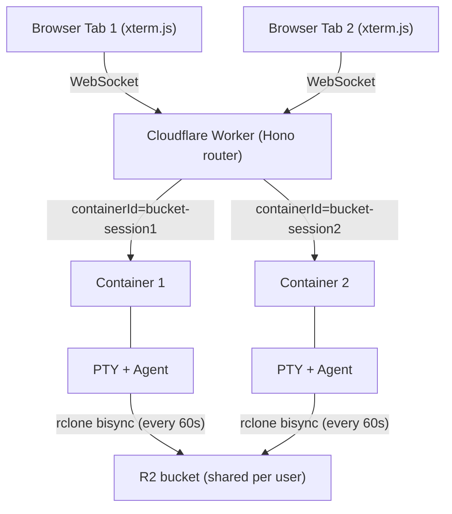
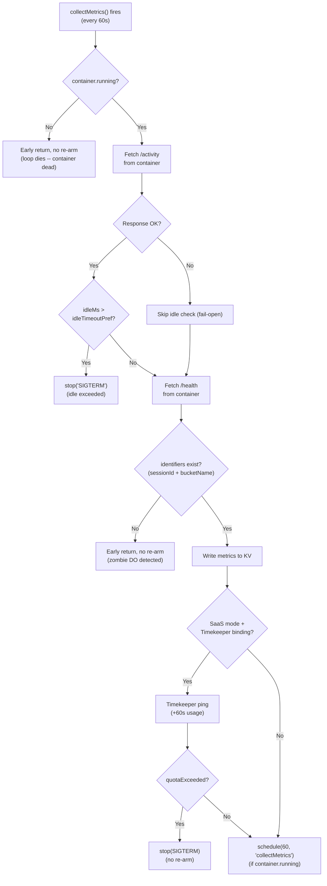
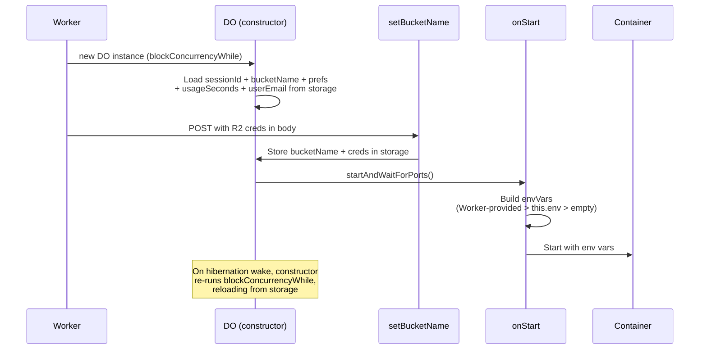
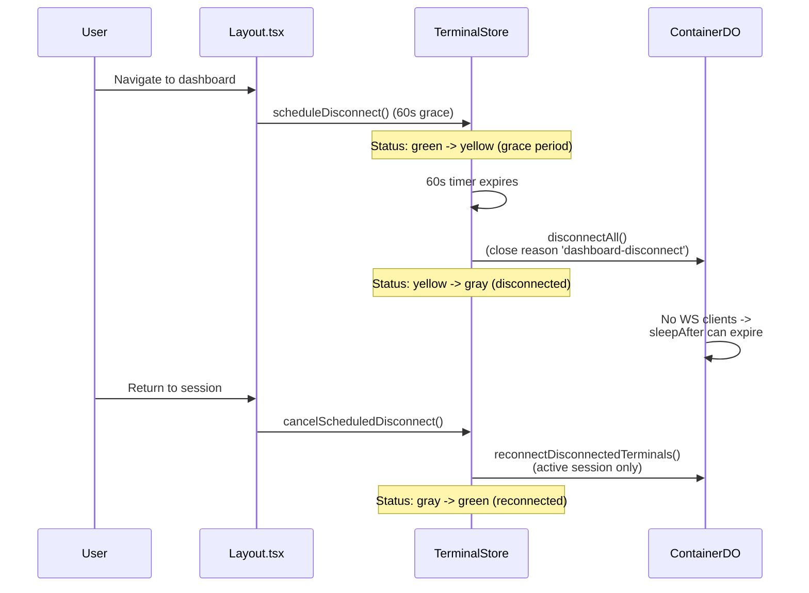
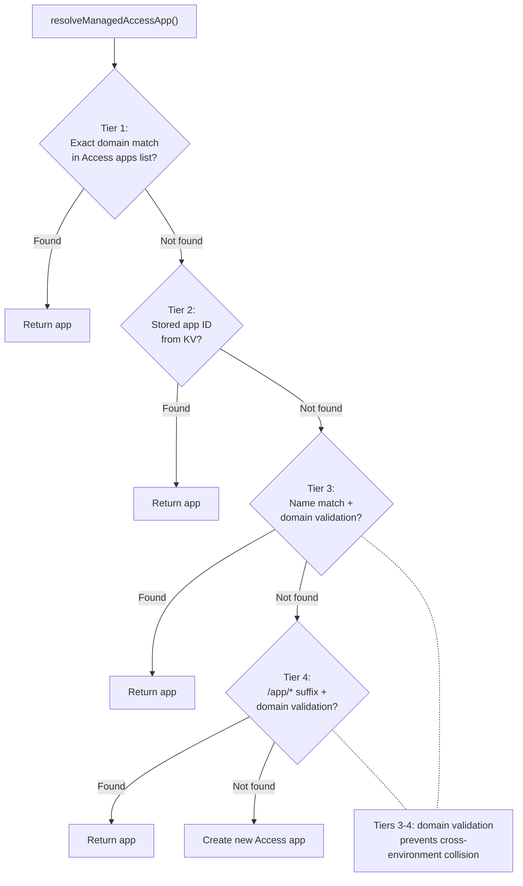
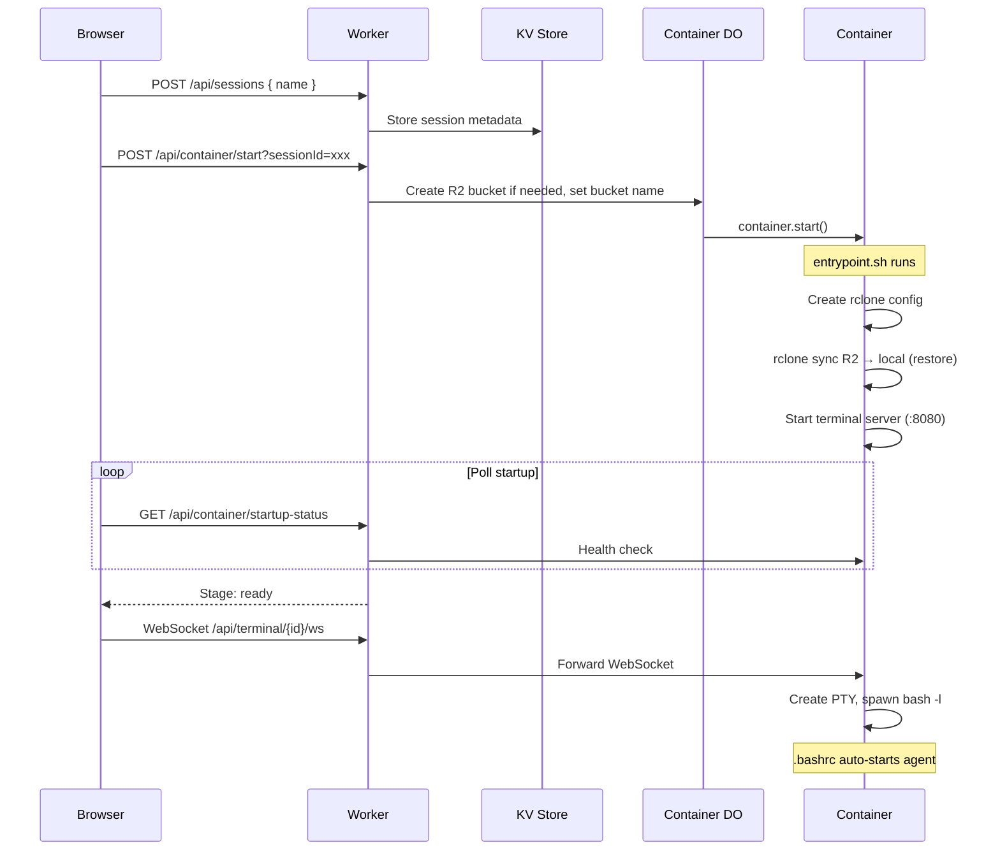
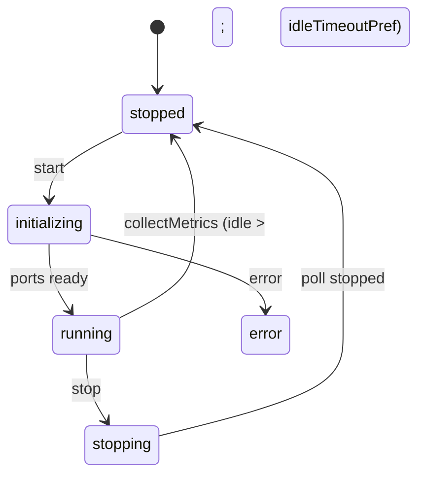
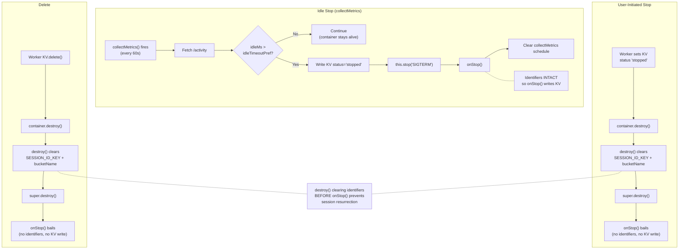
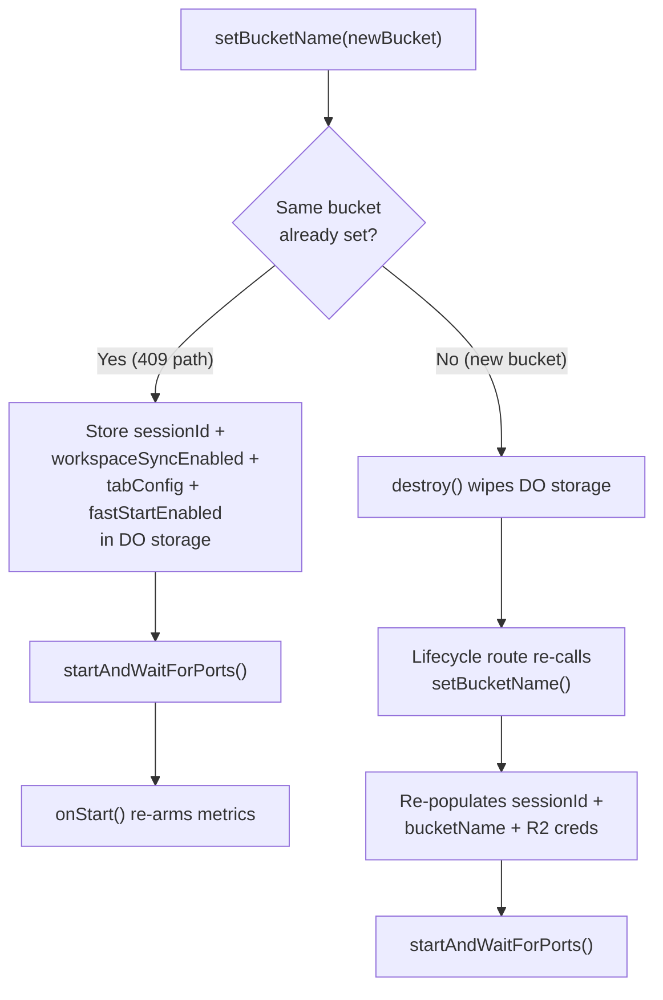
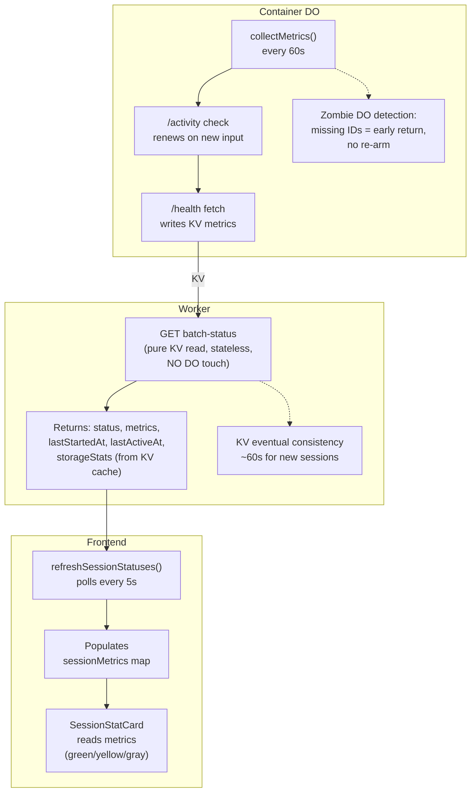

<!-- doc-allow-large -->
<!-- doc-discipline note: this file currently exceeds the 350-line soft budget defined in documentation-discipline.md. Two known follow-ups (tracked separately) would shrink it: (1) move the Container DO internal-method documentation (collectMetrics / destroy / setBucketName) into container.md, where the operational details actually live; (2) move the Backend Libraries error-class status-code mapping to api-reference.md#error-response-format and replace the Route Registration list with a one-line link to api-reference.md. Until that surgery happens, this opt-out is honest about the current state. -->

# Architecture

System architecture, components, data flow, and design rationale for Codeflare.

**Audience:** Developers

---

## Architecture Overview

Codeflare runs AI coding agents in isolated containers, one per browser session (tab). All sessions for a user share a single R2 bucket for persistent storage, with periodic bidirectional sync (every 60 seconds).



**Workers.dev URL:** `https://<CLOUDFLARE_WORKER_NAME>.<ACCOUNT_SUBDOMAIN>.workers.dev` - used only for initial setup. After the setup wizard configures a custom domain, all traffic should go through the custom domain (protected by the configured auth mechanism — CF Access or GitHub OIDC). In CF Access mode, the workers.dev URL should be gated behind one-click Access in the Cloudflare dashboard.

---

## System Components

### Worker (Hono Router)

**File:** `src/index.ts`

Entry point and API gateway. Handles routing, WebSocket upgrade interception, authentication (CF Access JWT or GitHub OIDC session cookies), container lifecycle through Durable Objects, and CORS with configurable allowed origins.

**WebSocket must be intercepted BEFORE Hono routing** (required workaround for CF Workers):
```typescript
// See: https://github.com/cloudflare/workerd/issues/2319
const wsRouteResult = validateWebSocketRoute(request);
if (wsRouteResult.isWebSocketRoute) {
  return handleWebSocketUpgrade(request, env, ctx, wsRouteResult);
}
```

**CORS:** Checks static patterns from `env.ALLOWED_ORIGINS` + dynamic origins from KV (cached in memory). Uses `matchesPattern()` with domain-boundary enforcement (dot-prefixed = suffix match, bare domains = exact or subdomain with dot boundary).

**Route Registration:** `/health`, `/api/health`, `/api/auth`, `/auth`, `/public/auth/providers`, `/api/setup`, `/public`, `/api/user`, `/api/container`, `/api/sessions`, `/api/terminal`, `/api/users`, `/api/storage`, `/api/presets`, `/api/preferences`, `/api/llm-keys`, `/api/deploy-keys`, `/api/usage`, `/api/admin/tiers`

**Workers Assets Routing Guardrails (`wrangler.toml`):**

With SPA fallback (`not_found_handling = "single-page-application"`), control-plane paths must execute Worker logic first via `run_worker_first = ["/", "/auth/*", "/api/*", "/public/*", "/health"]`. Missing `/api/*` causes setup/auth flows to break (API endpoints return HTML instead of JSON).

### Container DO (container)

**File:** `src/container/index.ts` - Extends `Container` from `@cloudflare/containers`. Exported from `src/index.ts` as lowercase `container` (matching `wrangler.toml` class_name). `defaultPort = 8080`, `sleepAfter = '24h'` sentinel (SDK timer pinned so it never fires in normal operation — idle enforcement is owned entirely by `collectMetrics()`, see [Auto-sleep](container.md#auto-sleep-configurable-sleepafter)). A second DO, `Timekeeper`, is exported from `src/timekeeper/index.ts` as lowercase `timekeeper` for per-user usage tracking (see [Timekeeper DO](authentication.md#timekeeper-do-usage-tracking)).

**SDK-Managed Hibernation:** `sleepAfter` lets the SDK handle container process lifecycle via its own alarm loop. `onStart()` records `containerStartedAt`, refreshes `envVars` via `updateEnvVars()`, updates KV with `lastStartedAt` timestamp AND `lastActiveAt` (set to start time so the frontend sleep timer icon has a reference timestamp even before any user input), clears stale `collectMetrics` schedules, and arms a fresh 60-second `collectMetrics` schedule. `onStop()` clears the `collectMetrics` schedule via `deleteSchedules('collectMetrics')` to kill the alarm loop immediately (preventing zombie alarms on dead containers), then sets KV status to `'stopped'` and updates `lastActiveAt` timestamp, ensuring other devices see correct status for hibernated containers.

**Request proxying:** The `fetch()` override dispatches `_internal/*` requests to local handlers (via the `internalRoutes` map), then delegates all other requests to `super.fetch()` — the SDK's `containerFetch()` — which handles container startup readiness, WebSocket upgrades, and in-container HTTP routing. If an auth token has been generated, the request headers are cloned and augmented with `Authorization: Bearer <token>` before delegation. When `this.ctx.container?.running === false`, the override short-circuits: HTTP requests get `503`, and WebSocket upgrades are accepted and immediately closed with code `4503 container-stopped` so the browser can distinguish a stopped container from network errors.

**SDK timer is intentionally inert:** In `@cloudflare/containers` v0.2.x, `containerFetch()` refreshes the SDK activity timer on every WebSocket message in both directions. That semantics is "any traffic", but codeflare wants "no user input" — a container running `tail -f` or `yes` should still sleep when the user walks away. Codeflare therefore pins `sleepAfter` to `'24h'` as a sentinel so the SDK timer never fires in practice, and delegates all idle decisions to `collectMetrics()`, which reads real PTY input activity from inside the container and stops it explicitly when the user-configured threshold is exceeded.

**`collectMetrics()` idle enforcement (every 60s):**
1. Checks `this.ctx.container?.running` — returns early (no re-arm) if container is dead.
2. Fetches `/activity` via `getTcpPort()` — reads `lastInputAt` (Unix timestamp of last PTY keystroke, tracked by the in-container terminal server) and computes `idleMs = Date.now() - (lastInputAt ?? containerStartedAt)`. If `idleMs > parseSleepAfterMs(idleTimeoutPref)`, writes KV status `'stopped'` and calls `stop('SIGTERM')` directly — this is the sole idle-hibernation path. If `/activity` returns non-OK or throws, the step is skipped and collectMetrics fails open (does NOT stop the container — a broken activity endpoint should not kill an active session).
3. Fetches `/health` via `getTcpPort()` — reads cpu/mem/hdd/syncStatus.
4. **Zombie DO detection**: when identifiers are missing (post-`destroy()`), returns early WITHOUT re-arming.
5. Writes metrics to KV session record (`session.metrics`) if container still running.
6. **Timekeeper usage ping** (SaaS mode only, when `SAAS_MODE=active` + `bucketName` + `userEmail` + `TIMEKEEPER` binding): increments `_usageSeconds` by 60, persists to DO storage, pings Timekeeper DO with `{ bucketName, sessionId, totalSeconds, email }`. If Timekeeper returns `quotaExceeded: true`, calls `stop('SIGTERM')` and returns without re-arming.
7. Re-arms the 60 s schedule if container still running.

**Zombie DO Detection:** When `collectMetrics` reaches the health-fetch stage but `sessionId` or `bucketName` are missing from DO storage (happens after `destroy()` clears them), it logs `"missing identifiers, not re-arming (zombie DO)"` and returns without scheduling the next cycle. This is the kill switch for orphaned DOs.



**`onActivityExpired()` Override:** None. Codeflare does not override `onActivityExpired()` anymore. With `sleepAfter` pinned to `'24h'`, the SDK timer effectively never fires in normal operation, and `collectMetrics()` owns all idle-stop decisions. If a container somehow reaches the 24 h ceiling idle, the SDK's default `onActivityExpired` implementation stops it — that is the correct fallback.

**`destroy()` Override:** Clears `SESSION_ID_KEY`, `bucketName`, `workspaceSyncEnabled`, `tabConfig`, `fastStartEnabled` from DO storage and nulls `_bucketName`, `_sessionId`, `_r2AccessKeyId`, `_r2SecretAccessKey`, `_containerAuthToken`, `_openaiApiKey`, `_geminiApiKey`, `_githubToken`, `_cloudflareApiToken`, `_cloudflareAccountId`, `_encryptionKey` in memory, and resets `_sessionMode` to `'default'` BEFORE calling `super.destroy()`. This prevents `onStop()` (triggered asynchronously by `super.destroy()` killing the container) from resurrecting deleted sessions in KV.

**Environment Variables Injection:** R2 credentials flow via two paths: (1) `_internal/setBucketName` request body (primary, from Worker), (2) `this.env` fallback (DO restart). Fallback chain: Worker-provided > `this.env` > empty string.



**Critical: `envVars` must be set as a property assignment**, not as a getter. Cloudflare Containers reads `this.envVars` as a plain property at `start()` time.

**`setBucketName` Idempotency (409 Path):** Once `_bucketName` is set, subsequent `setBucketName` calls return 409. BUT the 409 handler still stores `sessionId`, `workspaceSyncEnabled`, `tabConfig`, `fastStartEnabled`, and `userEmail` in DO storage, updates in-memory LLM keys, deploy keys, encryption key, and session mode, and applies `sleepAfter` preference -- this ensures `collectMetrics`/`onStop` can find the KV entry even on session restarts (where the DO already has a bucket set but needs the sessionId for the new lifecycle), that user preference changes take effect without container recreation, and that the Timekeeper gets the correct user identity.

**Lifecycle Route Re-calls `setBucketName` After `destroy()`:** In the `needsBucketUpdate` path (restart with different bucket), `destroy()` wipes DO storage. The lifecycle route must call `setBucketName` again after `destroy()` to re-populate sessionId, bucketName, and R2 credentials. See `src/routes/container/lifecycle.ts`.

**Internal Endpoints:** `/_internal/setBucketName`, `/_internal/setSessionId`, `/_internal/getBucketName`

### Terminal Server (node-pty)

**File:** `host/src/server.ts` - Node.js/TypeScript server inside the container. Single port 8080 for WebSocket + REST + health/metrics.

Sync handled entirely by `entrypoint.sh` (60s daemon). Terminal server reads sync status from `/tmp/sync-status.json` and exposes via `/health`. Activity tracking (WebSocket connection state + user input timestamps: `hasActiveConnections`, `connectedClients`, `activeSessions`, `disconnectedForMs`, `lastInputAt`) for hibernation decisions via `GET /activity`. Unknown JSON `type` strings are silently ignored (guard against future message types leaking to PTY).

**Auth-Exempt Paths:** The terminal server validates `Authorization: Bearer <token>` on all HTTP requests. `/health` and `/activity` are in the `authExemptPaths` Set at `host/src/server.ts` because `collectMetrics()` calls them directly via `ctx.container.getTcpPort(TERMINAL_SERVER_PORT).fetch(...)` from inside the DO class — that path enters the container over the SDK's private TCP plumbing and never runs through the public `fetch()` override, so no `Authorization` header is injected. The whitelist is safe because these two paths expose no user data and no mutable container state. The `/activity` endpoint is also exempted from auth in the DO-level `fetch()` override so internal health checks don't require token injection.

**`GET /activity` Endpoint:** Returns `{ hasActiveConnections: boolean, connectedClients: number, activeSessions: number, disconnectedForMs: number | null, lastInputAt: number | null }`. Consumed exclusively by the Container DO's `collectMetrics()` poll. Active connections = WebSocket clients currently connected. `disconnectedForMs` tracks time since all clients disconnected (null while clients are connected). `lastInputAt` is the Unix timestamp (ms) of the last real user input — determined by `containsUserInput()` after `stripTerminalResponses()` removes terminal protocol chatter (CPR, OSC, DA). This is the authoritative signal for codeflare's "user has walked away" idle policy.

**Idle Detection (Single Source of Truth):** Idle hibernation is enforced exclusively by `collectMetrics()`, which polls `/activity` every 60 s and computes `idleMs = Date.now() - (lastInputAt ?? containerStartedAt)`. When this exceeds `parseSleepAfterMs(idleTimeoutPref)`, it writes KV status `'stopped'` and calls `this.stop('SIGTERM')` directly. See REQ-SESSION-004 / REQ-SESSION-005.

The SDK's `sleepAfter` timer is intentionally disabled — it's pinned to `'24h'` so it never fires in normal operation. This is necessary because `@cloudflare/containers` v0.2.x refreshes the SDK timer on every WebSocket message in both directions, which would give "any traffic" semantics (containers running `tail -f` or `yes` would never sleep even after the user walks away). Codeflare needs "no user input" semantics, which only an in-container PTY tracker (the terminal server's `lastInputAt`) can provide.

The `containerStartedAt` fallback is critical: if a user opens a terminal but never types, `lastInputAt` stays `null`. Without the fallback, the idle check would be skipped and the container would run forever. With the fallback, idle time is measured from container start, so an unused terminal still stops after the configured timeout.

`containsUserInput()` in `host/src/session.ts` uses a whitelist approach — only actual keypresses count (printable characters, control keys, arrow keys, function keys, Alt+key, mouse clicks). Terminal protocol responses (CSI, OSC, DCS, APC, focus reports, mouse movement) do not count. `stripTerminalResponses()` removes terminal emulator response sequences (CPR, OSC 10/11/12, DA1) before writing to the PTY. Scenarios: user stops typing → container stops after `sleepAfter` + up to 60s (poll granularity); browser closed → same; user opens terminal but never types → container stops after `sleepAfter` from start time.

**WebSocket Wake-Loop Prevention:** Three layers prevent browser auto-reconnect from waking a hibernated container in an infinite stop/start cycle:
1. **DO fetch gate** (`container/index.ts`): The `fetch()` override returns 503 when `!this.ctx.container?.running` for all non-internal routes. This is authoritative (the DO knows container state directly, no KV read needed) and prevents `super.fetch()` from triggering the SDK's `startIfNotRunning`.
2. **Terminal route guard** (`routes/terminal.ts`): Rejects WebSocket upgrade requests with 503 when `session.status === 'stopped'` in KV. This is defense-in-depth — catches requests before they reach the DO.
3. **Frontend disposal** (`stores/session.ts`): The session poller detects running→stopped transitions and calls `terminalStore.disposeSession(sessionId)`, which kills all WebSocket retry loops for that session. Fresh `connect()` calls are only made when the user explicitly starts the session again.

**WebSocket Protocol:** Raw terminal data (NOT JSON-wrapped). Control messages (resize, process-name) as JSON. No application-level ping/pong -- Cloudflare handles protocol-level WebSocket keepalive for DO/Container connections. Headless terminal (xterm SerializeAddon) captures full state for reconnection.

**PTY:** Spawns `bash -l` (login shell for .bashrc) with `xterm-256color`, truecolor support.

**Terminal emulator response stripping:** `stripTerminalResponses()` in `host/src/session.ts` strips terminal emulator responses (CPR, OSC 10/11/12, DA1) from WebSocket input before writing to the PTY. These responses are generated by xterm.js in reply to terminal queries issued by CLI tools (e.g., `gh secret set` reads an OSC 11 response as the secret value). `containsUserInput()` then classifies the original data using a whitelist approach: printable characters, control keys (Enter, Backspace, Tab, Ctrl+key), arrow keys, function keys, Alt+key, and mouse clicks count as user input for idle detection. Terminal protocol chatter (CSI/OSC/DCS/APC sequences, focus reports, mouse movement/release) does not count. The `Session.write()` method calls both: PTY receives the filtered data, and `activityTracker.recordInput()` is called only when `containsUserInput()` returns true.

### Frontend (SolidJS + xterm.js)

**Directory:** `web-ui/`

Key files: `App.tsx` (root), `Terminal.tsx` (xterm.js), `TerminalTabs.tsx`, `Layout.tsx` (orchestrates dashboard/terminal views, manages WS disconnect/reconnect lifecycle), `SessionStatCard.tsx` (dashboard card with three-color status dot and metrics), `StorageBrowser.tsx` (R2 browser with toolbar), `StoragePanel.tsx` (slide-in drawer), `SettingsPanel.tsx`, `Dashboard.tsx`, `OnboardingLanding.tsx`, `OnboardingPage.tsx` (guided setup), `SubscribePage.tsx` (subscription flow), `UsagePage.tsx` (usage dashboard), `LoginPage.tsx` (SaaS login), `Header.tsx` (nav + user dropdown + inline usage), `KittScanner.tsx`.

Stores: `terminal.ts` (WebSocket state, compound key `sessionId:terminalId`, scheduled disconnect/reconnect), `terminal-url-detection.ts` (URL detection signals for floating buttons), `terminal-layout.ts` (terminal layout state), `session.ts` (CRUD, `terminalsPerSession`, `stopSession()` sets `'stopping'` and polls, `refreshSessionStatuses()` for lightweight dashboard polling — also updates storage stats from batch-status via `updateStatsFromBatch()`), `storage.ts` (R2 operations), `setup.ts`, `tiling.ts` (tiled terminal layout), `session-presets.ts` (preset/bookmark management), `session-tabs.ts` (tab configuration).

#### Dashboard WS Disconnect Flow

When user navigates to dashboard, `Layout.tsx` calls `scheduleDisconnect(DASHBOARD_WS_DISCONNECT_DELAY_MS)` (60s grace period). After the grace period, `disconnectAll()` closes all WS connections with reason `'dashboard-disconnect'`. Container can then idle to `sleepAfter` (user-configurable, default 30m for paying users, 15m for free tier). When user returns to terminal view, `cancelScheduledDisconnect()` cancels any pending timer, then `reconnectDisconnectedTerminals(activeSessionId)` reconnects only the active session's terminals. The `untrack()` fix in `Layout.tsx`'s `createEffect` wraps `activeSessionId` to prevent the reactive dependency from triggering reconnects on unrelated session changes.

**Tab Visibility Auto-Refresh:** `Layout.tsx` listens for `visibilitychange` events. When the tab returns from background (mobile browser tab switch, screen off/on), it auto-refreshes session statuses and storage listing. This prevents stale "Failed to fetch" errors that appear when background tabs have their network requests aborted by the browser. Storage refresh is silent (no loading spinner) to avoid UI flicker.

**Session Status Architecture:** KV polling (every 5s via batch-status) is the source of truth for session status. The Container DO sends custom WS close code **4503** when `!this.ctx.container?.running`, giving the client an authoritative "container stopped" signal distinct from network errors (code 1006). On 4503, the client immediately sets the terminal to `'disconnected'` with "Session stopped" message and stops retrying. On 1006 (network error), the client retries indefinitely — KV polling will update the status when propagation completes. Guards only block KV polling during user-initiated stop (`session.status === 'stopping'`) and session initialization (`session.status === 'initializing'`). When KV polling transitions a session to 'stopped', it also disposes terminal connections and clears `activeSessionId`.



#### Three-Color Session Status

`SessionStatCard` displays green (running + WS connected), yellow (running + WS disconnected -- container alive but dashboard-disconnected), gray (stopped). Driven by `dotVariant()` which checks both `session.status` and `terminalStore.getConnectionState()`. The yellow indicator was added to make the dashboard-disconnect flow visible to the user -- without it, status jumped from green directly to gray.

#### Polling and Consistency

**Polling Interval:** `SESSION_LIST_POLL_INTERVAL_MS = 5000` -- frontend polls at 5s for responsive UI. The DO's `collectMetrics` pushes metrics to KV every 60s, so metrics may be up to ~60s stale on the dashboard. `CONTEXT_EXPIRY_MS = 30 * 60 * 1000` (30m) is the frontend context expiry threshold for detecting stale sessions. Note: backend `sleepAfter` is now user-configurable (5m–2h, default 30m), so context expiry may not exactly match all users' sleep timers.

**KV Eventual Consistency:** ~60s propagation delay for new sessions. Metrics may not appear at edge immediately after first `collectMetrics` write. The frontend handles this gracefully -- `SessionStatCard` shows last-known metrics for recently-stopped sessions.

#### KV Optimization (1500-User Scale)

Three optimizations reduce KV operations from ~910K/sec to ~350/sec at 1500 concurrent users:

**1. List Metadata for batch-status:** `putSessionWithMetadata()` in `kv-keys.ts` writes compressed `SessionListMetadata` (status, timestamps, metrics — ~195 bytes) alongside the session value via `kv.put(key, value, { metadata })`. `GET /api/sessions/batch-status` reads from `kv.list()` metadata instead of N individual `kv.get()` calls. Graceful fallback to `kv.get()` for pre-migration keys without metadata. Compressed field names: `s` (status: 'r'|'s'), `la` (lastActiveAt), `sa` (lastStartedAt), `m.c/e/h/y/u` (metrics). All 9 session write sites use `putSessionWithMetadata`. `validateSessionAndCheckLimits` also reads running count from metadata.

**2. Metrics via List Metadata:** `collectMetrics` writes metrics inline on the session record via `putSessionWithMetadata()`, which stores compressed `SessionListMetadata` (including metrics) as KV list metadata. `batch-status` reads these from `kv.list()` without individual `kv.get()` calls.

**3. User Record Cache:** Module-level `Map<string, { data, cachedAt }>` in Timekeeper with 60s TTL and 100-entry cap for `user:{email}` reads in `handlePing()`. Matches `getTierConfig()` cache pattern. Reduces 1500 uncached KV reads/min to ~25. `resetUserRecordCache()` exported for test cleanup.

| Metric | Before | After | Reduction |
|--------|--------|-------|-----------|
| batch-status KV reads/sec | ~901,500 | ~300 | 99.97% |
| Timekeeper user reads/min | 1,500 | ~25 | 98.3% |
| collectMetrics session reads/min | 1,500 | 0 | 100% |

**Auto-Reconnect:** Infinite retries with 1-second delay (`WS_RETRY_DELAY_MS = 1000`) for retryable close codes (1001, 1006, 1011, 1012, 1013). No dead-container inference from retry failure — only the server-authoritative close code 4503 stops retrying. Reconnection triggers session buffer replay via SerializeAddon state restore. AbortController-based cancellation prevents parallel retry loops.

**No Application-Level WS Pings:** Removed. Cloudflare's runtime handles protocol-level WebSocket keepalive for DO/Container connections automatically.

**Character Doubling Fix:** The `inputDisposable` must be stored outside `connect()` and disposed before creating a new handler on reconnect:
```typescript
let inputDisposable: IDisposable | null = null;
function connect() {
  inputDisposable?.dispose();
  inputDisposable = terminal.onData((data) => ws.send(data));
}
```

#### UI Features

**Nested Terminals (Multiple PTYs per Session):** Up to 6 terminal tabs per session. Compound key strategy: frontend `sessionId:terminalId`, WebSocket URL `/api/terminal/{sessionId}-{terminalId}/ws`. Backend parses compound ID, validates base session, forwards full ID to container. Container's SessionManager handles each compound ID as a separate PTY.

**StoragePanel (R2 File Browser):** Files: `StoragePanel.tsx`, `StorageBrowser.tsx`, `stores/storage.ts`. Desktop: 400px slide-in drawer. Mobile: bottom-sheet. Mutual exclusion with SettingsPanel. Reads directly from R2 via Worker API (no container-side sync trigger). Container sync handled by 60s bisync daemon.

**R2 Storage Stats Caching:** `GET /api/storage/stats` paginates all R2 objects and caches results in KV (`storage-stats:{bucketName}`, 60s TTL). `batch-status` piggybacks cached stats (no TTL check — relies on cache being fresh). Mutation endpoints (upload, delete, seed) invalidate the KV cache after successful operations. Dashboard calls `storageStore.fetchStats()` on mount, which hits `/api/storage/stats` and refreshes from R2 if the cache is stale or missing.

**Logout:** The frontend navigates to `/auth/logout` via `window.location.href`. The backend route (in `auth-redirects.ts`) dispatches based on mode: SaaS OIDC redirects to `/auth/github/logout` (clears `codeflare_session` cookie), CF Access mode redirects to `https://{authDomain}/cdn-cgi/access/logout?returnTo=https://{customDomain}/`.

**Header User Dropdown:** Clicking the avatar/username in both Header (terminal view) and Dashboard opens a dropdown with three items: Profile (`/app/subscribe`), Guided Setup (`/app/onboarding`), and Logout. Profile and Guided Setup use plain `<a href>` tags with no `onClick` handlers — SolidJS Router's top-level DOM listener intercepts clicks for client-side navigation (no full page reload, no white flash on dark backgrounds). This is critical for mobile: previous attempts using `<button>` + `window.location.href` or `onClick` handlers failed due to touch event race conditions with Portal DOM removal. Logout uses `window.location.href` to navigate to `/auth/logout` (dispatches to OIDC or CF Access logout depending on mode). Dashboard dropdown uses `Portal` with the dropdown nested inside the overlay as a child (not a sibling) — `stopPropagation` on the dropdown div prevents touch events from reaching the overlay's `onClick`. Desktop: positioned below avatar via `getBoundingClientRect()`. Mobile: bottom sheet.

**Onboarding Page (`/app/onboarding`):** Guided setup page for new users. Three sections: (1) Connect GitHub — saves PAT via `updateDeployKeys`, (2) Connect Cloudflare — saves API token, (3) Coding Agents — informational cards linking to signup pages for 6 supported agents. Reuses `ProviderRow` and `BrandIcons` from settings. "Skip and Continue to Codeflare" button always visible. Uses standalone `.onboarding-page` container (`position: fixed; inset: 0; overflow-y: auto`) instead of `.login-page` — same pattern as `.setup-wizard` — because `.login-page` has `overflow: hidden` that blocks scrolling. **First-time redirect:** In SaaS mode, `AppContent` checks `onboardingComplete` from `/api/user` — if `false`, redirects to `/app/onboarding`. The Skip/Continue buttons call `POST /api/user/onboarding-complete` which sets `onboardingComplete: true` in the user's KV entry. Subsequent visits go directly to the dashboard. Users can always revisit via the header dropdown ("Guided Setup").

**Font consistency:** Login, subscribe, and onboarding pages all use `JetBrains Mono` monospace font via `font-family` on `.login-content` and `.onboarding-content` root containers. All child text inherits — no sans-serif fallback.

**Admin Protection:** Admin users always have `unlimited` subscription tier and can switch between default/advanced session modes freely. `canUseAdvanced()` in SettingsPanel returns `true` for admins regardless of stored tier — prevents admin lockout when JIT-provisioned with `pending` tier before being promoted. Backend rejects both tier changes (`PATCH /api/users/:email`) and deletions (`DELETE /api/users/:email`) for admin-role users. Frontend hides tier dropdown and delete button for admins in UserManagement.

**Live Tier Refresh:** `SettingsPanel` re-fetches `/api/user` each time it opens, updating a `liveAccessTier` signal with `subscriptionTier ?? accessTier` and `userHasSubscribed` signal from `hasSubscribed`. This ensures tier upgrades (admin promotes user to a higher tier) and subscription status changes take effect without a full page reload — the user just needs to close and reopen Settings. The `hasSubscribed` flag controls whether the auto-sleep dropdown is enabled.

**Auto-advanced session mode:** When a user is promoted to `advanced` tier via `PATCH /api/users/:email`, the backend also writes `sessionMode: 'advanced'` to their preferences (`user-prefs:{bucketName}`) if no `sessionMode` is set yet. This ensures their first bucket creation seeds advanced skills and agent rules. Existing user preferences (where `sessionMode` is already set) are not overridden. Admin users created by setup also get `sessionMode: 'advanced'` in their preferences automatically.

**Bucket creation and seeding:** R2 buckets are auto-created on first access from two paths: (1) `POST /api/container/start` via `ensureBucketAndSeed` and (2) `GET /api/storage/browse` when the dashboard loads the storage panel. Both paths read `sessionMode` from user preferences (`user-prefs:{bucketName}`) via `resolveSessionMode()` and pass it to `seedAgentConfigs()`/`reconcileAgentConfigs()` so the correct mode-specific files are seeded. The storage browser path typically runs first (dashboard loads before user starts a session).

**Frontend Zod Validation:** `web-ui/src/lib/schemas.ts` -- Zod schemas validate API responses at runtime. Types derived from schemas via `z.infer`.

**Terminal Tab Configuration:** `web-ui/src/lib/terminal-config.ts` -- Generic "Terminal 1-6" defaults with live process detection via `PROCESS_ICON_MAP` (maps running process names like claude, codex, gemini, opencode, copilot, htop, yazi, lazygit, bash, sh, zsh to MDI icons). Separate `AGENT_ICON_MAP` maps the 6 agent types (claude-code, codex, gemini, opencode, copilot, bash) to session card icons.

#### Frontend Constants

**File:** `web-ui/src/lib/constants.ts` -- 20 exported constants for polling intervals, timeouts, WebSocket close codes, max terminals, display lengths, URL detection patterns, view transitions, context expiry, dashboard WS disconnect delay.

---

## Backend Libraries

| File | Purpose |
|------|---------|
| `src/middleware/auth.ts` | Shared authentication middleware. Delegates to `authenticateRequest()` which throws `AuthError`/`ForbiddenError` on failure. Sets `c.get('user')` and `c.get('bucketName')` for downstream handlers. |
| `src/lib/container-helpers.ts` | Consolidated container initialization: `getSessionIdFromQuery()` (from query param), `getContainerId()` (with validation, never fallbacks), `getContainerContext()` (full context for route handlers). |
| `src/lib/error-types.ts` | `AppError` base class with `code`, `statusCode`, `message`, `userMessage`. Specialized: `NotFoundError` (404), `ValidationError` (400), `ContainerError` (500), `AuthError` (401), `ForbiddenError` (403), `SetupError` (400), `RateLimitError` (429), `QuotaExceededError` (402), `CircuitBreakerOpenError` (503). Utilities: `toError(unknown)`, `toErrorMessage(unknown)`. |
| `src/lib/type-guards.ts` | Runtime type validation replacing unsafe type casts (e.g., `isBucketNameResponse()`). |
| `src/lib/constants.ts` | Single source of truth for 18 constants + 1 exported function: ports (`TERMINAL_SERVER_PORT = 8080`), session ID validation, CORS defaults, rate limit keys/windows, container fetch timeouts, max presets/tabs, protected paths, request ID config, session limits (`getMaxSessions()`). |
| `src/lib/circuit-breaker.ts` | Prevents cascading failures. States: CLOSED (normal), OPEN (fail fast), HALF_OPEN (testing recovery). Wraps `container.fetch()` calls. |
| `src/middleware/rate-limit.ts` | Per-user rate limiting (bucketName from auth, IP fallback). Stores counts in KV. Adds `X-RateLimit-*` headers. |
| `src/lib/logger.ts` | JSON logging with `createLogger(module)`, child loggers with request context. |
| `src/lib/jwt.ts` | RS256 verification against CF Access JWKS (`https://{authDomain}/cdn-cgi/access/certs`). Per-isolate JWKS cache with `resetJWKSCache()`. |
| `src/lib/cache-reset.ts` | Centralized invalidation of CORS + auth config + JWKS caches. Called by setup wizard after configuration changes. |
| `src/lib/cf-api.ts` | Cloudflare API client. `parseCfResponse` checks `Content-Type` header before JSON parsing. When content-type is not `application/json`, attempts `JSON.parse` on the text body as a lenient fallback (Cloudflare sometimes omits content-type on valid JSON). Only throws a structured `AppError` with the first 200 chars of the response body if the parse actually fails -- this gives clear diagnostics for HTML error pages or plain text from expired tokens, instead of opaque JSON parse errors. |
| `src/lib/request-helpers.ts` | Shared request handling: `parseJsonBody(c)` (JSON parse with ValidationError on malformed input), `firstZodError(error)` (first Zod issue message with fallback), `validateSessionId(id)` (throws on invalid format), `maskSecret(value)` (shows last 4 chars). |
| `src/lib/kv-keys.ts` | KV key utilities: session/user key helpers, `SETUP_KEYS` const for all 20 `setup:*` configuration keys, `getBaseUrl(kv, requestUrl)`, `listAllKvKeys()`. |
| `src/lib/currency.ts` | `getCurrencyForCountry(country)` — maps a 2-letter ISO country code to a supported currency (`chf`/`usd`/`eur`/`gbp`). CH/LI → CHF, GB → GBP, 20 Eurozone countries → EUR, all others → USD. Used by billing and tiers routes to detect visitor currency from the `CF-IPCountry` header. Implements [REQ-SUB-020](../sdd/subscription.md#req-sub-020). |
| `src/types.ts` | `BillingStatus` union type (`'active' | 'trialing' | 'past_due' | 'canceled'`) with `BILLING_STATUS` const and `isBillingStatus()` guard. `ContainerConfigPayload` groups 16 container initialization params into logical sub-objects (R2 creds, LlmKeys, DeployKeys, preferences). |

### Setup Wizard Resilience

**Directory:** `src/routes/setup/`

All Cloudflare API calls in the setup wizard are wrapped in `withSetupRetry()` (defined in `shared.ts`) for transient failure resilience. The wrapper retries up to 2 times (3 total attempts) with exponential backoff (1s, 2s), skipping retry for `CircuitBreakerOpenError`.

**Cross-environment safety:** `resolveManagedAccessApp()` in `access.ts` uses a 4-tier fallback to find existing Access apps: (1) exact domain match, (2) stored app ID from KV, (3) name match + domain validation, (4) `/app/*` suffix + domain validation. Tiers 3 and 4 validate domain to prevent cross-environment collision when multiple environments share a CF account.



**Error propagation:** `listAccessApps()` and `listAccessGroups()` propagate errors through `withSetupRetry` rather than silently returning `[]`. Errors surface as `SetupError` with step details. The frontend `ApiError` carries a `steps` array from `SetupError` JSON responses.

**Stale user removal during reconfiguration:** When `POST /configure` is re-run with a new `allowedUsers` list, users no longer in the list are removed via `cleanupUserData()` (`src/lib/user-cleanup.ts`), wrapped in `runStep('cleanup_stale_users')` for progress visibility. This performs full cleanup identical to `DELETE /api/users/:email`: destroys all active sessions/containers, deletes bucket-keyed KV entries (`storage-stats:`, `presets:`, `user-prefs:`, `timekeeper:`), deletes the R2 scoped token, empties the R2 bucket (paginated `ListObjectsV2` + `DeleteObjects` via `emptyR2Bucket`), and deletes the bucket via CF API with retry logic (up to 3 attempts with exponential backoff for R2 eventual consistency). **SaaS mode:** only admin-role users removed from the admin list are cleaned up — JIT-provisioned regular users are preserved (managed via User Management, not setup). Each existing KV user is checked for `role: 'admin'` before deletion. Admin KV writes merge with existing entries (preserving tier fields) and always set `subscriptionTier: 'unlimited'`. **Self-removal prevention:** during reconfiguration, the backend rejects the request if the current authenticated user is not in the submitted admin list (`ValidationError: 'You cannot remove yourself from the admin list'`). The Zod schema enforces at least 1 admin user.

### Session Route Architecture

**Directory:** `src/routes/session/` - Split into `index.ts` (aggregator), `crud.ts` (CRUD), `lifecycle.ts` (start/stop/status/batch-status).

**Session Stop Flow (user-initiated):** Sets KV status to `'stopped'`, calls `container.destroy()` (sends SIGINT per Dockerfile STOPSIGNAL, then SIGKILL), entrypoint.sh shutdown handler runs final `rclone bisync`. `destroy()` override clears `SESSION_ID_KEY`/`bucketName` from DO storage before `super.destroy()` -- prevents `onStop()` from resurrecting the deleted session. Both `batch-status` and `GET /:id/status` trust the `'stopped'` KV status to avoid waking the DO (exception: stale >5 minutes triggers probe).

**Session Stop Flow (idle):** `collectMetrics()` polls `/activity` every 60 s, computes `idleMs = Date.now() - (lastInputAt ?? containerStartedAt)`, and when `idleMs > parseSleepAfterMs(idleTimeoutPref)` writes KV `status: 'stopped'` (with `lastActiveAt`) and calls `this.stop('SIGTERM')`. The subsequent `onStop()` clears the `collectMetrics` schedule via `deleteSchedules('collectMetrics')`. See REQ-SESSION-004 / REQ-SESSION-005.

---

### Code Structure (Pre-Launch Refactoring)

**Container DO extraction:** `src/container/index.ts` split from 887 → 475 lines:
- `container-env.ts` (338 lines): env var construction, bucket name application, credential injection, prefs-on-restart
- `container-metrics.ts` (267 lines): collectMetrics, idle detection, Timekeeper ping, KV status updates (immutable spread, not mutation)
- `index.ts` (475 lines): thin facade owning DO lifecycle (constructor, fetch, onStart, onStop, alarm). Sub-modules receive state via explicit interface parameters, not class inheritance.

**Session store extraction (CF-013):** `web-ui/src/stores/session.ts` split from 768 → 582 lines:
- `session-polling.ts` (196 lines): refreshSessionStatuses, miss counters, start/stop polling. Uses dependency injection via `registerPollingDeps()`.
- `session-usage.ts` (108 lines): UsageState, warning levels, localStorage cache, `getDismissedQuotaLevel`/`setDismissedQuotaLevel` for per-UTC-month banner dismissal. Self-contained, no circular deps.
- `session.ts` (582 lines): facade re-exports all members. Public API unchanged.

**Type safety fixes (CF-007):** `countPaidSlots` typed (no more `any[]`). Admin PATCH user uses `updateUserRecord` (not raw `KV.put`). `maxUsers` added to frontend `GetUsersResponseSchema` (no more double cast).

**Validation consolidation (CF-009):** 4 inline `SESSION_ID_PATTERN.test()` in `crud.ts` replaced with `validateSessionId()` from `request-helpers.ts`. Errors flow through global handler with consistent JSON shape.

**Shared config schema (CF-006):** `SetBucketNameBodySchema` in `container-config-schema.ts` — Zod schema for setBucketName payload with `.passthrough()` for flexibility. Deploy credential fields use conditional spread (not explicit `null`).

**ScrambleText consolidation (CF-016):** `ScrambleText.tsx` rewritten as 15-line wrapper around `useScrambleText` hook (canonical `requestAnimationFrame` implementation). Single source of truth for scramble animation. Hook accepts `animateOnMount` option to trigger scramble on first render (used by standalone ScrambleText component on login/subscribe pages).

---

## Data Flow

### Session Creation to Terminal Connection



### Startup Status Stages

| Stage | Progress | Condition |
|-------|----------|-----------|
| stopped | 0% | Container not running |
| starting | 10-20% | Container running but health server not responding |
| syncing | 30-45% | Health server up, syncStatus = pending/syncing |
| verifying | 85% | Sync complete, terminal server not yet responding |
| mounting | 90% | Terminal server up, PTY pre-warming in progress. WebSocket connects, terminal canvas hidden (`visibility: hidden`) |
| ready | 100% | All checks passed. "Open" button appears. Click reveals terminal canvas with pre-buffered content |
| error | 0% | Sync failed or other error |

### Session Lifecycle State Machine



**Stop (idle):** `collectMetrics()` poll -> `idleMs = Date.now() - (lastInputAt ?? containerStartedAt)` -> `idleMs > parseSleepAfterMs(idleTimeoutPref)` -> write KV `status: 'stopped'` (with `lastActiveAt`) -> `this.stop('SIGTERM')` -> `onStop()` clears `collectMetrics` schedule.

**Fast container-stopped detection (frontend):** When the Container DO's "not running" guard returns close code `4503` (`WS_CONTAINER_STOPPED_CODE`), the terminal store stops retrying and marks the connection as disconnected. This is server-authoritative — the container is definitively not running. Non-4503 close codes (1006, 1001, 1011, etc.) trigger automatic reconnection with 1s delay.

**Anti-flapping (KV stopped→running):** When KV batch-status polling detects a `stopped→running` transition for a non-active session, `refreshSessionStatuses()` updates the session status dot but does **not** auto-initialize terminals. This prevents a flapping cycle: stale KV "running" → WS connections → 503 from dead container → disconnected → stale KV "running" restarts cycle. Newly started sessions have a 3-minute startup guard (`session-polling.ts`) during which only `4503` close code can transition them to stopped. The user explicitly clicks the session card to reconnect. Terminal initialization only occurs during: (1) explicit session start by user, (2) `loadSessions()` on initial page load where KV is authoritative.

**Stop (user-initiated):** Worker sets KV status to `'stopped'` -> calls `container.destroy()` -> `destroy()` clears `SESSION_ID_KEY` + `bucketName` from DO storage to prevent deleted session resurrection -> `super.destroy()` -> `onStop()` bails (no identifiers, so no KV write)

**Delete:** Worker `KV.delete()` -> `container.destroy()` -> `destroy()` clears `SESSION_ID_KEY` + `bucketName` -> `super.destroy()` -> `onStop()` bails (no identifiers, so deleted session cannot be resurrected in KV)



**Restart (same bucket):** `setBucketName` -> 409 (bucket already set, but stores `sessionId`, `workspaceSyncEnabled`, `tabConfig`, and `fastStartEnabled` in DO storage for KV reconciliation and preference updates) -> `startAndWaitForPorts()` -> `onStart()` re-arms metrics

**Restart (different bucket):** `setBucketName` succeeds -> `destroy()` (wipes DO storage) -> lifecycle route re-calls `setBucketName` (re-populates sessionId + bucketName + R2 creds) -> `startAndWaitForPorts()`



### Metrics Data Flow



---

## Module-Level Caches

All module-level caches in the codebase. Workers isolates do not share memory, so each cache is per-isolate.

| Module | Cache Variable | TTL | What It Caches | Reset Function |
|---|---|---|---|---|
| `src/lib/access.ts` | `cachedAuthDomain`, `cachedAccessAud`, `cachedAccessAudList` | 5 min | CF Access auth domain and audience config | `resetAuthConfigCache()` |
| `src/lib/subscription.ts` | `cachedTierConfig` | 60s | Tier configuration from `tiers:config` KV key | `resetTierConfigCache()` |
| `src/lib/cors-cache.ts` | `cachedKvOrigins` | 5 min | CORS origins from `setup:custom_domain` + `setup:allowed_origins` | `resetCorsOriginsCache()` |
| `src/lib/jwt.ts` | JWKS key cache | 30s freshness threshold | Cloudflare Access JWKS public keys (re-fetched on kid miss after 30s) | `resetJWKSCache()` |
| `src/lib/stripe.ts` | `priceCache` | 1 hour | Stripe price amount/currency per price ID, including `currency_options` for multi-currency pricing | (none — TTL-only) |
| `src/lib/kv-crypto.ts` | imported CryptoKey | Isolate lifetime | AES-256 key from `ENCRYPTION_KEY` env var | (none — persists for isolate lifetime) |
| `src/lib/rate-limit-core.ts` | `failedKvOps` | Isolate lifetime | Counter for consecutive KV failures (circuit breaker) | (none) |
| `src/lib/circuit-breakers.ts` | per-container breakers | Isolate lifetime | Circuit breaker state per container ID | (none) |
| `src/lib/session-jwt.ts` | `cachedKey` | Isolate lifetime | HMAC CryptoKey imported from `OAUTH_JWT_SECRET` | (none — re-imported if secret changes) |

After admin config changes, different isolates may enforce different values for up to the cache TTL. This is an accepted trade-off for KV read performance.

---

## Design Rationale

Architectural principles and design rationale.

1. **rclone bisync > s3fs FUSE** - FUSE mounts are fragile and slow. Periodic bisync with local disk is faster and more reliable.
2. **Newest file wins** - Simple conflict resolution for single-user scenarios.
3. **Resilient bisync over auto-resync** - `--resilient` + `--recover` handle transient failures without losing deletion tracking. `--resync` is only used for initial baseline establishment (see AD14).
4. **Single-source idle detection via `collectMetrics`** - The DO polls `/activity` inside the container every 60 s and explicitly calls `stop('SIGTERM')` when `idleMs > parseSleepAfterMs(idleTimeoutPref)`. The SDK's own `sleepAfter` timer is pinned to `'24h'` and plays no role in idle decisions (see AD/rationale #11). This replaced both the earlier heartbeat-based approach AND a short-lived input-change-detection design that leaned on the SDK timer — both were fragile when WebSocket reconnects reset the SDK's activity timer. One mechanism, one signal: has the user typed within the configured threshold? Container stops ~threshold + up to 60 s after the last keystroke.
5. **`onStop()` must set KV status and clear schedules** - SDK hibernation fires `onStop()` which must write `status: 'stopped'` to KV (otherwise other devices see stale 'running' status) and call `deleteSchedules('collectMetrics')` to kill the alarm loop (otherwise zombie alarms fire on a dead container indefinitely).
6. **`destroy()` must clear identifiers before `super.destroy()`** - `onStop()` fires asynchronously after `super.destroy()`. Without clearing identifiers first, `onStop()` resuscitates deleted sessions in KV via read-modify-write.
7. **Secrets persist with worker state** - `wrangler delete` destroys all secrets.
8. **Single port architecture** - All services on port 8080 eliminates port conflict bugs.
9. **CPU metrics show load average, not utilization** - `os.loadavg()[0] / cpus * 100` measures run queue depth. Values >100% are normal.
10. **Downgrade verbose activity logs to debug** - Per-cycle activity check logs at `info` level generate log volume (every 60 s per container). Once the single-source `collectMetrics` idle enforcement is confirmed stable in production, downgrade to `debug`.
11. **Stateless dashboard polling preserves hibernation** - Dashboard status endpoints must be pure KV reads with zero DO contact. Waking a DO resets the Container SDK's internal activity timer; even with the SDK timer pinned to 24 h (see [REQ-SESSION-004](../sdd/session-lifecycle.md#req-session-004) AC5), unnecessary DO wake-ups waste resources and can interfere with hibernation. `@cloudflare/containers` v0.2.x also auto-refreshes on any WebSocket message, so the SDK timer sees "any traffic" semantics, not "no user input" semantics — this is the primary reason idle enforcement is delegated entirely to `collectMetrics()` rather than the SDK timer.
12. **Polling interval vs push cadence** - The backend pushes metrics to KV every 60s (`collectMetrics`). The frontend polls at 5s for responsive session status updates (start/stop transitions). Metrics on the dashboard may be up to ~60s stale.
13. **rclone version upgrades can break bisync** - The Alpine → Debian migration changed rclone v1.68 → v1.73, introducing stricter MD5 post-transfer verification that aborts on files modified during sync ("corrupted on transfer"). Fix: `--ignore-checksum` on all bisync commands. Pin rclone version in Dockerfile to prevent future surprise breakage. Additionally, `--max-delete 100` is required on all bisync commands — the default 50% threshold aborts syncs when bulk deletions (e.g., deleting a workspace folder) remove more than half the tracked files. **Warning**: `--resync` should never be used as an automatic recovery mechanism — it destroys bisync's deletion tracking (see AD14).
14. **Never auto-`--resync` on bisync failure** - `--resync` makes both sides identical by copying the newer version of every file, then creates a fresh baseline. This permanently loses any pending deletions — if side A deleted a file and bisync fails before propagating, `--resync` resurrects the file from side B. Use `--resilient` + `--recover` for self-healing: `--resilient` allows bisync to continue past non-critical errors, and `--recover` automatically reconstructs corrupted listing files without losing state. Manual `--resync` is still available via `establish_bisync_baseline()` on container startup (one-way restore runs first, so no data loss).
15. **Never `docker system prune` in CI deploy workflows** - `docker system prune -af` in the deploy workflow nukes the Docker layer cache on self-hosted runners, causing every subsequent build to pull all layers from scratch. This triggers Docker Hub 429 rate limit errors when base images need re-downloading. Let Docker manage its own cache; only prune manually if disk space is critical.
16. **Vanishing-file recovery before nuke** - When bisync fails with `lstat: no such file or directory`, the file was listed by rclone then deleted before the copy completed (race condition with agents writing/deleting transient files). The correct response is to parse the error, add the file to a session-scoped exclusion filter (`/tmp/rclone-recovery-filters.txt`), and retry — not escalate to `nuke_corrupted_r2_files`. Non-workspace files are auto-excluded; workspace files (user code) trigger a plain retry on the assumption the file reappeared. Known ephemeral files (`.claude/mcp-*.json`) are statically excluded from all sync operations to prevent the race from occurring. See [Vanishing-file recovery](storage-and-sync.md#vanishing-file-recovery) and [AD43](decisions/README.md#ad43-parse-and-exclude-vanishing-files-before-escalating-to-nuke).

---

## Appendix: CF-NNN Code Index

| Code | Description | Source Location |
|------|-------------|-----------------|
| CF-001 | Turnstile token enforcement; rate-limit bypass prevention | src/routes/auth.ts, src/routes/stripe-webhook.ts, src/index.ts |
| CF-002 | Promise dedup for concurrent cold-start KV reads | src/lib/access.ts |
| CF-003 | Deny requests when KV unavailable (security-critical) | src/middleware/rate-limit.ts, src/lib/rate-limit-core.ts |
| CF-004 | Reset tiers to free on subscription.deleted | src/routes/stripe-webhook.ts, src/routes/usage.ts |
| CF-005 | Default undefined tiers to pending (block access) | src/lib/access.ts, src/lib/subscription.ts |
| CF-006 | Explicit null check; use getEffectiveTier | src/routes/billing.ts, src/routes/terminal.ts |
| CF-007 | Fetch tiers before priceId lookup; staleness window | src/routes/billing.ts, src/lib/subscription.ts, src/timekeeper/index.ts |
| CF-008 | Atomic read-merge-write for user KV records | src/lib/user-record.ts |
| CF-009 | Default both undefined tiers to pending | src/lib/subscription.ts |
| CF-010 | Rate-limit webhook; parseUserRecord validation | src/routes/stripe-webhook.ts, src/lib/access.ts |
| CF-011 | Prefer metadata.email over customer_email; typed user records | src/routes/stripe-webhook.ts, src/lib/user-record.ts |
| CF-012 | Decode URI-encoded sequences before path-traversal check | src/routes/storage/validation.ts |
| CF-013 | Session store extraction (facade pattern) | web-ui/src/stores/session.ts, session-polling.ts, session-usage.ts |
| CF-014 | Module-level cache inventory | See [Module-Level Caches](#module-level-caches) section |
| CF-015 | Catch missed subscription.deleted via billing period expiry | src/lib/subscription.ts |
| CF-016 | ScrambleText consolidation to hook-based pattern | web-ui/src/lib/use-scramble-text.ts, web-ui/src/components/ScrambleText.tsx |
| CF-017 | Warn on plaintext credential storage when ENCRYPTION_KEY absent | src/index.ts, src/lib/kv-crypto.ts, src/lib/access.ts |
| CF-018 | billingPeriodEnd enforcement; unlimited tier exemption | src/lib/subscription.ts |
| CF-020 | Timekeeper delta clamping / alarm retry; admin inquiry email; mobile input dispatch | src/lib/email.ts, web-ui/src/lib/terminal-mobile-input.ts |
| CF-021 | Trial always in usage hours (trialDays fallback removed) | web-ui/src/components/SubscribePage.tsx |
| CF-022 | KV rollback on container start failure; separate try/catch for KV reads | src/lib/cors-cache.ts |
| CF-023 | Check existing subscription before overwriting | src/routes/stripe-webhook.ts |
| CF-024 | Missing webhook handler coverage | src/routes/billing.ts |
| CF-027 | Prices from Stripe via admin-configured stripePriceId | src/lib/subscription.ts |
| CF-029 | Cache invalidation for storage deletes | src/routes/storage/ |
| CF-030 | Idempotency key to prevent duplicate checkout sessions | src/lib/stripe.ts |
| CF-032 | Log warning on unresolved customer (was silently dropped) | src/routes/stripe-webhook.ts |

---

## Related Documentation
- [API Reference](api-reference.md) - All API endpoints
- [Authentication](authentication.md#authentication-modes) - Authentication modes and SaaS billing
- [Security](security.md) - Security model and rate limiting
- [Container](container.md) - Container image and startup
- [Storage & Sync](storage-and-sync.md) - R2 storage and rclone bisync
- [Configuration](configuration.md#worker-environment) - Environment variables
- [Decisions](decisions/README.md) - Architecture Decision Records
