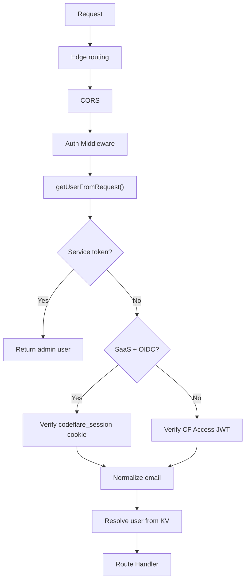

# Authentication & Billing

Dual authentication (Cloudflare Access and GitHub OIDC), SaaS mode, subscription tiers, Stripe billing, and user provisioning.

**Audience:** Operators, Developers

---

## Authentication Modes

Codeflare supports two fundamentally different authentication flows. Both can involve GitHub login, but they are completely separate mechanisms:

| | CF Access (with GitHub as IdP) | Direct GitHub OAuth |
|---|---|---|
| **When** | Default, onboarding, or SaaS without `OAUTH_CLIENT_ID` | SaaS mode with `OAUTH_CLIENT_ID` configured |
| **Auth layer** | Cloudflare Access (external service) | Worker handles auth directly |
| **Login page** | CF Access branded login page | Codeflare login page (`/login`) |
| **GitHub role** | One of several IdPs configured in CF Access dashboard | The sole auth provider, managed by the Worker |
| **OAuth flow** | CF Access → GitHub → CF Access issues `CF_Authorization` JWT | Worker → GitHub → Worker issues `codeflare_session` JWT |
| **JWT issuer** | Cloudflare (RS256, verified via JWKS) | Worker (HMAC-SHA256, verified via `OAUTH_JWT_SECRET`) |
| **Cookie** | `CF_Authorization` (managed by CF Access) | `codeflare_session` (HttpOnly, Secure, SameSite=Lax, 1h) |
| **Session lifetime** | Managed by CF Access policy | 1h TTL, auto-refreshed when < 15 min remaining |
| **User management** | CF Access groups + email allowlists | Worker KV records, JIT provisioning |
| **Setup wizard** | Creates CF Access app, groups, policies | No CF Access resources created |
| **Cost** | Free for 50 users, $3/user/month after | Free for unlimited users |
| **E2E auth** | `CF_ACCESS_CLIENT_SECRET` (sent as CF Access + service headers) | `OAUTH_E2E_TEST_SECRET` (sent as `X-Service-Auth` only) |
| **Logout** | `/cdn-cgi/access/logout` (CF Access system endpoint) | `/auth/github/logout` (clears `codeflare_session` cookie) |

The frontend always calls `/auth/logout` — the backend dispatches to the correct logout flow based on mode.

### Auth Resolution Order

`getUserFromRequest()` in `src/lib/access.ts` checks auth methods in this order:

1. **Service token** (`X-Service-Auth` header) — E2E testing, all modes. Constant-time comparison against `SERVICE_AUTH_SECRET`.
2. **Direct GitHub OAuth** (`codeflare_session` cookie) — only when `SAAS_MODE=active` AND `OAUTH_CLIENT_ID` is set. HMAC-SHA256 JWT verified against `OAUTH_JWT_SECRET`. When this branch is entered, CF Access is never checked.
3. **Cloudflare Access** (`cf-access-jwt-assertion` header or `CF_Authorization` cookie) — all other modes. RS256 JWT verified against CF Access JWKS endpoint.
4. **Pre-setup fallback** (`cf-access-authenticated-user-email` header) — trusted only before setup completes (bootstrap problem — auth isn't configured yet).

### Direct GitHub OAuth Flow

When `SAAS_MODE=active` and `OAUTH_CLIENT_ID` is configured, the Worker handles the entire OAuth flow with no CF Access involvement:

```
User clicks "Sign in with GitHub" on /login
  → GET /auth/github/login
  → Set oauth_state cookie (random UUID, 5-min TTL)
  → 302 to github.com/login/oauth/authorize?client_id=...&scope=user:email
  → User authorizes on GitHub
  → GitHub redirects to /auth/github/callback?code=...&state=...
  → Worker validates state (cookie vs query param, not KV — avoids eventual consistency)
  → Worker exchanges code for access token via GitHub API
  → Worker fetches verified email from /user + /user/emails
  → Worker signs HMAC-SHA256 JWT with OAUTH_JWT_SECRET
  → Set-Cookie: codeflare_session (HttpOnly, Secure, SameSite=Lax, Max-Age=3600)
  → Redirect to /app/ (active user) or /app/subscribe (pending user)
```

- GitHub access token used ephemerally during callback, then discarded (not stored)
- Only `primary: true, verified: true` emails accepted from GitHub API
- OAuth error codes allowlisted: `access_denied`, `redirect_uri_mismatch`, `application_suspended`
- Callback rate-limited (10/min per IP)
- Missing `OAUTH_JWT_SECRET` throws `AuthError` (fail-loud — never silently falls through to CF Access)
- Cookie auto-refreshed by middleware in `index.ts` when < 15 min remaining on any response

### CF Access Flow

When `OAUTH_CLIENT_ID` is NOT set, Cloudflare Access handles authentication:

```
User visits protected URL (/app, /api/*, /setup)
  → CF Access intercepts (302 to CF Access login page)
  → User picks identity provider (GitHub, Google, etc.)
  → IdP OAuth flow (managed entirely by CF Access)
  → CF Access issues CF_Authorization cookie (RS256 JWT)
  → Request reaches Worker with cf-access-jwt-assertion header
  → Worker verifies JWT signature via JWKS (https://{authDomain}/cdn-cgi/access/certs)
  → Worker extracts email, normalizes, resolves user from KV
```

**Email Normalization:** Trimmed + lowercased before KV lookup, role resolution, and bucket name derivation.

**Service Token:** `CF-Access-Client-Id` + `CF-Access-Client-Secret` headers. Mapped to email via `SERVICE_TOKEN_EMAIL`.

### CF Access Resources

These resources are created by the setup wizard only when GitHub OAuth is NOT configured:

**Access Application:** One self-hosted app with five destinations: `/app`, `/app/*`, `/api/*`, `/setup`, `/setup/*`. Including exact + wildcard variants removes ambiguity.

**Access Groups:** Per-worker groups: `<worker-name>-admins`, `<worker-name>-users`. Setup upserts both, stores IDs in KV. `/api/users` syncs group membership via `syncAccessPolicy()` after user mutations. `GET /api/setup/prefill` reads existing membership for redeploy prefill. Admin-only deployments (0 regular users) are supported: the users group is skipped and the policy references only the admin group.

When `OAUTH_CLIENT_ID` IS set: no CF Access groups or policies are created. The Worker handles user management directly via KV records.

### E2E Testing Auth

E2E tests authenticate via `X-Service-Auth` header in all modes. The secret comes from:
- **CF Access mode:** `CF_ACCESS_CLIENT_SECRET` environment secret (also sent as CF Access headers for the gateway)
- **Direct GitHub OAuth mode:** `OAUTH_E2E_TEST_SECRET` environment secret (no CF Access headers needed)

Both are deployed as `SERVICE_AUTH_SECRET` on the Worker. When neither is set, service auth is disabled.

### Root Redirect

- Setup incomplete -> redirect to `/setup`
- Setup complete, default mode -> `/` redirects to `/app/`
- Setup complete, onboarding mode -> authenticated users to `/app/`, unauthenticated to public landing
- Setup complete, SaaS mode -> `/` shows login page with "Sign in with GitHub" button

### Auth Flow



## User Identity

### Per-User Bucket Naming

`user@example.com` -> `codeflare-user-example-com` (sanitized, max 63 chars).

### Bucket Auto-Creation

**File:** `src/lib/r2-admin.ts` - `createBucketIfNotExists()` via Cloudflare API on first container start.

---

## SaaS Mode

When `SAAS_MODE=active`, Codeflare replaces the Cloudflare Access interstitial with a branded login page. New users are auto-provisioned with `pending` subscription tier and require admin approval. This section documents the complete SaaS auth flow from initial setup through user approval to session management.

### Deployment Modes

| Mode | Auth provider | User provisioning | Access control |
|------|--------------|-------------------|----------------|
| **Default** (no `SAAS_MODE`) | Cloudflare Access (JWT) | Manual allowlist via setup wizard | CF Access policies + KV allowlist |
| **SaaS** (`SAAS_MODE=active`) | Custom login page + CF Access IdP hints | Auto-provisioned on first login | Three-tier middleware + KV subscription tiers |

### Complete SaaS Authentication Flow

The diagram below shows the entire journey from first visitor to active user (self-service subscription flow):

```mermaid
flowchart TD
    A["Visitor arrives at domain"] --> B["CF Access intercepts request<br/>(no JWT cookie)"]
    B --> C{"Access policy<br/>login_method check"}
    C -->|not authenticated| D["Redirect to GitHub OAuth<br/>(auto_redirect_to_identity=true)"]
    D --> E["User completes GitHub login"]
    E --> F["CF Access mints JWT<br/>(CF_Authorization cookie)"]
    F --> G["Redirect to /app/<br/>with CF_Authorization cookie"]
    G --> H["Request reaches Worker<br/>with CF Access JWT"]
    H --> I["authenticateRequest verifies JWT<br/>from JWKS at auth_domain"]
    I --> J["Extract user email<br/>from JWT claims"]
    J --> K{"User in KV?<br/>user:{email} record"}
    K -->|no| L["JIT Provision:<br/>new record with pending tier"]
    K -->|yes| M["Load existing<br/>subscription tier"]
    L --> N["requireActiveUser check"]
    M --> N
    N -->|tier=pending| O["Redirect to /app/subscribe"]
    N -->|active tier| P["Allow IDE access"]
    N -->|tier=blocked| Q["Show blocked message"]
    O --> R["SubscribePage Phase 1:<br/>features + status"]
    R --> R2["User clicks<br/>See subscription plans"]
    R2 --> R3["Phase 2: lifeline rail<br/>5 tiers + detail panel"]
    R3 --> S["User selects tier +<br/>completes Turnstile CAPTCHA"]
    S --> T["POST /api/auth/subscribe<br/>{ tier, turnstileToken }"]
    T --> U["Verify Turnstile token"]
    U --> V["Write subscriptionTier +<br/>accessTier + subscribedAt +<br/>subscribedMode + trialUsed to KV"]
    V --> W{"First time?"}
    W -->|yes| X["Redirect to /app/onboarding"]
    X --> P
    W -->|no| P
    P --> AC["Session created with tier"]
    AC --> AD["Tier controls session mode +<br/>max sessions + usage quota"]
```



This flow highlights the key architectural choice: **CF Access handles authentication (identity), while the Worker handles authorization (access control)**. CF Access only knows "is this person GitHub-authenticated?" while the Worker enforces the business logic: "is this person an approved tier?"

### Three-Tier Auth Middleware

SaaS mode uses a layered middleware stack on every request to protected routes. See `src/middleware/auth.ts`:

1. **`requireIdentity`** — Resolves the user from CF Access JWT (verified via JWKS at auth_domain). If the user is not in KV, auto-provisions them with `pending` tier via `resolveOrProvisionUser()`. Sets `c.get('user')` with email, role, subscriptionTier, and accessTier. Used for endpoints like `/api/auth/status` and `/api/auth/subscribe` where pending users need access to the subscribe page flow.

2. **`requireActiveUser`** — Authenticates (same as requireIdentity) then checks `subscriptionTier ?? accessTier` is an active tier (free/trial/standard/advanced/max/unlimited) via `isActiveTier()`. When SAAS_MODE is active:
   - Pending users get 403 JSON: `{ error: 'Access denied', code: 'PENDING' }` -- frontend catches this and redirects to `/app/subscribe`
   - Blocked users get 403 JSON: `{ error: 'Access denied', code: 'BLOCKED' }`
   - Active tier users pass through

   When SAAS_MODE is NOT active, requireActiveUser behaves identically to requireIdentity (no tier checking, backward compat). Also exported as `authMiddleware` alias for backward compatibility.

3. **`requireAdmin`** — Checks `role === 'admin'`. Must be used AFTER requireIdentity or requireActiveUser. Used for `/admin/*` and user management endpoints.

---

## Subscription System

### Subscription Tiers

Codeflare uses a multi-tier subscription system that controls monthly compute hours, max concurrent sessions, and session modes. Tier IDs: `blocked`, `pending`, `free`, `trial`, `standard`, `advanced`, `max`, `unlimited`. Pricing is configurable per deployment via the admin Subscription Management panel and Stripe integration.

**Tier properties (in `SubscriptionTierConfig`):**
- `id: SubscriptionTier | string` — unique tier identifier
- `displayName: string` — user-friendly name
- `monthlySeconds: number | null` — monthly compute quota in seconds (null = unlimited)
- `maxSessions: number` — max concurrent running sessions
- `sessionModes: SessionMode[]` — allowed modes (`default`, `advanced`, or both)
- `canLogin: boolean` — whether users can authenticate (pending=true, blocked=false)
- `priceMonthly: number | null` — Standard mode price in cents; null = not purchasable
- `advancedPriceMonthly?: number | null` — Pro mode price in cents (optional)
- `trialQuotaHours: number` — hours of free usage before billing; 0 = no trial
- `description: string` — short description (max 200 chars)
- `order: number` — display order in admin UI
- `isDefault: boolean` — fallback tier for undefined/missing users (currently `standard`)
- `maxStorageBytes?: number | null` — persistent storage quota (null = unlimited)

**Default tier configuration** (from `getDefaultTiers()` in `src/lib/subscription.ts`):

| ID | Display Name | Hours/Month | Sessions | Modes | Storage |
|----|-------------|-------------|----------|-------|---------|
| `blocked` | Blocked | 0 | 0 | — | 0 |
| `pending` | Pending | 0 | 0 | — | 0 |
| `free` | Free | 4h | 1 | Standard | 250 MB |
| `trial` | Trial | 5h | 2 | Standard | 500 MB |
| `standard` | Starter | 40h | 1 | Standard, Pro | 500 MB |
| `advanced` | Advanced | 80h | 2 | Standard, Pro | 1 GB |
| `max` | Max | 160h | 3 | Standard, Pro | 2 GB |
| `unlimited` | Custom | Unlimited | 5 | Standard, Pro | Unlimited |

Prices, trial hours, and other operational parameters are configurable per deployment via the admin Subscription Management panel. Prices come from Stripe via admin-configured `stripePriceId` per tier (CF-027).

**Graceful degradation:** When `STRIPE_SECRET_KEY` is not set, all tiers work via direct `POST /api/auth/subscribe` without payment. Useful for development, self-hosted, and non-SaaS deployments. Billing status fields remain null.

See [Self-Service Subscription Flow](#self-service-subscription-flow-current) for the complete flow.

**Tier storage and caching:**
- Tiers are stored in the KV record at `user:{email}` in the `subscriptionTier` field
- Default tier config is hardcoded in `src/lib/subscription.ts:getDefaultTiers()`
- Admins can customize tiers via `/admin/subscriptions` page → `PUT /api/admin/tiers` → `tiers:config` KV key
- `getTierConfig()` reads from KV with **60-second module-level TTL**, falling back to defaults if unavailable
- Admin changes take effect within 60 seconds (per isolate cache refresh)
- Cache can be reset via `resetTierConfigCache()` (used in tests)

**Tier resolution logic (in `src/lib/subscription.ts`):**
- `isActiveTier(tier)` — returns true for free/trial/standard/advanced/max/unlimited (undefined → true for backward compat)
- `getUserTier(tierValue, tiers)` — resolves tier config; falls back to the tier with `isDefault: true`
- `getMaxSessionsForTier(tierValue, tiers)` — max concurrent sessions allowed
- `getAllowedSessionModes(tierValue, tiers)` — list of session modes allowed

**Backward compatibility:**
- Legacy `accessTier` field (4-tier system: pending/standard/advanced/blocked) is maintained in KV
- Code reads `subscriptionTier` first, falls back to `accessTier` for pre-migration users
- Non-SaaS users without a tier default to `unlimited` access
- Legacy bridge in `src/lib/access-tier.ts` delegates to `subscription.ts`

---

## Stripe Payment Integration

When `STRIPE_SECRET_KEY` is set as a Worker secret, paid tiers (standard, advanced, max) require Stripe Checkout before activation. Free tier remains direct (no payment). When the secret is absent, all tiers work via direct KV (dev/self-hosted mode).

**Architecture — Signal and Sync pattern:**
Webhooks are signals that trigger a fetch of the latest state from the Stripe API. KV is a read cache, not the source of truth. This eliminates race conditions from incremental KV patching and ensures KV always reflects the latest Stripe state.

- Library: `src/lib/stripe.ts` — checkout session creation, webhook signature verification, `fetchSubscription()` (Signal and Sync), Stripe API communication; `getStripePrices()` expands `currency_options` from the Stripe API and returns amounts in the requested currency
- Currency detection: `src/lib/currency.ts` — `getCurrencyForCountry(country)` maps a 2-letter ISO country code to a supported currency (CHF/USD/EUR/GBP). Implements [REQ-SUB-020](../sdd/subscription.md#req-sub-020).
- Billing routes: `src/routes/billing.ts` — `POST /api/billing/checkout` (authenticated), `GET /api/billing/status` (Stripe-verified), `POST /api/billing/switch` (portal deep-link for plan changes)
- Webhook: `src/routes/stripe-webhook.ts` — `POST /public/stripe/webhook` (unauthenticated, HMAC-verified), `syncSubscriptionState()`
- Types: billing fields defined in `parseUserRecord` Zod schema in `src/lib/user-record.ts`

**Checkout flow:**
1. User selects paid tier on subscribe page → frontend calls `POST /api/billing/checkout` with `{ tier, mode }`
2. Backend detects visitor currency from the `CF-IPCountry` request header via `getCurrencyForCountry()`, then creates a Stripe Checkout Session with `customer_email`, tier/mode metadata, and the detected `currency`
3. Frontend redirects to Stripe-hosted checkout page
4. After payment, Stripe redirects to `/app/subscribe?checkout=success`
5. Frontend polls `GET /api/auth/status` every 2s (max 30s) waiting for webhook to activate the subscription
6. Stripe sends `checkout.session.completed` webhook → handler maps email→customer, writes checkout fields, then calls `syncSubscriptionState()`

**Webhook events handled (3 events):**
- `checkout.session.completed` — maps email→customer in KV, writes `subscribedAt`/`checkoutSessionId`, calls `syncSubscriptionState()`, then sends admin notification email (best-effort)
- `customer.subscription.updated` — delegates entirely to `syncSubscriptionState()` (handles plan changes, renewals, payment status changes via Customer Portal)
- `customer.subscription.deleted` — writes `billingStatus: 'canceled'`, resets tiers to `free` directly (subscription is gone from Stripe, can't fetch)

**`syncSubscriptionState(customerId, subscriptionId, env)`:**
1. Resolves email from customer ID (KV lookup with Stripe API fallback)
2. Calls `fetchSubscription()` — fetches latest subscription state from `GET /v1/subscriptions/{id}?expand[]=items.data.price`
3. Timestamp guard: skips write if KV's `lastSyncedAt` > now (prevents stale webhook from overwriting newer state)
4. Builds KV patch from snapshot — only sets tier/mode if price metadata is present (preserves existing values when null)
5. Writes via `updateUserRecord()` (preserves existing KV fields like `addedBy`, `onboardingComplete`)
6. **Auto-reconcile on any mode change:** `reconcileAgentConfigs(overwrite: true, cleanup: true)` runs on upgrade (default → advanced), downgrade (advanced → default), and subscription termination (`customer.subscription.deleted`, forced to default mode). Seeds the correct preseed set, overwrites existing preseed files, and removes files not in the new mode. Also updates `sessionMode` in user preferences to match. Non-fatal (try/catch) — if R2 fails, user can manually recreate via Settings. Implements [REQ-SUB-015](../sdd/subscription.md#req-sub-015) AC6–AC7.

**Admin checkout notification:** After `syncSubscriptionState` completes in `handleCheckoutCompleted`, sends `sendSubscriptionAdminNotification` to admin emails with the user's tier and mode. Best-effort (fire-and-forget).

**Welcome email dedup:** JIT-provisioned users in SaaS mode receive a welcome email on first login. A `welcome-sent:{email}` KV flag with 24h TTL prevents duplicate sends from concurrent first-login requests (HTTP + WebSocket auth race). The flag doesn't fully close the race window (KV is eventually consistent) but narrows it from guaranteed duplicates to milliseconds.

**Stripe receipts:** User-facing payment receipts are handled by Stripe's native "Email receipts" setting (Stripe Dashboard > Settings > Emails). No code needed — works for all subscription invoices.

**Price metadata:** Tier and mode are stored as metadata on Stripe Price objects (`price.metadata.tier`, `price.metadata.mode`). This eliminates reverse price-to-tier lookups and the hardcoded dev price map. Prices must have metadata set in the Stripe Dashboard before deploy.

**Security:**
- Webhook endpoint at `/public/stripe/webhook` bypasses CF Access (same pattern as `/public/auth/providers`)
- HMAC-SHA256 signature verification using `STRIPE_WEBHOOK_SECRET` via `crypto.subtle.timingSafeEqual()`
- 5-minute timestamp tolerance prevents replay attacks
- Event deduplication via KV key `stripe:event:{eventId}` with 72-hour TTL

**Customer mapping:** `stripe-customer:{customerId}` → email stored in KV on checkout completion. Subsequent webhook events use this mapping to resolve the user.

**KV fields added to user record (billing):**
- `stripeCustomerId` — Stripe customer ID
- `stripeSubscriptionId` — Stripe subscription ID
- `stripePriceId` — Active Stripe price ID
- `billingPeriodEnd` — ISO timestamp of current billing period end
- `checkoutSessionId` — Stripe checkout session ID
- `billingStatus` — `active`, `trialing`, `past_due`, or `canceled` (matches `BillingStatus` type)
- `lastSyncedAt` — ISO timestamp of last sync from Stripe API (timestamp guard for idempotency)
- `cancelAtPeriodEnd` — whether the subscription will cancel at period end

**Stripe gate:** When `STRIPE_SECRET_KEY` is set, `POST /api/auth/subscribe` rejects paid tiers with "Paid subscriptions require checkout." Only `free` tier is allowed through the direct subscribe endpoint. This ensures payment is collected before tier activation.

**Price resolution:** `getStripePriceId(tier, mode, tiers)` and `resolveTierFromPriceId(priceId, tiers)` both require tier config (KV-sourced). No dev fallback — prices must be configured in tier config or via Stripe Price metadata.

**Tier visibility:** `GET /api/auth/tiers` only returns tiers where `stripePriceId` is configured (or `priceMonthly === 0` for free, or `id === 'unlimited'` for Custom/contact tier). Paid tiers without price IDs are hidden from the subscribe page — prevents broken checkout buttons on first deploy before admin configures Stripe.

**Trial enforcement:**
- `trialUsed` set to `true` in `syncSubscriptionState` when `snapshot.status` transitions away from `'trialing'`. Prevents unlimited free trials via subscribe→cancel→resubscribe.
- `endTrialNow` in Timekeeper DO guarded by `trialEnded` flag in DO storage — called once, not every 60s ping. Prevents O(sessions) Stripe API calls per minute when quota exceeded.
- `lastSyncedAt` timestamp guard uses `>` (not `>=`) so same-second webhook events are not silently discarded.

**Atomic writes:** `subscribe` and `request-access` handlers use `updateUserRecord()` (atomic read-merge-write) instead of raw `KV.put` with manual spread. Prevents concurrent webhook writes from losing billing fields.

**Billing enforcement (`getEffectiveTier()` in `src/lib/subscription.ts`):**
Uses `BILLING_STATUS` constants from `types.ts` for type-safe comparisons (not raw strings). `BillingStatus` union type: `'active' | 'trialing' | 'past_due' | 'canceled'`. `StripeSubscriptionSnapshot.status` remains `string` since Stripe may return statuses outside this enum (e.g., `'incomplete'`). The `parseUserRecord` Zod schema uses `.catch(undefined)` to gracefully handle unexpected values from KV.

Downgrade rules for paid tiers (standard/advanced/max):
- `billingStatus === BILLING_STATUS.CANCELED` → immediate downgrade to `free` (no grace period)
- `billingStatus === BILLING_STATUS.PAST_DUE` + future `billingPeriodEnd` → keep paid tier (grace period)
- `billingStatus === BILLING_STATUS.PAST_DUE` + expired/missing `billingPeriodEnd` → downgrade to `free`
- `billingPeriodEnd` expired + `billingStatus === BILLING_STATUS.ACTIVE` → downgrade to `free` (catches missed webhooks, CF-015)

The stored `subscriptionTier` is preserved in KV so resubscription restores the correct plan. Enforcement is read-time, not write-time.

Enforcement points:
- `GET /api/auth/status` — returns effective tier (free) to frontend
- `requireActiveUser` middleware — tier gating uses effective tier
- Container start paygate — quota and session limits use effective tier
- `billingStatus` field on `AccessUser` — populated during authentication from KV
- `subscribedMode` field on `AccessUser` — populated during authentication from KV. Used by `preferences.ts` Pro gate and `usage.ts` mode display. Source of truth for Pro access (set by Stripe webhook via `syncSubscriptionState` or by admin via `PATCH /api/users`). JIT-provisioned users default to `'default'`.

Exempt tiers: `free` (no billing), `unlimited` (enterprise/admin-managed), `pending`, `blocked`.

**Emails:** Stripe does NOT send emails in test/sandbox mode — only in live mode. Subscription invoices use `collection_method=charge_automatically` with `auto_advance=false` (Checkout handles payment), so `POST /v1/invoices/{id}/send` is invalid. Custom transactional emails via Resend API: welcome email (JIT provision, deduped via KV flag), subscription confirmation (checkout.session.completed webhook), admin new-subscriber notification (same webhook). Subscription email includes plan details and portal management link. Unified tagline across login, subscribe, usage pages, emails, and README: "An ephemeral IDE where AI coding agents reach their full potential."

**Customer Portal (`POST /api/billing/portal`):**
Creates a Stripe Billing Portal session for subscription management (cancel, update payment method, view invoices). Requires authenticated user with `stripeCustomerId` in KV. Returns `{ portalUrl }` for frontend redirect. Rate-limited 5/min.

**Plan switching (`POST /api/billing/switch`):**
Creates a portal session with `flow_data[type]=subscription_update_confirm` that deep-links directly to the Stripe confirmation page with the new price pre-selected. Skips the portal's sparse plan list — users compare plans on the Codeflare subscribe page (rich features, hours, sessions) and only see Stripe for payment confirmation. Requires `subscriptionItemId` from `fetchSubscription()`. Falls back: if the subscription no longer exists on Stripe, cleans up stale KV fields and returns an error so the frontend redirects to checkout. After confirmation, redirects back to `/app/`. Plan changes trigger `customer.subscription.updated` webhook → `syncSubscriptionState()` picks up the change.

**Billing status (`GET /api/billing/status`):**
Returns live billing state verified against Stripe API (source of truth). When a `stripeSubscriptionId` exists, calls `fetchSubscription()` to verify the subscription still exists. If gone, resets billing fields (`subscriptionTier`/`accessTier` → `pending`, `billingStatus` → `canceled`) and returns null fields. Identity fields (`addedBy`, `addedAt`, `role`) are never touched during cleanup. Falls back to KV data if Stripe is unavailable or not configured. The subscribe page calls this on load to determine whether to show "Subscribe" or "Switch Plan".

**Trial model:**
Every paid tier has a configurable `trialQuotaHours` (set via admin Subscription Management panel). Trial is compute-based, not time-based.

Flow: (1) New user checks out → Stripe creates subscription with `trial_period_days: 30` (billing window). No charge yet. (2) Timekeeper enforces `trialQuotaHours` as the compute cap during trial. (3) When trial compute quota is consumed → `endTrialNow()` calls Stripe API to end trial immediately → first charge. (4) If payment succeeds → full monthly quota unlocks. If fails → `billingStatus: 'past_due'` → downgraded to free. (5) `trialUsed: true` set in KV → subsequent checkouts skip trial (immediate charge).

Key: Stripe's `trial_period_days: 30` is just a maximum billing window. The per-tier `trialQuotaHours` is the real limit. Stripe cannot enforce compute hours — we end the trial programmatically when the quota is hit.

`endTrialNow(subscriptionId, secretKey)` in `src/lib/stripe.ts` calls `POST /v1/subscriptions/{id}` with `trial_end=now`.

**Timekeeper trial enforcement:** The Timekeeper DO's ping handler checks `billingStatus === 'trialing'` and uses `trialQuotaHours` (from tier config) as the compute cap instead of `monthlySeconds`. When trial quota is consumed, Timekeeper calls `endTrialNow()` to end the Stripe trial and trigger the first charge. After the trial ends, the subscription moves to `active` and the full `monthlySeconds` quota applies.

### Timekeeper DO (Usage Tracking)

One Timekeeper Durable Object per user tracks compute usage. Container DOs ping Timekeeper with monotonic `totalSeconds` per session every 60 seconds (when `SAAS_MODE=active`, bucket name and user email are set, and TIMEKEEPER binding exists). Timekeeper computes deltas, accumulates `pendingSeconds`, and flushes to KV via alarm every 5 minutes. Note: `STRESS_TEST_MODE` only bypasses rate limits and session limits — it does NOT block Timekeeper pings (usage tracking always runs).

```
Container DO (session 1) ── ping ──→ Timekeeper DO (user X)
Container DO (session 2) ── ping ──→ Timekeeper DO (user X)
                                           │
                                  flush every 5 min (alarm)
                                           │
                                           ▼
                                KV: timekeeper:{bucketName}
```

**Ping handler** (`POST /ping`): receives `{ bucketName, sessionId, totalSeconds, email }`, computes delta per session, accumulates pendingSeconds, arms alarm, performs quota check. Returns `{ quotaExceeded, totalMonthlySeconds }`.

**Usage query** (`GET /usage`): returns real-time usage (KV flushed + pending). Used by paygate and `/api/usage` route.

**Alarm flush**: reads KV record, adds pendingSeconds to daily/weekly/monthly/yearly/allTime counters, handles rollovers, writes back. Resets pendingSeconds only after successful KV write. Retries on failure (30s backoff).

**Mid-session eviction**: when Timekeeper returns `quotaExceeded: true`, the Container DO calls `stop('SIGTERM')` for graceful shutdown.

KV value shape at `timekeeper:{bucketName}`:
```typescript
interface UsageRecord {
  today:     { date: string; seconds: number };     // "2026-03-18"
  thisWeek:  { weekStart: string; seconds: number }; // "2026-03-17" (Monday)
  thisMonth: { month: string; seconds: number };     // "2026-03"
  thisYear:  { year: string; seconds: number };      // "2026"
  allTime:   { seconds: number };
  lastUpdatedAt: string;
}
```

### Paygate Enforcement

Session start (`POST /api/container/start`) checks tier-based usage quota in `validateSessionAndCheckLimits()`:
1. Resolves user's tier from `subscriptionTier ?? accessTier`
2. Reads monthly usage from `timekeeper:{bucketName}` KV
3. Compares against `tier.monthlySeconds` (skip for `null`/unlimited)
4. Throws `QuotaExceededError` (HTTP 402, code `QUOTA_EXCEEDED`) if exceeded
5. Skips for non-SaaS mode and stress test mode, fail-open on KV errors

Frontend detects `code === 'QUOTA_EXCEEDED'` via `ApiError.code` field and shows upgrade CTA.

### Subscribe Page (Unified Layout)

All users land on `/app/subscribe` with an identical two-phase layout. The only differences are data-driven (status text, button labels, current tier highlight).

**Phase 1 — Home view** (initial landing):
- Logo, ScrambleText title, subtitle
- Feature highlights list (6 items with MDI icons: instant startup, cross-device, GitHub/Cloudflare, encryption, mobile-optimized, fast deployment)
- Status area (varies by user state — see below)
- "See subscription plans" button → transitions to Phase 2, scrolls to top

**Phase 2 — Plan view** (after clicking "See subscription plans"):
- Replaces Phase 1 content entirely (same logo/title/subtitle remain)
- **Mode card**: merged card with Standard/Pro toggle at top. Standard features always visible; Pro features animate in via CSS `grid-template-rows: 0fr → 1fr` transition with `useScrambleText` decrypt animation on all Pro text. Pro toggle disabled for tiers that only support Standard (e.g. Free). Toggling Standard/Pro does not change scroll position
- **Lifeline rail**: horizontal rail with 5 plan stops (Free → Starter → Advanced → Max → Custom — mapping to tier IDs `free`, `standard`, `advanced`, `max`, `unlimited`), each with MDI icon. Straight horizontal dashed line using `var(--color-accent)` (theme-responsive via `color-mix()` for opacity variants). Default: `advanced` for pending users, `currentTierId` for active users. Selected stop has wider horizontal padding (0.75rem) for breathing room. "This is you" marker (green, pulsing, arrow-above-text column layout) at active user's current plan. Dashed track positioned at `top: 18px` (half of 36px icon, 16px on mobile for 32px icons)
- **Detail panel**: single panel showing selected tier's name, price (large, switches between `priceMonthly` and `advancedPriceMonthly` based on Standard/Pro toggle), tagline, hours/month, sessions, feature checklist, trial badge, CTA button. Tier name, price, and specs use `useScrambleText` for decrypt animation on selection change
- **Action buttons**: "Get Started" (free) / "Start Trial" (paid with `trialQuotaHours > 0`) / "Switch Plan" (active, different tier) / "Current Plan" (active, same tier, disabled)
- Turnstile CAPTCHA (pending users only — rendered via explicit `turnstile.render()` since widget mounts after script auto-scan)
- "Back" button returns to Phase 1

**Status text by user state** (replaces SVG icons — styled as JetBrains Mono, 1.5rem, bold):
| State | Text | Color | Additional |
|-------|------|-------|-----------|
| Pending | "Not Subscribed" | Orange (`#f97316`) | Email badge |
| Active | "Subscribed" | Green (`#22c55e`) | Email badge + "Continue" link to `/app/` |
| Blocked | "Blocked" | Red (`#ef4444`) | Blocked message, no tier button |

**Per-tier feature bullets** (`TIER_FEATURES` in `SubscribePage.tsx`):
- Free (`free`): All agents, persistent cloud storage, GitHub & Cloudflare deploy
- Starter (`standard`): Everything in Free, unlocks Pro mode, configurable idle timeout, priority support
- Advanced (`advanced`): Everything in Starter, run {sessions} sessions at once, parallel branches, priority support
- Max (`max`): Everything in Advanced, run {sessions} sessions at once, 4x compute, OpenClaw Integration (COMING SOON)
- Custom (`unlimited`): Everything in Max, unlimited compute hours, run {sessions} sessions at once, OpenClaw Integration (COMING SOON), dedicated support

The `{sessions}` placeholder is replaced at render time with `selectedTier().maxSessions` from admin config. Icon lookup uses `getFeatureIcon()` which pattern-matches `Run \d+ sessions at once` for the dynamic text.

Features in the `COMING_SOON_FEATURES` set render with an inline accent-colored uppercase badge.

**Current subscription indicator:** Active subscribers see a green border on their subscribed tier's lifeline icon (`subscribe-lifeline-icon--current`) and mode toggle button (`subscribe-mode-toggle-btn--current`). No text labels.

**Content width:** Phase 1 uses narrow layout (`login-content`), Phase 2 uses wide layout (`subscribe-content`, max-width 680px). Mobile: mode card compacts, lifeline labels shrink, 44px minimum tap targets.

### Login Redirect Flow

1. New user logs in → always lands on `/app/subscribe` (Phase 1 with orange "Not Subscribed" status text)
2. User clicks "See subscription plans" → Phase 2
3. User picks a tier + verifies Turnstile → `POST /api/auth/subscribe` → sets subscription
4. First-time user → redirect to `/app/onboarding`
5. Returning user (already subscribed) → sees Phase 1 with green "Subscribed" status text + Continue link

Priority in `AppContent.onMount` (`web-ui/src/App.tsx`): pending tier → subscribe page, !onboardingComplete → onboarding, otherwise → dashboard.

### Self-Service Subscribe API

**`POST /api/auth/subscribe`** (requires identity, rate-limited 3/min):
- Request body: `{ tier: string, turnstileToken: string, mode?: 'default' | 'advanced' }`
- Validates Turnstile token (if `TURNSTILE_SECRET_KEY` is configured)
- Validates tier is in subscribable set: `free`, `standard`, `advanced`, `max`, `unlimited`
- Resolves tier config via `getTierConfig()` to extract `trialQuotaHours`
- Writes to KV record at `user:{email}`:
  - `subscriptionTier`: the selected tier
  - `accessTier`: backward-compat legacy tier value
  - `subscribedAt`: ISO timestamp of subscription
  - `subscribedMode`: `'default'` or `'advanced'` (the mode the user selected on the subscribe page)
  - `trialUsed`: `false` (boolean, tracks whether trial quota has been consumed)
- Response: `{ success: boolean, tier: string, trialQuotaHours: 0, trialUsed: boolean, onboardingComplete: boolean }` (trialQuotaHours is always 0 — reserved for future billing)
- Sends subscription confirmation email via `waitUntil` (non-blocking, non-fatal) using `sendSubscriptionEmail()` from `src/lib/email.ts`
- Idempotent: if switching to same tier and mode (`subscribedAt` exists, tier and mode both match), returns success with current tier. Switching to a different tier or mode re-writes the KV record

**`GET /api/auth/tiers`** (requires identity) and **`GET /public/tiers`** (unauthenticated, only available when `ONBOARDING_LANDING_PAGE=active`):
- Both return subscribable tier configs: `free`, `standard`, `advanced`, `max`, `unlimited` (filtered from full 8-tier config)
- The frontend SubscribePage uses `/api/auth/tiers` (identity-gated) via `getPublicTiers()` in `web-ui/src/api/client.ts`; `/public/tiers` is gated behind onboarding landing page middleware
- **Multi-currency:** the tiers endpoint detects the visitor's currency from the `CF-IPCountry` request header via `getCurrencyForCountry()` and passes it to `getStripePrices()`, which fetches `currency_options` from the Stripe API. Returned `priceMonthly`/`advancedPriceMonthly` values are in the visitor's currency (CHF, USD, EUR, or GBP). Implements [REQ-SUB-020](../sdd/subscription.md#req-sub-020).
- Response: `{ tiers: SubscriptionTierConfig[] }` — each tier object includes all properties:
  - `id`, `displayName`, `monthlySeconds`, `maxSessions`, `sessionModes`
  - `priceMonthly` (cents, in visitor currency), `advancedPriceMonthly` (cents, in visitor currency, optional), `trialQuotaHours`, `description`
  - `order`, `canLogin`, `isDefault`
- Used by subscribe page to render tier selection cards
- Data is cached at 60-second TTL via `getTierConfig()`

### Admin Subscription Management

Standalone admin page at `/admin/subscriptions` (routes to `web-ui/src/components/admin/SubscriptionManagement.tsx`). Accessed via Settings > Administration > "Manage Subscriptions" button.

**Features:**
- Displays 6 editable tiers in a dropdown (free, trial, standard, advanced, max, unlimited; blocked/pending are read-only and hidden)
- Dropdown uses SolidJS `<For>` component (keyed rendering) + `createEffect` ref to preserve selection when tier data changes (prevents reset-to-first-item bug)
- Edit form allows customizing tier properties:
  - Monthly compute hours (seconds or null for unlimited)
  - Max concurrent sessions
  - Allowed session modes (checkboxes for default/advanced)
  - Monthly price (cents or null if not purchasable)
  - Trial period (days; 0 = no trial)
  - User-visible description (max 200 chars)
- Submit → `PUT /api/admin/tiers` → validates array of 8 tier objects → writes `tiers:config` to KV
- Admin changes take effect within 60 seconds (module-level cache refresh)
- Tier IDs and order cannot be changed (schema enforces exact match to defaults)

### Usage Pages + Header Inline Display

**`/app/usage`** (Usage page):
- Dark glass panel (matches subscribe detail panel styling) with plan name, percentage, horizontal progress bar (blue/yellow/red by threshold), used/total labels, and Today/Month/Quota stat row
- Polls `/api/usage` endpoint every 30 seconds for real-time data
- Routes to `web-ui/src/components/UsagePage.tsx`

**Header inline display** (Layout dropdown):
- User dropdown in header shows inline spent time next to "Usage" link
- Format: "X minutes / Y hours" (under 60m) or "X.X hours / Y hours" (60m+)
- Examples: "7 minutes / 160 hours", "1.7 hours / 160 hours"
- Styled at `0.75rem` font-size with `var(--color-text-secondary)` for mobile readability (was `0.65rem` / `--color-text-dimmed`)
- Computed from `getUsageState()` — a reactive SolidJS signal (`createSignal`) in session store, updated live via batch-status piggyback. Dropdown re-renders automatically when usage data changes (no page refresh needed)

**Warning banners** (Layout.tsx):
- Displayed at usage thresholds: 80%, 95%, 100% of monthly quota
- Color-coded: yellow (80%), orange (95%), red (100%)
- 80% and 95% banners include a dismiss button (×) — dismissal is persisted per UTC month in localStorage (`cf_dismissed_quota_{YYYY-MM}` key). A page reload does not re-surface the banner; dismissal resets automatically when the monthly quota rolls over. Dismissing the 95% banner also hides the 80% banner.
- 100% banner is not dismissible (blocks session creation)
- Uses `getUsageWarningLevel()` from session store; dismissed state managed by `getDismissedQuotaLevel()` / `setDismissedQuotaLevel()` exported from `session-usage.ts` (implements [REQ-SUB-018](../sdd/subscription.md#req-sub-018))
- "New Session" button disabled when quota is exceeded (`isAtUsageQuota()`)

### Migration Strategy

Deploy new code first (backward compat), then run migration script:
1. New code reads `subscriptionTier` first, falls back to `accessTier`
2. `scripts/migrate-tiers.ts` adds `subscriptionTier` to all `user:*` KV records
3. Admins → `unlimited`, missing → `standard` (SaaS) / `unlimited` (non-SaaS)
4. Old `accessTier` kept for rollback safety

### Session Limit Enforcement

In SaaS mode, `validateSessionAndCheckLimits()` resolves the effective max sessions from the user's tier config (`tier.maxSessions`) rather than using the role-based `MAX_SESSIONS_USER`/`MAX_SESSIONS_ADMIN` env vars. Falls back to role-based limits on KV error. This ensures free-tier users (maxSessions=1) cannot start multiple sessions even if the env var allows it.

### Session Mode Authorization

Session mode access requires **both** tier support AND an active Pro mode subscription:

**Frontend (`canUseAdvanced()` in SettingsPanel):** Admin bypass applies to tier check only (admins always pass tier support), NOT to mode check. Regular users AND admins need: (1) tier supports advanced (`advanced`, `max`, `unlimited`, or unset), AND (2) `subscribedMode === 'advanced'` in user KV record (set by subscribe endpoint, NOT the Settings preference toggle). Settings labels: "Standard" / "Pro" (renamed from "Default" / "Advanced").

**Two distinct mode fields:**
- `subscribedMode` (user KV record `user:{email}`) — what mode the user paid for on the subscribe page. Set by `POST /api/auth/subscribe`. Read by SettingsPanel (`canUseAdvanced` gate) and subscribe page (`currentMode` display). NOT changed by Settings toggle.
- `sessionMode` (preferences KV `user-prefs:{bucket}`) — what mode the next session uses. Changed by Settings toggle. Does NOT affect subscribe page display or Pro gate.

Users can freely toggle Standard/Pro in Settings within what they subscribed to. Switching to Standard in Settings does not lock Pro — the gate checks `subscribedMode`, not `sessionMode`. To change subscription mode, users go through the subscribe page.

**Backend (`canUseSessionMode()` / `allowedSessionModes()`):** The **hardcoded fast path** in `access-tier.ts:allowedSessionModes()` allows advanced for: `advanced`, `max`, `unlimited`, `undefined`. Tiers restricted to default only: `standard`, `free`, `trial`. The **config-aware path** (`canUseSessionModeWithConfig` / `getAllowedSessionModes()` from `subscription.ts`) reads from tier config — by default, `standard` allows `['default', 'advanced']` in `getDefaultTiers()`, so the config path is more permissive. Admin users always have advanced access regardless of stored tier.

### Batch-Status Usage Piggyback

The `GET /api/sessions/batch-status` response includes an optional `usage` field (SaaS mode only) with `{ dailySeconds, monthlySeconds, monthlyQuotaSeconds, tier }`. This is consumed by `refreshSessionStatuses()` in the frontend session store, which calls `setUsageState()` to update the usage warning level. The warning banners in `Layout.tsx` read from `getUsageWarningLevel()` which returns `'none'`, `'80'`, `'95'`, or `'100'` based on the percentage of monthly quota used. The `isAtUsageQuota()` function disables the "New Session" button in the Dashboard when quota is exceeded.

### Email Notifications

Notifications are sent via Resend API (`src/lib/email.ts`, sender: `RESEND_EMAIL` secret). The `sendEmail()` helper logs errors for non-ok responses and fetch failures. All email sending is non-blocking and non-fatal.

**Subscription emails** (`sendSubscriptionEmail`): Show old/new plan+mode (e.g. "Previous: Starter (Standard) → New: Advanced (Pro)"), compute hours, sessions, price (currency from `CF-IPCountry`), trial/billing status, activation timestamp, instance URL link, and "reply for support" footer. Price uses `advancedPriceMonthly` for Pro mode, hidden for free tier. Trial row shows "Xh free compute before billing" when active, "Monthly billing active" when trial used.

**Admin notifications** (`sendSubscriptionAdminNotification`): Same format as user email — old/new plan+mode, compute, sessions, price, billing, activation date. Sent to all admin-role users. Reply-to set to subscriber's email.

**Email triggers:** User confirmation + admin notification sent from subscribe endpoint via `waitUntil()`. `previousMode` read from preferences KV before overwrite. `previousTierName` resolved to display name via tier config lookup. `subscribedAt` formatted as human-readable date.

**`waitUntil` pattern:** The subscribe endpoint (`POST /api/auth/subscribe`) uses `c.executionCtx.waitUntil(sendSubscriptionEmail(...))` to ensure the email promise survives past the response. Without `waitUntil`, the Worker isolate may terminate the promise when `return c.json(...)` completes. The JIT provision welcome email in `access.ts` uses `void` (fire-and-forget) which is safe because the isolate remains alive during the request that continues to `requireActiveUser`.

**RESEND_API_KEY:** Must be set as a Worker secret via `wrangler secret put RESEND_API_KEY` (not just a GitHub Actions secret). GitHub Actions secrets are only available during CI builds, not in the deployed Worker runtime.

### Timekeeper Crash Resilience

The Timekeeper DO persists all critical state to DO storage: `pendingSeconds`, `sessionTotals`, `bucketName`, `email`, and `lastFlushedMonthlyTotal`. On cold start, the constructor restores all fields via `blockConcurrencyWhile()`. The `lastFlushedMonthlyTotal` is updated both after alarm flush (successful KV write) and after KV re-read during ping quota checks, ensuring accurate quota enforcement after DO eviction.

### Legacy AccessTier Backward Compatibility

The original 4-tier system (`pending`/`standard`/`advanced`/`blocked`) is preserved for backward compatibility. New code uses `subscriptionTier` with fallback to `accessTier`. When writing tier changes via `PATCH /api/users/:email`, both fields are written: `subscriptionTier` gets the exact new value, while `accessTier` gets the nearest valid legacy value (new tiers like `free`, `trial`, `max`, `unlimited` map to `'advanced'` in the legacy field).

**Admin PATCH schema fix:** The `kvUserSchema` in `PATCH /api/users/:email` validates existing KV records before merging. The `accessTier` field uses `SubscriptionTierSchema` (not `AccessTierSchema`) because the subscribe endpoint writes `accessTier: 'free'` for backward compat — a value not in the 4-tier `AccessTierSchema`. Using `AccessTierSchema` would cause `z.parse()` to throw when an admin tries to promote a free-tier user.

### Real-Time Usage Data

The `/api/usage` endpoint queries the Timekeeper DO directly (`GET /usage` on the DO) for real-time data that includes both KV-flushed seconds and in-memory pending seconds. This eliminates the up-to-5-minute staleness of reading KV alone. Falls back to KV when the `TIMEKEEPER` binding is unavailable. The batch-status endpoint (`GET /api/sessions/batch-status`) still reads from KV for performance (it runs on every poll cycle), accepting the 5-minute staleness window for display purposes. Authoritative quota enforcement on session start reads KV (approximate), while mid-session enforcement via Timekeeper DO ping is real-time.

### Timekeeper DO Storage Configuration

**DO storage (crash resilience):**
- Timekeeper uses standard Durable Object key-value storage: `ctx.storage.get()`, `ctx.storage.put()`, `ctx.storage.setAlarm()`
- **NOT** SQLite (`new_sqlite_classes`) — this is a plain DO with alarm-based flushing
- Persisted state fields (restored on cold start):
  - `pendingSeconds` — unflushed usage waiting for alarm
  - `sessionTotals` — per-session monotonic totals (JSON string)
  - `bucketName` — user's R2 bucket (for identity validation)
  - `email` — user's email (for identity validation)
  - `lastFlushedMonthlyTotal` — monthly total from last successful KV flush (for quota accuracy after DO eviction)

**Alarm-based flushing:**
- Alarm fires every 5 minutes (`FLUSH_INTERVAL_MS = 300_000`) when `pendingSeconds > 0`
- On failure, retries after 30 seconds (`RETRY_INTERVAL_MS = 30_000`)
- Successful flush: reads current KV record, adds pendingSeconds, resets counter, updates `lastFlushedMonthlyTotal`
- Only decrements `pendingSeconds` after successful KV write to prevent loss of usage data

**Crash recovery:**
- Constructor runs `ctx.blockConcurrencyWhile(async () => {...})` to restore all state on cold start
- Ensures accurate quota enforcement even after DO eviction and restart

### Timekeeper Security

**Identity validation:**
- Timekeeper DO stores `bucketName` and `email` on first ping (initial state)
- Subsequent pings with mismatched `bucketName` or `email` are rejected with 403 Forbidden
- Prevents cross-user usage poisoning (one user's container sending pings to another user's Timekeeper)

**Delta clamping:**
- Per-ping delta is clamped to **300 seconds max** (`MAX_DELTA_PER_PING`)
- Prevents corrupt `sessionTotals` from causing massive usage spikes due to DO storage corruption or session ID collision
- If `totalSeconds < previousTotal` (session restarted/reused), treats new value as fresh start

**Storage management:**
- `sessionTotals` map keys are automatically evicted when exceeding 30 entries (`MAX_SESSION_ENTRIES`)
- Oldest session entries are removed first to prevent unbounded growth (multiple container crashes/restarts)

**Access control:**
- Timekeeper DO is only reachable via internal Worker-to-DO RPC (not exposed to public internet)
- Worker calls it via `c.env.TIMEKEEPER.get(idFromName).fetch()` — never directly accessible from client

### Tier Config Caching

**Module-level cache:**
- `getTierConfig()` in `src/lib/subscription.ts` maintains a module-level cache with **60-second TTL** (`TIER_CONFIG_CACHE_TTL_MS = 60_000`)
- Cache variables: `cachedTierConfig` and `tierConfigCachedAt`
- Shared across all requests within a single Worker isolate
- Avoids KV reads on every request and every Timekeeper ping

**Cache refresh behavior:**
- First call: reads `tiers:config` from KV (or uses defaults if key doesn't exist)
- Subsequent calls within 60s: returns cached value
- After 60s: reads fresh config from KV
- Admin tier changes take effect within 60 seconds (per isolate)

**Cache reset:**
- `resetTierConfigCache()` clears the cache (used in tests and after setup changes)
- Called when tier config is known to have changed (e.g., after `PUT /api/admin/tiers`)

### Config-Aware Authorization

Two authorization modes exist for session modes:
1. **Fast path** (`subscription.ts:getAllowedSessionModes`) — reads from tier config, respecting admin overrides via `tiers:config` KV.
2. **Legacy bridge** (`access-tier.ts:isActiveUser`) — minimal backward-compat wrapper delegating to `subscription.ts`.

The `canLogin` field in tier config is defined for future use (e.g., blocking authentication entirely at the CF Access level). Currently, `isActiveTier()` handles the authorization gate: pending/blocked are rejected by `requireActiveUser`, while all 6 active tiers pass through. The `sessionTotals` map in Timekeeper DO is capped at 30 entries with automatic eviction of the oldest to prevent unbounded growth.

### Default Tier Behavior

Users without a stored `subscriptionTier` fall back to `accessTier`. If neither exists:
- **Auth status** (`/api/auth/status`): returns `'advanced'` (pre-subscription backward compat)
- **Tier resolution** (`getUserTier(undefined)`): returns the `isDefault` tier from config (standard)
- **isActiveTier(undefined)**: returns `true` (backward compat — non-SaaS users have full access)
- **Service tokens**: get `role: 'admin'` which bypasses all tier checks

In practice, `resolveOrProvisionUser()` always writes both `subscriptionTier` and `accessTier` for new users, so the undefined path only occurs for pre-migration users or service tokens.

### User Data Cleanup

`cleanupUserData()` normalizes the email defensively (`trim().toLowerCase()`) before constructing KV keys. This ensures `user:{email}`, `r2token:{email}`, and `timekeeper:{bucketName}` keys are deleted correctly even if callers pass non-normalized input.

### CF Access Configuration Strategy

**When this step runs:** The setup wizard calls `handleCreateAccessApp()` only when GitHub OIDC is NOT configured (`OAUTH_CLIENT_ID` is absent). When `SAAS_MODE=active` and `OAUTH_CLIENT_ID` is set, the `create_access_app` step is skipped entirely — the Worker handles authentication directly via the GitHub OAuth routes, and creating a CF Access application on the same domain would intercept requests before the Worker runs, breaking the OIDC login flow. A synthetic `success` result is emitted so the setup wizard UI does not stall. (Issue #140.)

When CF Access provisioning does run (Step 5 in `src/routes/setup/index.ts`), it calls `handleCreateAccessApp()` in `src/routes/setup/access.ts`. The key architectural decision is **login_method vs. groups**.

#### Why login_method in SaaS mode (not groups)

- **Groups (default mode):** `include: { group: { id: adminGroupId } }, { group: { id: userGroupId } }` — CF Access only allows users in these specific allowlisted groups. Works for closed deployments with known user emails.

- **login_method (SaaS mode):** `include: { login_method: { id: githubIdpId } }` — CF Access allows ANY GitHub-authenticated user. The Worker then enforces per-user subscription tiers (blocked/pending/free/trial/standard/advanced/max/unlimited) based on KV records. This enables open SaaS signup.

The policy is created via `upsertAccessPolicy()` in `src/routes/setup/access.ts`:
- If `saasLoginMethods` array is provided, use `login_method` includes (SaaS mode)
- Otherwise, use `group` includes (default mode)

In SaaS mode, the admin group is NOT included in the policy because admin status is enforced by the Worker (via `requireAdmin` middleware), not CF Access. This allows admins to be demoted without Cloudflare API calls.

#### Why syncAccessPolicy is skipped in SaaS mode

Later deployments should NOT call `syncAccessPolicy()` if SaaS mode is active. If called, it would overwrite the `login_method` policy with `group` includes, breaking open signup. Currently there is no sync function, but this is documented for future maintainers.

#### Access Application Configuration

The setup wizard configures the Access app (created/updated via `upsertAccessApp()`) with these SaaS-specific settings:

```typescript
appBody = {
  name: managedAppName,
  domain: appDomain,
  destinations: [...'/app/*', '/api/*', '/setup', ...],
  type: 'self_hosted',
  session_duration: '24h',
  skip_interstitial: true,
  auto_redirect_to_identity: saasIdpIds ? saasIdpIds.length === 1 : false,
  allowed_idps: saasIdpIds,  // [githubIdpId] in SaaS mode
}
```

Key points:
- `allowed_idps: [githubIdpId]` — restricts the login UI to show only GitHub (if multiple IdPs exist in the account)
- `auto_redirect_to_identity: true` (when exactly one IdP) — skips the CF Access login page and redirects directly to GitHub OAuth, creating a seamless branded experience
- `skip_interstitial: true` — skips the "you are being redirected" page after OAuth completes
- `session_duration: '24h'` — CF Access JWT is valid for 24 hours; user must re-authenticate when cookie expires

The IdP list is fetched early and stored in KV (`setup:idp_list`) for frontend use. See `src/routes/setup/access.ts`.

---

## User Provisioning

### JIT User Provisioning

When a GitHub-authenticated user (verified CF Access JWT) makes their first request to a protected endpoint:

1. `authenticateRequest()` in `src/lib/access.ts` extracts the user's email from the JWT
2. `resolveUserFromKV()` looks up `user:{email}` — not found (first login)
3. If SAAS_MODE is active, `resolveOrProvisionUser()` creates a new KV record:
   ```json
   {
     "addedBy": "jit",
     "addedAt": "2025-03-15T12:00:00Z",
     "role": "user",
     "accessTier": "pending",
     "subscriptionTier": "pending"
   }
   ```
4. The user is returned with `subscriptionTier: 'pending'`
5. If the route uses `requireActiveUser`, it rejects with 403 → frontend redirects to `/app/subscribe`

**Concurrency note:** KV has eventual consistency. If two requests for the same new user arrive simultaneously, both may reach the JIT provision step and write identical records. This is benign — both produce the same result. KV's per-key serialization prevents split-brain scenarios.

**Stale user cleanup:** Admins can manually delete users via the User Management UI (`web-ui/src/components/admin/UserManagement.tsx`). There is no automatic cleanup of pending users who never request access. A future enhancement could archive records after 30 days of inactivity.

### First-Time Onboarding Redirect

When an active user logs in for the first time, the frontend (`web-ui/src/App.tsx` `AppContent.onMount`) checks:
```typescript
if (user.saasMode && !user.onboardingComplete) {
  window.location.href = '/app/onboarding';
  return;
}
```

The `onboardingComplete` flag is set in KV when the user calls `POST /api/user/onboarding-complete` in `src/routes/user-profile.ts`. This allows the setup wizard or onboarding page to mark guided setup as finished, and the user won't be redirected again.

### Self-Service Subscription Flow (Current)

When a pending user lands on `/app/subscribe`:

1. **Tier selection:** Frontend fetches `/api/auth/tiers` (requires identity) to display 5 subscribable tiers: free, standard, advanced, max, unlimited. Each tier card shows pricing, monthly hours, max sessions, session modes, trial badge, and description.

2. **Turnstile CAPTCHA:** User selects a tier → Turnstile CAPTCHA widget is rendered (site key from `/api/auth/status`). User completes the challenge to obtain a token.

3. **Subscription request:** User clicks "Subscribe" (or "Get Started"/"Start Trial" depending on tier). Frontend calls `POST /api/auth/subscribe` with `{ tier: string, turnstileToken: string, mode?: 'default' | 'advanced' }`.

4. **Backend validation & storage:**
   - Verifies Turnstile token for new subscriptions (active users switching plans skip Turnstile)
   - Validates tier is subscribable: free/standard/advanced/max/unlimited
   - Resolves tier config via `getTierConfig()` to extract `trialQuotaHours`
   - Writes to KV at `user:{email}`: `subscriptionTier`, `accessTier` (backward compat), `subscribedAt`, `subscribedMode`, `trialUsed: false`
   - Returns `{ success, tier, trialQuotaHours, trialUsed, onboardingComplete }`

5. **Redirect:** Frontend redirects to `/app/onboarding` (first-time) or `/app/` (returning user).

**Key difference from old request-access flow:**
- Old flow: pending users clicked "Request Access" → admin manually approved → user's tier changed
- New flow: pending users select their own tier immediately → user is active without admin approval for free/paid tiers

The legacy `POST /api/auth/request-access` endpoint still exists for backward compatibility but is no longer used by the UI.

### Session Mode Upgrade (Auto-Advanced)

When an admin changes a user's tier to `advanced`, `max`, or `unlimited`, the backend auto-sets `sessionMode` to `advanced` in user preferences (if not already set). See `src/lib/subscription.ts:getAllowedSessionModes()` for the tier-to-modes mapping. This allows users to immediately use advanced sessions after promotion.

### Logout Flow

`GET /auth/logout` in `src/routes/auth-redirects.ts` dispatches by mode:

**SaaS OIDC mode** (`SAAS_MODE=active` + `OAUTH_CLIENT_ID`): Redirects to `/auth/github/logout`, which clears the `codeflare_session` cookie and redirects to `/`.

**CF Access mode** (all other modes):
1. Retrieves `setup:auth_domain` from KV
2. Computes `returnTo` URL (custom domain root or fallback)
3. Redirects to `https://{auth_domain}/cdn-cgi/access/logout?returnTo={returnTo}`
4. CF Access clears the `CF_Authorization` cookie and redirects back

The frontend triggers logout via `window.location.href = '/auth/logout'` (see Header.tsx and Dashboard.tsx user dropdown).

### Frontend Components

#### LoginPage (`web-ui/src/components/LoginPage.tsx`)

Shown at `/` when `SAAS_MODE=active` and providers are configured. Features:
- Detects if the current user is already authenticated (pending, active, or blocked)
- Active tier (free/trial/standard/advanced/max/unlimited) redirects to `/app/`; pending redirects to `/app/subscribe`; blocked shows blocked message
- If unauthenticated, fetches providers from `/public/auth/providers` and renders GitHub login button
- Uses `window.location.href` to navigate (avoids SolidJS Router intercepting the navigation)
- Animated logo (float + glow), ScrambleText title animation, feature highlights with MDI icons

#### SubscribePage (`web-ui/src/components/SubscribePage.tsx`)

Shown at `/app/subscribe` for pending users and already-subscribed users. Two-phase layout with three user states in Phase 1 (home view):

**Pending (not subscribed):**
- Fetches tier options from `GET /api/auth/tiers` (requires identity)
- Displays 5 subscribable tiers (free, standard, advanced, max, unlimited) in a lifeline rail layout
- Each card shows: displayName, price, monthly hours, max sessions, session modes, description, trial badge
- Renders Turnstile CAPTCHA widget (site key from `/api/auth/status`)
- Turnstile script dynamically loaded from `https://challenges.cloudflare.com/turnstile/v0/api.js`
- Uses `MutationObserver` to detect when Turnstile token appears in DOM (avoids timer-based polling)
- "Subscribe" / "Get Started" / "Start Trial" button (disabled until Turnstile ready)
- On click: calls `POST /api/auth/subscribe` → redirects to `/app/onboarding` or `/app/`

**Active (already subscribed):**
- Shows "Subscribed" status text (green, `#22c55e`) with email badge
- "Continue" link to `/app/`
- "See subscription plans" button to view/switch plans (Phase 2)

**Blocked:**
- Shows "Blocked" status text (red, `#ef4444`)
- "Account Blocked" heading with contact admin instruction
- No tier selection or logout link shown

#### RootPage (`web-ui/src/App.tsx`)

Determines deployment mode and renders appropriate landing:
1. Calls `/public/auth/providers` (public, no auth required) — if it returns providers, show LoginPage (SaaS mode)
2. Calls `/public/onboarding-config` (public) — if active, show OnboardingLanding
3. Otherwise, redirect to `/app/` (default mode with CF Access)

This avoids needing a client-side env variable. The frontend auto-detects the mode from the backend.

---

## Environment Variables for SaaS Mode

Set as GitHub Actions repository variables (not secrets, since they're non-sensitive).

| Variable | Default | Purpose |
|----------|---------|---------|
| `SAAS_MODE` | unset | Set to `active` to enable custom login, JIT provisioning, and admin approval |
| `SAAS_EXTRA_IDPS` | unset | Comma-separated IdP UUIDs for custom OIDC providers on login page (filtered by `/public/auth/providers`) |
| `RESEND_API_KEY` | unset | Resend email API token for notifications (access requests, subscriptions, tier changes) |
| `RESEND_EMAIL` | `Codeflare <onboarding@resend.dev>` | From address for all notification emails |
| `ONBOARDING_LANDING_PAGE` | unset | Set to `active` to show waitlist/onboarding page at `/` instead of login |

Both `SAAS_MODE` and `ONBOARDING_LANDING_PAGE` are passed to the Worker via `--var` in `deploy.yml`.

---

## Common Pitfalls

These issues were discovered and fixed during SaaS mode implementation:

1. **Auto-redirect loops:** Early versions auto-redirected pending users from `/app/subscribe` to themselves when admin approved (e.g., on page load after approval, redirect back to `/app/subscribe`). Fixed by removing auto-redirect; users now click "Continue" manually. This also allows users to verify their tier was actually updated.

2. **Stale JWT cache:** The Worker cached auth config (auth_domain, access_aud) for 5 minutes. If setup changed during that window, old JWT would fail to verify. Fixed by adding auth config cache invalidation via `resetAuthConfigCache()` called after setup completes.

3. **Policy overwrite on reconfigure:** If admin re-ran setup with the same SaaS mode config, the access policy would be re-synced (if a sync function existed). This would overwrite `login_method` with `group` includes if the function didn't check the mode. Fixed by not calling sync in SaaS mode (and documenting this constraint).

4. **Concurrent first-login writes:** KV eventual consistency means two simultaneous first-logins could write the same user record twice. This is actually benign (idempotent), but the code includes a note about it for future maintainers.

5. **CSRF on state-changing requests:** Early versions didn't check for `X-Requested-With` header on POST/PUT/DELETE. Added in `authenticateRequest()` in `src/lib/access.ts`.

6. **Email header spoofing post-setup:** If auth was configured (auth_domain set), the Worker would reject requests without a valid JWT, preventing header spoofing via `cf-access-authenticated-user-email`. This is intentional -- see `authenticateRequest()` in `src/lib/access.ts`.

7. **Service token auth for e2e tests:** Added support for `X-Service-Auth` header with custom secret for CI/e2e tests that can't go through CF Access. See `authenticateRequest()` in `src/lib/access.ts`.

---

## Related Documentation
- [Security](security.md) - Security model, rate limiting, encryption
- [API Reference](api-reference.md#auth-saas-mode) - Auth API endpoints
- [Configuration](configuration.md#secrets) - Worker secrets
- [Architecture](architecture.md#container-do) - Container Durable Object
