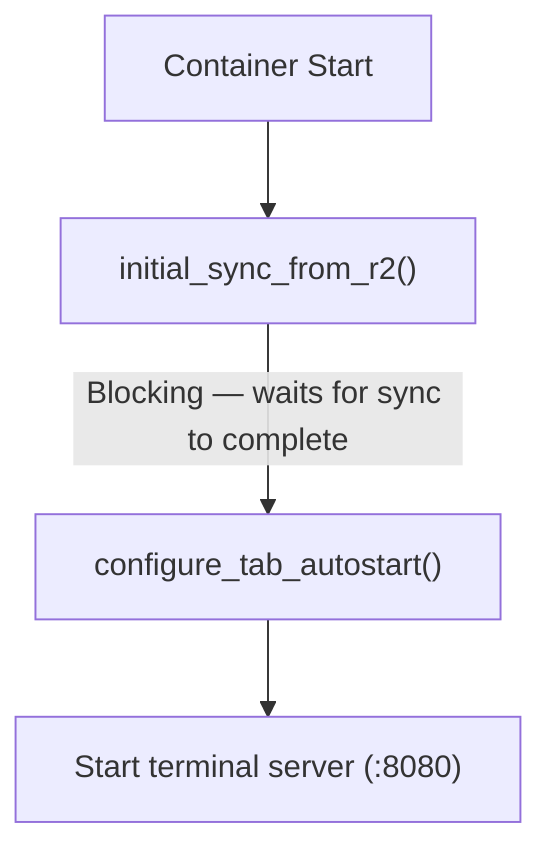

# Container

Container image contents, startup sequence, AI tool integration, auto-sleep configuration, and injected features.

**Audience:** Operators, Developers

---

## Container Image

**File:** `Dockerfile` - Base: `node:24-bookworm-slim`, multi-stage build (builder compiles native addons, runtime has no build tools).

### Installed Tools

| Category | Packages |
|----------|----------|
| Sync | rclone |
| Version Control | git, github-cli (gh), lazygit (v0.60.0) |
| Editors | vim (symlinked to neovim), neovim, nano |
| Network | curl, openssh-client |
| Process | procps (ps, pgrep) |
| Utilities | jq, ripgrep, fd, tree, htop, tmux, yazi (v26.1.22), fzf, zoxide, bat |

### Global NPM Packages

Non-CU packages install with `@latest` — each deploy pulls the newest versions (`.cache-bust` layer invalidation triggers fresh installs). CU is pinned to a git commit hash. The Dockerfile is the source of truth — versions listed below are approximate and may drift between deploys.

**Known trade-off:** Installing CLIs via `@latest` means each new container may run a different CLI version. Major version jumps (e.g., Copilot 0.0.418 → 1.0.12) between deploys have caused regressions (e.g., cursor rendering, xterm integration). Users in long-lived sessions will see the old version; new sessions after a deploy will see the new version. Monitor for unexpected behavior after deploys.

| Package | Version | Provides |
|---------|---------|----------|
| `claude-unleashed` | Git commit pin | `cu` / `claude-unleashed` commands (wraps `@anthropic-ai/claude-code`). Used as the "Claude Code" agent in the UI -- provides root permission bypass and controlled update mechanism. |
| `@openai/codex` | 0.105.0 | `codex` command |
| `@google/gemini-cli` | 0.30.0 | `gemini` command |
| `opencode-ai` | 1.2.15 | `opencode` command |
| `@github/copilot` | 0.0.418 | `copilot` command |

### V8 Compile Cache Warm-Up

Node.js CLIs (codex, gemini, copilot) are warmed at Docker build time by running `--version`, which triggers V8 to compile and cache bytecode via `NODE_COMPILE_CACHE`. This pre-populates the compile cache so that first-launch inside containers skips the JavaScript compilation overhead, resulting in faster startup times. Go binaries (like `opencode`) are already natively compiled and do not need V8 cache warm-up. Claude Code is pre-updated and pre-patched at build time via `claude-unleashed --silent --no-consent --help`, which seeds the V8 compile cache.

### OpenCode Database Pre-Initialization

OpenCode uses SQLite with Goose migrations that run on first startup ("Performing one time database migration"). The DB is stored at `~/.local/share/opencode/opencode.db` (XDG data directory). To avoid this overhead at container start, the Dockerfile runs `opencode run "hello"` at build time which triggers the migration, creating the sessions/files/messages schema so the first interactive launch is fast.

### Browser Shims

CLI tools (Claude Code, OpenCode, Gemini) try to open a browser for OAuth. The Dockerfile installs shims (`open-url` for `BROWSER` env var, `xdg-open-shim` for `xdg-open`) that exit 1, forcing CLIs to print auth URLs as plain text in the PTY. The xterm.js link provider then detects and makes these URLs clickable.

Port: 8080 (single port architecture).

---

## Container Startup

**File:** `entrypoint.sh`

Uses polling with safety timeouts: poll until success OR background process exits OR safety timeout expires. Exit immediately on success. Safety timeout `SYNC_TIMEOUT=120` (2 min) prevents infinite blocking.

### Parallel Startup

Auto-start uses `cu --silent --no-consent` for fast boot. Auto-updates are disabled by default via `FAST_CLI_START=true` (see [Fast Start](#fast-start) below). Users can enable auto-updates via Settings, or update manually via `cu` in any tab.

**PTY PATH:** The `.bashrc` tab autostart block sets `PATH="/usr/local/bin:/usr/bin:/bin:$PATH"` so that PTY sessions can find globally installed CLI tools.

### Fast Start

**User preference:** `fastStartEnabled` (default: `true`) in `UserPreferences`.
**Container env var:** `FAST_CLI_START` (default: `'true'`).

When enabled, `entrypoint.sh` disables auto-update checks for all 5 AI tools, eliminating 5-30s of startup delay per tool. Each tool has a different disable mechanism:

| Tool | Disable Mechanism | Type |
|------|------------------|------|
| Claude Code (claude-unleashed) | `CLAUDE_UNLEASHED_NO_UPDATE=1`, `CLAUDE_UNLEASHED_CHANNEL=stable` | Env var |
| OpenCode | `OPENCODE_DISABLE_AUTOUPDATE=1` | Env var |
| Copilot | `COPILOT_AUTO_UPDATE=false` | Env var |
| Gemini | `~/.gemini/settings.json` -> `general.enableAutoUpdate: false` | Config file (jq merge) |
| Codex | `~/.codex/version.json` -> `dismissed_version: "999.0.0"` | Config file (overwrite) |

**Gemini settings.json merge pattern:** Uses `jq '. * {"general":{"enableAutoUpdate":false,"enableAutoUpdateNotification":false}}'` to deep-merge into existing settings. This preserves user customizations since the file is synced via rclone from R2. If the file doesn't exist, creates it with only the auto-update keys.

**Codex dismissed_version hack:** Writes `{"dismissed_version":"999.0.0"}` to trick the Codex version checker into thinking a future version was already dismissed. The `~/.codex/` directory is excluded from rclone sync, so this file is safe to recreate on every container start.

When Fast Start is disabled (`FAST_CLI_START=false`), `entrypoint.sh` unsets the Dockerfile-level env vars (`CLAUDE_UNLEASHED_NO_UPDATE`, `CLAUDE_UNLEASHED_CHANNEL`, `DISABLE_INSTALLATION_CHECKS`) and the entrypoint-level `OPENCODE_DISABLE_AUTOUPDATE`, and skips writing config files and setting `COPILOT_AUTO_UPDATE`, allowing all tools to check for updates normally.

### Auto-sleep (Configurable sleepAfter)

**User preference:** `sleepAfter` (type: `SleepAfterOption`, optional) in `UserPreferences`. Allowed values: `5m`, `15m`, `30m`, `1h`, `2h`. Default when not set: `30m` (applied by container lifecycle route). **Free tier override:** backend forces `5m` regardless of stored preference; frontend locks dropdown and shows upgrade hint.

**Class default:** `override sleepAfter = '5m'` in `container/index.ts` — this is the SDK fallback if no preference is sent via `setBucketName`. Set to match the minimum user-configurable value. In practice, the lifecycle route always passes the user's preference (defaulting to `'30m'`).

**DO storage persistence:** `sleepAfter` is persisted to DO storage (`ctx.storage.put('sleepAfter', ...)`) on both initial set and restart paths. The constructor's `blockConcurrencyWhile` reloads it with regex validation, falling back to `'5m'` if absent or invalid. This ensures the user's configured idle timeout survives Cloudflare DO resets (infrastructure-level events that reinitialize the DO instance). Cleaned up in `destroy()` alongside other operational keys.

**Data flow:**
1. User selects auto-sleep duration in Settings > Session Defaults > Auto-sleep dropdown
2. `PATCH /api/preferences` saves `{ sleepAfter: '30m' }` to KV (`user-prefs:{bucketName}`)
3. On next session start, `POST /api/container/start` reads preferences from KV
4. `configureContainerDO()` → `buildSetBucketNameBody()` includes `sleepAfter` in the JSON body
5. Container DO receives it in `handleSetBucketName()`, validates against `/^(5m|15m|30m|1h|2h)$/`, sets `this.sleepAfter = sleepAfterPref`, and persists to DO storage
6. SDK uses the new `sleepAfter` value for its idle detection alarm
7. On restart (idempotent 409 path), `sleepAfter` is also updated from the latest preference and persisted to DO storage
8. On DO reset (cold start), constructor loads `sleepAfter` from DO storage before any `collectMetrics` alarm fires

**Access control:**
- **Admins** — always allowed to change their own `sleepAfter`
- **Paying users** (standard, advanced, max, unlimited) — allowed to change, default `30m`
- **Free users** — dropdown visible but disabled, locked to `5m`; hint text: "Fixed at 5 minutes on the Free plan. Upgrade for longer idle timeouts."
- **Non-subscribed users** — dropdown disabled; hint text: "Auto-sleep is managed by your administrator."
- Backend enforcement in `lifecycle.ts`: `effectiveTier === 'free' ? '5m' : (preferences.sleepAfter || '30m')` — free tier cannot bypass via API

**Settings UI:** Rendered in `SessionSection.tsx` as a `<select>` dropdown with 5 options. `SettingsPanel.tsx` fetches `hasSubscribed` from `/api/user` and computes `isFreeUser()` from `liveAccessTier()`. The `canChangeSleepAfter` accessor returns `(isAdmin() || userHasSubscribed()) && !isFreeUser()`. The `isFreeUser` prop is passed to `SessionSection` to show tier-specific hint text.

**`SleepAfterOption` type:** Defined in `src/types.ts` and `web-ui/src/types.ts`. The `SleepAfterOptions` array (`['5m', '15m', '30m', '1h', '2h']`) is also exported from `src/types.ts` for use in the zod validation schema.

**Sleep timer UI (`web-ui/src/lib/sleep-timer.ts`):** Frontend displays a countdown clock icon when a session's idle timeout is approaching. Computes `remainingMs = sleepAfterMs - (now - lastActiveAt)` from batch-status data. Only visible when < 10 min remaining. Orange pulse at < 10 min, red faster pulse at < 5 min. Hidden for stopped sessions or when `lastActiveAt` is null.

- **Session cards** (`SessionStatCard.tsx`): Clock icon (`mdiClockTimeEightOutline`) between status dot and menu trigger. Click shows inline tooltip with explanation text (same pattern as Workspace tooltip in `FileList.tsx`).
- **Header toolbar** (`Header.tsx`): Clock icon between avatar and bookmarks button. Click shows dropdown with countdown bucket + explanation text.
- **Data source:** `lastActiveAt` initialized to container start time by `onStart()`, then updated by `collectMetrics` every 60s when user input is detected (from `lastSeenInputAt` timestamp). This ensures the timer icon works from the moment the session starts, even before any user input. Read by `batch-status` endpoint and passed to frontend via 5s session list poll.

---

## Claude Code Integration

The "Claude Code" agent in Codeflare uses [claude-unleashed](https://github.com/nikolanovoselec/claude-unleashed) (`cu` command) behind the scenes. claude-unleashed enables `--dangerously-skip-permissions` when running as root inside containers (standard CLI prevents this via `process.getuid() === 0` check), and provides a controlled update mechanism.

**Updater:** claude-unleashed's updater checks npm for latest `@anthropic-ai/claude-code` - disabled at runtime via `CLAUDE_UNLEASHED_NO_UPDATE=1` to avoid ~25-30s startup delay from `npm view` + `npm install` on every container start. Updates happen at Docker build time instead (via `.cache-bust` layer invalidation). Upstream CLI's internal auto-updater is disabled via `DISABLE_INSTALLATION_CHECKS=1`.

### Container Environment Variables

**Global (Dockerfile ENV):** `NPM_CONFIG_UPDATE_NOTIFIER=false`, `CLAUDE_UNLEASHED_SKIP_CONSENT=1`, `CLAUDE_UNLEASHED_CHANNEL=stable`, `CLAUDE_UNLEASHED_NO_UPDATE=1`, `IS_SANDBOX=1`, `DISABLE_INSTALLATION_CHECKS=1`, `NODE_COMPILE_CACHE=/root/.cache/node-compile-cache`, `BROWSER=/usr/local/bin/open-url`

**Channel:** claude-unleashed uses `stable` dist-tag. Set via `CLAUDE_UNLEASHED_CHANNEL=stable` in the Dockerfile.

**Prewarm readiness:** Detected by first PTY output — as soon as the agent produces any terminal output, pre-warm is considered ready. This replaced the previous approach of agent-specific regex patterns and quiescence-based detection, which failed when agents weren't logged in (startup output was completely different, patterns didn't match, causing 20s timeout delays). The 20s hard timeout in `server.ts` remains as a safety net for the rare case where a PTY produces no output at all. `host/src/prewarm-config.ts` now only extracts the command name from `tabConfig` for logging.

**Auto-start flags (.bashrc):** `--silent`, `--no-consent`

---

## LLM Consultation

When `OPENAI_API_KEY` or `GEMINI_API_KEY` env vars are present, `entrypoint.sh` configures the `consult-llm-mcp` MCP server in `~/.claude.json`. This enables Claude Code to query external LLMs via the `consult_llm` MCP tool. Keys are stored in KV as `llm-keys:{bucketName}`, managed via `PUT /api/llm-keys`, and injected as container env vars during `setBucketName()`. Keys are NOT persisted in DO storage — read fresh from KV on each container start.

**Skill trigger phrases:** "discuss with llms", "consult llms", "ask llms", "get a second opinion", "ask ChatGPT", "consult Gemini", "ask GPT", "ask another AI".

**Default model pair** (skill sends to both models in parallel):

| Provider | Model ID |
|----------|----------|
| OpenAI | `gpt-5.4` |
| Google | `gemini-3.1-pro-preview` |

If the user names a specific model, only that model is queried. All supported models: `gpt-5.4`, `gpt-5.2`, `gpt-5.3-codex`, `gpt-5.2-codex`, `gemini-3.1-pro-preview`, `gemini-3-pro-preview`, `gemini-2.5-pro`.

Skill definition: `preseed/agents/claude/skills/consult-llm/SKILL.md`.

---

## Push & Deploy

Optional feature that lets users connect GitHub and Cloudflare accounts once in Settings. Tokens are stored in KV (`deploy-keys:{bucketName}`), validated against provider APIs on save, and injected as environment variables into every container session.

**Environment variables injected:** `GH_TOKEN` (GitHub fine-grained PAT), `CLOUDFLARE_API_TOKEN` (Cloudflare API token), `CLOUDFLARE_ACCOUNT_ID` (auto-fetched from CF API).

**Backend:** `src/routes/deploy-keys.ts` — GET returns masked tokens, PUT validates against GitHub/Cloudflare APIs before storing, DELETE clears all. Follows the same pattern as `llm-keys.ts`.

**Container injection:** Deploy keys are read from KV in `src/routes/container/lifecycle.ts` and passed to the Container DO via `buildSetBucketNameBody()`. The DO injects them as `envVars`. Keys are sent as explicit `null` when absent (not omitted) to ensure revocation propagates on session restart.

**Git credential helper:** `entrypoint.sh` configures `git config --global credential.helper` when `GH_TOKEN` is present, enabling `git push` without `gh auth login`.

**Token scopes:** GitHub (19 permissions pre-filled via template URL), Cloudflare (13 scopes pre-filled). Both URLs use provider-specific template mechanisms to pre-select permissions.

**GitHub PAT template (Aug 2025 format):** Uses correct parameter names (`emails` for email addresses, added `user_copilot_requests=read` account permission). Copilot CLI checks env vars in order: `COPILOT_GITHUB_TOKEN`, `GH_TOKEN`, `GITHUB_TOKEN`. If `GH_TOKEN` is set but lacks Copilot scope, auth fails silently. See [GitHub docs](https://docs.github.com/en/authentication/keeping-your-account-and-data-secure/managing-your-personal-access-tokens).

**Frontend:** `web-ui/src/components/settings/DeployKeysSection.tsx` — self-contained component with connect/disconnect flows for both providers, multi-account Cloudflare dropdown, and token masking.

**Preseed rule:** `preseed/agents/claude/rules/deploy-credentials.md` — comprehensive capability reference telling agents what commands are available with each token.

**Known gotchas:**
- `printf '%s' "$SECRET" | gh secret set` can store empty values — use file redirect (`< tmpfile`) instead.
- `cloudflare/wrangler-action@v3` bundles an old wrangler. Use `npx --yes wrangler deploy` with `env:` block for secrets.

---

## Related Documentation
- [Architecture](architecture.md#container-do) - Container Durable Object
- [Storage & Sync](storage-and-sync.md) - R2 sync during startup
- [Configuration](configuration.md#container-environment) - Container environment variables
- [Memory](memory.md) - Memory persistence and preseed system
