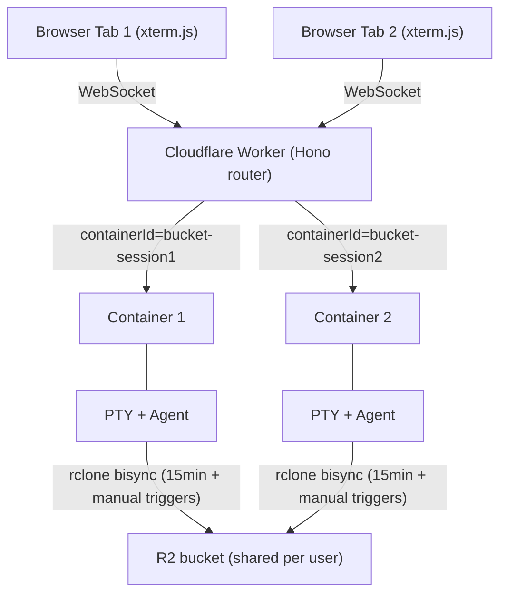
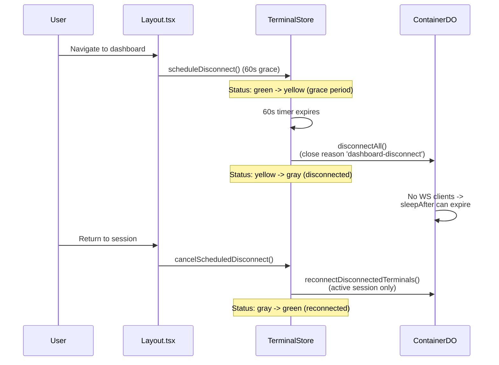
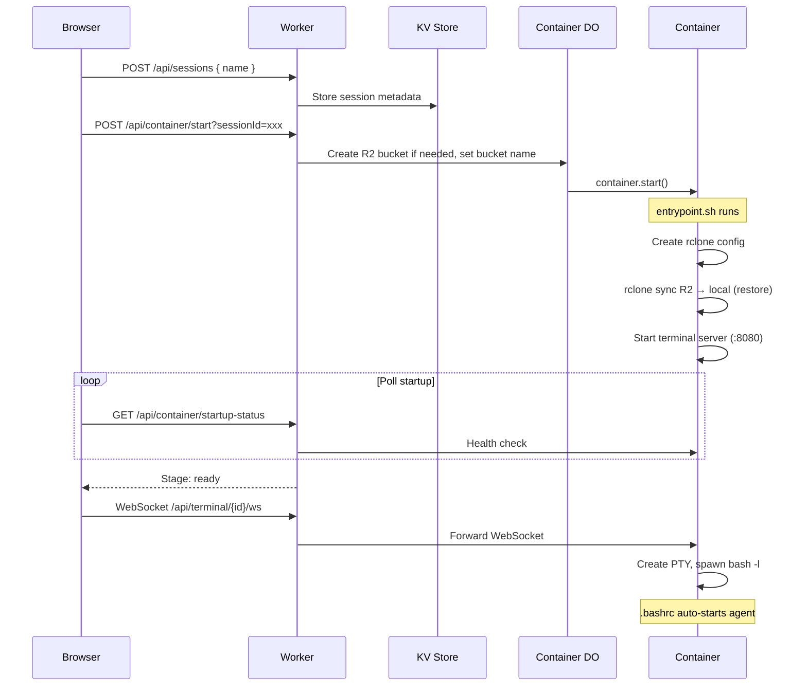
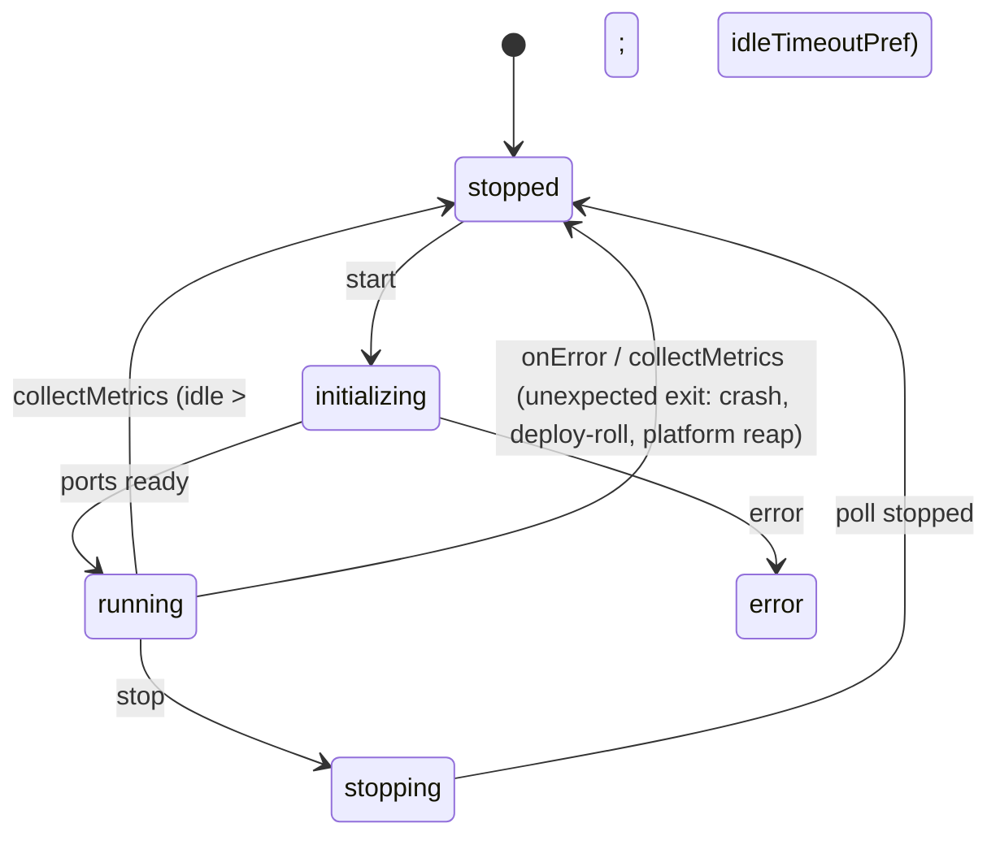
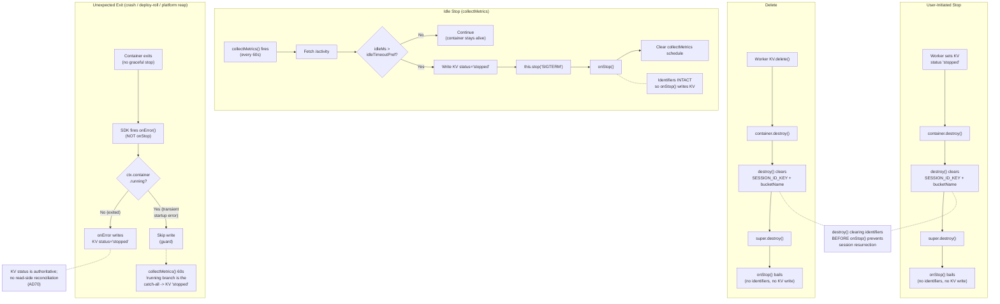
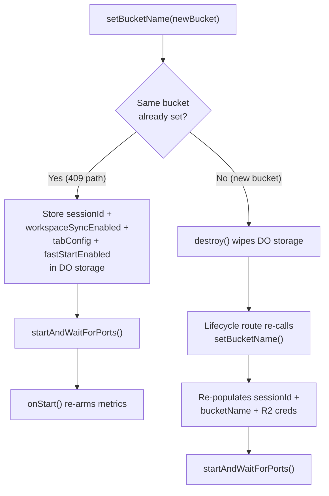
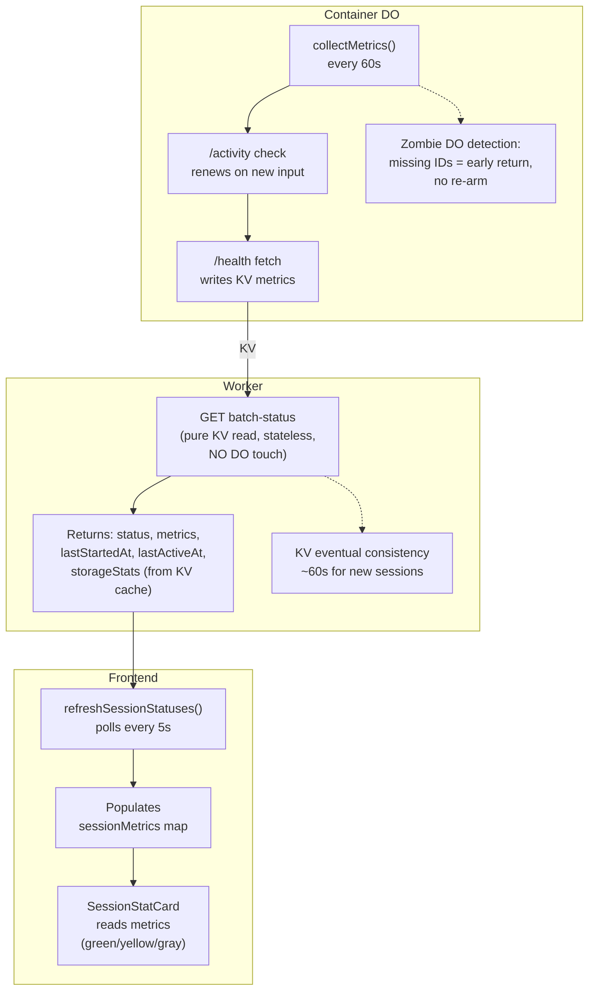
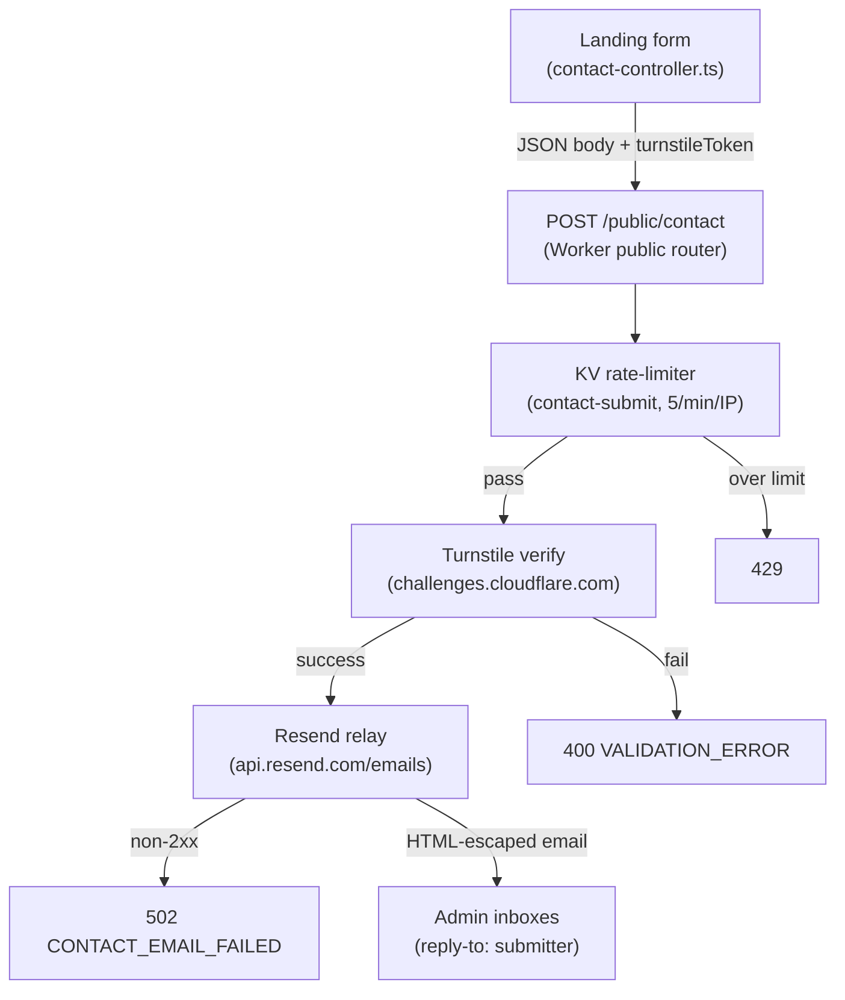

# Architecture

System architecture, components, data flow, and design rationale for Codeflare.

**Audience:** Developers

---

## Contents

- [Architecture Overview](#architecture-overview)
- [System Components](#system-components)
- [Data Flow](#data-flow)
- [Module-Level Caches](#module-level-caches)
- [Design Rationale](#design-rationale)

> **Enterprise Mode:** For the outbound-interception LLM routing data flow (Enterprise Mode only), see [Enterprise LLM Routing](#enterprise-llm-routing).

> **GitHub Integration:** For the repo-clone data flow and the two per-mode credential transports, see [GitHub Integration](#github-integration) and [GitHub Clone Data Flow](#github-clone-data-flow).

## Architecture Overview

Codeflare runs AI coding agents in isolated containers, one per browser session (tab). All sessions for a user share a single R2 bucket for persistent storage, with periodic bidirectional sync every 15 minutes plus manual triggers from the storage panel and a final sync at shutdown (see [AD56](../decisions/README.md#ad56-15-minute-bisync-cadence-with-manual-triggers)).



**Workers.dev URL:** `https://<CLOUDFLARE_WORKER_NAME>.<ACCOUNT_SUBDOMAIN>.workers.dev` - used only for initial setup. After the setup wizard configures a custom domain, all traffic should go through the custom domain (protected by the configured auth mechanism - CF Access or GitHub OIDC). In CF Access mode, the workers.dev URL should be gated behind one-click Access in the Cloudflare dashboard.

---

## System Components

### Worker (Hono Router)

**File:** `src/index.ts`

Entry point and API gateway. Handles routing, WebSocket upgrade interception, authentication (CF Access JWT or GitHub OIDC session cookies), container lifecycle through Durable Objects, and CORS with configurable allowed origins.

**WebSocket must be intercepted BEFORE Hono routing** (required workaround for CF Workers):
```typescript
// See: https://github.com/cloudflare/workerd/issues/2319
const wsRouteResult = validateWebSocketRoute(request);
if (wsRouteResult.isWebSocketRoute) {
  return handleWebSocketUpgrade(request, env, ctx, wsRouteResult);
}
```

**CORS:** Checks static patterns from `env.ALLOWED_ORIGINS` + dynamic origins from KV (cached in memory). Uses `matchesPattern()` with domain-boundary enforcement (dot-prefixed = suffix match, bare domains = exact or subdomain with dot boundary).

**Route Registration:** `/health`, `/api/health`, `/api/auth`, `/auth`, `/public/auth/providers`, `/api/setup`, `/public`, `/api/user`, `/api/container`, `/api/sessions`, `/api/terminal`, `/api/users`, `/api/storage`, `/api/presets`, `/api/preferences`, `/api/llm-keys`, `/api/deploy-keys`, `/api/usage`, `/api/admin/tiers`

**Workers Assets Routing Guardrails (`wrangler.toml`):**

With SPA fallback (`not_found_handling = "single-page-application"`), control-plane paths must execute Worker logic first via `run_worker_first = ["/", "/login", "/login/", "/auth/*", "/api/*", "/public/*", "/health", "/landing/*"]`. Missing `/api/*` causes setup/auth flows to break (API endpoints return HTML instead of JSON); missing `/login` makes the onboarding `/login` rewrite ([REQ-AUTH-020](../../sdd/spec/authentication.md#req-auth-020-onboarding-mode-landing-integrated-login-and-access-request-flow)) silently fall through to the SPA because the asset layer serves it at the edge before the Worker runs.

### Container DO (container)

**File:** `src/container/index.ts` - Extends `Container` from `@cloudflare/containers`. Exported from `src/index.ts` as lowercase `container` (matching `wrangler.toml` class_name). `index.ts` is the thin DO class shell; it delegates config (`setBucketName`/`ensureVaultKey`) to `container-config.ts`, lifecycle hooks (onStart/onStop/alarm) to `container-lifecycle.ts`, internal `/_internal/*` dispatch to `container-router.ts`, and idle enforcement/metrics to `container-metrics.ts`. Together these own the full lifecycle of a single session's container: startup, idle enforcement via `collectMetrics()`, request proxying with auth token injection, and graceful shutdown with a 135-second budget for final bisync. A second DO, `Timekeeper`, is exported from `src/timekeeper/index.ts` for per-user usage tracking.

For Container DO internals including the `collectMetrics()` loop, `destroy()` override, auth token lifecycle, `setBucketName` idempotency, and SDK timer semantics, see [Container](container.md).

### LlmInterceptor (Enterprise Mode)

**File:** `src/llm-interceptor.ts`

A `WorkerEntrypoint` that transparently proxies agent LLM traffic to the customer's AI Gateway when `ENTERPRISE_MODE=active`. Instantiated per container session by the Container DO via `ctx.container.interceptOutboundHttps` + `ctx.exports`. The interceptor receives every outbound HTTPS connection the container opens to the LLM provider host (`api.openai.com`), strips the placeholder credential injected by `entrypoint.sh`, and forwards to the AI Gateway **REST API** first (`https://api.cloudflare.com/client/v4/accounts/{account_id}/ai/v1/<path>`, authenticated with `Authorization: Bearer <AIG_TOKEN>` using the Workers AI scope, plus a `cf-aig-gateway-id` header). On a `404` from the REST API (a provider not yet on that surface, e.g. Google/Gemini today), it replays the buffered request to the **deprecated compat path** (`https://gateway.ai.cloudflare.com/v1/{account_id}/{gateway_id}/compat/<path>`, authenticated with `cf-aig-authorization: Bearer <AIG_TOKEN>` using the AI Gateway Run scope). The 404-fallback is safe because a 404 is a complete error body, not a started stream (no double-billing, no truncation), and it stops firing automatically as Cloudflare migrates providers onto the REST API. The account id and gateway id are parsed from `AIG_GATEWAY_URL`. Only OpenAI-wire-format agents (Copilot, Pi) run in enterprise mode, both via Chat Completions (`/chat/completions`); Pi runs with `reasoning: true` but starts each session at the configured default route's reasoning grade (default `off`), so gpt-5.5 stays tools-only by default (an OpenAI **Responses API** path was evaluated but reverted). The interceptor maps the agent's slash-free `model` handle to the gateway dynamic route `dynamic/<route>` from the Setup-configured catalog on `/chat/completions` and `/responses` ([REQ-ENTERPRISE-007](../../sdd/spec/enterprise-mode.md#req-enterprise-007-gateway-route-pinning)), failing safe to the default route on an unknown handle; an empty catalog or a non-model-routable body is forwarded unchanged. The catalog + default it enforces are resolved per the session's matched Access groups via the shared `resolveRouteCatalog` core — first matching configured group (in admin-configured order) wins, else the global catalog — the same core the container env fan (`loadEnterpriseRouteConfig`) uses, so the two routing sinks cannot drift ([REQ-ENTERPRISE-013](../../sdd/spec/enterprise-mode.md#req-enterprise-013-per-group-dynamic-routing)). On streaming `/chat/completions` it also normalizes the response stream (see **Streaming normalization** below). See [AD74](../decisions/README.md#ad74-enterprise-llm-transport-on-the-ai-gateway-rest-api) for the REST transport (it amends [AD72](../decisions/README.md#ad72-outbound-https-interception-over-a-worker-side-llm-proxy-for-enterprise-gateway-routing), whose interception mechanism is unchanged). On the compat replay the interceptor strips OpenAI-only fields (`store`, `prompt_cache_key`) that non-OpenAI providers reject with a 400 (the REST leg keeps them, so OpenAI prompt caching is unaffected). Per-user attribution is stamped into `cf-aig-metadata` as the IdP-verified `user` email plus one `group_<sanitized>=1` tag per matched Cloudflare Access group (the scalar `group` key is dropped), within CF's 5-entry cap (`user` + up to 4 groups, deterministic truncation with a warn), so the customer's gateway analytics attribute usage to the real identity and can branch per-group routing/cost/rate-limit policies via an equals-filter on each `group_*` key.

`ctx.exports` is default-on at the project's compat date (`2026-02-05`). No `enable_ctx_exports` compat flag is needed.

The gateway URL (`AIG_GATEWAY_URL`) and token (`AIG_TOKEN`) live exclusively in the Worker/interceptor environment. They are never forwarded to the container and never appear in any container env var or log. When `ENTERPRISE_MODE` is unset the DO never calls `interceptOutboundHttps`, the interceptor is never instantiated, and the direct-key path is byte-identical to non-enterprise deployments.

### GitHub Integration

A GitHub panel sits beside the R2 storage panel: a connected user browses and clones their repos, and the in-session agent acts with the user's own GitHub permissions. Availability is enterprise-only today, with broadening Planned ([REQ-GITHUB-007](../../sdd/spec/github.md#req-github-007-broaden-the-panel-gate-beyond-enterprise)).

**Components:**

- **Routes** `src/routes/github.ts` - `/api/github/status|repos|connect|disconnect|clone`, plus the OAuth callback `src/routes/github-auth.ts`.
- **Token store + provider seam** `src/lib/github-token.ts` - `getGithubProvider`, `getValidGithubToken`, `connectGithub`, `disconnectGithub`, backed by the **existing** deploy-keys KV entry `DeployKeys.githubToken` (no new KV key), encrypted via `kv-crypto`.
- **Enterprise interceptor** `src/github-interceptor.ts` - the `GitHubInterceptor` WorkerEntrypoint, wired in `src/container/index.ts` (`wireGithubInterception`).
- **Container env** `src/container/container-env.ts` (`buildEnvVars`) and `entrypoint.sh` (clone-on-start); host `host/src/git-clone.ts` + `host/src/server.ts` (`/internal/git-clone`).
- **Frontend** `web-ui/src/components/github/` (panel, repo list, ClonePicker) + `web-ui/src/api/github.ts`.

**Two credential transports** (the core architectural decision, [AD81](../decisions/README.md#ad81-reuse-the-container-egress-injection-layer-for-per-user-github-tokens)):

- **Enterprise (egress injection):** The container holds only a non-secret placeholder `GH_TOKEN` (`codeflare-enterprise`). `interceptedGithubHosts(env)` registers `github.com` + `api.github.com` (overridable via `GITHUB_HOST` / `GITHUB_API_HOST`) for outbound-HTTPS interception, **reusing the same AI-Gateway `interceptOutboundHttps` layer** as the LLM path. On each request the `GitHubInterceptor` looks up and decrypts the user's token (scoped solely by the wiring-time `props.bucket` binding), strips client auth, and stamps git Basic (`x-access-token:token`) for the web host or `Bearer` + `X-GitHub-Api-Version` for the API host; it **fails closed** when no token is present. AI hosts continue to route to the LLM interceptor - one host→interceptor map, two WorkerEntrypoints, one responsibility each ([REQ-GITHUB-003](../../sdd/spec/github.md#req-github-003-enterprise-egress-injected-github-credentials)). Wired only when `ENTERPRISE_MODE=active`, at container start (CA-mount timing).
- **Non-enterprise (container transport):** The real token flows to the container as `GH_TOKEN` via the existing deploy-keys→env path, unchanged ([REQ-GITHUB-006](../../sdd/spec/github.md#req-github-006-other-mode-container-transport)).

### Terminal Server (node-pty)

**File:** `host/src/server.ts` - Node.js/TypeScript server inside the container. Single port 8080 for WebSocket + REST + health/metrics.

Sync handled entirely by `entrypoint.sh` (15-minute daemon, SIGUSR1-interruptible for manual triggers). Terminal server reads sync status from `/tmp/sync-status.json` and exposes via `/health`. The user-facing manual trigger surface is the Worker route `POST /api/sessions/sync`, which fans out per-session to each of the user's running containers; the per-container host endpoint it reaches is `POST /internal/bisync-trigger`, which reads `/tmp/sync-daemon.pid` and sends SIGUSR1 to the daemon. See [AD56](../decisions/README.md#ad56-15-minute-bisync-cadence-with-manual-triggers) and [REQ-STOR-015](../../sdd/spec/storage.md#req-stor-015-explicit-sync-trigger-from-ui). Activity tracking (WebSocket connection state + user input timestamps: `hasActiveConnections`, `connectedClients`, `activeSessions`, `disconnectedForMs`, `lastInputAt`) for hibernation decisions via `GET /activity`. Unknown JSON `type` strings are silently ignored (guard against future message types leaking to PTY).

**Auth-Exempt Paths:** The terminal server validates `Authorization: Bearer <token>` on all HTTP requests. `/health` and `/activity` are in the `authExemptPaths` Set at `host/src/server.ts` because `collectMetrics()` calls them directly via `ctx.container.getTcpPort(TERMINAL_SERVER_PORT).fetch(...)` from inside the DO class - that path enters the container over the SDK's private TCP plumbing and never runs through the public `fetch()` override, so no `Authorization` header is injected. The whitelist is safe because these two paths expose no user data and no mutable container state. The `/activity` endpoint is also exempted from auth in the DO-level `fetch()` override so internal health checks don't require token injection.

**`GET /activity` Endpoint:** Returns `{ hasActiveConnections: boolean, connectedClients: number, activeSessions: number, disconnectedForMs: number | null, lastInputAt: number | null }`. Consumed exclusively by the Container DO's `collectMetrics()` poll. Active connections = WebSocket clients currently connected. `disconnectedForMs` tracks time since all clients disconnected (null while clients are connected). `lastInputAt` is the Unix timestamp (ms) of the last real user input - determined by `containsUserInput()` after `stripTerminalResponses()` removes terminal protocol chatter (CPR, OSC, DA). This is the authoritative signal for codeflare's "user has walked away" idle policy.

**Idle Detection (Single Source of Truth):** Idle hibernation is enforced exclusively by `collectMetrics()`, which polls `/activity` every 60 s and computes `idleMs = Date.now() - (lastInputAt ?? containerStartedAt)`. When this exceeds `parseSleepAfterMs(idleTimeoutPref)`, it writes KV status `'stopped'` and calls `this.stop('SIGTERM')` directly. See [REQ-SESSION-004](../../sdd/spec/session-lifecycle.md#req-session-004-idle-containers-sleep-after-configurable-timeout) / [REQ-SESSION-005](../../sdd/spec/session-lifecycle.md#req-session-005-input-based-idle-detection). A secondary per-PTY reaper in `host/src/server.ts` (`PTY_KEEPALIVE_MS`, default 120 min) acts as a safety net if `lastInputAt` tracking gets stuck. It is floor-clamped at the maximum `sleepAfter` so it cannot fire before the authoritative `collectMetrics` path. See [AD47](../decisions/README.md#ad47-pty-keepalive-as-safety-net-only-not-the-idle-policy).

The SDK's `sleepAfter` timer is intentionally disabled - it's pinned to `'24h'` so it never fires in normal operation. This is necessary because `@cloudflare/containers` v0.2.x refreshes the SDK timer on every WebSocket message in both directions, which would give "any traffic" semantics (containers running `tail -f` or `yes` would never sleep even after the user walks away). Codeflare needs "no user input" semantics, which only an in-container PTY tracker (the terminal server's `lastInputAt`) can provide.

The `containerStartedAt` fallback is critical: if a user opens a terminal but never types, `lastInputAt` stays `null`. Without the fallback, the idle check would be skipped and the container would run forever. With the fallback, idle time is measured from container start, so an unused terminal still stops after the configured timeout.

`containsUserInput()` in `host/src/session.ts` uses a whitelist approach - only actual keypresses count (printable characters, control keys, arrow keys, function keys, Alt+key, mouse clicks). Terminal protocol responses (CSI, OSC, DCS, APC, focus reports, mouse movement) do not count. `stripTerminalResponses()` removes terminal emulator response sequences (CPR, OSC 10/11/12, DA1) before writing to the PTY. Scenarios: user stops typing → container stops after `sleepAfter` + up to 60s (poll granularity); browser closed → same; user opens terminal but never types → container stops after `sleepAfter` from start time.

**Timestamp taxonomy (four distinct timestamps, often confused):**

| Field | Source / owner | Advances on | Used for |
| --- | --- | --- | --- |
| `lastInputAt` | terminal server `/activity` (`host/src/session.ts`) | PTY **keystrokes only** - not output, not WS traffic, not vault/SB activity, not autonomous-agent output | The idle reference for `collectMetrics`. A long agent run with no keystrokes looks "idle". |
| `lastSeenInputAt` | Container DO in-memory cache of the last non-null `lastInputAt` | New keystroke observed by the poll | Surviving a poll where `/activity` momentarily returns `null`. |
| `lastActiveAt` | KV session record (written by `updateKvStatus`) | Input-driven status writes + the sleep-timer path | Dashboard "last active" display; persisted across hibernation. |
| `metrics.updatedAt` (`m.u` in list metadata) | `collectMetrics` heartbeat | **Wall-clock, every tick**, regardless of input | Metrics-staleness display **only**. **Not** a liveness signal - it freezes when the alarm loop is not running (hibernation). A heartbeat-age heuristic over this field previously caused false "stopped" kicks; removed in [codeflare#153](https://github.com/nikolanovoselec/codeflare/issues/153). Liveness comes from the authoritative KV `status`. |

**WebSocket Wake-Loop Prevention:** Three layers prevent browser auto-reconnect from waking a hibernated container in an infinite stop/start cycle:
1. **DO fetch gate** (`container/index.ts`): The `fetch()` override returns 503 when `!this.ctx.container?.running` for all non-internal routes. This is authoritative (the DO knows container state directly, no KV read needed) and prevents `super.fetch()` from triggering the SDK's `startIfNotRunning`.
2. **Terminal route guard** (`routes/terminal.ts`): Rejects WebSocket upgrade requests with 503 when `session.status === 'stopped'` in KV. This is defense-in-depth - catches requests before they reach the DO.
3. **Frontend disposal** (`stores/session.ts`): The session poller detects running→stopped transitions and calls `terminalStore.disposeSession(sessionId)`, which kills all WebSocket retry loops for that session. Fresh `connect()` calls are only made when the user explicitly starts the session again.

**WebSocket Protocol:** Raw terminal data (NOT JSON-wrapped). Control messages (resize, process-name) as JSON. No application-level ping/pong -- Cloudflare handles protocol-level WebSocket keepalive for DO/Container connections. Headless terminal (xterm SerializeAddon) captures full state for reconnection.

**PTY:** Spawns `bash -l` (login shell for .bashrc) with `xterm-256color`, truecolor support.

**Terminal emulator response stripping:** `stripTerminalResponses()` in `host/src/session.ts` strips terminal emulator responses (CPR, OSC 10/11/12, DA1) from WebSocket input before writing to the PTY. These responses are generated by xterm.js in reply to terminal queries issued by CLI tools (e.g., `gh secret set` reads an OSC 11 response as the secret value). `containsUserInput()` then classifies the original data using a whitelist approach: printable characters, control keys (Enter, Backspace, Tab, Ctrl+key), arrow keys, function keys, Alt+key, and mouse clicks count as user input for idle detection. Terminal protocol chatter (CSI/OSC/DCS/APC sequences, focus reports, mouse movement/release) does not count. The `Session.write()` method calls both: PTY receives the filtered data, and `activityTracker.recordInput()` is called only when `containsUserInput()` returns true.

### Landing (Astro, prerendered)

**Directory:** `landing/`

The public enterprise marketing site ([REQ-LANDING-001](../../sdd/spec/landing.md#req-landing-001-mode-aware-public-landing-serving)). Builds to static HTML in `web-ui/dist/landing/` (base path `/landing`), so the existing `[assets]` binding serves it with no extra deployment. The Worker rewrites unauthenticated `GET /` to `/landing/` in SaaS and onboarding modes; default mode keeps the `/app/` redirect, and a missing landing build falls back to the SPA via `not_found_handling`. In onboarding mode (`ONBOARDING_LANDING_PAGE` active, `SAAS_MODE` not active) the Worker also rewrites `GET /login` to the landing-built sign-in page at `/landing/login/` ([REQ-AUTH-020](../../sdd/spec/authentication.md#req-auth-020-onboarding-mode-landing-integrated-login-and-access-request-flow)) so onboarding sign-in shares the landing design system; SaaS mode keeps the SPA `/login` provider chooser unchanged. Layered internally: design tokens (`landing/src/styles/tokens.css`) → global CSS → typed content (`landing/src/content/site.ts`) → markup components → pages. The hero terminal and all content render statically (no JS); browser logic is enhancement-only: the unit-tested contact controller (`contact-controller.ts`) with a thin DOM adapter, plus presentational scroll-reveals, the hero top-line capability ticker (`hero-kicker.ts`, advancing the active word and measuring its width while the server markup already contains the full stack), a reduced-motion-safe scramble on the single hero accent word (`scramble.ts`), and a cursor- and scroll-reactive WebGL flare-fluid behind the whole page (`splash.ts` + the `splash-*` / `webgl-utils` fluid set: a fixed full-page layer, vivid behind the hero and veiled to a legible wash below, paused while the tab is hidden, that sets `html.flare-on` to switch content panels onto translucent glass — desktop pointers drive it with the cursor, touch devices drive it from the finger position during an active swipe (the scroll sweep is suppressed while a finger is down) and from page scroll when no finger is touching, and reduced-motion or no-WebGL visitors never set it and keep the solid surfaces), and `proof.ts` (adds `.is-live` to each `[data-proof]` artifact once on scroll-in to play a one-shot reveal sequence; the markup ships the resolved final state, so the body's proof artifacts stay fully legible with no JS), and `agentfoot.ts` (a calm coding-agent statusline foot on the hero terminal: a slow context-percent tick and an occasional compaction beat, with the server-rendered foot as the reduced-motion and no-JS fallback), and `feature-terminals.ts` (drives the typing-loop animation on every `[data-ft-loop]` element with a `[data-ft-typed]` child: the feature-terminal grid in the shift section and the hero terminal's bottom command line, each typing a short command, holding, deleting, and looping to the next with staggered starts so the terminals are never in sync; the server-rendered first command plus the CSS caret blink is the reduced-motion and no-JS fallback), none of which gate content. The shift section (`id="shift"`) presents a feature-terminal grid: four `FeatureTerminals` tiles, each showing a live-typed agent command (`feature-terminals.ts`) with a tile title, command lines, and a caption foot. The spine-run-bound artifacts (the self-healing enforcement gate, the egress-inspection strip, the parallel review board, and the cost ledger) are keyed to one example run (the `SPINE` constant) sourced once in `site.ts` so their IDs cannot drift; the security boundary and the one egress call are folded into one merged terminal (`id="security"`, `.gate.boundary`): the boundary rows (each an actor, a `state` of `pass` or `deny` rendered as an `is-pass` / `is-deny` class, and descriptive text, with at least one approved path and one the architecture makes impossible) roll in, a left-aligned `.gate-echo` command echo issues the one outbound model call (`EGRESS.call`) above a thin in-terminal divider, the egress rows render beneath and animate (roll, via `data-roll`) like the boundary rows above, keeping the `is-redact` DLP amber beat, and a single in-chrome foot closes the receipt (the AI Gateway is named as the egress control). A legacy-rescue section (`id="legacy"`) sits between method and security, opening with a standard section head (terminal-path tag + h2 + lead) above a full-width narrative terminal, showing `/sdd init` reverse-engineering a legacy codebase into a spec-driven baseline and `/sdd clean` realigning a drifted spec. Every top-level section opens the same way (a terminal-path tag `~/<name>` via `SECTION_KICKERS` / `.kicker`, rendered mono and lowercase with a CSS `~/` accent prefix, then the h2 and lead at full width), so sections read as calm peers in document order, cued by that per-section tag (the structural replacement for the removed numbered spine and the earlier uppercase eyebrow; the five nav-pillar sections reuse their pillar word) and the alternating `--alt` section backgrounds rather than a counter, with the secondary bands (operations, tenancy, runs-everywhere, trusted-by) folded into their parent section as subordinate `.substation` sub-content (a nested terminal-path tag like `~/security/operations` above an `--fs-subhead` sub-head) so nothing floats; in the context section (`id="context"`) the browser-isolation web fetch renders full width under the section head and the agent-steered e2e follows as a `.substation` sub-head with its own full-width terminal. The dogfood section (`id="dogfood"`) is a self-referential proof: it presents this landing page as REQ-LANDING-001 built via the SDD workflow (real `@impl`/`@test` anchors, Status: Implemented, an illustrative shipping PR), and its CTA is the page's only link to the public repository (`GITHUB_URL`) for source verification. A Sign in action in the nav links to the SPA login provider-chooser (`/login`, `APP_LINKS.signIn`); the footer is reduced to a single centered "Built with Codeflare" line (no logo, nav links, Sign in, or GitHub mark); `/app/` is not used because the SPA guard redirects an unauthenticated visitor back to the landing before the login UI renders. Discoverability documents (REQ-LANDING-003) are served by the Worker at the deployment root before the setup gate, mode-aware: in a public mode (SaaS or onboarding) `robots.txt` (built in `src/lib/seo.ts`) advertises the marketing surface and points at `sitemap.xml` + an `llms.txt` product summary at the canonical origin; a private (default/enterprise) deployment returns a disallow-all `robots.txt` and 404s the sitemap/llms. The landing also emits a schema.org JSON-LD graph (Organization + WebSite + a home-page SoftwareApplication) and the OG/Twitter card points at the brand image at `/og.png`. See `landing/README.md`.

### Frontend (SolidJS + xterm.js)

**Directory:** `web-ui/`

Key files: `App.tsx` (root), `Terminal.tsx` (xterm.js), `TerminalTabs.tsx`, `Layout.tsx` (orchestrates dashboard/terminal views, manages WS disconnect/reconnect lifecycle), `SessionStatCard.tsx` (dashboard card with three-color status dot and metrics), `StorageBrowser.tsx` (R2 browser with toolbar), `StoragePanel.tsx` (slide-in drawer), `SettingsPanel.tsx`, `Dashboard.tsx`, `OnboardingLanding.tsx`, `OnboardingPage.tsx` (guided setup), `SubscribePage.tsx` (subscription flow), `UsagePage.tsx` (usage dashboard), `LoginPage.tsx` (SaaS login), `Header.tsx` (nav + user dropdown + inline usage), `KittScanner.tsx`.

Stores: `terminal.ts` (WebSocket state, compound key `sessionId:terminalId`, scheduled disconnect/reconnect), `terminal-url-detection.ts` (URL detection signals for floating buttons), `terminal-layout.ts` (terminal layout state), `session.ts` (CRUD, `terminalsPerSession`, `stopSession()` sets `'stopping'` and polls, `refreshSessionStatuses()` for lightweight dashboard polling - also updates storage stats from batch-status via `updateStatsFromBatch()`; mirrors `enterpriseMode` and `saasMode` from `/api/user` via `App.tsx`), `storage.ts` (R2 operations), `setup.ts`, `tiling.ts` (tiled terminal layout), `session-presets.ts` (preset/bookmark management), `session-tabs.ts` (tab configuration).

**Accent theming:** `settings.ts` exposes `applyAccentColor(hex)`, which writes `--accent-hue` / `--accent-s` / `--accent-l` (HSL decomposition) plus `--color-accent-contrast` (the foreground for accent-filled controls, derived by a YIQ-brightness helper `accentContrast`: warm near-black `#160a06` on bright accents, near-white `#fafafa` on dark ones). The default accent is the brand coral `#ff5c3c` (`DEFAULT_ACCENT_HEX` in `AppearanceSection.tsx`, HSL default in `design-tokens.css`), so the app matches the landing / login / OG; `--color-accent-contrast` is the text color of the New Session button, the shared primary `Button`, and the accent controls in the header, settings, storage, file-preview, onboarding, and setup styles (it resolves to white for a dark accent, so it is inert there).

**Dashboard tips:** `TipsRotator.tsx` rotates usage tips filtered by device (mobile / desktop / general) and by mode: tips flagged `saasOnly` (e.g. Pro mode, metered usage) are hidden unless `sessionStore.saasMode` is set, so onboarding / enterprise / default deployments never advertise features they do not have.

#### Dashboard WS Disconnect Flow

When user navigates to dashboard, `Layout.tsx` calls `scheduleDisconnect(DASHBOARD_WS_DISCONNECT_DELAY_MS)` (60s grace period). After the grace period, `disconnectAll()` closes all WS connections with reason `'dashboard-disconnect'`. Container can then idle to `sleepAfter` (user-configurable, default 30m for paying users, 15m for free tier). When user returns to terminal view, `cancelScheduledDisconnect()` cancels any pending timer, then `reconnectDisconnectedTerminals(activeSessionId)` reconnects only the active session's terminals. The `untrack()` fix in `Layout.tsx`'s `createEffect` wraps `activeSessionId` to prevent the reactive dependency from triggering reconnects on unrelated session changes.

**Tab Visibility Auto-Refresh:** `Layout.tsx` listens for `visibilitychange` events. When the tab returns from background (mobile browser tab switch, screen off/on), it auto-refreshes session statuses and storage listing. This prevents stale "Failed to fetch" errors that appear when background tabs have their network requests aborted by the browser. Storage refresh is silent (no loading spinner) to avoid UI flicker.

**Session Status Architecture:** KV polling (every 5s via batch-status) is the source of truth for session status. The Container DO sends custom WS close code **4503** when `!this.ctx.container?.running`, giving the client an authoritative "container stopped" signal distinct from network errors (code 1006). On 4503, the client immediately sets the terminal to `'disconnected'` with "Session stopped" message and stops retrying. On 1006 (network error), the client retries indefinitely - KV polling will update the status when propagation completes. Guards only block KV polling during user-initiated stop (`session.status === 'stopping'`) and session initialization (`session.status === 'initializing'`). When KV polling transitions a session to 'stopped', it also disposes terminal connections and clears `activeSessionId`.



#### Three-Color Session Status

`SessionStatCard` displays green (running + WS connected), yellow (running + WS disconnected -- container alive but dashboard-disconnected), gray (stopped). Driven by `dotVariant()` which checks both `session.status` and `terminalStore.getConnectionState()`. The yellow indicator was added to make the dashboard-disconnect flow visible to the user -- without it, status jumped from green directly to gray.

**KV Optimization (1500-User Scale):** `putSessionWithMetadata()` writes compressed `SessionListMetadata` (~195 bytes) via `kv.put(key, value, { metadata })`. `batch-status` reads from `kv.list()` metadata instead of N individual `kv.get()` calls, reducing KV reads/sec from ~901K to ~300 at 1500 users. Timekeeper user-record cache (60s TTL, 100-entry cap) reduces KV reads/min from 1,500 to ~25.

**Auto-Reconnect:** Infinite retries (1s delay) for retryable close codes (1001, 1006, 1011, 1012, 1013). Only server-authoritative close code 4503 stops retrying. Reconnection replays buffer via xterm SerializeAddon.

**Nested Terminals:** Up to 6 terminal tabs per session. Compound key `sessionId:terminalId`; WebSocket URL `/api/terminal/{sessionId}-{terminalId}/ws`.

**Bucket creation and seeding:** R2 buckets are auto-created on first access from `POST /api/container/start` and `GET /api/storage/browse`. Both paths read `sessionMode` from user preferences via `resolveSessionMode()` and pass it to `reconcileAgentConfigs()`.

See [Architecture Internals](architecture-internals.md) for backend library reference, code structure index, and the CF-NNN code change index.

---

## Data Flow

### Session Creation to Terminal Connection



### Startup Status Stages ([REQ-SESSION-017](../../sdd/spec/session-lifecycle.md#req-session-017-container-health-and-startup-status-api))

| Stage | Progress | Condition |
|-------|----------|-----------|
| stopped | 0% | Container state cannot be determined (DO `getState()` unavailable) |
| starting | 10-20% | Container not yet running/healthy, or running with the health server not yet responding |
| syncing | 30-45% | Health server up, syncStatus = pending/syncing |
| verifying | 85% | Sync complete, terminal server not yet responding |
| mounting | 90% | Terminal server up, PTY pre-warming in progress. WebSocket connects, terminal canvas hidden (`visibility: hidden`) |
| ready | 100% | All checks passed. "Open" button appears. Click reveals terminal canvas with pre-buffered content |
| error | 0% | Sync failed or other error |

### Session Lifecycle State Machine



(`error` is a frontend-ephemeral state, never persisted - AC2; it resolves to `stopped` on the next batch-status poll, not via a KV write. The SDK's `onError()` fires on a **running** container's unexpected exit, hence the `running --> stopped` transition above.)

**Stop (unexpected exit):** A crash, deploy-roll, or platform idle-reap exits the container without a graceful `stop()`, so the SDK fires `onError()` (**not** `onStop()`). `onError()` writes KV `status: 'stopped'` (guarded on `!ctx.container.running`); if it is skipped, the `collectMetrics()` `!running` branch writes `stopped` on the next 60s tick. Either way KV converges to `stopped` rather than dangling at `running`. See rationale #5 / #17 and [AD70](../decisions/README.md#ad70-container-exit-writes-kv-stopped-no-read-side-reconciliation).

**Stop (idle):** `collectMetrics()` poll -> `idleMs = Date.now() - (lastInputAt ?? containerStartedAt)` -> `idleMs > parseSleepAfterMs(idleTimeoutPref)` -> write KV `status: 'stopped'` (with `lastActiveAt`) -> `this.stop('SIGTERM')` -> `onStop()` clears `collectMetrics` schedule.

**Fast container-stopped detection (frontend):** When the Container DO's "not running" guard returns close code `4503` (`WS_CONTAINER_STOPPED_CODE`), the terminal store stops retrying and marks the connection as disconnected. This is server-authoritative - the container is definitively not running. Non-4503 close codes (1006, 1001, 1011, etc.) trigger automatic reconnection with 1s delay.

**Anti-flapping (KV stopped→running):** When KV batch-status polling detects a `stopped→running` transition for a non-active session, `refreshSessionStatuses()` updates the session status dot but does **not** auto-initialize terminals. This prevents a flapping cycle: stale KV "running" → WS connections → 503 from dead container → disconnected → stale KV "running" restarts cycle. The primary source of a stale KV "running" is now closed at the writer - every container exit persists `stopped` (rationale #5, [AD70](../decisions/README.md#ad70-container-exit-writes-kv-stopped-no-read-side-reconciliation)) - so this guard is defense-in-depth against a transient lag between exit and the catch-all write, not the load-bearing fix it once was when KV could dangle at `running` indefinitely. Newly started sessions have a 3-minute startup guard (`session-polling.ts`) during which only `4503` close code can transition them to stopped. The user explicitly clicks the session card to reconnect. Terminal initialization only occurs during: (1) explicit session start by user, (2) `loadSessions()` on initial page load where KV is authoritative.

**Stop (user-initiated):** Worker sets KV status to `'stopped'` -> calls `container.destroy()` -> `destroy()` clears `SESSION_ID_KEY` + `bucketName` from DO storage to prevent deleted session resurrection -> `super.destroy()` -> `onStop()` bails (no identifiers, so no KV write)

**Delete:** Worker `KV.delete()` -> `container.destroy()` -> `destroy()` clears `SESSION_ID_KEY` + `bucketName` -> `super.destroy()` -> `onStop()` bails (no identifiers, so deleted session cannot be resurrected in KV)



**Restart (same bucket):** `setBucketName` -> 409 (bucket already set, but stores `sessionId`, `workspaceSyncEnabled`, `tabConfig`, and `fastStartEnabled` in DO storage for KV reconciliation and preference updates) -> `startAndWaitForPorts()` -> `onStart()` re-arms metrics

**Restart (different bucket):** `setBucketName` succeeds -> `destroy()` (wipes DO storage) -> lifecycle route re-calls `setBucketName` (re-populates sessionId + bucketName + R2 creds) -> `startAndWaitForPorts()`



### Metrics Data Flow



### Contact Relay Data Flow ([REQ-LANDING-002](../../sdd/spec/landing.md#req-landing-002-demo-request-contact-pipeline))

The landing demo-request form relays to operators without persisting any submission content; the only KV write on the path is the rate-limiter counter, keeping the landing's "not stored" promise literally true.



Both secrets (`TURNSTILE_SECRET_KEY`, `RESEND_API_KEY`) must be present and at least one admin recipient must exist, else the endpoint returns `503`. Every user-controlled field is HTML-escaped before rendering into the email body, and the reply-to address and the name interpolated into the subject are CR/LF-stripped to prevent header injection (the topic field is constrained by Zod enum validation). The same flow backs `POST /public/waitlist` (onboarding-only) with a single-email envelope.

### Onboarding Access-Request Flow ([REQ-AUTH-020](../../sdd/spec/authentication.md#req-auth-020-onboarding-mode-landing-integrated-login-and-access-request-flow))

In onboarding mode the GitHub OAuth callback (`src/routes/github-auth.ts`) is mode-aware after it resolves the user's tier. An active-tier user is redirected to `/app/`. A non-approved user is recorded as an access request on their stored record (pending tier plus `requestedAt`, idempotent across repeat sign-ins), admin and user emails are sent via Resend (`sendAccessRequestNotification` for the operator alert and `sendAccessRequestConfirmation` for the user receipt, both in `src/lib/email.ts`, each wrapping the shared `sendEmail` helper), and the user is redirected to `/login?status=requested` — the landing login page (`landing/src/scripts/login.ts`) reads `?status` / `?error` and reshapes itself into the "request submitted" confirmation. Email delivery is best-effort: a Resend failure or a missing `RESEND_API_KEY` does not block the redirect. This onboarding branch is skipped in SaaS mode (which keeps the `/app/subscribe` redirect for pending users) and in enterprise mode.

### GitHub Clone Data Flow ([REQ-GITHUB-004](../../sdd/spec/github.md#req-github-004-clone-a-repository-into-a-session))

Two entry points clone a repo into a session, distinguished by whether the session already exists.

- **New session (clone-on-start):** `POST /api/sessions` carries a `clone:{repo,ref}` field, which threads through `container-env.ts` into `GIT_CLONE_REPO` / `GIT_CLONE_REF`. `entrypoint.sh` clones into `$USER_WORKSPACE/<repo-verbatim>` before the agent starts, skipping if the directory already exists.
- **Running session:** `POST /api/github/clone` forwards to the container DO's `/internal/git-clone` host endpoint (authed by the existing `CONTAINER_AUTH_TOKEN` Worker→DO bearer injection). The host `resolveGitClone` validates `owner/name` + ref and refuses a pre-existing folder (`409`).

Auth on the clone itself uses the per-mode credential path: egress injection in enterprise mode (the `GitHubInterceptor` stamps the user's token onto the outbound clone), or the container-local `GH_TOKEN` otherwise.

### Enterprise LLM Routing

Applies only when `ENTERPRISE_MODE=active`. The Container DO wires outbound-HTTPS interception before starting the container; from that point every HTTPS connection the container makes to the LLM provider host (`api.openai.com`) is transparently TLS-terminated by the `LlmInterceptor` WorkerEntrypoint and re-issued to the customer's AI Gateway REST API. The container never sees the gateway credentials.

```mermaid
sequenceDiagram
    participant C as Container (agent CLI)
    participant I as LlmInterceptor (WorkerEntrypoint)
    participant G as AI Gateway REST API
    participant P as Backend (OpenAI / Bedrock / Workers AI / dynamic route)

    Note over C: entrypoint.sh:<br/>- Trusts CF containers CA (system store)<br/>- Persists CA env (NODE_EXTRA_CA_CERTS,<br/>  REQUESTS_CA_BUNDLE) to .bashrc<br/>- Persists Copilot BYOK vars to .bashrc<br/>- Sets placeholder credential<br/>- Points agent at api.openai.com
    C->>I: HTTPS to api.openai.com<br/>(TLS intercepted by platform;<br/>placeholder Bearer stripped)
    I->>G: POST api.cloudflare.com/.../ai/v1/<path><br/>Authorization: Bearer AIG_TOKEN<br/>cf-aig-gateway-id: <gateway>
    G->>P: Routed by model id (gateway-side)
    P-->>G: Response
    G-->>I: Response
    I-->>C: Response (transparent)
```

**CA trust:** The platform TLS-terminates each intercepted connection and presents a certificate signed by the Cloudflare containers CA (`/etc/cloudflare/certs/cloudflare-containers-ca.crt`). `entrypoint.sh` installs this CA into the system trust store and persists `NODE_EXTRA_CA_CERTS` / `REQUESTS_CA_BUNDLE` exports into `.bashrc` (sourced by the agent PTYs via `bash -l` → `.bash_profile` → `.bashrc`; a process-only export in the entrypoint would not reach them) so all agent runtimes (Node, Python) trust the intercepted connections without errors.

**Pre-start interception ordering ([REQ-ENTERPRISE-011](../../sdd/spec/enterprise-mode.md#req-enterprise-011-container-start-interception-ordering)):** The Container DO calls `setupEnterpriseInterception()` (which invokes `ctx.container.interceptOutboundHttps`) inside `startAndWaitForPorts()` **before** the SDK's `container.start()` call. This ordering is load-bearing: the Cloudflare containers CA at `/etc/cloudflare/certs/cloudflare-containers-ca.crt` is only mounted after `interceptOutboundHttps` is registered. If wired after boot (e.g. in `onStart`), `entrypoint.sh` finds no cert to install, and every intercepted TLS handshake to `api.openai.com` fails. When `ENTERPRISE_MODE` is unset the override performs no interception work and the container start path is byte-identical to the non-enterprise path.

**Credential flow:** `AIG_GATEWAY_URL` and `AIG_TOKEN` are Worker secrets. They reach `LlmInterceptor` through the Worker environment only, never through the container env. The account id and gateway id are parsed from `AIG_GATEWAY_URL`. The interceptor uses two auth headers depending on transport: `Authorization: Bearer <AIG_TOKEN>` on the REST API (`api.cloudflare.com/.../ai/v1/*`, Workers AI scope) and `cf-aig-authorization: Bearer <AIG_TOKEN>` on the compat fallback (`gateway.ai.cloudflare.com/.../compat/*`, AI Gateway Run scope); `AIG_TOKEN` must carry both permissions or the missing transport is rejected with `error 10000`. The placeholder credential (`codeflare-enterprise`) written by `entrypoint.sh` is what puts each agent CLI into API mode; the interceptor strips it before forwarding. **Backend selection** (native provider, Amazon Bedrock, Workers AI, or a dynamic route) is entirely gateway-side via each agent's configured model id; codeflare holds no provider keys (BYOK lives in the gateway). See [AD72](../decisions/README.md#ad72-outbound-https-interception-over-a-worker-side-llm-proxy-for-enterprise-gateway-routing) for the interception mechanism and [AD74](../decisions/README.md#ad74-enterprise-llm-transport-on-the-ai-gateway-rest-api) for the REST API transport.

**Streaming normalization ([REQ-ENTERPRISE-004](../../sdd/spec/enterprise-mode.md#req-enterprise-004-outbound-interception-llm-routing-to-customer-ai-gateway) AC3):** On streaming `/chat/completions` responses the interceptor pipes the SSE body through a transform that guarantees a terminal `finish_reason` chunk before `[DONE]`. AI Gateway dynamic routes can end a stream with `finish_reason: null` followed by `[DONE]`, omitting the terminal chunk; OpenAI-wire **Chat Completions** clients (Copilot) reject this as "Stream ended without finish_reason" and retry, multiplying token cost. (Both Copilot and Pi run on `chat/completions`, so this shim guards both; the `/responses` path is not used in the current configuration.) The shim synthesizes the missing terminator (`tool_calls` when a tool-call delta was seen on the stream, otherwise `stop`), is idempotent (it never adds a second terminator when the upstream already sent a non-null `finish_reason`), reassembles SSE `data:` lines split across network chunk boundaries (a single `data:` line arriving across multiple TCP chunks), and is bypassed for non-streaming and `/responses` traffic. The gateway's stored response log is normalized and shows `finish_reason: stop` even when the live wire omits it, so the repair is only observable on the wire. When `ENTERPRISE_MODE` is unset the interceptor is never wired and no normalization runs.

---

## Module-Level Caches

All module-level caches in the codebase. Workers isolates do not share memory, so each cache is per-isolate.

| Module | Cache Variable | TTL | What It Caches | Reset Function |
|---|---|---|---|---|
| `src/lib/access.ts` | `cachedAuthDomain`, `cachedAccessAud`, `cachedAccessAudList` | 5 min | CF Access auth domain and audience config | `resetAuthConfigCache()` |
| `src/lib/subscription.ts` | `cachedTierConfig` | 60s | Tier configuration from `tiers:config` KV key | `resetTierConfigCache()` |
| `src/lib/cors-cache.ts` | `cachedKvOrigins` | 5 min | CORS origins from `setup:custom_domain` + `setup:allowed_origins` | `resetCorsOriginsCache()` |
| `src/lib/jwt.ts` | JWKS key cache | 30s freshness threshold | Cloudflare Access JWKS public keys (re-fetched on kid miss after 30s) | `resetJWKSCache()` |
| `src/lib/stripe.ts` | `priceCache` | 1 hour | Stripe price amount/currency per price ID, including `currency_options` for multi-currency pricing | (none - TTL-only) |
| `src/lib/kv-crypto.ts` | imported CryptoKey | Isolate lifetime | AES-256 key from `ENCRYPTION_KEY` env var | (none - persists for isolate lifetime) |
| `src/lib/rate-limit-core.ts` | `failedKvOps` | Isolate lifetime | Counter for consecutive KV failures (circuit breaker) | (none) |
| `src/lib/circuit-breakers.ts` | per-container breakers | Isolate lifetime | Circuit breaker state per container ID | (none) |
| `src/lib/session-jwt.ts` | `cachedKey` | Isolate lifetime | HMAC CryptoKey imported from `OAUTH_JWT_SECRET` | (none - re-imported if secret changes) |

After admin config changes, different isolates may enforce different values for up to the cache TTL. This is an accepted trade-off for KV read performance.

---

## Design Rationale

Architectural principles and design rationale.

1. **rclone bisync > s3fs FUSE** - FUSE mounts are fragile and slow. Periodic bisync with local disk is faster and more reliable.
2. **Newest file wins** - Simple conflict resolution for single-user scenarios.
3. **Resilient bisync over auto-resync** - `--resilient` + `--recover` handle transient failures without losing deletion tracking. `--resync` is only used for initial baseline establishment (see [AD14](../decisions/README.md#ad14-never-auto---resync-on-bisync-failure)).
4. **Single-source idle detection via `collectMetrics`** - The DO polls `/activity` inside the container every 60 s and explicitly calls `stop('SIGTERM')` when `idleMs > parseSleepAfterMs(idleTimeoutPref)`. The SDK's own `sleepAfter` timer is pinned to `'24h'` and plays no role in idle decisions (see AD/rationale #11). This replaced both the earlier heartbeat-based approach AND a short-lived input-change-detection design that leaned on the SDK timer - both were fragile when WebSocket reconnects reset the SDK's activity timer. One mechanism, one signal: has the user typed within the configured threshold? Container stops ~threshold + up to 60 s after the last keystroke.
5. **Every container exit must write KV `status: 'stopped'` - KV is the single source of truth** - The persisted KV `status` is authoritative; the dashboard renders it verbatim with no read-side staleness reconciliation (the former `reconcileStaleStatus` heartbeat-age heuristic was removed in [codeflare#153](https://github.com/nikolanovoselec/codeflare/issues/153), see rationale #17 / [AD70](../decisions/README.md#ad70-container-exit-writes-kv-stopped-no-read-side-reconciliation)). For that to hold, every exit path must persist `stopped`, written through the shared `updateKvStatus()` helper: (a) graceful hibernation/idle-stop fires `onStop()`, which writes `stopped` and calls `deleteSchedules('collectMetrics')` to kill the alarm loop (otherwise zombie alarms fire on a dead container indefinitely); (b) an **unexpected** exit (crash, deploy-roll, platform reap) fires `onError()` - **not** `onStop()` - which writes `stopped` guarded on `!ctx.container.running` so a transient startup error cannot flip a still-starting container; (c) `collectMetrics()` is the 60s catch-all: its `!ctx.container.running` branch writes `stopped` on the next tick after any exit the hooks missed, then returns without re-arming. Without (b)/(c) an unexpected exit would dangle as `running` in KV forever.
6. **`destroy()` must clear identifiers before `super.destroy()`** - `onStop()` fires asynchronously after `super.destroy()`. Without clearing identifiers first, `onStop()` resuscitates deleted sessions in KV via read-modify-write.
7. **Secrets persist with worker state** - `wrangler delete` destroys all secrets.
8. **Single port architecture** - All services on port 8080 eliminates port conflict bugs.
9. **CPU metrics show load average, not utilization** - `os.loadavg()[0] / cpus * 100` measures run queue depth. Values >100% are normal.
10. **Downgrade verbose activity logs to debug** - Per-cycle activity check logs at `info` level generate log volume (every 60 s per container). Once the single-source `collectMetrics` idle enforcement is confirmed stable in production, downgrade to `debug`.
11. **Stateless dashboard polling preserves hibernation** - Dashboard status endpoints must be pure KV reads with zero DO contact. Waking a DO resets the Container SDK's internal activity timer; even with the SDK timer pinned to 24 h (see [REQ-SESSION-004](../../sdd/spec/session-lifecycle.md#req-session-004-idle-containers-sleep-after-configurable-timeout) AC5), unnecessary DO wake-ups waste resources and can interfere with hibernation. `@cloudflare/containers` v0.2.x also auto-refreshes on any WebSocket message, so the SDK timer sees "any traffic" semantics, not "no user input" semantics - this is the primary reason idle enforcement is delegated entirely to `collectMetrics()` rather than the SDK timer.
12. **Polling interval vs push cadence** - The backend pushes metrics to KV every 60s (`collectMetrics`). The frontend polls at 5s for responsive session status updates (start/stop transitions). Metrics on the dashboard may be up to ~60s stale.
13. **rclone version upgrades can break bisync** - The Alpine → Debian migration changed rclone v1.68 → v1.73, introducing stricter MD5 post-transfer verification that aborts on files modified during sync ("corrupted on transfer"). Fix: `--ignore-checksum` on all bisync commands. Pin rclone version in Dockerfile to prevent future surprise breakage. Additionally, `--max-delete 100` is required on all bisync commands - the default 50% threshold aborts syncs when bulk deletions (e.g., deleting a workspace folder) remove more than half the tracked files. **Warning**: `--resync` should never be used as an automatic recovery mechanism - it destroys bisync's deletion tracking (see [AD14](../decisions/README.md#ad14-never-auto---resync-on-bisync-failure)).
14. **Never auto-`--resync` on bisync failure** - `--resync` makes both sides identical by copying the newer version of every file, then creates a fresh baseline. This permanently loses any pending deletions - if side A deleted a file and bisync fails before propagating, `--resync` resurrects the file from side B. Use `--resilient` + `--recover` for self-healing: `--resilient` allows bisync to continue past non-critical errors, and `--recover` automatically reconstructs corrupted listing files without losing state. Manual `--resync` is still available via `establish_bisync_baseline()` on container startup (one-way restore runs first, so no data loss).
15. **Never `docker system prune` in CI deploy workflows** - `docker system prune -af` in the deploy workflow nukes the Docker layer cache on self-hosted runners, causing every subsequent build to pull all layers from scratch. This triggers Docker Hub 429 rate limit errors when base images need re-downloading. Let Docker manage its own cache; only prune manually if disk space is critical.
16. **Vanishing-file recovery before nuke** - When bisync fails with `lstat: no such file or directory`, the file was listed by rclone then deleted before the copy completed (race condition with agents writing/deleting transient files). The correct response is to parse the error, add the file to a session-scoped exclusion filter (`/tmp/rclone-recovery-filters.txt`), and retry - not escalate to `nuke_corrupted_r2_files`. Non-workspace files are auto-excluded; workspace files (user code) trigger a plain retry on the assumption the file reappeared. Known ephemeral files (`.claude/mcp-*.json`) are statically excluded from all sync operations to prevent the race from occurring. See [Vanishing-file recovery](storage-and-sync.md#vanishing-file-recovery) and [AD43](../decisions/README.md#ad43-parse-and-exclude-vanishing-files-before-escalating-to-nuke).
17. **Exit-writes-`stopped` over read-side reconciliation** - KV `status` is the single source of truth: every container exit persists `stopped` (rationale #5), so the dashboard renders KV verbatim with no staleness heuristic. The former `reconcileStaleStatus` read-side guess inferred `stopped` from a stale `metrics.updatedAt` heartbeat and falsely kicked live-but-idle sessions whose alarm loop had legitimately paused; it was removed in [codeflare#153](https://github.com/nikolanovoselec/codeflare/issues/153). Writing on exit is both correct (no dangling `running`) and simpler (no clock-skew tuning of a staleness threshold). See [AD70](../decisions/README.md#ad70-container-exit-writes-kv-stopped-no-read-side-reconciliation).
18. **Outbound-HTTPS interception over a Worker-side proxy for enterprise gateway routing** - `LlmInterceptor` wires into the platform's `interceptOutboundHttps` mechanism rather than a public `/llm-proxy` Worker route. Interception is platform-internal: the gateway URL and token never leave the Worker environment, the container communicates with the real provider host (intercepted transparently), no public route carries gateway credentials, and no CF Access policy can be tripped. See [AD72](../decisions/README.md#ad72-outbound-https-interception-over-a-worker-side-llm-proxy-for-enterprise-gateway-routing).

---

## Specification Coverage

- [REQ-ENTERPRISE-004](../../sdd/spec/enterprise-mode.md#req-enterprise-004-outbound-interception-llm-routing-to-customer-ai-gateway) - Outbound-interception LLM routing to customer AI Gateway
- [REQ-ENTERPRISE-005](../../sdd/spec/enterprise-mode.md#req-enterprise-005-container-side-enterprise-routing-ca-trust--constant-base-urls) - Container-side enterprise routing (CA trust + constant base-URLs)
- [REQ-ENTERPRISE-011](../../sdd/spec/enterprise-mode.md#req-enterprise-011-container-start-interception-ordering) - Container start interception ordering (pre-start `interceptOutboundHttps`)
- [REQ-ENTERPRISE-013](../../sdd/spec/enterprise-mode.md#req-enterprise-013-per-group-dynamic-routing) - Per-group dynamic routing (shared `resolveRouteCatalog`, first-match by configured order)
- [REQ-TERM-003](../../sdd/spec/terminal.md#req-term-003-automatic-websocket-reconnection-on-transient-failures) - Automatic WebSocket reconnection on transient failures
- [REQ-TERM-005](../../sdd/spec/terminal.md#req-term-005-tab-1-auto-starts-the-configured-agent) - Tab 1 auto-starts the configured agent
- [REQ-TERM-007](../../sdd/spec/terminal.md#req-term-007-tiling-layouts-2-split-3-split-4-grid) - Tiling layouts (2-split, 3-split, 4-grid)
- [REQ-TERM-008](../../sdd/spec/terminal.md#req-term-008-write-batching-at-30fps) - Write batching at 30fps
- [REQ-TERM-009](../../sdd/spec/terminal.md#req-term-009-process-name-detection-via-control-messages) - Process name detection via control messages
- [REQ-TERM-010](../../sdd/spec/terminal.md#req-term-010-session-presets-saved-tab-configurations) - Session presets (saved tab configurations)
- [REQ-LANDING-001](../../sdd/spec/landing.md#req-landing-001-mode-aware-public-landing-serving) - Mode-aware public landing serving
- [REQ-LANDING-002](../../sdd/spec/landing.md#req-landing-002-demo-request-contact-pipeline) - Demo-request contact pipeline (contact relay data flow)
- [REQ-LANDING-003](../../sdd/spec/landing.md#req-landing-003-landing-social-share-and-search-metadata) - Landing social-share and search metadata (discoverability documents, JSON-LD, OG card)
- [REQ-AUTH-020](../../sdd/spec/authentication.md#req-auth-020-onboarding-mode-landing-integrated-login-and-access-request-flow) - Onboarding `/login` serving and post-OAuth access-request flow
- [REQ-GITHUB-001](../../sdd/spec/github.md#req-github-001-github-token-capture-and-storage) - GitHub token capture and storage (provider seam, token store)
- [REQ-GITHUB-002](../../sdd/spec/github.md#req-github-002-github-panel-and-repository-listing) - GitHub panel and repository listing (connect + repo list + clone panel)
- [REQ-GITHUB-003](../../sdd/spec/github.md#req-github-003-enterprise-egress-injected-github-credentials) - Enterprise egress-injected GitHub credentials (reuses the interception layer)
- [REQ-GITHUB-004](../../sdd/spec/github.md#req-github-004-clone-a-repository-into-a-session) - Clone a repository into a session (clone data flow)
- [REQ-GITHUB-005](../../sdd/spec/github.md#req-github-005-disconnect-and-offboarding-revocation) - Disconnect and offboarding revocation (token erasure + GitHub revocation)
- [REQ-GITHUB-006](../../sdd/spec/github.md#req-github-006-other-mode-container-transport) - Non-enterprise `GH_TOKEN` container transport
- [REQ-GITHUB-007](../../sdd/spec/github.md#req-github-007-broaden-the-panel-gate-beyond-enterprise) - Broaden the panel gate beyond enterprise (Planned)

---

## Related Documentation
- [Architecture Internals](architecture-internals.md) - Backend libraries, code structure, CF-NNN index
- [API Reference](api-reference.md) - All API endpoints
- [Authentication](authentication.md#authentication-modes) - Authentication modes and SaaS billing
- [Security](security.md) - Security model and rate limiting
- [Container](container.md) - Container image and startup
- [Storage & Sync](storage-and-sync.md) - R2 storage and rclone bisync
- [Configuration](configuration.md#worker-environment) - Environment variables
- [Decisions](../decisions/README.md) - Architecture Decision Records
