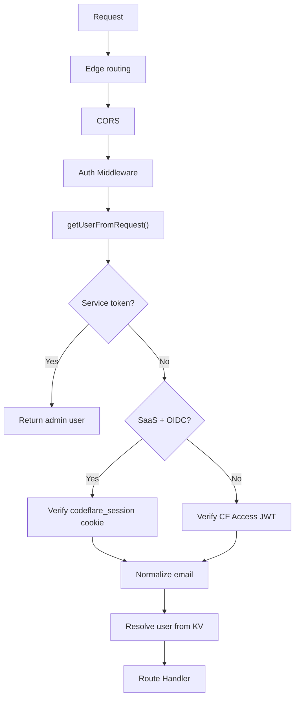
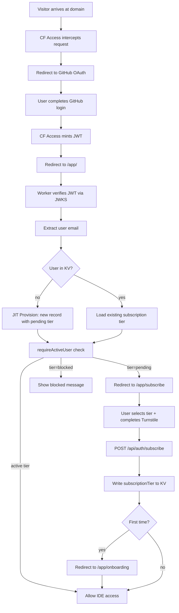

# Authentication & Billing

Dual authentication (Cloudflare Access and GitHub OIDC), SaaS mode, and three-tier auth middleware for Codeflare.

**Audience:** Operators, Developers

For security hardening, rate limiting, and encryption at rest, see [Security](security.md).

---

## Contents

- [Authentication Modes](#authentication-modes)
- [User Identity](#user-identity)
- [SaaS Mode](#saas-mode)
- [Environment Variables for SaaS Mode](#environment-variables-for-saas-mode)
- [Common Pitfalls](#common-pitfalls)

## Authentication Modes

Codeflare supports two fundamentally different authentication flows:

| | CF Access (with GitHub as IdP) | Direct GitHub OAuth |
|---|---|---|
| **When** | Default, onboarding, or SaaS without `OAUTH_CLIENT_ID` | SaaS mode with `OAUTH_CLIENT_ID` configured |
| **Auth layer** | Cloudflare Access (external service) | Worker handles auth directly |
| **Login page** | CF Access branded login page | Codeflare login page (`/login`) |
| **GitHub role** | One of several IdPs configured in CF Access dashboard | The sole auth provider, managed by the Worker |
| **OAuth flow** | CF Access -> GitHub -> CF Access issues `CF_Authorization` JWT | Worker -> GitHub -> Worker issues `codeflare_session` JWT |
| **JWT issuer** | Cloudflare (RS256, verified via JWKS) | Worker (HMAC-SHA256, verified via `OAUTH_JWT_SECRET`) |
| **Cookie** | `CF_Authorization` (managed by CF Access) | `codeflare_session` (HttpOnly, Secure, SameSite=Lax, 1h) |
| **Session lifetime** | Managed by CF Access policy | 1h TTL, auto-refreshed when < 15 min remaining |
| **User management** | CF Access groups + email allowlists | Worker KV records, JIT provisioning |
| **Setup wizard** | Creates CF Access app, groups, policies | No CF Access resources created |
| **Cost** | Free for 50 users, $3/user/month after | Free for unlimited users |
| **E2E auth** | `CF_ACCESS_CLIENT_SECRET` (CF Access + service headers) | `OAUTH_E2E_TEST_SECRET` (X-Service-Auth only) |
| **Logout** | `/cdn-cgi/access/logout` (CF Access system endpoint) | `/auth/github/logout` (clears `codeflare_session` cookie) |

The frontend always calls `/auth/logout` - the backend dispatches to the correct logout flow based on mode.

### Auth Resolution Order

`getUserFromRequest()` in `src/lib/access.ts` checks auth methods in this order:

1. **Service token** (`X-Service-Auth` header) - E2E testing, all modes. Constant-time comparison against `SERVICE_AUTH_SECRET`.
2. **Direct GitHub OAuth** (`codeflare_session` cookie) - only when `SAAS_MODE=active` AND `OAUTH_CLIENT_ID` is set. HMAC-SHA256 JWT verified against `OAUTH_JWT_SECRET`. When this branch is entered, CF Access is never checked.
3. **Cloudflare Access** (`cf-access-jwt-assertion` header or `CF_Authorization` cookie) - all other modes. RS256 JWT verified against CF Access JWKS endpoint.
4. **Pre-setup fallback** (`cf-access-authenticated-user-email` header) - trusted only before setup completes.

### Direct GitHub OAuth Flow

When `SAAS_MODE=active` and `OAUTH_CLIENT_ID` is configured, the Worker handles the entire OAuth flow:

```
User clicks "Sign in with GitHub" on /login
  -> GET /auth/github/login
  -> Generate HMAC-signed state token (nonce.iat.sig, signed with OAUTH_JWT_SECRET, 30-min iat window)
  -> 302 to github.com/login/oauth/authorize?client_id=...&scope=user:email&state=<signed>
  -> User authorizes on GitHub
  -> GitHub redirects to /auth/github/callback?code=...&state=...
  -> Worker verifies HMAC signature on state and checks iat is within window
     (stateless - no cookie required, works on iOS WebKit / ITP / private browsing)
  -> Worker exchanges code for access token via GitHub API
  -> Worker fetches verified email from /user + /user/emails
  -> Worker signs HMAC-SHA256 JWT with OAUTH_JWT_SECRET
  -> Set-Cookie: codeflare_session (HttpOnly, Secure, SameSite=Lax, Max-Age=3600)
  -> Redirect to /app/ (active user) or /app/subscribe (pending user)
  -> On state verification failure: redirect to /?error=session-expired
```

- Only `primary: true, verified: true` emails accepted from GitHub API
- Callback rate-limited (10/min per IP)
- Missing `OAUTH_JWT_SECRET` throws `AuthError` (fail-loud - never silently falls through to CF Access)
- Cookie auto-refreshed by middleware when < 15 min remaining

### CF Access Flow

When `OAUTH_CLIENT_ID` is NOT set, Cloudflare Access handles authentication:

```
User visits protected URL (/app, /api/*, /setup)
  -> CF Access intercepts (302 to CF Access login page)
  -> User picks identity provider (GitHub, Google, etc.)
  -> IdP OAuth flow (managed entirely by CF Access)
  -> CF Access issues CF_Authorization cookie (RS256 JWT)
  -> Request reaches Worker with cf-access-jwt-assertion header
  -> Worker verifies JWT signature via JWKS
  -> Worker extracts email, normalizes, resolves user from KV
```

**Email Normalization:** Trimmed + lowercased before KV lookup, role resolution, and bucket name derivation.

**Enterprise mode:** When `ENTERPRISE_MODE=active`, an authenticated CF Access request enters `resolveOrProvisionEnterpriseUser()` **before** the SaaS path. Existing users (admin or prior JIT) are returned unchanged; unknown emails are JIT-provisioned to `unlimited` tier (subject to an optional access-group gate). The SaaS subscribe/onboarding path is never reached. See [User Provisioning — Enterprise Mode Provisioning](user-provisioning.md#enterprise-mode-provisioning) and [REQ-ENTERPRISE-010](../../sdd/spec/enterprise-mode.md#req-enterprise-010-access-gated-jit-user-provisioning).

### CF Access Resources

Created by the setup wizard only when GitHub OAuth is NOT configured:

**Access Application:** One self-hosted app with five destinations: `/app`, `/app/*`, `/api/*`, `/setup`, `/setup/*`.

**Access Groups:** Per-worker groups: `<worker-name>-admins`, `<worker-name>-users`. Setup upserts both, stores IDs in KV. `/api/users` syncs group membership via `syncAccessPolicy()` after user mutations.

When `OAUTH_CLIENT_ID` IS set: no CF Access groups or policies are created.

### E2E Testing Auth

E2E tests authenticate via `X-Service-Auth` header in all modes. The secret comes from:
- **CF Access mode:** `CF_ACCESS_CLIENT_SECRET` environment secret
- **Direct GitHub OAuth mode:** `OAUTH_E2E_TEST_SECRET` environment secret

Both are deployed as `SERVICE_AUTH_SECRET` on the Worker. When neither is set, service auth is disabled.

### Auth Flow



---

## User Identity

Each authenticated user is mapped to a unique R2 bucket and a set of scoped credentials.

### Per-User Bucket Naming ([REQ-STOR-001](../../sdd/spec/storage.md#req-stor-001-dedicated-per-user-r2-bucket))

`user@example.com` -> `codeflare-user-example-com` (sanitized, max 63 chars).

### Bucket Auto-Creation

**File:** `src/lib/r2-admin.ts` - `createBucketIfNotExists()` via Cloudflare API on first container start.

---

## SaaS Mode

When `SAAS_MODE=active`, Codeflare replaces the Cloudflare Access interstitial with a branded login page. New users are auto-provisioned with `pending` subscription tier and require subscription selection.

### Deployment Modes

| Mode | Auth provider | User provisioning | Access control |
|------|--------------|-------------------|----------------|
| **Default** (no `SAAS_MODE`) | Cloudflare Access (JWT) | Manual allowlist via setup wizard | CF Access policies + KV allowlist |
| **SaaS** (`SAAS_MODE=active`) | Custom login page + CF Access IdP hints | Auto-provisioned on first login | Three-tier middleware + KV subscription tiers |

### Complete SaaS Authentication Flow



**Key architectural choice:** CF Access handles authentication (identity), while the Worker handles authorization (access control).

### Three-Tier Auth Middleware

SaaS mode uses a layered middleware stack on every request to protected routes (`src/middleware/auth.ts`):

1. **`requireIdentity`** - Resolves the user from CF Access JWT. If the user is not in KV, auto-provisions them with `pending` tier. Sets `c.get('user')`. Used for endpoints like `/api/auth/status` and `/api/auth/subscribe`.

2. **`requireActiveUser`** - Authenticates then checks `subscriptionTier ?? accessTier` is an active tier via `isActiveTier()`. Pending users get 403 `{ code: 'PENDING' }` - frontend redirects to `/app/subscribe`. Blocked users get 403 `{ code: 'BLOCKED' }`. In non-SaaS mode, behaves identically to `requireIdentity`.

3. **`requireAdmin`** - Checks `role === 'admin'`. Must be used AFTER `requireIdentity` or `requireActiveUser`.

### Root Redirect

- Setup incomplete -> redirect to `/setup`
- Setup complete, default mode -> `/` redirects to `/app/`
- Setup complete, onboarding mode -> authenticated users to `/app/`, unauthenticated to public landing
- Setup complete, SaaS mode -> `/` shows login page with "Sign in with GitHub" button

---

## Environment Variables for SaaS Mode

| Variable | Default | Purpose |
|----------|---------|---------|
| `SAAS_MODE` | unset | Set to `active` to enable custom login, JIT provisioning |
| `SAAS_EXTRA_IDPS` | unset | Comma-separated IdP UUIDs for custom OIDC providers |
| `RESEND_API_KEY` | unset | Resend email API token for notifications |
| `RESEND_EMAIL` | `Codeflare <onboarding@resend.dev>` | From address for notification emails |
| `ONBOARDING_LANDING_PAGE` | unset | Set to `active` to show waitlist page at `/` |

Both `SAAS_MODE` and `ONBOARDING_LANDING_PAGE` are passed to the Worker via `--var` in `deploy.yml`.

---

## Common Pitfalls

1. **Auto-redirect loops:** Early versions auto-redirected pending users from `/app/subscribe` back to themselves on page load after approval. Fixed by removing auto-redirect.

2. **Stale JWT cache:** The Worker cached auth config for 5 minutes. If setup changed during that window, old JWTs would fail verification. Fixed by adding `resetAuthConfigCache()` called after setup completes.

3. **Policy overwrite on reconfigure:** If `syncAccessPolicy()` were called in SaaS mode, it would overwrite `login_method` with group includes. Fixed by not calling sync in SaaS mode.

4. **Concurrent first-login writes:** KV eventual consistency means two simultaneous first-logins may write the same user record twice. This is benign (idempotent) - KV per-key serialization prevents split-brain.

5. **CSRF on state-changing requests:** Added `X-Requested-With` header check on POST/PUT/DELETE in `authenticateRequest()`.

6. **Service token auth for e2e tests:** `X-Service-Auth` header with custom secret for CI/e2e tests that cannot go through CF Access.

---

## Specification Coverage

- [REQ-AUTH-004](../../sdd/spec/authentication.md#req-auth-004-service-token-authentication-for-e2e-testing) - Service token authentication for E2E testing
- [REQ-AUTH-005](../../sdd/spec/authentication.md#req-auth-005-three-tier-authorization-middleware) - Three-tier authorization middleware
- [REQ-AUTH-009](../../sdd/spec/authentication.md#req-auth-009-logout-dispatches-by-mode) - Logout dispatches by mode
- [REQ-AUTH-010](../../sdd/spec/authentication.md#req-auth-010-auth-bypass-prevention) - Auth bypass prevention
- [REQ-AUTH-013](../../sdd/spec/authentication.md#req-auth-013-custom-branded-login-page) - Custom branded login page
- [REQ-AUTH-014](../../sdd/spec/authentication.md#req-auth-014-auth-expiry-detection-mid-session) - Auth expiry detection mid-session
- [REQ-AUTH-015](../../sdd/spec/authentication.md#req-auth-015-guided-onboarding-flow) - Guided onboarding flow
- [REQ-AUTH-016](../../sdd/spec/authentication.md#req-auth-016-header-user-dropdown) - Header user dropdown
- [REQ-AUTH-017](../../sdd/spec/authentication.md#req-auth-017-gravatar-integration) - Gravatar integration
- [REQ-ENTERPRISE-010](../../sdd/spec/enterprise-mode.md#req-enterprise-010-access-gated-jit-user-provisioning) - Access-gated JIT provisioning runs before SaaS path in enterprise mode

---

## Related Documentation

- [Billing](billing.md) - Subscription tiers, Stripe, Timekeeper DO, paygate
- [User Provisioning](user-provisioning.md) - JIT provisioning, subscribe page, frontend components
- [Security](security.md) - Security model, rate limiting, encryption
- [API Reference](api-reference.md#auth-saas-mode) - Auth API endpoints
- [Configuration](configuration.md#secrets) - Worker secrets
- [Architecture](architecture.md#container-do-container) - Container Durable Object
