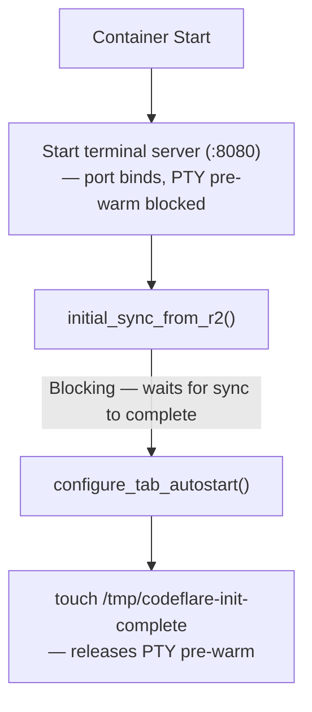

# Container

Container image contents, startup sequence, AI tool integration, auto-sleep configuration, and injected features.

**Audience:** Operators, Developers

---

## Contents

- [Container Image](#container-image)
- [Container Startup](#container-startup)
- [Claude Code Integration](#claude-code-integration)
- [Graphify (Knowledge-Graph Context) (REQ-AGENT-023)](#graphify-knowledge-graph-context-req-agent-023)
- [LLM Consultation](#llm-consultation)
- [Push & Deploy](#push-deploy)

## Container Image

**File:** `Dockerfile` - Base: `public.ecr.aws/docker/library/node:24-bookworm-slim` (AWS ECR Public mirror; avoids Docker Hub anonymous pull rate limits on CI runners), multi-stage build (builder compiles native addons, runtime has no build tools).

### Installed Tools

| Category | Packages |
|----------|----------|
| Sync | rclone |
| Version Control | git, github-cli (gh), lazygit (v0.60.0) |
| Editors | vim (symlinked to neovim), neovim, nano |
| Network | curl, openssh-client |
| Process | procps (ps, pgrep) |
| Utilities | jq, ripgrep, fd, tree, htop, tmux, yazi (v26.1.22), fzf, zoxide, bat |

### Global NPM Packages

AI CLI packages install with `@latest` -- each deploy pulls the newest versions (`.cache-bust` layer invalidation triggers fresh installs). The Dockerfile is the source of truth -- versions listed below are approximate and may drift between deploys. Exception: `bun` is pinned to a specific version because context-mode autodetects it as the JS/TS subprocess runtime; an upstream regression would silently break `ctx_execute` for every user.

**Known trade-off:** Installing CLIs via `@latest` means each new container may run a different CLI version. Major version jumps (e.g., Copilot 0.0.418 → 1.0.12) between deploys have caused regressions (e.g., cursor rendering, xterm integration). Users in long-lived sessions will see the old version; new sessions after a deploy will see the new version. Monitor for unexpected behavior after deploys.

| Package | Version | Provides |
|---------|---------|----------|
| `@anthropic-ai/claude-code` | latest | `claude` command. Runs with `IS_SANDBOX=1` + `--dangerously-skip-permissions` for root container support. |
| `@openai/codex` | 0.105.0 | `codex` command |
| `@google/gemini-cli` | 0.30.0 | `gemini` command |
| `opencode-ai` | 1.2.15 | `opencode` command |
| `@github/copilot` | 0.0.418 | `copilot` command |
| `bun` | 1.3.13 (pinned) | JS/TS subprocess runtime. context-mode autodetects Bun for `ctx_execute` / `ctx_batch_execute`. |

### V8 Compile Cache Warm-Up

Node.js CLIs (codex, gemini, copilot) are warmed at Docker build time by running `--version`, which triggers V8 to compile and cache bytecode via `NODE_COMPILE_CACHE`. This pre-populates the compile cache so that first-launch inside containers skips the JavaScript compilation overhead, resulting in faster startup times. Go binaries (like `opencode`) are already natively compiled and do not need V8 cache warm-up. Claude Code ships as a native binary (v2.1.102+) and is verified at build time via `claude --version`.

### OpenCode Database Pre-Initialization

OpenCode uses SQLite with Goose migrations that run on first startup ("Performing one time database migration"). The DB is stored at `~/.local/share/opencode/opencode.db` (XDG data directory). To avoid this overhead at container start, the Dockerfile runs `opencode run "hello"` at build time which triggers the migration, creating the sessions/files/messages schema so the first interactive launch is fast.

### Browser Shims

CLI tools (Claude Code, OpenCode, Gemini) try to open a browser for OAuth. The Dockerfile installs shims (`open-url` for `BROWSER` env var, `xdg-open-shim` for `xdg-open`) that exit 1, forcing CLIs to print auth URLs as plain text in the PTY. The xterm.js link provider then detects and makes these URLs clickable.

Port: 8080 (single port architecture).

---

## Container Startup

**File:** `entrypoint.sh`

Uses polling with safety timeouts: poll until success OR background process exits OR safety timeout expires. Exit immediately on success. Safety timeout `SYNC_TIMEOUT=120` (2 min) prevents infinite blocking.

### Startup Sequence

Port 8080 must bind before Cloudflare's container port-wait timeout (~10-15s) elapses. The entrypoint therefore starts the terminal server immediately — before R2 sync — then gates PTY pre-warm behind a flag file written only after sync and configuration complete.

**Init-complete flag (REQ-SESSION-015 AC1):** `CODEFLARE_INIT_FLAG_FILE=/tmp/codeflare-init-complete`. The terminal server polls for this file (every 250ms, up to 90s) before spawning the tab-1 PTY session. This ensures pre-warm reads the fully-restored `.claude.json`, `.bashrc`, and MCP server registrations rather than pre-sync state. If the flag does not appear within 90s, pre-warm proceeds anyway. The flag is deleted and recreated on every container start.

Auto-start uses `claude --dangerously-skip-permissions` for fast boot. Auto-updates are disabled by default via `FAST_CLI_START=true` (see [Fast Start](#fast-start) below). Users can enable auto-updates via Settings.

**PTY PATH:** The `.bashrc` tab autostart block sets `PATH="/usr/local/bin:/usr/bin:/bin:$PATH"` so that PTY sessions can find globally installed CLI tools.

### Fast Start

**User preference:** `fastStartEnabled` (default: `true`) in `UserPreferences`.
**Container env var:** `FAST_CLI_START` (default: `'true'`).

When enabled, `entrypoint.sh` disables auto-update checks for all 5 AI tools, eliminating 5-30s of startup delay per tool. Each tool has a different disable mechanism:

| Tool | Disable Mechanism | Type |
|------|------------------|------|
| Claude Code | `DISABLE_AUTOUPDATER=1` | Env var |
| OpenCode | `OPENCODE_DISABLE_AUTOUPDATE=1` | Env var |
| Copilot | `COPILOT_AUTO_UPDATE=false` | Env var |
| Gemini | `~/.gemini/settings.json` -> `general.enableAutoUpdate: false` | Config file (jq merge) |
| Codex | `~/.codex/version.json` -> `dismissed_version: "999.0.0"` | Config file (overwrite) |

**Gemini settings.json merge pattern:** Uses `jq '. * {"general":{"enableAutoUpdate":false,"enableAutoUpdateNotification":false}}'` to deep-merge into existing settings. This preserves user customizations since the file is synced via rclone from R2. If the file doesn't exist, creates it with only the auto-update keys.

**Codex dismissed_version hack:** Writes `{"dismissed_version":"999.0.0"}` to trick the Codex version checker into thinking a future version was already dismissed. The `~/.codex/` directory is excluded from rclone sync, so this file is safe to recreate on every container start.

When Fast Start is disabled (`FAST_CLI_START=false`), `entrypoint.sh` unsets the Dockerfile-level env vars (`DISABLE_AUTOUPDATER`, `DISABLE_INSTALLATION_CHECKS`) and the entrypoint-level `OPENCODE_DISABLE_AUTOUPDATE`, and skips writing config files and setting `COPILOT_AUTO_UPDATE`, allowing all tools to check for updates normally.

### Auto-sleep (Configurable sleepAfter)

**User preference:** `sleepAfter` (type: `SleepAfterOption`, optional) in `UserPreferences`. Allowed values: `5m`, `15m`, `30m`, `1h`, `2h`. Default when not set: `30m` (applied by container lifecycle route). **Free tier override:** backend forces `15m` regardless of stored preference; frontend locks dropdown and shows upgrade hint.

**SDK timer:** `override sleepAfter = '24h'` in `container/index.ts` sets the Container SDK's own idle timer to a 24-hour sentinel so it never fires in normal operation. Idle policy is owned exclusively by `collectMetrics()` (see AC4-AC5 in [REQ-SESSION-004](../../sdd/spec/session-lifecycle.md#req-session-004-idle-containers-sleep-after-configurable-timeout)). The user-facing preference is held in the in-memory field `idleTimeoutPref`; the wire-protocol and DO storage key remain `sleepAfter` for backwards compatibility with existing sessions. A secondary per-PTY reaper (`PTY_KEEPALIVE_MS`, default 120 min) in the host process acts as a safety net if `lastInputAt` tracking gets stuck. It is floor-clamped at the maximum `sleepAfter` so it cannot undercut the authoritative `collectMetrics` path. See [AD47](../decisions/README.md#ad47-pty-keepalive-as-safety-net-only-not-the-idle-policy).

**DO storage persistence:** `sleepAfter` is persisted to DO storage (`ctx.storage.put('sleepAfter', ...)`) on both initial set and restart paths. The constructor's `blockConcurrencyWhile` reloads it with regex validation, falling back to `'5m'` if absent or invalid. This ensures the user's configured idle timeout survives Cloudflare DO resets (infrastructure-level events that reinitialize the DO instance). Cleaned up in `destroy()` alongside other operational keys.

**Data flow:**
1. User selects auto-sleep duration in Settings > Session Defaults > Auto-sleep dropdown
2. `PATCH /api/preferences` saves `{ sleepAfter: '30m' }` to KV (`user-prefs:{bucketName}`)
3. On next session start, `POST /api/container/start` reads preferences from KV
4. `configureContainerDO()` → `buildSetBucketNameBody()` includes `sleepAfter` in the JSON body
5. Container DO receives it in `handleSetBucketName()`, validates against `/^(5m|15m|30m|1h|2h)$/`, sets `this.idleTimeoutPref = sleepAfterPref`, and persists to DO storage under the key `sleepAfter`
6. `collectMetrics()` reads `idleTimeoutPref` on every 60 s poll to determine the threshold; the SDK timer at 24 h is never the enforcer
7. On restart (idempotent 409 path), `sleepAfter` is also updated from the latest preference and persisted to DO storage
8. On DO reset (cold start), constructor loads `sleepAfter` from DO storage before any `collectMetrics` alarm fires

**Access control:**
- **Admins** — always allowed to change their own `sleepAfter`
- **Paying users** (standard, advanced, max, unlimited) — allowed to change, default `30m`
- **Free users** — dropdown visible but disabled, locked to `15m`; hint text: "Fixed at 15 minutes on the Free plan. Upgrade for longer idle timeouts."
- **Non-subscribed users** — dropdown disabled; hint text: "Auto-sleep is managed by your administrator."
- Backend enforcement in `lifecycle.ts`: `effectiveTier === 'free' ? '15m' : (preferences.sleepAfter || '30m')` — free tier cannot bypass via API

**Settings UI:** Rendered in `SessionSection.tsx` as a `<select>` dropdown with 5 options. `SettingsPanel.tsx` fetches `hasSubscribed` from `/api/user` and computes `isFreeUser()` from `liveAccessTier()`. The `canChangeSleepAfter` accessor returns `(isAdmin() || userHasSubscribed()) && !isFreeUser()`. The `isFreeUser` prop is passed to `SessionSection` to show tier-specific hint text.

**`SleepAfterOption` type:** Defined in `src/types.ts` and `web-ui/src/types.ts`. The `SleepAfterOptions` array (`['5m', '15m', '30m', '1h', '2h']`) is also exported from `src/types.ts` for use in the zod validation schema.

**Sleep timer UI (`web-ui/src/lib/sleep-timer.ts`):** Frontend displays a countdown clock icon when a session's idle timeout is approaching. Computes `remainingMs = sleepAfterMs - (now - lastActiveAt)` from batch-status data. Only visible when < 10 min remaining. Orange pulse at < 10 min, red faster pulse at < 5 min. Hidden for stopped sessions or when `lastActiveAt` is null.

- **Session cards** (`SessionStatCard.tsx`): Clock icon (`mdiClockTimeEightOutline`) between status dot and menu trigger. Click shows inline tooltip with explanation text (same pattern as Workspace tooltip in `FileList.tsx`).
- **Header toolbar** (`Header.tsx`): Clock icon between avatar and bookmarks button. Click shows dropdown with countdown bucket + explanation text.
- **Data source:** `lastActiveAt` initialized to container start time by `onStart()`, then refreshed by `collectMetrics` every 60 s from the in-container `/activity` endpoint's `lastInputAt` value (the Unix timestamp of the last PTY keystroke tracked by the terminal server). This ensures the timer icon has a reference timestamp from the moment the session starts, even before any user input. Read by `batch-status` endpoint and passed to frontend via 5 s session list poll.

---

## Claude Code Integration

Claude Code runs directly via the official `@anthropic-ai/claude-code` npm package (`claude` command). Containers run as root, and `IS_SANDBOX=1` (set in the Dockerfile) allows `--dangerously-skip-permissions` to work as root. No wrapper or patcher needed.

**Auto-update control:** `DISABLE_AUTOUPDATER=1` prevents the CLI's internal auto-updater from running, avoiding startup delay. Updates happen at Docker build time via `.cache-bust` layer invalidation. When Fast Start is OFF, `DISABLE_AUTOUPDATER` is unset, allowing the CLI to update to latest on startup.

### Container Environment Variables

**Global (Dockerfile ENV):** `NPM_CONFIG_UPDATE_NOTIFIER=false`, `IS_SANDBOX=1`, `DISABLE_INSTALLATION_CHECKS=1`, `DISABLE_AUTOUPDATER=1`, `NODE_COMPILE_CACHE=/root/.cache/node-compile-cache`, `BROWSER=/usr/local/bin/open-url`

**Prewarm readiness:** Detected by first PTY output -- as soon as the agent produces any terminal output, pre-warm is considered ready. The 20s hard timeout in `server.ts` remains as a safety net.

**Auto-start flags (.bashrc):** `--dangerously-skip-permissions`

---

## Graphify (Knowledge-Graph Context) (REQ-AGENT-023)

`graphifyy` (Apache-2.0) is installed globally at Docker build time via `uv tool install graphifyy[mcp,sql,pdf]==<VER>`. The version is pinned to `preseed/agents/claude/plugins/graphify/.claude-plugin/plugin.json` `.version`; a Dependabot bump there triggers a Dockerfile rebuild in lockstep so the runtime binary and the plugin manifest stay synchronised. The `graphify` CLI lives at `/root/.local/bin/graphify` (PATH-ready). The MCP server is invoked via the venv's own interpreter at `/root/.local/share/uv/tools/graphifyy/bin/python`, running the `graphify-mcp-lazy.py` wrapper (preseeded at `~/.claude/plugins/graphify/scripts/graphify-mcp-lazy.py`). System `python3` cannot import graphifyy directly because `uv tool install` keeps the package isolated. Build cost: ~220 MB (Python + 30 tree-sitter wheels).

**Tier-split gating (AD52, AD53):** the MCP server + `graphify-mcp-lazy.py` wrapper are registered in `~/.claude.json` for both default and advanced session modes (ambient capability). All hooks - SessionStart context-injection, PostToolUse-on-clone triage, PreToolUse graph-first nudge, and the active-repo tracker - plus `graph-first.md` and `graphify/SKILL.md` ship in advanced session mode only. Default session mode users have the capability without the proactive discipline and without multi-repo tracking precision.

**Hot-reload wrapper (AD53):** `graphify-mcp-lazy.py` lets the MCP server come up against an empty workspace. Upstream `graphify.serve` `sys.exit(1)`s when `graphify-out/graph.json` is missing; the wrapper monkey-patches `_load_graph` to return a `LazyGraph` (subclass of `nx.DiGraph`) that starts empty and rebinds its underlying dicts atomically as a `graph.json` appears or changes on disk. Watcher thread polls every `GRAPHIFY_POLL_SECONDS` (default 2s). The tool list stays static (7 tools); only G's contents swap.

**Active-repo tracking (advanced only, AD53):** Codeflare sessions begin with an empty workspace and typically hold 2-3 cloned repos. `graphify-active-repo.sh` is a PostToolUse hook on `Bash | Edit | Write | Read | NotebookEdit | mcp__context-mode__ctx_execute | mcp__context-mode__ctx_execute_file | mcp__context-mode__ctx_batch_execute`. It resolves the agent's current repo root (Bash from session cwd; Edit/Write/Read by walking up from `file_path`; ctx_execute variants by parsing `cd X` from the shell snippet) and writes it to a sentinel at `~/.cache/codeflare-hooks/graphify-active-cwd`. The wrapper polls the sentinel and rebinds G to that repo's `graphify-out/graph.json`. When the sentinel is absent (default mode, or before the first hook fires), the wrapper falls back to the freshest mtime across `CODEFLARE_WORKSPACE/*/graphify-out/graph.json`. Per-branch graphs are not supported - the wrapper reads `<repo>/.git/HEAD` only for an informative log line on rebind; users run `graphify update` after a checkout and the mtime watcher picks it up.

**Coexistence:** graphify functions in all paid tiers and does not depend on context-mode. When context-mode is active (custom tier), `graphify` is whitelisted in `enforce-ctx-mode.sh` so Bash invocations of `graphify update .` are not denied; subagent Read/Grep calls during `/graphify` extraction route through `ctx_execute` for bonus token savings. Without context-mode, graphify's own subagent-chunking model bounds the main agent's context.

**MCP tools exposed:** `mcp__graphify__query_graph`, `mcp__graphify__get_node`, `mcp__graphify__get_neighbors`, `mcp__graphify__get_community`, `mcp__graphify__god_nodes`, `mcp__graphify__graph_stats`, `mcp__graphify__shortest_path`.

**Persistence:** `graphify-out/` lives in the repo, not in R2. Repo owners commit `graph.json`, `GRAPH_REPORT.md`, and `graph.html` (interactive viz, standalone) to git; contributors get the graph and a browser-openable visualization on clone. Repos without push permission keep the graph local-only and ephemeral. R2 bisync explicitly excludes `**/graphify-out/**`. The SKILL's `.gitignore` block adds 17 patterns total: five regenerable build outputs under `graphify-out/` (`cache/`, `.cache/`, `.chunks/`, `manifest.json`, `obsidian/` - the 2k-file Obsidian-app stub vault that rewrites on every update and would drown PRs), ten `.graphify_*` working-tree intermediates the protocol creates mid-run (cleaned by the build's Step 9, gitignored as the safety net for runs interrupted before cleanup), and two per-machine markers (`.graphify_root` with an absolute path, `.graphify_labels.json` regenerated every run). The semantic merge driver for `graph.json` is registered globally in the image (`git config --global merge.graphify.driver`), so concurrent edits across branches merge cleanly when the repo's `.gitattributes` opts in with `graphify-out/graph.json merge=graphify`.

---

## LLM Consultation

When `OPENAI_API_KEY` or `GEMINI_API_KEY` env vars are present, `entrypoint.sh` configures the `consult-llm-mcp` MCP server in `~/.claude.json`. This enables Claude Code to query external LLMs via the `consult_llm` MCP tool. Keys are stored in KV as `llm-keys:{bucketName}`, managed via `PUT /api/llm-keys`, and injected as container env vars during `setBucketName()`. Keys are NOT persisted in DO storage — read fresh from KV on each container start.

**Skill trigger phrases:** "discuss with llms", "consult llms", "ask llms", "get a second opinion", "ask ChatGPT", "consult Gemini", "ask GPT", "ask another AI".

**Default model pair** (skill sends to both providers in parallel, latest flagship per family):

| Provider | Resolved by |
|----------|-------------|
| OpenAI | `consult_llm` server-side mapping — latest GPT |
| Google | `consult_llm` server-side mapping — latest Gemini |

Pass family selectors (`model: "openai"` / `model: "gemini"`) to let the MCP server pick the current flagship; pinning concrete IDs (e.g. `gpt-5.4`, `gemini-3.1-pro-preview`) goes stale within weeks of the next release. Specific model IDs are still accepted as advanced overrides when the user names one explicitly.

Skill definition: `preseed/agents/claude/skills/consult-llm/SKILL.md`.

---

## Push & Deploy

Optional feature that lets users connect GitHub and Cloudflare accounts once in Settings. Tokens are stored in KV (`deploy-keys:{bucketName}`), validated against provider APIs on save, and injected as environment variables into every container session.

**Environment variables injected:** `GH_TOKEN` (GitHub fine-grained PAT), `CLOUDFLARE_API_TOKEN` (Cloudflare API token), `CLOUDFLARE_ACCOUNT_ID` (auto-fetched from CF API).

**Backend:** `src/routes/deploy-keys.ts` — GET returns masked tokens, PUT validates against GitHub/Cloudflare APIs before storing, DELETE clears all. Follows the same pattern as `llm-keys.ts`.

**Container injection:** Deploy keys are read from KV in `src/routes/container/lifecycle.ts` and passed to the Container DO via `buildSetBucketNameBody()`. The DO injects them as `envVars`. Keys are sent as explicit `null` when absent (not omitted) to ensure revocation propagates on session restart.

**Git credential helper:** `entrypoint.sh` configures `git config --global credential.helper` when `GH_TOKEN` is present, enabling `git push` without `gh auth login`.

**Token scopes:** GitHub (19 permissions pre-filled via template URL), Cloudflare (13 scopes pre-filled). Both URLs use provider-specific template mechanisms to pre-select permissions.

**GitHub PAT template (Aug 2025 format):** Uses correct parameter names (`emails` for email addresses, added `user_copilot_requests=read` account permission). Copilot CLI checks env vars in order: `COPILOT_GITHUB_TOKEN`, `GH_TOKEN`, `GITHUB_TOKEN`. If `GH_TOKEN` is set but lacks Copilot scope, auth fails silently. See [GitHub docs](https://docs.github.com/en/authentication/keeping-your-account-and-data-secure/managing-your-personal-access-tokens).

**Frontend:** `web-ui/src/components/settings/DeployKeysSection.tsx` — self-contained component with connect/disconnect flows for both providers, multi-account Cloudflare dropdown, and token masking.

**Preseed rule:** `preseed/agents/claude/rules/deploy-credentials.md` — comprehensive capability reference telling agents what commands are available with each token.

**Known gotchas:**
- `printf '%s' "$SECRET" | gh secret set` can store empty values — use file redirect (`< tmpfile`) instead.
- `cloudflare/wrangler-action@v3` bundles an old wrangler. Use `npx --yes wrangler deploy` with `env:` block for secrets.

---

## Specification Coverage

- [REQ-OPS-010](../../sdd/spec/operations.md#req-ops-010-graceful-container-shutdown-preserves-data) - Graceful container shutdown preserves data
- [REQ-OPS-011](../../sdd/spec/operations.md#req-ops-011-container-base-image-is-debian-bookworm-slim) - Container base image is Debian bookworm-slim
- [REQ-OPS-016](../../sdd/spec/operations.md#req-ops-016-sleepafter-preference-persistence-and-lifecycle) - sleepAfter preference persistence and lifecycle
- [REQ-OPS-017](../../sdd/spec/operations.md#req-ops-017-sleepafter-fail-safe-invariants) - sleepAfter fail-safe invariants
- [REQ-SESSION-005](../../sdd/spec/session-lifecycle.md#req-session-005-input-based-idle-detection) - Input-based idle detection
- [REQ-SESSION-008](../../sdd/spec/session-lifecycle.md#req-session-008-container-restart-preserves-r2-bucket) - Container restart preserves R2 bucket
- [REQ-SESSION-009](../../sdd/spec/session-lifecycle.md#req-session-009-container-destroy-wipes-session-state) - Container destroy wipes session state
- [REQ-SESSION-011](../../sdd/spec/session-lifecycle.md#req-session-011-graceful-shutdown-with-final-sync) - Graceful shutdown with final sync
- [REQ-SESSION-013](../../sdd/spec/session-lifecycle.md#req-session-013-sleep-timer-countdown-ui) - Sleep timer countdown UI

---

## Related Documentation
- [Architecture](architecture.md#container-do-container) - Container Durable Object
- [Storage & Sync](storage-and-sync.md) - R2 sync during startup
- [Configuration](configuration.md#container-environment) - Container environment variables
- [Memory](vault.md#memory-capture-system) - Vault-based cross-session memory, automatic capture, hook mechanics
- [Preseed System](preseed.md) - Session modes, manifest pipeline, multi-agent adaptation, hooks
