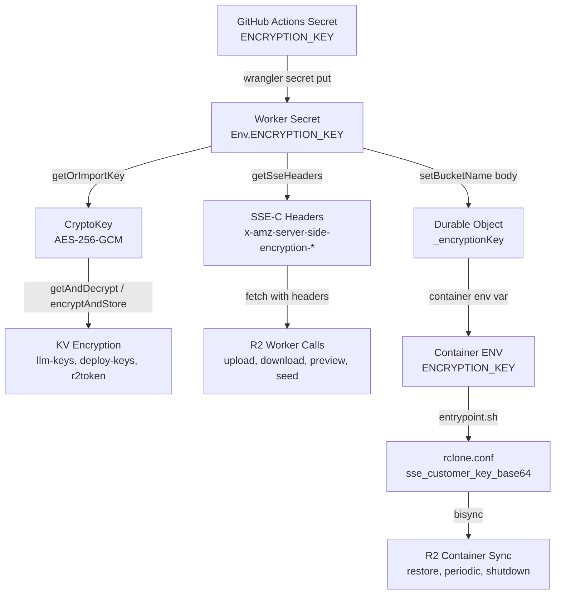

# Security

Security architecture, encryption at rest, rate limiting, and hardening measures.

**Audience:** Operators, Security

> For the vulnerability reporting policy, see [SECURITY.md](../SECURITY.md).

---

## Authentication Gate

All authenticated surfaces (`/app`, `/api`, `/setup`) are protected by one of two auth mechanisms depending on deployment mode:
- **Default/onboarding mode:** Cloudflare Access JWT verification (see [Authentication](authentication.md#authentication-modes) for Access application destination strategy)
- **SaaS mode (GitHub OIDC):** Worker-managed session cookies (`codeflare_session`, HMAC-SHA256). CF Access is bypassed at runtime when `OAUTH_CLIENT_ID` is configured.

## API Token Containment

The `CLOUDFLARE_API_TOKEN` never enters the container. It stays in the Worker/DO environment (GitHub Secrets -> Worker secrets). Containers only receive R2 credentials (scoped key pair), never the master API token.

**Per-user scoped R2 tokens:** Each container receives a scoped R2 API token restricted to its owner's bucket. Tokens are created on first login via `getOrCreateScopedR2Token()` in `r2-admin.ts` (called from `lifecycle.ts`), which calls `POST /accounts/{accountId}/tokens` with a bucket-specific Object Read + Write policy. Tokens are cached in KV as `r2token:{email}` (encrypted via AES-256-GCM when `ENCRYPTION_KEY` is set) and revoked on user deletion via `deleteScopedR2Token()`. This requires the `API Tokens: Edit` permission on the deploy token.

**R2 token verification:** Cached tokens are validated before use via `verifyTokenExists()` in `r2-admin.ts`. This calls `GET /accounts/{accountId}/tokens/{tokenId}` through the circuit breaker. Only a 404 response (token definitively deleted) invalidates the cache and triggers fresh token creation. Transient errors (429, 500, 502, network errors, circuit breaker open) assume the token is still valid — this prevents a Cloudflare API blip from unnecessarily deleting a valid KV entry and causing rclone 401 errors. The verification runs on every `getOrCreateScopedR2Token()` cache hit.

## Container Auth Token

A random UUID is generated per DO lifecycle and passed to the container as `CONTAINER_AUTH_TOKEN` env var. All requests proxied from the DO to the container via the public `fetch()` override include this token in the `Authorization: Bearer` header. The terminal server (`host/src/server.ts`) validates the token on all non-exempt paths. Internal paths (`/health`, `/activity`) are in `authExemptPaths` because `collectMetrics()` calls them directly via `ctx.container.getTcpPort(TERMINAL_SERVER_PORT).fetch(...)` from inside the DO class — that path enters the container over the SDK's private TCP plumbing and never runs through the public `fetch()` override, so no `Authorization` header is injected. The whitelist is safe because these two paths expose no user data and no mutable container state.

## Dual R2 Credential Architecture

Two types of R2 credentials serve different purposes:

**Worker-level R2 credentials** (setup wizard):
- Created during `POST /configure` step 2 (`handleDeriveR2Credentials`)
- `R2_ACCESS_KEY_ID` = API token ID (from `/user/tokens/verify`)
- `R2_SECRET_ACCESS_KEY` = SHA-256(API token value)
- Stored as worker secrets — used for bucket admin operations (create, empty, delete)
- If API token rotated, must re-run setup to regenerate

**Per-user scoped R2 tokens** (first login):
- Created via `getOrCreateScopedR2Token()` in `src/routes/container/lifecycle.ts`
- Calls `POST /accounts/{accountId}/tokens` with bucket-specific Object Read + Write policy
- Token ID = S3 Access Key ID, SHA-256(token value) = S3 Secret Access Key
- Cached in KV as `r2token:{email}` — survives container restarts
- Passed to container via `setBucketName` → container env vars → rclone config
- Revoked via `deleteScopedR2Token()` on user deletion
- Requires `API Tokens: Edit` permission on the deploy token

## Graceful Shutdown

`STOPSIGNAL SIGINT` in the Dockerfile. The `entrypoint.sh` trap handler catches SIGINT/SIGTERM, kills the sync daemon via PID file at `/tmp/sync-daemon.pid` (PID file is the sole mechanism — no in-memory PID variable fallback), runs a final `rclone bisync` (with `--ignore-checksum --max-delete 100`) to R2, and kills the terminal server. The bisync-initialized flag is touched on the timeout path as well (was previously missing, which caused shutdown to skip final bisync when initial sync timed out). This ensures no data loss on container stop.

## Security Hardening (Pre-Launch Review)

Fixes from 6 rounds of automated code review before 1500-user launch:

**Auth bypass prevention (CF-005):** `authConfigFetched` boolean sentinel in `access.ts` prevents KV transient errors from permanently degrading a post-setup deployment to the pre-setup header-trust model. Once KV auth config has been successfully fetched with real data (auth domain + aud), the pre-setup fallback that trusts `cf-access-authenticated-user-email` headers is permanently disabled for the isolate's lifetime. `resetAuthConfigCache()` clears the sentinel.

**STRESS_TEST_MODE enforcement (CF-001):** Global middleware in `src/index.ts` returns 503 when both `SAAS_MODE=active` and `STRESS_TEST_MODE=active`. Previously only logged once per isolate. STRESS_TEST_MODE is only for integration/staging without SAAS_MODE.

**Rate limiter fail-closed (CF-003/011):** `checkRateLimit` in `rate-limit-core.ts` accepts a `failClosed: boolean` parameter. When `true`, KV failure denies the request (503) instead of failing open via in-memory fallback. Applied to security-critical endpoints (Turnstile CAPTCHA verification, access-request). General resource-protection endpoints retain fail-open per AD6.

**Encryption key warning (CF-017):** `warnIfNoEncryptionKey()` in `kv-crypto.ts` emits a CRITICAL structured log on first request when `ENCRYPTION_KEY` is absent. User credentials (LLM API keys, GitHub tokens, Cloudflare tokens) are stored as plaintext KV when the key is missing.

**Path traversal prevention (CF-012):** `validateKey()` in `storage/validation.ts` decodes URI-encoded sequences via `decodeURIComponent` before the `..` traversal check. Catches `%2E%2E` and double-encoded `%252E%252E` attacks. Malformed URI encoding throws `ValidationError`. Returns the decoded key so callers use the correct value for R2 operations.

**Blocked user subscribe guard:** `POST /api/auth/subscribe` checks `getEffectiveTier` at handler top and throws `ForbiddenError` for blocked users. Previously, blocked users with a valid OIDC session could self-upgrade to free tier.

**SaaS service-token guard:** `cf-access-client-id` header in `getUserFromRequest` is only trusted when `!isSaasModeActive()`. In SaaS mode there is no CF Access edge to validate this header, making it attacker-controlled.

**Session mode billing enforcement:** `resolveSessionMode` result is clamped against the billing-resolved effective tier at both container start (`lifecycle.ts`) and preferences save (`preferences.ts`). A canceled user with stale `sessionMode: 'advanced'` preference gets `'default'` because the free tier only allows `['default']`. Both paths use `getEffectiveTier` (not raw JWT `subscriptionTier`).

**Concurrent cache dedup (CF-002):** Auth config fetch in `access.ts` wrapped in `pendingAuthConfigFetch` Promise sentinel (mirrors `pendingJWKSFetch` pattern from `jwt.ts`). Two concurrent cold-start requests reuse the in-flight fetch instead of issuing redundant KV reads. Sentinel cleared on TTL expiry and `resetAuthConfigCache()`.

## Security Headers

Applied to every response in `src/index.ts`:
- `Strict-Transport-Security` (HSTS)
- `Content-Security-Policy`
- `X-Content-Type-Options: nosniff`
- `X-Frame-Options: DENY`
- `Referrer-Policy: strict-origin-when-cross-origin`
- `Permissions-Policy`

HSTS is also applied to all redirect responses via `redirectWithHeaders()` helper in `src/index.ts`, including root redirect and setup redirect, ensuring browsers upgrade to HTTPS even on redirect hops. Preflight (OPTIONS) responses receive HSTS directly in the CORS middleware.

## Session ID Validation

`SESSION_ID_PATTERN` (`/^[a-z0-9]{8,24}$/`) is enforced on terminal WebSocket upgrade and container lifecycle endpoints (`terminal.ts`, `container/lifecycle.ts`). Invalid session IDs are rejected with 400 before any DO interaction, preventing malformed IDs from creating orphaned Durable Objects.

Session IDs are KV namespace keys, not authentication tokens. Knowing a session ID without a valid JWT grants zero access. The pattern validates format, not entropy. Inline comment at `src/lib/constants.ts` documents this for SAST tools that flag the pattern as "predictable".

## Static-Analyzer False Positives

Codeflare's threat model places several patterns in scope for static-analysis tools that, in this codebase's specific architecture, are not vulnerabilities. The decisions are documented inline at the source site (search for `SAST-false-positive`) with a brief rationale. The summary:

| Pattern | Site | Why it's not a finding |
|---|---|---|
| Container runs as root (no `USER` directive) | `Dockerfile` (near `STOPSIGNAL`) | Network isolation via Durable Object proxy is the security boundary; only the DO can reach port 8080, and the per-DO container auth token validates every proxied request. Root is required for FUSE mount and runtime tool installation throughout the lifetime, not just init. |
| KV-stored CORS origin patterns not re-validated per request | `src/lib/cors-cache.ts` (`isAllowedOrigin`) | Admin already has full worker access (deploy code, modify secrets). Per-request re-validation adds overhead for zero benefit. |
| Predictable-looking session ID pattern | `src/lib/constants.ts` (`SESSION_ID_PATTERN`) | Session IDs are namespace keys, not auth tokens. JWT is the auth gate. |
| Hardcoded test email `e2e-service@codeflare.local` | `src/lib/access.ts` (service-token branch) | Test fixture using RFC 6762 reserved `.local` TLD. Auth gate is the worker secret, not the email string. |

Each row's rationale is also captured at the source site as an inline comment. To find every entry: `grep -rn "SAST-false-positive" .` — the literal token is the durable anchor, not the line numbers. New SAST findings that match one of these patterns can be silenced via the inline-comment convention rather than escalating to an ADR.

## Body Limit

64 KiB on all `/api/*` routes (storage routes exempt for file uploads).

## Credential Encryption at Rest

Optional encryption for all user secrets and workspace files, enabled by setting `ENCRYPTION_KEY` (base64-encoded 256-bit key). Generate with `openssl rand -base64 32`. Set as a GitHub Actions repository secret named `ENCRYPTION_KEY` — the deploy workflow passes it to the Worker via `wrangler secret put`.

### Key generation and setup

```bash
# Generate a cryptographically secure 32-byte key
openssl rand -base64 32
# Output example: oBmGaRVT1W84oLgeTGif09kBlXxJkMs9uaoiqnCTJC0=

# Add as GitHub Actions secret (Settings > Secrets and variables > Actions)
# Secret name: ENCRYPTION_KEY
# Secret value: <paste the base64 string>
```

The key must decode to exactly 32 bytes. Arbitrary strings, passwords, or non-base64 values are rejected at import time with a clear error.

### What gets encrypted

| Storage | KV key pattern | Data | Encryption |
|---------|---------------|------|------------|
| KV | `llm-keys:{bucket}` | OpenAI, Gemini API keys | AES-256-GCM |
| KV | `deploy-keys:{bucket}` | GitHub PAT, Cloudflare API token, account ID | AES-256-GCM |
| KV | `r2token:{email}` | Scoped R2 access key, secret key, token ID | AES-256-GCM |
| R2 | All objects in user buckets | Workspace files, agent configs, credentials | SSE-C (AES-256) |

Everything else (`user-prefs:*`, `session:*`, `user:*`, `setup:*`, `storage-stats:*`) stays plaintext — no secrets in those entries.

### KV encryption (AES-256-GCM via Web Crypto API)

Implementation: `src/lib/kv-crypto.ts`

**Ciphertext format:** `v1:` + base64(12-byte random IV + AES-256-GCM ciphertext + 16-byte auth tag). The `v1:` prefix distinguishes encrypted values from plaintext JSON, enabling format evolution without breaking existing data.

**AAD (Additional Authenticated Data):** The KV key name (e.g., `llm-keys:codeflare-user-example-com`) is bound to the ciphertext as AAD. This prevents ciphertext from being copied between KV keys — decryption fails if the key name doesn't match.

**Key caching:** The CryptoKey is imported once per Worker isolate lifetime and cached in module-level state. Subsequent requests reuse the cached key without re-importing.

**API responses** always return masked values (`****` + last 4 chars), never plaintext keys — regardless of whether encryption is enabled.

### Transparent KV migration

When `ENCRYPTION_KEY` is enabled on an existing deployment with plaintext KV entries:

1. `getAndDecrypt()` reads the raw value as text
2. If value starts with `v1:` → decrypt with AES-256-GCM → return parsed JSON (fast path)
3. If value is valid JSON without `v1:` prefix → plaintext legacy entry → parse and return
4. Fire-and-forget: re-encrypt the plaintext value and write back to KV (`kv.put` runs asynchronously, never blocks the response)
5. Subsequent reads hit the fast decrypt path (step 2)

The write-back is fire-and-forget — if the KV write fails (transient error, rate limit), the caller still gets the correct data. Migration retries automatically on the next read. No data loss, no downtime.

**Race condition safety:** Two concurrent requests can both read the same plaintext entry and both write encrypted copies. This is safe because both workers encrypt the same plaintext — whichever write wins is equally valid. Real updates go through `encryptAndStore()` which always encrypts directly.

### R2 SSE-C encryption

Implementation: `src/lib/r2-sse.ts`

When `ENCRYPTION_KEY` is set, all R2 object operations include SSE-C headers:

| S3 operation | Route | Headers |
|-------------|-------|---------|
| PutObject | `upload.ts` (simple + multipart part) | `getSseHeaders()` |
| InitiateMultipartUpload | `upload.ts` | `getSseHeaders()` |
| GetObject | `download.ts`, `preview.ts` | `getSseHeaders()` |
| HeadObject | `preview.ts`, `r2-seed.ts` | `getSseHeaders()` |
| PutObject (seed) | `r2-seed.ts` | `getSseHeaders()` |

SSE-C headers: `x-amz-server-side-encryption-customer-algorithm: AES256`, `x-amz-server-side-encryption-customer-key: <base64 key>`, `x-amz-server-side-encryption-customer-key-MD5: <base64 MD5 of raw key bytes>`. The MD5 is computed via `node:crypto createHash('md5')`.

**Rclone integration:** `ENCRYPTION_KEY` is passed from Worker → Durable Object → container env var. In `entrypoint.sh`, when present, `sse_customer_key_base64` and `sse_customer_algorithm = AES256` are appended to `rclone.conf`. Rclone auto-computes the MD5 from the base64 key. All bisync operations (initial restore, periodic sync, shutdown sync) transparently encrypt/decrypt.

**Cloudflare dashboard impact:** With SSE-C enabled, files are visible in the R2 dashboard (names, sizes, metadata) but contents are unreadable — the dashboard doesn't have the encryption key. Downloads through the app work normally (Worker decrypts transparently).

### R2 bucket migration

Enabling SSE-C on an existing deployment requires re-uploading all R2 objects with SSE-C headers. Existing unencrypted objects remain readable without headers, but new objects written with SSE-C can only be read with SSE-C. For a clean encrypted state:

1. Enable `ENCRYPTION_KEY` in GitHub secrets and deploy
2. For each existing user bucket: download all objects (unencrypted GET), re-upload with SSE-C headers (PUT with `getSseHeaders()`)
3. Verify by starting a session — rclone bisync should complete without errors

New deployments that set `ENCRYPTION_KEY` from the start require no migration — all seeded files are encrypted at creation.

### Key pipeline



### Backward compatibility

When `ENCRYPTION_KEY` is not set: KV values are stored and read as plaintext JSON (existing behavior). R2 operations proceed without SSE-C headers. No code paths change — `getOrImportKey()` returns `null`, `getSseHeaders()` returns `{}`, and all encryption wrappers fall through to direct KV/R2 calls.

---

## Rate Limiting

Per-user rate limiting via `createRateLimiter()` factory in `src/middleware/rate-limit.ts`. Keyed by `bucketName` (user identifier set by auth middleware), falls back to `CF-Connecting-IP` for unauthenticated requests.

**Storage:** Primary storage is Cloudflare KV with automatic TTL expiry (window duration + 60s buffer). When KV operations fail, falls back to an in-memory `Map` with periodic cleanup every 100 requests to prevent unbounded growth.

**Response Headers:** All rate-limited responses include:
- `X-RateLimit-Limit`: Maximum requests per window
- `X-RateLimit-Remaining`: Remaining requests in current window

When the limit is exceeded: HTTP 429 with `{ code: "RATE_LIMIT_ERROR", message: "Rate limit exceeded. Try again in N seconds." }`

**KV Key Pattern:** `{keyPrefix}:{userId}` — e.g., `storage-upload:codeflare-user-john-example-com`. Use `rl-` prefix when the key prefix would collide with application cache keys (e.g., `storage-stats` collides with the stats cache key `storage-stats:{bucketName}`, so the rate limiter uses `rl-storage-stats`).

**Rate limits per endpoint:**

| Endpoint | Method | Limit | Key Prefix |
|----------|--------|-------|-----------|
| `/api/storage/upload/*` | POST | 60/min | `storage-upload` |
| `/api/storage/delete` | POST | 20/min | `storage-delete` |
| `/api/storage/seed/*` | POST | 3/min | `storage-seed` |
| `/api/storage/download` | GET | 120/min | `storage-download` |
| `/api/storage/preview` | GET | 120/min | `storage-preview` |
| `/api/storage/browse` | GET | 30/min | `storage-browse` |
| `/api/storage/stats` | GET | 10/min | `rl-storage-stats` |
| `/api/sessions/:id` | DELETE | 10/min | `session-delete` |
| `/api/sessions/:id/stop` | POST | 10/min | `session-stop` |
| `/api/user/ensure-r2-token` | POST | 5/min | `ensure-r2-token` |
| `/api/sessions` | POST | 10/min | `session-create` |
| `/api/container/start` | POST | 5/min | `container-start` |
| `/api/users/:email` | DELETE | 20/min | `user-mutation` |
| `/api/setup/status` | GET | 30/min | `setup-status` |
| `/api/setup/detect-token` | GET | 10/min | `setup-detect-token` |
| `/api/setup/prefill` | GET | 10/min | `setup-prefill` |
| `/api/setup/configure` | POST | 5/min | `setup-configure` |
| `PATCH /api/preferences` | PATCH | 20/min | `preferences-patch` |
| `POST /api/auth/request-access` | POST | 3/hr | `request-access` |
| `POST /api/auth/subscribe` | POST | 3/min | `subscribe` |
| `POST /public/waitlist` | POST | 5/min | `waitlist-submit` |

### Adding a new rate limiter

```typescript
import { createRateLimiter } from '../../middleware/rate-limit';

const myRateLimiter = createRateLimiter({
  windowMs: 60_000,    // 1 minute window
  maxRequests: 10,     // max 10 requests per window
  keyPrefix: 'my-route', // KV key prefix (must not collide with app cache keys)
});

// Apply to all routes in a sub-app:
app.use('*', myRateLimiter);

// Or apply to a specific route inline:
app.post('/endpoint', myRateLimiter, async (c) => { ... });
```

### Stress Test Bypass

When `STRESS_TEST_MODE` is set to `"active"`, all HTTP and WebSocket rate limits are bypassed. This is intended for integration environments only, to allow k6 stress tests with high virtual user counts (1000+) through a single service token identity. The bypass skips all KV rate-limit reads/writes for zero overhead. A one-time warning is logged per isolate when the bypass activates.

### Content-Disposition Hardening

File download responses use `Content-Disposition: attachment` with sanitized filenames. Special characters are stripped and filenames are truncated to prevent header injection.

### Input Validation (atob)

Base64-encoded inputs are validated with try/catch around `atob()`. Invalid base64 returns 400 immediately rather than propagating decode errors.

### WebSocket Rate Limit

30 connections per 60-second window per user (`WS_RATE_LIMIT_WINDOW_MS = 60000`, `WS_RATE_LIMIT_MAX_CONNECTIONS = 30`). Defined in `src/lib/constants.ts`.

### Session Limits

Per-user cap on concurrent running sessions, configurable by role via `MAX_SESSIONS_USER` (default: 3) and `MAX_SESSIONS_ADMIN` (default: 10) in `wrangler.toml`.

**Frontend-first enforcement:** The dashboard disables the start button when `isAtSessionLimit()` returns true (running + initializing sessions >= maxSessions). A popup explains the limit and which sessions to stop.

**Backend loose check:** `POST /api/container/start` counts KV sessions with `status === 'running'` under the user's prefix (excluding the current session to allow restarts). Returns 402 `QuotaExceededError` with the actual limit message if at or over the limit. This is a secondary guard -- the frontend prevents most limit violations before they reach the backend.

**`GET /api/sessions/batch-status`** returns `maxSessions` alongside `statuses` so the frontend stays in sync with the server-side limit without hardcoding defaults.

### Path Traversal Prevention

Browse endpoint validates prefix parameter against directory traversal (`..` rejection) and protected path access via `validateKey()` in `src/routes/storage/validation.ts`.

### Container Image Scanning

Trivy scans Docker images for HIGH/CRITICAL vulnerabilities before deployment (in `deploy.yml`).

### Protected R2 Paths

**`PROTECTED_PATHS` is now empty** (`[]` in `src/lib/constants.ts`). Previously, paths like `.claude/`, `.anthropic/`, `.ssh/`, `.config/`, `.claude.json` were blocked from the web storage API. The protection was removed — all R2 paths are now accessible via browse, upload, and delete. The `validateKey()` function in `src/routes/storage/validation.ts` still checks the array but it's a no-op with an empty list.

---

## Related Documentation
- [Authentication — Auth Modes](authentication.md#authentication-modes) - CF Access vs Direct GitHub OAuth
- [Authentication — Subscription Tiers](authentication.md#subscription-system) - Tier-based access control
- [API Reference — Common Headers](api-reference.md#common-response-headers) - Security headers on responses
- [PENTEST.md](PENTEST.md) - Penetration testing results
- [STRESS_TEST.md](STRESS_TEST.md) - Load testing and rate limit validation
- [Troubleshooting](troubleshooting.md#common-failure-modes) - Common failure modes
- [Decisions](decisions/README.md#ad7-pre-setup-public-endpoints) - Security-related architecture decisions
