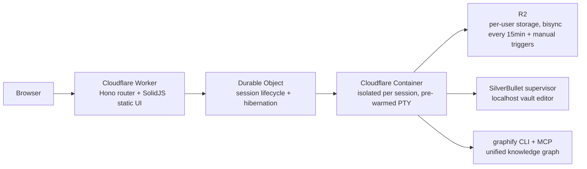

# Codeflare

I set out to prove that fully autonomous AI development actually works when done properly. Gave coding agents a detailed specification, made them follow TDD principles, and let them run unchecked. Somewhere along the way I accidentally built my favorite development environment.

Codeflare is the enterprise agentic engine, and it runs entirely in your browser. Every session spins up an isolated container on Cloudflare, pre-loads your AI agent of choice, and tears itself down when you're done. Your files persist in R2 storage. The containers don't. Nothing touches your local machine.

It's strongly optimized for mobile - because the best ideas hit while rewatching your favorite show for the 15th time, and your PC is just too far away.

## The Problem

Setting up a dev environment is tedious. Configuring one for AI-assisted coding is worse - you need the right CLI tools, API keys, a terminal multiplexer, and enough compute to feel responsive. Want to work from a different machine? Start over. Want to experiment without cluttering your local system? Out of luck.

Codeflare moves the whole thing to the cloud. Open a browser, start a session, and within seconds you have a fully configured workspace. Your files and settings persist across sessions via R2. When you're done, the container is destroyed. When you come back, a new one spins up with your data already synced. Even if a session dies before you `git push`, R2 sync has got your back.

## Supported Agents

Codeflare isn't tied to any single AI provider. Each session lets you choose which agent runs in your primary terminal tab:

| Agent | Description |
|-------|-------------|
| [Claude Code](https://docs.anthropic.com/en/docs/claude-code) | Anthropic's agentic coding tool running directly in the terminal |
| [Codex](https://github.com/openai/codex) | OpenAI's coding CLI agent |
| [Antigravity](https://antigravity.google) | Google's terminal coding agent |
| [GitHub Copilot](https://docs.github.com/en/copilot) | GitHub's AI coding agent |
| [OpenCode](https://github.com/opencode-ai/opencode) | Open-source multi-model AI coding CLI supporting 75+ model providers |
| Bash | No AI agent - a plain terminal for the purists |

All six are first-class citizens. Pick the one that fits your task, or use Bash if you prefer working without an AI assistant.

Pro-mode features (knowledge graph, curated skills, advanced workflows, automatic review agents) are primarily designed for Claude Code. The other agents receive the same rules and agent definitions, but the slash-command workflow and graph integration are tuned for Claude.

## What You Get

- **Browser-native terminal with 6 tabs per session.** Full Linux containers with root access, available in seconds from any browser. No local installation required.
- **One isolated container per session.** No shared state between sessions. Agents can't escape their sandbox (I checked).
- **Pre-warmed terminals.** The agent starts loading during container startup. By the time you click Open, it's ready - not staring at a blank screen wondering if something broke.
- **Persistent R2 storage with bisync every 15 minutes** plus a Sync-now button when you need it sooner and a final sync on stop. Files, shell config, credentials, vault notes, and uploads survive container teardown. Workspace is excluded from sync by default; fresh clones are recommended.
- **Terminal tiling.** View 2-4 terminals side by side. Once you tile, you don't go back.
- **Voice input.** A mic button on every terminal. Web Speech API, no extension. Brief your agent without thumb-typing a paragraph on mobile.
- **R2 file browser.** Browse, upload, download, and manage files directly from the dashboard - without starting a container. Vault, Uploads, and Temporary are surfaced as special folders.
- **Persistent vault (SilverBullet).** An Obsidian-compatible markdown editor running inside the container at `~/Vault/`, accessible from the header. Notes, journal entries, pasted screenshots, and an automatic 15-prompt session capture so a future agent can look up what a prior conversation decided.
- **User management.** Email-based allowlists and role-based permissions (admin and user). Invite users or revoke them when they get too creative.
- **Setup wizard.** First-time deployment walks you through DNS, auth, and storage config. Takes a few minutes, only happens once.
- **Configurable auto-sleep.** 5m / 15m / 30m / 1h / 2h. Input-aware: typing keeps the session alive, background polls do not. Free tier is locked to 15m.
- **Usage dashboard.** Daily and monthly compute hours with quota tracking. Per-user Timekeeper Durable Object flushes to KV every 5 minutes.
- **Dashboard with live metrics.** CPU, memory, disk, uptime, and sync status at a glance. Three-color session status: green (active), yellow (idle but alive), gray (stopped).

## Pro Mode (Advanced Sessions)

Advanced session mode adds a layer of agent tooling on top of the base IDE. Designed for Claude Code, but the rules and agent definitions ship for every agent.

- **Spec-driven development (`/sdd`).** Bootstrap a `sdd/` folder with REQ-tracked requirements (`/sdd init`), clean it up periodically (`/sdd clean`), and let the agent work against the spec instead of vibes.
- **Multi-perspective review (`/review`).** Static-analysis pass that spawns six parallel agents (security, architect, code-reviewer, refactor-cleaner, tdd-guide, doc-updater), cross-references findings, filters against your ADRs, runs them through a Reality Filter, then triages interactively with you. `/review --diff` during active work; `/review --all` for a whole-codebase audit. Add `--deep` to behaviorally verify SDD requirements against their implementation; add `--verify-high` to send surviving HIGH/CRITICAL findings to external LLMs (GPT + Gemini) for cross-check and fix proposals. Distinct from the auto review agents that fire on PR-boundary - `/review` is on-demand and heavier.
- **Other slash commands.** `/debug` for systematic root-cause analysis, `/deploy` for driving a release through CI, `/brainstorm` for structured ideation.
- **Knowledge graph (graphify).** Every repo you clone gets indexed into a per-repo graph; your vault is indexed too; both merge into a unified global graph at `~/.graphify/global-graph.json`. The agent queries the graph via `mcp__graphify__*` tools instead of grepping blindly. "What calls function X?" / "What depends on Z?" / "Where did we decide Y?" all get sharper answers.
- **Automatic review agents.** When you open a PR from `develop` to `main`, code-reviewer + spec-reviewer + doc-updater fire on the diff. They report findings; they do not auto-merge.
- **Curated skill family.** Pre-loaded skills for CI monitoring, deploy credentials, doc enforcement, spec enforcement, TDD enforcement, the SDD workflow, the PR workflow, and more.
- **Hook plugins.** Session-memory capture (every 15 prompts), graph-first nudges when the agent tries to grep, destructive-action gates, vault-edit detection.

None of this needs configuration. Pick Claude Code + advanced mode on the session form and it's all preseeded.

## Architecture

Each session maps to a single container. The Worker handles routing and auth. Durable Objects manage session lifecycle. Containers provide the compute. R2 provides storage that outlives every container you'll ever start. SilverBullet runs supervised inside the container on a localhost port and is reached from the browser through a Worker proxy (`/api/vault/:sid/`). Graphify runs as a long-lived process inside the container and exposes its tools over MCP to the agent.

Containers scale to zero when idle (no sessions = no bill). Auth is handled automatically - via Cloudflare Access or GitHub OIDC depending on deployment mode.

## Security

- Every session runs in its own container. No shared shells, no cross-session access. Your agent can `rm -rf /` and the only victim is itself.
- AI agents run with full terminal access *inside* the container - and can't get out. I gave them root and a sandbox. They got root in a sandbox.
- All authenticated surfaces (`/app`, `/api`, `/setup`, `/api/vault/*`) are protected by JWT verification.
- API tokens never enter the container at rest. Secrets stay in GitHub and Cloudflare. The agent doesn't know your passwords, and frankly, it doesn't want to.
- The vault editor inside the container is bound to localhost only. The Worker proxy is the auth boundary - port 3030 is never exposed externally.
- Optional Turnstile bot protection for public-facing onboarding flows.

## Resource Tiers

| Tier | vCPU | Memory | Disk |
|------|------|--------|------|
| Low | 0.25 vCPU | 1 GiB RAM | 4 GB |
| Default | 1 vCPU | 3 GiB RAM | 6 GB |
| High | 2 vCPU | 6 GiB RAM | 8 GB |

Low tier handles light editing and AI agents fine. Default covers most dev workflows. High is for when your build process has ambitions.

## Cost Estimate

Runs on Cloudflare Containers - usage-based pricing on the Workers Paid plan ($5/month base). Realistic breakdown for default tier (1 vCPU, 3 GiB RAM), 8 hours/day, 20 days/month, 20% average CPU:

**Total active time:** 8h x 20d = 160 hours = 576,000 seconds

| Resource | Usage | Included Free | Overage | Rate | Cost |
|----------|-------|---------------|---------|------|------|
| vCPU | 0.20 x 1 vCPU x 576,000s = 115,200 vCPU-s | 22,500 vCPU-s | 92,700 vCPU-s | $0.000020/vCPU-s | $1.85 |
| Memory | 3 GiB x 576,000s = 1,728,000 GiB-s | 90,000 GiB-s | 1,638,000 GiB-s | $0.0000025/GiB-s | $4.10 |
| Disk | 6 GB x 576,000s = 3,456,000 GB-s | 720,000 GB-s | 2,736,000 GB-s | $0.00000007/GB-s | $0.19 |
| **Workers Paid plan** | | | | | **$5.00** |
| **Total** | | | | | **~$11/month** |

Low tier at the same usage pattern: ~$6.50/month. If you offload builds to GitHub Actions, low tier is more than enough for editing and running agents.

Pricing based on published Cloudflare Containers rates as of early 2026. Check the [Cloudflare Containers pricing page](https://developers.cloudflare.com/containers/pricing/) for current rates.

## Deployment

Fork the repo, set your Cloudflare credentials as GitHub secrets, go to `Actions` > `Deploy` > `Run workflow` > Branch: `main` > **Run workflow**. GitHub Actions builds, tests, and deploys. Takes about 2 minutes.

After deployment, visit your Worker URL and the setup wizard handles:

1. DNS configuration (CNAME for your custom domain)
2. Authentication setup (Cloudflare Access or GitHub OAuth depending on mode)
3. R2 credential derivation (automatic, no manual token creation)

That's it. No Kubernetes. No Terraform. No existential crisis.

## License

PolyForm Noncommercial 1.0.0 - free for personal use, tinkering, and showing off.

Commercial use, resale, or paid hosted offerings require a separate written license. You know who you are.

## Built By

[Nikola Novoselec](https://github.com/nikolanovoselec)
